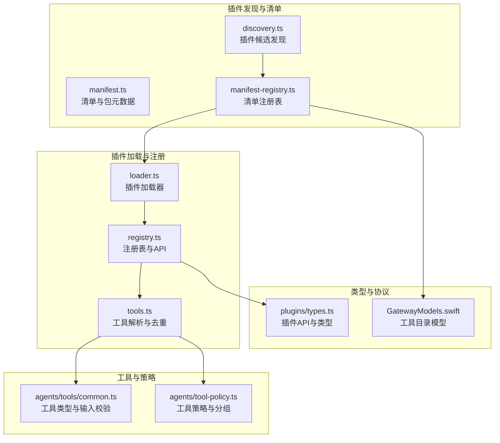
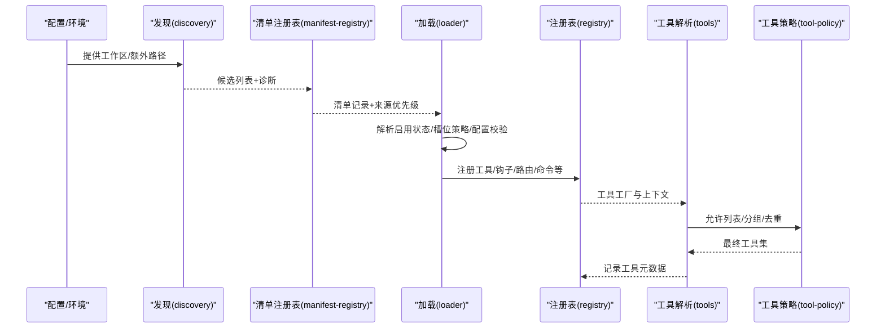
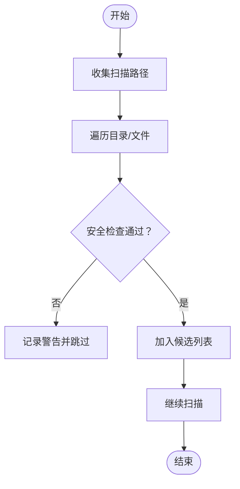
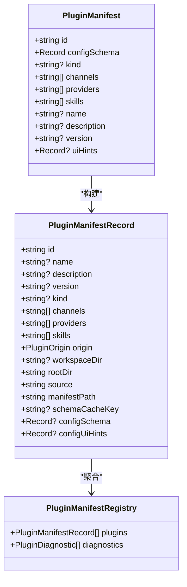
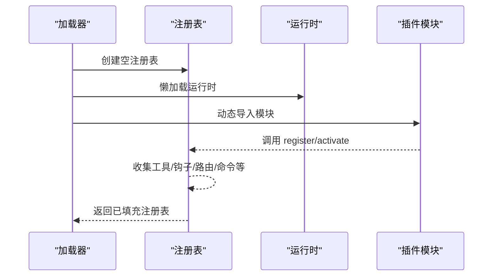
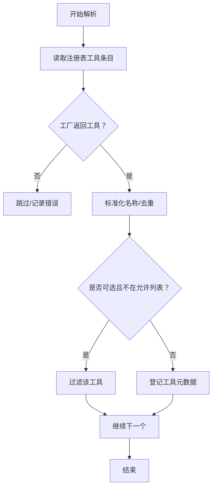
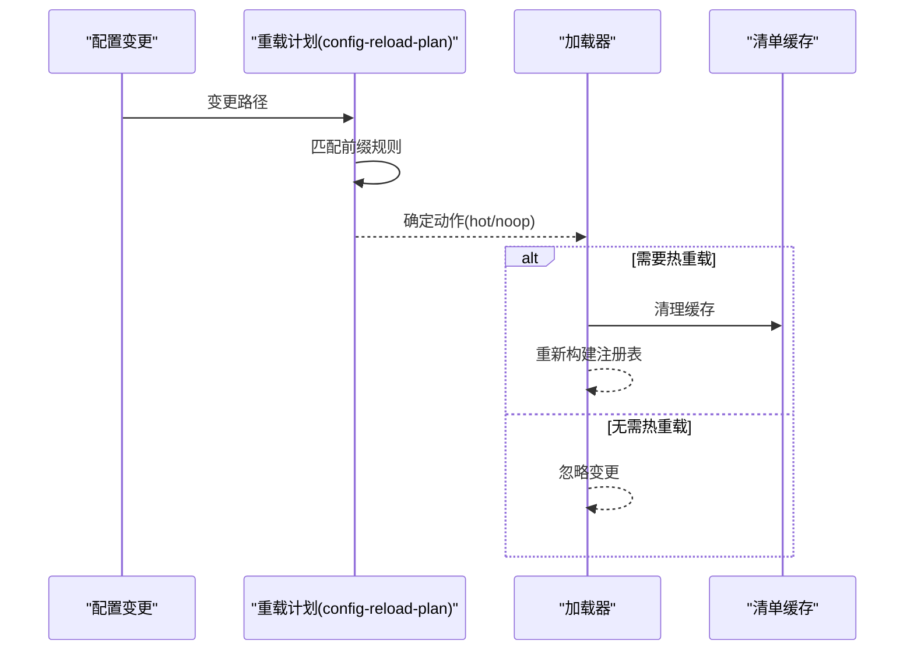
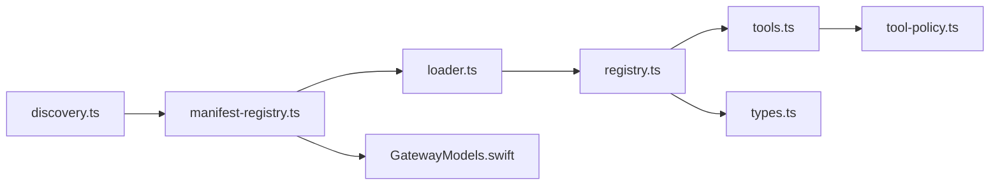

# 工具注册与发现

<cite>
**本文引用的文件**
- [src/plugins/discovery.ts](file://src/plugins/discovery.ts)
- [src/plugins/manifest-registry.ts](file://src/plugins/manifest-registry.ts)
- [src/plugins/manifest.ts](file://src/plugins/manifest.ts)
- [src/plugins/loader.ts](file://src/plugins/loader.ts)
- [src/plugins/tools.ts](file://src/plugins/tools.ts)
- [src/plugins/registry.ts](file://src/plugins/registry.ts)
- [src/plugins/types.ts](file://src/plugins/types.ts)
- [src/agents/tools/common.ts](file://src/agents/tools/common.ts)
- [src/agents/tool-policy.ts](file://src/agents/tool-policy.ts)
- [apps/shared/OpenClawKit/Sources/OpenClawProtocol/GatewayModels.swift](file://apps/shared/OpenClawKit/Sources/OpenClawProtocol/GatewayModels.swift)
- [apps/macos/Sources/OpenClawProtocol/GatewayModels.swift](file://apps/macos/Sources/OpenClawProtocol/GatewayModels.swift)
- [src/commands/doctor-config-flow.ts](file://src/commands/doctor-config-flow.ts)
- [src/gateway/config-reload-plan.ts](file://src/gateway/config-reload-plan.ts)
- [src/plugins/manifest-registry.ts](file://src/plugins/manifest-registry.ts)
- [src/commands/onboarding/plugin-install.ts](file://src/commands/onboarding/plugin-install.ts)
</cite>

## 目录
1. [简介](#简介)
2. [项目结构](#项目结构)
3. [核心组件](#核心组件)
4. [架构总览](#架构总览)
5. [详细组件分析](#详细组件分析)
6. [依赖关系分析](#依赖关系分析)
7. [性能考量](#性能考量)
8. [故障排查指南](#故障排查指南)
9. [结论](#结论)
10. [附录](#附录)

## 简介
本文件系统性阐述 OpenClaw 的“工具注册与发现”机制，覆盖工具注册流程、工具元数据管理、工具发现算法、工具分类与分组、依赖解析、版本管理、注册表数据结构、工具加载机制与热更新支持，并给出工具注册 API、元数据字段定义、工具验证规则、示例与调试方法、性能监控技巧。

## 项目结构
围绕工具注册与发现的关键模块分布于以下路径：
- 插件发现与清单：src/plugins/discovery.ts、src/plugins/manifest.ts、src/plugins/manifest-registry.ts
- 插件加载与注册表：src/plugins/loader.ts、src/plugins/registry.ts
- 工具解析与策略：src/plugins/tools.ts、src/agents/tool-policy.ts、src/agents/tools/common.ts
- 类型与协议：src/plugins/types.ts、apps/*/Sources/OpenClawProtocol/GatewayModels.swift
- 配置与热更新：src/gateway/config-reload-plan.ts、src/commands/doctor-config-flow.ts、src/commands/onboarding/plugin-install.ts

图示来源
- [src/plugins/discovery.ts](file://src/plugins/discovery.ts#L618-L711)
- [src/plugins/manifest.ts](file://src/plugins/manifest.ts#L1-L199)
- [src/plugins/manifest-registry.ts](file://src/plugins/manifest-registry.ts#L135-L261)
- [src/plugins/loader.ts](file://src/plugins/loader.ts#L480-L800)
- [src/plugins/registry.ts](file://src/plugins/registry.ts#L184-L607)
- [src/plugins/tools.ts](file://src/plugins/tools.ts#L45-L139)
- [src/agents/tools/common.ts](file://src/agents/tools/common.ts#L1-L341)
- [src/agents/tool-policy.ts](file://src/agents/tool-policy.ts#L1-L206)
- [src/plugins/types.ts](file://src/plugins/types.ts#L242-L300)
- [apps/shared/OpenClawKit/Sources/OpenClawProtocol/GatewayModels.swift](file://apps/shared/OpenClawKit/Sources/OpenClawProtocol/GatewayModels.swift#L2342-L2399)
- [apps/macos/Sources/OpenClawProtocol/GatewayModels.swift](file://apps/macos/Sources/OpenClawProtocol/GatewayModels.swift#L2342-L2399)

章节来源
- [src/plugins/discovery.ts](file://src/plugins/discovery.ts#L618-L711)
- [src/plugins/manifest.ts](file://src/plugins/manifest.ts#L1-L199)
- [src/plugins/manifest-registry.ts](file://src/plugins/manifest-registry.ts#L135-L261)
- [src/plugins/loader.ts](file://src/plugins/loader.ts#L480-L800)
- [src/plugins/registry.ts](file://src/plugins/registry.ts#L184-L607)
- [src/plugins/tools.ts](file://src/plugins/tools.ts#L45-L139)
- [src/agents/tools/common.ts](file://src/agents/tools/common.ts#L1-L341)
- [src/agents/tool-policy.ts](file://src/agents/tool-policy.ts#L1-L206)
- [src/plugins/types.ts](file://src/plugins/types.ts#L242-L300)
- [apps/shared/OpenClawKit/Sources/OpenClawProtocol/GatewayModels.swift](file://apps/shared/OpenClawKit/Sources/OpenClawProtocol/GatewayModels.swift#L2342-L2399)
- [apps/macos/Sources/OpenClawProtocol/GatewayModels.swift](file://apps/macos/Sources/OpenClawProtocol/GatewayModels.swift#L2342-L2399)

## 核心组件
- 插件发现（discovery.ts）：扫描工作区、全局扩展、捆绑插件与配置指定路径，生成候选列表并进行安全检查。
- 清单与注册表（manifest.ts、manifest-registry.ts）：解析 openclaw.plugin.json，构建清单记录，合并重复与来源优先级，缓存以提升性能。
- 插件加载（loader.ts）：按启用状态与槽位策略加载插件，执行配置校验，注入运行时，注册工具、钩子、HTTP 路由等。
- 注册表与API（registry.ts）：统一收集工具、钩子、通道、提供者、网关方法、CLI、服务、命令等，暴露插件API供插件注册。
- 工具解析与策略（tools.ts、tool-policy.ts、agents/tools/common.ts）：解析插件工厂产出的工具，去重与冲突处理，基于策略允许/拒绝工具，执行输入参数校验与安全门控。
- 类型与协议（types.ts、GatewayModels.swift）：定义插件API、工具上下文、钩子事件、HTTP路由、命令、提供者等类型；Swift 端工具目录模型用于跨平台展示。

章节来源
- [src/plugins/discovery.ts](file://src/plugins/discovery.ts#L618-L711)
- [src/plugins/manifest.ts](file://src/plugins/manifest.ts#L11-L119)
- [src/plugins/manifest-registry.ts](file://src/plugins/manifest-registry.ts#L23-L133)
- [src/plugins/loader.ts](file://src/plugins/loader.ts#L480-L800)
- [src/plugins/registry.ts](file://src/plugins/registry.ts#L184-L607)
- [src/plugins/tools.ts](file://src/plugins/tools.ts#L45-L139)
- [src/agents/tool-policy.ts](file://src/agents/tool-policy.ts#L54-L206)
- [src/agents/tools/common.ts](file://src/agents/tools/common.ts#L1-L341)
- [src/plugins/types.ts](file://src/plugins/types.ts#L242-L300)
- [apps/shared/OpenClawKit/Sources/OpenClawProtocol/GatewayModels.swift](file://apps/shared/OpenClawKit/Sources/OpenClawProtocol/GatewayModels.swift#L2342-L2399)
- [apps/macos/Sources/OpenClawProtocol/GatewayModels.swift](file://apps/macos/Sources/OpenClawProtocol/GatewayModels.swift#L2342-L2399)

## 架构总览
下图展示从“发现—清单—加载—注册—工具解析”的端到端流程。

图示来源
- [src/plugins/discovery.ts](file://src/plugins/discovery.ts#L618-L711)
- [src/plugins/manifest-registry.ts](file://src/plugins/manifest-registry.ts#L135-L261)
- [src/plugins/loader.ts](file://src/plugins/loader.ts#L480-L800)
- [src/plugins/registry.ts](file://src/plugins/registry.ts#L184-L607)
- [src/plugins/tools.ts](file://src/plugins/tools.ts#L45-L139)
- [src/agents/tool-policy.ts](file://src/agents/tool-policy.ts#L54-L206)

## 详细组件分析

### 组件A：插件发现与安全检查
- 发现范围：配置路径、工作区扩展目录、捆绑插件目录、全局扩展目录。
- 安全检查：禁止源逃逸根目录、禁止世界可写路径、禁止可疑属主（非捆绑场景）。
- 缓存：基于用户路径、UID、扩展根等键值缓存，降低重复扫描成本。

图示来源
- [src/plugins/discovery.ts](file://src/plugins/discovery.ts#L618-L711)

章节来源
- [src/plugins/discovery.ts](file://src/plugins/discovery.ts#L618-L711)

### 组件B：清单解析与注册表
- 清单字段：id、configSchema、kind、channels/providers/skills、name/description/version、uiHints。
- 注册表记录：聚合清单信息，合并重复（同物理路径视为同一插件），按来源优先级覆盖，生成 schema 缓存键。
- 缓存：基于工作区与加载路径构建缓存键，支持 TTL 控制。

图示来源
- [src/plugins/manifest.ts](file://src/plugins/manifest.ts#L11-L119)
- [src/plugins/manifest-registry.ts](file://src/plugins/manifest-registry.ts#L23-L133)
- [src/plugins/manifest-registry.ts](file://src/plugins/manifest-registry.ts#L135-L261)

章节来源
- [src/plugins/manifest.ts](file://src/plugins/manifest.ts#L11-L119)
- [src/plugins/manifest-registry.ts](file://src/plugins/manifest-registry.ts#L23-L133)
- [src/plugins/manifest-registry.ts](file://src/plugins/manifest-registry.ts#L135-L261)

### 组件C：插件加载与注册表API
- 加载流程：构建注册表，解析启用状态与槽位策略，加载插件模块，执行配置校验，注入运行时，注册各类能力。
- 注册表API：registerTool/registerHook/registerHttpRoute/registerChannel/registerProvider/registerGatewayMethod/registerCli/registerService/registerCommand/on 等。
- 运行时代理：延迟初始化，避免无用依赖加载。

图示来源
- [src/plugins/loader.ts](file://src/plugins/loader.ts#L480-L800)
- [src/plugins/registry.ts](file://src/plugins/registry.ts#L184-L607)

章节来源
- [src/plugins/loader.ts](file://src/plugins/loader.ts#L480-L800)
- [src/plugins/registry.ts](file://src/plugins/registry.ts#L184-L607)

### 组件D：工具解析与策略
- 工具解析：遍历注册表中的工具工厂，调用产出工具或工具数组，去重与冲突检测，记录插件来源与可选标记。
- 策略与分组：支持允许列表、插件组（group:plugins）、核心工具与插件工具区分，自动剥离仅插件工具的允许列表以避免误禁用核心工具。
- 输入校验：提供通用参数读取与校验工具，保障工具入参安全。

图示来源
- [src/plugins/tools.ts](file://src/plugins/tools.ts#L45-L139)
- [src/agents/tool-policy.ts](file://src/agents/tool-policy.ts#L54-L206)
- [src/agents/tools/common.ts](file://src/agents/tools/common.ts#L74-L201)

章节来源
- [src/plugins/tools.ts](file://src/plugins/tools.ts#L45-L139)
- [src/agents/tool-policy.ts](file://src/agents/tool-policy.ts#L54-L206)
- [src/agents/tools/common.ts](file://src/agents/tools/common.ts#L74-L201)

### 组件E：工具分类体系与依赖解析
- 分类：通过清单字段 channels/providers/skills 将插件归类为不同领域能力。
- 依赖解析：通过插件 entries.config 中的 allow/deny 与 group:plugins 等策略，结合工具分组计算最终可用工具集合。
- 版本管理：清单 version 字段与 schema 缓存键结合，确保配置变更时重新校验。

章节来源
- [src/plugins/manifest.ts](file://src/plugins/manifest.ts#L11-L119)
- [src/plugins/manifest-registry.ts](file://src/plugins/manifest-registry.ts#L107-L133)
- [src/agents/tool-policy.ts](file://src/agents/tool-policy.ts#L54-L206)

### 组件F：工具注册API与元数据字段
- 注册API（OpenClawPluginApi）：registerTool、registerHook、registerHttpRoute、registerChannel、registerProvider、registerGatewayMethod、registerCli、registerService、registerCommand、on、resolvePath。
- 元数据字段（openclaw.plugin.json）：id、configSchema、kind、channels、providers、skills、name、description、version、uiHints。
- Swift 工具目录模型：ToolCatalogEntry/ToolCatalogGroup 包含 id、label、description、source、pluginId、optional、defaultProfiles 等字段，用于前端展示。

章节来源
- [src/plugins/types.ts](file://src/plugins/types.ts#L257-L300)
- [src/plugins/manifest.ts](file://src/plugins/manifest.ts#L11-L119)
- [apps/shared/OpenClawKit/Sources/OpenClawProtocol/GatewayModels.swift](file://apps/shared/OpenClawKit/Sources/OpenClawProtocol/GatewayModels.swift#L2342-L2399)
- [apps/macos/Sources/OpenClawProtocol/GatewayModels.swift](file://apps/macos/Sources/OpenClawProtocol/GatewayModels.swift#L2342-L2399)

### 组件G：工具验证规则
- 清单校验：必须存在 id 与 configSchema；kind/name/description/version 可选；channels/providers/skills 为字符串数组。
- 配置校验：使用 JSON Schema 对插件配置进行 validate/safeParse/parse。
- 安全校验：禁止入口逃逸根目录、世界可写、可疑属主；对捆绑插件放宽限制。

章节来源
- [src/plugins/manifest.ts](file://src/plugins/manifest.ts#L45-L119)
- [src/plugins/loader.ts](file://src/plugins/loader.ts#L208-L227)
- [src/plugins/discovery.ts](file://src/plugins/discovery.ts#L117-L251)

### 组件H：工具加载机制与热更新支持
- 加载机制：按启用状态与槽位策略决定是否加载；对捆绑内存插件进行早停以减少开销；动态导入模块并注入运行时。
- 热更新：基于配置前缀匹配与通道插件 reload 规则，实现部分配置变更的热重载或无操作；支持清理插件清单缓存以触发重建。

图示来源
- [src/gateway/config-reload-plan.ts](file://src/gateway/config-reload-plan.ts#L100-L140)
- [src/plugins/manifest-registry.ts](file://src/plugins/manifest-registry.ts#L52-L77)
- [src/commands/onboarding/plugin-install.ts](file://src/commands/onboarding/plugin-install.ts#L204-L218)

章节来源
- [src/gateway/config-reload-plan.ts](file://src/gateway/config-reload-plan.ts#L100-L140)
- [src/plugins/manifest-registry.ts](file://src/plugins/manifest-registry.ts#L52-L77)
- [src/commands/onboarding/plugin-install.ts](file://src/commands/onboarding/plugin-install.ts#L204-L218)

## 依赖关系分析
- 发现依赖清单：发现阶段依赖清单解析结果进行来源优先级与重复处理。
- 加载依赖注册表：加载阶段依赖注册表提供的清单记录与启用状态。
- 工具解析依赖策略：工具解析阶段依赖策略模块进行允许列表展开与去重。
- 类型与协议：注册表API与工具类型在 TypeScript 侧定义，Swift 端模型用于跨平台展示。

图示来源
- [src/plugins/discovery.ts](file://src/plugins/discovery.ts#L618-L711)
- [src/plugins/manifest-registry.ts](file://src/plugins/manifest-registry.ts#L135-L261)
- [src/plugins/loader.ts](file://src/plugins/loader.ts#L480-L800)
- [src/plugins/registry.ts](file://src/plugins/registry.ts#L184-L607)
- [src/plugins/tools.ts](file://src/plugins/tools.ts#L45-L139)
- [src/agents/tool-policy.ts](file://src/agents/tool-policy.ts#L54-L206)
- [src/plugins/types.ts](file://src/plugins/types.ts#L242-L300)
- [apps/shared/OpenClawKit/Sources/OpenClawProtocol/GatewayModels.swift](file://apps/shared/OpenClawKit/Sources/OpenClawProtocol/GatewayModels.swift#L2342-L2399)

章节来源
- [src/plugins/discovery.ts](file://src/plugins/discovery.ts#L618-L711)
- [src/plugins/manifest-registry.ts](file://src/plugins/manifest-registry.ts#L135-L261)
- [src/plugins/loader.ts](file://src/plugins/loader.ts#L480-L800)
- [src/plugins/registry.ts](file://src/plugins/registry.ts#L184-L607)
- [src/plugins/tools.ts](file://src/plugins/tools.ts#L45-L139)
- [src/agents/tool-policy.ts](file://src/agents/tool-policy.ts#L54-L206)
- [src/plugins/types.ts](file://src/plugins/types.ts#L242-L300)
- [apps/shared/OpenClawKit/Sources/OpenClawProtocol/GatewayModels.swift](file://apps/shared/OpenClawKit/Sources/OpenClawProtocol/GatewayModels.swift#L2342-L2399)

## 性能考量
- 缓存策略：插件发现与清单注册表均支持 TTL 缓存，可通过环境变量控制缓存时长与禁用开关，降低启动与变更时的 IO 成本。
- 懒加载运行时：注册表 API 在首次访问时才初始化运行时，避免不必要的依赖加载。
- 早停策略：对捆绑内存插件根据槽位策略提前判断是否加载，减少无效模块导入。
- 允许列表优化：策略层对仅插件工具的允许列表进行剥离，避免误禁用核心工具，减少后续筛选成本。

章节来源
- [src/plugins/manifest-registry.ts](file://src/plugins/manifest-registry.ts#L47-L77)
- [src/plugins/discovery.ts](file://src/plugins/discovery.ts#L36-L66)
- [src/plugins/loader.ts](file://src/plugins/loader.ts#L506-L535)
- [src/plugins/loader.ts](file://src/plugins/loader.ts#L669-L686)
- [src/agents/tool-policy.ts](file://src/agents/tool-policy.ts#L184-L195)

## 故障排查指南
- 清单加载失败：检查 openclaw.plugin.json 是否存在 id 与 configSchema；确认路径安全与权限设置。
- 插件未加载：查看启用状态与槽位策略；确认 allow/deny 与 group:plugins 是否正确；检查配置校验错误。
- 工具冲突：检查工具名重复或与核心工具冲突；查看诊断日志中的冲突提示。
- 热更新不生效：确认变更路径是否命中重载规则；必要时清理清单缓存后重启加载。
- 配置迁移：扫描旧版 toolsBySender 键，按提示修正为新格式。

章节来源
- [src/plugins/manifest.ts](file://src/plugins/manifest.ts#L45-L119)
- [src/plugins/loader.ts](file://src/plugins/loader.ts#L648-L659)
- [src/plugins/tools.ts](file://src/plugins/tools.ts#L115-L127)
- [src/gateway/config-reload-plan.ts](file://src/gateway/config-reload-plan.ts#L100-L140)
- [src/commands/doctor-config-flow.ts](file://src/commands/doctor-config-flow.ts#L1636-L1689)

## 结论
OpenClaw 的工具注册与发现机制通过“发现—清单—加载—注册—解析—策略”的链路，实现了安全、可扩展、可热更新的工具系统。其关键优势在于：
- 明确的安全边界与缓存策略；
- 清晰的插件 API 与注册表抽象；
- 灵活的工具策略与分组；
- 与配置热更新联动的动态能力。

开发者可据此快速扩展工具生态，同时保持系统稳定与可观测性。

## 附录
- 工具注册示例（步骤说明）
  - 在插件中导出 register/activate 函数，使用 OpenClawPluginApi.registerTool 注册工具。
  - 在 openclaw.plugin.json 中声明 configSchema 与 kind/channels/providers/skills 等元数据。
  - 通过 plugins.entries 配置启用状态、允许列表与槽位策略。
- 调试方法
  - 查看插件诊断日志与注册表诊断信息。
  - 使用环境变量控制缓存行为与日志级别。
  - 通过 doctor-config-flow 扫描并修复配置问题。
- 性能监控技巧
  - 关注发现与清单缓存命中率。
  - 监控工具解析耗时与策略展开成本。
  - 利用热重载规则减少不必要的重启。

章节来源
- [src/plugins/types.ts](file://src/plugins/types.ts#L257-L300)
- [src/plugins/manifest.ts](file://src/plugins/manifest.ts#L11-L119)
- [src/plugins/loader.ts](file://src/plugins/loader.ts#L480-L800)
- [src/commands/doctor-config-flow.ts](file://src/commands/doctor-config-flow.ts#L1636-L1689)