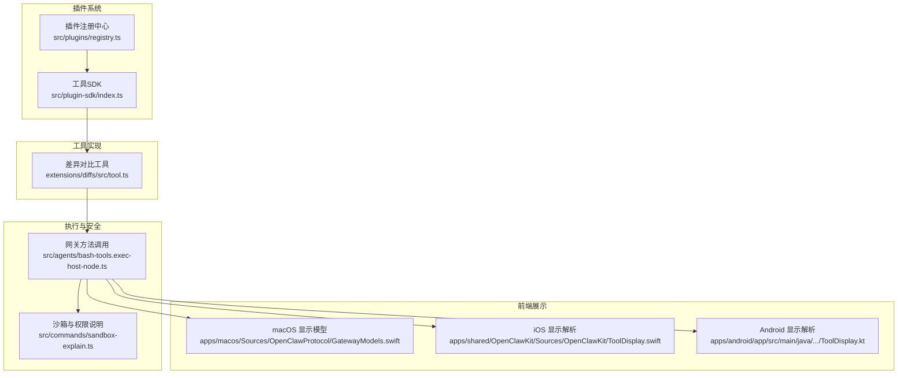
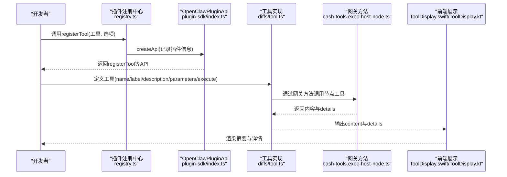
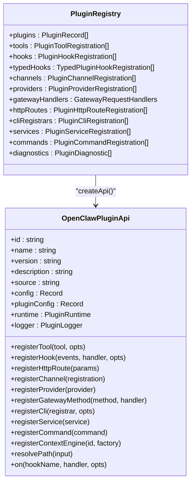
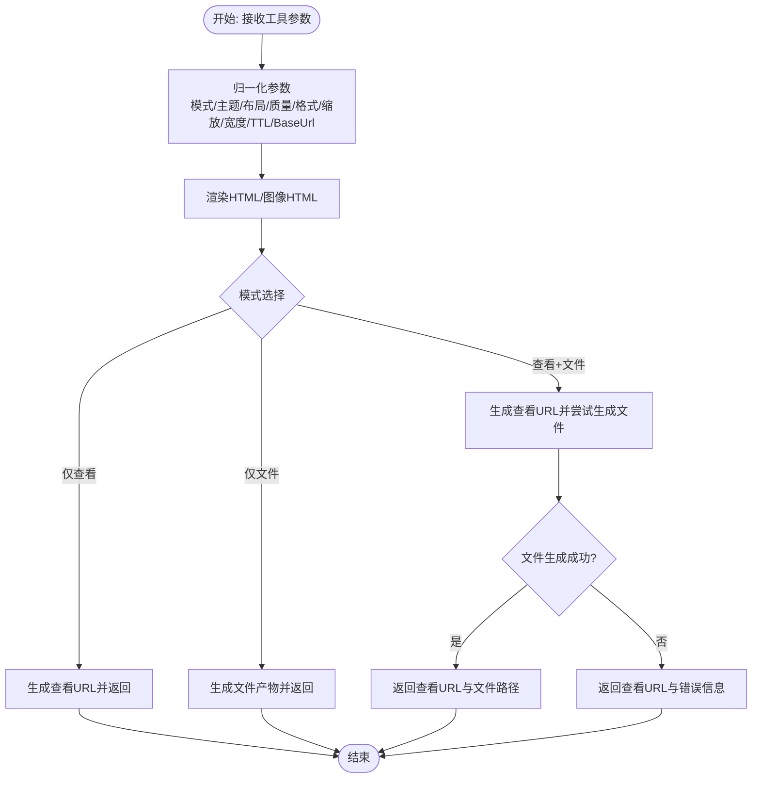
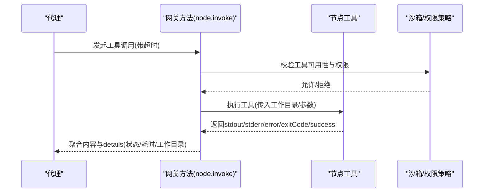
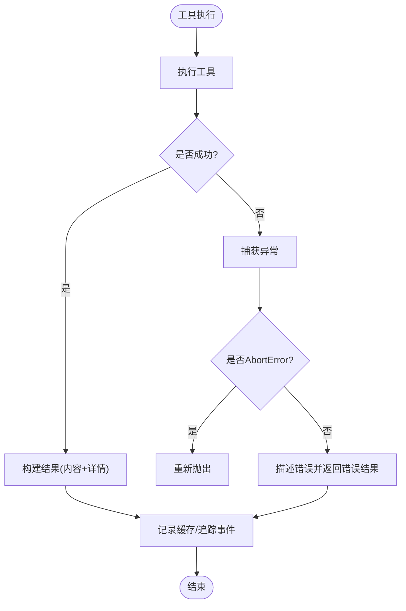
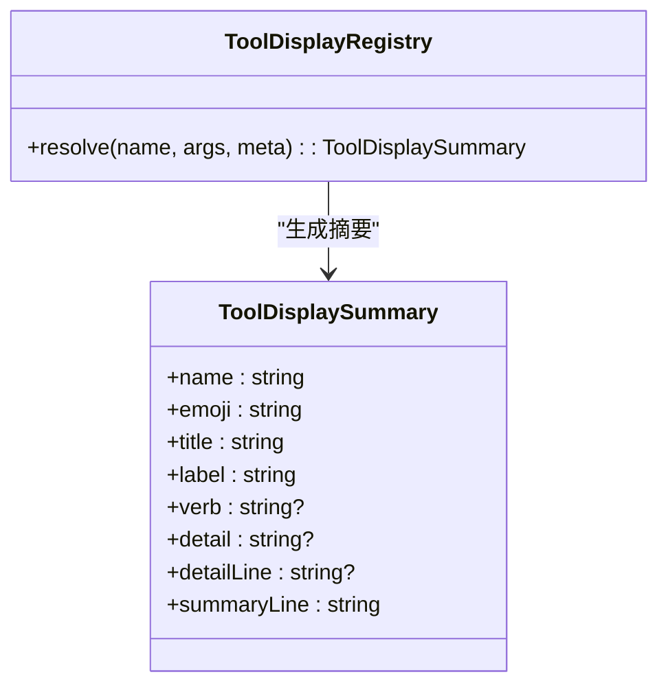
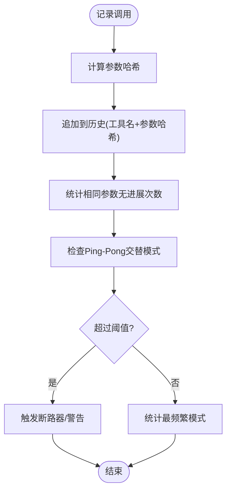
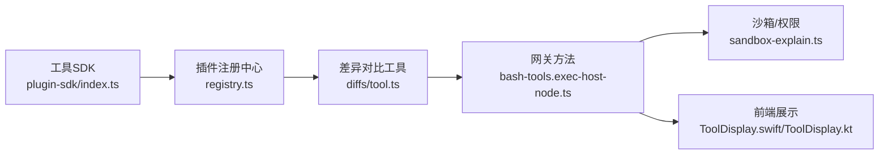

# 工具系统

<cite>
**本文引用的文件**
- [src/plugins/registry.ts](file://src/plugins/registry.ts)
- [src/plugin-sdk/index.ts](file://src/plugin-sdk/index.ts)
- [extensions/diffs/src/tool.ts](file://extensions/diffs/src/tool.ts)
- [src/agents/tool-loop-detection.ts](file://src/agents/tool-loop-detection.ts)
- [src/agents/bash-tools.exec-host-node.ts](file://src/agents/bash-tools.exec-host-node.ts)
- [src/agents/pi-embedded-runner/run/payloads.ts](file://src/agents/pi-embedded-runner/run/payloads.ts)
- [src/agents/pi-embedded-subscribe.tools.ts](file://src/agents/pi-embedded-subscribe.tools.ts)
- [src/agents/pi-tool-definition-adapter.ts](file://src/agents/pi-tool-definition-adapter.ts)
- [apps/macos/Sources/OpenClawProtocol/GatewayModels.swift](file://apps/macos/Sources/OpenClawProtocol/GatewayModels.swift)
- [apps/shared/OpenClawKit/Sources/OpenClawKit/ToolDisplay.swift](file://apps/shared/OpenClawKit/Sources/OpenClawKit/ToolDisplay.swift)
- [apps/android/app/src/main/java/ai/openclaw/android/tools/ToolDisplay.kt](file://apps/android/app/src/main/java/ai/openclaw/android/tools/ToolDisplay.kt)
- [src/commands/sandbox-explain.ts](file://src/commands/sandbox-explain.ts)
- [src/gateway/android-node.capabilities.live.test.ts](file://src/gateway/android-node.capabilities.live.test.ts)
- [src/agents/cache-trace.ts](file://src/agents/cache-trace.ts)
- [src/agents/pi-embedded-runner/cache-ttl.ts](file://src/agents/pi-embedded-runner/cache-ttl.ts)
- [src/memory/search-manager.ts](file://src/memory/search-manager.ts)
- [src/auto-reply/status.ts](file://src/auto-reply/status.ts)
- [extensions/feishu/src/tool-factory-test-harness.ts](file://extensions/feishu/src/tool-factory-test-harness.ts)
</cite>

## 目录
1. [简介](#简介)
2. [项目结构](#项目结构)
3. [核心组件](#核心组件)
4. [架构总览](#架构总览)
5. [详细组件分析](#详细组件分析)
6. [依赖关系分析](#依赖关系分析)
7. [性能考量](#性能考量)
8. [故障排查指南](#故障排查指南)
9. [结论](#结论)
10. [附录](#附录)

## 简介
本文件面向OpenClaw工具系统，系统性阐述工具的注册机制、调用流程、参数传递、内置工具特性、自定义工具开发方法、权限与沙箱控制、生命周期管理、错误处理与结果缓存，并提供开发指南、API规范、性能优化建议、示例与测试方法。

## 项目结构
OpenClaw工具系统由“插件注册中心”“工具SDK”“具体工具实现”“执行与安全沙箱”“前端展示”等模块协同组成。核心入口包括：
- 插件注册中心：负责统一注册工具、钩子、HTTP路由、CLI命令等。
- 工具SDK：提供工具类型、参数校验、通用工具能力与辅助函数。
- 具体工具：如差异对比工具，演示参数Schema、执行逻辑与产物输出。
- 执行与沙箱：通过网关方法调用节点工具、执行策略与权限控制。
- 展示层：多端（macOS、Android、共享库）对工具显示进行统一解析与渲染。

图表来源
- [src/plugins/registry.ts](file://src/plugins/registry.ts#L184-L607)
- [src/plugin-sdk/index.ts](file://src/plugin-sdk/index.ts#L1-L727)
- [extensions/diffs/src/tool.ts](file://extensions/diffs/src/tool.ts#L133-L296)
- [src/agents/bash-tools.exec-host-node.ts](file://src/agents/bash-tools.exec-host-node.ts#L344-L374)
- [src/commands/sandbox-explain.ts](file://src/commands/sandbox-explain.ts#L218-L262)
- [apps/macos/Sources/OpenClawProtocol/GatewayModels.swift](file://apps/macos/Sources/OpenClawProtocol/GatewayModels.swift#L2342-L2399)
- [apps/shared/OpenClawKit/Sources/OpenClawKit/ToolDisplay.swift](file://apps/shared/OpenClawKit/Sources/OpenClawKit/ToolDisplay.swift#L1-L81)
- [apps/android/app/src/main/java/ai/openclaw/android/tools/ToolDisplay.kt](file://apps/android/app/src/main/java/ai/openclaw/android/tools/ToolDisplay.kt#L1-L142)

章节来源
- [src/plugins/registry.ts](file://src/plugins/registry.ts#L184-L607)
- [src/plugin-sdk/index.ts](file://src/plugin-sdk/index.ts#L1-L727)

## 核心组件
- 插件注册中心：提供registerTool、registerHook、registerGatewayMethod、registerCli、registerService、registerCommand等注册能力；维护工具清单、钩子、HTTP路由、CLI命令、服务等元数据。
- 工具SDK：导出AnyAgentTool、OpenClawPluginApi、工具通用类型与辅助函数，支撑工具参数Schema、执行器封装、错误处理等。
- 工具实现：以差异对比工具为例，展示参数Schema定义、输入归一化、渲染与产物生成、错误处理与细节返回。
- 执行与沙箱：通过网关方法“node.invoke”调用节点侧工具，结合沙箱配置与权限策略，控制工具可用范围与执行环境。
- 前端展示：多端统一解析工具名称、动作、详情键，生成摘要行与标签，支持回退与本地化。

章节来源
- [src/plugins/registry.ts](file://src/plugins/registry.ts#L192-L217)
- [src/plugin-sdk/index.ts](file://src/plugin-sdk/index.ts#L98-L106)
- [extensions/diffs/src/tool.ts](file://extensions/diffs/src/tool.ts#L133-L296)
- [src/agents/bash-tools.exec-host-node.ts](file://src/agents/bash-tools.exec-host-node.ts#L344-L374)
- [src/commands/sandbox-explain.ts](file://src/commands/sandbox-explain.ts#L218-L262)
- [apps/shared/OpenClawKit/Sources/OpenClawKit/ToolDisplay.swift](file://apps/shared/OpenClawKit/Sources/OpenClawKit/ToolDisplay.swift#L26-L81)
- [apps/android/app/src/main/java/ai/openclaw/android/tools/ToolDisplay.kt](file://apps/android/app/src/main/java/ai/openclaw/android/tools/ToolDisplay.kt#L54-L142)

## 架构总览
工具系统采用“插件注册—工具定义—执行调度—结果反馈—展示呈现”的闭环架构。插件通过API注册工具，工具在运行时被解析为可执行单元；执行通过网关方法调用节点侧能力；结果经错误处理与细节封装后，由前端统一展示。

图表来源
- [src/plugins/registry.ts](file://src/plugins/registry.ts#L558-L606)
- [src/plugin-sdk/index.ts](file://src/plugin-sdk/index.ts#L98-L106)
- [extensions/diffs/src/tool.ts](file://extensions/diffs/src/tool.ts#L133-L296)
- [src/agents/bash-tools.exec-host-node.ts](file://src/agents/bash-tools.exec-host-node.ts#L344-L374)
- [apps/shared/OpenClawKit/Sources/OpenClawKit/ToolDisplay.swift](file://apps/shared/OpenClawKit/Sources/OpenClawKit/ToolDisplay.swift#L48-L81)
- [apps/android/app/src/main/java/ai/openclaw/android/tools/ToolDisplay.kt](file://apps/android/app/src/main/java/ai/openclaw/android/tools/ToolDisplay.kt#L60-L109)

## 详细组件分析

### 组件A：插件注册中心与工具注册
- 注册机制：registerTool接收工具或工厂，自动规范化名称列表并写入注册表；支持可选工具标记。
- API封装：createApi提供config、logger、registerTool等能力，供插件在加载时使用。
- 元数据维护：记录插件拥有的工具名、钩子、通道、提供方、网关方法、CLI命令、服务、HTTP路由等。

图表来源
- [src/plugins/registry.ts](file://src/plugins/registry.ts#L128-L141)
- [src/plugins/registry.ts](file://src/plugins/registry.ts#L558-L606)

章节来源
- [src/plugins/registry.ts](file://src/plugins/registry.ts#L192-L217)
- [src/plugins/registry.ts](file://src/plugins/registry.ts#L558-L606)

### 组件B：工具定义与执行流程
- 工具定义：以差异对比工具为例，定义name、label、description、parameters Schema与execute函数。
- 参数校验：基于TypeBox构建Schema，限制字段类型、长度与枚举值；执行前进行参数归一化与校验。
- 执行逻辑：根据模式选择“仅查看”“仅文件”“查看+文件”，生成HTML、截图、产物路径与过期时间；失败时按模式返回友好提示。
- 结果封装：content为消息内容，details包含标题、输入类型、文件数量、模式、产物路径、尺寸、格式、质量、缩放、最大宽度等。

图表来源
- [extensions/diffs/src/tool.ts](file://extensions/diffs/src/tool.ts#L133-L296)
- [extensions/diffs/src/tool.ts](file://extensions/diffs/src/tool.ts#L346-L376)

章节来源
- [extensions/diffs/src/tool.ts](file://extensions/diffs/src/tool.ts#L133-L296)

### 组件C：执行与权限控制
- 网关调用：通过“node.invoke”调用节点侧工具，聚合stdout/stderr/error文本，提取退出码与状态，封装为工具执行结果。
- 沙箱与权限：命令行解释工具输出沙箱模式、作用域、会话级沙箱、工作区访问与工具白名单/黑名单；支持提升权限通道与令牌来源。
- 错误评估：对命令结果进行成功/失败判定，允许/拒绝特定错误码，记录耗时与命令。

图表来源
- [src/agents/bash-tools.exec-host-node.ts](file://src/agents/bash-tools.exec-host-node.ts#L344-L374)
- [src/commands/sandbox-explain.ts](file://src/commands/sandbox-explain.ts#L218-L262)
- [src/gateway/android-node.capabilities.live.test.ts](file://src/gateway/android-node.capabilities.live.test.ts#L375-L424)

章节来源
- [src/agents/bash-tools.exec-host-node.ts](file://src/agents/bash-tools.exec-host-node.ts#L344-L374)
- [src/commands/sandbox-explain.ts](file://src/commands/sandbox-explain.ts#L218-L262)
- [src/gateway/android-node.capabilities.live.test.ts](file://src/gateway/android-node.capabilities.live.test.ts#L375-L424)

### 组件D：错误处理与结果缓存
- 错误处理：工具执行适配器捕获异常，区分AbortError与普通错误，描述错误并返回标准化错误结果；订阅工具从返回中提取错误字段并归一化。
- 结果缓存：缓存追踪记录运行阶段事件；Pi嵌入式运行器维护缓存TTL时间戳；内存检索管理缓存淘汰；自动回复统计中包含缓存命中率与新增量。

图表来源
- [src/agents/pi-tool-definition-adapter.ts](file://src/agents/pi-tool-definition-adapter.ts#L167-L190)
- [src/agents/pi-embedded-subscribe.tools.ts](file://src/agents/pi-embedded-subscribe.tools.ts#L33-L84)
- [src/agents/cache-trace.ts](file://src/agents/cache-trace.ts#L167-L192)
- [src/agents/pi-embedded-runner/cache-ttl.ts](file://src/agents/pi-embedded-runner/cache-ttl.ts#L38-L76)
- [src/memory/search-manager.ts](file://src/memory/search-manager.ts#L223-L236)
- [src/auto-reply/status.ts](file://src/auto-reply/status.ts#L315-L343)

章节来源
- [src/agents/pi-tool-definition-adapter.ts](file://src/agents/pi-tool-definition-adapter.ts#L167-L190)
- [src/agents/pi-embedded-subscribe.tools.ts](file://src/agents/pi-embedded-subscribe.tools.ts#L33-L84)
- [src/agents/cache-trace.ts](file://src/agents/cache-trace.ts#L167-L192)
- [src/agents/pi-embedded-runner/cache-ttl.ts](file://src/agents/pi-embedded-runner/cache-ttl.ts#L38-L76)
- [src/memory/search-manager.ts](file://src/memory/search-manager.ts#L223-L236)
- [src/auto-reply/status.ts](file://src/auto-reply/status.ts#L315-L343)

### 组件E：前端展示与摘要
- 多端统一：macOS与iOS共享工具显示模型；Android提供显示配置与摘要行生成。
- 解析规则：根据工具名、动作、详情键与meta生成emoji、标题、标签、动词与详情；支持回退与路径简写。

图表来源
- [apps/shared/OpenClawKit/Sources/OpenClawKit/ToolDisplay.swift](file://apps/shared/OpenClawKit/Sources/OpenClawKit/ToolDisplay.swift#L1-L81)
- [apps/android/app/src/main/java/ai/openclaw/android/tools/ToolDisplay.kt](file://apps/android/app/src/main/java/ai/openclaw/android/tools/ToolDisplay.kt#L1-L142)
- [apps/macos/Sources/OpenClawProtocol/GatewayModels.swift](file://apps/macos/Sources/OpenClawProtocol/GatewayModels.swift#L2342-L2399)

章节来源
- [apps/shared/OpenClawKit/Sources/OpenClawKit/ToolDisplay.swift](file://apps/shared/OpenClawKit/Sources/OpenClawKit/ToolDisplay.swift#L26-L81)
- [apps/android/app/src/main/java/ai/openclaw/android/tools/ToolDisplay.kt](file://apps/android/app/src/main/java/ai/openclaw/android/tools/ToolDisplay.kt#L54-L142)
- [apps/macos/Sources/OpenClawProtocol/GatewayModels.swift](file://apps/macos/Sources/OpenClawProtocol/GatewayModels.swift#L2342-L2399)

### 组件F：循环检测与鲁棒性
- 循环检测：基于工具调用历史与参数哈希识别重复调用、已知轮询无进展、Ping-Pong交替等模式；超过阈值触发警告或全局断路器阻断。
- 记录与统计：记录调用签名与结果哈希，维护滑动窗口；提供统计接口用于调试与监控。

图表来源
- [src/agents/tool-loop-detection.ts](file://src/agents/tool-loop-detection.ts#L372-L495)
- [src/agents/tool-loop-detection.ts](file://src/agents/tool-loop-detection.ts#L501-L588)

章节来源
- [src/agents/tool-loop-detection.ts](file://src/agents/tool-loop-detection.ts#L1-L624)

## 依赖关系分析
- 插件注册中心依赖工具SDK提供的类型与API；工具实现依赖SDK中的工具类型与通用工具能力。
- 工具执行依赖网关方法与节点工具；前端展示依赖统一的显示模型与解析逻辑。
- 权限与沙箱策略贯穿执行链路，影响工具可用性与执行行为。

图表来源
- [src/plugin-sdk/index.ts](file://src/plugin-sdk/index.ts#L98-L106)
- [src/plugins/registry.ts](file://src/plugins/registry.ts#L558-L606)
- [extensions/diffs/src/tool.ts](file://extensions/diffs/src/tool.ts#L133-L296)
- [src/agents/bash-tools.exec-host-node.ts](file://src/agents/bash-tools.exec-host-node.ts#L344-L374)
- [src/commands/sandbox-explain.ts](file://src/commands/sandbox-explain.ts#L218-L262)
- [apps/shared/OpenClawKit/Sources/OpenClawKit/ToolDisplay.swift](file://apps/shared/OpenClawKit/Sources/OpenClawKit/ToolDisplay.swift#L48-L81)
- [apps/android/app/src/main/java/ai/openclaw/android/tools/ToolDisplay.kt](file://apps/android/app/src/main/java/ai/openclaw/android/tools/ToolDisplay.kt#L60-L109)

章节来源
- [src/plugin-sdk/index.ts](file://src/plugin-sdk/index.ts#L1-L727)
- [src/plugins/registry.ts](file://src/plugins/registry.ts#L184-L607)

## 性能考量
- 参数校验与归一化：在工具执行前完成，避免无效调用与重复开销。
- 缓存与追踪：启用缓存追踪与TTL管理，减少重复渲染与IO；内存检索缓存淘汰策略降低占用。
- 执行聚合：将stdout/stderr/error聚合为单一内容，减少消息碎片。
- 循环检测：通过断路器与阈值控制，防止资源浪费与长时间无效轮询。

## 故障排查指南
- 输入参数错误：工具实现中对参数大小与格式进行严格限制，出现错误时抛出自定义输入错误类型，便于定位问题。
- 执行失败：通过网关调用评估错误码与消息，区分预期/非预期错误；结合断路器与循环检测避免无限重试。
- 结果解析：订阅工具从返回中提取错误字段并归一化，便于统一处理。

章节来源
- [extensions/diffs/src/tool.ts](file://extensions/diffs/src/tool.ts#L427-L432)
- [src/agents/pi-embedded-subscribe.tools.ts](file://src/agents/pi-embedded-subscribe.tools.ts#L33-L84)
- [src/gateway/android-node.capabilities.live.test.ts](file://src/gateway/android-node.capabilities.live.test.ts#L396-L424)

## 结论
OpenClaw工具系统通过插件注册中心与工具SDK实现统一的工具定义与执行框架；结合网关方法与沙箱策略保障安全可控；前端展示提供一致的摘要与详情呈现；配合循环检测、错误处理与缓存机制，形成高可靠、可扩展、易维护的工具生态。

## 附录

### 开发指南
- 使用OpenClawPluginApi.registerTool注册工具，提供name、label、description、parameters Schema与execute函数。
- 在execute中进行参数归一化与校验，按模式生成HTML/图像与产物文件，返回标准content与details。
- 遵循沙箱与权限策略，必要时通过命令行解释工具了解当前策略与修复建议。

章节来源
- [src/plugin-sdk/index.ts](file://src/plugin-sdk/index.ts#L98-L106)
- [src/plugins/registry.ts](file://src/plugins/registry.ts#L192-L217)
- [extensions/diffs/src/tool.ts](file://extensions/diffs/src/tool.ts#L133-L296)
- [src/commands/sandbox-explain.ts](file://src/commands/sandbox-explain.ts#L218-L262)

### API接口规范
- 工具类型：AnyAgentTool，包含name、label、description、parameters、execute。
- 插件API：OpenClawPluginApi，提供config、logger、registerTool、registerHook、registerGatewayMethod、registerCli、registerService、registerCommand、registerContextEngine、resolvePath、on等。

章节来源
- [src/plugin-sdk/index.ts](file://src/plugin-sdk/index.ts#L98-L106)
- [src/plugins/registry.ts](file://src/plugins/registry.ts#L558-L606)

### 自定义工具开发示例
- 参考差异对比工具：定义参数Schema、执行逻辑、产物生成与错误处理，确保details包含必要元信息。

章节来源
- [extensions/diffs/src/tool.ts](file://extensions/diffs/src/tool.ts#L133-L296)

### 集成测试方法
- 使用工具工厂测试夹具解析工具，验证工具注册与解析流程。
- 对网关调用进行端到端测试，评估成功/失败场景与错误码处理。

章节来源
- [extensions/feishu/src/tool-factory-test-harness.ts](file://extensions/feishu/src/tool-factory-test-harness.ts#L37-L76)
- [src/gateway/android-node.capabilities.live.test.ts](file://src/gateway/android-node.capabilities.live.test.ts#L375-L424)

### 调试技巧
- 启用缓存追踪与统计，观察缓存命中率与新增量，定位性能瓶颈。
- 利用循环检测统计接口，识别高频重复调用与无进展模式。
- 在前端展示中核对工具摘要与详情键，确保信息一致性与可读性。

章节来源
- [src/agents/cache-trace.ts](file://src/agents/cache-trace.ts#L167-L192)
- [src/auto-reply/status.ts](file://src/auto-reply/status.ts#L315-L343)
- [src/agents/tool-loop-detection.ts](file://src/agents/tool-loop-detection.ts#L593-L623)
- [apps/shared/OpenClawKit/Sources/OpenClawKit/ToolDisplay.swift](file://apps/shared/OpenClawKit/Sources/OpenClawKit/ToolDisplay.swift#L48-L81)