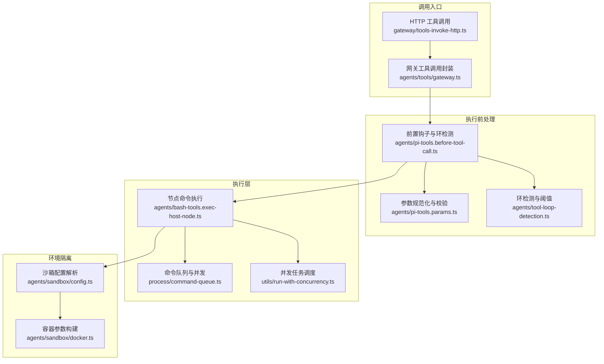
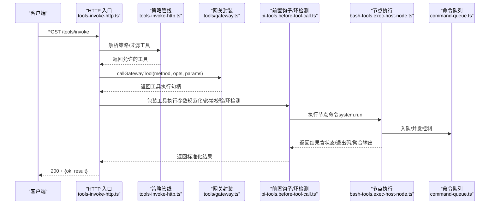
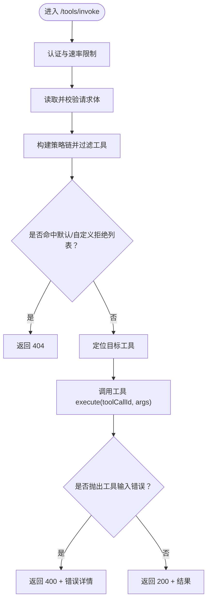
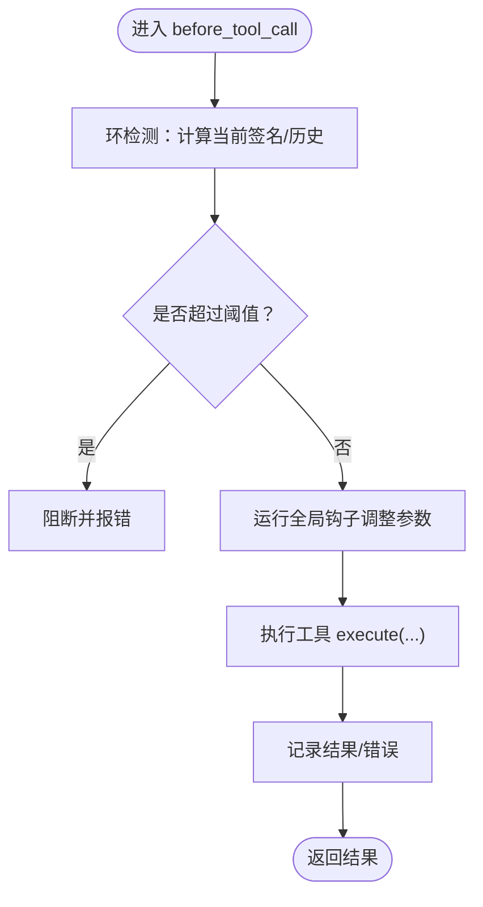
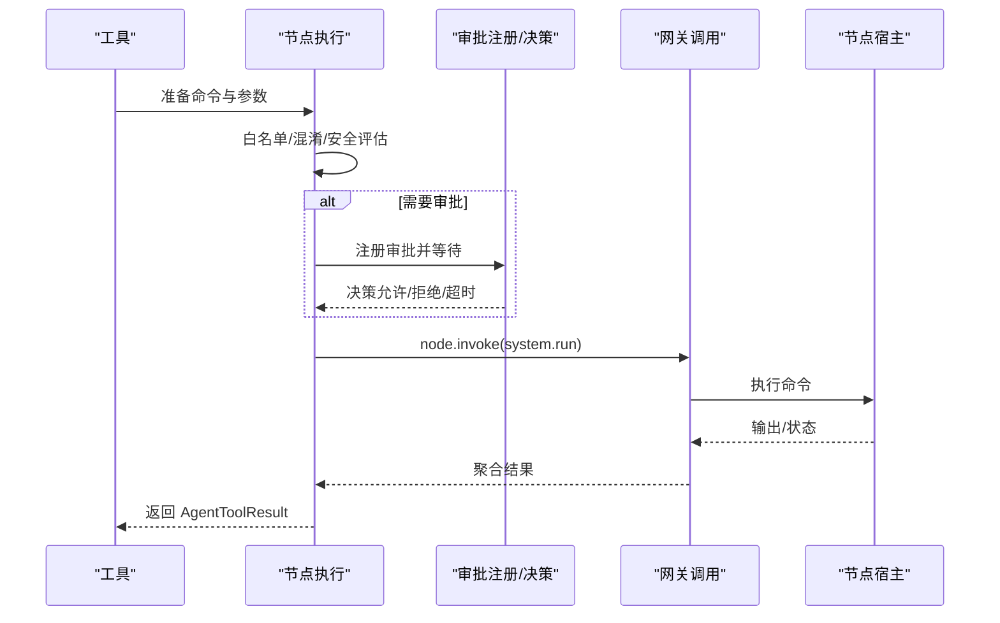
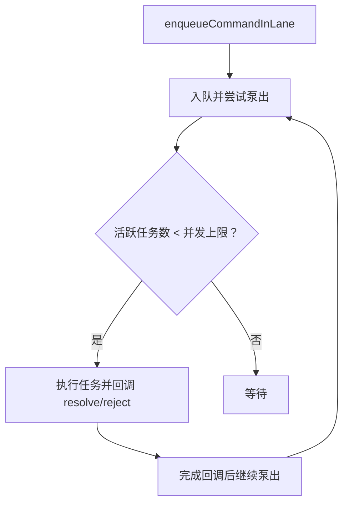
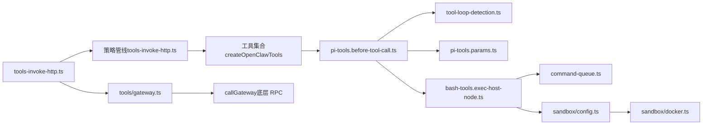

# 工具调用与执行

<cite>
**本文引用的文件**
- [src/agents/bash-tools.exec-host-node.ts](file://src/agents/bash-tools.exec-host-node.ts)
- [src/agents/pi-tools.before-tool-call.ts](file://src/agents/pi-tools.before-tool-call.ts)
- [src/agents/pi-tools.params.ts](file://src/agents/pi-tools.params.ts)
- [src/agents/tools/gateway.ts](file://src/agents/tools/gateway.ts)
- [src/agents/sandbox/config.ts](file://src/agents/sandbox/config.ts)
- [src/agents/sandbox/docker.ts](file://src/agents/sandbox/docker.ts)
- [src/process/command-queue.ts](file://src/process/command-queue.ts)
- [src/utils/run-with-concurrency.ts](file://src/utils/run-with-concurrency.ts)
- [src/gateway/tools-invoke-http.ts](file://src/gateway/tools-invoke-http.ts)
- [src/agents/tool-loop-detection.ts](file://src/agents/tool-loop-detection.ts)
- [docs/zh-CN/gateway/tools-invoke-http-api.md](file://docs/zh-CN/gateway/tools-invoke-http-api.md)
</cite>

## 目录
1. [简介](#简介)
2. [项目结构](#项目结构)
3. [核心组件](#核心组件)
4. [架构总览](#架构总览)
5. [详细组件分析](#详细组件分析)
6. [依赖关系分析](#依赖关系分析)
7. [性能考量](#性能考量)
8. [故障排查指南](#故障排查指南)
9. [结论](#结论)
10. [附录](#附录)

## 简介
本文件面向开发者，系统性阐述 OpenClaw 的“工具调用与执行”机制，覆盖以下主题：
- 工具调用流程与参数传递
- 异步执行模型与并发控制
- 工具上下文管理、执行环境隔离与资源限制
- 工具调用栈跟踪、超时控制与重试策略
- 工具调用 API、参数验证规则与返回值处理
- 并发控制方法与错误恢复策略

目标是帮助你在复杂场景下安全、可控地使用工具，避免循环调用、资源滥用与权限越界。

## 项目结构
围绕工具调用与执行的关键模块如下：
- 工具调用入口与网关通信：agents/tools/gateway.ts、gateway/tools-invoke-http.ts
- 执行主机与节点命令执行：agents/bash-tools.exec-host-node.ts
- 参数规范化与必填校验：agents/pi-tools.params.ts
- 钩子前置拦截与环检测：agents/pi-tools.before-tool-call.ts、agents/tool-loop-detection.ts
- 并发与队列：process/command-queue.ts、utils/run-with-concurrency.ts
- 环境隔离与资源限制：agents/sandbox/config.ts、agents/sandbox/docker.ts

图表来源
- [src/gateway/tools-invoke-http.ts](file://src/gateway/tools-invoke-http.ts#L134-L340)
- [src/agents/tools/gateway.ts](file://src/agents/tools/gateway.ts#L140-L161)
- [src/agents/pi-tools.before-tool-call.ts](file://src/agents/pi-tools.before-tool-call.ts#L91-L194)
- [src/agents/pi-tools.params.ts](file://src/agents/pi-tools.params.ts#L206-L226)
- [src/agents/tool-loop-detection.ts](file://src/agents/tool-loop-detection.ts#L372-L495)
- [src/agents/bash-tools.exec-host-node.ts](file://src/agents/bash-tools.exec-host-node.ts#L56-L375)
- [src/process/command-queue.ts](file://src/process/command-queue.ts#L161-L197)
- [src/utils/run-with-concurrency.ts](file://src/utils/run-with-concurrency.ts#L3-L48)
- [src/agents/sandbox/config.ts](file://src/agents/sandbox/config.ts#L170-L217)
- [src/agents/sandbox/docker.ts](file://src/agents/sandbox/docker.ts#L343-L380)

章节来源
- [src/gateway/tools-invoke-http.ts](file://src/gateway/tools-invoke-http.ts#L134-L340)
- [src/agents/tools/gateway.ts](file://src/agents/tools/gateway.ts#L140-L161)
- [src/agents/bash-tools.exec-host-node.ts](file://src/agents/bash-tools.exec-host-node.ts#L56-L375)
- [src/agents/pi-tools.before-tool-call.ts](file://src/agents/pi-tools.before-tool-call.ts#L91-L194)
- [src/agents/pi-tools.params.ts](file://src/agents/pi-tools.params.ts#L206-L226)
- [src/agents/tool-loop-detection.ts](file://src/agents/tool-loop-detection.ts#L372-L495)
- [src/process/command-queue.ts](file://src/process/command-queue.ts#L161-L197)
- [src/utils/run-with-concurrency.ts](file://src/utils/run-with-concurrency.ts#L3-L48)
- [src/agents/sandbox/config.ts](file://src/agents/sandbox/config.ts#L170-L217)
- [src/agents/sandbox/docker.ts](file://src/agents/sandbox/docker.ts#L343-L380)

## 核心组件
- 网关工具调用封装：统一解析网关地址、令牌与超时，屏蔽底层细节，便于各工具复用。
- 前置钩子与环检测：在工具执行前进行参数调整、策略拦截与环路检测，必要时阻断危险调用。
- 参数规范化与必填校验：将不同模型/工具的参数风格统一，确保必填项满足。
- 节点命令执行：负责与节点宿主交互，准备命令、评估白名单、处理审批与超时。
- 并发与队列：提供按车道（lane）的串行化与并发度控制，保障日志与标准输入不交错。
- 沙箱配置与容器参数：集中解析 Docker 与浏览器沙箱配置，实现环境隔离与资源限制。
- HTTP 工具调用 API：对外暴露 /tools/invoke 接口，内置策略链与默认拒绝列表。

章节来源
- [src/agents/tools/gateway.ts](file://src/agents/tools/gateway.ts#L140-L161)
- [src/agents/pi-tools.before-tool-call.ts](file://src/agents/pi-tools.before-tool-call.ts#L91-L194)
- [src/agents/pi-tools.params.ts](file://src/agents/pi-tools.params.ts#L206-L226)
- [src/agents/bash-tools.exec-host-node.ts](file://src/agents/bash-tools.exec-host-node.ts#L56-L375)
- [src/process/command-queue.ts](file://src/process/command-queue.ts#L161-L197)
- [src/agents/sandbox/config.ts](file://src/agents/sandbox/config.ts#L170-L217)
- [src/gateway/tools-invoke-http.ts](file://src/gateway/tools-invoke-http.ts#L134-L340)

## 架构总览
从外部 HTTP 到内部工具执行的端到端流程如下：

图表来源
- [src/gateway/tools-invoke-http.ts](file://src/gateway/tools-invoke-http.ts#L134-L340)
- [src/agents/tools/gateway.ts](file://src/agents/tools/gateway.ts#L140-L161)
- [src/agents/pi-tools.before-tool-call.ts](file://src/agents/pi-tools.before-tool-call.ts#L196-L255)
- [src/agents/bash-tools.exec-host-node.ts](file://src/agents/bash-tools.exec-host-node.ts#L56-L375)
- [src/process/command-queue.ts](file://src/process/command-queue.ts#L161-L197)

## 详细组件分析

### 组件A：HTTP 工具调用 API
- 功能要点
  - 路由：仅接受 POST /tools/invoke
  - 认证：基于 Bearer Token，支持速率限制
  - 请求体：tool、action、args、sessionKey、dryRun
  - 策略：多级策略链（profile/provider/agent/group/subagent），并叠加网关默认拒绝列表
  - 响应：200 返回 {ok:true, result}；4xx/5xx 返回 {ok:false, error}
- 参数与动作合并：当工具 schema 支持 action 时，可将 action 注入 args
- 会话键：默认解析为主会话键，支持通过 header 提供渠道/账号上下文

图表来源
- [src/gateway/tools-invoke-http.ts](file://src/gateway/tools-invoke-http.ts#L134-L340)
- [docs/zh-CN/gateway/tools-invoke-http-api.md](file://docs/zh-CN/gateway/tools-invoke-http-api.md#L1-L54)

章节来源
- [src/gateway/tools-invoke-http.ts](file://src/gateway/tools-invoke-http.ts#L134-L340)
- [docs/zh-CN/gateway/tools-invoke-http-api.md](file://docs/zh-CN/gateway/tools-invoke-http-api.md#L1-L54)

### 组件B：网关工具调用封装
- 功能要点
  - 解析 gatewayUrl、gatewayToken、timeoutMs
  - 校验 URL 协议/路径/凭据合法性
  - 解析最小权限作用域，调用 callGateway 完成 RPC
- 使用场景
  - 在工具内部统一通过 callGatewayTool 发起对网关方法的调用，隐藏连接细节

章节来源
- [src/agents/tools/gateway.ts](file://src/agents/tools/gateway.ts#L140-L161)

### 组件C：前置钩子与环检测
- 功能要点
  - 参数调整：通过全局钩子 runner 修改/合并参数
  - 环检测：记录工具调用历史，识别“无进展重复调用”“轮询无进展”“ping-pong”等模式
  - 阈值：警告阈值、关键阈值、全局断路器阈值，超过则阻断
  - 结果追踪：记录成功/失败结果，辅助后续统计与诊断
- 关键常量
  - TOOL_CALL_HISTORY_SIZE、WARNING_THRESHOLD、CRITICAL_THRESHOLD、GLOBAL_CIRCUIT_BREAKER_THRESHOLD

图表来源
- [src/agents/pi-tools.before-tool-call.ts](file://src/agents/pi-tools.before-tool-call.ts#L91-L194)
- [src/agents/tool-loop-detection.ts](file://src/agents/tool-loop-detection.ts#L372-L495)

章节来源
- [src/agents/pi-tools.before-tool-call.ts](file://src/agents/pi-tools.before-tool-call.ts#L91-L194)
- [src/agents/tool-loop-detection.ts](file://src/agents/tool-loop-detection.ts#L372-L495)

### 组件D：参数规范化与必填校验
- 功能要点
  - 将不同模型/工具的参数命名统一（如 file_path ↔ path、old_string ↔ oldText 等）
  - 提取结构化文本内容，保证写/编辑类工具的确定性
  - 必填组校验：支持“或”关系的必填组，自动拼接“请在重试前修正参数”的提示
- 使用方式
  - 通过 wrapToolParamNormalization 包裹任意工具，自动完成规范化与校验

章节来源
- [src/agents/pi-tools.params.ts](file://src/agents/pi-tools.params.ts#L206-L226)

### 组件E：节点命令执行与审批
- 功能要点
  - 选择节点、校验节点能力（system.run 支持）
  - 构建命令行参数，准备 system.run
  - 白名单评估、敏感变量检测、命令混淆检测
  - 审批流程：注册审批、等待决策、超时回退策略、运行通知
  - 超时控制：根据 timeoutSec 计算 invoke 超时
- 返回值
  - 成功：返回 stdout/stderr/error 文本与 exitCode、duration、cwd
  - 审批中：返回 approval-pending 状态与过期时间

图表来源
- [src/agents/bash-tools.exec-host-node.ts](file://src/agents/bash-tools.exec-host-node.ts#L56-L375)

章节来源
- [src/agents/bash-tools.exec-host-node.ts](file://src/agents/bash-tools.exec-host-node.ts#L56-L375)

### 组件F：并发控制与队列
- 命令队列
  - 按 lane 分车道，每车道独立队列与并发上限
  - drain 机制：空闲时泵出任务，活跃时排队
  - 清理与重启：支持清空某车道、重置 generation 防止旧任务干扰
- 并发任务调度
  - runTasksWithConcurrency：限制并发度，支持“遇到错误立即停止”或“继续执行”
  - 回调 onTaskError 可收集首个错误与逐任务错误

图表来源
- [src/process/command-queue.ts](file://src/process/command-queue.ts#L161-L197)
- [src/utils/run-with-concurrency.ts](file://src/utils/run-with-concurrency.ts#L3-L48)

章节来源
- [src/process/command-queue.ts](file://src/process/command-queue.ts#L161-L197)
- [src/utils/run-with-concurrency.ts](file://src/utils/run-with-concurrency.ts#L3-L48)

### 组件G：环境隔离与资源限制
- 沙箱配置解析
  - scope 决策：agent/session/shared
  - docker 配置合并：全局与代理级别合并，环境变量与 ulimit 后者覆盖前者
  - 浏览器容器：网络、镜像、端口、自动启动等
- 容器参数构建
  - 标签与只读根文件系统、tmpfs、网络、用户、capabilities drop、DNS/hosts
  - 敏感环境变量阻断与告警

章节来源
- [src/agents/sandbox/config.ts](file://src/agents/sandbox/config.ts#L63-L120)
- [src/agents/sandbox/docker.ts](file://src/agents/sandbox/docker.ts#L343-L380)

## 依赖关系分析

图表来源
- [src/gateway/tools-invoke-http.ts](file://src/gateway/tools-invoke-http.ts#L248-L302)
- [src/agents/tools/gateway.ts](file://src/agents/tools/gateway.ts#L140-L161)
- [src/agents/pi-tools.before-tool-call.ts](file://src/agents/pi-tools.before-tool-call.ts#L196-L255)
- [src/agents/tool-loop-detection.ts](file://src/agents/tool-loop-detection.ts#L372-L495)
- [src/agents/pi-tools.params.ts](file://src/agents/pi-tools.params.ts#L206-L226)
- [src/agents/bash-tools.exec-host-node.ts](file://src/agents/bash-tools.exec-host-node.ts#L56-L375)
- [src/process/command-queue.ts](file://src/process/command-queue.ts#L161-L197)
- [src/agents/sandbox/config.ts](file://src/agents/sandbox/config.ts#L170-L217)
- [src/agents/sandbox/docker.ts](file://src/agents/sandbox/docker.ts#L343-L380)

章节来源
- [src/gateway/tools-invoke-http.ts](file://src/gateway/tools-invoke-http.ts#L248-L302)
- [src/agents/tools/gateway.ts](file://src/agents/tools/gateway.ts#L140-L161)
- [src/agents/pi-tools.before-tool-call.ts](file://src/agents/pi-tools.before-tool-call.ts#L196-L255)
- [src/agents/tool-loop-detection.ts](file://src/agents/tool-loop-detection.ts#L372-L495)
- [src/agents/pi-tools.params.ts](file://src/agents/pi-tools.params.ts#L206-L226)
- [src/agents/bash-tools.exec-host-node.ts](file://src/agents/bash-tools.exec-host-node.ts#L56-L375)
- [src/process/command-queue.ts](file://src/process/command-queue.ts#L161-L197)
- [src/agents/sandbox/config.ts](file://src/agents/sandbox/config.ts#L170-L217)
- [src/agents/sandbox/docker.ts](file://src/agents/sandbox/docker.ts#L343-L380)

## 性能考量
- 并发与队列
  - 使用命令队列按 lane 控制并发，避免主工作流日志/标准输入交错
  - runTasksWithConcurrency 支持批量任务限速与错误模式（继续/停止）
- 超时与重试
  - 节点执行超时基于 timeoutSec 计算，预留缓冲
  - 环检测中的全局断路器阈值可防止长时间无进展的轮询
- 资源限制
  - 沙箱默认只读根文件系统、tmpfs、capabilities drop、内存/CPU/ulimit 等限制
  - 环境变量阻断敏感变量，减少注入风险

[本节为通用指导，无需列出章节来源]

## 故障排查指南
- HTTP 工具调用
  - 400：工具输入错误（ToolInputError），检查参数 schema 与必填项
  - 401/403：认证失败或授权不足
  - 404：工具未找到或被策略/默认拒绝列表过滤
  - 500：工具执行异常（已清洗消息）
- 审批与超时
  - 审批超时：可能因命令混淆检测或 askFallback 策略导致
  - 运行通知：超过阈值会发出“正在运行”事件
- 环检测
  - 警告：重复调用次数达到阈值，建议停止轮询或报告失败
  - 关键阻断：全局断路器触发，阻止无进展循环
- 并发问题
  - 队列堆积：检查 lane 并发设置与 onWait 回调
  - 清空车道：使用 clearCommandLane 或 resetAllLanes

章节来源
- [src/gateway/tools-invoke-http.ts](file://src/gateway/tools-invoke-http.ts#L115-L132)
- [src/agents/bash-tools.exec-host-node.ts](file://src/agents/bash-tools.exec-host-node.ts#L211-L320)
- [src/agents/tool-loop-detection.ts](file://src/agents/tool-loop-detection.ts#L389-L401)
- [src/process/command-queue.ts](file://src/process/command-queue.ts#L216-L228)

## 结论
OpenClaw 的工具调用体系以“安全优先、可控并发、可观测闭环”为核心设计原则：
- 通过策略链与默认拒绝列表，确保工具调用符合最小权限与组织策略
- 前置钩子与环检测在执行前阻断高风险与无进展调用
- 节点执行与审批流程结合超时与运行通知，提升可观测性
- 沙箱配置与容器参数实现强隔离与资源限制
- 并发与队列机制保障日志与输入一致性

建议在生产中：
- 明确工具参数 schema 与必填组，使用参数规范化包装
- 合理设置环检测阈值与策略
- 为长耗时工具配置合适的超时与审批回退策略
- 使用队列 lane 与并发限制，避免资源争用

[本节为总结，无需列出章节来源]

## 附录

### 工具调用 API 规范（摘要）
- 路径：POST /tools/invoke
- 请求体字段
  - tool（必需）：工具名
  - action（可选）：当工具 schema 支持时可注入 args
  - args（可选）：工具参数对象
  - sessionKey（可选）：目标会话键，默认解析为主会话键
  - dryRun（可选）：保留字段
- 响应
  - 200：{ok:true, result}
  - 400：{ok:false, error:{type,message}}
  - 401/403：未认证或未授权
  - 404：工具不可用
  - 500：工具执行失败（已清洗）

章节来源
- [docs/zh-CN/gateway/tools-invoke-http-api.md](file://docs/zh-CN/gateway/tools-invoke-http-api.md#L1-L54)

### 参数验证与返回值处理
- 参数规范化
  - 统一命名（file_path↔path、old_string↔oldText 等）
  - 提取结构化文本，保证写/编辑确定性
- 必填校验
  - 支持“或”关系的必填组，缺失时抛出带重试指引的错误
- 返回值
  - 统一 AgentToolResult 结构，包含 content 与 details（状态、退出码、聚合输出、工作目录等）

章节来源
- [src/agents/pi-tools.params.ts](file://src/agents/pi-tools.params.ts#L206-L226)
- [src/agents/bash-tools.exec-host-node.ts](file://src/agents/bash-tools.exec-host-node.ts#L359-L374)

### 并发控制与错误恢复
- 命令队列
  - enqueueCommandInLane：按 lane 入队，支持 onWait 回调与等待告警
  - setCommandLaneConcurrency：动态调整并发度
  - clearCommandLane/resetAllLanes：清理与重启
- 并发任务
  - runTasksWithConcurrency：批量任务限速，支持“遇到错误停止/继续”
- 错误恢复
  - 环检测断路器与阈值告警
  - 审批超时回退策略与运行通知

章节来源
- [src/process/command-queue.ts](file://src/process/command-queue.ts#L161-L197)
- [src/utils/run-with-concurrency.ts](file://src/utils/run-with-concurrency.ts#L3-L48)
- [src/agents/tool-loop-detection.ts](file://src/agents/tool-loop-detection.ts#L389-L401)
- [src/agents/bash-tools.exec-host-node.ts](file://src/agents/bash-tools.exec-host-node.ts#L241-L320)