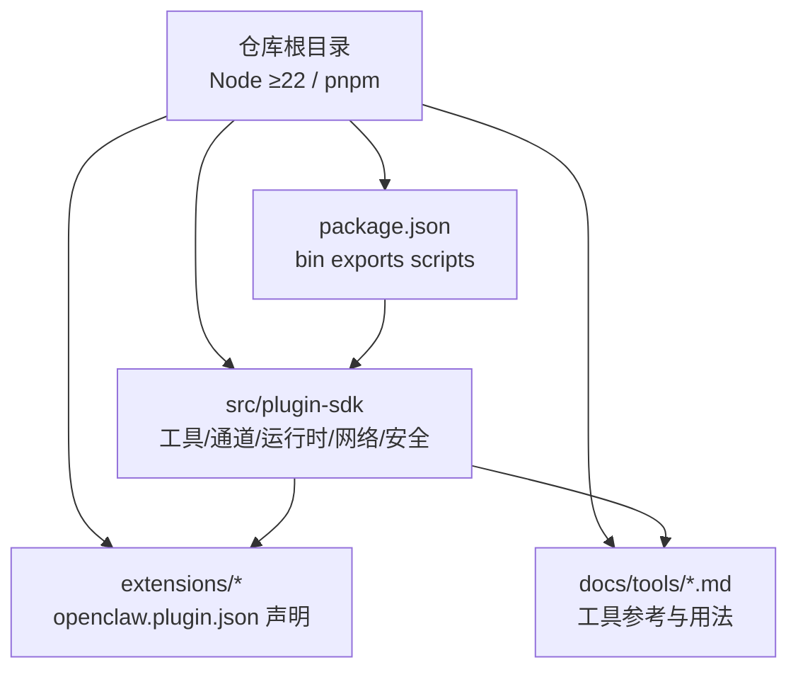
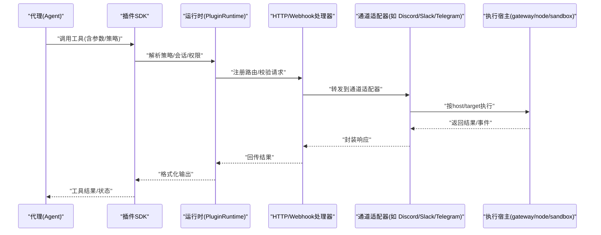
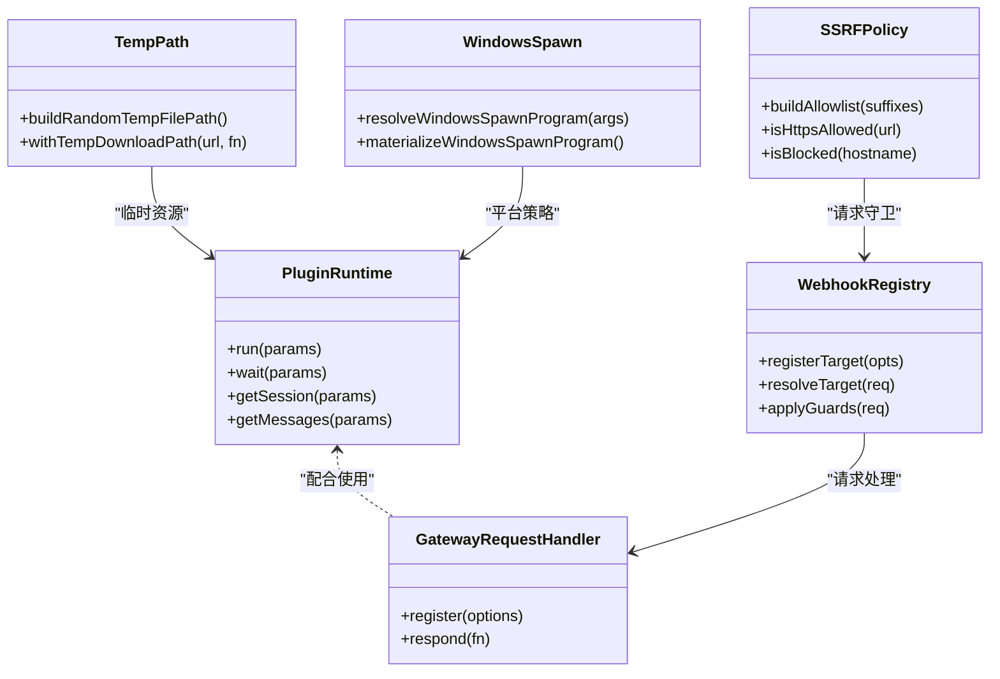
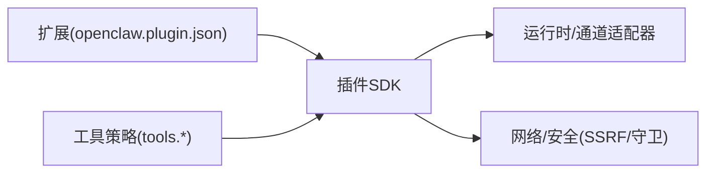

# 自定义工具开发

<cite>
**本文引用的文件**
- [README.md](file://README.md)
- [CONTRIBUTING.md](file://CONTRIBUTING.md)
- [package.json](file://package.json)
- [src/plugin-sdk/index.ts](file://src/plugin-sdk/index.ts)
- [src/plugin-sdk/core.ts](file://src/plugin-sdk/core.ts)
- [extensions/diffs/openclaw.plugin.json](file://extensions/diffs/openclaw.plugin.json)
- [extensions/lobster/openclaw.plugin.json](file://extensions/lobster/openclaw.plugin.json)
- [docs/tools/index.md](file://docs/tools/index.md)
- [docs/tools/creating-skills.md](file://docs/tools/creating-skills.md)
- [docs/tools/exec.md](file://docs/tools/exec.md)
</cite>

## 目录
1. [简介](#简介)
2. [项目结构](#项目结构)
3. [核心组件](#核心组件)
4. [架构总览](#架构总览)
5. [详细组件分析](#详细组件分析)
6. [依赖关系分析](#依赖关系分析)
7. [性能考虑](#性能考虑)
8. [故障排查指南](#故障排查指南)
9. [结论](#结论)
10. [附录](#附录)

## 简介
本指南面向希望在 OpenClaw 平台上开发“自定义工具”的开发者，系统讲解工具开发框架、SDK 接口规范、开发与测试环境配置、工具类设计模式、参数校验与错误处理策略，并覆盖打包发布、版本管理与兼容性保障。文档同时提供完整开发示例、测试方法与调试技巧，总结最佳实践、性能优化与安全编码规范，帮助你构建高质量的自定义工具。

## 项目结构
OpenClaw 采用多包/多模块组织方式，核心能力通过插件 SDK 暴露，工具与技能（skills）作为扩展能力注入到代理工作流中。关键目录与文件包括：
- 根级安装与运行要求：Node ≥22，推荐使用 pnpm 构建与运行。
- 插件 SDK：位于 src/plugin-sdk，提供统一的工具注册、HTTP 路由、Webhook、通道适配器、运行时上下文等能力。
- 扩展（Extensions）：以 openclaw.plugin.json 声明工具与 UI 提示，如 diffs、lobster 等。
- 工具文档：docs/tools 下提供工具清单、参数与用法说明，便于理解工具生态与约束。
- 包管理与导出：package.json 定义二进制入口、插件 SDK 的命名空间导出与脚本命令。

图示来源
- [package.json](file://package.json#L1-L444)
- [src/plugin-sdk/index.ts](file://src/plugin-sdk/index.ts#L1-L727)

章节来源
- [README.md](file://README.md#L50-L111)
- [package.json](file://package.json#L1-L444)

## 核心组件
- 插件 SDK 入口与导出
  - 统一导出通道适配器类型、工具运行时、HTTP/Webhook 注册、状态辅助、分组访问控制、SSRF/请求体限制、临时路径、Windows spawn 策略、OAuth 工具等。
  - 参考：[src/plugin-sdk/index.ts](file://src/plugin-sdk/index.ts#L1-L727)
- SDK 核心子集
  - 仅导出常用类型与工具，便于轻量接入。
  - 参考：[src/plugin-sdk/core.ts](file://src/plugin-sdk/core.ts#L1-L37)
- 扩展声明文件
  - openclaw.plugin.json 用于声明扩展 ID、名称、描述、UI 提示与配置 Schema。
  - 示例：[extensions/diffs/openclaw.plugin.json](file://extensions/diffs/openclaw.plugin.json#L1-L183)，[extensions/lobster/openclaw.plugin.json](file://extensions/lobster/openclaw.plugin.json#L1-L11)
- 工具参考与策略
  - 工具清单、策略（允许/拒绝/分组）、参数与行为说明。
  - 参考：[docs/tools/index.md](file://docs/tools/index.md#L1-L571)

章节来源
- [src/plugin-sdk/index.ts](file://src/plugin-sdk/index.ts#L1-L727)
- [src/plugin-sdk/core.ts](file://src/plugin-sdk/core.ts#L1-L37)
- [extensions/diffs/openclaw.plugin.json](file://extensions/diffs/openclaw.plugin.json#L1-L183)
- [extensions/lobster/openclaw.plugin.json](file://extensions/lobster/openclaw.plugin.json#L1-L11)
- [docs/tools/index.md](file://docs/tools/index.md#L1-L571)

## 架构总览
OpenClaw 的工具开发围绕“插件 SDK + 通道适配器 + 运行时上下文 + 工具策略”展开。下图展示从工具调用到执行的关键流转：

图示来源
- [src/plugin-sdk/index.ts](file://src/plugin-sdk/index.ts#L125-L164)
- [docs/tools/index.md](file://docs/tools/index.md#L15-L80)

## 详细组件分析

### 插件 SDK 设计与接口规范
- 类型与适配器
  - 通道适配器类型（消息、登录、心跳、安全、线程、工具发送等）集中于导出，便于实现跨渠道一致性。
  - 参考：[src/plugin-sdk/index.ts](file://src/plugin-sdk/index.ts#L1-L63)
- 运行时与上下文
  - 提供 PluginRuntime、Subagent 运行/等待/查询会话等能力；支持日志、超时、会话键解析。
  - 参考：[src/plugin-sdk/index.ts](file://src/plugin-sdk/index.ts#L112-L124)
- HTTP/Webhook
  - 注册路由、规范化路径、请求守卫（内容类型、请求体大小、并发限流）、异常计数器与速率限制。
  - 参考：[src/plugin-sdk/index.ts](file://src/plugin-sdk/index.ts#L125-L164)
- 安全与网络
  - SSRF 策略（主机名后缀白名单）、HTTPS 限制、请求体读取与错误转换。
  - 参考：[src/plugin-sdk/index.ts](file://src/plugin-sdk/index.ts#L394-L410)
- 临时与系统
  - 临时路径生成、Windows 可执行解析与策略、命令超时执行。
  - 参考：[src/plugin-sdk/index.ts](file://src/plugin-sdk/index.ts#L307-L328)

图示来源
- [src/plugin-sdk/index.ts](file://src/plugin-sdk/index.ts#L112-L164)
- [src/plugin-sdk/index.ts](file://src/plugin-sdk/index.ts#L307-L328)

章节来源
- [src/plugin-sdk/index.ts](file://src/plugin-sdk/index.ts#L1-L727)

### 工具类设计模式
- 工具注册与路由
  - 使用 registerPluginHttpRoute 与 normalizePluginHttpPath 将工具暴露为 HTTP 接口，结合请求守卫进行鉴权与限流。
  - 参考：[src/plugin-sdk/index.ts](file://src/plugin-sdk/index.ts#L125-L164)
- 分组与策略
  - 工具策略（tools.allow/deny/profile/byProvider/group:*）决定可用性与作用域，确保最小权限与可审计性。
  - 参考：[docs/tools/index.md](file://docs/tools/index.md#L15-L178)
- 会话与线程绑定
  - 通过会话键与线程绑定记录，实现跨会话协作与状态一致性。
  - 参考：[src/plugin-sdk/index.ts](file://src/plugin-sdk/index.ts#L64-L73)

章节来源
- [src/plugin-sdk/index.ts](file://src/plugin-sdk/index.ts#L125-L164)
- [docs/tools/index.md](file://docs/tools/index.md#L15-L178)

### 参数验证机制
- 配置 Schema
  - 扩展通过 openclaw.plugin.json 的 configSchema 定义参数结构与默认值，SDK 提供 Zod Schema 与类型校验工具。
  - 示例：[extensions/diffs/openclaw.plugin.json](file://extensions/diffs/openclaw.plugin.json#L68-L181)
- 请求体与内容类型
  - readJsonBodyWithLimit、isJsonContentType、installRequestBodyLimitGuard 确保输入安全与体积控制。
  - 参考：[src/plugin-sdk/index.ts](file://src/plugin-sdk/index.ts#L371-L380)
- 通道参数归一化
  - 不同通道的目标 ID、消息 ID、线程 ID 归一化函数，避免歧义与错误路由。
  - 参考：[src/plugin-sdk/index.ts](file://src/plugin-sdk/index.ts#L628-L672)

章节来源
- [extensions/diffs/openclaw.plugin.json](file://extensions/diffs/openclaw.plugin.json#L68-L181)
- [src/plugin-sdk/index.ts](file://src/plugin-sdk/index.ts#L371-L380)
- [src/plugin-sdk/index.ts](file://src/plugin-sdk/index.ts#L628-L672)

### 错误处理策略
- 请求体限制与异常
  - RequestBodyLimitError、requestBodyErrorToText、isRequestBodyLimitError 提供统一的错误识别与提示。
  - 参考：[src/plugin-sdk/index.ts](file://src/plugin-sdk/index.ts#L371-L380)
- Webhook 内存守卫
  - 固定窗口限流、异常计数器、状态码归类，防止滥用与资源耗尽。
  - 参考：[src/plugin-sdk/index.ts](file://src/plugin-sdk/index.ts#L381-L393)
- SSRF 阻断
  - SsrFBlockedError、isBlockedHostname、isBlockedHostnameOrIp、isPrivateIpAddress 严格限制私网与黑名单主机。
  - 参考：[src/plugin-sdk/index.ts](file://src/plugin-sdk/index.ts#L394-L410)

章节来源
- [src/plugin-sdk/index.ts](file://src/plugin-sdk/index.ts#L371-L393)
- [src/plugin-sdk/index.ts](file://src/plugin-sdk/index.ts#L394-L410)

### 开发环境配置
- 运行时与包管理
  - Node ≥22，推荐 pnpm；根级 package.json 定义二进制入口 openclaw 与 SDK 导出命名空间。
  - 参考：[README.md](file://README.md#L50-L111)，[package.json](file://package.json#L16-L216)
- 构建与脚本
  - build、check、test、ui:build 等脚本覆盖格式化、Lint、类型检查、测试与 UI 构建。
  - 参考：[package.json](file://package.json#L217-L331)
- 贡献与质量门禁
  - 贡献流程、PR 规范、AI 协作标注、维护者信息与安全报告流程。
  - 参考：[CONTRIBUTING.md](file://CONTRIBUTING.md#L64-L163)

章节来源
- [README.md](file://README.md#L50-L111)
- [package.json](file://package.json#L217-L331)
- [CONTRIBUTING.md](file://CONTRIBUTING.md#L64-L163)

### 工具打包发布与版本管理
- 发布与导出
  - package.json 的 exports 字段为各插件 SDK 子模块提供 types/default 导出，便于按需引入。
  - 参考：[package.json](file://package.json#L37-L216)
- 版本与兼容性
  - 使用 npm dist-tag（stable/beta/dev）切换通道；遵循 Node 引擎要求（≥22）。
  - 参考：[README.md](file://README.md#L83-L90)
- 兼容性保障
  - 插件 SDK 对外导出保持稳定；扩展通过 openclaw.plugin.json 声明配置 Schema，避免破坏性变更。
  - 参考：[extensions/diffs/openclaw.plugin.json](file://extensions/diffs/openclaw.plugin.json#L68-L181)

章节来源
- [package.json](file://package.json#L37-L216)
- [README.md](file://README.md#L83-L90)
- [extensions/diffs/openclaw.plugin.json](file://extensions/diffs/openclaw.plugin.json#L68-L181)

### 开发示例与测试方法
- 工具清单与策略示例
  - tools.allow/deny/profile/group:* 的组合使用，以及 per-agent 覆盖。
  - 参考：[docs/tools/index.md](file://docs/tools/index.md#L15-L178)
- exec 工具用法与安全
  - host/target/安全策略、PTY、审批流程、PATH 处理、安全二进制与允许列表。
  - 参考：[docs/tools/exec.md](file://docs/tools/exec.md#L15-L147)
- 技能开发流程
  - 在 workspace/skills 下创建 SKILL.md，定义元数据与指令，刷新或重启后生效。
  - 参考：[docs/tools/creating-skills.md](file://docs/tools/creating-skills.md#L17-L59)

章节来源
- [docs/tools/index.md](file://docs/tools/index.md#L15-L178)
- [docs/tools/exec.md](file://docs/tools/exec.md#L15-L147)
- [docs/tools/creating-skills.md](file://docs/tools/creating-skills.md#L17-L59)

### 调试技巧
- 日志与诊断事件
  - registerLogTransport、emitDiagnosticEvent、onDiagnosticEvent 支持可观测性与问题定位。
  - 参考：[src/plugin-sdk/index.ts](file://src/plugin-sdk/index.ts#L533-L555)
- Webhook 流水线
  - beginWebhookRequestPipelineOrReject、applyBasicWebhookRequestGuards、rejectNonPostWebhookRequest 快速拦截非法请求。
  - 参考：[src/plugin-sdk/index.ts](file://src/plugin-sdk/index.ts#L154-L162)
- 通道参数与目标归一化
  - 通过 looksLike.../normalize... 函数减少歧义，提升调试可读性。
  - 参考：[src/plugin-sdk/index.ts](file://src/plugin-sdk/index.ts#L573-L672)

章节来源
- [src/plugin-sdk/index.ts](file://src/plugin-sdk/index.ts#L533-L555)
- [src/plugin-sdk/index.ts](file://src/plugin-sdk/index.ts#L154-L162)
- [src/plugin-sdk/index.ts](file://src/plugin-sdk/index.ts#L573-L672)

## 依赖关系分析
- SDK 与扩展
  - 扩展通过 openclaw.plugin.json 声明配置 Schema，SDK 提供类型与运行时支撑。
- 工具与策略
  - 工具策略（tools.*）与通道适配器共同决定工具可用性与执行路径。
- 安全与网络
  - SSRF 策略与请求体守卫贯穿 Webhook 与 HTTP 流程，降低风险面。

图示来源
- [extensions/diffs/openclaw.plugin.json](file://extensions/diffs/openclaw.plugin.json#L1-L183)
- [src/plugin-sdk/index.ts](file://src/plugin-sdk/index.ts#L125-L164)
- [docs/tools/index.md](file://docs/tools/index.md#L15-L178)

章节来源
- [extensions/diffs/openclaw.plugin.json](file://extensions/diffs/openclaw.plugin.json#L1-L183)
- [src/plugin-sdk/index.ts](file://src/plugin-sdk/index.ts#L125-L164)
- [docs/tools/index.md](file://docs/tools/index.md#L15-L178)

## 性能考虑
- 工具调用与会话管理
  - 合理使用 sessions_* 工具的线程绑定与可见性设置，避免跨会话开销。
  - 参考：[docs/tools/index.md](file://docs/tools/index.md#L470-L508)
- Webhook 并发与内存
  - 使用 createFixedWindowRateLimiter、createBoundedCounter 控制突发与峰值。
  - 参考：[src/plugin-sdk/index.ts](file://src/plugin-sdk/index.ts#L381-L393)
- SSRF 与请求体限制
  - 通过 isHttpsUrlAllowedByHostnameSuffixAllowlist 与 readJsonBodyWithLimit 降低无效请求成本。
  - 参考：[src/plugin-sdk/index.ts](file://src/plugin-sdk/index.ts#L404-L407)
- 临时资源与平台策略
  - withTempDownloadPath、resolveWindowsSpawnProgram 降低 IO 与进程开销。
  - 参考：[src/plugin-sdk/index.ts](file://src/plugin-sdk/index.ts#L307-L328)

章节来源
- [docs/tools/index.md](file://docs/tools/index.md#L470-L508)
- [src/plugin-sdk/index.ts](file://src/plugin-sdk/index.ts#L381-L407)
- [src/plugin-sdk/index.ts](file://src/plugin-sdk/index.ts#L307-L328)

## 故障排查指南
- Webhook 与 HTTP
  - 使用 rejectNonPostWebhookRequest、readJsonBodyWithLimit、isJsonContentType 快速定位非法请求与超限。
  - 参考：[src/plugin-sdk/index.ts](file://src/plugin-sdk/index.ts#L154-L162)
- SSRF 与主机限制
  - 检查 isBlockedHostname/isPrivateIpAddress 与 isHttpsUrlAllowedByHostnameSuffixAllowlist。
  - 参考：[src/plugin-sdk/index.ts](file://src/plugin-sdk/index.ts#L394-L410)
- 日志与诊断
  - 通过 registerLogTransport 与 emitDiagnosticEvent 获取事件流，定位异常。
  - 参考：[src/plugin-sdk/index.ts](file://src/plugin-sdk/index.ts#L533-L555)

章节来源
- [src/plugin-sdk/index.ts](file://src/plugin-sdk/index.ts#L154-L162)
- [src/plugin-sdk/index.ts](file://src/plugin-sdk/index.ts#L394-L410)
- [src/plugin-sdk/index.ts](file://src/plugin-sdk/index.ts#L533-L555)

## 结论
通过插件 SDK 的统一抽象与工具策略体系，OpenClaw 为自定义工具开发提供了清晰、可扩展且安全的框架。遵循本文档的接口规范、参数验证、错误处理与安全策略，结合示例与测试方法，你可以高效地构建高质量工具并融入整体生态。

## 附录
- 相关文档与参考
  - 工具清单与策略：[docs/tools/index.md](file://docs/tools/index.md#L1-L571)
  - exec 工具详解：[docs/tools/exec.md](file://docs/tools/exec.md#L1-L205)
  - 技能开发流程：[docs/tools/creating-skills.md](file://docs/tools/creating-skills.md#L1-L59)
  - SDK 导出与核心类型：[src/plugin-sdk/index.ts](file://src/plugin-sdk/index.ts#L1-L727)，[src/plugin-sdk/core.ts](file://src/plugin-sdk/core.ts#L1-L37)
  - 扩展声明示例：[extensions/diffs/openclaw.plugin.json](file://extensions/diffs/openclaw.plugin.json#L1-L183)，[extensions/lobster/openclaw.plugin.json](file://extensions/lobster/openclaw.plugin.json#L1-L11)
  - 根级配置与脚本：[package.json](file://package.json#L1-L444)，[README.md](file://README.md#L50-L111)，[CONTRIBUTING.md](file://CONTRIBUTING.md#L64-L163)