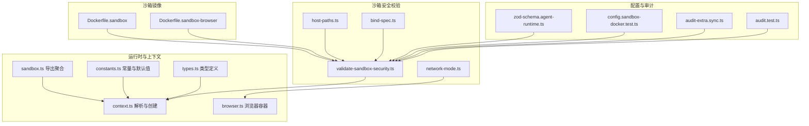
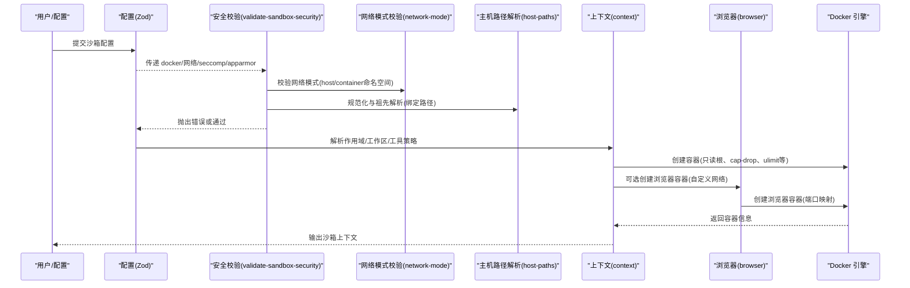
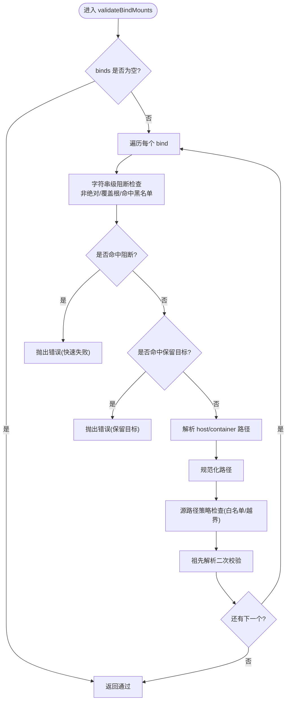
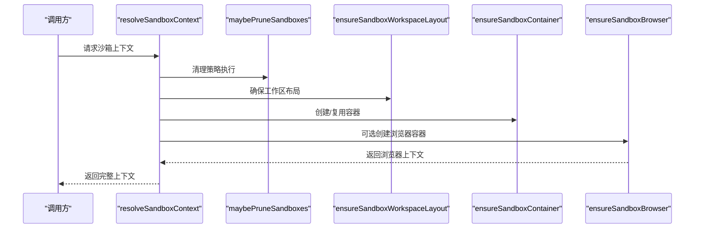
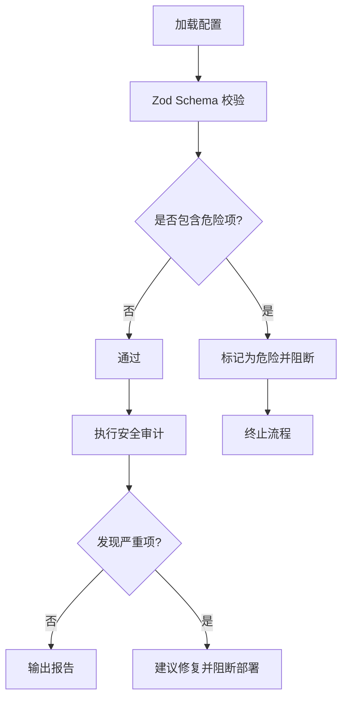
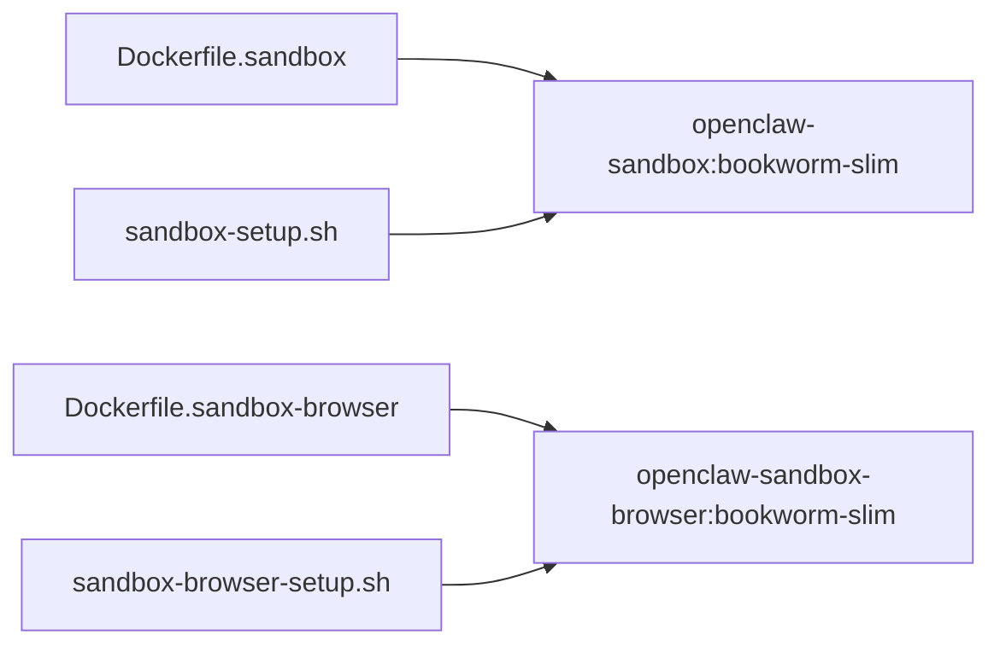
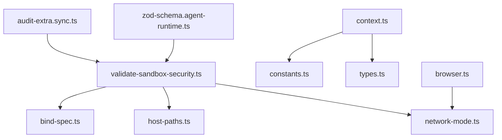

# 沙箱安全机制

<cite>
**本文引用的文件**
- [Dockerfile.sandbox](file://Dockerfile.sandbox)
- [Dockerfile.sandbox-browser](file://Dockerfile.sandbox-browser)
- [src/agents/sandbox/validate-sandbox-security.ts](file://src/agents/sandbox/validate-sandbox-security.ts)
- [src/agents/sandbox/host-paths.ts](file://src/agents/sandbox/host-paths.ts)
- [src/agents/sandbox/network-mode.ts](file://src/agents/sandbox/network-mode.ts)
- [src/agents/sandbox/bind-spec.ts](file://src/agents/sandbox/bind-spec.ts)
- [src/agents/sandbox/constants.ts](file://src/agents/sandbox/constants.ts)
- [src/agents/sandbox/types.ts](file://src/agents/sandbox/types.ts)
- [src/agents/sandbox.ts](file://src/agents/sandbox.ts)
- [src/agents/sandbox/context.ts](file://src/agents/sandbox/context.ts)
- [src/agents/sandbox/browser.ts](file://src/agents/sandbox/browser.ts)
- [src/agents/sandbox/config-hash.ts](file://src/agents/sandbox/config-hash.ts)
- [src/agents/sandbox-create-args.test.ts](file://src/agents/sandbox-create-args.test.ts)
- [src/config/zod-schema.agent-runtime.ts](file://src/config/zod-schema.agent-runtime.ts)
- [src/config/config.sandbox-docker.test.ts](file://src/config/config.sandbox-docker.test.ts)
- [src/security/audit-extra.sync.ts](file://src/security/audit-extra.sync.ts)
- [src/security/audit.test.ts](file://src/security/audit.test.ts)
- [scripts/sandbox-setup.sh](file://scripts/sandbox-setup.sh)
- [scripts/sandbox-browser-setup.sh](file://scripts/sandbox-browser-setup.sh)
</cite>

## 目录
1. [引言](#引言)
2. [项目结构](#项目结构)
3. [核心组件](#核心组件)
4. [架构总览](#架构总览)
5. [详细组件分析](#详细组件分析)
6. [依赖关系分析](#依赖关系分析)
7. [性能考量](#性能考量)
8. [故障排查指南](#故障排查指南)
9. [结论](#结论)
10. [附录](#附录)

## 引言
本文件系统化阐述 OpenClaw 的沙箱安全机制，覆盖隔离原理、权限控制、资源限制、工具执行策略、文件系统访问控制与网络通信限制，以及配置选项、安全策略定制与合规性要求。文档同时提供性能影响评估、调试方法、安全审计流程与最佳实践，帮助开发者构建安全可靠的代理执行环境。

## 项目结构
OpenClaw 将沙箱能力以模块化方式组织在 agents 子系统中，并通过 Docker 镜像与运行时参数实现强隔离。关键目录与文件如下：
- Dockerfile 定义基础镜像与用户、工作目录等
- 沙箱安全校验：bind 挂载、网络模式、安全配置（seccomp/AppArmor）
- 运行时上下文：容器生命周期管理、浏览器桥接、工作区布局
- 类型定义与常量：工具策略、作用域、端口与注册表路径
- 构建脚本：本地镜像构建入口
- 配置校验与审计：Zod Schema 与安全审计器

**图表来源**
- [Dockerfile.sandbox](file://Dockerfile.sandbox#L1-L21)
- [Dockerfile.sandbox-browser](file://Dockerfile.sandbox-browser#L1-L33)
- [src/agents/sandbox/validate-sandbox-security.ts](file://src/agents/sandbox/validate-sandbox-security.ts#L1-L344)
- [src/agents/sandbox/host-paths.ts](file://src/agents/sandbox/host-paths.ts#L1-L44)
- [src/agents/sandbox/network-mode.ts](file://src/agents/sandbox/network-mode.ts#L1-L29)
- [src/agents/sandbox/bind-spec.ts](file://src/agents/sandbox/bind-spec.ts#L1-L35)
- [src/agents/sandbox.ts](file://src/agents/sandbox.ts#L1-L44)
- [src/agents/sandbox/context.ts](file://src/agents/sandbox/context.ts#L108-L142)
- [src/agents/sandbox/browser.ts](file://src/agents/sandbox/browser.ts#L111-L142)
- [src/agents/sandbox/constants.ts](file://src/agents/sandbox/constants.ts#L1-L55)
- [src/agents/sandbox/types.ts](file://src/agents/sandbox/types.ts#L1-L91)
- [src/config/zod-schema.agent-runtime.ts](file://src/config/zod-schema.agent-runtime.ts#L131-L165)
- [src/config/config.sandbox-docker.test.ts](file://src/config/config.sandbox-docker.test.ts#L136-L180)
- [src/security/audit-extra.sync.ts](file://src/security/audit-extra.sync.ts#L884-L926)
- [src/security/audit.test.ts](file://src/security/audit.test.ts#L1027-L1088)

**章节来源**
- [Dockerfile.sandbox](file://Dockerfile.sandbox#L1-L21)
- [Dockerfile.sandbox-browser](file://Dockerfile.sandbox-browser#L1-L33)
- [src/agents/sandbox.ts](file://src/agents/sandbox.ts#L1-L44)

## 核心组件
- 镜像与用户
  - 基础镜像采用 Debian slim，安装常用工具链；以非特权用户运行，避免 root 权限面过大。
  - 浏览器镜像额外安装 Chromium、VNC、NoVNC 等，暴露必要端口用于远程控制与调试。
- 安全校验
  - bind 挂载：严格禁止挂载系统关键路径与 Docker 套接字；支持白名单根路径与保留目标路径检查；对不存在叶子路径进行祖先解析加固。
  - 网络模式：默认拒绝 host 与 container:* 命名空间加入，防止绕过网络隔离。
  - 安全配置：禁止使用 unconfined 的 seccomp/AppArmor 配置，强制启用内核安全过滤与强制访问控制。
- 运行时上下文
  - 解析沙箱配置、确保工作区布局、按需创建容器与浏览器容器、维护注册表与修剪策略。
- 类型与常量
  - 工具策略默认允许/拒绝清单、作用域（会话/代理/共享）、默认镜像与端口、注册表路径等。
- 配置与审计
  - Zod Schema 对配置进行静态校验；安全审计器在运行前或周期性扫描中发现危险项并给出修复建议。

**章节来源**
- [Dockerfile.sandbox](file://Dockerfile.sandbox#L1-L21)
- [Dockerfile.sandbox-browser](file://Dockerfile.sandbox-browser#L1-L33)
- [src/agents/sandbox/validate-sandbox-security.ts](file://src/agents/sandbox/validate-sandbox-security.ts#L16-L343)
- [src/agents/sandbox/network-mode.ts](file://src/agents/sandbox/network-mode.ts#L1-L29)
- [src/agents/sandbox/host-paths.ts](file://src/agents/sandbox/host-paths.ts#L22-L43)
- [src/agents/sandbox/constants.ts](file://src/agents/sandbox/constants.ts#L1-L55)
- [src/agents/sandbox/types.ts](file://src/agents/sandbox/types.ts#L55-L91)
- [src/config/zod-schema.agent-runtime.ts](file://src/config/zod-schema.agent-runtime.ts#L131-L165)
- [src/security/audit-extra.sync.ts](file://src/security/audit-extra.sync.ts#L884-L926)

## 架构总览
下图展示从配置到容器创建、再到运行时审计的整体流程，强调安全校验与隔离边界。

**图表来源**
- [src/config/zod-schema.agent-runtime.ts](file://src/config/zod-schema.agent-runtime.ts#L131-L165)
- [src/agents/sandbox/validate-sandbox-security.ts](file://src/agents/sandbox/validate-sandbox-security.ts#L283-L343)
- [src/agents/sandbox/network-mode.ts](file://src/agents/sandbox/network-mode.ts#L8-L23)
- [src/agents/sandbox/host-paths.ts](file://src/agents/sandbox/host-paths.ts#L34-L43)
- [src/agents/sandbox/context.ts](file://src/agents/sandbox/context.ts#L108-L142)
- [src/agents/sandbox/browser.ts](file://src/agents/sandbox/browser.ts#L111-L142)

## 详细组件分析

### 组件A：安全校验与隔离策略
- 绑定挂载策略
  - 禁止挂载系统关键路径与 Docker 套接字；支持白名单根路径与“允许越界”的危险开关。
  - 使用祖先解析消除符号链接逃逸风险，确保即使目标不存在也能正确判定。
- 网络模式策略
  - 默认拒绝 host 与 container:* 命名空间加入；可通过危险开关放宽但需明确信任。
- 安全配置策略
  - 禁止使用 unconfined 的 seccomp/AppArmor，强制启用内核过滤与强制访问控制。
- 错误格式化
  - 针对不同违规类型输出清晰的错误信息，指导修复与危险开关使用场景。

**图表来源**
- [src/agents/sandbox/validate-sandbox-security.ts](file://src/agents/sandbox/validate-sandbox-security.ts#L234-L281)
- [src/agents/sandbox/host-paths.ts](file://src/agents/sandbox/host-paths.ts#L34-L43)
- [src/agents/sandbox/bind-spec.ts](file://src/agents/sandbox/bind-spec.ts#L7-L24)

**章节来源**
- [src/agents/sandbox/validate-sandbox-security.ts](file://src/agents/sandbox/validate-sandbox-security.ts#L16-L343)
- [src/agents/sandbox/host-paths.ts](file://src/agents/sandbox/host-paths.ts#L1-L44)
- [src/agents/sandbox/bind-spec.ts](file://src/agents/sandbox/bind-spec.ts#L1-L35)
- [src/agents/sandbox/network-mode.ts](file://src/agents/sandbox/network-mode.ts#L1-L29)

### 组件B：运行时上下文与容器生命周期
- 上下文解析
  - 解析会话键、作用域、工作区布局；按需修剪旧容器；解析 Docker 用户与镜像；创建或复用容器。
- 浏览器容器
  - 校验网络模式；若网络不存在则自动创建桥接网络；按需启动浏览器容器并暴露端口。
- 注册表与修剪
  - 记录容器与浏览器状态，定期清理闲置与超龄容器，降低资源占用与安全面。

**图表来源**
- [src/agents/sandbox/context.ts](file://src/agents/sandbox/context.ts#L108-L142)
- [src/agents/sandbox/browser.ts](file://src/agents/sandbox/browser.ts#L111-L142)

**章节来源**
- [src/agents/sandbox/context.ts](file://src/agents/sandbox/context.ts#L108-L142)
- [src/agents/sandbox/browser.ts](file://src/agents/sandbox/browser.ts#L111-L142)

### 组件C：配置与审计
- 配置校验
  - Zod Schema 在配置层阻止不安全字段（如 seccomp/apparmor unconfined、binds 非字符串等）。
- 安全审计
  - 运行前或周期性扫描发现危险网络模式、安全配置与 bind 挂载问题，输出严重级别与修复建议。

**图表来源**
- [src/config/zod-schema.agent-runtime.ts](file://src/config/zod-schema.agent-runtime.ts#L131-L165)
- [src/config/config.sandbox-docker.test.ts](file://src/config/config.sandbox-docker.test.ts#L136-L180)
- [src/security/audit-extra.sync.ts](file://src/security/audit-extra.sync.ts#L884-L926)
- [src/security/audit.test.ts](file://src/security/audit.test.ts#L1027-L1088)

**章节来源**
- [src/config/zod-schema.agent-runtime.ts](file://src/config/zod-schema.agent-runtime.ts#L131-L165)
- [src/config/config.sandbox-docker.test.ts](file://src/config/config.sandbox-docker.test.ts#L136-L180)
- [src/security/audit-extra.sync.ts](file://src/security/audit-extra.sync.ts#L884-L926)
- [src/security/audit.test.ts](file://src/security/audit.test.ts#L1027-L1088)

### 组件D：镜像与构建
- 基础镜像
  - Debian slim + 必要工具；非特权用户；CMD sleep infinity。
- 浏览器镜像
  - 额外安装 Chromium、VNC、NoVNC、Xvfb 等；暴露 CDP/VNC/NoVNC 端口；入口脚本启动浏览器服务。
- 构建脚本
  - 一键构建沙箱与浏览器镜像，便于本地验证与 CI。

**图表来源**
- [Dockerfile.sandbox](file://Dockerfile.sandbox#L1-L21)
- [Dockerfile.sandbox-browser](file://Dockerfile.sandbox-browser#L1-L33)
- [scripts/sandbox-setup.sh](file://scripts/sandbox-setup.sh#L1-L8)
- [scripts/sandbox-browser-setup.sh](file://scripts/sandbox-browser-setup.sh#L1-L8)

**章节来源**
- [Dockerfile.sandbox](file://Dockerfile.sandbox#L1-L21)
- [Dockerfile.sandbox-browser](file://Dockerfile.sandbox-browser#L1-L33)
- [scripts/sandbox-setup.sh](file://scripts/sandbox-setup.sh#L1-L8)
- [scripts/sandbox-browser-setup.sh](file://scripts/sandbox-browser-setup.sh#L1-L8)

## 依赖关系分析
- 组件耦合
  - 安全校验模块独立于运行时，仅依赖 bind 规范化与网络模式判断，高内聚低耦合。
  - 上下文模块依赖常量、类型与 Docker 参数生成器，形成稳定的运行时接口。
- 外部依赖
  - Docker 引擎：容器创建、网络与卷管理。
  - 审计器：基于配置与运行时状态进行安全扫描。
- 循环依赖
  - 未见循环导入；各模块职责清晰。

**图表来源**
- [src/agents/sandbox/validate-sandbox-security.ts](file://src/agents/sandbox/validate-sandbox-security.ts#L8-L14)
- [src/agents/sandbox/bind-spec.ts](file://src/agents/sandbox/bind-spec.ts#L1-L35)
- [src/agents/sandbox/host-paths.ts](file://src/agents/sandbox/host-paths.ts#L1-L44)
- [src/agents/sandbox/network-mode.ts](file://src/agents/sandbox/network-mode.ts#L1-L29)
- [src/agents/sandbox/context.ts](file://src/agents/sandbox/context.ts#L108-L142)
- [src/agents/sandbox/constants.ts](file://src/agents/sandbox/constants.ts#L1-L55)
- [src/agents/sandbox/types.ts](file://src/agents/sandbox/types.ts#L1-L91)
- [src/agents/sandbox/browser.ts](file://src/agents/sandbox/browser.ts#L111-L142)
- [src/security/audit-extra.sync.ts](file://src/security/audit-extra.sync.ts#L884-L926)
- [src/config/zod-schema.agent-runtime.ts](file://src/config/zod-schema.agent-runtime.ts#L131-L165)

**章节来源**
- [src/agents/sandbox/validate-sandbox-security.ts](file://src/agents/sandbox/validate-sandbox-security.ts#L1-L344)
- [src/agents/sandbox/context.ts](file://src/agents/sandbox/context.ts#L108-L142)
- [src/agents/sandbox/browser.ts](file://src/agents/sandbox/browser.ts#L111-L142)
- [src/security/audit-extra.sync.ts](file://src/security/audit-extra.sync.ts#L884-L926)
- [src/config/zod-schema.agent-runtime.ts](file://src/config/zod-schema.agent-runtime.ts#L131-L165)

## 性能考量
- 镜像体积与启动时间
  - Debian slim 基础镜像较小，减少拉取与启动时间；浏览器镜像包含图形栈，启动与内存占用更高。
- 容器参数优化
  - 只读根文件系统、丢弃全部能力、设置 ulimit 与 CPU/内存限制，可有效降低资源争用与逃逸风险。
- 网络隔离
  - 使用 bridge 或 none 网络模式，避免 host 模式带来的网络栈旁路与性能/安全双重隐患。
- I/O 与缓存
  - tmpfs 用于临时目录，减少磁盘写入；合理使用只读/读写挂载，避免不必要的持久化。

[本节为通用性能讨论，无需列出具体文件来源]

## 故障排查指南
- 常见错误与定位
  - 绑定挂载被拒：检查 bind 字符串格式、源路径是否为绝对路径、是否命中黑名单或覆盖根。
  - 网络模式被拒：确认 network 是否为 host 或 container:*，必要时改用自定义 bridge 网络。
  - 安全配置被拒：移除或替换 seccomp/apparmor 为受控配置，避免 unconfined。
- 审计与日志
  - 使用安全审计器输出严重级别与修复建议；结合容器日志与注册表状态定位问题。
- 验证与回归
  - 通过测试用例覆盖危险配置与安全开关，确保回归不引入新风险。

**章节来源**
- [src/agents/sandbox/validate-sandbox-security.ts](file://src/agents/sandbox/validate-sandbox-security.ts#L201-L227)
- [src/agents/sandbox/network-mode.ts](file://src/agents/sandbox/network-mode.ts#L25-L28)
- [src/security/audit-extra.sync.ts](file://src/security/audit-extra.sync.ts#L884-L926)
- [src/config/config.sandbox-docker.test.ts](file://src/config/config.sandbox-docker.test.ts#L136-L180)

## 结论
OpenClaw 的沙箱安全机制通过“最小权限、强隔离、严格校验”三位一体的设计，在工具执行、文件系统与网络层面建立了可靠边界。配合完善的配置校验、运行时审计与生命周期管理，能够有效降低代理执行的风险面，满足生产环境的合规与安全要求。

[本节为总结性内容，无需列出具体文件来源]

## 附录

### A. 配置选项与安全策略定制
- 绑定挂载
  - 允许的源根路径与越界许可；保留目标路径保护；危险开关仅在完全信任时启用。
- 网络模式
  - 默认拒绝 host 与 container:*；可使用自定义 bridge 网络；危险开关仅在极端场景启用。
- 安全配置
  - 禁止 unconfined 的 seccomp/AppArmor；必须提供受控配置文件或使用默认策略。
- 工具策略
  - 默认允许/拒绝清单与作用域；可根据代理与全局策略调整。

**章节来源**
- [src/agents/sandbox/validate-sandbox-security.ts](file://src/agents/sandbox/validate-sandbox-security.ts#L39-L47)
- [src/agents/sandbox/constants.ts](file://src/agents/sandbox/constants.ts#L13-L37)
- [src/agents/sandbox/types.ts](file://src/agents/sandbox/types.ts#L55-L64)

### B. 合规性要求与最佳实践
- 最小权限
  - 使用非特权用户、丢弃全部能力、只读根文件系统。
- 资源限制
  - 设置 CPU/内存/ulimit，避免资源滥用。
- 网络隔离
  - 优先使用 bridge/none，避免 host 与容器命名空间加入。
- 配置审计
  - 在 CI 中集成 Zod 校验与安全审计，阻断不合规配置。
- 日志与监控
  - 记录容器状态与审计结果，建立告警与回溯机制。

**章节来源**
- [src/agents/sandbox-create-args.test.ts](file://src/agents/sandbox-create-args.test.ts#L40-L72)
- [src/config/zod-schema.agent-runtime.ts](file://src/config/zod-schema.agent-runtime.ts#L131-L165)
- [src/security/audit.test.ts](file://src/security/audit.test.ts#L1027-L1088)

### C. 安全配置示例（路径指引）
- 基础镜像构建
  - [Dockerfile.sandbox](file://Dockerfile.sandbox#L1-L21)
  - [scripts/sandbox-setup.sh](file://scripts/sandbox-setup.sh#L1-L8)
- 浏览器镜像构建
  - [Dockerfile.sandbox-browser](file://Dockerfile.sandbox-browser#L1-L33)
  - [scripts/sandbox-browser-setup.sh](file://scripts/sandbox-browser-setup.sh#L1-L8)
- 安全校验与网络模式
  - [src/agents/sandbox/validate-sandbox-security.ts](file://src/agents/sandbox/validate-sandbox-security.ts#L283-L343)
  - [src/agents/sandbox/network-mode.ts](file://src/agents/sandbox/network-mode.ts#L8-L23)
- 主机路径解析与绑定规范
  - [src/agents/sandbox/host-paths.ts](file://src/agents/sandbox/host-paths.ts#L22-L43)
  - [src/agents/sandbox/bind-spec.ts](file://src/agents/sandbox/bind-spec.ts#L7-L24)
- 类型与常量
  - [src/agents/sandbox/types.ts](file://src/agents/sandbox/types.ts#L55-L91)
  - [src/agents/sandbox/constants.ts](file://src/agents/sandbox/constants.ts#L1-L55)
- 配置校验与审计
  - [src/config/zod-schema.agent-runtime.ts](file://src/config/zod-schema.agent-runtime.ts#L131-L165)
  - [src/security/audit-extra.sync.ts](file://src/security/audit-extra.sync.ts#L884-L926)