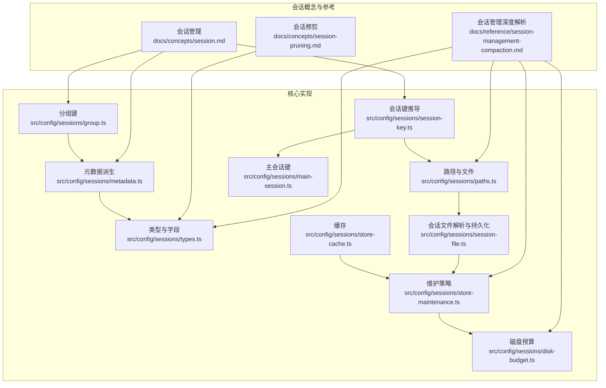
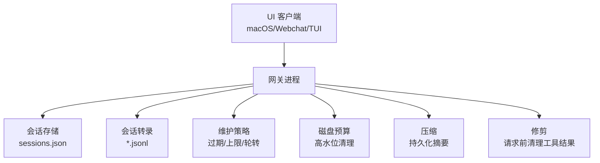
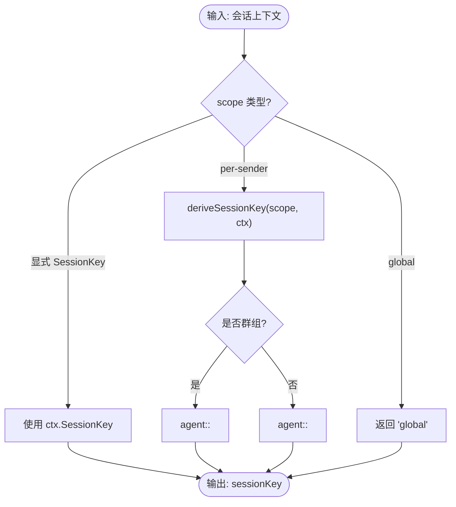
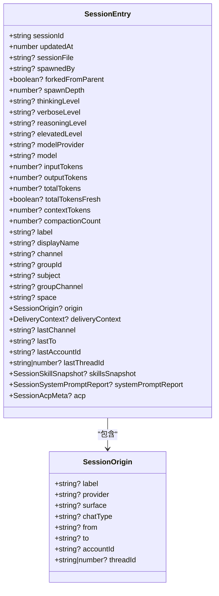
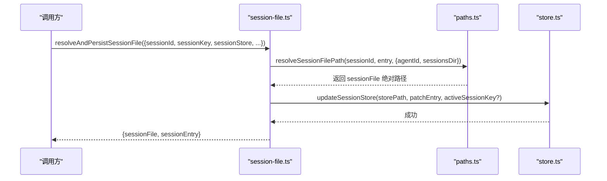
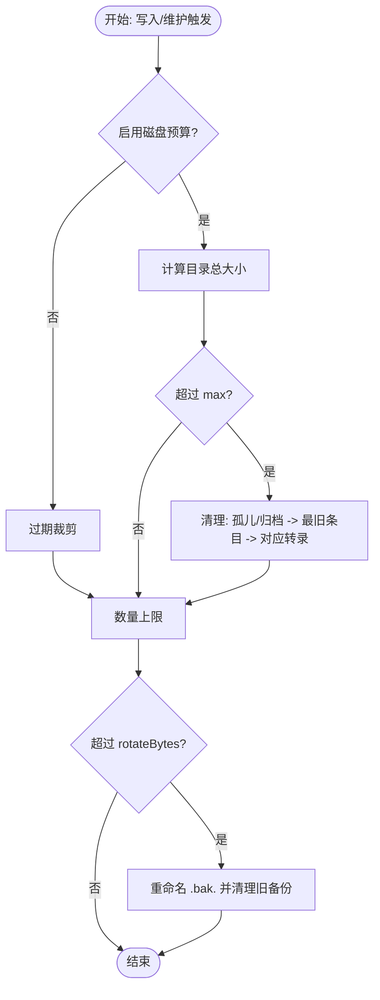
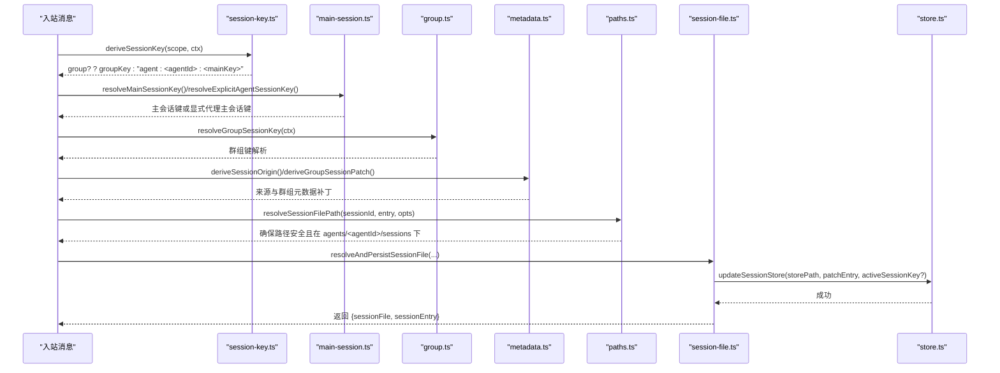
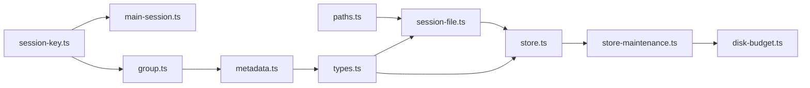

# 会话管理

<cite>
**本文引用的文件**
- [docs/concepts/session.md](file://docs/concepts/session.md)
- [docs/reference/session-management-compaction.md](file://docs/reference/session-management-compaction.md)
- [docs/concepts/session-pruning.md](file://docs/concepts/session-pruning.md)
- [src/config/sessions/types.ts](file://src/config/sessions/types.ts)
- [src/config/sessions/paths.ts](file://src/config/sessions/paths.ts)
- [src/config/sessions/group.ts](file://src/config/sessions/group.ts)
- [src/config/sessions/metadata.ts](file://src/config/sessions/metadata.ts)
- [src/config/sessions/session-key.ts](file://src/config/sessions/session-key.ts)
- [src/config/sessions/main-session.ts](file://src/config/sessions/main-session.ts)
- [src/config/sessions/store-maintenance.ts](file://src/config/sessions/store-maintenance.ts)
- [src/config/sessions/store-cache.ts](file://src/config/sessions/store-cache.ts)
- [src/config/sessions/session-file.ts](file://src/config/sessions/session-file.ts)
- [src/config/sessions/disk-budget.ts](file://src/config/sessions/disk-budget.ts)
</cite>

## 目录
1. [简介](#简介)
2. [项目结构](#项目结构)
3. [核心组件](#核心组件)
4. [架构总览](#架构总览)
5. [详细组件分析](#详细组件分析)
6. [依赖关系分析](#依赖关系分析)
7. [性能考量](#性能考量)
8. [故障排除指南](#故障排除指南)
9. [结论](#结论)
10. [附录](#附录)

## 简介
本文件系统性阐述 OpenClaw 会话管理系统：会话概念与生命周期、路由与键空间、状态与元数据、消息聚合与历史管理、标识符生成与隔离、并发与持久化、压缩与清理策略，以及配置项与性能优化建议。文档以仓库内“概念”和“参考”文档为基础，并结合会话存储与路径解析、分组键、元数据派生、维护与磁盘预算等实现模块，帮助开发者快速掌握会话管理的核心机制与最佳实践。

## 项目结构
围绕会话管理的关键目录与文件如下：
- 概念与参考文档：会话路由、生命周期、维护策略、压缩与静默写入等
- 会话类型与字段：会话条目、运行时模型字段、合并策略、令牌计数等
- 路径与文件：会话存储与转录文件的解析、校验与安全落盘
- 分组与元数据：群组键解析、显示名构建、来源元数据派生
- 键空间与主会话：主会话键推导、显式代理主会话键、别名规范化
- 维护与缓存：过期裁剪、数量上限、轮转、缓存与序列化缓存
- 磁盘预算：按目录总大小的清理策略与执行流程

图表来源
- [docs/concepts/session.md](file://docs/concepts/session.md#L1-L311)
- [docs/reference/session-management-compaction.md](file://docs/reference/session-management-compaction.md#L1-L325)
- [docs/concepts/session-pruning.md](file://docs/concepts/session-pruning.md#L1-L122)
- [src/config/sessions/types.ts](file://src/config/sessions/types.ts#L1-L376)
- [src/config/sessions/paths.ts](file://src/config/sessions/paths.ts#L1-L308)
- [src/config/sessions/group.ts](file://src/config/sessions/group.ts#L1-L108)
- [src/config/sessions/metadata.ts](file://src/config/sessions/metadata.ts#L1-L173)
- [src/config/sessions/session-key.ts](file://src/config/sessions/session-key.ts#L1-L48)
- [src/config/sessions/main-session.ts](file://src/config/sessions/main-session.ts#L1-L80)
- [src/config/sessions/store-maintenance.ts](file://src/config/sessions/store-maintenance.ts#L1-L328)
- [src/config/sessions/store-cache.ts](file://src/config/sessions/store-cache.ts#L1-L82)
- [src/config/sessions/session-file.ts](file://src/config/sessions/session-file.ts#L1-L51)
- [src/config/sessions/disk-budget.ts](file://src/config/sessions/disk-budget.ts#L1-L376)

章节来源
- [docs/concepts/session.md](file://docs/concepts/session.md#L1-L311)
- [docs/reference/session-management-compaction.md](file://docs/reference/session-management-compaction.md#L1-L325)
- [docs/concepts/session-pruning.md](file://docs/concepts/session-pruning.md#L1-L122)

## 核心组件
- 会话键空间与路由
  - 主会话键：默认 agent:<agentId>:<mainKey>（默认 main），支持全局模式与显式代理主会话键
  - 直聊与群聊：直聊默认收敛到主会话键；群组/频道/房间/主题独立键
  - 来源元数据：记录 label/provider/from/to/accountId/threadId 等，便于 UI 展示与溯源
- 会话状态与元数据
  - SessionEntry 字段覆盖：聊天类型、令牌计数、发送策略、队列模式、运行时模型、ACP 元信息、系统提示报告等
  - 合并策略：保留活动或触活动性的合并策略，确保 updatedAt 一致性
- 存储与文件
  - sessions.json：键值映射 sessionKey -> SessionEntry
  - *.jsonl：会话转录（树形结构，含 message/custom_message/custom/compaction/branch_summary）
  - 路径解析：安全校验、跨根兼容、相对路径约束、主题线程文件名
- 维护与清理
  - 过期裁剪、数量上限、文件轮转、磁盘预算（高水位）、清理顺序与日志
- 压缩与修剪
  - 自动压缩（持久化摘要）与请求前修剪（仅 Anthropic 缓存 TTL 场景）

章节来源
- [src/config/sessions/types.ts](file://src/config/sessions/types.ts#L68-L167)
- [src/config/sessions/paths.ts](file://src/config/sessions/paths.ts#L235-L277)
- [src/config/sessions/group.ts](file://src/config/sessions/group.ts#L54-L107)
- [src/config/sessions/metadata.ts](file://src/config/sessions/metadata.ts#L45-L172)
- [src/config/sessions/store-maintenance.ts](file://src/config/sessions/store-maintenance.ts#L130-L148)
- [src/config/sessions/disk-budget.ts](file://src/config/sessions/disk-budget.ts#L188-L375)

## 架构总览
会话管理由“网关为主”的单源真相设计：UI 客户端通过网关查询会话列表与令牌统计；会话状态与转录分别持久化在 sessions.json 与 *.jsonl；维护与磁盘预算在写入路径上自动执行；压缩与修剪分别作用于内存上下文与磁盘历史。

图表来源
- [docs/concepts/session.md](file://docs/concepts/session.md#L57-L72)
- [docs/reference/session-management-compaction.md](file://docs/reference/session-management-compaction.md#L31-L64)
- [src/config/sessions/store-maintenance.ts](file://src/config/sessions/store-maintenance.ts#L155-L174)
- [src/config/sessions/disk-budget.ts](file://src/config/sessions/disk-budget.ts#L188-L375)

## 详细组件分析

### 会话键空间与路由
- 主会话键推导
  - 支持全局模式、默认代理与自定义 mainKey 的组合
  - 别名规范化：main、mainKey、agent:<agentId>:main、agent:<agentId>:<mainKey> 均可归一为主会话键
- 直聊与群聊键
  - 直聊：根据 dmScope 决定收敛到主会话或按 sender/channel/account 隔离
  - 群组/频道/房间/主题：使用标准化的 agent:<agentId>:<channel>:(group|channel):<id> 或带 topic 的变体
- 来源元数据
  - label/provider/surface/chatType/from/to/accountId/threadId 等，用于 UI 解释与溯源

图表来源
- [src/config/sessions/session-key.ts](file://src/config/sessions/session-key.ts#L12-L47)
- [src/config/sessions/main-session.ts](file://src/config/sessions/main-session.ts#L11-L79)
- [src/config/sessions/group.ts](file://src/config/sessions/group.ts#L54-L107)
- [src/config/sessions/metadata.ts](file://src/config/sessions/metadata.ts#L45-L87)

章节来源
- [src/config/sessions/session-key.ts](file://src/config/sessions/session-key.ts#L1-L48)
- [src/config/sessions/main-session.ts](file://src/config/sessions/main-session.ts#L1-L80)
- [src/config/sessions/group.ts](file://src/config/sessions/group.ts#L1-L108)
- [src/config/sessions/metadata.ts](file://src/config/sessions/metadata.ts#L1-L173)
- [docs/concepts/session.md](file://docs/concepts/session.md#L189-L206)

### 会话状态与元数据
- SessionEntry 字段族
  - 运行时模型：provider/model
  - 令牌计数：input/output/total/context
  - 发送策略与队列：sendPolicy、queueMode/queueCap/queueDrop/debounceMs
  - 系统提示报告、技能快照、ACP 元信息、最后通道/账号/线程等
- 合并与规范化
  - mergeSessionEntryWithPolicy：支持保留活动或触活动性策略
  - normalizeSessionRuntimeModelFields：对 provider/model 去空格与清理
- 来源与群组元数据派生
  - deriveSessionOrigin：从上下文提取 label/provider/surface/chatType/from/to/accountId/threadId
  - deriveGroupSessionPatch/buildGroupDisplayName：群组键与显示名

图表来源
- [src/config/sessions/types.ts](file://src/config/sessions/types.ts#L68-L167)
- [src/config/sessions/metadata.ts](file://src/config/sessions/metadata.ts#L14-L43)

章节来源
- [src/config/sessions/types.ts](file://src/config/sessions/types.ts#L1-L376)
- [src/config/sessions/metadata.ts](file://src/config/sessions/metadata.ts#L1-L173)

### 存储与文件解析
- 路径解析与安全
  - validateSessionId：会话 ID 正则校验
  - resolveSessionFilePath/resolveSessionTranscriptPath：基于 sessionId 与 entry.sessionFile 推导绝对路径，严格限制在 agents/<agentId>/sessions 下
  - 跨根兼容与结构化回退：处理旧版绝对路径与多代理场景
- 会话文件解析与持久化
  - resolveAndPersistSessionFile：若 entry.sessionFile 为空或不合法，基于 sessionId 与目录重新解析并写回 store
- 缓存与序列化缓存
  - 结构化克隆缓存对象，避免重复解析；序列化字符串缓存用于快速读取

图表来源
- [src/config/sessions/session-file.ts](file://src/config/sessions/session-file.ts#L5-L50)
- [src/config/sessions/paths.ts](file://src/config/sessions/paths.ts#L262-L277)

章节来源
- [src/config/sessions/paths.ts](file://src/config/sessions/paths.ts#L60-L90)
- [src/config/sessions/paths.ts](file://src/config/sessions/paths.ts#L235-L277)
- [src/config/sessions/session-file.ts](file://src/config/sessions/session-file.ts#L1-L51)
- [src/config/sessions/store-cache.ts](file://src/config/sessions/store-cache.ts#L1-L82)

### 维护与清理策略
- 过期裁剪：删除 updatedAt 早于阈值的条目
- 数量上限：按 updatedAt 降序保留最活跃 N 个条目
- 文件轮转：超过阈值大小重命名为 .bak.<timestamp>，最多保留最近 3 份备份
- 磁盘预算：按目录总大小清理，优先移除孤儿/归档文件，再剔除最旧条目及其转录文件，直至达到高水位

图表来源
- [src/config/sessions/store-maintenance.ts](file://src/config/sessions/store-maintenance.ts#L155-L174)
- [src/config/sessions/store-maintenance.ts](file://src/config/sessions/store-maintenance.ts#L226-L259)
- [src/config/sessions/store-maintenance.ts](file://src/config/sessions/store-maintenance.ts#L275-L327)
- [src/config/sessions/disk-budget.ts](file://src/config/sessions/disk-budget.ts#L188-L375)

章节来源
- [src/config/sessions/store-maintenance.ts](file://src/config/sessions/store-maintenance.ts#L1-L328)
- [src/config/sessions/disk-budget.ts](file://src/config/sessions/disk-budget.ts#L1-L376)

### 压缩与修剪
- 自动压缩（持久化摘要）
  - 在溢出恢复或阈值维护后，将旧内容摘要化并保留近期消息，减少上下文体积
  - 通过 SessionManager 读写 *.jsonl，不“修复”历史，保持只增结构
- 请求前修剪（会话修剪）
  - 针对 Anthropic 缓存 TTL 的工具结果进行软修剪/硬清除，降低 prompt 缓存写入成本
  - 仅影响本次请求上下文，不改写磁盘历史

章节来源
- [docs/reference/session-management-compaction.md](file://docs/reference/session-management-compaction.md#L200-L228)
- [docs/reference/session-management-compaction.md](file://docs/reference/session-management-compaction.md#L270-L313)
- [docs/concepts/session-pruning.md](file://docs/concepts/session-pruning.md#L11-L122)

### 生命周期与重置
- 重置策略
  - 默认每日重置（本地时间 4:00）；可叠加空闲窗口（idleMinutes）
  - per-type 与 per-channel 覆盖；/new 与 /reset 触发新 sessionId
  - 隔离的 cron 作业每次运行生成新 sessionId
- 状态维护
  - updatedAt 作为活跃度与过期判断依据；合并策略可保留或触活动性

章节来源
- [docs/concepts/session.md](file://docs/concepts/session.md#L207-L218)
- [src/config/sessions/types.ts](file://src/config/sessions/types.ts#L246-L284)

### 会话创建、更新、销毁流程（代码级）
以下流程图映射到具体实现文件，展示从键推导到文件解析与存储更新的完整链路。

图表来源
- [src/config/sessions/session-key.ts](file://src/config/sessions/session-key.ts#L12-L47)
- [src/config/sessions/main-session.ts](file://src/config/sessions/main-session.ts#L11-L79)
- [src/config/sessions/group.ts](file://src/config/sessions/group.ts#L54-L107)
- [src/config/sessions/metadata.ts](file://src/config/sessions/metadata.ts#L45-L172)
- [src/config/sessions/paths.ts](file://src/config/sessions/paths.ts#L262-L277)
- [src/config/sessions/session-file.ts](file://src/config/sessions/session-file.ts#L5-L50)

## 依赖关系分析
- 模块耦合
  - session-key 与 main-session 协作决定会话键
  - group 与 metadata 共同构建群组键与显示名
  - paths 与 session-file 负责安全路径解析与持久化
  - store-maintenance 与 disk-budget 在写入路径上协同清理
  - types 提供统一的数据结构与合并策略
- 外部依赖
  - SessionManager（@mariozechner/pi-coding-agent）负责 *.jsonl 的读写与树形结构维护
  - CLI 工具 openclaw sessions cleanup 触发维护与预算清理

图表来源
- [src/config/sessions/session-key.ts](file://src/config/sessions/session-key.ts#L1-L48)
- [src/config/sessions/main-session.ts](file://src/config/sessions/main-session.ts#L1-L80)
- [src/config/sessions/group.ts](file://src/config/sessions/group.ts#L1-L108)
- [src/config/sessions/metadata.ts](file://src/config/sessions/metadata.ts#L1-L173)
- [src/config/sessions/paths.ts](file://src/config/sessions/paths.ts#L1-L308)
- [src/config/sessions/session-file.ts](file://src/config/sessions/session-file.ts#L1-L51)
- [src/config/sessions/store-maintenance.ts](file://src/config/sessions/store-maintenance.ts#L1-L328)
- [src/config/sessions/disk-budget.ts](file://src/config/sessions/disk-budget.ts#L1-L376)
- [src/config/sessions/types.ts](file://src/config/sessions/types.ts#L1-L376)

## 性能考量
- 大规模会话存储
  - 过高的 maxEntries 与长 pruneAfter 会增加写入延迟
  - 启用磁盘预算并设置合理 highWaterBytes，避免目录膨胀
- 维护策略
  - 使用 enforce 模式自动裁剪与轮转，减少手动干预
  - 通过 --active-key 在清理时跳过活跃会话
- 修剪与压缩
  - 合理设置 Anthropic 缓存 TTL 与修剪参数，降低 prompt 缓存写入成本
  - 自动压缩在阈值维护时触发，减少上下文体积

章节来源
- [docs/concepts/session.md](file://docs/concepts/session.md#L101-L120)
- [docs/concepts/session-pruning.md](file://docs/concepts/session-pruning.md#L73-L87)
- [docs/reference/session-management-compaction.md](file://docs/reference/session-management-compaction.md#L213-L228)

## 故障排除指南
- 会话键错误
  - 使用 openclaw status 查看当前 Gateway 主机与 store 路径，确认 sessionKey 是否符合预期
- 存储与转录不一致
  - 确认 UI 客户端从网关查询而非本地文件
- 压缩频繁
  - 检查模型上下文窗口、compaction 设置与工具结果体量，必要时启用/调整 session pruning
- 静默操作泄露
  - 确认回复以 NO_REPLY 开头并在构建版本中启用了流式抑制

章节来源
- [docs/reference/session-management-compaction.md](file://docs/reference/session-management-compaction.md#L316-L325)
- [docs/concepts/session.md](file://docs/concepts/session.md#L295-L311)

## 结论
OpenClaw 的会话管理以“网关为主”的双层持久化为核心：sessions.json 记录会话元数据与状态，*.jsonl 保存转录历史；通过严格的键空间与来源元数据派生、安全路径解析与持久化、维护与磁盘预算策略，保障大规模部署下的稳定性与可维护性。自动压缩与请求前修剪进一步优化上下文与成本。遵循本文档的配置与优化建议，可在多用户、多账户、高并发场景下获得可靠的会话体验。

## 附录
- 关键配置项（节选）
  - session.maintenance.mode/warn/enforce
  - session.maintenance.pruneAfter/maxEntries/rotateBytes/resetArchiveRetention
  - session.maintenance.maxDiskBytes/highWaterBytes
  - session.reset/resetByType/resetByChannel/resetTriggers
  - agents.defaults.contextPruning（mode/cache-ttl 等）
- 常用命令
  - openclaw sessions cleanup [--dry-run/--enforce]
  - openclaw status/sessions

章节来源
- [docs/concepts/session.md](file://docs/concepts/session.md#L74-L176)
- [docs/concepts/session-pruning.md](file://docs/concepts/session-pruning.md#L78-L122)
- [docs/reference/session-management-compaction.md](file://docs/reference/session-management-compaction.md#L88-L93)