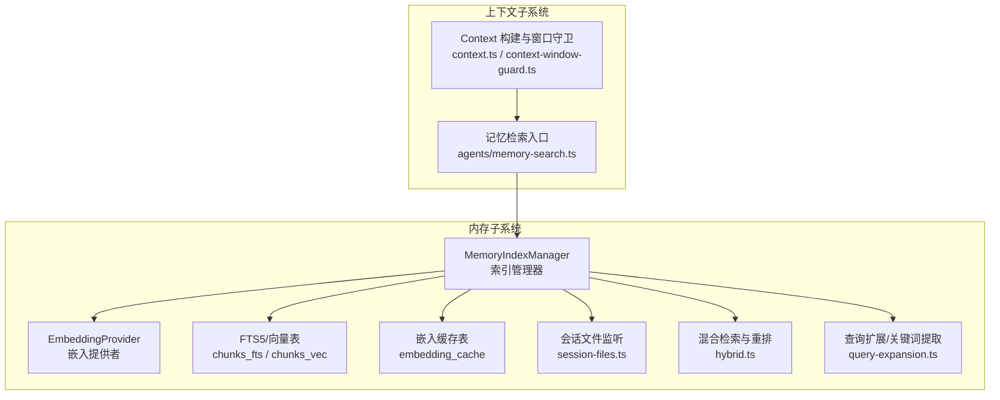
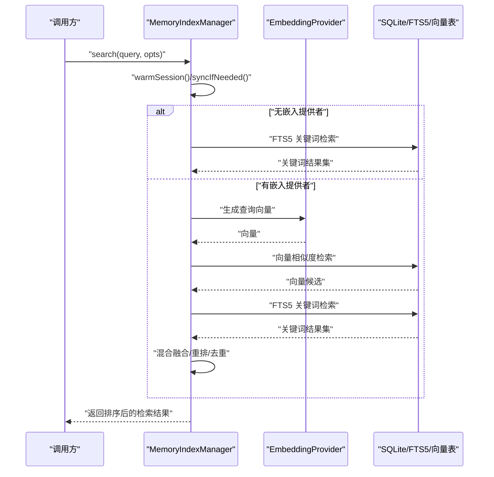
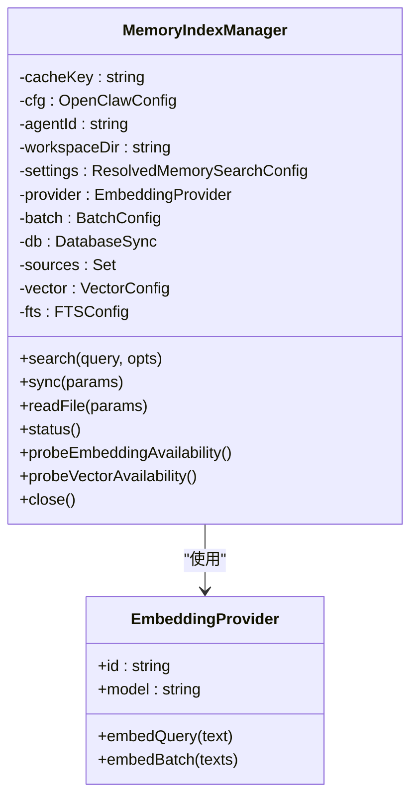
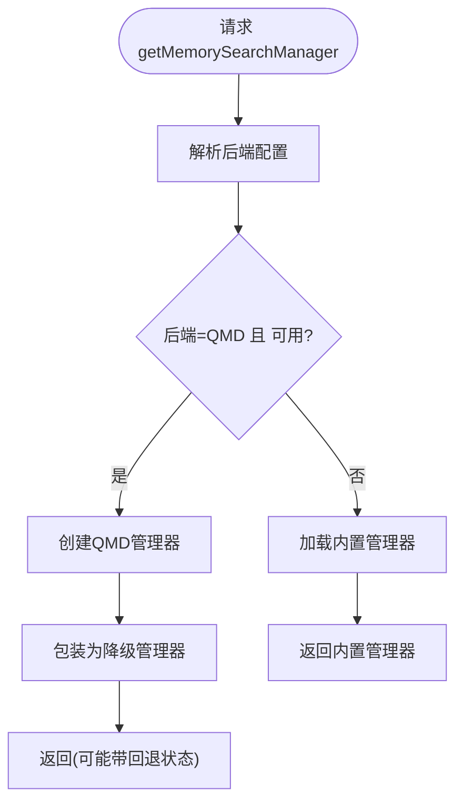
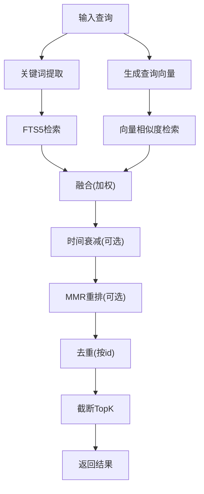
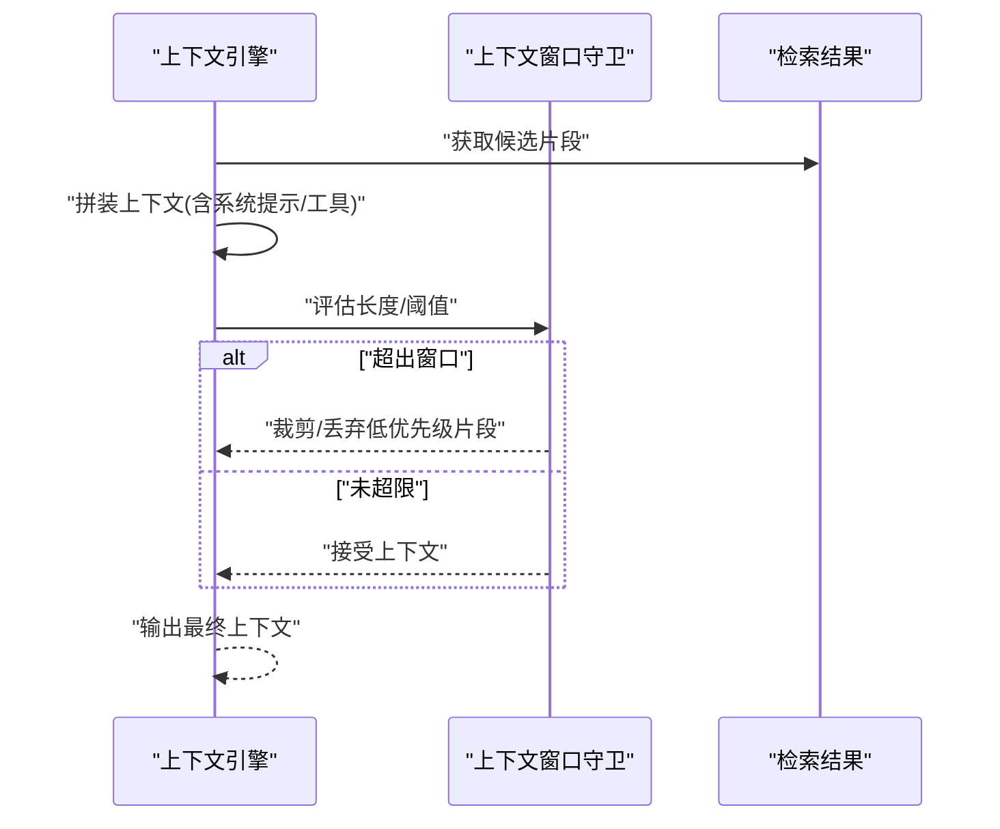
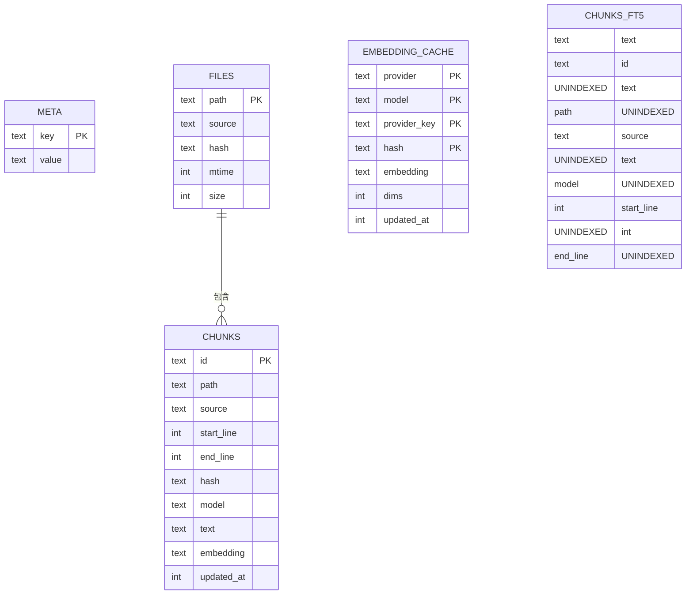
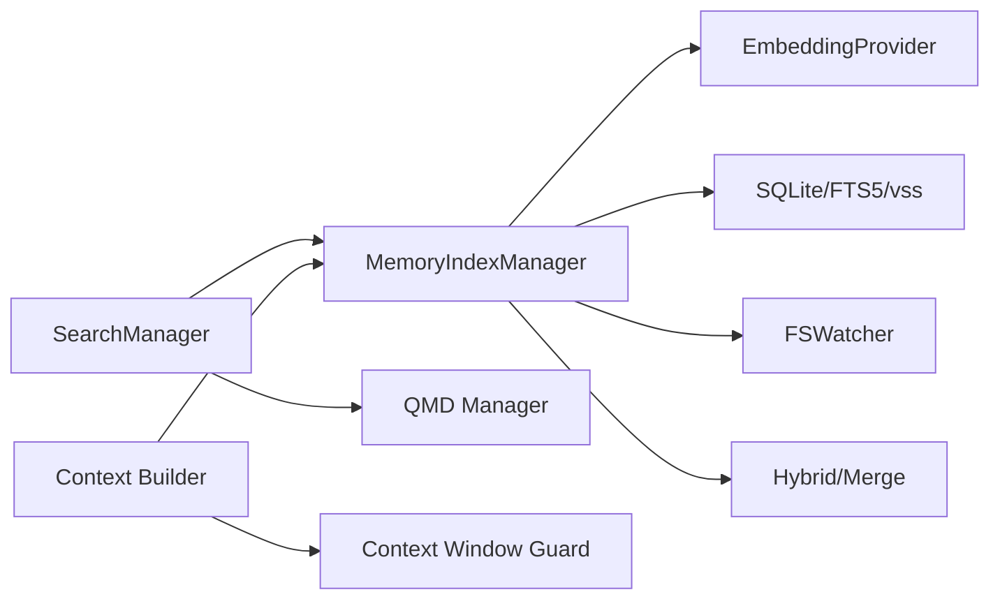

# 内存与上下文

<cite>
**本文引用的文件**
- [src/memory/index.ts](file://src/memory/index.ts)
- [src/memory/manager.ts](file://src/memory/manager.ts)
- [src/memory/types.ts](file://src/memory/types.ts)
- [src/memory/memory-schema.ts](file://src/memory/memory-schema.ts)
- [src/memory/search-manager.ts](file://src/memory/search-manager.ts)
- [src/memory/manager-search.ts](file://src/memory/manager-search.ts)
- [src/memory/hybrid.ts](file://src/memory/hybrid.ts)
- [src/memory/embeddings.ts](file://src/memory/embeddings.ts)
- [src/memory/manager-embedding-ops.ts](file://src/memory/manager-embedding-ops.ts)
- [src/memory/manager-sync-ops.ts](file://src/memory/manager-sync-ops.ts)
- [src/memory/session-files.ts](file://src/memory/session-files.ts)
- [src/memory/internal.ts](file://src/memory/internal.ts)
- [src/memory/fs-utils.ts](file://src/memory/fs-utils.ts)
- [src/memory/backend-config.ts](file://src/memory/backend-config.ts)
- [src/memory/qmd-manager.ts](file://src/memory/qmd-manager.ts)
- [src/agents/context.ts](file://src/agents/context.ts)
- [src/agents/context-window-guard.ts](file://src/agents/context-window-guard.ts)
- [src/agents/memory-search.ts](file://src/agents/memory-search.ts)
- [docs/concepts/memory.md](file://docs/concepts/memory.md)
- [docs/concepts/context.md](file://docs/concepts/context.md)
- [docs/cli/memory.md](file://docs/cli/memory.md)
</cite>

## 目录
1. [简介](#简介)
2. [项目结构](#项目结构)
3. [核心组件](#核心组件)
4. [架构总览](#架构总览)
5. [组件详解](#组件详解)
6. [依赖关系分析](#依赖关系分析)
7. [性能考量](#性能考量)
8. [故障排查指南](#故障排查指南)
9. [结论](#结论)
10. [附录](#附录)

## 简介
本文件面向OpenClaw的“内存与上下文”子系统，系统性阐述其内存存储机制、上下文窗口管理、历史记录维护、记忆检索算法（关键词+向量混合）、向量索引与相似度匹配、上下文构建策略、信息压缩与去重、内存优化与缓存、持久化方案、配置与容量规划、性能调优等主题。文档以代码为依据，辅以图示帮助开发者快速理解并高效实现。

## 项目结构
OpenClaw的内存与上下文能力主要集中在src/memory目录，围绕SQLite数据库、FTS5全文检索、sqlite-vss向量扩展、嵌入模型提供者、混合检索与重排、会话文件监听与增量同步等模块协同工作。同时，上下文窗口与上下文构建逻辑位于src/agents目录，二者通过配置与接口协作，形成“检索-上下文-输出”的闭环。

图表来源
- [src/memory/manager.ts](file://src/memory/manager.ts#L45-L222)
- [src/memory/embeddings.ts](file://src/memory/embeddings.ts#L166-L286)
- [src/memory/memory-schema.ts](file://src/memory/memory-schema.ts#L3-L83)
- [src/memory/hybrid.ts](file://src/memory/hybrid.ts#L51-L149)
- [src/memory/session-files.ts](file://src/memory/session-files.ts)
- [src/agents/context.ts](file://src/agents/context.ts)
- [src/agents/context-window-guard.ts](file://src/agents/context-window-guard.ts)
- [src/agents/memory-search.ts](file://src/agents/memory-search.ts)

章节来源
- [src/memory/index.ts](file://src/memory/index.ts#L1-L8)
- [src/memory/manager.ts](file://src/memory/manager.ts#L45-L222)
- [src/memory/memory-schema.ts](file://src/memory/memory-schema.ts#L3-L83)

## 核心组件
- MemoryIndexManager：内存索引与检索主控，负责数据库初始化、向量/FTS可用性探测、混合检索、批处理、只读恢复、状态统计、关闭清理等。
- EmbeddingProvider：统一抽象嵌入提供者（本地/远程），支持自动选择、回退、错误格式化。
- 搜索管理器：根据后端配置选择内置索引或QMD后端，并在失败时进行降级回退。
- 混合检索与重排：关键词（BM25）与向量（余弦）融合，支持MMR多样性重排与时间衰减。
- 上下文构建：从检索结果中抽取片段、计算窗口占用、裁剪与拼接，确保不超过上下文窗口限制。
- 会话文件监听：对会话相关文件变更进行增量同步，避免全量扫描。

章节来源
- [src/memory/manager.ts](file://src/memory/manager.ts#L45-L787)
- [src/memory/types.ts](file://src/memory/types.ts#L1-L81)
- [src/memory/search-manager.ts](file://src/memory/search-manager.ts#L25-L86)
- [src/memory/hybrid.ts](file://src/memory/hybrid.ts#L51-L149)
- [src/agents/context.ts](file://src/agents/context.ts)
- [src/agents/context-window-guard.ts](file://src/agents/context-window-guard.ts)

## 架构总览
OpenClaw内存子系统采用“内置SQLite + 可选向量扩展 + FTS5全文检索”的混合架构。检索流程支持三种模式：
- FTS-only：无嵌入提供者时，仅用FTS5关键词检索。
- 向量-only：有嵌入提供者但FTS不可用时，基于向量相似度检索。
- 混合检索：同时利用向量与关键词，按权重融合，并可选应用MMR与时间衰减。

图表来源
- [src/memory/manager.ts](file://src/memory/manager.ts#L240-L348)
- [src/memory/manager-search.ts](file://src/memory/manager-search.ts#L20-L94)
- [src/memory/hybrid.ts](file://src/memory/hybrid.ts#L51-L149)
- [src/memory/embeddings.ts](file://src/memory/embeddings.ts#L32-L38)

## 组件详解

### 内存索引管理器（MemoryIndexManager）
职责与特性
- 单例缓存：按agentId/workspace/settings组合缓存实例，避免重复初始化。
- 数据库与模式：确保meta/files/chunks/embedding_cache/FTS表存在；支持列演进（新增source列）。
- 嵌入提供者：支持自动选择与回退；在缺失API Key时降级为FTS-only。
- 检索：按需触发同步；支持会话热身；混合检索与重排；最小分数与最大结果数控制。
- 批处理：可配置并发、轮询间隔、超时、失败上限；失败锁定防止风暴。
- 只读恢复：检测SQLite只读错误，重建连接并重试。
- 状态：聚合文件/块数量、源分布、缓存条目、向量/FTS/批处理状态、回退原因等。

图表来源
- [src/memory/manager.ts](file://src/memory/manager.ts#L45-L222)
- [src/memory/embeddings.ts](file://src/memory/embeddings.ts#L32-L38)

章节来源
- [src/memory/manager.ts](file://src/memory/manager.ts#L117-L222)
- [src/memory/memory-schema.ts](file://src/memory/memory-schema.ts#L3-L83)
- [src/memory/types.ts](file://src/memory/types.ts#L24-L59)

### 搜索管理器与后端选择（getMemorySearchManager）
- 后端优先级：若配置为QMD且可用，则优先使用；否则回退到内置索引。
- 降级回退：QMD失败时记录错误并切换到内置索引；缓存失效策略保证下次重试。
- 状态透传：当QMD失败时，在状态中附加回退信息，便于诊断。

图表来源
- [src/memory/search-manager.ts](file://src/memory/search-manager.ts#L25-L86)

章节来源
- [src/memory/search-manager.ts](file://src/memory/search-manager.ts#L25-L86)

### 检索算法与向量/关键词融合
- 向量检索：使用sqlite-vss的向量距离函数，按余弦距离排序；若向量扩展不可用则回退到纯内存向量列表计算相似度。
- 关键词检索：FTS5 BM25评分转换为相似度；支持查询扩展（关键词提取）。
- 融合与重排：按权重融合向量与文本得分；可选应用MMR多样性重排与时间衰减；最终按分数排序并截断。
- 去重：按chunk唯一标识合并多来源结果，保留最高分。

图表来源
- [src/memory/manager-search.ts](file://src/memory/manager-search.ts#L20-L94)
- [src/memory/hybrid.ts](file://src/memory/hybrid.ts#L51-L149)

章节来源
- [src/memory/manager-search.ts](file://src/memory/manager-search.ts#L20-L192)
- [src/memory/hybrid.ts](file://src/memory/hybrid.ts#L51-L149)

### 上下文构建与窗口管理
- 上下文构建：从检索结果中抽取片段，结合系统提示、工具描述等，拼装成上下文。
- 窗口守卫：计算上下文长度（token/字符），在超过阈值时进行裁剪或丢弃低优先级片段。
- 会话上下文：支持按会话键进行热身与增量同步，减少冷启动成本。

图表来源
- [src/agents/context.ts](file://src/agents/context.ts)
- [src/agents/context-window-guard.ts](file://src/agents/context-window-guard.ts)

章节来源
- [src/agents/context.ts](file://src/agents/context.ts)
- [src/agents/context-window-guard.ts](file://src/agents/context-window-guard.ts)

### 数据模型与内存布局
- 元数据表：meta（键值对，用于存储向量维度等元信息）。
- 文件表：files（路径、来源、哈希、mtime、size）。
- 块表：chunks（id、路径、来源、行列范围、哈希、模型、文本、向量、更新时间）。
- 嵌入缓存表：embedding_cache（provider/model/provider_key/hash→embedding/dims/updated_at）。
- FTS虚拟表：chunks_fts（text/id/path/source/model/start_line/end_line）。
- 索引：chunks.path、chunks.source、embedding_cache.updated_at。

图表来源
- [src/memory/memory-schema.ts](file://src/memory/memory-schema.ts#L3-L83)

章节来源
- [src/memory/memory-schema.ts](file://src/memory/memory-schema.ts#L3-L83)

### 历史记录维护与增量同步
- 会话监听：对会话相关文件进行监听，记录变更集合，按会话键增量同步。
- 增量策略：跟踪文件大小、待处理字节与消息数，避免全量扫描。
- 定时同步：周期性触发同步，保证离线场景下的数据一致性。
- 只读恢复：检测只读错误后重建连接并重试，提升鲁棒性。

章节来源
- [src/memory/manager.ts](file://src/memory/manager.ts#L100-L116)
- [src/memory/session-files.ts](file://src/memory/session-files.ts)

### 记忆检索接口与类型定义
- 检索结果：包含路径、行列范围、相似度分数、片段、来源、可选引用。
- 进度更新：同步过程中的完成/总数/标签。
- 提供者状态：后端、提供者、模型、来源、缓存、FTS、向量、批处理、自定义信息等。
- 搜索管理器接口：search/readFile/status/sync/probeEmbeddingAvailability/probeVectorAvailability/close。

章节来源
- [src/memory/types.ts](file://src/memory/types.ts#L3-L81)

### 嵌入提供者与向量规范化
- 统一抽象：提供统一的embedQuery/embedBatch接口，屏蔽本地/远程差异。
- 自动选择：当请求为“auto”时，优先尝试本地模型，其次远程提供商（排除Ollama以避免误判）。
- 回退策略：主提供者失败时按配置回退；若均因API Key缺失则降级为FTS-only。
- 向量规范化：对输出向量进行有限值清洗与归一化，确保相似度稳定。

章节来源
- [src/memory/embeddings.ts](file://src/memory/embeddings.ts#L166-L286)

### 持久化与缓存
- SQLite持久化：所有索引与元数据持久化于SQLite，支持事务与索引加速。
- 嵌入缓存：对已生成的向量进行缓存，避免重复计算；按过期时间索引。
- FTS5：全文检索，适合关键词匹配与短语检索。
- 向量扩展：sqlite-vss提供向量距离计算，支持cosine相似度。

章节来源
- [src/memory/memory-schema.ts](file://src/memory/memory-schema.ts#L3-L83)
- [src/memory/embeddings.ts](file://src/memory/embeddings.ts#L32-L38)

## 依赖关系分析
- 组件耦合
  - MemoryIndexManager依赖EmbeddingProvider、SQLite、FTS5、sqlite-vss、文件系统监听。
  - 搜索管理器通过后端配置解耦QMD与内置实现，具备降级能力。
  - 上下文构建依赖检索结果与窗口守卫，形成闭环。
- 外部依赖
  - sqlite-vss：向量相似度检索。
  - node-llama-cpp：本地嵌入模型推理（可选）。
  - chokidar：文件系统监听。
- 循环依赖
  - 未发现直接循环；搜索管理器通过动态导入避免运行时循环。

图表来源
- [src/memory/manager.ts](file://src/memory/manager.ts#L1-L40)
- [src/memory/search-manager.ts](file://src/memory/search-manager.ts#L15-L18)
- [src/agents/context.ts](file://src/agents/context.ts)
- [src/agents/context-window-guard.ts](file://src/agents/context-window-guard.ts)

章节来源
- [src/memory/manager.ts](file://src/memory/manager.ts#L1-L40)
- [src/memory/search-manager.ts](file://src/memory/search-manager.ts#L15-L18)

## 性能考量
- 检索性能
  - 向量检索：优先使用sqlite-vss的原生距离函数；候选数按权重放大再截断，平衡召回与性能。
  - 关键词检索：FTS5 BM25评分转换为相似度，避免复杂排序。
  - 混合融合：先按权重融合，再应用MMR/时间衰减，减少后续排序开销。
- 存储与索引
  - 为chunks.path与chunks.source建立索引，加速过滤与JOIN。
  - embedding_cache按updated_at建立索引，便于LRU清理。
- 批处理
  - 可配置并发与轮询间隔，失败次数达到上限后进入等待锁定，避免雪崩。
- 缓存
  - 嵌入缓存显著降低重复查询成本；缓存条目上限可配置。
- I/O与监听
  - 会话文件监听与定时同步相结合，减少全量扫描；增量delta记录避免重复处理。

章节来源
- [src/memory/manager.ts](file://src/memory/manager.ts#L34-L38)
- [src/memory/memory-schema.ts](file://src/memory/memory-schema.ts#L77-L82)
- [src/memory/hybrid.ts](file://src/memory/hybrid.ts#L51-L149)

## 故障排查指南
- 嵌入提供者不可用
  - 现象：返回FTS-only模式或探针失败。
  - 排查：检查API Key、网络连通、回退配置；查看状态中的providerUnavailableReason。
- 只读数据库错误
  - 现象：SQLite报只读错误。
  - 处理：系统自动重建连接并重试；可在状态中查看readonlyRecovery统计。
- 混合检索结果为空
  - 现象：向量与关键词均无命中。
  - 处理：调整minScore、maxResults、候选倍数；确认FTS可用性与关键词提取是否有效。
- 向量扩展不可用
  - 现象：probeVectorAvailability返回false。
  - 处理：检查sqlite-vss安装与加载；确认向量维度与模型一致。
- 会话同步异常
  - 现象：增量同步不生效或频繁触发。
  - 处理：检查会话监听配置、文件权限、定时器状态；查看dirty/sessionsDirty标志。

章节来源
- [src/memory/manager.ts](file://src/memory/manager.ts#L452-L535)
- [src/memory/types.ts](file://src/memory/types.ts#L24-L59)

## 结论
OpenClaw的内存与上下文系统通过“内置SQLite + FTS5 + 可选向量扩展”的组合，实现了高召回、可解释、可扩展的记忆检索能力。配合混合检索、MMR与时间衰减、嵌入缓存、增量同步与只读恢复等机制，既满足了性能需求，也兼顾了稳定性与可观测性。上下文构建与窗口守卫进一步保障了输出质量与资源约束。建议在生产环境中合理配置批处理、缓存与候选策略，并结合CLI与状态接口进行持续监控与容量规划。

## 附录

### 内存配置与容量规划
- 嵌入缓存
  - 启用缓存可显著降低重复嵌入成本；建议设置合理的maxEntries并定期清理。
- 检索参数
  - candidateMultiplier：在混合检索中扩大候选集，提高召回；需与maxResults平衡。
  - minScore：过滤低质量结果；在纯关键词模式下可适当放宽。
- 批处理
  - 并发与轮询间隔应根据硬件与网络状况调整；失败上限避免风暴。
- FTS/向量
  - 在仅有关键词需求时可禁用向量；在需要语义匹配时启用向量并确保sqlite-vss可用。
- 会话同步
  - 开启onSessionStart与onSearch触发，结合定时同步，确保数据新鲜度。

章节来源
- [src/memory/manager.ts](file://src/memory/manager.ts#L260-L264)
- [src/memory/types.ts](file://src/memory/types.ts#L24-L59)
- [docs/cli/memory.md](file://docs/cli/memory.md)