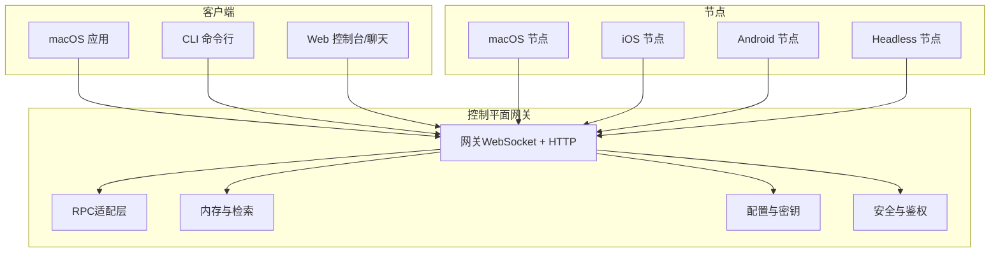
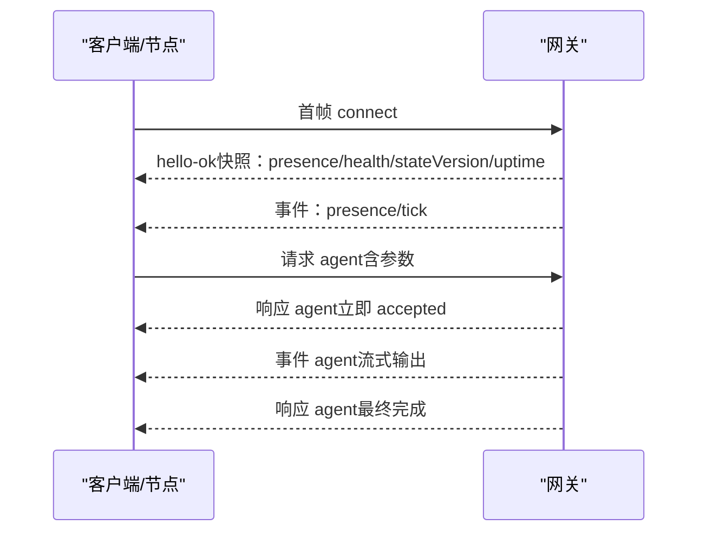
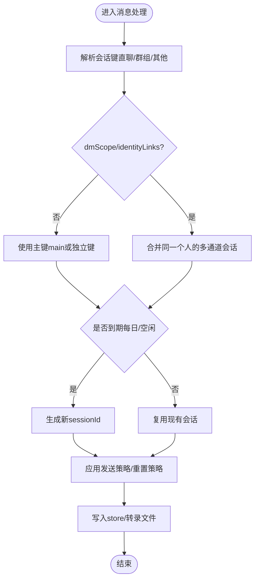
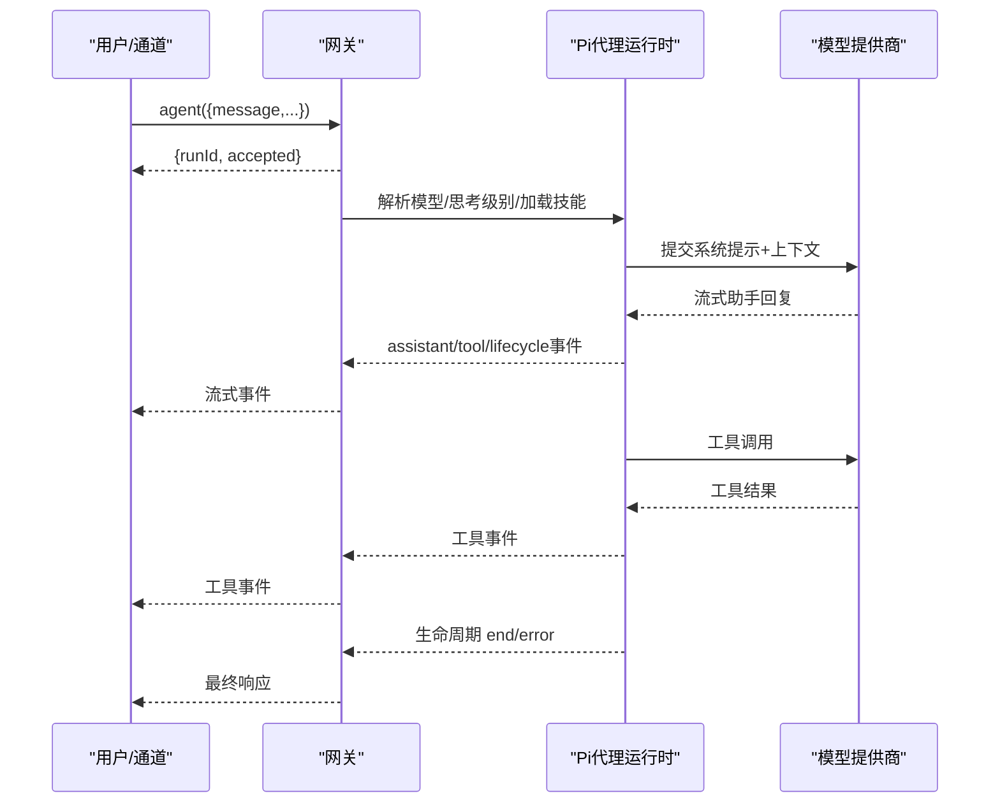
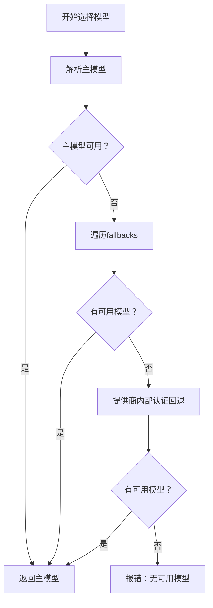
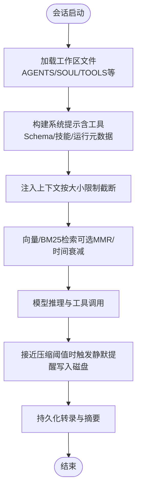
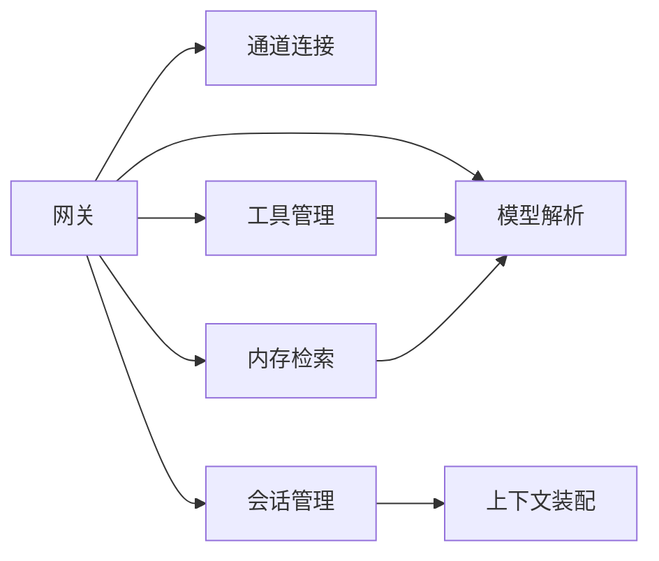

# 核心概念

<cite>
**本文引用的文件**
- [README.md](file://README.md)
- [architecture.md](file://docs/concepts/architecture.md)
- [gateway/index.md](file://docs/gateway/index.md)
- [session.md](file://docs/concepts/session.md)
- [memory.md](file://docs/concepts/memory.md)
- [models.md](file://docs/concepts/models.md)
- [agent.md](file://docs/concepts/agent.md)
- [context.md](file://docs/concepts/context.md)
- [authentication.md](file://docs/gateway/authentication.md)
- [session-tool.md](file://docs/concepts/session-tool.md)
- [agent-loop.md](file://docs/concepts/agent-loop.md)
</cite>

## 目录
1. [引言](#引言)
2. [项目结构](#项目结构)
3. [核心组件](#核心组件)
4. [架构总览](#架构总览)
5. [详细组件分析](#详细组件分析)
6. [依赖分析](#依赖分析)
7. [性能考虑](#性能考虑)
8. [故障排查指南](#故障排查指南)
9. [结论](#结论)
10. [附录](#附录)

## 引言
本文件面向OpenClaw的核心概念，围绕“网关架构与控制平面”“会话管理”“代理运行时（Pi）”“模型选择与认证策略”“内存与上下文窗口”等主题，提供从入门到进阶的系统化说明。文档通过概念解析、流程图与时序图、配置要点与最佳实践，帮助读者建立对OpenClaw整体设计的理解，并掌握在不同场景下的调优与运维方法。

## 项目结构
OpenClaw以“单网关控制平面 + 多客户端/节点”的架构为核心：网关负责会话、通道、工具与事件的统一编排；客户端（mac应用/CLI/Web）与节点（macOS/iOS/Android/headless）通过WebSocket连接网关；网关同时承载HTTP服务（OpenAI兼容接口、工具调用、控制UI与Canvas）。

**图表来源**
- [architecture.md](file://docs/concepts/architecture.md#L12-L26)
- [gateway/index.md](file://docs/gateway/index.md#L68-L76)

**章节来源**
- [README.md](file://README.md#L185-L212)
- [architecture.md](file://docs/concepts/architecture.md#L12-L26)
- [gateway/index.md](file://docs/gateway/index.md#L68-L76)

## 核心组件
- 网关（控制平面）
  - 维护各渠道连接，暴露类型化WS API（请求/响应/事件推送），校验入站帧，发出agent/chat/presence/health/heartbeat/cron等事件。
  - 默认绑定回环地址，端口18789，支持令牌或密码鉴权。
- 客户端（mac应用/CLI/Web）
  - 单连接WS，发送请求（health/status/send/agent/system-presence）并订阅事件（tick/agent/presence/shutdown）。
- 节点（macOS/iOS/Android/headless）
  - 同一WS服务器，携带设备身份与能力声明；设备配对后获得设备令牌，后续连接自动批准（本地主机可自动批准）。
- 内存与检索
  - 工作区Markdown为“真实记忆”，支持向量检索、混合检索（BM25+向量）、时间衰减、MMR去重与缓存。
- 模型与认证
  - 支持OAuth与API Key；提供模型别名、回退链路与扫描工具；按会话/代理粒度控制认证档案顺序。
- 会话管理
  - 主键main用于一对一连续性；多用户/多账户/多通道需通过dmScope隔离；维护策略包括修剪、限额、轮换与磁盘预算。
- 上下文与提示工程
  - 系统提示由OpenClaw构建，注入工作区文件、技能列表、工具Schema与运行元数据；支持/compact压缩历史，/context检查窗口占用。

**章节来源**
- [architecture.md](file://docs/concepts/architecture.md#L27-L51)
- [gateway/index.md](file://docs/gateway/index.md#L68-L76)
- [memory.md](file://docs/concepts/memory.md#L11-L29)
- [models.md](file://docs/concepts/models.md#L16-L35)
- [session.md](file://docs/concepts/session.md#L10-L20)
- [context.md](file://docs/concepts/context.md#L12-L20)

## 架构总览
OpenClaw采用“单网关、多客户端/节点”的统一控制平面。所有消息面（WhatsApp/Telegram/Slack/Discord/Signal/iMessage/WebChat等）由网关集中接入；网关同时提供HTTP服务（OpenAI兼容接口、工具调用、控制UI与Canvas）。客户端与节点均通过WebSocket连接，首帧必须是connect，随后进行握手与鉴权；节点需声明角色与能力。

**图表来源**
- [architecture.md](file://docs/concepts/architecture.md#L59-L78)

**章节来源**
- [architecture.md](file://docs/concepts/architecture.md#L59-L78)

## 详细组件分析

### 网关架构与控制平面
- 运行模型
  - 常驻进程，统一路由、控制平面与通道连接；单一端口承载WS控制/RPC、HTTP API（OpenAI兼容/Responses/工具调用）与控制UI/钩子。
  - 默认bind为loopback，鉴权默认开启（token或password）。
- 远程访问
  - 推荐Tailscale/VPN；SSH隧道作为备选；隧道两端仍需鉴权。
- 运维快照
  - 启动命令、健康检查、守护进程（launchd/systemd）与热重载策略（hybrid/hot/restart/off）。

**章节来源**
- [gateway/index.md](file://docs/gateway/index.md#L68-L93)
- [gateway/index.md](file://docs/gateway/index.md#L108-L123)
- [gateway/index.md](file://docs/gateway/index.md#L125-L169)
- [gateway/index.md](file://docs/gateway/index.md#L202-L214)

### 会话管理机制
- 会话键规则
  - 直聊：默认main主键；可通过dmScope切换为per-peer/per-channel-peer/per-account-channel-peer；同一人跨通道可用identityLinks合并。
  - 群组：agent:<agentId>:<channel>:group:<id>；Telegram论坛主题追加:topic:<threadId>。
  - 其他：cron:<job.id>、hook:<uuid>、node-<nodeId>。
- 生命周期与重置
  - 默认每日4:00本地时间重置；可叠加空闲重置（idleMinutes）；支持按类型/按频道覆盖；/new与/reset触发新会话。
- 发送策略
  - 基于通道/聊天类型的规则集，默认允许；支持运行时/会话级覆盖。
- 存储与维护
  - sessions.json与JSONL转录文件；维护模式warn/enforce；支持按时间/数量/大小/轮换阈值清理与磁盘预算。

**图表来源**
- [session.md](file://docs/concepts/session.md#L189-L206)
- [session.md](file://docs/concepts/session.md#L207-L217)

**章节来源**
- [session.md](file://docs/concepts/session.md#L10-L20)
- [session.md](file://docs/concepts/session.md#L189-L217)
- [session.md](file://docs/concepts/session.md#L219-L244)

### 代理运行时（Pi）与RPC模式
- 运行时
  - 嵌入式代理运行时基于pi-mono；工作区为agents.defaults.workspace，首次会话注入AGENTS/SOUL/TOOLS/IDENTITY/USER等文件。
  - 工具集内置（读/写/执行/进程/浏览器/消息等），受工具策略约束；技能来自三处（内嵌/托管/工作区）。
- RPC与流式
  - Gateway RPC：agent与agent.wait；等待生命周期结束/错误；支持阻塞等待与超时。
  - 流式：assistant/tool/lifecycle事件；块流式（block streaming）可按文本结束或消息结束分段；可合并小片段减少刷屏。
- 会话与队列
  - 每会话串行执行，避免竞态；队列模式（collect/steer/followup）影响入队行为；steer模式可在工具调用后注入新消息。

**图表来源**
- [agent-loop.md](file://docs/concepts/agent-loop.md#L18-L44)
- [agent-loop.md](file://docs/concepts/agent-loop.md#L97-L102)

**章节来源**
- [agent.md](file://docs/concepts/agent.md#L12-L47)
- [agent.md](file://docs/concepts/agent.md#L49-L64)
- [agent.md](file://docs/concepts/agent.md#L73-L104)
- [agent-loop.md](file://docs/concepts/agent-loop.md#L18-L44)
- [agent-loop.md](file://docs/concepts/agent-loop.md#L97-L102)

### 模型选择与认证策略
- 选择顺序
  - 主模型 → 回退链 → 提供商内部认证回退（逐个尝试）。
- 别名与目录
  - agents.defaults.models为允许清单+别名；支持自定义提供商写入agents.defaults.models.json。
- 认证
  - API Key优先（长期运行建议）；OAuth订阅令牌支持；支持多Key轮换（仅对限流类错误重试）。
  - 会话级/代理级控制认证档案顺序；/model命令交互式切换。
- 扫描与探测
  - models scan可探测免费模型的工具/图像支持；可设置默认主模型/图像模型。

**图表来源**
- [models.md](file://docs/concepts/models.md#L16-L24)
- [authentication.md](file://docs/gateway/authentication.md#L123-L139)

**章节来源**
- [models.md](file://docs/concepts/models.md#L16-L35)
- [models.md](file://docs/concepts/models.md#L116-L137)
- [models.md](file://docs/concepts/models.md#L172-L206)
- [authentication.md](file://docs/gateway/authentication.md#L11-L18)
- [authentication.md](file://docs/gateway/authentication.md#L123-L139)

### 内存管理与上下文窗口
- 记忆文件
  - 工作区Markdown为真实记忆；默认两层：memory/YYYY-MM-DD.md（日志）与MEMORY.md（长时记忆，仅主私会话）。
- 检索与搜索
  - memory_search与memory_get；默认启用向量检索，支持BM25+向量混合检索、MMR去重、时间衰减；可配置sqlite-vec加速。
- 自动预压缩提醒
  - 在接近压缩阈值时触发静默提醒，促使模型将持久记忆写入磁盘。
- 上下文装配
  - 系统提示由OpenClaw构建，包含工具列表/Schema、技能元信息、工作区路径、时间与运行元数据；/context与/compact帮助观察与优化窗口占用。

**图表来源**
- [memory.md](file://docs/concepts/memory.md#L52-L88)
- [context.md](file://docs/concepts/context.md#L90-L101)

**章节来源**
- [memory.md](file://docs/concepts/memory.md#L11-L29)
- [memory.md](file://docs/concepts/memory.md#L92-L126)
- [memory.md](file://docs/concepts/memory.md#L386-L391)
- [context.md](file://docs/concepts/context.md#L79-L101)

### 工具系统与会话间通信
- 会话工具
  - sessions_list/sessions_history/sessions_send/sessions_spawn；支持按种类/活跃度/消息数过滤；沙箱会话可见性可限制。
- 会话间消息
  - sessions_send支持带超时等待与回传ping-pong；announce步骤可选择静默；支持线程绑定与附件传递（子代理运行时）。
- 安全与发送策略
  - 基于通道/聊天类型的策略；运行时可覆盖；/send on/off/inherit控制当前会话。

**章节来源**
- [session-tool.md](file://docs/concepts/session-tool.md#L12-L28)
- [session-tool.md](file://docs/concepts/session-tool.md#L78-L106)
- [session-tool.md](file://docs/concepts/session-tool.md#L144-L184)
- [session-tool.md](file://docs/concepts/session-tool.md#L186-L224)

## 依赖分析
- 组件耦合
  - 网关与通道连接强耦合（统一接入），与工具/内存/模型解耦（通过RPC与插件钩子扩展）。
  - 会话管理与上下文装配紧密耦合（同一会话键决定状态与窗口）。
- 外部依赖
  - 模型提供商（OpenAI/Anthropic/自定义OpenRouter/vLLM等）；向量嵌入（OpenAI/Gemini/Voyage/Mistral/Ollama/本地node-llama-cpp）。
- 循环依赖
  - 未发现直接循环；工具调用通过事件流异步传播，避免阻塞闭环。

**图表来源**
- [agent-loop.md](file://docs/concepts/agent-loop.md#L65-L95)
- [memory.md](file://docs/concepts/memory.md#L92-L126)
- [models.md](file://docs/concepts/models.md#L16-L24)

**章节来源**
- [agent-loop.md](file://docs/concepts/agent-loop.md#L65-L95)
- [memory.md](file://docs/concepts/memory.md#L92-L126)
- [models.md](file://docs/concepts/models.md#L16-L24)

## 性能考虑
- 会话存储
  - 大规模会话存储会增加写入延迟；建议启用enforce模式并设置合理的时间/数量/磁盘预算阈值；定期清理与轮换。
- 检索性能
  - 启用sqlite-vec可显著提升向量检索速度；BM25+向量混合检索与MMR去重可改善召回与多样性；时间衰减避免过时信息主导。
- 流式与块流
  - 合理设置块流边界与合并策略，减少小片段刷屏；在非Telegram通道需显式开启块回复。
- 模型与认证
  - 使用API Key可降低OAuth波动；多Key轮换仅对限流错误生效，避免无效重试。

**章节来源**
- [session.md](file://docs/concepts/session.md#L101-L120)
- [memory.md](file://docs/concepts/memory.md#L677-L708)
- [memory.md](file://docs/concepts/memory.md#L448-L451)
- [memory.md](file://docs/concepts/memory.md#L516-L578)
- [agent.md](file://docs/concepts/agent.md#L94-L104)
- [authentication.md](file://docs/gateway/authentication.md#L123-L139)

## 故障排查指南
- 连接失败
  - 非回环绑定且未配置鉴权会拒绝绑定；端口被占用（EADDRINUSE）；远程模式下配置为remote但未允许。
- 鉴权问题
  - connect阶段令牌不匹配导致关闭；OAuth过期/缺失；/model选择不在允许清单中。
- 事件丢失
  - 事件不重放，出现序列缺口需刷新health/system-presence恢复状态。
- 模型不可用
  - API Key轮换仅对限流错误生效；确认providers配置与环境变量；使用models status/--check快速定位。

**章节来源**
- [gateway/index.md](file://docs/gateway/index.md#L216-L244)
- [architecture.md](file://docs/concepts/architecture.md#L129-L140)
- [authentication.md](file://docs/gateway/authentication.md#L160-L180)
- [models.md](file://docs/concepts/models.md#L61-L77)

## 结论
OpenClaw通过“单网关控制平面”实现了对多通道、多客户端/节点的一致编排；以会话为中心的状态模型、以工作区Markdown为核心的持久记忆、以及以Pi为基础的代理运行时，共同构成了可扩展、可观测、可治理的个人AI助理平台。通过合理的模型与认证策略、会话维护与上下文管理，以及工具与检索的协同，OpenClaw在安全性与易用性之间取得平衡，并为高级用户提供了深度定制与优化的空间。

## 附录
- 快速参考
  - 网关端口与绑定优先级、热重载模式、远程访问与鉴权要求。
  - 会话键映射、重置策略、发送策略与维护模式。
  - 模型选择顺序、别名与扫描、认证档案轮换与检查。
  - 内存文件布局、向量检索配置、时间衰减与MMR。
  - 代理运行时RPC、流式事件与块流式回复。
  - 会话工具与跨会话消息、线程绑定与附件传递。

**章节来源**
- [gateway/index.md](file://docs/gateway/index.md#L78-L93)
- [session.md](file://docs/concepts/session.md#L189-L217)
- [models.md](file://docs/concepts/models.md#L48-L60)
- [memory.md](file://docs/concepts/memory.md#L92-L126)
- [agent-loop.md](file://docs/concepts/agent-loop.md#L18-L44)
- [session-tool.md](file://docs/concepts/session-tool.md#L12-L28)