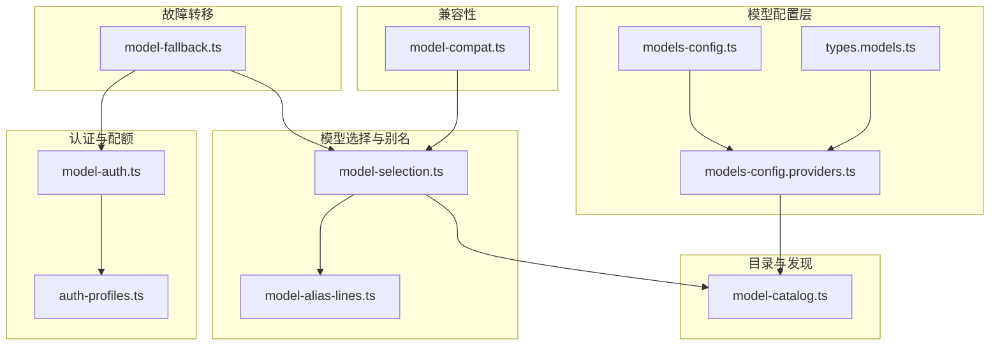
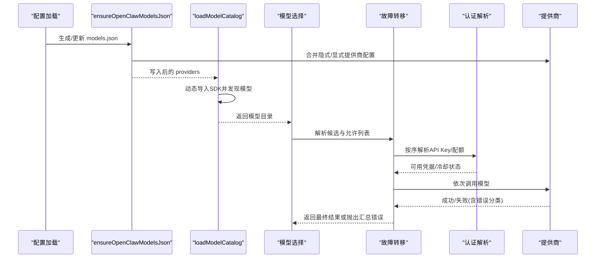
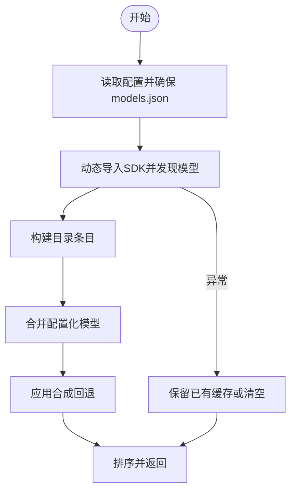
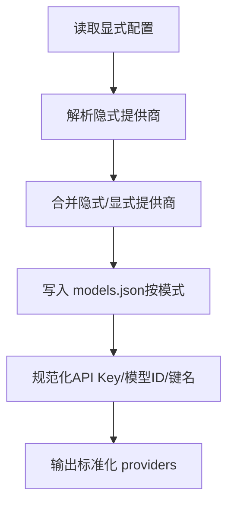
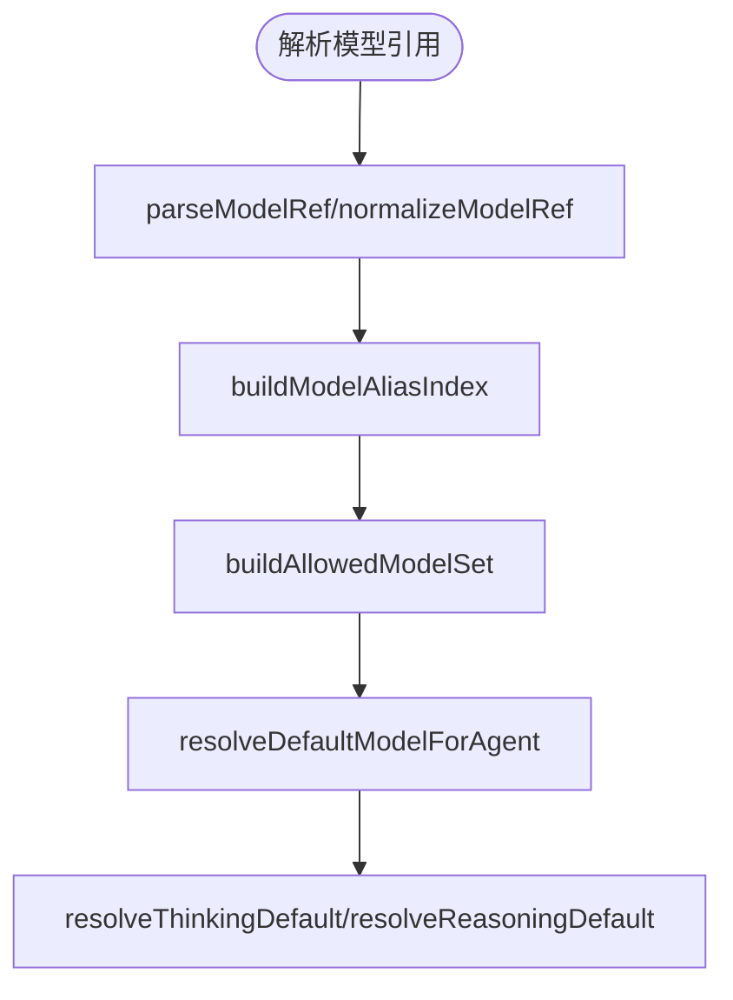
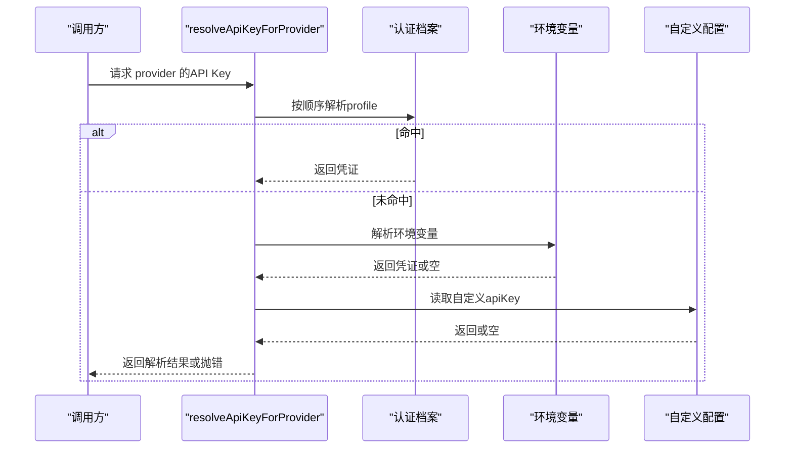
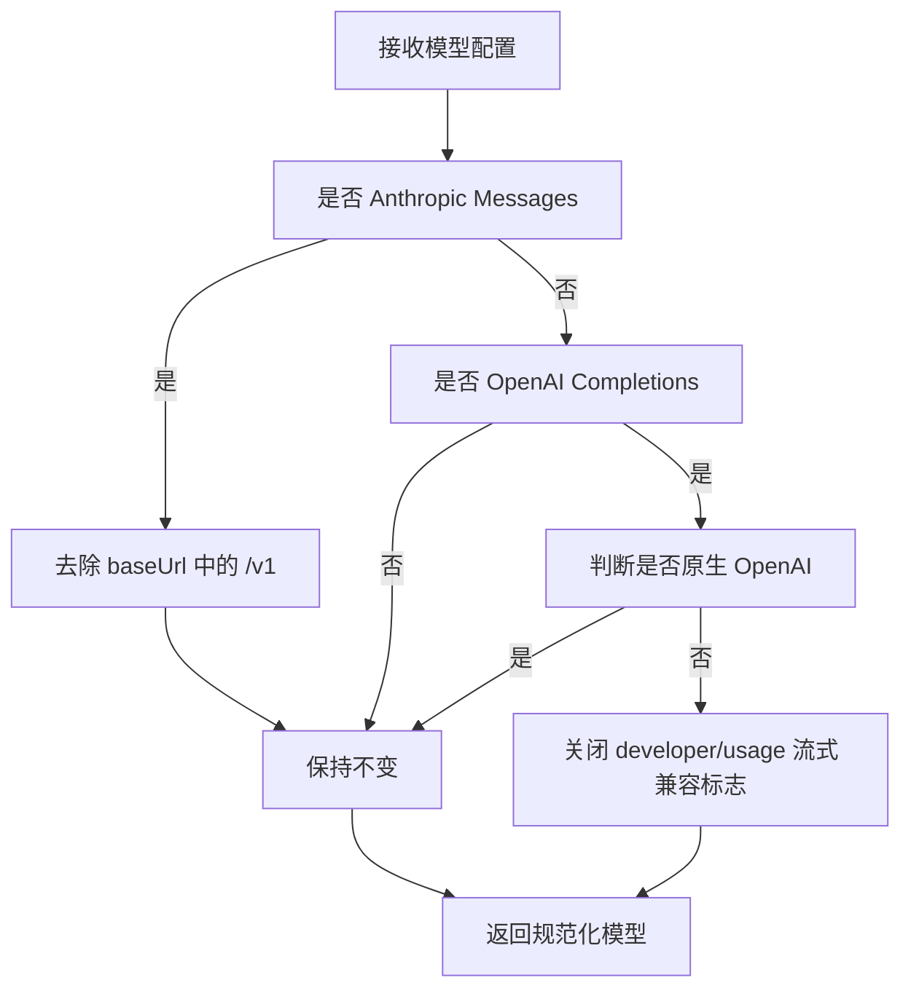
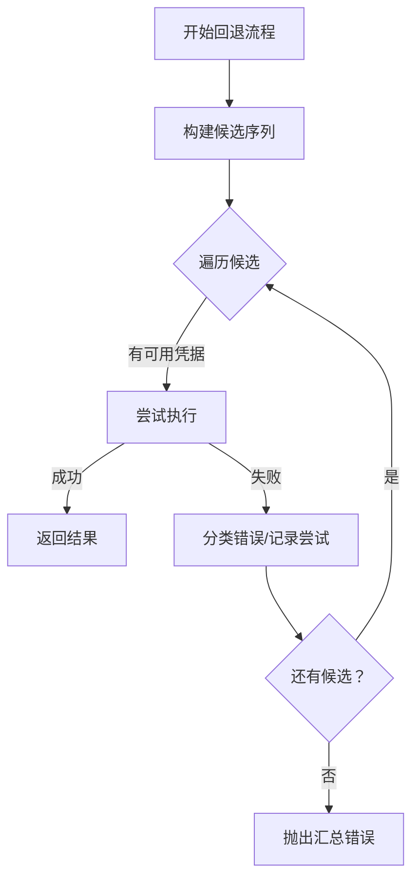
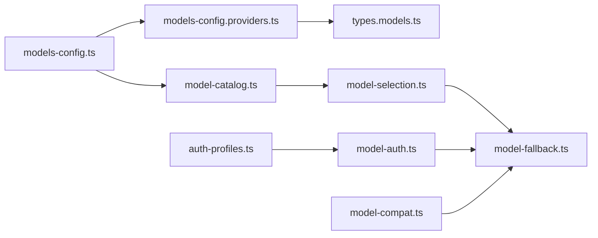

# 模型管理

<cite>
**本文引用的文件**
- [src/agents/model-catalog.ts](file://src/agents/model-catalog.ts)
- [src/agents/models-config.providers.ts](file://src/agents/models-config.providers.ts)
- [src/agents/models-config.ts](file://src/agents/models-config.ts)
- [src/agents/model-selection.ts](file://src/agents/model-selection.ts)
- [src/agents/model-fallback.ts](file://src/agents/model-fallback.ts)
- [src/agents/model-auth.ts](file://src/agents/model-auth.ts)
- [src/agents/model-compat.ts](file://src/agents/model-compat.ts)
- [src/agents/model-alias-lines.ts](file://src/agents/model-alias-lines.ts)
- [src/agents/auth-profiles.ts](file://src/agents/auth-profiles.ts)
- [src/config/types.models.ts](file://src/config/types.models.ts)
</cite>

## 目录
1. [简介](#简介)
2. [项目结构](#项目结构)
3. [核心组件](#核心组件)
4. [架构总览](#架构总览)
5. [详细组件分析](#详细组件分析)
6. [依赖关系分析](#依赖关系分析)
7. [性能考量](#性能考量)
8. [故障排查指南](#故障排查指南)
9. [结论](#结论)
10. [附录：配置与集成示例](#附录配置与集成示例)

## 简介
本文件面向OpenClaw模型管理系统，系统性梳理模型选择策略、提供商集成机制、认证与配额管理、负载均衡与故障转移、模型别名与版本管理、兼容性处理、本地与云端模型协调、缓存与性能优化、配置项与API密钥管理、使用统计与成本控制，并提供模型切换与故障转移实践建议。目标是帮助开发者快速理解并落地完整的模型管理体系。

## 项目结构
围绕“模型管理”的关键代码分布在以下模块：
- 模型目录与发现：model-catalog.ts
- 提供商配置与默认集：models-config.providers.ts、models-config.ts
- 模型选择与别名：model-selection.ts、model-alias-lines.ts
- 认证与配额：model-auth.ts、auth-profiles.ts
- 兼容性与URL归一：model-compat.ts
- 故障转移与重试：model-fallback.ts
- 配置类型定义：types.models.ts

图表来源
- [src/agents/models-config.ts](file://src/agents/models-config.ts#L1-L245)
- [src/agents/models-config.providers.ts](file://src/agents/models-config.providers.ts#L1-L800)
- [src/agents/model-catalog.ts](file://src/agents/model-catalog.ts#L1-L310)
- [src/agents/model-selection.ts](file://src/agents/model-selection.ts#L1-L639)
- [src/agents/model-alias-lines.ts](file://src/agents/model-alias-lines.ts#L1-L21)
- [src/agents/model-auth.ts](file://src/agents/model-auth.ts#L1-L449)
- [src/agents/auth-profiles.ts](file://src/agents/auth-profiles.ts#L1-L55)
- [src/agents/model-compat.ts](file://src/agents/model-compat.ts#L1-L80)
- [src/agents/model-fallback.ts](file://src/agents/model-fallback.ts#L1-L640)
- [src/config/types.models.ts](file://src/config/types.models.ts#L1-L76)

章节来源
- [src/agents/models-config.ts](file://src/agents/models-config.ts#L1-L245)
- [src/agents/models-config.providers.ts](file://src/agents/models-config.providers.ts#L1-L800)
- [src/agents/model-catalog.ts](file://src/agents/model-catalog.ts#L1-L310)
- [src/agents/model-selection.ts](file://src/agents/model-selection.ts#L1-L639)
- [src/agents/model-alias-lines.ts](file://src/agents/model-alias-lines.ts#L1-L21)
- [src/agents/model-auth.ts](file://src/agents/model-auth.ts#L1-L449)
- [src/agents/auth-profiles.ts](file://src/agents/auth-profiles.ts#L1-L55)
- [src/agents/model-compat.ts](file://src/agents/model-compat.ts#L1-L80)
- [src/agents/model-fallback.ts](file://src/agents/model-fallback.ts#L1-L640)
- [src/config/types.models.ts](file://src/config/types.models.ts#L1-L76)

## 核心组件
- 模型目录与发现：从本地/外部SDK动态发现模型，合并配置化模型，应用合成回退，支持缓存与错误降级。
- 提供商配置与默认集：构建/合并/规范化提供商配置，自动注入API Key与默认能力字段，支持多提供商模式。
- 模型选择与别名：解析模型引用、别名索引、允许列表、默认模型与推理级别推断。
- 认证与配额：按优先级解析API Key/OAuth/Token/AWS SDK，维护配额与冷却状态，失败归因与提示。
- 兼容性：对Anthropic、OpenAI兼容行为进行URL与特性归一，避免非原生后端的不兼容问题。
- 故障转移：基于允许列表与回退链的多候选执行，结合冷却探测与错误分类，实现智能切换与重试。

章节来源
- [src/agents/model-catalog.ts](file://src/agents/model-catalog.ts#L1-L310)
- [src/agents/models-config.providers.ts](file://src/agents/models-config.providers.ts#L1-L800)
- [src/agents/models-config.ts](file://src/agents/models-config.ts#L1-L245)
- [src/agents/model-selection.ts](file://src/agents/model-selection.ts#L1-L639)
- [src/agents/model-auth.ts](file://src/agents/model-auth.ts#L1-L449)
- [src/agents/model-compat.ts](file://src/agents/model-compat.ts#L1-L80)
- [src/agents/model-fallback.ts](file://src/agents/model-fallback.ts#L1-L640)
- [src/config/types.models.ts](file://src/config/types.models.ts#L1-L76)

## 架构总览
OpenClaw的模型管理以“配置驱动 + 动态发现 + 选择与回退”为核心路径：
- 配置阶段：ensureOpenClawModelsJson生成/更新models.json（含隐式提供商与显式配置合并），随后normalizeProviders完成键名、API Key、模型ID归一。
- 发现阶段：loadModelCatalog读取models.json并结合本地SDK发现器，构建模型目录；支持缓存与错误降级。
- 选择阶段：buildModelAliasIndex与resolveConfiguredModelRef解析别名与允许列表，normalizeModelRef统一模型ID格式。
- 执行阶段：runWithModelFallback按候选顺序尝试，结合冷却探测与错误分类，自动切换到下一个可用模型。
- 兼容阶段：normalizeModelCompat根据后端是否原生OpenAI或Anthropic修正URL与兼容标志。

图表来源
- [src/agents/models-config.ts](file://src/agents/models-config.ts#L203-L245)
- [src/agents/model-catalog.ts](file://src/agents/model-catalog.ts#L193-L278)
- [src/agents/model-selection.ts](file://src/agents/model-selection.ts#L234-L351)
- [src/agents/model-fallback.ts](file://src/agents/model-fallback.ts#L451-L586)
- [src/agents/model-auth.ts](file://src/agents/model-auth.ts#L164-L267)

## 详细组件分析

### 组件A：模型目录与发现（model-catalog）
职责
- 从models.json与SDK发现器构建模型目录，合并配置化模型与合成回退，支持缓存与错误降级。
- 提供模型查询、输入类型判断、目录查找等工具函数。

关键点
- 缓存策略：首次加载失败会清空缓存，已缓存成功结果在无输入参数时可复用。
- 合成回退：当目录中缺少某些模板ID时，按预设映射注入对应回退条目，保证兼容性。
- 错误降级：动态导入失败或SDK返回空目录时，尽量返回历史缓存结果或空数组。

图表来源
- [src/agents/model-catalog.ts](file://src/agents/model-catalog.ts#L193-L278)

章节来源
- [src/agents/model-catalog.ts](file://src/agents/model-catalog.ts#L1-L310)

### 组件B：提供商配置与默认集（models-config + models-config.providers）
职责
- 将隐式提供商（如本地Ollama/vLLM/HuggingFace/Bedrock等）与显式配置合并，规范化API Key与模型ID，写入models.json。
- 提供默认提供商构建器（如Minimax/Qwen/Moonshot/Xiaomi等）与发现器（如Ollama/vLLM/HuggingFace）。

关键点
- 合并策略：显式配置覆盖隐式能力元数据（如contextWindow/maxTokens），但保留用户自定义字段（cost/headers/compat）。
- 规范化：修复apiKey格式、去空白、合并重复键、Google/Google Antigravity模型ID归一。
- 模式：支持“merge/replace”，merge模式下保留现有文件中的敏感信息（apiKey/baseUrl）。

图表来源
- [src/agents/models-config.ts](file://src/agents/models-config.ts#L89-L139)
- [src/agents/models-config.providers.ts](file://src/agents/models-config.providers.ts#L483-L580)

章节来源
- [src/agents/models-config.ts](file://src/agents/models-config.ts#L1-L245)
- [src/agents/models-config.providers.ts](file://src/agents/models-config.providers.ts#L1-L800)

### 组件C：模型选择与别名（model-selection + model-alias-lines）
职责
- 解析模型引用字符串（支持“provider/model”与别名），构建别名索引，解析允许列表，决定默认模型与推理级别。
- 支持跨提供商模型ID归一（如Anthropic、OpenRouter、Google等）。

关键点
- 别名索引：按alias建立provider/model映射，支持多别名指向同一模型键。
- 允许列表：若未设置则允许所有目录模型；否则仅允许白名单内模型，必要时注入合成条目。
- 推理级别：基于模型目录与配置推断默认思考层级。

图表来源
- [src/agents/model-selection.ts](file://src/agents/model-selection.ts#L154-L351)
- [src/agents/model-alias-lines.ts](file://src/agents/model-alias-lines.ts#L1-L21)

章节来源
- [src/agents/model-selection.ts](file://src/agents/model-selection.ts#L1-L639)
- [src/agents/model-alias-lines.ts](file://src/agents/model-alias-lines.ts#L1-L21)

### 组件D：认证与配额（model-auth + auth-profiles）
职责
- 按优先级解析API Key/OAuth/Token/AWS SDK，支持按配置强制认证模式，失败时给出明确提示。
- 维护认证档案（profiles）与冷却状态（cooldown），记录使用统计与不可用原因。

关键点
- 解析顺序：profileId指定 > 配置auth覆盖 > 认证档案顺序 > 环境变量 > 自定义apiKey > 合成本地键。
- AWS SDK：自动检测Bearer Token/AccessKey/Profile，支持shell注入标记。
- 失败归因：区分auth/billing/rate_limit/overloaded等，用于故障转移决策。

图表来源
- [src/agents/model-auth.ts](file://src/agents/model-auth.ts#L164-L267)
- [src/agents/auth-profiles.ts](file://src/agents/auth-profiles.ts#L1-L55)

章节来源
- [src/agents/model-auth.ts](file://src/agents/model-auth.ts#L1-L449)
- [src/agents/auth-profiles.ts](file://src/agents/auth-profiles.ts#L1-L55)

### 组件E：兼容性处理（model-compat）
职责
- 对Anthropic与OpenAI兼容行为进行归一：去除重复的/v1后缀，对非原生OpenAI后端禁用developer角色与流式usage块。

图表来源
- [src/agents/model-compat.ts](file://src/agents/model-compat.ts#L39-L79)

章节来源
- [src/agents/model-compat.ts](file://src/agents/model-compat.ts#L1-L80)

### 组件F：故障转移与重试（model-fallback）
职责
- 基于允许列表与回退链构建候选序列，结合冷却探测与错误分类，逐个尝试直至成功或全部失败。
- 对AbortError与上下文溢出错误进行特殊处理，避免错误转移。

关键点
- 候选收集：主模型 + 配置回退链（同提供商标准化），显式回退不受允许列表限制。
- 冷却探测：主模型在冷却期可按阈值探测，同提供商回退在瞬时限流/过载时放宽。
- 错误分类：将未知错误转换为可诊断的FailoverError，记录状态码/错误码/原因，便于排障。

图表来源
- [src/agents/model-fallback.ts](file://src/agents/model-fallback.ts#L451-L586)

章节来源
- [src/agents/model-fallback.ts](file://src/agents/model-fallback.ts#L1-L640)

## 依赖关系分析
- 模块耦合
  - models-config.ts依赖models-config.providers.ts与types.models.ts，负责配置合并与写入。
  - model-catalog.ts依赖models-config.ts生成的models.json与SDK发现器。
  - model-selection.ts依赖model-catalog.ts与别名配置，为执行层提供模型引用。
  - model-fallback.ts依赖model-selection.ts与model-auth.ts，形成“选择-认证-回退”的闭环。
  - model-compat.ts与model-auth.ts分别处理URL与认证兼容，独立影响执行稳定性。
- 外部依赖
  - SDK动态导入（Pi SDK）用于模型发现与认证存储。
  - 环境变量与shell注入用于AWS SDK与OAuth令牌解析。

图表来源
- [src/agents/models-config.ts](file://src/agents/models-config.ts#L1-L245)
- [src/agents/models-config.providers.ts](file://src/agents/models-config.providers.ts#L1-L800)
- [src/agents/model-catalog.ts](file://src/agents/model-catalog.ts#L1-L310)
- [src/agents/model-selection.ts](file://src/agents/model-selection.ts#L1-L639)
- [src/agents/model-fallback.ts](file://src/agents/model-fallback.ts#L1-L640)
- [src/agents/model-auth.ts](file://src/agents/model-auth.ts#L1-L449)
- [src/agents/model-compat.ts](file://src/agents/model-compat.ts#L1-L80)
- [src/agents/auth-profiles.ts](file://src/agents/auth-profiles.ts#L1-L55)
- [src/config/types.models.ts](file://src/config/types.models.ts#L1-L76)

章节来源
- [src/agents/models-config.ts](file://src/agents/models-config.ts#L1-L245)
- [src/agents/models-config.providers.ts](file://src/agents/models-config.providers.ts#L1-L800)
- [src/agents/model-catalog.ts](file://src/agents/model-catalog.ts#L1-L310)
- [src/agents/model-selection.ts](file://src/agents/model-selection.ts#L1-L639)
- [src/agents/model-fallback.ts](file://src/agents/model-fallback.ts#L1-L640)
- [src/agents/model-auth.ts](file://src/agents/model-auth.ts#L1-L449)
- [src/agents/model-compat.ts](file://src/agents/model-compat.ts#L1-L80)
- [src/agents/auth-profiles.ts](file://src/agents/auth-profiles.ts#L1-L55)
- [src/config/types.models.ts](file://src/config/types.models.ts#L1-L76)

## 性能考量
- 目录缓存：loadModelCatalog对成功结果进行缓存，失败时清空缓存，避免持久化拒绝；可通过useCache=false绕过。
- 并发与批量：Ollama/vLLM发现采用分批并发查询，限制最大检查数量，降低超时风险。
- 本地发现：Ollama/vLLM/HuggingFace等本地服务发现仅在非测试环境启用，减少不必要的网络开销。
- 合并与写入：ensureOpenClawModelsJson仅在内容变化时写入，避免频繁IO。

章节来源
- [src/agents/model-catalog.ts](file://src/agents/model-catalog.ts#L193-L278)
- [src/agents/models-config.providers.ts](file://src/agents/models-config.providers.ts#L273-L332)
- [src/agents/models-config.ts](file://src/agents/models-config.ts#L203-L245)

## 故障排查指南
常见问题与定位
- 无可用API Key：检查认证档案、环境变量、配置文件与AWS SDK变量；参考model-auth.ts的解析顺序与错误提示。
- 模型不在允许列表：确认agents.defaults.models配置，或设置allowAny（通过目录全量）。
- 回退链全部失败：查看每次尝试的错误描述、状态码与原因，定位是认证、配额还是上游错误。
- 上游非原生OpenAI：兼容标志被强制关闭，需调整baseUrl或改用原生后端。
- 冷却与限流：查看auth-profiles的冷却状态与不可用原因，合理设置回退策略。

章节来源
- [src/agents/model-auth.ts](file://src/agents/model-auth.ts#L164-L267)
- [src/agents/model-fallback.ts](file://src/agents/model-fallback.ts#L451-L586)
- [src/agents/model-compat.ts](file://src/agents/model-compat.ts#L39-L79)
- [src/agents/auth-profiles.ts](file://src/agents/auth-profiles.ts#L44-L54)

## 结论
OpenClaw的模型管理以“配置即事实、发现即能力、选择即策略、回退即韧性”为核心设计，通过严格的认证与配额管理、兼容性归一与智能回退，实现了在多提供商、多形态（本地/云端）模型下的稳定运行与成本可控。建议在生产环境中：
- 明确允许列表与回退链，结合成本与性能指标选择默认模型。
- 使用认证档案与冷却机制管理配额，避免突发流量导致的限流与失败。
- 对非原生后端启用兼容模式，确保流式与角色语义一致。
- 定期刷新models.json，利用缓存与批量发现提升启动与发现效率。

## 附录：配置与集成示例
以下为不同提供商的集成要点与最佳实践（以实际文件中的常量与构建器为准）：
- Ollama：自动发现本地模型，支持按baseUrl区分OpenAI兼容端点与原生API；可配置contextWindow与maxTokens。
- vLLM：通过/models接口发现模型，支持Bearer Token鉴权。
- HuggingFace：通过环境变量或显式API Key发现模型，支持默认目录回退。
- Bedrock：支持AWS SDK凭据链，可配置区域与刷新间隔。
- Google/Google Antigravity：模型ID归一化，避免版本差异导致的请求失败。
- Minimax/Qwen/Moonshot/Xiaomi：内置默认提供商配置，包含API类型、默认模型、上下文窗口与成本估算。

章节来源
- [src/agents/models-config.providers.ts](file://src/agents/models-config.providers.ts#L203-L385)
- [src/agents/models-config.providers.ts](file://src/agents/models-config.providers.ts#L582-L797)
- [src/config/types.models.ts](file://src/config/types.models.ts#L33-L60)