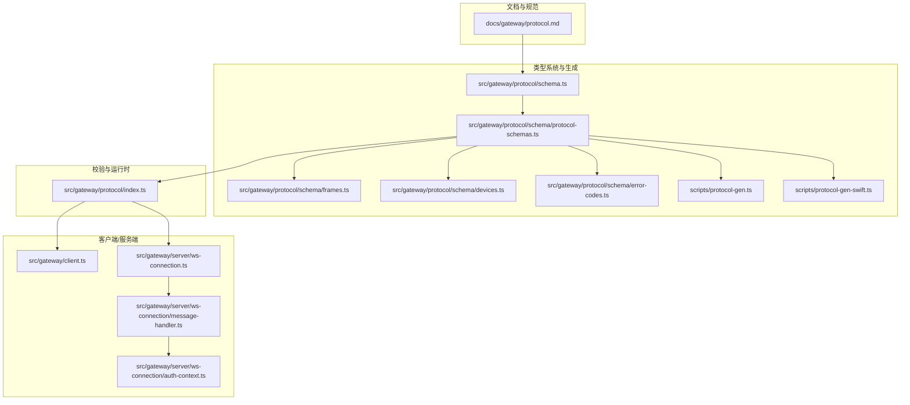
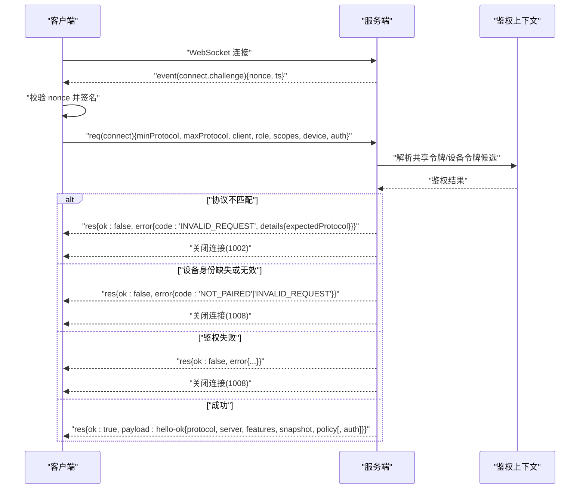
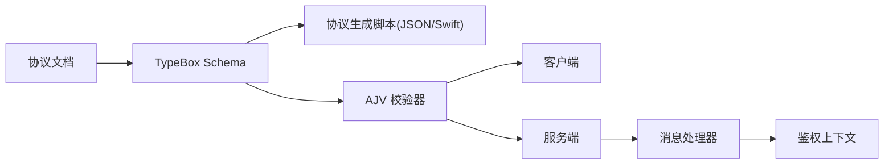

# WebSocket协议

<cite>
**本文引用的文件**
- [docs/gateway/protocol.md](file://docs/gateway/protocol.md)
- [src/gateway/protocol/schema.ts](file://src/gateway/protocol/schema.ts)
- [src/gateway/protocol/schema/protocol-schemas.ts](file://src/gateway/protocol/schema/protocol-schemas.ts)
- [src/gateway/protocol/schema/frames.ts](file://src/gateway/protocol/schema/frames.ts)
- [src/gateway/protocol/schema/devices.ts](file://src/gateway/protocol/schema/devices.ts)
- [src/gateway/protocol/schema/error-codes.ts](file://src/gateway/protocol/schema/error-codes.ts)
- [src/gateway/protocol/index.ts](file://src/gateway/protocol/index.ts)
- [src/gateway/client.ts](file://src/gateway/client.ts)
- [src/gateway/server/ws-connection.ts](file://src/gateway/server/ws-connection.ts)
- [src/gateway/server/ws-connection/message-handler.ts](file://src/gateway/server/ws-connection/message-handler.ts)
- [src/gateway/server/ws-connection/auth-context.ts](file://src/gateway/server/ws-connection/auth-context.ts)
- [apps/macos/Tests/OpenClawIPCTests/GatewayWebSocketTestSupport.swift](file://apps/macos/Tests/OpenClawIPCTests/GatewayWebSocketTestSupport.swift)
- [scripts/protocol-gen-swift.ts](file://scripts/protocol-gen-swift.ts)
- [scripts/protocol-gen.ts](file://scripts/protocol-gen.ts)
- [docs/concepts/typebox.md](file://docs/concepts/typebox.md)
</cite>

## 目录
1. [简介](#简介)
2. [项目结构](#项目结构)
3. [核心组件](#核心组件)
4. [架构总览](#架构总览)
5. [详细组件分析](#详细组件分析)
6. [依赖关系分析](#依赖关系分析)
7. [性能考量](#性能考量)
8. [故障排查指南](#故障排查指南)
9. [结论](#结论)
10. [附录](#附录)

## 简介
本文件为 OpenClaw WebSocket 协议的权威技术文档，覆盖连接建立流程、握手协议、身份验证与设备配对、消息帧格式、请求/响应/事件类型、JSON Schema 与 TypeBox 类型系统、Swift 模型生成机制、版本兼容性、错误处理与重连策略，并提供客户端实现指南与最佳实践。

## 项目结构
OpenClaw 的 WebSocket 协议由“文档规范 + 类型系统 + 校验器 + 客户端/服务端实现”四部分组成：
- 文档层：协议语义、握手示例、角色与作用域、版本与迁移说明
- 类型系统层：基于 TypeBox 的 Schema 定义，统一生成 JSON Schema 与 Swift 模型
- 校验器层：使用 AJV 对帧与参数进行运行时校验
- 实现层：客户端与服务端的握手、鉴权、事件分发与心跳

图表来源
- [docs/gateway/protocol.md](file://docs/gateway/protocol.md#L10-L257)
- [src/gateway/protocol/schema.ts](file://src/gateway/protocol/schema.ts#L1-L19)
- [src/gateway/protocol/schema/protocol-schemas.ts](file://src/gateway/protocol/schema/protocol-schemas.ts#L157-L292)
- [src/gateway/protocol/schema/frames.ts](file://src/gateway/protocol/schema/frames.ts#L20-L164)
- [src/gateway/protocol/schema/devices.ts](file://src/gateway/protocol/schema/devices.ts#L1-L68)
- [src/gateway/protocol/schema/error-codes.ts](file://src/gateway/protocol/schema/error-codes.ts#L1-L24)
- [src/gateway/protocol/index.ts](file://src/gateway/protocol/index.ts#L243-L438)
- [src/gateway/client.ts](file://src/gateway/client.ts#L1-L42)
- [src/gateway/server/ws-connection.ts](file://src/gateway/server/ws-connection.ts#L141-L179)
- [src/gateway/server/ws-connection/message-handler.ts](file://src/gateway/server/ws-connection/message-handler.ts#L436-L478)
- [src/gateway/server/ws-connection/auth-context.ts](file://src/gateway/server/ws-connection/auth-context.ts#L49-L73)
- [scripts/protocol-gen.ts](file://scripts/protocol-gen.ts)
- [scripts/protocol-gen-swift.ts](file://scripts/protocol-gen-swift.ts)

章节来源
- [docs/gateway/protocol.md](file://docs/gateway/protocol.md#L10-L257)
- [src/gateway/protocol/schema.ts](file://src/gateway/protocol/schema.ts#L1-L19)

## 核心组件
- 帧与消息模型
  - 请求帧：req
  - 响应帧：res
  - 事件帧：event
  - 错误形状：包含 code、message、details、retryable、retryAfterMs
- 握手与连接参数
  - connect.challenge 预握手挑战
  - connect.params 包含 min/maxProtocol、client、role、scopes、caps/commands/permissions、auth、device、locale、userAgent 等
  - hello-ok 返回协议版本、服务器信息、特性清单、快照、策略与可选的设备令牌
- 设备与配对
  - 设备公钥指纹派生、签名与时间戳校验
  - 设备配对请求/决议事件
  - 设备令牌轮换与吊销
- 版本与兼容
  - PROTOCOL_VERSION 固定为 3
  - 客户端需在首次帧声明支持的协议范围并满足服务端版本

章节来源
- [src/gateway/protocol/schema/frames.ts](file://src/gateway/protocol/schema/frames.ts#L20-L164)
- [src/gateway/protocol/schema/protocol-schemas.ts](file://src/gateway/protocol/schema/protocol-schemas.ts#L157-L292)
- [src/gateway/protocol/schema/devices.ts](file://src/gateway/protocol/schema/devices.ts#L1-L68)
- [src/gateway/protocol/schema/error-codes.ts](file://src/gateway/protocol/schema/error-codes.ts#L1-L24)
- [docs/gateway/protocol.md](file://docs/gateway/protocol.md#L187-L195)

## 架构总览
下图展示从客户端到服务端的握手与认证路径，以及关键错误分支与策略参数。

图表来源
- [src/gateway/server/ws-connection.ts](file://src/gateway/server/ws-connection.ts#L141-L179)
- [src/gateway/server/ws-connection/message-handler.ts](file://src/gateway/server/ws-connection/message-handler.ts#L436-L478)
- [src/gateway/server/ws-connection/message-handler.ts](file://src/gateway/server/ws-connection/message-handler.ts#L547-L687)
- [src/gateway/server/ws-connection/auth-context.ts](file://src/gateway/server/ws-connection/auth-context.ts#L49-L73)
- [src/gateway/protocol/schema/frames.ts](file://src/gateway/protocol/schema/frames.ts#L20-L112)

## 详细组件分析

### 帧与消息模型
- 请求帧 req
  - 字段：type、id、method、params
  - 用途：调用任意方法（如 agent、chat、system-presence 等）
- 响应帧 res
  - 字段：type、id、ok、payload 或 error
  - 用途：返回方法执行结果或错误
- 事件帧 event
  - 字段：type、event、payload、seq、stateVersion
  - 用途：推送状态更新、心跳、系统事件等
- 错误形状 ErrorShape
  - 字段：code、message、details、retryable、retryAfterMs
  - 用途：标准化错误返回

章节来源
- [src/gateway/protocol/schema/frames.ts](file://src/gateway/protocol/schema/frames.ts#L125-L164)
- [src/gateway/protocol/schema/error-codes.ts](file://src/gateway/protocol/schema/error-codes.ts#L1-L24)

### 握手与连接参数
- 预握手挑战
  - 服务端发送 event(connect.challenge){nonce, ts}
  - 客户端必须等待该挑战后再发起 connect
- connect 参数
  - minProtocol/maxProtocol：协议范围协商
  - client：id、displayName、version、platform、deviceFamily、modelIdentifier、mode、instanceId
  - role/scopes：角色与权限
  - caps/commands/permissions：节点能力声明与授权
  - auth：token/deviceToken/password
  - device：id、publicKey、signature、signedAt、nonce
  - locale/userAgent/pathEnv
- hello-ok
  - protocol：实际使用的协议版本
  - server：version、connId
  - features：methods、events
  - snapshot：初始状态快照
  - policy：maxPayload、maxBufferedBytes、tickIntervalMs
  - auth：deviceToken、role、scopes（首次颁发）

章节来源
- [docs/gateway/protocol.md](file://docs/gateway/protocol.md#L22-L125)
- [src/gateway/protocol/schema/frames.ts](file://src/gateway/protocol/schema/frames.ts#L20-L112)

### 身份验证与设备配对
- 共享令牌与设备令牌
  - 支持从 connect.auth 中提取 token/password 或显式 deviceToken
  - 若无显式设备令牌，可回退到共享令牌
- 设备身份与签名
  - 必须包含 device.id、publicKey、signature、signedAt、nonce
  - 服务端会校验 device.id 与公钥指纹一致性、签名时效与内容
- 设备配对
  - 设备配对请求/决议事件
  - 支持批准/拒绝/移除设备
  - 支持轮换/吊销设备令牌

章节来源
- [src/gateway/server/ws-connection/auth-context.ts](file://src/gateway/server/ws-connection/auth-context.ts#L49-L73)
- [src/gateway/server/ws-connection/message-handler.ts](file://src/gateway/server/ws-connection/message-handler.ts#L651-L687)
- [src/gateway/protocol/schema/devices.ts](file://src/gateway/protocol/schema/devices.ts#L1-L68)

### 方法与事件总览
- 请求方法（示例）
  - agent.*：代理相关操作
  - chat.*：聊天历史、发送、注入、中止
  - system-presence：系统在线状态
  - nodes.*：节点管理
  - devices.*：设备配对与令牌
  - configs.*、sessions.*、skills.*、cron.*、tools.*、wizard.*、channels.*、secrets.*、logs.* 等
- 事件
  - connect.challenge：握手挑战
  - exec.approval.requested：执行审批请求
  - tick：心跳
  - shutdown：服务端关闭通知
  - 设备配对事件：requested/resolved
  - 聊天事件：chat.*

章节来源
- [docs/gateway/protocol.md](file://docs/gateway/protocol.md#L127-L186)
- [src/gateway/protocol/schema/protocol-schemas.ts](file://src/gateway/protocol/schema/protocol-schemas.ts#L157-L289)

### JSON Schema 与 TypeBox 类型系统
- TypeBox 定义集中于 schema 目录，导出为 ProtocolSchemas 并暴露 PROTOCOL_VERSION
- AJV 编译器生成 validateXxx 函数用于运行时校验
- 通过脚本生成 JSON Schema 与 Swift 模型，确保跨语言一致性

章节来源
- [src/gateway/protocol/schema.ts](file://src/gateway/protocol/schema.ts#L1-L19)
- [src/gateway/protocol/schema/protocol-schemas.ts](file://src/gateway/protocol/schema/protocol-schemas.ts#L157-L292)
- [src/gateway/protocol/index.ts](file://src/gateway/protocol/index.ts#L243-L438)
- [docs/concepts/typebox.md](file://docs/concepts/typebox.md)
- [scripts/protocol-gen.ts](file://scripts/protocol-gen.ts)
- [scripts/protocol-gen-swift.ts](file://scripts/protocol-gen-swift.ts)

### Swift 模型生成机制
- 使用协议生成脚本将 TypeBox Schema 转换为 Swift 模型
- 便于在 iOS/macOS 客户端中强类型消费协议帧与参数

章节来源
- [scripts/protocol-gen-swift.ts](file://scripts/protocol-gen-swift.ts)

### 请求-响应示例（核心方法）
以下示例展示典型交互路径，具体字段请参考协议文档与 Schema：

- 连接握手
  - 客户端接收 challenge 后，构造 connect 请求并发送
  - 服务端返回 hello-ok，包含协议版本、特性清单、策略与可选设备令牌
- agent.wait
  - 客户端发送 req(agent.wait){runId, timeoutMs}
  - 服务端返回 res，携带 ok 与结果或错误
- chat.send
  - 客户端发送 req(chat.send){sessionId, content}
  - 服务端返回 res，携带 ok 与结果或错误
- system-presence
  - 客户端发送 req(system-presence){}
  - 服务端返回 res(payload:{entries:[...]})
- 设备配对
  - 客户端发送 req(device.pair.approve/reject/remove){...}
  - 服务端广播配对事件并返回 res

章节来源
- [docs/gateway/protocol.md](file://docs/gateway/protocol.md#L22-L125)
- [src/gateway/server-methods/agent.ts](file://src/gateway/server-methods/agent.ts#L750-L768)

### 协议版本兼容性与迁移
- PROTOCOL_VERSION = 3
- 客户端需声明 minProtocol/maxProtocol，服务端拒绝不相交范围
- 设备签名迁移：要求先等待 connect.challenge 再签名；支持 v2/v3 签名，优先 v3
- 迁移诊断：错误 details.code 提供稳定原因码，帮助定位问题

章节来源
- [src/gateway/protocol/schema/protocol-schemas.ts](file://src/gateway/protocol/schema/protocol-schemas.ts#L291-L292)
- [docs/gateway/protocol.md](file://docs/gateway/protocol.md#L187-L244)

### 错误处理机制
- 标准错误形状：code、message、details、retryable、retryAfterMs
- 常见错误码：NOT_LINKED、NOT_PAIRED、AGENT_TIMEOUT、INVALID_REQUEST、UNAVAILABLE
- 服务端在握手阶段根据鉴权与协议不匹配等情况返回 res{ok:false, error}

章节来源
- [src/gateway/protocol/schema/error-codes.ts](file://src/gateway/protocol/schema/error-codes.ts#L1-L24)
- [src/gateway/server/ws-connection/message-handler.ts](file://src/gateway/server/ws-connection/message-handler.ts#L449-L460)

### 重连策略
- 服务端策略：hello-ok.policy.tickIntervalMs 指示心跳间隔
- 客户端应：
  - 记录 lastTick，检测超时后主动重连
  - 在 gap 检测到丢序时记录期望 seq
  - 首次连接必须等待 connect.challenge 再发送 connect
  - 首次握手成功后持久化设备令牌（若颁发）

章节来源
- [src/gateway/protocol/schema/frames.ts](file://src/gateway/protocol/schema/frames.ts#L102-L110)
- [src/gateway/client.ts](file://src/gateway/client.ts#L357-L392)
- [src/gateway/server/ws-connection.ts](file://src/gateway/server/ws-connection.ts#L174-L179)

## 依赖关系分析
- 协议规范文档驱动类型系统与校验器
- TypeBox Schema 作为单源，生成 JSON Schema 与 Swift 模型
- 客户端与服务端均依赖 validateXxx 校验器保证消息正确性
- 服务端消息处理器依赖鉴权上下文解析设备与共享令牌

图表来源
- [docs/gateway/protocol.md](file://docs/gateway/protocol.md#L10-L257)
- [src/gateway/protocol/schema.ts](file://src/gateway/protocol/schema.ts#L1-L19)
- [src/gateway/protocol/index.ts](file://src/gateway/protocol/index.ts#L243-L438)
- [src/gateway/client.ts](file://src/gateway/client.ts#L1-L42)
- [src/gateway/server/ws-connection/message-handler.ts](file://src/gateway/server/ws-connection/message-handler.ts#L547-L687)
- [src/gateway/server/ws-connection/auth-context.ts](file://src/gateway/server/ws-connection/auth-context.ts#L49-L73)

## 性能考量
- 服务端策略参数
  - maxPayload：限制单帧大小
  - maxBufferedBytes：限制缓冲字节
  - tickIntervalMs：心跳周期，影响重连与保活成本
- 客户端应：
  - 控制请求频率，避免超过 maxPayload
  - 合理设置重连退避，避免抖动
  - 利用 stateVersion 与 seq 做增量同步

章节来源
- [src/gateway/protocol/schema/frames.ts](file://src/gateway/protocol/schema/frames.ts#L102-L110)

## 故障排查指南
- 协议不匹配
  - 现象：服务端拒绝连接并关闭
  - 处理：调整 minProtocol/maxProtocol 使其与 PROTOCOL_VERSION 相交
- 非 connect 首帧
  - 现象：服务端返回 INVALID_REQUEST 并关闭
  - 处理：确保首帧为 connect
- 设备身份缺失或签名无效
  - 现象：返回 NOT_PAIRED 或 INVALID_REQUEST
  - 处理：补齐 device 信息，按迁移要求先等待 challenge 再签名
- 设备签名过期或不匹配
  - 现象：错误 details.code 显示签名相关原因
  - 处理：检查 signedAt 时间戳与 nonce，重新签名并发送
- 重连失败
  - 现象：心跳超时或 gap
  - 处理：记录 lastTick 与期望 seq，按 tickIntervalMs 重试

章节来源
- [src/gateway/server/ws-connection.ts](file://src/gateway/server/ws-connection.ts#L141-L179)
- [src/gateway/server/ws-connection/message-handler.ts](file://src/gateway/server/ws-connection/message-handler.ts#L462-L478)
- [src/gateway/server/ws-connection/message-handler.ts](file://src/gateway/server/ws-connection/message-handler.ts#L651-L687)
- [src/gateway/client.ts](file://src/gateway/client.ts#L357-L392)
- [docs/gateway/protocol.md](file://docs/gateway/protocol.md#L225-L244)

## 结论
OpenClaw WebSocket 协议以清晰的帧模型、严格的类型系统与校验器、完善的设备身份与配对机制为基础，提供了高可靠、可演进的控制面与节点传输通道。遵循本文档的握手流程、身份验证步骤与重连策略，可确保客户端在多平台环境下的稳定接入。

## 附录

### 客户端实现要点
- 首帧必须是 connect；必须等待 connect.challenge 再发送 connect
- 正确填充 client、role、scopes、caps/commands/permissions、auth、device
- 使用 validateXxx 校验请求参数
- 解析 hello-ok，持久化设备令牌（若颁发），应用策略参数
- 维护 lastTick、seq、gap，按 tickIntervalMs 保持心跳
- 遇到 INVALID_REQUEST/NOT_PAIRED 等错误，依据 details.code 与协议文档定位修复

章节来源
- [src/gateway/client.ts](file://src/gateway/client.ts#L1-L42)
- [src/gateway/client.ts](file://src/gateway/client.ts#L357-L392)
- [src/gateway/protocol/index.ts](file://src/gateway/protocol/index.ts#L243-L438)
- [docs/gateway/protocol.md](file://docs/gateway/protocol.md#L187-L244)

### 示例数据构造（参考）
- iOS/macOS 测试辅助构造了 res(hello-ok) 与解析 req 的工具，可用于理解帧结构与字段映射

章节来源
- [apps/macos/Tests/OpenClawIPCTests/GatewayWebSocketTestSupport.swift](file://apps/macos/Tests/OpenClawIPCTests/GatewayWebSocketTestSupport.swift#L31-L71)