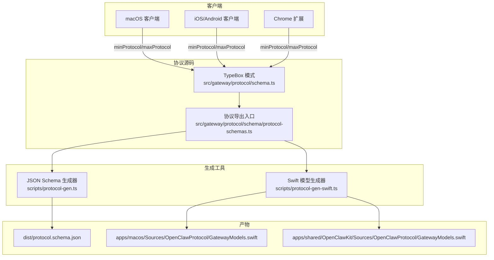
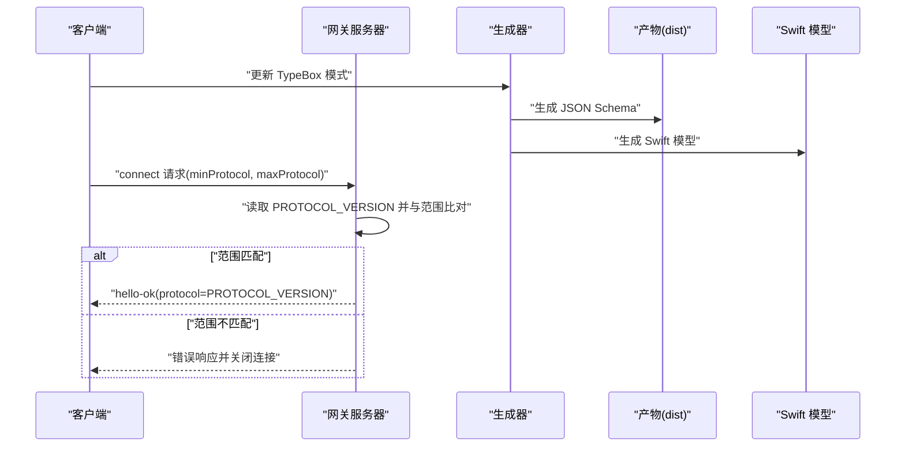
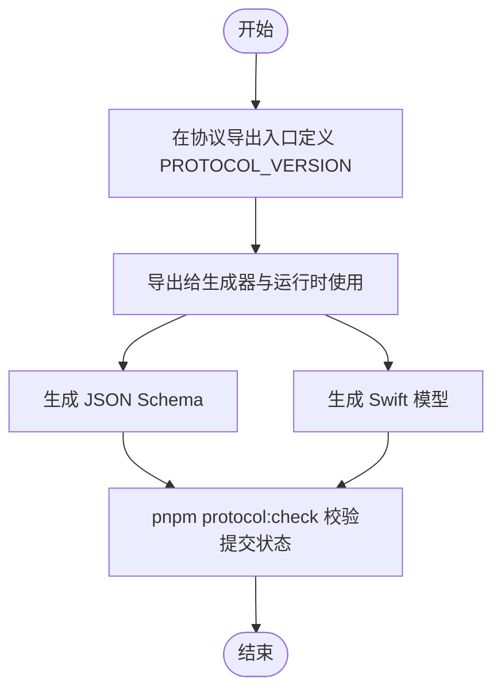
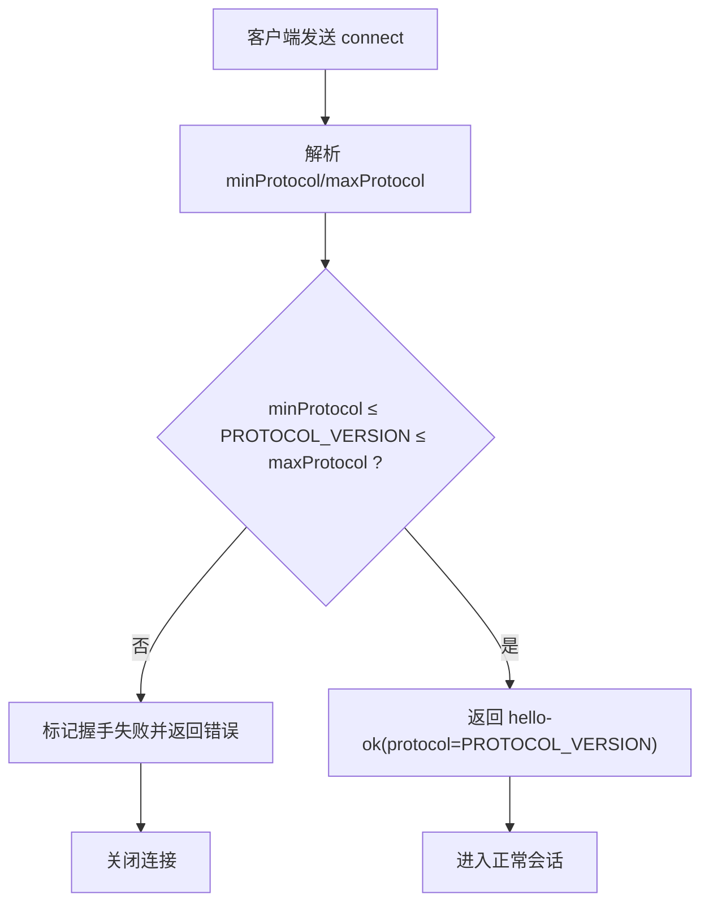
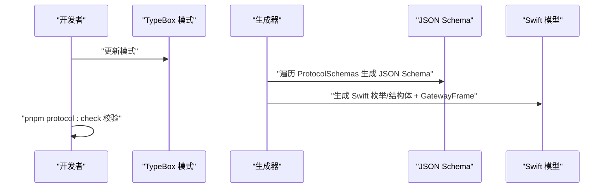
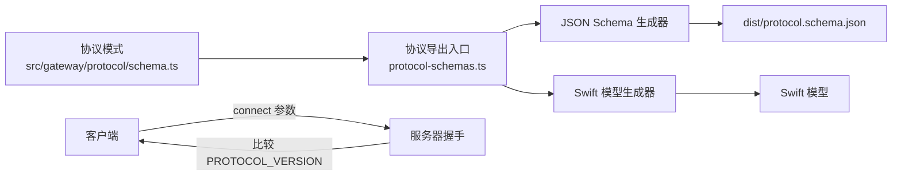

# 协议版本管理

<cite>
**本文引用的文件**
- [src/gateway/protocol/schema/protocol-schemas.ts](file://src/gateway/protocol/schema/protocol-schemas.ts)
- [src/gateway/server/ws-connection/message-handler.ts](file://src/gateway/server/ws-connection/message-handler.ts)
- [src/gateway/server.auth.default-token.suite.ts](file://src/gateway/server.auth.default-token.suite.ts)
- [scripts/protocol-gen.ts](file://scripts/protocol-gen.ts)
- [scripts/protocol-gen-swift.ts](file://scripts/protocol-gen-swift.ts)
- [package.json](file://package.json)
- [docs/concepts/typebox.md](file://docs/concepts/typebox.md)
- [docs/gateway/protocol.md](file://docs/gateway/protocol.md)
- [src/gateway/protocol/schema/types.ts](file://src/gateway/protocol/schema/types.ts)
- [src/gateway/protocol/schema.ts](file://src/gateway/protocol/schema.ts)
- [apps/macos/Sources/OpenClawProtocol/GatewayModels.swift](file://apps/macos/Sources/OpenClawProtocol/GatewayModels.swift)
- [apps/shared/OpenClawKit/Sources/OpenClawProtocol/GatewayModels.swift](file://apps/shared/OpenClawKit/Sources/OpenClawProtocol/GatewayModels.swift)
- [apps/android/app/src/main/java/ai/openclaw/android/gateway/GatewaySession.kt](file://apps/android/app/src/main/java/ai/openclaw/android/gateway/GatewaySession.kt)
- [assets/chrome-extension/background.js](file://assets/chrome-extension/background.js)
</cite>

## 目录
1. [简介](#简介)
2. [项目结构](#项目结构)
3. [核心组件](#核心组件)
4. [架构总览](#架构总览)
5. [详细组件分析](#详细组件分析)
6. [依赖关系分析](#依赖关系分析)
7. [性能考量](#性能考量)
8. [故障排除指南](#故障排除指南)
9. [结论](#结论)
10. [附录](#附录)

## 简介
本文件系统化阐述 OpenClaw WebSocket 协议版本管理系统，重点覆盖：
- 协议版本号 PROTOCOL_VERSION 的定义与管理
- 客户端 minProtocol/maxProtocol 范围协商流程
- 协议升级与降级的兼容性策略
- 基于 TypeBox 定义生成协议 Schema 与 Swift 模型的自动化流程
- 协议检查工具 pnpm protocol:check 的使用与验证规则
- 向后兼容性保障与破坏性变更处理方式
- 版本迁移最佳实践与故障排除指南

## 项目结构
OpenClaw 将“TypeBox 模式”作为协议的单一真实来源，驱动运行时校验、JSON Schema 导出以及 Swift 模型生成。版本协商在握手阶段完成，服务器基于 PROTOCOL_VERSION 与客户端声明的 minProtocol/maxProtocol 进行匹配。

**图表来源**
- [src/gateway/protocol/schema.ts](file://src/gateway/protocol/schema.ts#L1-L19)
- [src/gateway/protocol/schema/protocol-schemas.ts](file://src/gateway/protocol/schema/protocol-schemas.ts#L291-L292)
- [scripts/protocol-gen.ts](file://scripts/protocol-gen.ts#L1-L52)
- [scripts/protocol-gen-swift.ts](file://scripts/protocol-gen-swift.ts#L1-L248)
- [apps/macos/Sources/OpenClawProtocol/GatewayModels.swift](file://apps/macos/Sources/OpenClawProtocol/GatewayModels.swift#L1-L40)
- [apps/shared/OpenClawKit/Sources/OpenClawProtocol/GatewayModels.swift](file://apps/shared/OpenClawKit/Sources/OpenClawProtocol/GatewayModels.swift#L1-L40)

**章节来源**
- [src/gateway/protocol/schema.ts](file://src/gateway/protocol/schema.ts#L1-L19)
- [src/gateway/protocol/schema/protocol-schemas.ts](file://src/gateway/protocol/schema/protocol-schemas.ts#L291-L292)
- [scripts/protocol-gen.ts](file://scripts/protocol-gen.ts#L1-L52)
- [scripts/protocol-gen-swift.ts](file://scripts/protocol-gen-swift.ts#L1-L248)

## 核心组件
- 单一真实来源：TypeBox 模式集中定义在协议目录中，并通过导出入口统一暴露给生成器与运行时。
- PROTOCOL_VERSION：在协议导出入口中以常量形式定义，作为服务器与客户端协商的基准版本。
- 生成器链路：TypeBox 模式 → JSON Schema → Swift 模型；生成结果由协议检查工具进行一致性校验。
- 握手协商：客户端在首次连接时发送 minProtocol/maxProtocol，服务器根据 PROTOCOL_VERSION 判断是否接受连接。

**章节来源**
- [src/gateway/protocol/schema/protocol-schemas.ts](file://src/gateway/protocol/schema/protocol-schemas.ts#L291-L292)
- [scripts/protocol-gen.ts](file://scripts/protocol-gen.ts#L9-L42)
- [scripts/protocol-gen-swift.ts](file://scripts/protocol-gen-swift.ts#L30-L34)
- [src/gateway/server/ws-connection/message-handler.ts](file://src/gateway/server/ws-connection/message-handler.ts#L462-L478)

## 架构总览
下图展示从模式到产物再到客户端交互的完整链路，以及握手阶段的版本协商流程。

**图表来源**
- [src/gateway/protocol/schema/protocol-schemas.ts](file://src/gateway/protocol/schema/protocol-schemas.ts#L291-L292)
- [scripts/protocol-gen.ts](file://scripts/protocol-gen.ts#L9-L42)
- [scripts/protocol-gen-swift.ts](file://scripts/protocol-gen-swift.ts#L30-L34)
- [src/gateway/server/ws-connection/message-handler.ts](file://src/gateway/server/ws-connection/message-handler.ts#L462-L478)

## 详细组件分析

### 组件A：协议版本号 PROTOCOL_VERSION 的定义与管理
- 定义位置：协议导出入口文件中以常量形式导出。
- 管理机制：
  - 作为服务器握手阶段的权威版本值。
  - 生成器链路读取该常量，确保 JSON Schema 与 Swift 模型中的版本一致。
  - 客户端在握手时声明 minProtocol/maxProtocol，服务器据此拒绝不兼容范围。

**图表来源**
- [src/gateway/protocol/schema/protocol-schemas.ts](file://src/gateway/protocol/schema/protocol-schemas.ts#L291-L292)
- [scripts/protocol-gen.ts](file://scripts/protocol-gen.ts#L9-L42)
- [scripts/protocol-gen-swift.ts](file://scripts/protocol-gen-swift.ts#L30-L34)
- [package.json](file://package.json#L291-L291)

**章节来源**
- [src/gateway/protocol/schema/protocol-schemas.ts](file://src/gateway/protocol/schema/protocol-schemas.ts#L291-L292)
- [src/gateway/protocol/schema.ts](file://src/gateway/protocol/schema.ts#L1-L19)

### 组件B：客户端 minProtocol 与 maxProtocol 范围协商
- 协商时机：首次连接时，客户端在 connect 请求中携带 minProtocol 与 maxProtocol。
- 服务器判定逻辑：
  - 若 maxProtocol 小于 PROTOCOL_VERSION 或 minProtocol 大于 PROTOCOL_VERSION，则拒绝连接并返回错误。
  - 匹配成功则返回 hello-ok，并在 payload 中声明实际使用的 protocol=PROTOCOL_VERSION。
- 测试用例覆盖了协议不匹配场景，确保行为稳定。

**图表来源**
- [src/gateway/server/ws-connection/message-handler.ts](file://src/gateway/server/ws-connection/message-handler.ts#L462-L478)
- [src/gateway/server.auth.default-token.suite.ts](file://src/gateway/server.auth.default-token.suite.ts#L301-L313)

**章节来源**
- [src/gateway/server/ws-connection/message-handler.ts](file://src/gateway/server/ws-connection/message-handler.ts#L462-L478)
- [src/gateway/server.auth.default-token.suite.ts](file://src/gateway/server.auth.default-token.suite.ts#L301-L313)

### 组件C：协议升级与降级的兼容性策略
- 升级策略：
  - 新增字段或方法时，保持默认值与可选性设计，避免破坏既有客户端。
  - 通过 JSON Schema 的 discriminator 与对象严格属性控制，确保新增字段不影响旧版解析。
- 降级策略：
  - 服务器仅接受与 PROTOCOL_VERSION 匹配的范围，拒绝过新客户端。
  - Swift 生成器保留未知帧类型，以向前兼容未知扩展。
- 文档与约定：
  - 采用“最小可用连接”流程，先握手再调用健康检查等方法。
  - 严格限制额外属性，减少未来演进的破坏面。

**章节来源**
- [docs/concepts/typebox.md](file://docs/concepts/typebox.md#L264-L268)
- [docs/gateway/protocol.md](file://docs/gateway/protocol.md#L187-L195)
- [scripts/protocol-gen-swift.ts](file://scripts/protocol-gen-swift.ts#L203-L211)

### 组件D：从 TypeBox 定义生成协议 Schema 与 Swift 模型的自动化流程
- JSON Schema 生成：
  - 遍历 ProtocolSchemas，构建根模式并写入 dist/protocol.schema.json。
  - 使用 discriminator 映射 type 字段到不同帧类型。
- Swift 模型生成：
  - 读取 PROTOCOL_VERSION 与 ErrorCodes，生成 Swift 枚举与结构体。
  - 生成 GatewayFrame 枚举，支持 req/res/event 与 unknown 分支，保留未知帧以增强兼容性。
  - 输出到 macOS 与共享库两处目标路径。

**图表来源**
- [scripts/protocol-gen.ts](file://scripts/protocol-gen.ts#L9-L42)
- [scripts/protocol-gen-swift.ts](file://scripts/protocol-gen-swift.ts#L213-L242)

**章节来源**
- [scripts/protocol-gen.ts](file://scripts/protocol-gen.ts#L1-L52)
- [scripts/protocol-gen-swift.ts](file://scripts/protocol-gen-swift.ts#L1-L248)

### 组件E：协议检查工具 pnpm protocol:check 的使用与验证规则
- 命令组成：
  - 先执行 JSON Schema 生成与 Swift 模型生成。
  - 再使用 git diff --exit-code 对比 dist/protocol.schema.json 与 Swift 模型文件，确保已提交最新产物。
- 使用步骤：
  - 更新 TypeBox 模式后，运行 pnpm protocol:check。
  - 提交生成的 JSON Schema 与 Swift 模型。
- 文档指引：
  - 变更模式后，按“更新模式 → 运行检查 → 提交产物”的流程操作。

**章节来源**
- [package.json](file://package.json#L291-L291)
- [docs/concepts/typebox.md](file://docs/concepts/typebox.md#L287-L292)

### 组件F：向后兼容性保证与破坏性变更处理
- 向后兼容性：
  - Swift 模型对未知帧类型保留为原始字典，避免旧客户端因未知字段崩溃。
  - JSON Schema 采用严格对象与 discriminator，降低未来破坏性变更风险。
- 破坏性变更处理：
  - 通过提升 PROTOCOL_VERSION 触发客户端范围不匹配，从而强制升级。
  - 服务器在握手阶段即拒绝不兼容客户端，防止运行期异常。
- 客户端示例：
  - macOS、iOS/Android、Chrome 扩展均在连接参数中声明 minProtocol=maxProtocol=当前 PROTOCOL_VERSION。

**章节来源**
- [scripts/protocol-gen-swift.ts](file://scripts/protocol-gen-swift.ts#L203-L211)
- [src/gateway/server/ws-connection/message-handler.ts](file://src/gateway/server/ws-connection/message-handler.ts#L462-L478)
- [apps/macos/Sources/OpenClawProtocol/GatewayModels.swift](file://apps/macos/Sources/OpenClawProtocol/GatewayModels.swift#L1-L40)
- [apps/shared/OpenClawKit/Sources/OpenClawProtocol/GatewayModels.swift](file://apps/shared/OpenClawKit/Sources/OpenClawProtocol/GatewayModels.swift#L1-L40)
- [apps/android/app/src/main/java/ai/openclaw/android/gateway/GatewaySession.kt](file://apps/android/app/src/main/java/ai/openclaw/android/gateway/GatewaySession.kt#L443-L444)
- [assets/chrome-extension/background.js](file://assets/chrome-extension/background.js#L347-L348)

## 依赖关系分析
- 协议模式与导出入口：
  - 协议模式通过 schema.ts 统一导出，供运行时与生成器使用。
  - 协议导出入口集中定义 PROTOCOL_VERSION，并聚合所有协议相关模式。
- 生成器依赖：
  - JSON Schema 生成器依赖协议导出入口的模式集合。
  - Swift 生成器依赖 PROTOCOL_VERSION 与错误码集合。
- 客户端依赖：
  - 各平台客户端在连接时声明 minProtocol/maxProtocol，值等于 PROTOCOL_VERSION。
- 工具链依赖：
  - pnpm protocol:check 依赖生成器输出与 Git 工作区状态。

**图表来源**
- [src/gateway/protocol/schema.ts](file://src/gateway/protocol/schema.ts#L1-L19)
- [src/gateway/protocol/schema/protocol-schemas.ts](file://src/gateway/protocol/schema/protocol-schemas.ts#L291-L292)
- [scripts/protocol-gen.ts](file://scripts/protocol-gen.ts#L1-L52)
- [scripts/protocol-gen-swift.ts](file://scripts/protocol-gen-swift.ts#L1-L248)

**章节来源**
- [src/gateway/protocol/schema.ts](file://src/gateway/protocol/schema.ts#L1-L19)
- [src/gateway/protocol/schema/protocol-schemas.ts](file://src/gateway/protocol/schema/protocol-schemas.ts#L291-L292)

## 性能考量
- 生成器开销：模式规模增大时，JSON Schema 与 Swift 模型生成时间线性增长，建议在 CI 中缓存 dist 与生成产物。
- 运行时校验：服务器对每个入站帧进行 AJV 校验，建议保持模式简洁与字段必要性，减少校验成本。
- 客户端兼容：未知帧保留策略避免了客户端频繁升级，但需注意 Swift 模型体积与编译时间。

## 故障排除指南
- 握手被拒（协议不匹配）
  - 现象：客户端收到错误响应并断开连接。
  - 排查：确认客户端 minProtocol/maxProtocol 是否包含 PROTOCOL_VERSION；检查服务器日志中的协议不匹配记录。
  - 参考：握手协商逻辑与测试用例。
- 生成物未提交
  - 现象：pnpm protocol:check 失败。
  - 排查：运行生成命令后提交 dist/protocol.schema.json 与 Swift 模型文件。
  - 参考：协议检查脚本与文档指引。
- Swift 模型不一致
  - 现象：Swift 编译或运行时出现类型不匹配。
  - 排查：确保生成器读取到最新 PROTOCOL_VERSION；核对枚举与结构体命名映射。
  - 参考：Swift 生成器的枚举与 CodingKeys 生成逻辑。

**章节来源**
- [src/gateway/server/ws-connection/message-handler.ts](file://src/gateway/server/ws-connection/message-handler.ts#L462-L478)
- [src/gateway/server.auth.default-token.suite.ts](file://src/gateway/server.auth.default-token.suite.ts#L301-L313)
- [package.json](file://package.json#L291-L291)
- [scripts/protocol-gen-swift.ts](file://scripts/protocol-gen-swift.ts#L158-L211)

## 结论
OpenClaw 通过“TypeBox 模式 → 生成器 → 产物 → 客户端”的闭环，实现了协议版本的强约束与高一致性。PROTOCOL_VERSION 作为服务器与客户端的共同基准，配合 minProtocol/maxProtocol 的范围协商，确保了升级与降级过程中的可控性与兼容性。借助 pnpm protocol:check，团队能够在开发阶段及时发现并修复不一致问题，保障多端客户端的稳定运行。

## 附录
- 最佳实践
  - 变更模式后立即运行 pnpm protocol:check，确保产物已提交。
  - 新增字段优先使用可选属性，避免破坏既有客户端。
  - 严格遵循“最小可用连接”流程，先握手再调用其他方法。
- 相关文档
  - TypeBox 概念与工作流：参见 docs/concepts/typebox.md
  - 网关协议与握手细节：参见 docs/gateway/protocol.md