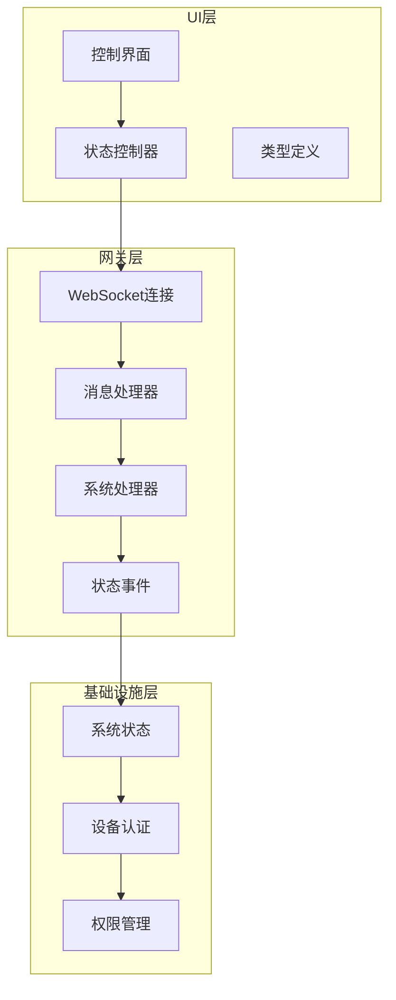
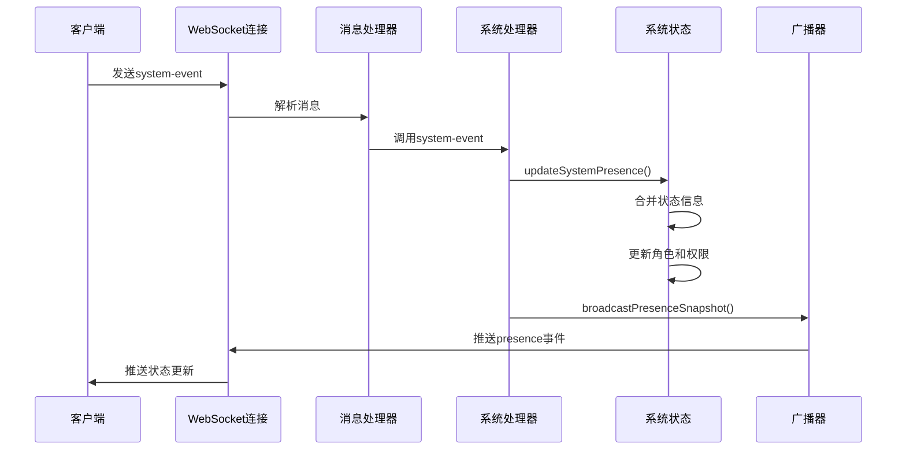
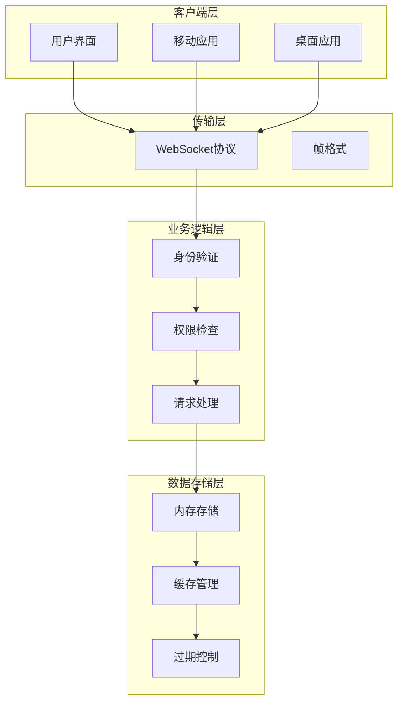
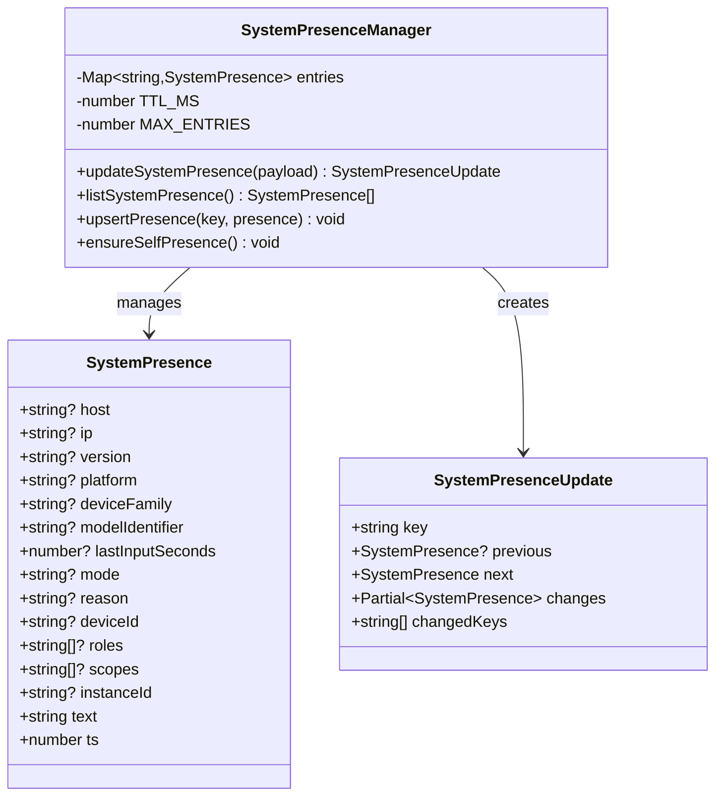
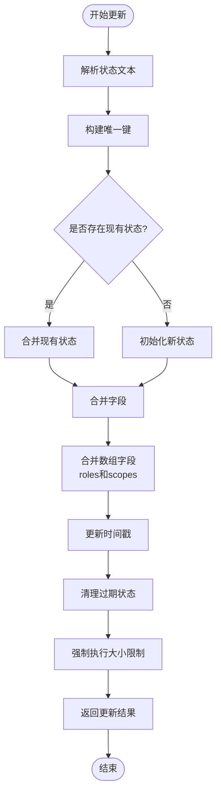
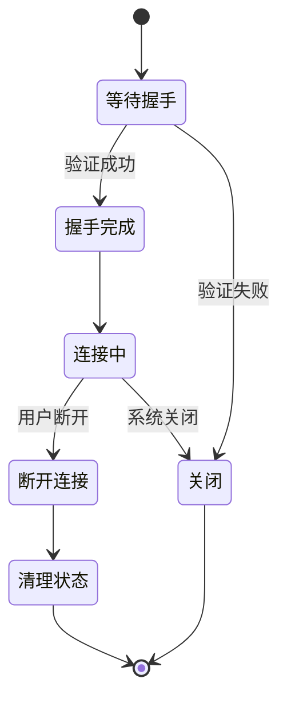
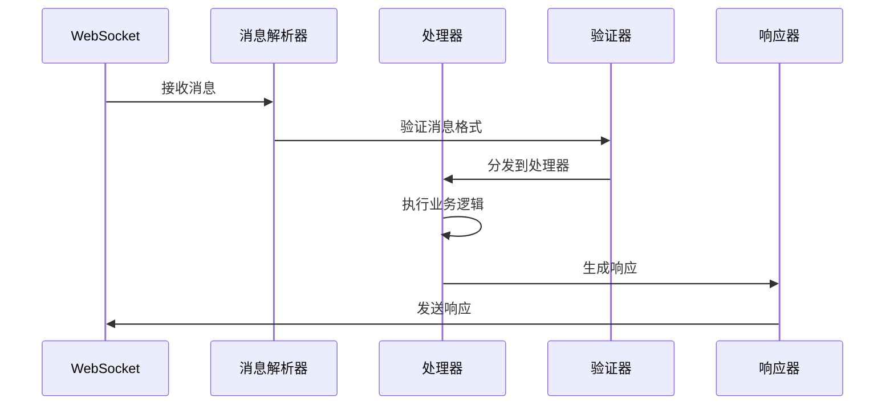
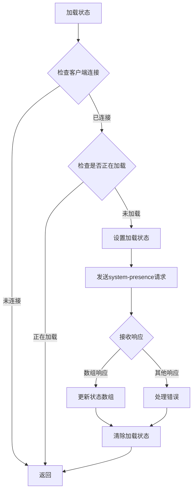
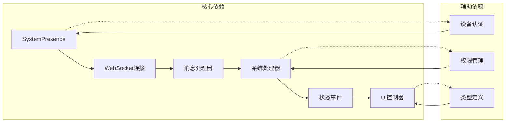
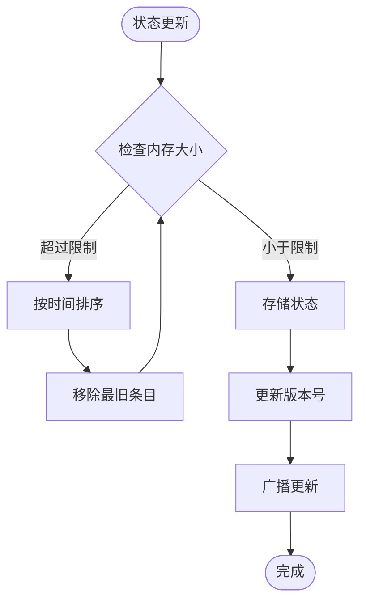

# 在线状态系统

<cite>
**本文档引用的文件**
- [system-presence.ts](file://src/infra/system-presence.ts)
- [system.ts](file://src/gateway/server-methods/system.ts)
- [presence-events.ts](file://src/gateway/server/presence-events.ts)
- [message-handler.ts](file://src/gateway/server/ws-connection/message-handler.ts)
- [ws-connection.ts](file://src/gateway/server/ws-connection.ts)
- [system.ts](file://src/gateway/server-methods-list.ts)
- [method-scopes.ts](file://src/gateway/method-scopes.ts)
- [presence.ts](file://ui/src/ui/controllers/presence.ts)
- [types.ts](file://ui/src/ui/types.ts)
- [instances.ts](file://ui/src/ui/views/instances.ts)
- [server.health.test.ts](file://src/gateway/server.health.test.ts)
- [device-auth.ts](file://src/shared/device-auth.ts)
</cite>

## 目录
1. [简介](#简介)
2. [项目结构](#项目结构)
3. [核心组件](#核心组件)
4. [架构概览](#架构概览)
5. [详细组件分析](#详细组件分析)
6. [依赖关系分析](#依赖关系分析)
7. [性能考虑](#性能考虑)
8. [故障排除指南](#故障排除指南)
9. [结论](#结论)

## 简介

OpenClaw的WebSocket在线状态系统是一个分布式设备状态管理系统，通过WebSocket连接实时同步各个客户端的在线状态信息。该系统支持单设备多角色显示，通过deviceId、roles和scopes字段实现灵活的权限管理。

系统的核心功能包括：
- 实时在线状态跟踪和广播
- 设备身份标识和角色权限管理
- 多客户端状态同步和去重
- 缓存策略和过期机制
- UI状态展示和用户界面优化

## 项目结构

在线状态系统涉及多个层次的组件协作：

**图表来源**
- [presence.ts](file://ui/src/ui/controllers/presence.ts#L1-L38)
- [ws-connection.ts](file://src/gateway/server/ws-connection.ts#L1-L319)
- [system-presence.ts](file://src/infra/system-presence.ts#L1-L290)

**章节来源**
- [presence.ts](file://ui/src/ui/controllers/presence.ts#L1-L38)
- [system-presence.ts](file://src/infra/system-presence.ts#L1-L290)

## 核心组件

### 系统状态数据模型

系统状态采用统一的数据结构，包含以下关键字段：

| 字段名 | 类型 | 描述 | 示例值 |
|--------|------|------|--------|
| deviceId | string | 设备唯一标识符 | "device_123" |
| instanceId | string | 实例唯一标识符 | "instance_456" |
| roles | string[] | 角色列表 | ["operator", "admin"] |
| scopes | string[] | 权限范围列表 | ["operator.admin", "operator.read"] |
| host | string | 主机名 | "gateway-host" |
| ip | string | IP地址 | "192.168.1.100" |
| version | string | 版本号 | "1.2.3" |
| platform | string | 平台信息 | "macos 13.2" |
| deviceFamily | string | 设备系列 | "Mac" |
| modelIdentifier | string | 型号标识 | "MacBookPro18,3" |
| mode | string | 运行模式 | "gateway" |
| reason | string | 状态原因 | "heartbeat" |
| lastInputSeconds | number | 最后输入时间(秒) | 300 |
| text | string | 状态文本描述 | "Node: gateway-host (192.168.1.100) · app 1.2.3 · mode gateway · reason heartbeat" |
| ts | number | 时间戳 | 1699123456789 |

### 状态更新流程

**图表来源**
- [message-handler.ts](file://src/gateway/server/ws-connection/message-handler.ts#L1-L800)
- [system.ts](file://src/gateway/server-methods/system.ts#L30-L134)
- [presence-events.ts](file://src/gateway/server/presence-events.ts#L1-L23)

**章节来源**
- [system-presence.ts](file://src/infra/system-presence.ts#L6-L30)
- [system.ts](file://src/gateway/server-methods/system.ts#L30-L134)

## 架构概览

在线状态系统的整体架构采用分层设计，确保了系统的可扩展性和维护性：

**图表来源**
- [system-presence.ts](file://src/infra/system-presence.ts#L32-L35)
- [method-scopes.ts](file://src/gateway/method-scopes.ts#L1-L213)

## 详细组件分析

### 系统状态管理器

系统状态管理器是整个在线状态系统的核心组件，负责状态的存储、更新和查询。

#### 数据结构设计

**图表来源**
- [system-presence.ts](file://src/infra/system-presence.ts#L6-L30)

#### 状态更新算法

系统状态更新采用智能合并策略，支持多种键值组合：

**图表来源**
- [system-presence.ts](file://src/infra/system-presence.ts#L193-L246)

**章节来源**
- [system-presence.ts](file://src/infra/system-presence.ts#L193-L246)

### WebSocket连接管理

WebSocket连接管理器负责处理客户端连接、消息路由和状态广播。

#### 连接生命周期

#### 消息处理流程

**图表来源**
- [ws-connection.ts](file://src/gateway/server/ws-connection.ts#L115-L319)
- [message-handler.ts](file://src/gateway/server/ws-connection/message-handler.ts#L363-L434)

**章节来源**
- [ws-connection.ts](file://src/gateway/server/ws-connection.ts#L115-L319)
- [message-handler.ts](file://src/gateway/server/ws-connection/message-handler.ts#L363-L434)

### UI状态控制器

UI状态控制器负责从网关获取状态信息并更新用户界面。

#### 状态加载流程

**图表来源**
- [presence.ts](file://ui/src/ui/controllers/presence.ts#L13-L37)

**章节来源**
- [presence.ts](file://ui/src/ui/controllers/presence.ts#L13-L37)

### 设备身份和权限管理

设备身份和权限管理确保只有授权的设备可以访问系统状态信息。

#### 角色和权限映射

| 角色 | 权限范围 | 方法访问 |
|------|----------|----------|
| operator | operator.read | 所有只读方法 |
| operator.write | operator.write | 写入相关方法 |
| operator.admin | operator.admin | 管理相关方法 |
| operator.approvals | operator.approvals | 审批相关方法 |
| operator.pairing | operator.pairing | 配对相关方法 |

**章节来源**
- [method-scopes.ts](file://src/gateway/method-scopes.ts#L29-L129)
- [device-auth.ts](file://src/shared/device-auth.ts#L1-L30)

## 依赖关系分析

在线状态系统的依赖关系相对简单，主要围绕核心组件展开：

**图表来源**
- [system-presence.ts](file://src/infra/system-presence.ts#L1-L290)
- [system.ts](file://src/gateway/server-methods/system.ts#L1-L135)

**章节来源**
- [system-presence.ts](file://src/infra/system-presence.ts#L1-L290)
- [system.ts](file://src/gateway/server-methods/system.ts#L1-L135)

## 性能考虑

### 缓存策略

系统采用了多层缓存策略来优化性能：

1. **内存缓存**：使用Map存储状态信息，提供O(1)的查找复杂度
2. **TTL过期**：默认5分钟过期时间，自动清理不活跃的状态
3. **大小限制**：最多保留200个状态条目，超出时按时间顺序淘汰

### 广播优化

状态广播采用了智能优化策略：

- **丢弃慢消费者**：对于响应较慢的客户端，丢弃部分状态更新
- **版本控制**：使用presence和health版本号避免重复传输
- **批量处理**：将多个状态更新合并为单次广播

### 内存管理

系统实现了智能的内存管理机制：

**图表来源**
- [system-presence.ts](file://src/infra/system-presence.ts#L270-L289)

## 故障排除指南

### 常见问题诊断

#### 状态不更新问题

1. **检查WebSocket连接状态**
   - 确认客户端能够正常连接到网关
   - 验证网络连接和防火墙设置

2. **验证消息格式**
   - 确认system-event消息包含正确的字段
   - 检查deviceId和instanceId的唯一性

3. **查看日志输出**
   - 检查网关服务器的日志输出
   - 关注状态更新的错误信息

#### UI显示异常

1. **检查数据格式**
   - 确认presence数组的结构正确
   - 验证roles和scopes数组的有效性

2. **验证权限配置**
   - 确认客户端具有访问system-presence的权限
   - 检查operator scopes的配置

**章节来源**
- [server.health.test.ts](file://src/gateway/server.health.test.ts#L43-L66)

### 调试工具

系统提供了多种调试工具来帮助诊断问题：

1. **CLI调试命令**：使用`openclaw system presence`查看当前状态
2. **测试用例**：包含完整的集成测试覆盖
3. **日志记录**：详细的系统状态变更日志

## 结论

OpenClaw的在线状态系统通过精心设计的架构和实现，为分布式设备状态管理提供了可靠的解决方案。系统的主要优势包括：

1. **高可用性**：通过内存缓存和智能过期机制确保系统稳定性
2. **灵活性**：支持单设备多角色显示，满足复杂的权限管理需求
3. **可扩展性**：模块化的架构设计便于功能扩展和维护
4. **用户体验**：实时的状态更新和直观的UI展示提升用户满意度

未来可以考虑的改进方向：
- 增加状态历史记录功能
- 实现更细粒度的权限控制
- 优化大规模部署时的性能表现
- 添加状态预测和告警机制