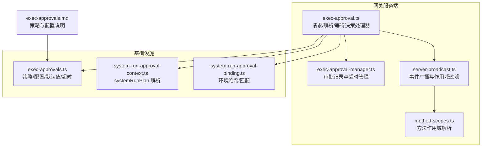
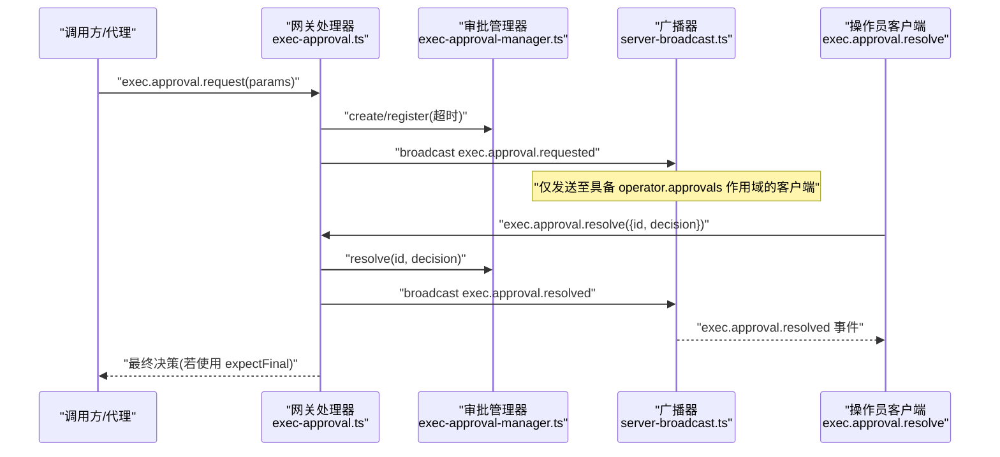
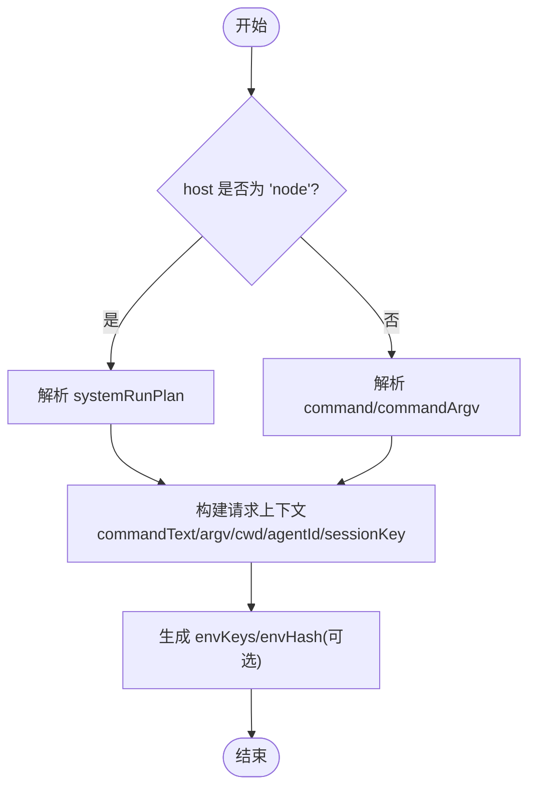
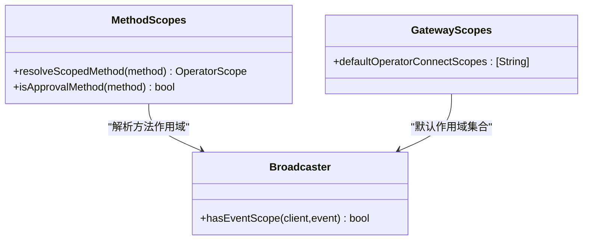
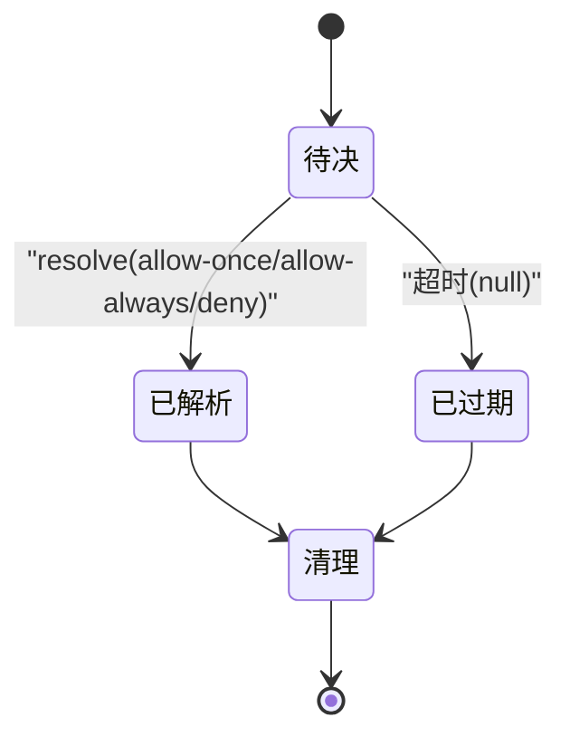
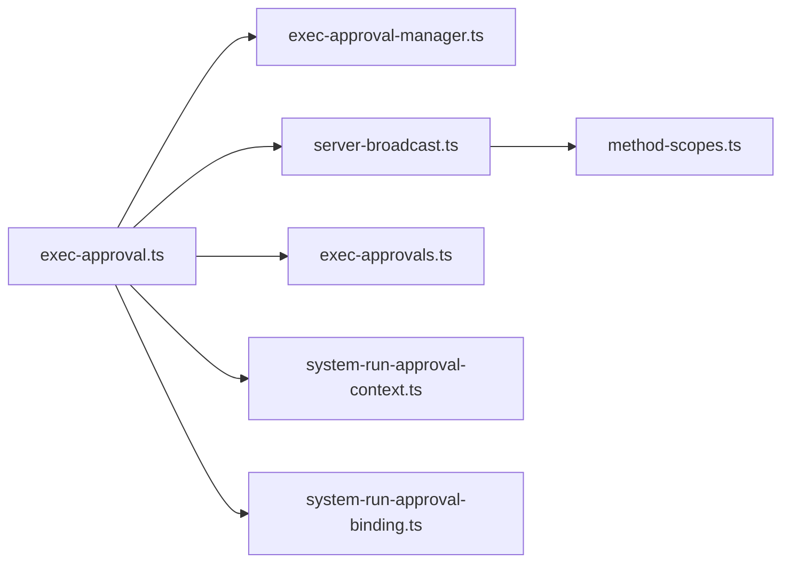

# 执行审批机制

<cite>
**本文引用的文件**
- [exec-approval.ts](file://src/gateway/server-methods/exec-approval.ts)
- [exec-approvals.ts](file://src/gateway/server-methods/exec-approvals.ts)
- [exec-approval-manager.ts](file://src/gateway/exec-approval-manager.ts)
- [server-broadcast.ts](file://src/gateway/server-broadcast.ts)
- [exec-approvals.ts](file://src/infra/exec-approvals.ts)
- [system-run-approval-context.ts](file://src/infra/system-run-approval-context.ts)
- [system-run-approval-binding.ts](file://src/infra/system-run-approval-binding.ts)
- [exec-approvals.md](file://docs/tools/exec-approvals.md)
- [protocol.md](file://docs/gateway/protocol.md)
- [method-scopes.ts](file://src/gateway/method-scopes.ts)
- [gateway-misc.test.ts](file://src/gateway/gateway-misc.test.ts)
- [server-methods.test.ts](file://src/gateway/server-methods/server-methods.test.ts)
- [node-invoke-system-run-approval.test.ts](file://src/gateway/node-invoke-system-run-approval.test.ts)
- [GatewayScopes.swift](file://apps/macos/Sources/OpenClawMacCLI/GatewayScopes.swift)
</cite>

## 目录
1. [简介](#简介)
2. [项目结构](#项目结构)
3. [核心组件](#核心组件)
4. [架构总览](#架构总览)
5. [详细组件分析](#详细组件分析)
6. [依赖关系分析](#依赖关系分析)
7. [性能考量](#性能考量)
8. [故障排除指南](#故障排除指南)
9. [结论](#结论)
10. [附录](#附录)

## 简介
本文件系统性阐述 OpenClaw 的 WebSocket 执行审批机制，覆盖以下要点：
- 当 exec 请求需要人工审批时的完整流程：网关广播 exec.approval.requested 事件、操作员客户端调用 exec.approval.resolve 响应、审批结果的传播与处理。
- systemRunPlan 的必需字段：argv 参数数组、cwd 工作目录、rawCommand 原始命令、会话元数据等。
- 审批权限要求 operator.approvals 与不同执行上下文的审批策略。
- 审批超时处理、批量审批与自动化审批的配置选项。
- 提供完整的请求-响应示例与故障排除指南。

## 项目结构
围绕执行审批的核心代码分布在网关服务端与基础设施模块中：
- 网关方法层：处理 exec.approval.request、exec.approval.resolve、exec.approval.waitDecision 等方法，并负责广播 exec.approval.requested/resolved 事件。
- 审批管理器：维护待决记录、注册超时、解析决策、广播决议。
- 广播器：按作用域过滤事件，确保 operator.approvals 范围内的客户端接收审批相关事件。
- 基础设施：定义 systemRunPlan 结构、审批策略配置、环境绑定与匹配校验。

图表来源
- [exec-approval.ts](file://src/gateway/server-methods/exec-approval.ts#L1-L305)
- [exec-approval-manager.ts](file://src/gateway/exec-approval-manager.ts#L1-L174)
- [server-broadcast.ts](file://src/gateway/server-broadcast.ts#L1-L132)
- [method-scopes.ts](file://src/gateway/method-scopes.ts#L131-L176)
- [exec-approvals.ts](file://src/infra/exec-approvals.ts#L1-L557)
- [system-run-approval-context.ts](file://src/infra/system-run-approval-context.ts#L1-L113)
- [system-run-approval-binding.ts](file://src/infra/system-run-approval-binding.ts#L1-L197)
- [exec-approvals.md](file://docs/tools/exec-approvals.md#L1-L350)

章节来源
- [exec-approval.ts](file://src/gateway/server-methods/exec-approval.ts#L1-L305)
- [exec-approvals.ts](file://src/gateway/server-methods/exec-approvals.ts#L1-L194)
- [exec-approval-manager.ts](file://src/gateway/exec-approval-manager.ts#L1-L174)
- [server-broadcast.ts](file://src/gateway/server-broadcast.ts#L1-L132)
- [exec-approvals.ts](file://src/infra/exec-approvals.ts#L1-L557)
- [system-run-approval-context.ts](file://src/infra/system-run-approval-context.ts#L1-L113)
- [system-run-approval-binding.ts](file://src/infra/system-run-approval-binding.ts#L1-L197)
- [exec-approvals.md](file://docs/tools/exec-approvals.md#L1-L350)

## 核心组件
- 执行审批处理器：负责校验请求参数、构建审批记录、注册超时、广播 exec.approval.requested；在两阶段模式下先返回 accepted，再异步返回最终决策；支持 waitDecision 查询。
- 审批管理器：以 Map 维护待决记录，设置超时定时器，支持 resolve/expired 状态变更与“已决议条目宽限期”。
- 广播器：基于 operator.approvals 作用域过滤 exec.approval.requested/resolved 事件，避免非授权客户端接收。
- 基础设施策略：定义 systemRunPlan 字段、默认安全级别、询问策略 ask、askFallback、自动允许技能开关等。
- systemRunPlan 解析：从 systemRunPlan 或命令/参数推导出 canonical 命令、cwd、agentId、sessionKey。
- 环境绑定与匹配：对 env 变量进行规范化、排序与哈希，用于审批绑定一致性校验。

章节来源
- [exec-approval.ts](file://src/gateway/server-methods/exec-approval.ts#L30-L305)
- [exec-approval-manager.ts](file://src/gateway/exec-approval-manager.ts#L34-L173)
- [server-broadcast.ts](file://src/gateway/server-broadcast.ts#L9-L55)
- [exec-approvals.ts](file://src/infra/exec-approvals.ts#L14-L121)
- [system-run-approval-context.ts](file://src/infra/system-run-approval-context.ts#L53-L74)
- [system-run-approval-binding.ts](file://src/infra/system-run-approval-binding.ts#L63-L81)

## 架构总览
下面的序列图展示了从 exec 请求到审批完成的端到端流程，包括网关广播、操作员解析与结果回传。

图表来源
- [exec-approval.ts](file://src/gateway/server-methods/exec-approval.ts#L31-L301)
- [exec-approval-manager.ts](file://src/gateway/exec-approval-manager.ts#L58-L122)
- [server-broadcast.ts](file://src/gateway/server-broadcast.ts#L41-L117)

章节来源
- [exec-approval.ts](file://src/gateway/server-methods/exec-approval.ts#L31-L301)
- [exec-approval-manager.ts](file://src/gateway/exec-approval-manager.ts#L58-L122)
- [server-broadcast.ts](file://src/gateway/server-broadcast.ts#L41-L117)

## 详细组件分析

### systemRunPlan 必需字段与解析
- 字段清单（来自基础设施定义）：
  - argv：字符串数组，必须非空。
  - cwd：字符串或 null。
  - rawCommand：字符串或 null。
  - agentId：字符串或 null。
  - sessionKey：字符串或 null。
- 解析逻辑：
  - 若 host=node，则优先使用 systemRunPlan 作为权威来源；否则回退到 command/commandArgv。
  - 当存在 systemRunPlan 时，command/cwd/agentId/sessionKey 以 plan 为准；否则从参数推导。
  - 环境变量键列表与哈希用于审批绑定，便于后续执行时一致性校验。

图表来源
- [system-run-approval-context.ts](file://src/infra/system-run-approval-context.ts#L53-L74)
- [system-run-approval-binding.ts](file://src/infra/system-run-approval-binding.ts#L63-L81)

章节来源
- [exec-approvals.ts](file://src/infra/exec-approvals.ts#L22-L49)
- [system-run-approval-context.ts](file://src/infra/system-run-approval-context.ts#L53-L74)
- [system-run-approval-binding.ts](file://src/infra/system-run-approval-binding.ts#L63-L81)

### 审批权限与作用域
- 方法作用域：
  - exec.approval.requested/exec.approval.resolved 需要 operator.approvals 作用域。
  - exec.approval.resolve 属于审批方法组，受 operator.approvals 限制。
- 客户端连接作用域：
  - 默认操作员作用域包含 operator.admin、operator.read、operator.write、operator.approvals、operator.pairing。
- 广播过滤：
  - hasEventScope 根据事件所需作用域与客户端 scopes 判断是否允许接收。

图表来源
- [method-scopes.ts](file://src/gateway/method-scopes.ts#L131-L176)
- [server-broadcast.ts](file://src/gateway/server-broadcast.ts#L41-L55)
- [GatewayScopes.swift](file://apps/macos/Sources/OpenClawMacCLI/GatewayScopes.swift#L1-L7)

章节来源
- [method-scopes.ts](file://src/gateway/method-scopes.ts#L131-L176)
- [server-broadcast.ts](file://src/gateway/server-broadcast.ts#L41-L55)
- [GatewayScopes.swift](file://apps/macos/Sources/OpenClawMacCLI/GatewayScopes.swift#L1-L7)

### 审批生命周期与超时处理
- 生命周期：
  - 创建记录并注册超时，广播 exec.approval.requested。
  - 支持两阶段模式：先返回 accepted，随后异步返回最终决策。
  - 等待模式：exec.approval.waitDecision 返回决策或 null（超时）。
  - 决策解析：exec.approval.resolve 接收 allow-once/allow-always/deny。
  - 广播 exec.approval.resolved，携带请求快照与解析人信息。
- 超时与宽限期：
  - 默认超时常量与可配置超时。
  - 超时后记录标记为 null 决策；已决议条目保留宽限期以便 awaitDecision 查询。

图表来源
- [exec-approval-manager.ts](file://src/gateway/exec-approval-manager.ts#L58-L143)
- [exec-approvals.ts](file://src/infra/exec-approvals.ts#L114-L114)

章节来源
- [exec-approval-manager.ts](file://src/gateway/exec-approval-manager.ts#L58-L143)
- [exec-approvals.ts](file://src/infra/exec-approvals.ts#L114-L114)

### 审批策略与配置
- 策略字段（来自基础设施与文档）：
  - security：deny/allowlist/full。
  - ask：off/on-miss/always。
  - askFallback：deny/allowlist/full。
  - autoAllowSkills：布尔，控制是否自动允许已知技能的可执行文件。
- 默认值与合并：
  - 默认 deny/off/deny/false。
  - 支持 per-agent 与通配符 * 合并，以及 per-agent 允许列表合并。
- systemRunPlan 与环境绑定：
  - systemRunPlan 作为权威命令上下文；envKeys/envHash 用于绑定一致性校验。
  - 匹配失败时返回明确错误码与详情，便于诊断。

章节来源
- [exec-approvals.ts](file://src/infra/exec-approvals.ts#L66-L121)
- [exec-approvals.ts](file://src/infra/exec-approvals.ts#L379-L448)
- [system-run-approval-binding.ts](file://src/infra/system-run-approval-binding.ts#L148-L170)
- [exec-approvals.md](file://docs/tools/exec-approvals.md#L80-L133)

### 请求-响应示例（基于测试与协议）
- exec.approval.request
  - 输入：command/commandArgv/systemRunPlan/cwd/env/nodeId/host/security/ask/agentId/sessionKey/turnSource*/timeoutMs/twoPhase。
  - 输出：twoPhase=true 时立即返回 accepted；最终返回包含 id/decision/createdAtMs/expiresAtMs。
- exec.approval.resolve
  - 输入：id、decision（allow-once/allow-always/deny）。
  - 输出：{ ok: true }，同时广播 exec.approval.resolved。
- exec.approval.waitDecision
  - 输入：id。
  - 输出：id/decision/createdAtMs/expiresAtMs（null 表示超时）。

章节来源
- [exec-approval.ts](file://src/gateway/server-methods/exec-approval.ts#L31-L301)
- [exec-approvals.ts](file://src/gateway/server-methods/exec-approvals.ts#L98-L194)
- [server-methods.test.ts](file://src/gateway/server-methods/server-methods.test.ts#L494-L532)

## 依赖关系分析
- 组件耦合：
  - 处理器依赖管理器（记录、超时、决议）、广播器（事件分发）、基础设施（策略/默认值/超时常量）、上下文/绑定（systemRunPlan 解析与环境绑定）。
  - 广播器依赖方法作用域解析，确保事件只投递给具备 operator.approvals 的客户端。
- 外部集成点：
  - 客户端通过 WebSocket 调用方法，网关广播事件；macOS 应用与 Control UI 作为操作员客户端解析审批。
  - 文档与协议定义了事件与方法的契约。

图表来源
- [exec-approval.ts](file://src/gateway/server-methods/exec-approval.ts#L1-L16)
- [exec-approval-manager.ts](file://src/gateway/exec-approval-manager.ts#L1-L6)
- [server-broadcast.ts](file://src/gateway/server-broadcast.ts#L1-L7)
- [exec-approvals.ts](file://src/infra/exec-approvals.ts#L1-L7)
- [system-run-approval-context.ts](file://src/infra/system-run-approval-context.ts#L1-L4)
- [system-run-approval-binding.ts](file://src/infra/system-run-approval-binding.ts#L1-L4)
- [method-scopes.ts](file://src/gateway/method-scopes.ts#L131-L176)

章节来源
- [exec-approval.ts](file://src/gateway/server-methods/exec-approval.ts#L1-L16)
- [exec-approval-manager.ts](file://src/gateway/exec-approval-manager.ts#L1-L6)
- [server-broadcast.ts](file://src/gateway/server-broadcast.ts#L1-L7)
- [exec-approvals.ts](file://src/infra/exec-approvals.ts#L1-L7)
- [system-run-approval-context.ts](file://src/infra/system-run-approval-context.ts#L1-L4)
- [system-run-approval-binding.ts](file://src/infra/system-run-approval-binding.ts#L1-L4)
- [method-scopes.ts](file://src/gateway/method-scopes.ts#L131-L176)

## 性能考量
- 广播性能：
  - 广播器对慢消费者进行丢弃或关闭，防止阻塞；支持 dropIfSlow 选项。
  - 事件帧包含序号与状态版本，便于调试与可观测性。
- 超时与内存：
  - 审批记录带超时定时器；已决议条目保留短宽限期，避免竞态查询丢失。
  - 默认超时常量统一管理，便于全局调优。
- 环境绑定：
  - env 变量规范化与哈希计算开销可控；仅在需要时生成 envKeys/envHash。

章节来源
- [server-broadcast.ts](file://src/gateway/server-broadcast.ts#L60-L117)
- [exec-approval-manager.ts](file://src/gateway/exec-approval-manager.ts#L58-L86)
- [exec-approvals.ts](file://src/infra/exec-approvals.ts#L114-L114)
- [system-run-approval-binding.ts](file://src/infra/system-run-approval-binding.ts#L45-L61)

## 故障排除指南
- 常见错误与定位
  - 缺少必要参数：例如 host=node 时缺少 nodeId/systemRunPlan/commandArgv。
  - 重复 id：已存在的审批 id 无法再次注册。
  - 未知审批 id：resolve 时 id 不存在或已过期。
  - 作用域不足：未具备 operator.approvals 导致无法接收 exec.approval.requested。
  - 环境绑定不匹配：env 变量哈希不一致导致审批绑定缺失或不匹配。
- 诊断建议
  - 使用 exec.approval.waitDecision 获取当前决策状态（null 表示超时）。
  - 检查广播目标：确认客户端具备 operator.approvals 作用域。
  - 校验 systemRunPlan 与 env 绑定：确保 argv/cwd/agentId/sessionKey/envHash 与请求一致。
  - 查看系统事件：Exec denied/finished 等消息可用于关联审批 id。

章节来源
- [exec-approval.ts](file://src/gateway/server-methods/exec-approval.ts#L86-L130)
- [exec-approval-manager.ts](file://src/gateway/exec-approval-manager.ts#L99-L143)
- [server-broadcast.ts](file://src/gateway/server-broadcast.ts#L41-L55)
- [system-run-approval-binding.ts](file://src/infra/system-run-approval-binding.ts#L117-L170)
- [server-methods.test.ts](file://src/gateway/server-methods/server-methods.test.ts#L456-L532)

## 结论
OpenClaw 的执行审批机制通过“请求-广播-解析-广播-转发”的闭环，结合 operator.approvals 作用域与 systemRunPlan 的权威上下文，实现了对 host 执行的安全控制。默认 deny 策略与可配置 ask/askFallback 提供灵活的人机协作路径；超时与宽限期设计兼顾可靠性与可观测性。配合 Control UI 与 macOS 应用，操作员可高效完成审批与批量处理，满足不同信任边界下的安全需求。

## 附录

### systemRunPlan 字段说明
- argv：命令参数数组，必填且非空。
- cwd：工作目录，可选。
- rawCommand：原始命令文本，可选。
- agentId：代理标识，可选。
- sessionKey：会话键，可选。

章节来源
- [exec-approvals.ts](file://src/infra/exec-approvals.ts#L22-L28)
- [system-run-approval-context.ts](file://src/infra/system-run-approval-context.ts#L53-L74)

### 审批权限与策略速览
- 作用域：operator.approvals。
- 策略：security（deny/allowlist/full）、ask（off/on-miss/always）、askFallback、autoAllowSkills。
- 默认值：deny/off/deny/false。

章节来源
- [method-scopes.ts](file://src/gateway/method-scopes.ts#L131-L176)
- [exec-approvals.ts](file://src/infra/exec-approvals.ts#L66-L121)
- [exec-approvals.md](file://docs/tools/exec-approvals.md#L80-L133)

### 请求-响应示例（路径引用）
- exec.approval.request：[exec-approval.ts](file://src/gateway/server-methods/exec-approval.ts#L31-L179)
- exec.approval.resolve：[exec-approval.ts](file://src/gateway/server-methods/exec-approval.ts#L258-L301)
- exec.approval.waitDecision：[exec-approval.ts](file://src/gateway/server-methods/exec-approval.ts#L227-L257)
- 广播事件过滤：[server-broadcast.ts](file://src/gateway/server-broadcast.ts#L9-L16)

章节来源
- [exec-approval.ts](file://src/gateway/server-methods/exec-approval.ts#L31-L301)
- [server-broadcast.ts](file://src/gateway/server-broadcast.ts#L9-L16)