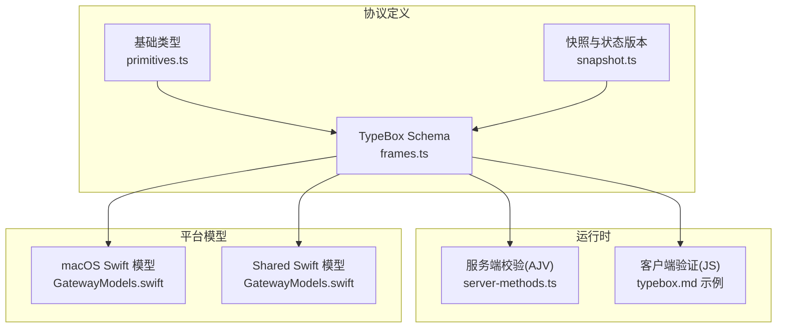
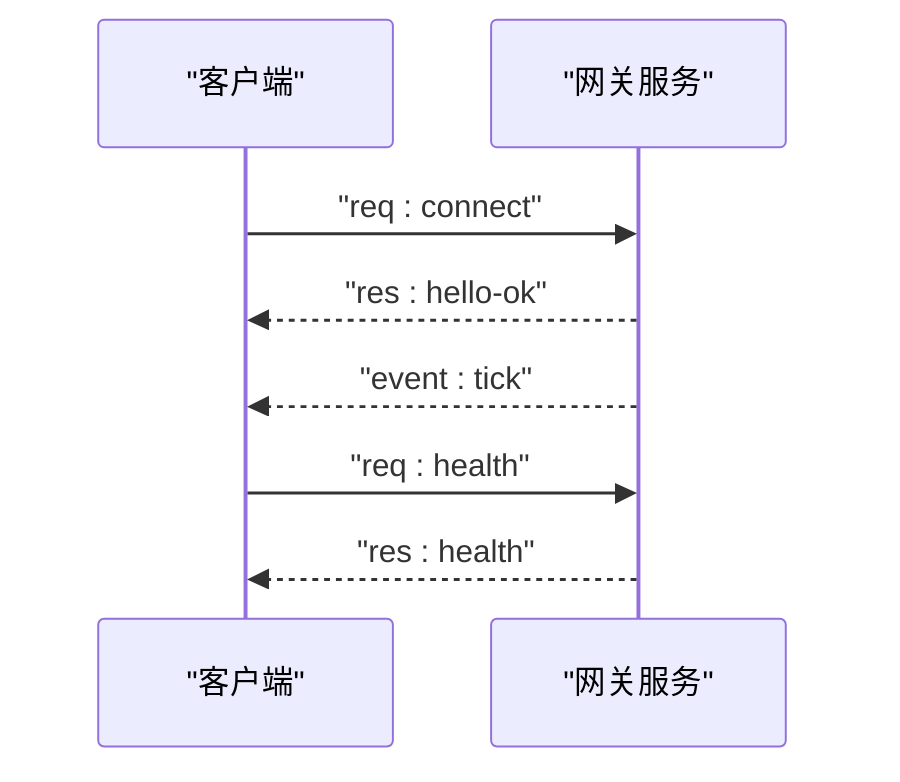
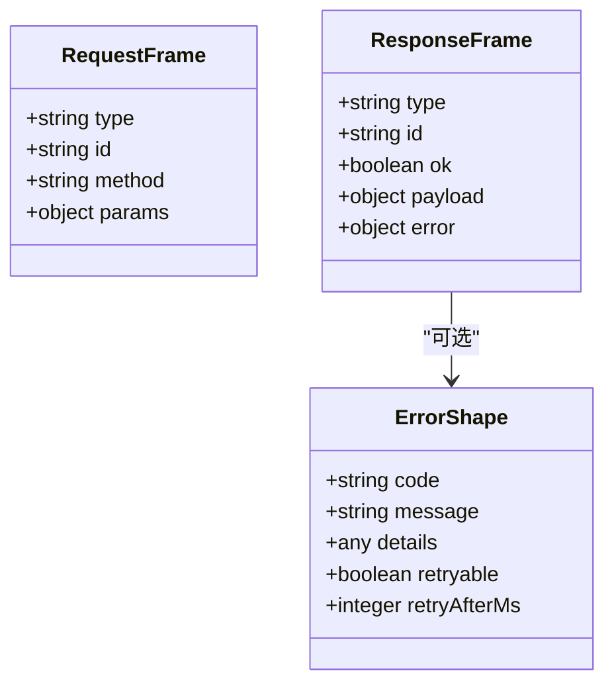
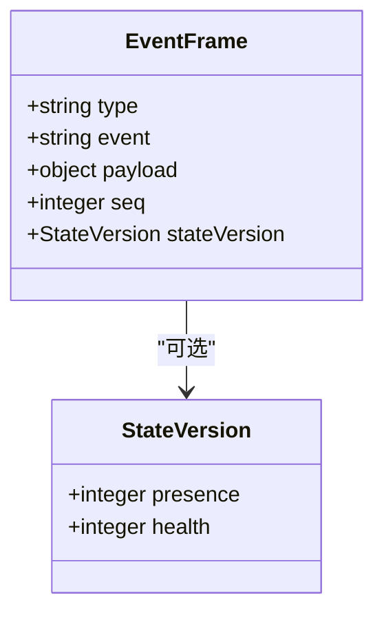
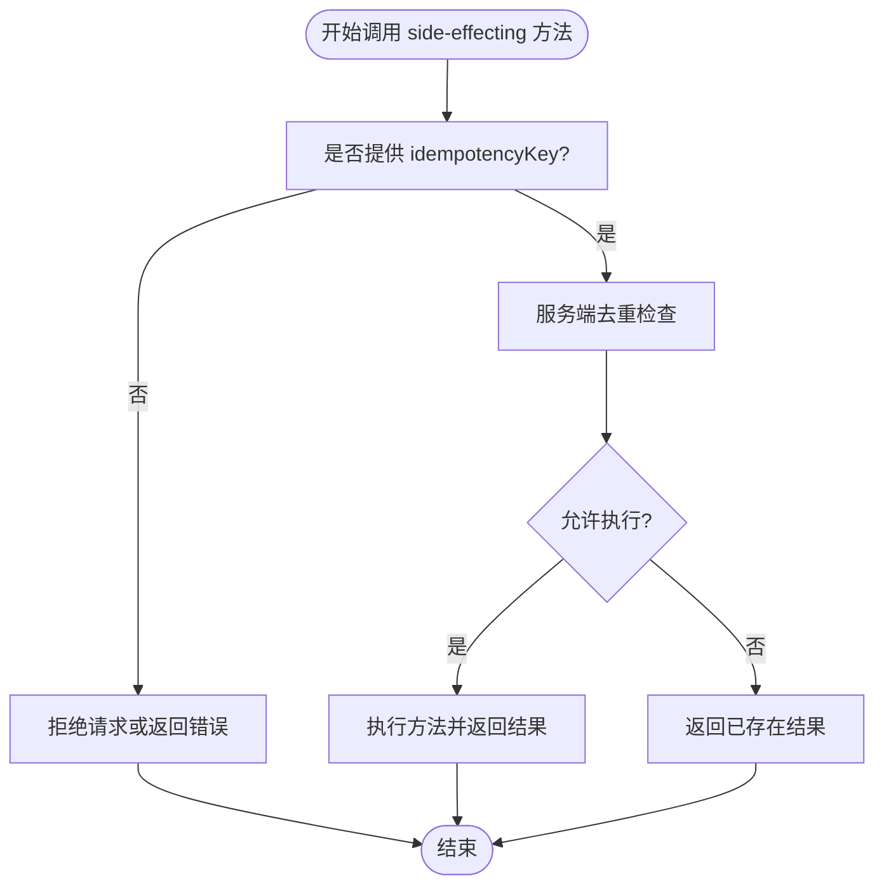
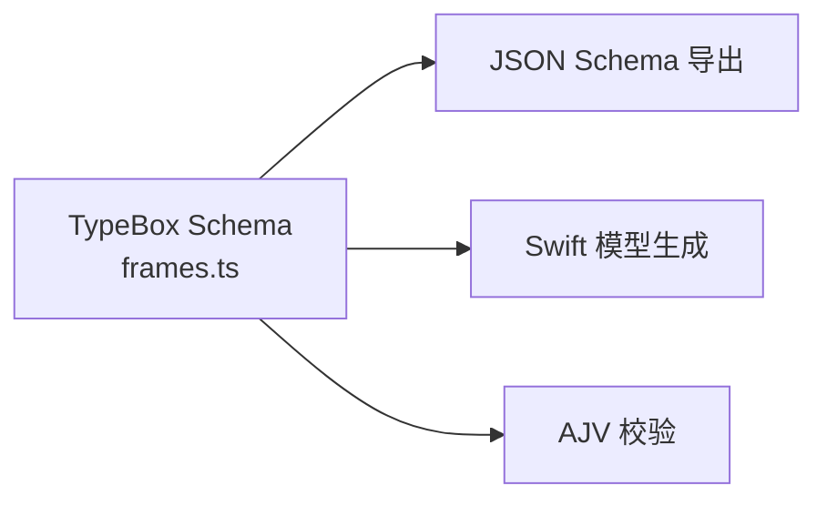
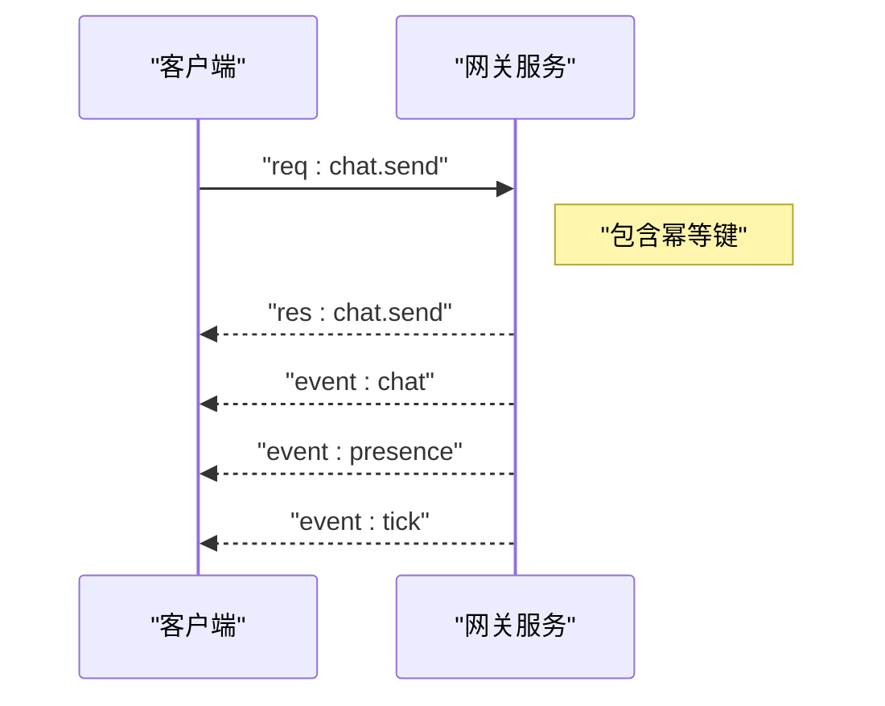
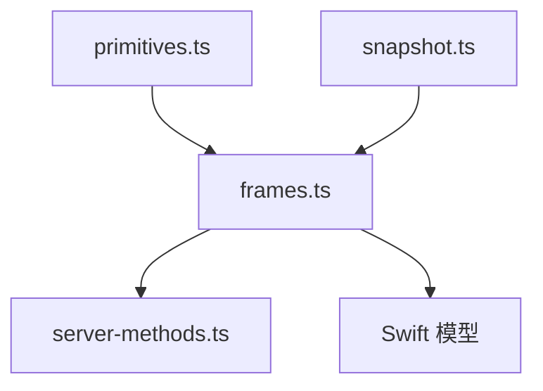

# 消息帧格式

<cite>
**本文引用的文件**
- [frames.ts](file://src/gateway/protocol/schema/frames.ts)
- [primitives.ts](file://src/gateway/protocol/schema/primitives.ts)
- [snapshot.ts](file://src/gateway/protocol/schema/snapshot.ts)
- [typebox.md](file://docs/concepts/typebox.md)
- [server-methods.ts](file://src/gateway/server-methods.ts)
- [GatewayWebSocketTestSupport.swift](file://apps/macos/Tests/OpenClawIPCTests/GatewayWebSocketTestSupport.swift)
- [GatewayModels.swift](file://apps/macos/Sources/OpenClawProtocol/GatewayModels.swift)
- [GatewayModels.swift](file://apps/shared/OpenClawKit/Sources/OpenClawProtocol/GatewayModels.swift)
</cite>

## 目录
1. [简介](#简介)
2. [项目结构](#项目结构)
3. [核心组件](#核心组件)
4. [架构总览](#架构总览)
5. [详细组件分析](#详细组件分析)
6. [依赖关系分析](#依赖关系分析)
7. [性能考量](#性能考量)
8. [故障排查指南](#故障排查指南)
9. [结论](#结论)
10. [附录](#附录)

## 简介
本文件系统化阐述 OpenClaw WebSocket 网关协议的消息帧格式，覆盖三类统一帧结构：请求（req）、响应（res）、事件（event）。文档将逐项说明各帧的必需字段与可选字段、JSON Schema 定义与 TypeBox 类型系统映射、幂等性键 side-effecting 方法的要求，并给出 agent、chat、system-presence 等核心方法的请求-响应示例与交互时序。

## 项目结构
- 协议规范与生成：TypeBox Schema 位于协议 schema 目录，驱动运行时校验、JSON Schema 导出与 Swift 代码生成。
- 运行时使用：服务端以 AJV 校验入站帧；客户端在 JS 中对响应与事件帧进行验证；方法表与事件表由网关在握手后宣告。
- 平台模型：macOS 与共享模块分别生成强类型 Swift 模型，确保跨平台一致性。

**图表来源**
- [frames.ts](file://src/gateway/protocol/schema/frames.ts#L125-L163)
- [primitives.ts](file://src/gateway/protocol/schema/primitives.ts#L1-L23)
- [snapshot.ts](file://src/gateway/protocol/schema/snapshot.ts#L38-L72)
- [server-methods.ts](file://src/gateway/server-methods.ts#L98-L155)
- [typebox.md](file://docs/concepts/typebox.md#L74-L81)
- [GatewayModels.swift](file://apps/macos/Sources/OpenClawProtocol/GatewayModels.swift#L3235-L3242)
- [GatewayModels.swift](file://apps/shared/OpenClawKit/Sources/OpenClawProtocol/GatewayModels.swift#L3235-L3242)

**章节来源**
- [frames.ts](file://src/gateway/protocol/schema/frames.ts#L1-L164)
- [primitives.ts](file://src/gateway/protocol/schema/primitives.ts#L1-L23)
- [snapshot.ts](file://src/gateway/protocol/schema/snapshot.ts#L1-L73)
- [typebox.md](file://docs/concepts/typebox.md#L56-L81)
- [server-methods.ts](file://src/gateway/server-methods.ts#L1-L156)

## 核心组件
- 请求帧（req）
  - 必需字段：type、id、method
  - 可选字段：params
  - 语义：客户端向网关发起调用，params 为方法参数对象
- 响应帧（res）
  - 必需字段：type、id、ok
  - 可选字段：payload、error
  - 语义：服务端对请求的应答，ok=true 表示成功，否则通过 error 返回错误信息
- 事件帧（event）
  - 必需字段：type、event
  - 可选字段：payload、seq、stateVersion
  - 语义：服务端主动推送事件，payload 为事件载荷，seq 为事件序号，stateVersion 为状态版本号

字段约束与类型来源
- 所有字符串字段默认使用非空字符串约束（NonEmptyString），确保 id、method、event 等关键标识不为空
- seq 为非负整数，stateVersion 包含各子系统的版本计数
- 错误形状包含 code、message、details、retryable、retryAfterMs 等字段

**章节来源**
- [frames.ts](file://src/gateway/protocol/schema/frames.ts#L125-L163)
- [primitives.ts](file://src/gateway/protocol/schema/primitives.ts#L5-L10)
- [snapshot.ts](file://src/gateway/protocol/schema/snapshot.ts#L38-L44)

## 架构总览
下图展示一次典型的连接与健康检查流程，涵盖握手、方法调用与事件推送：

**图表来源**
- [typebox.md](file://docs/concepts/typebox.md#L32-L41)
- [typebox.md](file://docs/concepts/typebox.md#L83-L144)

**章节来源**
- [typebox.md](file://docs/concepts/typebox.md#L20-L54)

## 详细组件分析

### 请求帧（req）与响应帧（res）
- 请求帧
  - 字段：type=“req”、id（非空字符串）、method（非空字符串）、params（可选）
  - 验证：服务端以 AJV 校验入站帧，握手阶段仅接受符合 ConnectParams 的 connect 请求
- 响应帧
  - 字段：type=“res”、id（与请求对应）、ok（布尔）、payload（可选）、error（可选，遵循错误形状）
  - 错误形状：包含 code、message、details、retryable、retryAfterMs 等

**图表来源**
- [frames.ts](file://src/gateway/protocol/schema/frames.ts#L125-L144)
- [frames.ts](file://src/gateway/protocol/schema/frames.ts#L114-L123)

**章节来源**
- [frames.ts](file://src/gateway/protocol/schema/frames.ts#L125-L144)
- [frames.ts](file://src/gateway/protocol/schema/frames.ts#L114-L123)
- [typebox.md](file://docs/concepts/typebox.md#L74-L81)

### 事件帧（event）
- 字段：type=“event”、event（非空字符串）、payload（可选）、seq（可选，非负整数）、stateVersion（可选，包含 presence、health 版本）
- 用途：服务端推送心跳、在线状态、聊天会话、系统健康等事件

**图表来源**
- [frames.ts](file://src/gateway/protocol/schema/frames.ts#L146-L155)
- [snapshot.ts](file://src/gateway/protocol/schema/snapshot.ts#L38-L44)

**章节来源**
- [frames.ts](file://src/gateway/protocol/schema/frames.ts#L146-L155)
- [snapshot.ts](file://src/gateway/protocol/schema/snapshot.ts#L38-L44)

### 幂等性键与 side-effecting 方法
- 幂等性键（idempotencyKey）用于标记具有副作用的方法，避免重复执行导致的副作用叠加
- 典型方法：send、poll、agent、chat.send 等
- 平台模型中可见该字段在相关参数结构中出现，确保客户端在调用时提供唯一键

**图表来源**
- [typebox.md](file://docs/concepts/typebox.md#L270-L279)
- [GatewayModels.swift](file://apps/macos/Sources/OpenClawProtocol/GatewayModels.swift#L3235-L3242)
- [GatewayModels.swift](file://apps/shared/OpenClawKit/Sources/OpenClawProtocol/GatewayModels.swift#L3235-L3242)

**章节来源**
- [typebox.md](file://docs/concepts/typebox.md#L48-L52)
- [typebox.md](file://docs/concepts/typebox.md#L270-L279)
- [GatewayModels.swift](file://apps/macos/Sources/OpenClawProtocol/GatewayModels.swift#L3235-L3242)
- [GatewayModels.swift](file://apps/shared/OpenClawKit/Sources/OpenClawProtocol/GatewayModels.swift#L3235-L3242)

### JSON Schema 与 TypeBox 类型系统
- TypeBox 作为单一真实来源，定义了 req/res/event 的严格结构与约束
- 生成产物：
  - 运行时校验（AJV）
  - JSON Schema（draft-07）
  - Swift 强类型模型（macOS 与 Shared）

**图表来源**
- [frames.ts](file://src/gateway/protocol/schema/frames.ts#L125-L163)
- [typebox.md](file://docs/concepts/typebox.md#L65-L73)

**章节来源**
- [frames.ts](file://src/gateway/protocol/schema/frames.ts#L125-L163)
- [typebox.md](file://docs/concepts/typebox.md#L56-L73)

### 核心方法示例与交互

- connect（握手）
  - 请求：req + method=connect + params（包含协议范围、客户端信息、能力等）
  - 响应：res + ok=true + payload=hello-ok（包含协议版本、特性列表、快照、策略等）
  - 参考示例见文档示例区域

- health（健康检查）
  - 请求：req + method=health
  - 响应：res + ok=true + payload={ ok: true }

- chat.history / chat.send
  - chat.history：请求携带会话键与限制；响应返回历史记录
  - chat.send：请求携带消息、会话键、可选 thinking、deliver、附件、超时、幂等键等；响应返回发送结果

- agent / agent.wait
  - agent：查询代理身份与头像等信息
  - agent.wait：等待指定 runId 的代理回合完成，支持超时

- system-presence（在线状态）
  - 事件：presence（包含多条在线条目，含主机、IP、版本、平台、模式、时间戳等）
  - 事件：tick（定时心跳，携带时间戳）

**图表来源**
- [typebox.md](file://docs/concepts/typebox.md#L83-L144)
- [GatewayWebSocketTestSupport.swift](file://apps/macos/Tests/OpenClawIPCTests/GatewayWebSocketTestSupport.swift#L31-L53)

**章节来源**
- [typebox.md](file://docs/concepts/typebox.md#L43-L54)
- [typebox.md](file://docs/concepts/typebox.md#L83-L144)
- [GatewayWebSocketTestSupport.swift](file://apps/macos/Tests/OpenClawIPCTests/GatewayWebSocketTestSupport.swift#L31-L71)

## 依赖关系分析
- 协议层
  - frames.ts 组合 primitives.ts 的非空字符串与 GatewayClientId/GatewayClientMode 约束
  - frames.ts 组合 snapshot.ts 的 StateVersion 与快照结构
- 运行时
  - server-methods.ts 聚合各类方法处理器，负责鉴权、限流与分发
- 平台层
  - macOS 与 Shared Swift 模型从 TypeBox 生成，确保字段命名与约束一致

**图表来源**
- [primitives.ts](file://src/gateway/protocol/schema/primitives.ts#L1-L23)
- [snapshot.ts](file://src/gateway/protocol/schema/snapshot.ts#L1-L73)
- [frames.ts](file://src/gateway/protocol/schema/frames.ts#L1-L164)
- [server-methods.ts](file://src/gateway/server-methods.ts#L1-L156)

**章节来源**
- [primitives.ts](file://src/gateway/protocol/schema/primitives.ts#L1-L23)
- [snapshot.ts](file://src/gateway/protocol/schema/snapshot.ts#L1-L73)
- [frames.ts](file://src/gateway/protocol/schema/frames.ts#L1-L164)
- [server-methods.ts](file://src/gateway/server-methods.ts#L1-L156)

## 性能考量
- 快照与状态版本：通过 stateVersion 与快照结构，客户端可增量更新本地状态，减少传输与渲染开销
- 事件节流：策略中包含 tickIntervalMs，服务端按策略推送心跳，避免过度事件风暴
- 负载上限：策略中包含 maxPayload 与 maxBufferedBytes，防止单次与累积负载过大

**章节来源**
- [frames.ts](file://src/gateway/protocol/schema/frames.ts#L102-L109)
- [snapshot.ts](file://src/gateway/protocol/schema/snapshot.ts#L46-L72)

## 故障排查指南
- 握手失败
  - 现象：connect 请求被拒绝
  - 排查：确认 params 符合 ConnectParams 约束，min/maxProtocol 匹配，客户端信息完整
- 方法未知
  - 现象：响应 error.code=INVALID_REQUEST，message=unknown method
  - 排查：核对方法名拼写，确认服务端 FEATURES 列表（hello-ok 中的 methods）
- 权限不足
  - 现象：响应 error.code=INVALID_REQUEST，message=unauthorized 或 missing scope
  - 排查：确认角色与作用域配置，必要时提升权限或添加所需作用域
- 速率限制
  - 现象：响应 error.code=UNAVAILABLE，details.retryable=true，携带 retryAfterMs
  - 排查：控制平面写操作限流，降低调用频率或等待冷却时间
- 事件解析
  - 参考测试工具中的事件解析逻辑，确保按 event 名称与 payload 结构处理

**章节来源**
- [server-methods.ts](file://src/gateway/server-methods.ts#L98-L155)
- [typebox.md](file://docs/concepts/typebox.md#L74-L81)
- [GatewayWebSocketTestSupport.swift](file://apps/macos/Tests/OpenClawIPCTests/GatewayWebSocketTestSupport.swift#L55-L71)

## 结论
OpenClaw WebSocket 协议以 TypeBox 为单一真实来源，定义了严格的 req/res/event 帧结构与约束。通过 hello-ok 的 FEATURES 声明与 Swift/JS 平台模型生成，实现了跨语言的一致性与可维护性。side-effecting 方法必须提供幂等键，确保重复调用的安全性。结合 stateVersion 与策略参数，可在保证性能的同时实现高效的状态同步与事件推送。

## 附录
- 示例参考
  - connect、hello-ok、health、event tick 的示例见文档示例区域
- 平台模型
  - macOS 与 Shared Swift 模型均包含强类型帧与参数结构，便于在各自平台上进行类型安全的开发

**章节来源**
- [typebox.md](file://docs/concepts/typebox.md#L83-L144)
- [GatewayModels.swift](file://apps/macos/Sources/OpenClawProtocol/GatewayModels.swift#L3235-L3242)
- [GatewayModels.swift](file://apps/shared/OpenClawKit/Sources/OpenClawProtocol/GatewayModels.swift#L3235-L3242)