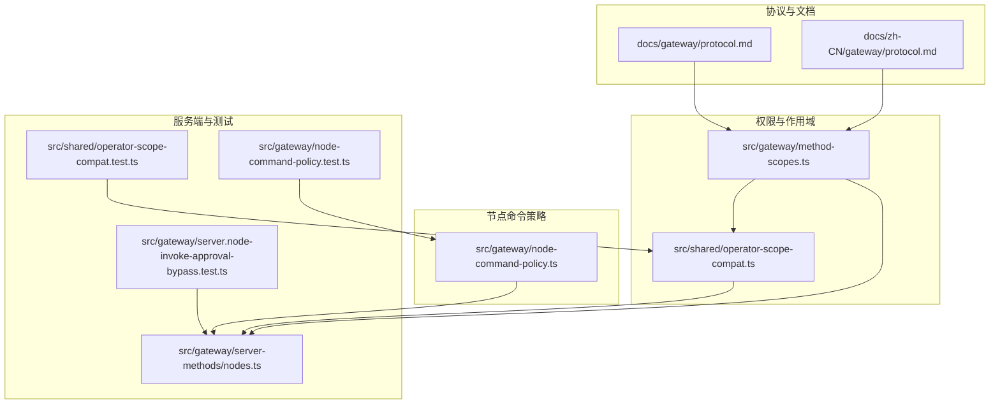
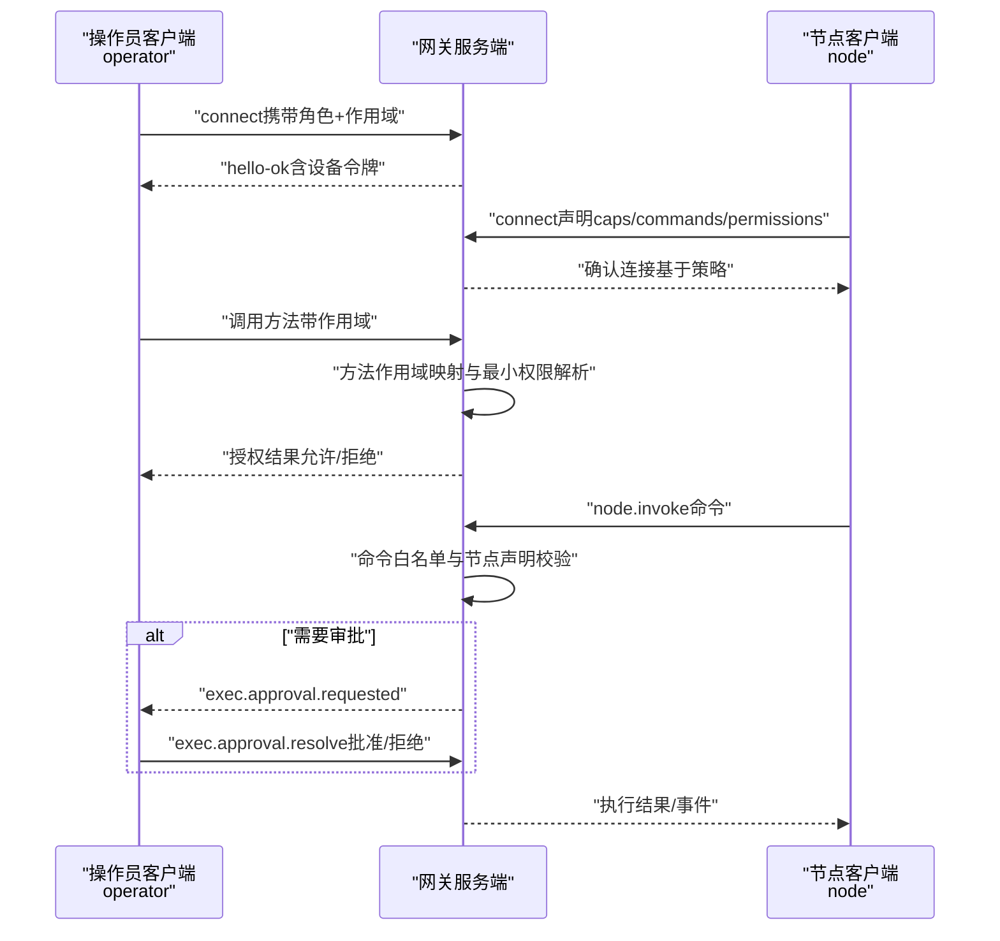
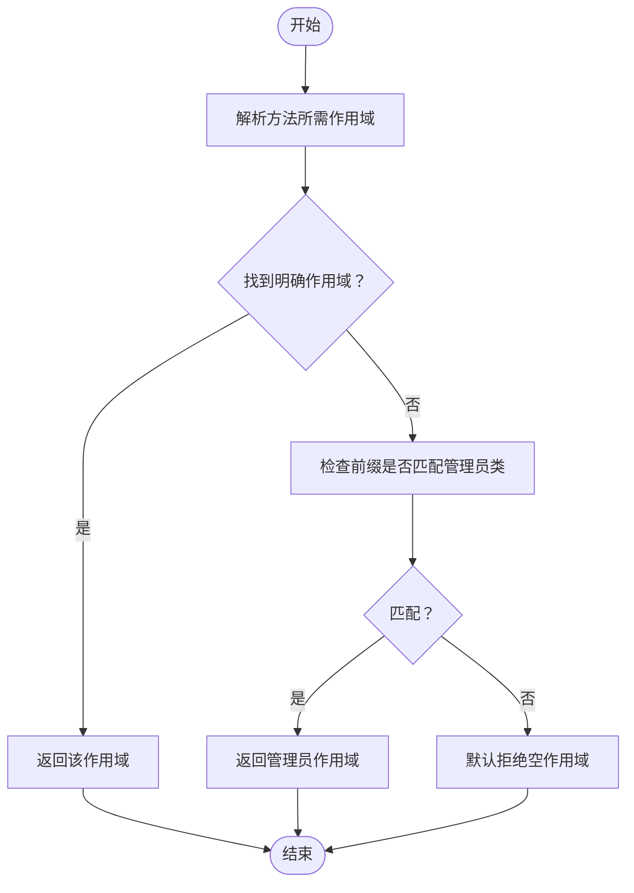
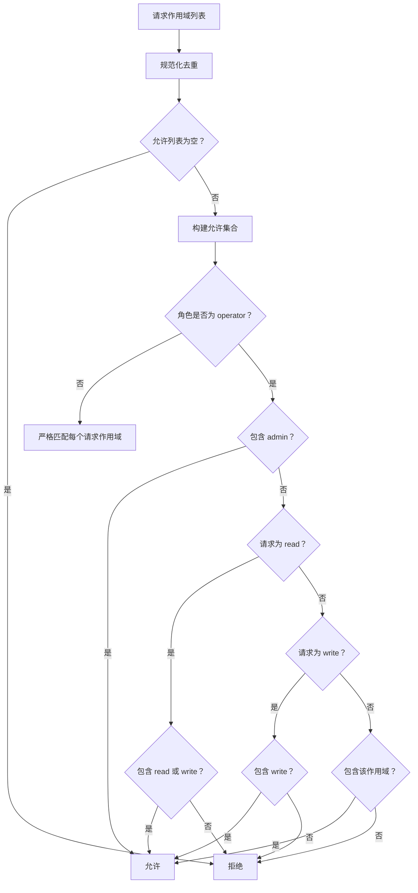
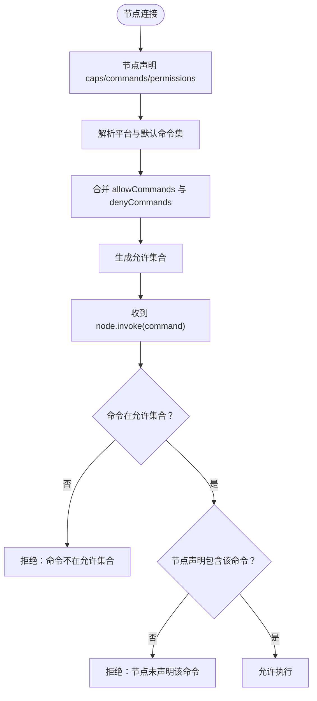
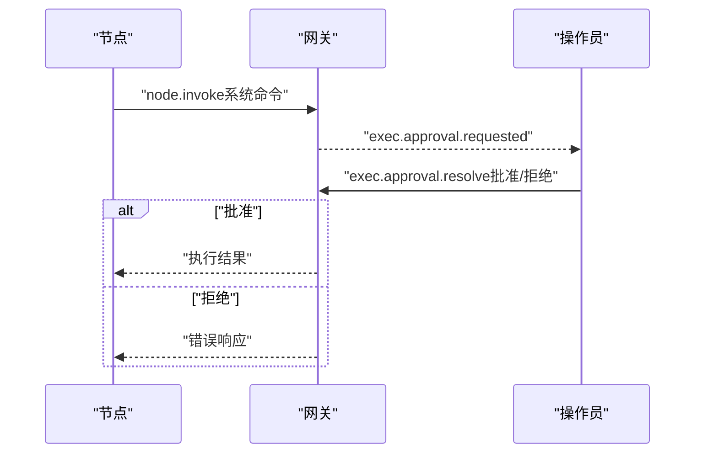
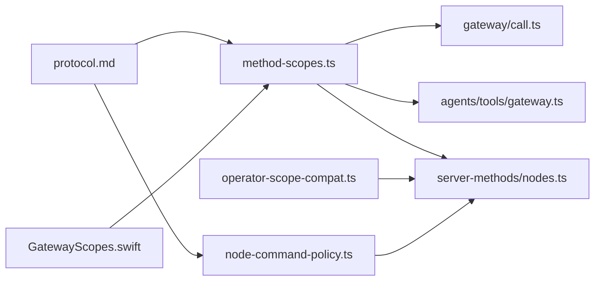

# 角色和权限

<cite>
**本文引用的文件**
- [docs/gateway/protocol.md](file://docs/gateway/protocol.md)
- [docs/zh-CN/gateway/protocol.md](file://docs/zh-CN/gateway/protocol.md)
- [src/gateway/method-scopes.ts](file://src/gateway/method-scopes.ts)
- [src/shared/operator-scope-compat.ts](file://src/shared/operator-scope-compat.ts)
- [src/gateway/node-command-policy.ts](file://src/gateway/node-command-policy.ts)
- [apps/macos/Sources/OpenClawMacCLI/GatewayScopes.swift](file://apps/macos/Sources/OpenClawMacCLI/GatewayScopes.swift)
- [src/gateway/server-methods/nodes.ts](file://src/gateway/server-methods/nodes.ts)
- [src/gateway/server.node-invoke-approval-bypass.test.ts](file://src/gateway/server.node-invoke-approval-bypass.test.ts)
- [src/shared/operator-scope-compat.test.ts](file://src/shared/operator-scope-compat.test.ts)
- [src/gateway/node-command-policy.test.ts](file://src/gateway/node-command-policy.test.ts)
- [src/gateway/call.ts](file://src/gateway/call.ts)
- [src/agents/tools/gateway.ts](file://src/agents/tools/gateway.ts)
</cite>

## 目录
1. [简介](#简介)
2. [项目结构](#项目结构)
3. [核心组件](#核心组件)
4. [架构总览](#架构总览)
5. [详细组件分析](#详细组件分析)
6. [依赖分析](#依赖分析)
7. [性能考虑](#性能考虑)
8. [故障排查指南](#故障排查指南)
9. [结论](#结论)
10. [附录](#附录)

## 简介
本文件系统性阐述 OpenClaw WebSocket 协议中的“角色与权限”体系，聚焦两类核心角色：
- operator（操作员）：控制平面客户端（CLI/UI/自动化），具备读取、写入、管理员、审批、配对等细粒度权限。
- node（节点）：能力主机（摄像头/屏幕/画布/系统运行等），通过连接参数声明能力声明（caps）、命令白名单（commands）与细粒度权限（permissions）。

文档还解释了权限继承关系、作用域限制、命令白名单策略、以及角色切换与权限变更的实际应用场景与最佳实践。

## 项目结构
围绕角色与权限的关键代码分布在以下模块：
- 协议与文档：定义角色、作用域、能力声明与帧格式
- 方法作用域映射：将具体方法映射到 operator 的作用域
- 权限兼容判定：角色与作用域的满足关系与继承规则
- 节点命令策略：平台默认命令集、允许/禁止列表、节点声明校验
- 服务端方法与测试：节点调用、审批流程、最小权限解析

图表来源
- [docs/gateway/protocol.md](file://docs/gateway/protocol.md#L135-L257)
- [docs/zh-CN/gateway/protocol.md](file://docs/zh-CN/gateway/protocol.md#L139-L162)
- [src/gateway/method-scopes.ts](file://src/gateway/method-scopes.ts#L1-L213)
- [src/shared/operator-scope-compat.ts](file://src/shared/operator-scope-compat.ts#L1-L49)
- [src/gateway/node-command-policy.ts](file://src/gateway/node-command-policy.ts#L1-L212)
- [src/gateway/server-methods/nodes.ts](file://src/gateway/server-methods/nodes.ts#L611-L657)
- [src/gateway/server.node-invoke-approval-bypass.test.ts](file://src/gateway/server.node-invoke-approval-bypass.test.ts#L72-L122)
- [src/shared/operator-scope-compat.test.ts](file://src/shared/operator-scope-compat.test.ts#L1-L90)
- [src/gateway/node-command-policy.test.ts](file://src/gateway/node-command-policy.test.ts)

章节来源
- [docs/gateway/protocol.md](file://docs/gateway/protocol.md#L135-L257)
- [docs/zh-CN/gateway/protocol.md](file://docs/zh-CN/gateway/protocol.md#L139-L162)

## 核心组件
- 角色与作用域定义
  - operator：控制平面客户端，支持 operator.read、operator.write、operator.admin、operator.approvals、operator.pairing 五类作用域。
  - node：能力主机，通过 caps（能力类别）、commands（命令白名单）、permissions（细粒度权限）声明自身能力。
- 方法作用域映射
  - 将具体方法归类到 operator 的作用域，如读取类、写入类、管理员类、审批类、配对类。
  - 提供最小权限解析函数，用于按方法推导所需最小作用域。
- 权限兼容判定
  - operator.admin 可满足所有以 operator. 开头的作用域。
  - operator.read 可被 operator.write 或 operator.admin 满足；operator.write 可被 operator.admin 满足。
  - 非 operator 角色需严格匹配请求的作用域。
- 节点命令策略
  - 平台默认命令集（iOS/Android/macOS/Linux/Windows/unknown）。
  - 允许列表与禁止列表合并，最终形成可执行命令集合。
  - 节点必须声明其 commands，且实际执行命令需同时满足允许列表与节点声明。

章节来源
- [src/gateway/method-scopes.ts](file://src/gateway/method-scopes.ts#L1-L213)
- [src/shared/operator-scope-compat.ts](file://src/shared/operator-scope-compat.ts#L1-L49)
- [src/gateway/node-command-policy.ts](file://src/gateway/node-command-policy.ts#L1-L212)
- [docs/gateway/protocol.md](file://docs/gateway/protocol.md#L135-L160)
- [docs/zh-CN/gateway/protocol.md](file://docs/zh-CN/gateway/protocol.md#L139-L162)

## 架构总览
下图展示“角色与权限”在协议层与服务端处理层的交互关系。

图表来源
- [docs/gateway/protocol.md](file://docs/gateway/protocol.md#L135-L204)
- [src/gateway/method-scopes.ts](file://src/gateway/method-scopes.ts#L177-L185)
- [src/gateway/node-command-policy.ts](file://src/gateway/node-command-policy.ts#L191-L211)
- [src/gateway/server-methods/nodes.ts](file://src/gateway/server-methods/nodes.ts#L611-L657)

## 详细组件分析

### 组件A：方法作用域映射与最小权限
- 功能要点
  - 将方法名映射到 operator 的作用域组（读取/写入/管理员/审批/配对）。
  - 支持前缀匹配（如以特定前缀开头的方法统一归为管理员类）。
  - 提供最小权限解析函数，未分类方法默认拒绝。
- 关键接口
  - 解析方法所需作用域
  - 判断是否为审批/配对/读取/写入/管理员方法
  - 最小权限解析与授权判定

图表来源
- [src/gateway/method-scopes.ts](file://src/gateway/method-scopes.ts#L139-L148)
- [src/gateway/method-scopes.ts](file://src/gateway/method-scopes.ts#L177-L185)

章节来源
- [src/gateway/method-scopes.ts](file://src/gateway/method-scopes.ts#L1-L213)
- [src/gateway/call.ts](file://src/gateway/call.ts#L24-L732)
- [src/agents/tools/gateway.ts](file://src/agents/tools/gateway.ts#L1-L160)

### 组件B：operator 权限继承与兼容判定
- 权限继承关系
  - operator.admin 可满足所有 operator.* 作用域。
  - operator.read 可由 operator.read/operator.write/operator.admin 满足。
  - operator.write 可由 operator.write/operator.admin 满足。
  - 非 operator 角色需严格匹配请求的作用域。
- 实现与测试
  - 角色与作用域规范化处理。
  - 测试覆盖 operator.read/operator.write/operator.approvals/operator.pairing 的继承关系与非 operator 角色的严格匹配。

图表来源
- [src/shared/operator-scope-compat.ts](file://src/shared/operator-scope-compat.ts#L7-L29)
- [src/shared/operator-scope-compat.test.ts](file://src/shared/operator-scope-compat.test.ts#L4-L89)

章节来源
- [src/shared/operator-scope-compat.ts](file://src/shared/operator-scope-compat.ts#L1-L49)
- [src/shared/operator-scope-compat.test.ts](file://src/shared/operator-scope-compat.test.ts#L1-L90)

### 组件C：节点命令白名单与权限声明
- 能力声明
  - caps：高级能力类别（如 camera、canvas、screen、location、voice）。
  - commands：命令白名单（仅允许列表内的命令）。
  - permissions：细粒度权限开关（如 screen.record、camera.capture）。
- 命令策略
  - 平台默认命令集（iOS/Android/macOS/Linux/Windows/unknown）。
  - 合并用户配置的 allowCommands 与 denyCommands，得到最终允许集合。
  - 执行前校验：命令必须在允许集合中，且节点必须在其声明的 commands 中。
- 安全审计
  - 对 denyCommands 的模式与未知精确命令进行审计提示与建议。

图表来源
- [docs/gateway/protocol.md](file://docs/gateway/protocol.md#L152-L160)
- [src/gateway/node-command-policy.ts](file://src/gateway/node-command-policy.ts#L173-L211)

章节来源
- [src/gateway/node-command-policy.ts](file://src/gateway/node-command-policy.ts#L1-L212)
- [src/gateway/node-command-policy.test.ts](file://src/gateway/node-command-policy.test.ts)

### 组件D：审批与配对流程
- 审批流程
  - 当执行系统级命令需要审批时，网关广播 exec.approval.requested。
  - 操作员客户端使用 operator.approvals 作用域调用 exec.approval.resolve 进行批准或拒绝。
- 配对流程
  - 新设备首次连接需配对，支持 node.pair 与 device.pair 相关方法。
  - 设备令牌可通过 device.token.rotate 与 device.token.revoke 进行轮换与撤销（需 operator.pairing）。

图表来源
- [docs/gateway/protocol.md](file://docs/gateway/protocol.md#L181-L185)
- [src/gateway/server.node-invoke-approval-bypass.test.ts](file://src/gateway/server.node-invoke-approval-bypass.test.ts#L72-L122)

章节来源
- [docs/gateway/protocol.md](file://docs/gateway/protocol.md#L181-L204)
- [src/gateway/server.node-invoke-approval-bypass.test.ts](file://src/gateway/server.node-invoke-approval-bypass.test.ts#L72-L122)

## 依赖分析
- 组件耦合
  - 方法作用域映射与最小权限解析被服务端调用与工具侧使用共享。
  - 权限兼容判定独立于方法映射，但共同决定授权结果。
  - 节点命令策略依赖配置与平台元数据，最终影响命令执行。
- 外部依赖
  - CLI 默认作用域集合与 Swift 端默认作用域保持一致，确保跨端一致性。

图表来源
- [src/gateway/method-scopes.ts](file://src/gateway/method-scopes.ts#L1-L213)
- [src/shared/operator-scope-compat.ts](file://src/shared/operator-scope-compat.ts#L1-L49)
- [src/gateway/node-command-policy.ts](file://src/gateway/node-command-policy.ts#L1-L212)
- [src/gateway/call.ts](file://src/gateway/call.ts#L24-L732)
- [src/agents/tools/gateway.ts](file://src/agents/tools/gateway.ts#L1-L160)
- [src/gateway/server-methods/nodes.ts](file://src/gateway/server-methods/nodes.ts#L611-L657)
- [apps/macos/Sources/OpenClawMacCLI/GatewayScopes.swift](file://apps/macos/Sources/OpenClawMacCLI/GatewayScopes.swift#L1-L7)
- [docs/gateway/protocol.md](file://docs/gateway/protocol.md#L135-L257)

章节来源
- [src/gateway/method-scopes.ts](file://src/gateway/method-scopes.ts#L1-L213)
- [src/shared/operator-scope-compat.ts](file://src/shared/operator-scope-compat.ts#L1-L49)
- [src/gateway/node-command-policy.ts](file://src/gateway/node-command-policy.ts#L1-L212)
- [apps/macos/Sources/OpenClawMacCLI/GatewayScopes.swift](file://apps/macos/Sources/OpenClawMacCLI/GatewayScopes.swift#L1-L7)

## 性能考虑
- 授权判定路径短、开销低：作用域映射与权限兼容判定均为常数时间复杂度，适合高频调用场景。
- 命令策略计算在连接阶段与配置变更时发生，运行期仅做集合查询，避免重复计算。
- 建议
  - 将允许/禁止列表尽量收敛，减少集合规模。
  - 使用平台默认值作为基线，仅添加必要扩展，降低策略复杂度。

## 故障排查指南
- 常见问题定位
  - 方法未分类导致默认拒绝：检查方法是否在作用域映射中，或是否属于管理员前缀。
  - 节点命令未生效：确认命令在允许集合中，且节点声明了该命令。
  - 审批未触发或无法解决：确认调用 exec.approval.requested 与 exec.approval.resolve 的作用域正确。
- 诊断建议
  - 查看最小权限解析结果，确认所需作用域是否满足。
  - 检查节点命令策略的允许/禁止列表合并逻辑，关注大小写与空白字符。
  - 对 denyCommands 进行安全审计，识别模式与未知命令并修正。

章节来源
- [src/gateway/method-scopes.ts](file://src/gateway/method-scopes.ts#L177-L185)
- [src/gateway/node-command-policy.ts](file://src/gateway/node-command-policy.ts#L191-L211)
- [src/gateway/server.node-invoke-approval-bypass.test.ts](file://src/gateway/server.node-invoke-approval-bypass.test.ts#L72-L122)

## 结论
OpenClaw 的角色与权限体系以“方法作用域映射 + 权限兼容判定 + 节点命令策略”为核心，实现了控制面与能力面的清晰分离。operator 的多级作用域与继承关系提供了灵活的最小权限授权模型；node 的能力声明与命令白名单机制确保了可审计、可治理的执行边界。配合审批与配对流程，系统在保证安全性的同时兼顾易用性与可运维性。

## 附录
- 角色与作用域速览
  - operator：operator.read、operator.write、operator.admin、operator.approvals、operator.pairing
  - node：caps、commands、permissions
- CLI 默认作用域（Swift 端一致）
  - operator.admin、operator.read、operator.write、operator.approvals、operator.pairing

章节来源
- [docs/gateway/protocol.md](file://docs/gateway/protocol.md#L142-L150)
- [docs/zh-CN/gateway/protocol.md](file://docs/zh-CN/gateway/protocol.md#L146-L154)
- [apps/macos/Sources/OpenClawMacCLI/GatewayScopes.swift](file://apps/macos/Sources/OpenClawMacCLI/GatewayScopes.swift#L1-L7)