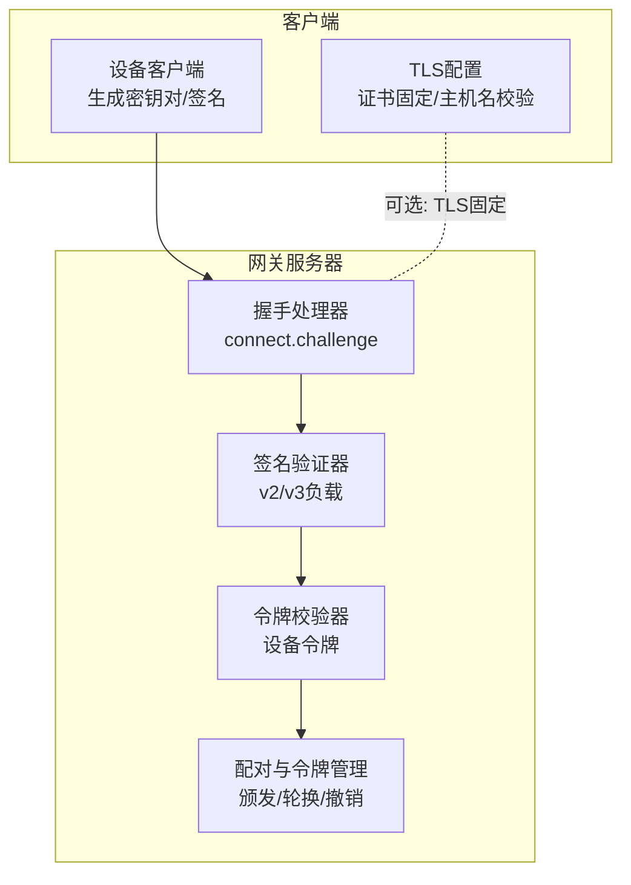
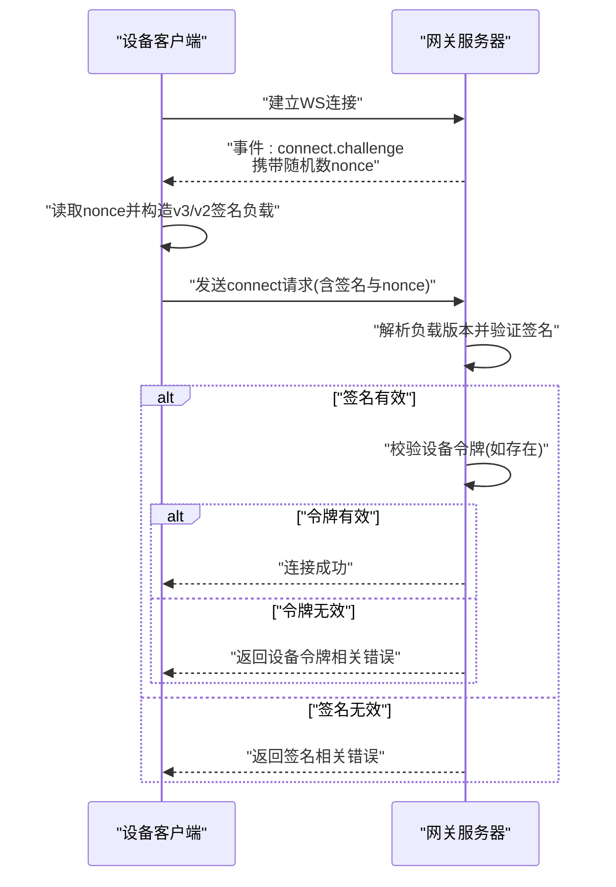
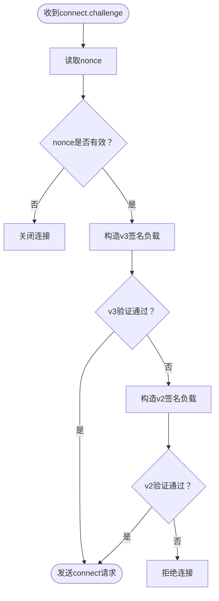
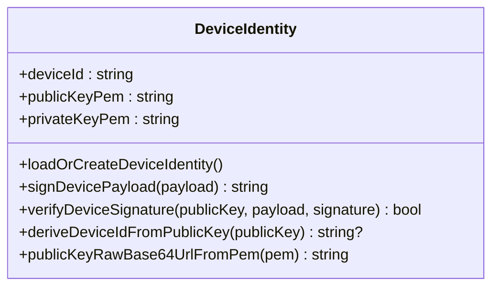
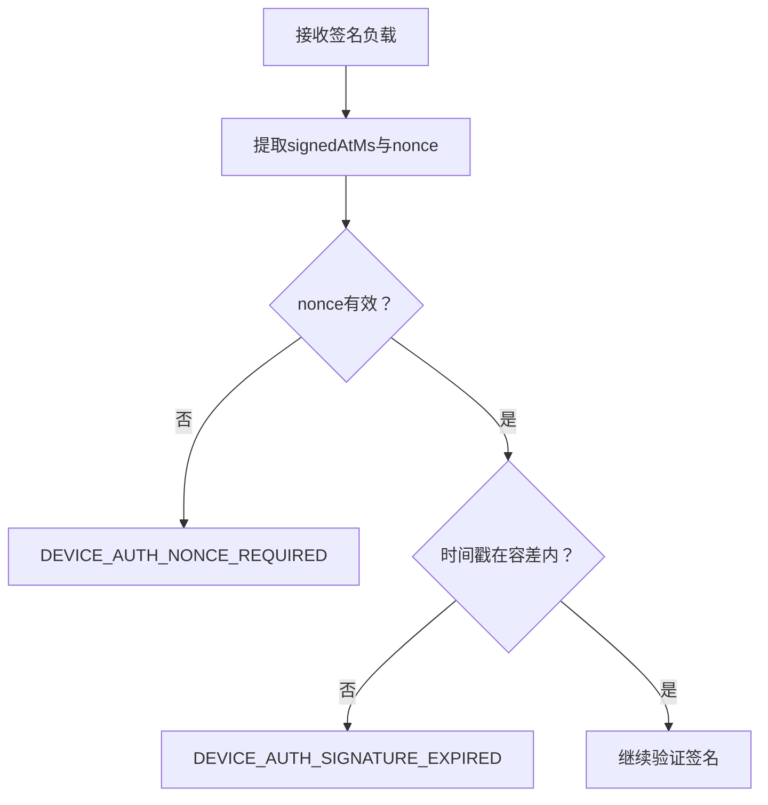
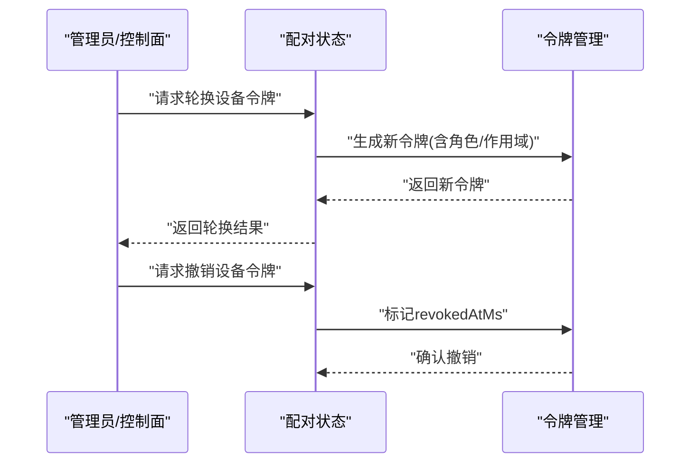
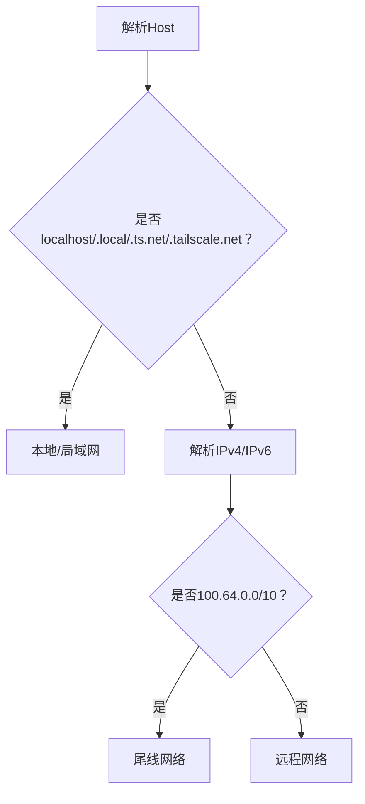
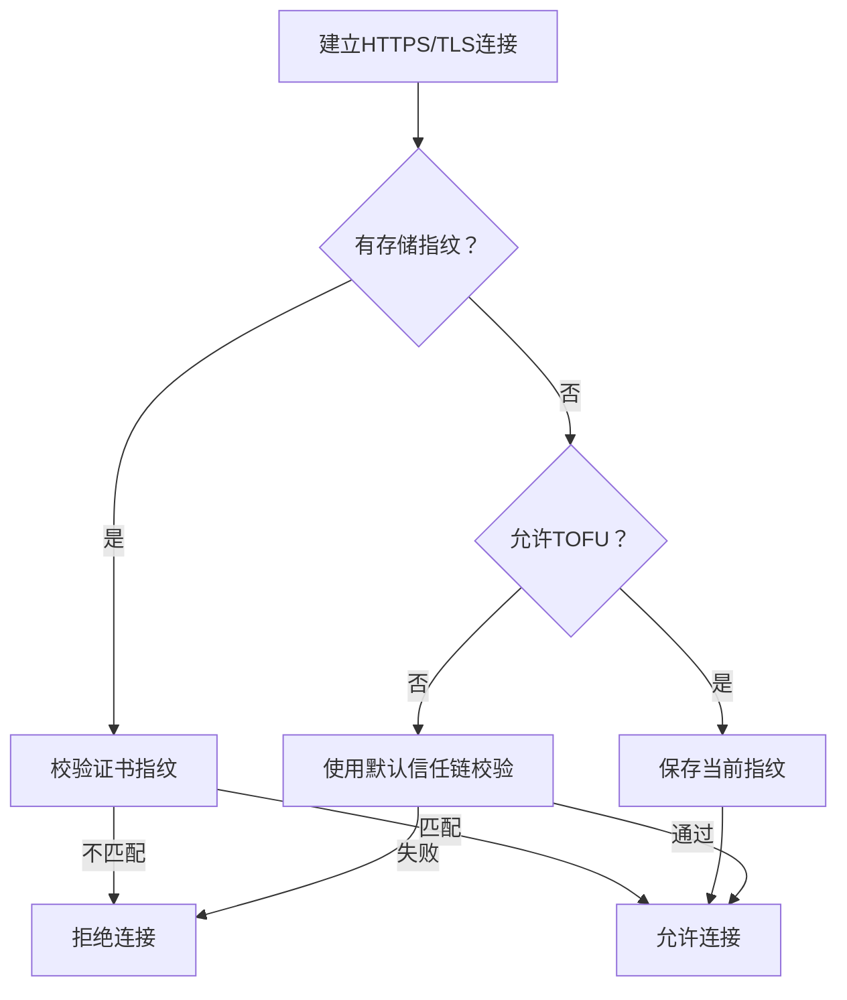
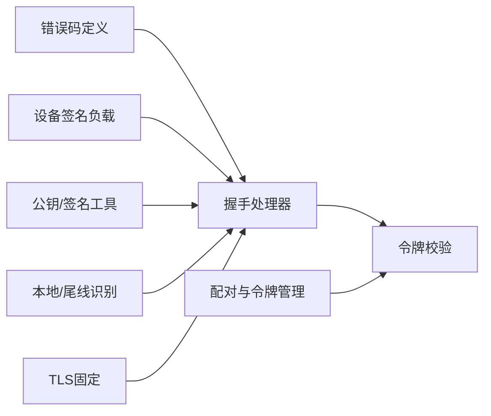

# 设备身份认证

<cite>
**本文引用的文件**
- [connect-error-details.ts](file://src/gateway/protocol/connect-error-details.ts)
- [device-identity.ts](file://src/infra/device-identity.ts)
- [device-auth.ts](file://src/gateway/device-auth.ts)
- [message-handler.ts](file://src/gateway/server/ws-connection/message-handler.ts)
- [auth-context.ts](file://src/gateway/server/ws-connection/auth-context.ts)
- [device-pairing.ts](file://src/infra/device-pairing.ts)
- [devices.ts](file://src/gateway/server-methods/devices.ts)
- [devices.ts（协议模式）](file://src/gateway/protocol/schema/devices.ts)
- [tailnet.ts](file://src/infra/tailnet.ts)
- [LoopbackHost.swift](file://apps/shared/OpenClawKit/Sources/OpenClawKit/LoopbackHost.swift)
- [GatewayTls.kt](file://apps/android/app/src/main/java/ai/openclaw/android/gateway/GatewayTls.kt)
- [protocol.md](file://docs/gateway/protocol.md)
- [client.ts](file://src/gateway/client.ts)
- [test-helpers.server.ts](file://src/gateway/test-helpers.server.ts)
- [test-helpers.e2e.ts](file://src/gateway/test-helpers.e2e.ts)
- [connect-policy.ts](file://src/gateway/server/ws-connection/connect-policy.ts)
</cite>

## 目录
1. [简介](#简介)
2. [项目结构](#项目结构)
3. [核心组件](#核心组件)
4. [架构总览](#架构总览)
5. [详细组件分析](#详细组件分析)
6. [依赖关系分析](#依赖关系分析)
7. [性能考量](#性能考量)
8. [故障排查指南](#故障排查指南)
9. [结论](#结论)
10. [附录](#附录)

## 简介
本文件面向OpenClaw WebSocket设备身份认证系统，围绕“设备签名挑战机制”展开，系统性说明以下内容：
- connect.challenge事件中的随机数nonce与时间戳校验流程
- 设备公钥指纹生成、签名算法与签名验证
- 时间戳偏移容差与过期判定
- 设备令牌的颁发、轮换与撤销
- 本地连接的自动放行策略与尾线网络地址识别
- 设备身份迁移诊断代码表及常见错误定位
- TLS证书固定与安全连接配置

## 项目结构
OpenClaw在多个层实现了设备身份认证能力：
- 协议与错误码定义：位于网关协议层，统一错误码与原因映射
- 身份与签名：设备端与服务端共享的Ed25519密钥对生成、公钥指纹、签名与验证
- 连接握手：WebSocket握手阶段的connect.challenge与签名挑战流程
- 令牌管理：配对设备的令牌颁发、轮换与撤销
- 网络与安全：尾线网络识别、本地回环识别与TLS证书固定

**图表来源**
- [client.ts](file://src/gateway/client.ts#L357-L392)
- [message-handler.ts](file://src/gateway/server/ws-connection/message-handler.ts#L165-L207)
- [auth-context.ts](file://src/gateway/server/ws-connection/auth-context.ts#L180-L218)
- [device-pairing.ts](file://src/infra/device-pairing.ts#L572-L612)
- [GatewayTls.kt](file://apps/android/app/src/main/java/ai/openclaw/android/gateway/GatewayTls.kt#L35-L102)

**章节来源**
- [client.ts](file://src/gateway/client.ts#L357-L392)
- [message-handler.ts](file://src/gateway/server/ws-connection/message-handler.ts#L165-L207)
- [auth-context.ts](file://src/gateway/server/ws-connection/auth-context.ts#L180-L218)
- [device-pairing.ts](file://src/infra/device-pairing.ts#L572-L612)
- [GatewayTls.kt](file://apps/android/app/src/main/java/ai/openclaw/android/gateway/GatewayTls.kt#L35-L102)

## 核心组件
- 设备签名挑战与负载构建
  - 客户端在收到connect.challenge后，提取nonce并构造v3或v2签名负载，使用设备私钥签名后连同nonce一并发送
  - 服务端优先尝试v3负载验证，失败则回退到v2负载；若均不匹配则拒绝
- 公钥指纹与签名验证
  - 设备公钥指纹通过SHA256(raw_public_key)生成；签名支持PEM与SPKI DER两种输入格式
  - 验证时兼容Base64与Base64Url编码的签名
- 时间戳与nonce校验
  - 服务端要求nonce必须存在且非空；签名包含signedAtMs，用于过期判定
- 令牌颁发/轮换/撤销
  - 通过配对状态管理设备令牌，支持按角色颁发、轮换与撤销
- 本地与尾线网络识别
  - 本地回环与特定域名后缀识别；尾线网络IPv4/IPv6范围识别
- TLS证书固定
  - 客户端可配置期望指纹，或在无存储指纹时选择信任首遇（TOFU），并忽略主机名差异以适配服务发现场景

**章节来源**
- [device-auth.ts](file://src/gateway/device-auth.ts#L20-L54)
- [device-identity.ts](file://src/infra/device-identity.ts#L52-L182)
- [message-handler.ts](file://src/gateway/server/ws-connection/message-handler.ts#L165-L207)
- [device-pairing.ts](file://src/infra/device-pairing.ts#L572-L612)
- [LoopbackHost.swift](file://apps/shared/OpenClawKit/Sources/OpenClawKit/LoopbackHost.swift#L43-L80)
- [tailnet.ts](file://src/infra/tailnet.ts#L1-L59)
- [GatewayTls.kt](file://apps/android/app/src/main/java/ai/openclaw/android/gateway/GatewayTls.kt#L35-L102)

## 架构总览
下图展示从WebSocket连接建立到设备身份认证完成的关键交互：

**图表来源**
- [client.ts](file://src/gateway/client.ts#L357-L392)
- [message-handler.ts](file://src/gateway/server/ws-connection/message-handler.ts#L165-L207)
- [auth-context.ts](file://src/gateway/server/ws-connection/auth-context.ts#L180-L218)

## 详细组件分析

### 组件A：签名挑战与负载版本解析
- connect.challenge处理
  - 客户端在收到事件后，若nonce缺失则立即断开连接
  - 提取nonce后构造签名负载并发送connect请求
- 负载版本解析
  - 服务端优先尝试v3负载验证，再回退到v2；若均失败则拒绝
  - v3负载额外绑定平台与设备家族信息，增强元数据绑定
- 签名验证
  - 支持PEM与SPKI DER格式公钥输入；签名支持Base64与Base64Url
  - 验证失败返回DEVICE_AUTH_SIGNATURE_INVALID

**图表来源**
- [client.ts](file://src/gateway/client.ts#L357-L392)
- [message-handler.ts](file://src/gateway/server/ws-connection/message-handler.ts#L165-L207)
- [device-auth.ts](file://src/gateway/device-auth.ts#L20-L54)
- [device-identity.ts](file://src/infra/device-identity.ts#L158-L182)

**章节来源**
- [client.ts](file://src/gateway/client.ts#L357-L392)
- [message-handler.ts](file://src/gateway/server/ws-connection/message-handler.ts#L165-L207)
- [device-auth.ts](file://src/gateway/device-auth.ts#L20-L54)
- [device-identity.ts](file://src/infra/device-identity.ts#L158-L182)

### 组件B：公钥指纹与签名算法
- 公钥指纹
  - 使用SHA256对原始公钥字节进行哈希，作为设备ID
- 签名与验证
  - 使用Ed25519对UTF-8负载进行签名与验证
  - 支持PEM与SPKI DER两种公钥输入；签名可为Base64或Base64Url
- 公钥规范化
  - 将PEM导出的SPKI DER前缀剥离，或直接将Base64Url解码为原始公钥

**图表来源**
- [device-identity.ts](file://src/infra/device-identity.ts#L6-L182)

**章节来源**
- [device-identity.ts](file://src/infra/device-identity.ts#L52-L182)

### 组件C：时间戳与nonce校验
- nonce要求
  - 服务端严格要求nonce存在且非空；否则返回DEVICE_AUTH_NONCE_REQUIRED
- 时间戳校验
  - 签名负载包含signedAtMs；服务端据此判断是否过期（偏移容差）
  - 若时间戳超出允许范围，返回DEVICE_AUTH_SIGNATURE_EXPIRED

**图表来源**
- [message-handler.ts](file://src/gateway/server/ws-connection/message-handler.ts#L165-L207)
- [protocol.md](file://docs/gateway/protocol.md#L225-L244)

**章节来源**
- [protocol.md](file://docs/gateway/protocol.md#L225-L244)

### 组件D：设备令牌的颁发、轮换与撤销
- 颁发与更新
  - 按设备ID与角色颁发新令牌；若现有令牌未撤销且权限满足，则复用
- 轮换
  - 基于配对上下文与审批范围计算新令牌；记录轮换时间
- 撤销
  - 设置revokedAtMs标记，后续校验失败

**图表来源**
- [device-pairing.ts](file://src/infra/device-pairing.ts#L572-L612)
- [devices.ts](file://src/gateway/server-methods/devices.ts#L157-L204)
- [devices.ts（协议模式）](file://src/gateway/protocol/schema/devices.ts#L21-L36)

**章节来源**
- [device-pairing.ts](file://src/infra/device-pairing.ts#L572-L612)
- [devices.ts](file://src/gateway/server-methods/devices.ts#L157-L204)
- [devices.ts（协议模式）](file://src/gateway/protocol/schema/devices.ts#L21-L36)

### 组件E：本地连接自动放行与尾线网络识别
- 本地回环与局域网识别
  - 通过主机名后缀（.local、.ts.net、.tailscale.net）、纯主机名、IPv4/IPv6本地网段判断
- 尾线网络地址识别
  - IPv4: 100.64.0.0/10；IPv6: fd7a:115c:a1e0::/48
- 自动放行
  - 在满足条件时，允许无需设备身份即可连接（结合控制界面策略）

**图表来源**
- [LoopbackHost.swift](file://apps/shared/OpenClawKit/Sources/OpenClawKit/LoopbackHost.swift#L43-L80)
- [tailnet.ts](file://src/infra/tailnet.ts#L1-L59)

**章节来源**
- [LoopbackHost.swift](file://apps/shared/OpenClawKit/Sources/OpenClawKit/LoopbackHost.swift#L43-L80)
- [tailnet.ts](file://src/infra/tailnet.ts#L1-L59)

### 组件F：TLS证书固定与安全连接配置
- 期望指纹优先
  - 若已存储指纹，强制校验；不接受广告指纹
- TOFU策略
  - 无存储指纹时可启用信任首遇，保存当前证书指纹
- 主机名处理
  - 固定模式下忽略主机名不匹配（服务发现常返回IP）
- Android实现要点
  - 自定义X509TrustManager，按策略执行校验与保存

**图表来源**
- [GatewayTls.kt](file://apps/android/app/src/main/java/ai/openclaw/android/gateway/GatewayTls.kt#L35-L102)

**章节来源**
- [GatewayTls.kt](file://apps/android/app/src/main/java/ai/openclaw/android/gateway/GatewayTls.kt#L35-L102)

## 依赖关系分析
- 协议与错误码
  - 错误码集中定义，便于跨语言客户端与服务端一致处理
- 身份与签名
  - 设备端与服务端共享同一套Ed25519签名与公钥规范化逻辑
- 握手与令牌
  - 握手阶段先验证签名，再校验设备令牌；二者分别由不同模块负责
- 网络与安全
  - 本地/尾线网络识别与TLS固定策略相互独立但共同提升安全性

**图表来源**
- [connect-error-details.ts](file://src/gateway/protocol/connect-error-details.ts#L1-L94)
- [message-handler.ts](file://src/gateway/server/ws-connection/message-handler.ts#L165-L207)
- [auth-context.ts](file://src/gateway/server/ws-connection/auth-context.ts#L180-L218)
- [device-pairing.ts](file://src/infra/device-pairing.ts#L572-L612)
- [LoopbackHost.swift](file://apps/shared/OpenClawKit/Sources/OpenClawKit/LoopbackHost.swift#L43-L80)
- [GatewayTls.kt](file://apps/android/app/src/main/java/ai/openclaw/android/gateway/GatewayTls.kt#L35-L102)

**章节来源**
- [connect-error-details.ts](file://src/gateway/protocol/connect-error-details.ts#L1-L94)
- [message-handler.ts](file://src/gateway/server/ws-connection/message-handler.ts#L165-L207)
- [auth-context.ts](file://src/gateway/server/ws-connection/auth-context.ts#L180-L218)
- [device-pairing.ts](file://src/infra/device-pairing.ts#L572-L612)
- [LoopbackHost.swift](file://apps/shared/OpenClawKit/Sources/OpenClawKit/LoopbackHost.swift#L43-L80)
- [GatewayTls.kt](file://apps/android/app/src/main/java/ai/openclaw/android/gateway/GatewayTls.kt#L35-L102)

## 性能考量
- 签名验证成本低（Ed25519），在高并发场景下建议缓存公钥与指纹
- 令牌校验采用原子写入与锁，避免竞态；批量轮换/撤销时注意I/O开销
- TLS固定仅在握手阶段生效，运行期不引入额外CPU消耗
- 本地/尾线网络识别为纯内存计算，开销极小

## 故障排查指南
- 常见错误码与含义
  - DEVICE_AUTH_NONCE_REQUIRED：缺少nonce或为空
  - DEVICE_AUTH_NONCE_MISMATCH：nonce不匹配（可能过期或被篡改）
  - DEVICE_AUTH_SIGNATURE_INVALID：签名负载与实际不一致
  - DEVICE_AUTH_SIGNATURE_EXPIRED：签名时间戳超出允许偏移
  - DEVICE_AUTH_DEVICE_ID_MISMATCH：设备ID与公钥指纹不一致
  - DEVICE_AUTH_PUBLIC_KEY_INVALID：公钥格式/规范化失败
- 定位步骤
  - 检查connect.challenge是否正确下发与接收
  - 确认客户端是否使用相同nonce与签名负载版本
  - 核对signedAtMs是否在服务端允许的时间窗口内
  - 验证设备公钥与设备ID指纹一致性
  - 若使用TLS固定，确认存储指纹与实际证书一致

**章节来源**
- [protocol.md](file://docs/gateway/protocol.md#L225-L244)
- [connect-error-details.ts](file://src/gateway/protocol/connect-error-details.ts#L66-L85)

## 结论
OpenClaw的设备身份认证体系以Ed25519签名为核心，结合connect.challenge的nonce与时间戳校验，确保设备身份可信与抗重放。配合设备令牌的生命周期管理、本地/尾线网络识别与TLS证书固定，形成从接入到会话的全链路安全方案。通过标准化的错误码与跨语言实现，保证了多端一致性与可维护性。

## 附录

### A. 设备身份迁移诊断代码表
- DEVICE_AUTH_NONCE_REQUIRED：客户端未提供有效nonce
- DEVICE_AUTH_NONCE_MISMATCH：客户端使用的nonce与服务端challenge不一致
- DEVICE_AUTH_SIGNATURE_INVALID：签名负载与v2/v3任一不匹配
- DEVICE_AUTH_SIGNATURE_EXPIRED：签名时间戳超出允许偏移
- DEVICE_AUTH_DEVICE_ID_MISMATCH：设备ID与公钥指纹不一致
- DEVICE_AUTH_PUBLIC_KEY_INVALID：公钥格式或规范化失败

**章节来源**
- [protocol.md](file://docs/gateway/protocol.md#L225-L244)
- [connect-error-details.ts](file://src/gateway/protocol/connect-error-details.ts#L66-L85)

### B. 代码路径参考
- connect.challenge处理与nonce跟踪
  - [client.ts](file://src/gateway/client.ts#L357-L392)
  - [test-helpers.server.ts](file://src/gateway/test-helpers.server.ts#L262-L282)
  - [test-helpers.e2e.ts](file://src/gateway/test-helpers.e2e.ts#L107-L144)
- 签名负载与版本解析
  - [device-auth.ts](file://src/gateway/device-auth.ts#L20-L54)
  - [message-handler.ts](file://src/gateway/server/ws-connection/message-handler.ts#L165-L207)
- 公钥指纹与签名验证
  - [device-identity.ts](file://src/infra/device-identity.ts#L52-L182)
- 令牌颁发/轮换/撤销
  - [device-pairing.ts](file://src/infra/device-pairing.ts#L572-L612)
  - [devices.ts](file://src/gateway/server-methods/devices.ts#L157-L204)
- 本地与尾线网络识别
  - [LoopbackHost.swift](file://apps/shared/OpenClawKit/Sources/OpenClawKit/LoopbackHost.swift#L43-L80)
  - [tailnet.ts](file://src/infra/tailnet.ts#L1-L59)
- TLS证书固定
  - [GatewayTls.kt](file://apps/android/app/src/main/java/ai/openclaw/android/gateway/GatewayTls.kt#L35-L102)