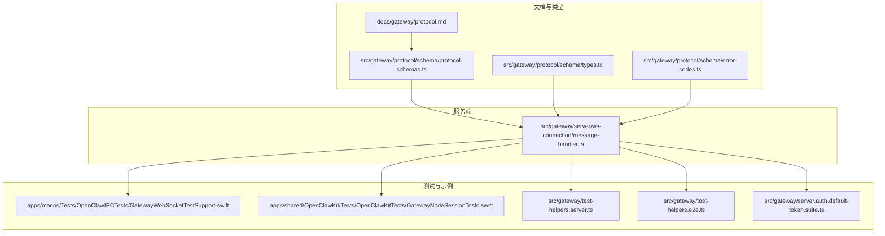
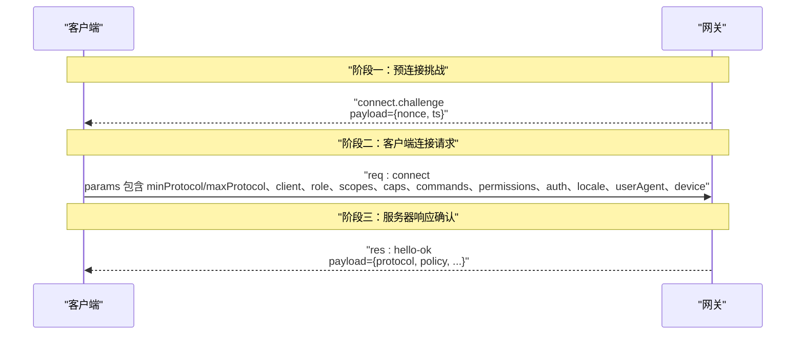
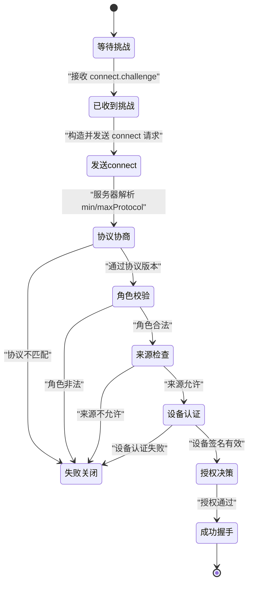
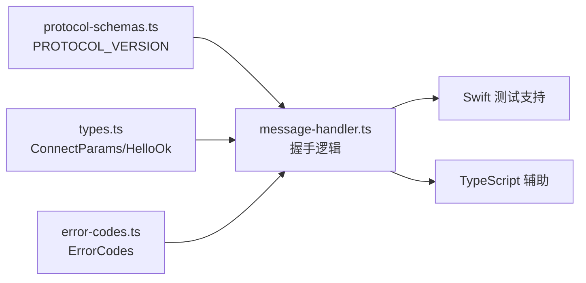

# 连接握手协议

<cite>
**本文引用的文件**
- [docs/gateway/protocol.md](file://docs/gateway/protocol.md)
- [src/gateway/protocol/schema/protocol-schemas.ts](file://src/gateway/protocol/schema/protocol-schemas.ts)
- [src/gateway/protocol/schema/types.ts](file://src/gateway/protocol/schema/types.ts)
- [src/gateway/protocol/schema/error-codes.ts](file://src/gateway/protocol/schema/error-codes.ts)
- [src/gateway/server/ws-connection/message-handler.ts](file://src/gateway/server/ws-connection/message-handler.ts)
- [apps/macos/Tests/OpenClawIPCTests/GatewayWebSocketTestSupport.swift](file://apps/macos/Tests/OpenClawIPCTests/GatewayWebSocketTestSupport.swift)
- [apps/shared/OpenClawKit/Tests/OpenClawKitTests/GatewayNodeSessionTests.swift](file://apps/shared/OpenClawKit/Tests/OpenClawKitTests/GatewayNodeSessionTests.swift)
- [src/gateway/test-helpers.server.ts](file://src/gateway/test-helpers.server.ts)
- [src/gateway/test-helpers.e2e.ts](file://src/gateway/test-helpers.e2e.ts)
- [src/gateway/server.auth.default-token.suite.ts](file://src/gateway/server.auth.default-token.suite.ts)
</cite>

## 目录
1. [简介](#简介)
2. [项目结构](#项目结构)
3. [核心组件](#核心组件)
4. [架构总览](#架构总览)
5. [详细组件分析](#详细组件分析)
6. [依赖关系分析](#依赖关系分析)
7. [性能考量](#性能考量)
8. [故障排查指南](#故障排查指南)
9. [结论](#结论)
10. [附录](#附录)

## 简介
本文件系统性阐述 OpenClaw 的 WebSocket 连接握手协议，覆盖三阶段握手流程：预连接挑战、客户端连接请求、服务器响应确认；并完整文档化 connect.challenge 事件与 connect 请求的参数结构、hello-ok 响应结构、错误处理机制与迁移细节。目标读者既包括实现与调试人员，也包括希望理解协议行为的非技术读者。

## 项目结构
围绕握手协议的关键文件分布于文档、协议模式、服务端消息处理器与测试辅助工具中：
- 协议规范与示例位于文档目录
- 类型与协议版本由协议模式定义
- 服务端握手逻辑在消息处理器中实现
- 测试与示例在 Swift 测试与 TypeScript 辅助工具中体现

图表来源
- [docs/gateway/protocol.md](file://docs/gateway/protocol.md#L10-L90)
- [src/gateway/protocol/schema/protocol-schemas.ts](file://src/gateway/protocol/schema/protocol-schemas.ts#L157-L292)
- [src/gateway/server/ws-connection/message-handler.ts](file://src/gateway/server/ws-connection/message-handler.ts#L400-L599)
- [apps/macos/Tests/OpenClawIPCTests/GatewayWebSocketTestSupport.swift](file://apps/macos/Tests/OpenClawIPCTests/GatewayWebSocketTestSupport.swift#L11-L53)
- [apps/shared/OpenClawKit/Tests/OpenClawKitTests/GatewayNodeSessionTests.swift](file://apps/shared/OpenClawKit/Tests/OpenClawKitTests/GatewayNodeSessionTests.swift#L95-L102)
- [src/gateway/test-helpers.server.ts](file://src/gateway/test-helpers.server.ts#L262-L282)
- [src/gateway/test-helpers.e2e.ts](file://src/gateway/test-helpers.e2e.ts#L107-L144)
- [src/gateway/server.auth.default-token.suite.ts](file://src/gateway/server.auth.default-token.suite.ts#L287-L367)

章节来源
- [docs/gateway/protocol.md](file://docs/gateway/protocol.md#L10-L90)
- [src/gateway/protocol/schema/protocol-schemas.ts](file://src/gateway/protocol/schema/protocol-schemas.ts#L157-L292)

## 核心组件
- 预连接挑战帧 connect.challenge：由网关发送，包含 nonce 与可选 ts 字段，客户端必须等待该帧后再发起 connect 请求。
- 连接请求 connect：客户端携带 minProtocol/maxProtocol、client 信息、role、scopes、caps、commands、permissions、auth、locale、userAgent、device 等参数。
- hello-ok 响应：服务器返回 res 帧，payload 中包含协议版本与策略配置，可能包含设备令牌与授权信息。

章节来源
- [docs/gateway/protocol.md](file://docs/gateway/protocol.md#L22-L90)
- [src/gateway/protocol/schema/protocol-schemas.ts](file://src/gateway/protocol/schema/protocol-schemas.ts#L291-L292)

## 架构总览
握手三阶段时序如下：

图表来源
- [docs/gateway/protocol.md](file://docs/gateway/protocol.md#L22-L90)
- [src/gateway/server/ws-connection/message-handler.ts](file://src/gateway/server/ws-connection/message-handler.ts#L462-L478)

## 详细组件分析

### 预连接挑战：connect.challenge
- 结构要点
  - type: "event"
  - event: "connect.challenge"
  - payload:
    - nonce: 字符串，必需且非空
    - ts: 数字时间戳（毫秒），可选
- 行为约束
  - 客户端必须严格等待该帧后才发送 connect 请求
  - 客户端需使用该 nonce 对设备身份进行签名，并在 connect.params.device.nonce 中回传
  - 网关会校验 nonce 是否匹配、是否过期、签名有效性等

章节来源
- [docs/gateway/protocol.md](file://docs/gateway/protocol.md#L24-L32)
- [src/gateway/test-helpers.server.ts](file://src/gateway/test-helpers.server.ts#L262-L282)
- [src/gateway/test-helpers.e2e.ts](file://src/gateway/test-helpers.e2e.ts#L107-L144)
- [apps/macos/Tests/OpenClawIPCTests/GatewayWebSocketTestSupport.swift](file://apps/macos/Tests/OpenClawIPCTests/GatewayWebSocketTestSupport.swift#L11-L21)
- [apps/shared/OpenClawKit/Tests/OpenClawKitTests/GatewayNodeSessionTests.swift](file://apps/shared/OpenClawKit/Tests/OpenClawKitTests/GatewayNodeSessionTests.swift#L95-L102)

### connect 请求参数详解
- 参数总览
  - minProtocol: 最小协议版本（数字）
  - maxProtocol: 最大协议版本（数字）
  - client: 客户端标识信息
    - id: 客户端标识（如控制 UI、移动端应用等）
    - version: 客户端版本
    - platform: 平台（如 macos、ios、android、web）
    - mode: 模式（如 operator、node）
    - displayName: 可选显示名
    - deviceFamily: 可选设备家族信息
  - role: 角色（operator 或 node）
  - scopes: 权限范围数组（如 operator.read、operator.write 等）
  - caps: 能力类别数组（节点能力声明）
  - commands: 命令白名单（节点命令允许列表）
  - permissions: 权限开关映射（如 screen.record、camera.capture）
  - auth: 认证信息
    - token: 网关共享令牌
    - password: 密码（可选）
    - deviceToken: 设备令牌（可选）
  - locale: 本地化设置（如 en-US）
  - userAgent: 用户代理字符串
  - device: 设备身份信息
    - id: 设备指纹 ID
    - publicKey: 设备公钥（用于验证签名）
    - signature: 基于 v2/v3 签名负载对 nonce 的签名
    - signedAt: 签名时间戳（毫秒）
    - nonce: 必须与 connect.challenge 中的 nonce 完全一致

- 协议版本协商
  - 服务器根据 minProtocol/maxProtocol 与当前 PROTOCOL_VERSION 判断兼容性
  - 不兼容时返回 INVALID_REQUEST 错误并关闭连接

- 角色与作用域
  - role 必须为合法值（operator/node）
  - scopes 明确授权范围，默认空数组表示无权限
  - 若客户端未提供设备身份，服务器将清除作用域以避免自声明权限

- 设备认证与签名
  - 客户端必须使用服务器下发的 nonce 对 v2/v3 签名负载进行签名
  - connect.params.device.nonce 必须与挑战中的 nonce 一致
  - 签名时间戳必须在允许的时间偏差范围内
  - 公钥格式必须有效

- 认证策略
  - 支持共享令牌、密码或设备令牌
  - 控制 UI/Webchat 可能启用额外的来源检查策略

章节来源
- [docs/gateway/protocol.md](file://docs/gateway/protocol.md#L34-L66)
- [src/gateway/protocol/schema/protocol-schemas.ts](file://src/gateway/protocol/schema/protocol-schemas.ts#L291-L292)
- [src/gateway/server/ws-connection/message-handler.ts](file://src/gateway/server/ws-connection/message-handler.ts#L462-L599)
- [src/gateway/server/ws-connection/message-handler.ts](file://src/gateway/server/ws-connection/message-handler.ts#L165-L207)
- [src/gateway/server.ws-connection/message-handler.ts](file://src/gateway/server/ws-connection/message-handler.ts#L685-L724)

### hello-ok 响应结构
- 响应帧类型
  - type: "res"
  - id: 与 connect 请求 id 对应
  - ok: true
  - payload:
    - type: "hello-ok"
    - protocol: 实际使用的协议版本（与 min/max 协商结果一致）
    - policy: 策略配置对象（如 tickIntervalMs 等）
    - server: 服务器信息（版本、连接 ID 等）
    - features: 方法与事件清单
    - snapshot: 快照数据（presence、health、stateVersion、uptimeMs 等）
    - auth: 当签发设备令牌时，包含 deviceToken、role、scopes

- 设备令牌
  - 首次配对或满足条件时，服务器会在 hello-ok.auth 中返回设备令牌
  - 客户端应持久化该令牌以便后续连接复用

章节来源
- [docs/gateway/protocol.md](file://docs/gateway/protocol.md#L69-L90)
- [apps/macos/Tests/OpenClawIPCTests/GatewayWebSocketTestSupport.swift](file://apps/macos/Tests/OpenClawIPCTests/GatewayWebSocketTestSupport.swift#L31-L53)

### 握手流程与状态机

图表来源
- [src/gateway/server/ws-connection/message-handler.ts](file://src/gateway/server/ws-connection/message-handler.ts#L462-L599)
- [src/gateway/server/ws-connection/message-handler.ts](file://src/gateway/server/ws-connection/message-handler.ts#L685-L724)

## 依赖关系分析
- 协议版本
  - PROTOCOL_VERSION 在协议模式中集中定义，客户端与服务端均以此为准进行协商
- 类型与校验
  - ConnectParams、HelloOk 等类型由协议模式生成，服务端在握手前进行参数校验
- 错误码
  - INVALID_REQUEST 用于握手阶段的无效请求、协议不匹配、来源不被允许、设备认证失败等情况
- 测试与示例
  - Swift 测试工具与 TypeScript 辅助函数提供了挑战帧、connect 请求与 hello-ok 响应的构造与断言

图表来源
- [src/gateway/protocol/schema/protocol-schemas.ts](file://src/gateway/protocol/schema/protocol-schemas.ts#L291-L292)
- [src/gateway/protocol/schema/types.ts](file://src/gateway/protocol/schema/types.ts#L7-L15)
- [src/gateway/protocol/schema/error-codes.ts](file://src/gateway/protocol/schema/error-codes.ts#L3-L9)
- [src/gateway/server/ws-connection/message-handler.ts](file://src/gateway/server/ws-connection/message-handler.ts#L400-L599)
- [apps/macos/Tests/OpenClawIPCTests/GatewayWebSocketTestSupport.swift](file://apps/macos/Tests/OpenClawIPCTests/GatewayWebSocketTestSupport.swift#L11-L53)
- [src/gateway/test-helpers.server.ts](file://src/gateway/test-helpers.server.ts#L604-L649)

章节来源
- [src/gateway/protocol/schema/protocol-schemas.ts](file://src/gateway/protocol/schema/protocol-schemas.ts#L291-L292)
- [src/gateway/protocol/schema/types.ts](file://src/gateway/protocol/schema/types.ts#L7-L15)
- [src/gateway/protocol/schema/error-codes.ts](file://src/gateway/protocol/schema/error-codes.ts#L3-L9)
- [src/gateway/server/ws-connection/message-handler.ts](file://src/gateway/server/ws-connection/message-handler.ts#L400-L599)

## 性能考量
- 心跳与策略
  - hello-ok.policy.tickIntervalMs 决定心跳周期，客户端应据此维持连接活跃度
- 负载与缓冲
  - policy.maxPayload 与 policy.maxBufferedBytes 限制单帧大小与缓冲上限，避免内存压力
- 连接建立延迟
  - 远程网关可能延迟送达 connect.challenge，客户端应具备超时与重试策略

章节来源
- [docs/gateway/protocol.md](file://docs/gateway/protocol.md#L76-L90)

## 故障排查指南
- 协议不匹配
  - 现象：服务器拒绝握手并关闭连接
  - 原因：minProtocol/maxProtocol 与 PROTOCOL_VERSION 不相交
  - 处理：调整客户端 minProtocol/maxProtocol 至与服务器一致
- 角色非法
  - 现象：INVALID_REQUEST，原因“invalid role”
  - 原因：role 非法值
  - 处理：确保 role 为 operator 或 node
- 来源不允许
  - 现象：INVALID_REQUEST，提示需从网关主机打开控制 UI 或在 allowedOrigins 中配置
  - 原因：浏览器来源检查未通过
  - 处理：修正 allowedOrigins 或从允许来源访问
- 设备认证失败
  - 现象：INVALID_REQUEST，携带 details.code 与 details.reason
  - 常见原因与对应错误码：
    - device nonce required：缺少或为空的 device.nonce
    - device nonce mismatch：device.nonce 与挑战中的 nonce 不一致
    - device signature invalid：签名负载与版本不匹配
    - device signature expired：签名时间戳超出允许偏差
    - device identity mismatch：device.id 与公钥指纹不匹配
    - device public key invalid：公钥格式无效
  - 处理：确保使用正确的 nonce、在允许时间窗口内签名、公钥格式正确
- 无效握手参数
  - 现象：INVALID_REQUEST，原因“invalid connect params”
  - 原因：connect.params 结构不符合类型定义
  - 处理：对照协议模式修正字段类型与必填项

章节来源
- [src/gateway/server/ws-connection/message-handler.ts](file://src/gateway/server/ws-connection/message-handler.ts#L400-L599)
- [src/gateway/server.ws-connection/message-handler.ts](file://src/gateway/server/ws-connection/message-handler.ts#L685-L724)
- [src/gateway/server.auth.default-token.suite.ts](file://src/gateway/server.auth.default-token.suite.ts#L273-L367)
- [src/gateway/server.auth.default-token.suite.ts](file://src/gateway/server.auth.default-token.suite.ts#L349-L367)

## 结论
OpenClaw 的 WebSocket 握手协议通过“挑战-请求-确认”三阶段确保连接安全与兼容性。客户端必须严格遵循：先等待 connect.challenge，再携带 min/maxProtocol、client、role、scopes、caps、commands、permissions、auth、locale、userAgent、device 等参数发起 connect；服务器完成协议版本协商、角色与来源检查、设备认证与授权决策后，返回 hello-ok 响应。错误处理与迁移细节在文档与测试中均有明确指引，便于实现与排障。

## 附录

### JSON 示例（不含具体敏感内容）
- connect.challenge（来自网关）
  - type: "event"
  - event: "connect.challenge"
  - payload: { "nonce": "...", "ts": 1737264000000 }

- connect（来自客户端）
  - type: "req"
  - method: "connect"
  - params:
    - minProtocol: 3
    - maxProtocol: 3
    - client: { id: "...", version: "...", platform: "...", mode: "..." }
    - role: "operator"|"node"
    - scopes: ["..."]
    - caps: ["..."]
    - commands: ["..."]
    - permissions: { "...": true|false }
    - auth: { token: "..." } 或 { password: "..." } 或 { deviceToken: "..." }
    - locale: "..."
    - userAgent: "..."
    - device: { id: "...", publicKey: "...", signature: "...", signedAt: 1737264000000, nonce: "..." }

- hello-ok（来自网关）
  - type: "res"
  - ok: true
  - payload:
    - type: "hello-ok"
    - protocol: 3
    - policy: { tickIntervalMs: 15000, ... }
    - server: { version: "...", connId: "..." }
    - features: { methods: [...], events: [...] }
    - snapshot: { presence: [...], health: {}, stateVersion: {...}, uptimeMs: 0 }
    - auth: { deviceToken: "...", role: "...", scopes: [...] }（首次配对时）

章节来源
- [docs/gateway/protocol.md](file://docs/gateway/protocol.md#L24-L90)
- [apps/macos/Tests/OpenClawIPCTests/GatewayWebSocketTestSupport.swift](file://apps/macos/Tests/OpenClawIPCTests/GatewayWebSocketTestSupport.swift#L11-L53)