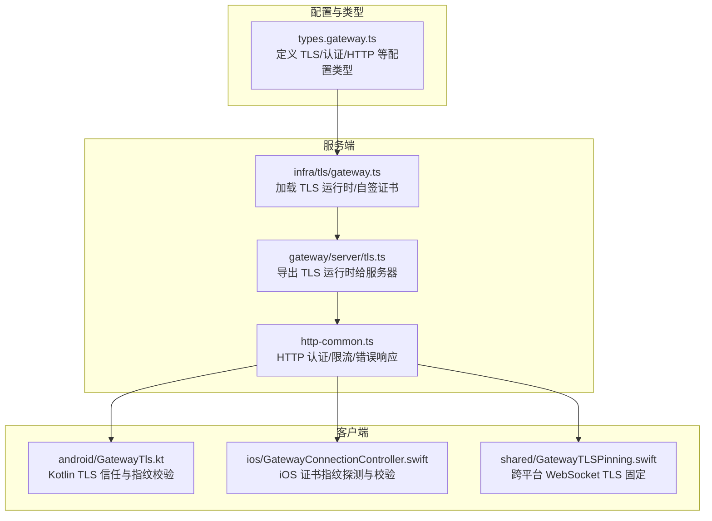
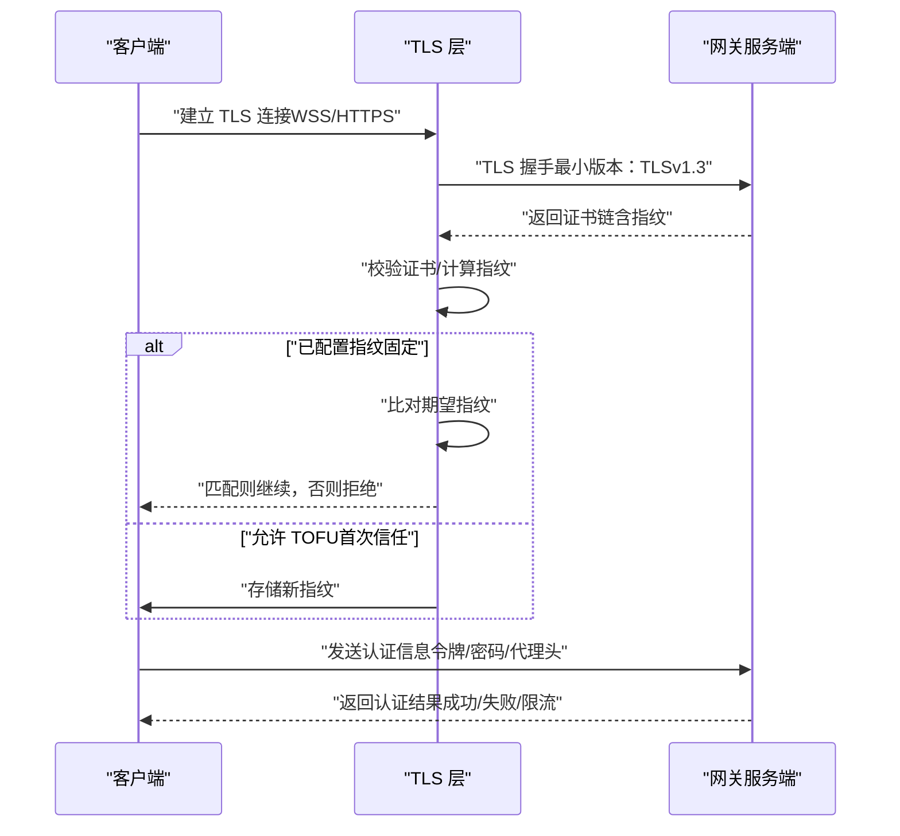
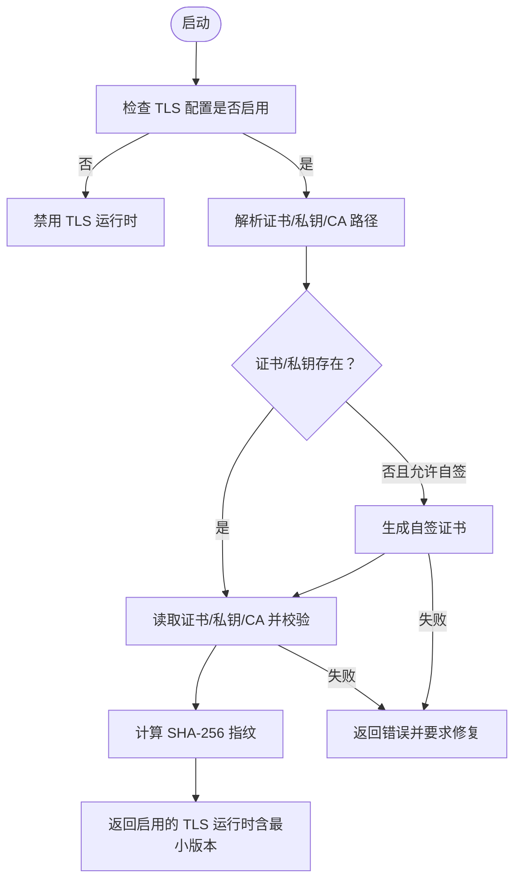
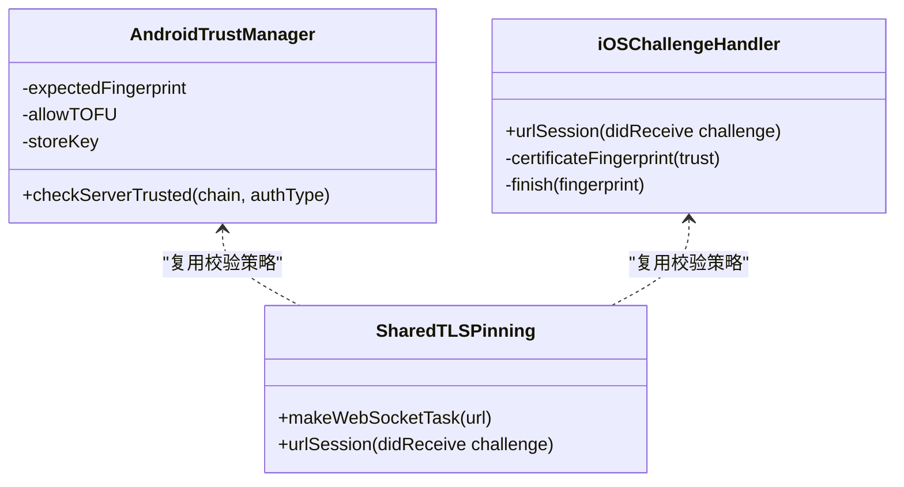
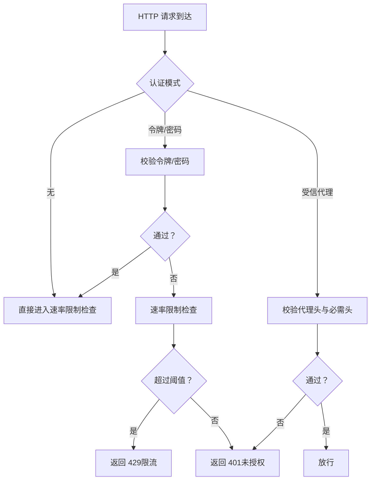
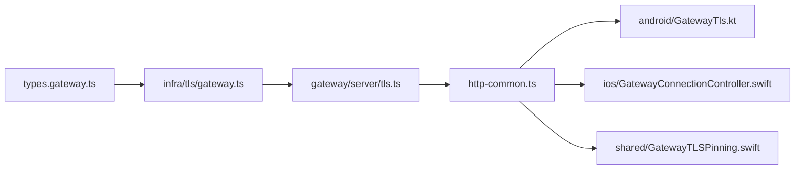

# 加密通信

<cite>
**本文引用的文件**
- [src/config/types.gateway.ts](file://src/config/types.gateway.ts)
- [src/infra/tls/gateway.ts](file://src/infra/tls/gateway.ts)
- [src/gateway/server/tls.ts](file://src/gateway/server/tls.ts)
- [apps/android/app/src/main/java/ai/openclaw/android/gateway/GatewayTls.kt](file://apps/android/app/src/main/java/ai/openclaw/android/gateway/GatewayTls.kt)
- [apps/ios/Sources/Gateway/GatewayConnectionController.swift](file://apps/ios/Sources/Gateway/GatewayConnectionController.swift)
- [apps/shared/OpenClawKit/Sources/OpenClawKit/GatewayTLSPinning.swift](file://apps/shared/OpenClawKit/Sources/OpenClawKit/GatewayTLSPinning.swift)
- [src/gateway/http-common.ts](file://src/gateway/http-common.ts)
- [docs/gateway/configuration.md](file://docs/gateway/configuration.md)
- [docs/gateway/index.md](file://docs/gateway/index.md)
- [docs/cli/security.md](file://docs/cli/security.md)
- [docs/zh-CN/cli/security.md](file://docs/zh-CN/cli/security.md)
</cite>

## 目录
1. [简介](#简介)
2. [项目结构](#项目结构)
3. [核心组件](#核心组件)
4. [架构总览](#架构总览)
5. [详细组件分析](#详细组件分析)
6. [依赖关系分析](#依赖关系分析)
7. [性能考量](#性能考量)
8. [故障排查指南](#故障排查指南)
9. [结论](#结论)
10. [附录](#附录)

## 简介
本文件系统性梳理 OpenClaw 网关在本地与远程场景下的加密通信机制，覆盖以下主题：
- WebSocket 连接的加密传输与 TLS 配置
- 证书生成、指纹校验与信任链管理
- HTTP API 的安全传输、认证与速率限制
- 本地与远程通信的差异化策略、隧道建立与网络隔离
- 加密算法选择、密钥轮换与安全参数配置
- 加密配置示例与网络安全最佳实践

## 项目结构
围绕“加密通信”的关键代码与文档分布如下：
- 类型与配置定义：src/config/types.gateway.ts
- TLS 运行时加载与自签证书生成：src/infra/tls/gateway.ts
- 服务端 TLS 暴露入口：src/gateway/server/tls.ts
- 客户端（Android/iOS/Shared）TLS 信任与指纹固定：apps/android/app/src/main/java/…/GatewayTls.kt、apps/ios/Sources/Gateway/GatewayConnectionController.swift、apps/shared/OpenClawKit/Sources/OpenClawKit/GatewayTLSPinning.swift
- HTTP 认证与错误响应：src/gateway/http-common.ts
- 网关配置与安全指引：docs/gateway/configuration.md、docs/gateway/index.md、docs/cli/security.md、docs/zh-CN/cli/security.md

图表来源
- [src/config/types.gateway.ts](file://src/config/types.gateway.ts#L5-L16)
- [src/infra/tls/gateway.ts](file://src/infra/tls/gateway.ts#L67-L150)
- [src/gateway/server/tls.ts](file://src/gateway/server/tls.ts#L9-L14)
- [src/gateway/http-common.ts](file://src/gateway/http-common.ts#L36-L71)
- [apps/android/app/src/main/java/ai/openclaw/android/gateway/GatewayTls.kt](file://apps/android/app/src/main/java/ai/openclaw/android/gateway/GatewayTls.kt#L35-L66)
- [apps/ios/Sources/Gateway/GatewayConnectionController.swift](file://apps/ios/Sources/Gateway/GatewayConnectionController.swift#L496-L523)
- [apps/shared/OpenClawKit/Sources/OpenClawKit/GatewayTLSPinning.swift](file://apps/shared/OpenClawKit/Sources/OpenClawKit/GatewayTLSPinning.swift#L66-L87)

章节来源
- [src/config/types.gateway.ts](file://src/config/types.gateway.ts#L5-L16)
- [src/infra/tls/gateway.ts](file://src/infra/tls/gateway.ts#L67-L150)
- [src/gateway/server/tls.ts](file://src/gateway/server/tls.ts#L9-L14)
- [src/gateway/http-common.ts](file://src/gateway/http-common.ts#L36-L71)
- [apps/android/app/src/main/java/ai/openclaw/android/gateway/GatewayTls.kt](file://apps/android/app/src/main/java/ai/openclaw/android/gateway/GatewayTls.kt#L35-L66)
- [apps/ios/Sources/Gateway/GatewayConnectionController.swift](file://apps/ios/Sources/Gateway/GatewayConnectionController.swift#L496-L523)
- [apps/shared/OpenClawKit/Sources/OpenClawKit/GatewayTLSPinning.swift](file://apps/shared/OpenClawKit/Sources/OpenClawKit/GatewayTLSPinning.swift#L66-L87)

## 核心组件
- TLS 配置与运行时
  - 服务端通过配置加载 TLS，支持自签证书生成、证书/私钥路径解析、CA 证书与指纹计算、最小 TLS 版本约束等。
  - 客户端侧实现证书指纹固定与可选的 TOFU（首次信任后存储）策略，确保远端证书可信。
- 认证与速率限制
  - 支持多种认证模式（无、令牌、密码、受信代理），并提供速率限制配置以抵御暴力破解。
  - HTTP 层统一返回 401/429 等错误响应，便于客户端处理。
- HTTP API 安全
  - 提供安全头配置项，如 HSTS；对特定端点设置最大请求体大小、图片/文件输入控制等。

章节来源
- [src/config/types.gateway.ts](file://src/config/types.gateway.ts#L5-L16)
- [src/infra/tls/gateway.ts](file://src/infra/tls/gateway.ts#L67-L150)
- [apps/android/app/src/main/java/ai/openclaw/android/gateway/GatewayTls.kt](file://apps/android/app/src/main/java/ai/openclaw/android/gateway/GatewayTls.kt#L35-L66)
- [apps/ios/Sources/Gateway/GatewayConnectionController.swift](file://apps/ios/Sources/Gateway/GatewayConnectionController.swift#L496-L523)
- [apps/shared/OpenClawKit/Sources/OpenClawKit/GatewayTLSPinning.swift](file://apps/shared/OpenClawKit/Sources/OpenClawKit/GatewayTLSPinning.swift#L66-L87)
- [src/gateway/http-common.ts](file://src/gateway/http-common.ts#L36-L71)

## 架构总览
下图展示从客户端到服务端的加密通信路径，包括 TLS 握手、证书指纹固定与认证流程。

图表来源
- [src/infra/tls/gateway.ts](file://src/infra/tls/gateway.ts#L133-L138)
- [apps/android/app/src/main/java/ai/openclaw/android/gateway/GatewayTls.kt](file://apps/android/app/src/main/java/ai/openclaw/android/gateway/GatewayTls.kt#L49-L62)
- [apps/ios/Sources/Gateway/GatewayConnectionController.swift](file://apps/ios/Sources/Gateway/GatewayConnectionController.swift#L1028-L1071)
- [apps/shared/OpenClawKit/Sources/OpenClawKit/GatewayTLSPinning.swift](file://apps/shared/OpenClawKit/Sources/OpenClawKit/GatewayTLSPinning.swift#L77-L87)
- [src/gateway/http-common.ts](file://src/gateway/http-common.ts#L36-L71)

## 详细组件分析

### 组件A：服务端 TLS 运行时与证书管理
- 自签证书生成：在缺少证书/私钥且允许自动生成时，使用 OpenSSL 生成有效期较长的自签证书，并设置严格权限。
- 证书加载与指纹：读取 PEM 证书与私钥，计算 SHA-256 指纹，作为后续客户端指纹固定的依据。
- TLS 选项：设置最小 TLS 版本为 TLSv1.3，支持可选 CA 证书用于客户端互认或自定义根。
- 错误处理：缺失文件、无法计算指纹或加载失败均返回明确错误，指示所需修复。

图表来源
- [src/infra/tls/gateway.ts](file://src/infra/tls/gateway.ts#L67-L150)

章节来源
- [src/infra/tls/gateway.ts](file://src/infra/tls/gateway.ts#L33-L65)
- [src/infra/tls/gateway.ts](file://src/infra/tls/gateway.ts#L67-L150)

### 组件B：客户端 TLS 信任与指纹固定
- Android 实现：基于 Java TrustManager，若配置了期望指纹则严格比对；否则在允许 TOFU 时将证书指纹写入存储。
- iOS 实现：通过 URLAuthenticationChallenge 获取证书链，计算 SHA-256 指纹并进行比对，支持取消挑战并在完成后回调。
- 共享层（跨平台）：在 URLSession 层拦截服务器信任回调，执行证书校验与指纹固定逻辑。

图表来源
- [apps/android/app/src/main/java/ai/openclaw/android/gateway/GatewayTls.kt](file://apps/android/app/src/main/java/ai/openclaw/android/gateway/GatewayTls.kt#L35-L66)
- [apps/ios/Sources/Gateway/GatewayConnectionController.swift](file://apps/ios/Sources/Gateway/GatewayConnectionController.swift#L1028-L1071)
- [apps/shared/OpenClawKit/Sources/OpenClawKit/GatewayTLSPinning.swift](file://apps/shared/OpenClawKit/Sources/OpenClawKit/GatewayTLSPinning.swift#L66-L87)

章节来源
- [apps/android/app/src/main/java/ai/openclaw/android/gateway/GatewayTls.kt](file://apps/android/app/src/main/java/ai/openclaw/android/gateway/GatewayTls.kt#L35-L66)
- [apps/ios/Sources/Gateway/GatewayConnectionController.swift](file://apps/ios/Sources/Gateway/GatewayConnectionController.swift#L496-L523)
- [apps/ios/Sources/Gateway/GatewayConnectionController.swift](file://apps/ios/Sources/Gateway/GatewayConnectionController.swift#L1028-L1071)
- [apps/shared/OpenClawKit/Sources/OpenClawKit/GatewayTLSPinning.swift](file://apps/shared/OpenClawKit/Sources/OpenClawKit/GatewayTLSPinning.swift#L66-L87)

### 组件C：HTTP API 安全传输与认证
- 认证模式：支持无认证、令牌认证、密码认证以及受信代理认证（通过反向代理注入用户身份）。
- 速率限制：可配置每 IP 失败次数、滑动窗口与封禁时长，支持回环地址豁免。
- 错误响应：统一返回 401 未授权与 429 过多尝试的限流响应，包含 Retry-After 头。
- 安全头：可配置 HSTS 等安全头，提升 HTTPS 传输安全性。

图表来源
- [src/gateway/http-common.ts](file://src/gateway/http-common.ts#L36-L71)
- [src/config/types.gateway.ts](file://src/config/types.gateway.ts#L136-L163)

章节来源
- [src/gateway/http-common.ts](file://src/gateway/http-common.ts#L36-L71)
- [src/config/types.gateway.ts](file://src/config/types.gateway.ts#L136-L163)

### 组件D：本地通信与远程通信的加密策略
- 本地绑定与暴露
  - 默认仅监听回环地址，避免外部直连；可通过绑定模式切换至 LAN 或 Tailnet。
  - 若非回环绑定且未配置认证，启动会被拒绝，确保本地环境安全。
- 远程访问与隧道
  - 推荐使用 Tailscale/VPN；也可通过 SSH 隧道将本地端口转发到 127.0.0.1:18789。
  - 即使经隧道，仍需提供网关认证凭据（令牌/密码）。
- 网络隔离
  - mDNS 广播模式可设为 off/minimal/full，避免元数据泄露；Wide-Area 发现可配置域。
  - 受信代理列表与真实 IP 回退策略影响客户端 IP 判定，谨慎配置以避免头部伪造风险。

章节来源
- [docs/gateway/index.md](file://docs/gateway/index.md#L75-L123)
- [src/config/types.gateway.ts](file://src/config/types.gateway.ts#L3-L39)
- [src/config/types.gateway.ts](file://src/config/types.gateway.ts#L384-L393)

### 组件E：加密算法选择与安全参数
- TLS 最低版本：强制使用 TLSv1.3，提升握手安全性与性能。
- 证书指纹：服务端计算 SHA-256 指纹，客户端严格比对，防止中间人攻击。
- 速率限制：可调失败阈值、窗口与封禁时长，缓解暴力破解。
- 安全头：可启用 HSTS，增强 HTTPS 强制与子域名保护。

章节来源
- [src/infra/tls/gateway.ts](file://src/infra/tls/gateway.ts#L133-L138)
- [src/gateway/http-common.ts](file://src/gateway/http-common.ts#L36-L71)
- [src/config/types.gateway.ts](file://src/config/types.gateway.ts#L319-L327)

### 组件F：密钥轮换与证书更新
- 证书轮换流程
  - 更新证书/私钥文件后，重启网关或触发配置热重载，重新加载 TLS 运行时。
  - 客户端侧若采用指纹固定，应在新证书生效后同步更新存储的指纹或允许 TOFU 一次性更新。
- 安全建议
  - 使用受信 CA 签发的证书替代自签证书，减少人工指纹维护成本。
  - 对于自签证书，定期轮换并记录指纹变更日志，配合自动化运维与告警。

章节来源
- [src/infra/tls/gateway.ts](file://src/infra/tls/gateway.ts#L67-L150)
- [src/gateway/server/tls.ts](file://src/gateway/server/tls.ts#L9-L14)

## 依赖关系分析
- 配置类型驱动运行时行为：GatewayTlsConfig 决定是否启用 TLS、是否自签、证书/私钥/CA 路径。
- TLS 运行时负责加载与校验证书、计算指纹、输出 TLS 选项。
- 服务端通过导出的 TLS 运行时启用 WSS/HTTPS；HTTP 层负责认证与限流。
- 客户端在各自平台上实现相同的信任与指纹固定策略，确保一致的安全边界。

图表来源
- [src/config/types.gateway.ts](file://src/config/types.gateway.ts#L5-L16)
- [src/infra/tls/gateway.ts](file://src/infra/tls/gateway.ts#L67-L150)
- [src/gateway/server/tls.ts](file://src/gateway/server/tls.ts#L9-L14)
- [src/gateway/http-common.ts](file://src/gateway/http-common.ts#L36-L71)
- [apps/android/app/src/main/java/ai/openclaw/android/gateway/GatewayTls.kt](file://apps/android/app/src/main/java/ai/openclaw/android/gateway/GatewayTls.kt#L35-L66)
- [apps/ios/Sources/Gateway/GatewayConnectionController.swift](file://apps/ios/Sources/Gateway/GatewayConnectionController.swift#L496-L523)
- [apps/shared/OpenClawKit/Sources/OpenClawKit/GatewayTLSPinning.swift](file://apps/shared/OpenClawKit/Sources/OpenClawKit/GatewayTLSPinning.swift#L66-L87)

章节来源
- [src/config/types.gateway.ts](file://src/config/types.gateway.ts#L5-L16)
- [src/infra/tls/gateway.ts](file://src/infra/tls/gateway.ts#L67-L150)
- [src/gateway/server/tls.ts](file://src/gateway/server/tls.ts#L9-L14)
- [src/gateway/http-common.ts](file://src/gateway/http-common.ts#L36-L71)
- [apps/android/app/src/main/java/ai/openclaw/android/gateway/GatewayTls.kt](file://apps/android/app/src/main/java/ai/openclaw/android/gateway/GatewayTls.kt#L35-L66)
- [apps/ios/Sources/Gateway/GatewayConnectionController.swift](file://apps/ios/Sources/Gateway/GatewayConnectionController.swift#L496-L523)
- [apps/shared/OpenClawKit/Sources/OpenClawKit/GatewayTLSPinning.swift](file://apps/shared/OpenClawKit/Sources/OpenClawKit/GatewayTLSPinning.swift#L66-L87)

## 性能考量
- TLSv1.3 握手更快、更安全，降低握手开销。
- 证书指纹缓存可减少重复计算；客户端指纹固定避免频繁网络交互。
- 速率限制在保护安全的同时，应合理设置窗口与阈值，避免误伤正常流量。
- HTTP 端点对请求体大小与媒体处理有上限控制，有助于防止资源滥用。

## 故障排查指南
- 启动被拒绝（非回环绑定且未认证）
  - 现象：启动时报错提示需要认证。
  - 处理：配置令牌或密码认证，或改为回环绑定。
- 证书/私钥缺失或无法加载
  - 现象：TLS 运行时返回错误，提示证书/私钥缺失或加载失败。
  - 处理：检查路径、权限与文件格式；必要时启用自签并确认生成成功。
- 指纹不匹配
  - 现象：客户端拒绝连接或握手失败。
  - 处理：核对服务端指纹与客户端存储的指纹；若确为新证书，更新客户端指纹或允许 TOFU。
- 认证失败/限流
  - 现象：返回 401 或 429。
  - 处理：检查令牌/密码正确性；调整速率限制配置或稍后再试。

章节来源
- [docs/gateway/index.md](file://docs/gateway/index.md#L237-L244)
- [src/infra/tls/gateway.ts](file://src/infra/tls/gateway.ts#L98-L106)
- [src/gateway/http-common.ts](file://src/gateway/http-common.ts#L47-L65)

## 结论
OpenClaw 在本地与远程场景下提供了完善的加密通信保障：
- 服务端强制 TLSv1.3，支持自签证书与指纹固定，客户端严格校验。
- 认证与速率限制结合，有效抵御未授权访问与暴力破解。
- 配置化安全参数与文档化的最佳实践，便于生产环境部署与运维。

## 附录

### 加密配置示例（要点说明）
- 启用 TLS 并自签证书
  - 在配置中开启 TLS，并允许自动生成；服务端会在运行时生成证书并设置严格权限。
- 指纹固定（客户端）
  - 在首次连接后，将服务端证书指纹写入客户端存储；后续连接严格比对指纹。
- 认证与速率限制
  - 设置令牌或密码认证；根据环境调整失败阈值、窗口与封禁时长。
- HTTP 安全头
  - 启用 HSTS 等安全头，提升 HTTPS 传输安全性。

章节来源
- [src/infra/tls/gateway.ts](file://src/infra/tls/gateway.ts#L84-L96)
- [src/config/types.gateway.ts](file://src/config/types.gateway.ts#L5-L16)
- [src/gateway/http-common.ts](file://src/gateway/http-common.ts#L36-L71)
- [src/config/types.gateway.ts](file://src/config/types.gateway.ts#L319-L327)

### 网络安全最佳实践
- 优先使用受信 CA 签发的证书，避免频繁指纹维护。
- 将网关绑定到回环地址，仅在必要时开放 LAN/Tailnet；远程访问优先使用 Tailscale/VPN。
- 启用 mDNS minimal 模式，避免敏感元数据泄露。
- 严格管理受信代理与真实 IP 回退策略，防止头部伪造。
- 定期轮换证书与认证凭据，完善审计与告警机制。

章节来源
- [docs/gateway/index.md](file://docs/gateway/index.md#L108-L123)
- [src/config/types.gateway.ts](file://src/config/types.gateway.ts#L26-L34)
- [src/config/types.gateway.ts](file://src/config/types.gateway.ts#L384-L393)
- [docs/cli/security.md](file://docs/cli/security.md#L32-L41)
- [docs/zh-CN/cli/security.md](file://docs/zh-CN/cli/security.md#L32-L33)