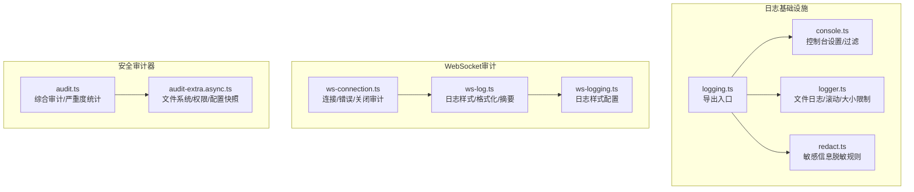
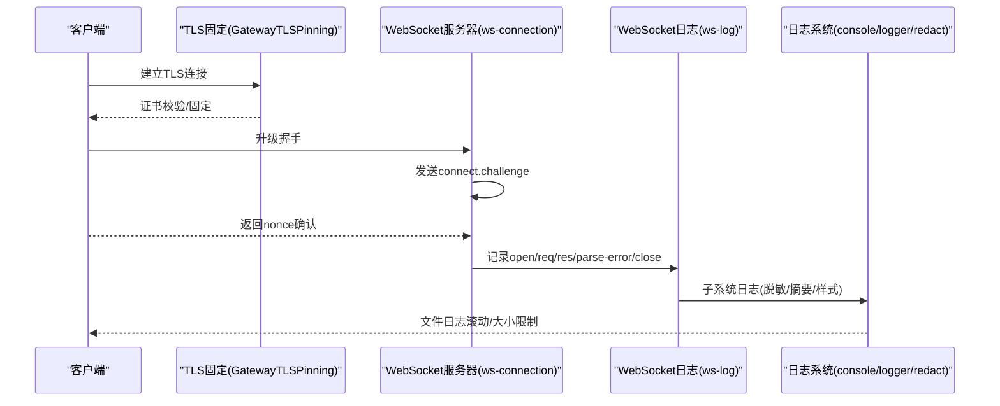
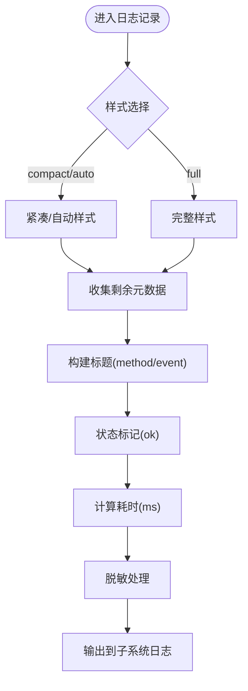
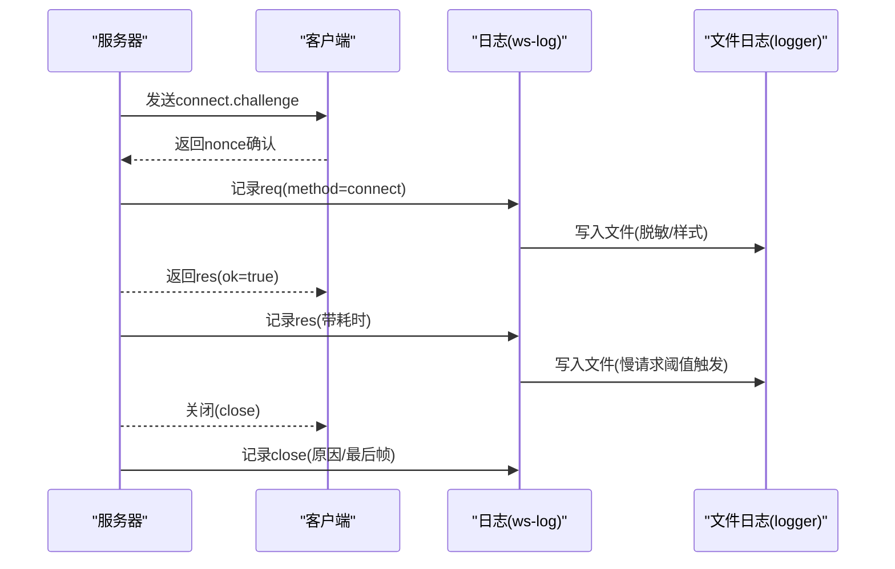
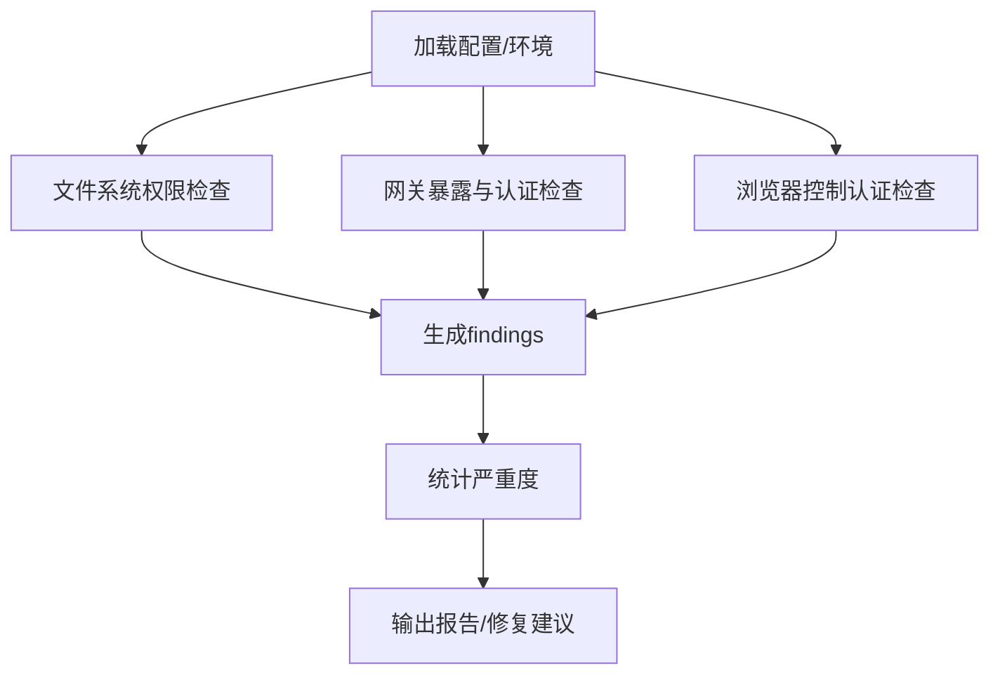
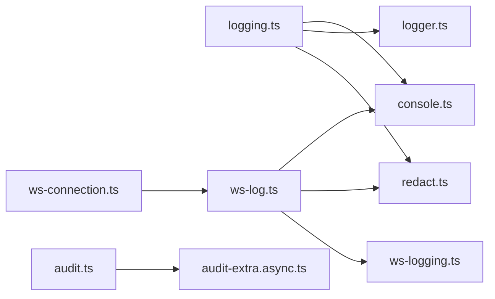

# 安全审计

<cite>
**本文引用的文件**   
- [src/gateway/ws-log.ts](file://src/gateway/ws-log.ts)
- [src/gateway/ws-logging.ts](file://src/gateway/ws-logging.ts)
- [src/gateway/server/ws-connection.ts](file://src/gateway/server/ws-connection.ts)
- [src/logging.ts](file://src/logging.ts)
- [src/logging/console.ts](file://src/logging/console.ts)
- [src/logging/logger.ts](file://src/logging/logger.ts)
- [src/logging/redact.ts](file://src/logging/redact.ts)
- [src/security/audit.ts](file://src/security/audit.ts)
- [src/security/audit-extra.async.ts](file://src/security/audit-extra.async.ts)
- [apps/shared/OpenClawKit/Sources/OpenClawKit/GatewayTLSPinning.swift](file://apps/shared/OpenClawKit/Sources/OpenClawKit/GatewayTLSPinning.swift)
- [apps/shared/OpenClawKit/Tests/OpenClawKitTests/GatewayNodeSessionTests.swift](file://apps/shared/OpenClawKit/Tests/OpenClawKitTests/GatewayNodeSessionTests.swift)
- [docs/zh-CN/gateway/security/index.md](file://docs/zh-CN/gateway/security/index.md)
- [SECURITY.md](file://SECURITY.md)
- [docs/security/THREAT-MODEL-ATLAS.md](file://docs/security/THREAT-MODEL-ATLAS.md)
</cite>

## 目录
1. [简介](#简介)
2. [项目结构](#项目结构)
3. [核心组件](#核心组件)
4. [架构总览](#架构总览)
5. [详细组件分析](#详细组件分析)
6. [依赖关系分析](#依赖关系分析)
7. [性能考量](#性能考量)
8. [故障排查指南](#故障排查指南)
9. [结论](#结论)
10. [附录](#附录)

## 简介
本文件面向OpenClaw安全审计系统，聚焦控制平面审计日志的记录机制、事件分类与日志格式标准，WebSocket通信的日志记录与消息追踪、会话审计，以及安全事件检测、异常行为监控与入侵检测机制。同时覆盖日志存储策略、隐私保护与合规性要求，并提供审计配置示例与安全事件响应流程。

## 项目结构
OpenClaw的安全审计能力由“日志基础设施”“WebSocket审计”“安全审计器”三部分组成：
- 日志基础设施：统一控制台与文件日志、子系统过滤、敏感信息脱敏、滚动与大小限制。
- WebSocket审计：连接生命周期、帧级入出日志、慢请求统计、元数据脱敏与摘要。
- 安全审计器：基于配置与文件系统扫描的综合安全检查，输出严重度分级的审计报告。

图表来源
- [src/logging.ts](file://src/logging.ts#L1-L70)
- [src/logging/console.ts](file://src/logging/console.ts#L1-L327)
- [src/logging/logger.ts](file://src/logging/logger.ts#L1-L200)
- [src/logging/redact.ts](file://src/logging/redact.ts#L1-L152)
- [src/gateway/ws-log.ts](file://src/gateway/ws-log.ts#L1-L439)
- [src/gateway/ws-logging.ts](file://src/gateway/ws-logging.ts#L1-L14)
- [src/gateway/server/ws-connection.ts](file://src/gateway/server/ws-connection.ts#L1-L200)
- [src/security/audit.ts](file://src/security/audit.ts#L1-L800)
- [src/security/audit-extra.async.ts](file://src/security/audit-extra.async.ts#L1-L200)

章节来源
- [src/logging.ts](file://src/logging.ts#L1-L70)
- [src/logging/console.ts](file://src/logging/console.ts#L1-L327)
- [src/logging/logger.ts](file://src/logging/logger.ts#L1-L200)
- [src/logging/redact.ts](file://src/logging/redact.ts#L1-L152)
- [src/gateway/ws-log.ts](file://src/gateway/ws-log.ts#L1-L439)
- [src/gateway/ws-logging.ts](file://src/gateway/ws-logging.ts#L1-L14)
- [src/gateway/server/ws-connection.ts](file://src/gateway/server/ws-connection.ts#L1-L200)
- [src/security/audit.ts](file://src/security/audit.ts#L1-L800)
- [src/security/audit-extra.async.ts](file://src/security/audit-extra.async.ts#L1-L200)

## 核心组件
- 控制台与文件日志：通过统一入口导出，支持级别、样式、时间戳前缀、子系统过滤与控制台捕获。
- 敏感信息脱敏：默认启用工具模式脱敏，内置多类敏感模式与正则，可按配置扩展。
- WebSocket审计：连接打开/错误/关闭、帧入出、慢请求统计、摘要字段提取与短ID展示。
- 安全审计器：综合检查网络暴露、认证策略、反向代理、mDNS、Tailscale、浏览器控制、日志文件权限等，输出严重度统计与修复建议。

章节来源
- [src/logging.ts](file://src/logging.ts#L1-L70)
- [src/logging/console.ts](file://src/logging/console.ts#L1-L327)
- [src/logging/logger.ts](file://src/logging/logger.ts#L1-L200)
- [src/logging/redact.ts](file://src/logging/redact.ts#L1-L152)
- [src/gateway/ws-log.ts](file://src/gateway/ws-log.ts#L1-L439)
- [src/gateway/ws-logging.ts](file://src/gateway/ws-logging.ts#L1-L14)
- [src/gateway/server/ws-connection.ts](file://src/gateway/server/ws-connection.ts#L1-L200)
- [src/security/audit.ts](file://src/security/audit.ts#L1-L800)
- [src/security/audit-extra.async.ts](file://src/security/audit-extra.async.ts#L1-L200)

## 架构总览
下图展示从客户端到网关、再到日志与审计系统的整体流程，包括TLS固定、握手挑战、帧日志与慢请求统计、文件日志落盘与脱敏。

图表来源
- [apps/shared/OpenClawKit/Sources/OpenClawKit/GatewayTLSPinning.swift](file://apps/shared/OpenClawKit/Sources/OpenClawKit/GatewayTLSPinning.swift#L66-L87)
- [src/gateway/server/ws-connection.ts](file://src/gateway/server/ws-connection.ts#L115-L200)
- [src/gateway/ws-log.ts](file://src/gateway/ws-log.ts#L256-L314)
- [src/logging/console.ts](file://src/logging/console.ts#L203-L326)
- [src/logging/logger.ts](file://src/logging/logger.ts#L126-L184)
- [src/logging/redact.ts](file://src/logging/redact.ts#L126-L139)

## 详细组件分析

### 控制平面审计日志与事件分类
- 事件分类
  - 连接事件：open、close、error
  - 请求/响应：req、res
  - 解析错误：parse-error
  - 业务事件：如connect.challenge
- 元数据与摘要
  - 自动提取并脱敏connId/id/method/event等关键字段
  - 摘要函数对agent事件进行精简，保留run/session/stream/aseq等关键信息
- 日志样式
  - 支持auto/full/compact三种样式，慢请求阈值可配置
- 子系统过滤
  - 通过子系统前缀过滤决定是否输出到控制台

图表来源
- [src/gateway/ws-log.ts](file://src/gateway/ws-log.ts#L256-L314)
- [src/gateway/ws-log.ts](file://src/gateway/ws-log.ts#L380-L438)
- [src/gateway/ws-logging.ts](file://src/gateway/ws-logging.ts#L1-L14)

章节来源
- [src/gateway/ws-log.ts](file://src/gateway/ws-log.ts#L1-L439)
- [src/gateway/ws-logging.ts](file://src/gateway/ws-logging.ts#L1-L14)
- [src/logging/console.ts](file://src/logging/console.ts#L132-L138)

### WebSocket通信的日志记录、消息追踪与会话审计
- 连接生命周期
  - 记录open/close/error，包含远端地址、Host/Origin/User-Agent/X-Forwarded-For等头信息脱敏
  - 关闭原因与最后帧类型/方法/id用于审计追踪
- 帧级追踪
  - req入站时记录时间戳，res出站时计算耗时并按慢请求阈值输出
  - parse-error单独记录并脱敏
- 会话审计
  - 提供shortId与摘要函数，便于在日志中快速定位会话与关键信息

图表来源
- [src/gateway/server/ws-connection.ts](file://src/gateway/server/ws-connection.ts#L115-L200)
- [src/gateway/server/ws-connection.ts](file://src/gateway/server/ws-connection.ts#L207-L241)
- [src/gateway/ws-log.ts](file://src/gateway/ws-log.ts#L256-L314)
- [src/logging/logger.ts](file://src/logging/logger.ts#L126-L184)

章节来源
- [src/gateway/server/ws-connection.ts](file://src/gateway/server/ws-connection.ts#L1-L200)
- [src/gateway/server/ws-connection.ts](file://src/gateway/server/ws-connection.ts#L207-L241)
- [src/gateway/ws-log.ts](file://src/gateway/ws-log.ts#L256-L314)

### 安全事件检测、异常行为监控与入侵检测
- 配置与暴露面检查
  - 网关绑定、认证令牌/密码、反向代理可信代理、允许的Origin、mDNS模式、Tailscale模式等
  - 浏览器控制HTTP路由的认证缺失检查
- 文件系统与日志文件权限
  - state目录、config文件、sessions.json、日志文件的可读/可写权限检查
- 审计报告
  - 输出严重度统计(critical/warn/info)，并给出修复建议
- 威胁模型与常见误报
  - 文档提供威胁模型与常见误报模式，指导评估与响应

图表来源
- [src/security/audit.ts](file://src/security/audit.ts#L339-L686)
- [src/security/audit.ts](file://src/security/audit.ts#L799-L800)
- [src/security/audit-extra.async.ts](file://src/security/audit-extra.async.ts#L1069-L1127)

章节来源
- [src/security/audit.ts](file://src/security/audit.ts#L1-L800)
- [src/security/audit-extra.async.ts](file://src/security/audit-extra.async.ts#L1-L200)
- [docs/zh-CN/gateway/security/index.md](file://docs/zh-CN/gateway/security/index.md#L717-L774)
- [SECURITY.md](file://SECURITY.md#L48-L66)
- [docs/security/THREAT-MODEL-ATLAS.md](file://docs/security/THREAT-MODEL-ATLAS.md#L154-L355)

### 日志存储策略、隐私保护与合规性
- 存储策略
  - 默认滚动日志路径，按天命名；达到最大文件大小时抑制写入并输出警告
  - 文件大小上限可配置，默认约500MB
- 隐私保护
  - 控制台与文件日志均支持敏感信息脱敏，工具模式默认启用
  - 脱敏规则覆盖环境变量、JSON字段、CLI参数、Authorization头、PEM块、常见令牌前缀等
- 合规性
  - 严格Origin策略、禁止Host头回退、X-Real-IP回退风险提示
  - Tailscale Funnel公网暴露警示与Tailnet-only建议

章节来源
- [src/logging/logger.ts](file://src/logging/logger.ts#L15-L22)
- [src/logging/logger.ts](file://src/logging/logger.ts#L126-L184)
- [src/logging/redact.ts](file://src/logging/redact.ts#L1-L152)
- [src/security/audit.ts](file://src/security/audit.ts#L428-L524)
- [src/security/audit.ts](file://src/security/audit.ts#L540-L555)

### 审计配置示例与安全事件响应流程
- 审计配置要点
  - 控制台级别与样式、文件日志路径与大小上限
  - 子系统过滤、时间戳前缀、敏感信息脱敏模式与自定义正则
- 安全事件响应
  - 识别严重度(critical/warn)，优先修复高危问题
  - 参考报告中的修复建议，必要时结合威胁模型与常见误报判定
  - 记录攻击者输入、智能体行为、暴露面情况，形成最小化证据链

章节来源
- [src/logging/console.ts](file://src/logging/console.ts#L60-L91)
- [src/logging/logger.ts](file://src/logging/logger.ts#L73-L106)
- [src/logging/redact.ts](file://src/logging/redact.ts#L108-L124)
- [src/security/audit.ts](file://src/security/audit.ts#L72-L85)
- [docs/zh-CN/gateway/security/index.md](file://docs/zh-CN/gateway/security/index.md#L717-L774)
- [SECURITY.md](file://SECURITY.md#L48-L66)

## 依赖关系分析
- 日志子系统内部依赖
  - logging.ts作为统一出口，组合console、logger、redact
  - console负责级别/样式/过滤；logger负责文件落盘与滚动；redact负责敏感信息处理
- WebSocket审计依赖
  - ws-log依赖console过滤与redact；ws-logging提供样式配置；ws-connection负责连接上下文与错误/关闭事件
- 安全审计依赖
  - audit.ts聚合多种检查；audit-extra.async.ts执行文件系统与权限检查并生成配置快照

图表来源
- [src/logging.ts](file://src/logging.ts#L1-L70)
- [src/logging/console.ts](file://src/logging/console.ts#L1-L327)
- [src/logging/logger.ts](file://src/logging/logger.ts#L1-L200)
- [src/logging/redact.ts](file://src/logging/redact.ts#L1-L152)
- [src/gateway/ws-log.ts](file://src/gateway/ws-log.ts#L1-L439)
- [src/gateway/ws-logging.ts](file://src/gateway/ws-logging.ts#L1-L14)
- [src/gateway/server/ws-connection.ts](file://src/gateway/server/ws-connection.ts#L1-L200)
- [src/security/audit.ts](file://src/security/audit.ts#L1-L800)
- [src/security/audit-extra.async.ts](file://src/security/audit-extra.async.ts#L1-L200)

章节来源
- [src/logging.ts](file://src/logging.ts#L1-L70)
- [src/gateway/ws-log.ts](file://src/gateway/ws-log.ts#L1-L439)
- [src/gateway/server/ws-connection.ts](file://src/gateway/server/ws-connection.ts#L1-L200)
- [src/security/audit.ts](file://src/security/audit.ts#L1-L800)

## 性能考量
- WebSocket日志样式
  - compact/auto模式在非verbose下仅记录慢请求与错误，降低控制台噪声
  - full模式提供完整帧轨迹，适合调试
- 文件日志
  - 达到大小上限后抑制写入并输出警告，避免磁盘打满
  - 滚动日志按天命名，减少单文件过大带来的IO压力
- 脱敏成本
  - 正则匹配与边界替换在高频日志场景需关注CPU占用，建议在生产环境保持默认模式

章节来源
- [src/gateway/ws-log.ts](file://src/gateway/ws-log.ts#L316-L378)
- [src/logging/logger.ts](file://src/logging/logger.ts#L149-L178)
- [src/logging/redact.ts](file://src/logging/redact.ts#L98-L106)

## 故障排查指南
- 控制台无输出
  - 检查子系统过滤与级别设置；确认未处于测试静默模式
- 日志文件未生成或被抑制
  - 检查文件路径是否存在、权限是否足够；确认未超过大小上限
- WebSocket慢请求未显示
  - 检查日志样式与慢请求阈值；确认verbose模式或compact/auto模式下的慢请求条件
- 审计报告缺少某些检查
  - 确认includeFilesystem/includeChannelSecurity等开关；检查配置快照读取是否成功

章节来源
- [src/logging/console.ts](file://src/logging/console.ts#L60-L91)
- [src/logging/logger.ts](file://src/logging/logger.ts#L149-L178)
- [src/gateway/ws-log.ts](file://src/gateway/ws-log.ts#L356-L378)
- [src/security/audit.ts](file://src/security/audit.ts#L1093-L1129)

## 结论
OpenClaw的安全审计体系以“日志基础设施—WebSocket审计—安全审计器”三层协同实现：通过可控的样式与脱敏策略保障可观测性与隐私，借助严格的配置检查与文件系统扫描提升整体安全基线，配合威胁模型与常见误报指引辅助响应与决策。建议在生产环境中启用工具模式脱敏、严格Origin策略与最小暴露面，并定期运行安全审计以持续改进。

## 附录
- TLS固定与握手挑战
  - 客户端侧通过TLS固定与握手挑战确保连接可信与防劫持
- 单元测试参考
  - 客户端侧测试覆盖connect.challenge与connect.ok消息序列，便于验证握手流程

章节来源
- [apps/shared/OpenClawKit/Sources/OpenClawKit/GatewayTLSPinning.swift](file://apps/shared/OpenClawKit/Sources/OpenClawKit/GatewayTLSPinning.swift#L66-L87)
- [apps/shared/OpenClawKit/Tests/OpenClawKitTests/GatewayNodeSessionTests.swift](file://apps/shared/OpenClawKit/Tests/OpenClawKitTests/GatewayNodeSessionTests.swift#L41-L102)