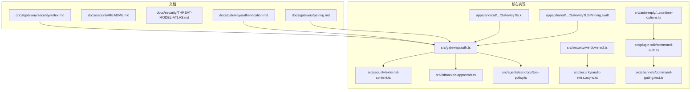
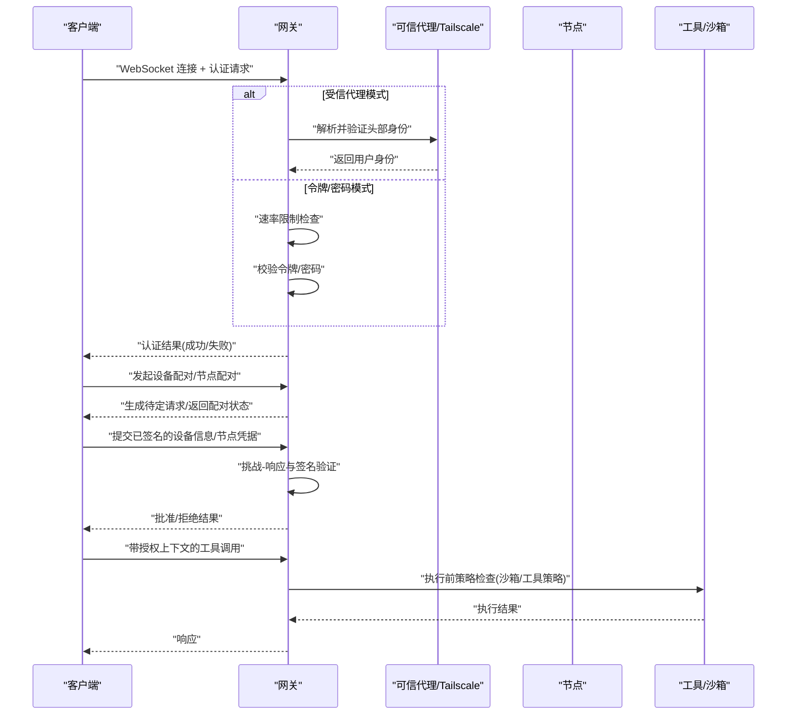
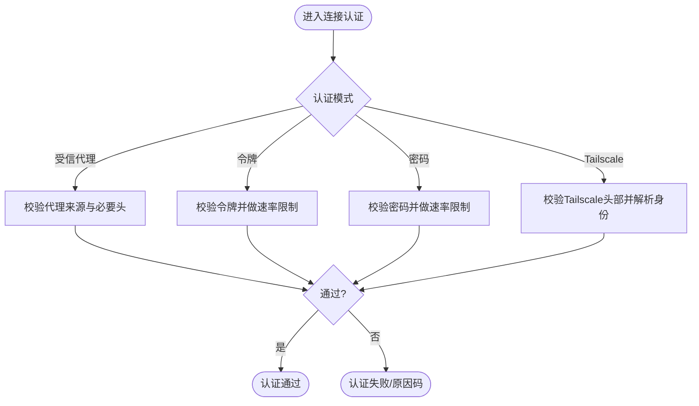
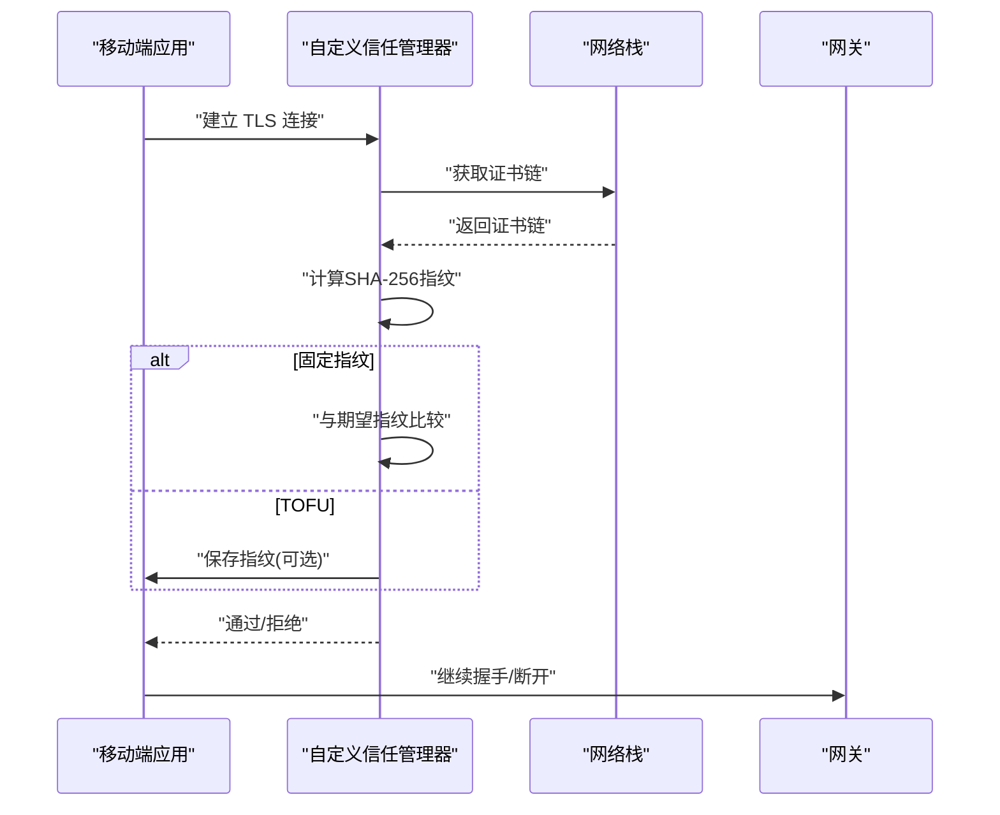
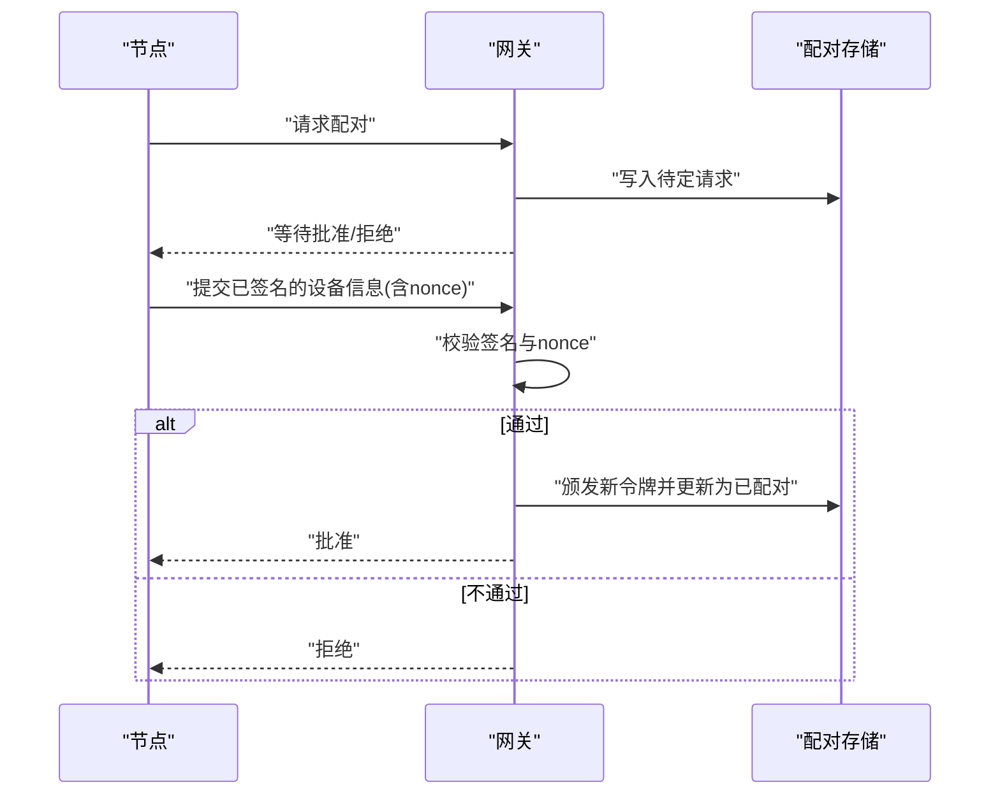
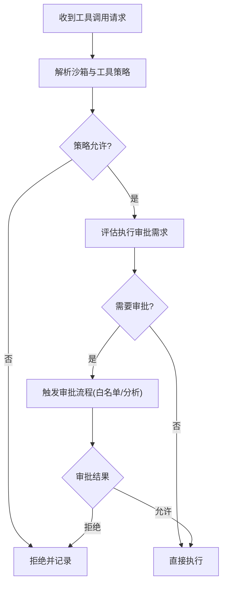
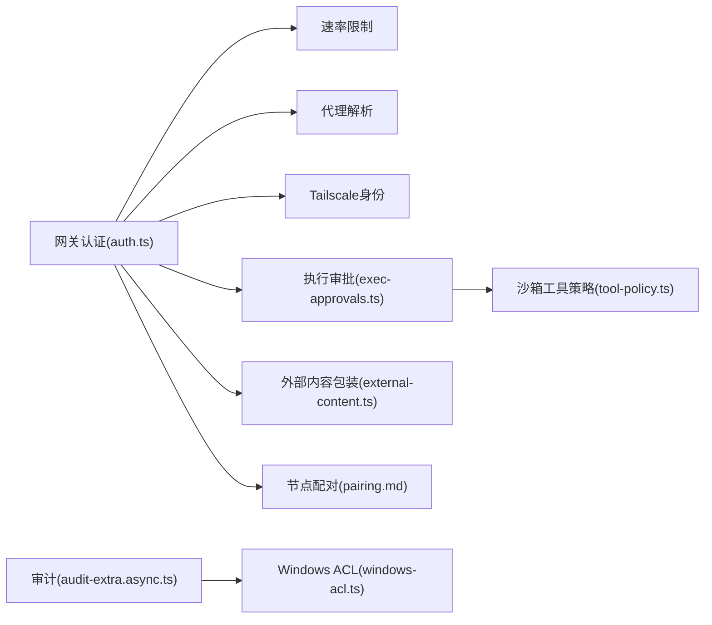

# 安全模型

<cite>
**本文引用的文件**
- [docs/gateway/security/index.md](file://docs/gateway/security/index.md)
- [docs/security/README.md](file://docs/security/README.md)
- [docs/security/THREAT-MODEL-ATLAS.md](file://docs/security/THREAT-MODEL-ATLAS.md)
- [docs/gateway/authentication.md](file://docs/gateway/authentication.md)
- [docs/gateway/pairing.md](file://docs/gateway/pairing.md)
- [src/gateway/auth.ts](file://src/gateway/auth.ts)
- [src/security/external-content.ts](file://src/security/external-content.ts)
- [src/infra/exec-approvals.ts](file://src/infra/exec-approvals.ts)
- [src/agents/sandbox/tool-policy.ts](file://src/agents/sandbox/tool-policy.ts)
- [apps/android/app/src/main/java/ai/openclaw/android/gateway/GatewayTls.kt](file://apps/android/app/src/main/java/ai/openclaw/android/gateway/GatewayTls.kt)
- [apps/shared/OpenClawKit/Sources/OpenClawKit/GatewayTLSPinning.swift](file://apps/shared/OpenClawKit/Sources/OpenClawKit/GatewayTLSPinning.swift)
- [src/security/windows-acl.ts](file://src/security/windows-acl.ts)
- [src/security/windows-acl.test.ts](file://src/security/windows-acl.test.ts)
- [src/security/audit-extra.async.ts](file://src/security/audit-extra.async.ts)
- [src/plugin-sdk/command-auth.ts](file://src/plugin-sdk/command-auth.ts)
- [src/channels/command-gating.test.ts](file://src/channels/command-gating.test.ts)
- [src/auto-reply/reply/commands-acp/runtime-options.ts](file://src/auto-reply/reply/commands-acp/runtime-options.ts)
- [src/gateway/server.auth.control-ui.suite.ts](file://src/gateway/server.auth.control-ui.suite.ts)
- [src/gateway/server-methods/devices.ts](file://src/gateway/server-methods/devices.ts)
- [src/gateway/client.watchdog.test.ts](file://src/gateway/client.watchdog.test.ts)
</cite>

## 目录
1. [简介](#简介)
2. [项目结构](#项目结构)
3. [核心组件](#核心组件)
4. [架构总览](#架构总览)
5. [详细组件分析](#详细组件分析)
6. [依赖关系分析](#依赖关系分析)
7. [性能考量](#性能考量)
8. [故障排查指南](#故障排查指南)
9. [结论](#结论)
10. [附录](#附录)

## 简介
本文件系统化梳理 OpenClaw 网关的安全模型与实现，覆盖身份认证、授权、加密传输、设备信任、节点配对、挑战-响应、权限控制、角色管理、访问控制列表、威胁建模与缓解、审计与日志、TLS 配置与证书固定、以及最佳实践与常见问题处理。内容以代码与文档为依据，配合图示帮助读者快速理解端到端安全设计。

## 项目结构
围绕“网关安全”的关键目录与文件：
- 文档层：安全与威胁建模、网关安全与认证、配对与节点管理
- 核心实现：网关认证与鉴权、外部内容包装与提示注入防护、执行审批与沙箱工具策略、TLS 证书固定与指纹校验、平台权限与 ACL 检查、命令授权与访问控制

图表来源
- [docs/gateway/security/index.md](file://docs/gateway/security/index.md#L1-L120)
- [docs/security/README.md](file://docs/security/README.md#L1-L18)
- [docs/security/THREAT-MODEL-ATLAS.md](file://docs/security/THREAT-MODEL-ATLAS.md#L1-L120)
- [docs/gateway/authentication.md](file://docs/gateway/authentication.md#L1-L120)
- [docs/gateway/pairing.md](file://docs/gateway/pairing.md#L1-L100)
- [src/gateway/auth.ts](file://src/gateway/auth.ts#L1-L120)
- [src/security/external-content.ts](file://src/security/external-content.ts#L1-L120)
- [src/infra/exec-approvals.ts](file://src/infra/exec-approvals.ts#L1-L120)
- [src/agents/sandbox/tool-policy.ts](file://src/agents/sandbox/tool-policy.ts#L1-L110)
- [apps/android/app/src/main/java/ai/openclaw/android/gateway/GatewayTls.kt](file://apps/android/app/src/main/java/ai/openclaw/android/gateway/GatewayTls.kt#L35-L102)
- [apps/shared/OpenClawKit/Sources/OpenClawKit/GatewayTLSPinning.swift](file://apps/shared/OpenClawKit/Sources/OpenClawKit/GatewayTLSPinning.swift#L89-L137)
- [src/security/windows-acl.ts](file://src/security/windows-acl.ts#L246-L287)
- [src/security/audit-extra.async.ts](file://src/security/audit-extra.async.ts#L1095-L1137)
- [src/plugin-sdk/command-auth.ts](file://src/plugin-sdk/command-auth.ts#L1-L34)
- [src/channels/command-gating.test.ts](file://src/channels/command-gating.test.ts#L1-L46)
- [src/auto-reply/reply/commands-acp/runtime-options.ts](file://src/auto-reply/reply/commands-acp/runtime-options.ts#L265-L296)

章节来源
- [docs/gateway/security/index.md](file://docs/gateway/security/index.md#L1-L120)
- [docs/security/README.md](file://docs/security/README.md#L1-L18)
- [docs/security/THREAT-MODEL-ATLAS.md](file://docs/security/THREAT-MODEL-ATLAS.md#L1-L120)

## 核心组件
- 身份认证与授权
  - 网关认证模式（令牌、密码、受信代理、无认证），支持速率限制与 Tailscale 头部身份认证
  - 控制界面与 WebSocket 的不同认证表面
- 加密传输与证书固定
  - Android 与 iOS 平台的 TLS 信任管理器与指纹校验
  - 支持 TOFU（首次信任）与显式指纹固定
- 设备配对与节点信任
  - 网关主导的节点配对生命周期（待定、批准、拒绝、过期）
  - 通过挑战-响应与设备签名建立信任
- 权限控制与访问控制
  - 工具策略与沙箱策略（允许/拒绝清单）
  - 命令授权与访问组控制
- 威胁建模与缓解
  - MITRE ATLAS 威胁矩阵与关键路径攻击链
- 审计与日志
  - 文件权限检查、日志可读性审计、Windows ACL 检测

章节来源
- [src/gateway/auth.ts](file://src/gateway/auth.ts#L217-L491)
- [apps/android/app/src/main/java/ai/openclaw/android/gateway/GatewayTls.kt](file://apps/android/app/src/main/java/ai/openclaw/android/gateway/GatewayTls.kt#L35-L102)
- [apps/shared/OpenClawKit/Sources/OpenClawKit/GatewayTLSPinning.swift](file://apps/shared/OpenClawKit/Sources/OpenClawKit/GatewayTLSPinning.swift#L89-L137)
- [docs/gateway/pairing.md](file://docs/gateway/pairing.md#L20-L100)
- [src/infra/exec-approvals.ts](file://src/infra/exec-approvals.ts#L1-L120)
- [src/agents/sandbox/tool-policy.ts](file://src/agents/sandbox/tool-policy.ts#L1-L110)
- [docs/security/THREAT-MODEL-ATLAS.md](file://docs/security/THREAT-MODEL-ATLAS.md#L485-L556)
- [src/security/audit-extra.async.ts](file://src/security/audit-extra.async.ts#L1095-L1137)

## 架构总览
下图展示从客户端到网关、再到节点与工具调用的端到端安全交互，强调认证、授权、传输加密与信任建立。

图表来源
- [src/gateway/auth.ts](file://src/gateway/auth.ts#L367-L491)
- [docs/gateway/pairing.md](file://docs/gateway/pairing.md#L27-L100)
- [src/infra/exec-approvals.ts](file://src/infra/exec-approvals.ts#L451-L463)
- [src/agents/sandbox/tool-policy.ts](file://src/agents/sandbox/tool-policy.ts#L16-L33)

## 详细组件分析

### 身份认证与授权
- 认证模式与选择
  - 支持令牌、密码、受信代理、无认证；默认优先令牌或密码
  - 受信代理需配置用户头与允许用户列表
  - Tailscale Serve 模式下可在控制界面启用基于头部的身份认证
- 速率限制与安全
  - 共享密钥作用域的速率限制，失败记录与重试时间
  - 本地直连请求与代理来源的区分
- 控制界面与 HTTP 表面
  - 控制界面 WebSocket 明确允许 Tailscale 头部认证，HTTP 表面不启用
- 关键实现要点
  - 认证结果包含方法、用户与原因码
  - 未满足条件时返回明确失败原因，便于审计与告警

图表来源
- [src/gateway/auth.ts](file://src/gateway/auth.ts#L367-L491)

章节来源
- [src/gateway/auth.ts](file://src/gateway/auth.ts#L217-L491)
- [docs/gateway/security/index.md](file://docs/gateway/security/index.md#L312-L352)

### 加密传输与证书固定
- Android 平台
  - 自定义 X509TrustManager：空链拒绝、指纹匹配、TOFU 支持、回退默认信任
  - 主机名校验在固定指纹或 TOFU 时被放宽
- iOS 平台
  - 使用 SecTrustEvaluate，支持指纹提取、规范化与存储
  - 支持 TOFU 与显式指纹固定
- 测试与探测
  - 单元测试覆盖指纹不匹配拒绝
  - 提供探测指纹的辅助函数

图表来源
- [apps/android/app/src/main/java/ai/openclaw/android/gateway/GatewayTls.kt](file://apps/android/app/src/main/java/ai/openclaw/android/gateway/GatewayTls.kt#L35-L102)
- [apps/shared/OpenClawKit/Sources/OpenClawKit/GatewayTLSPinning.swift](file://apps/shared/OpenClawKit/Sources/OpenClawKit/GatewayTLSPinning.swift#L89-L137)

章节来源
- [apps/android/app/src/main/java/ai/openclaw/android/gateway/GatewayTls.kt](file://apps/android/app/src/main/java/ai/openclaw/android/gateway/GatewayTls.kt#L35-L102)
- [apps/shared/OpenClawKit/Sources/OpenClawKit/GatewayTLSPinning.swift](file://apps/shared/OpenClawKit/Sources/OpenClawKit/GatewayTLSPinning.swift#L89-L137)
- [src/gateway/client.watchdog.test.ts](file://src/gateway/client.watchdog.test.ts#L88-L109)

### 设备配对与挑战-响应
- 网关主导的节点配对
  - 待定请求创建、批准/拒绝/过期
  - 批准后颁发新令牌，要求重新连接
- 挑战-响应与设备签名
  - 连接时携带随机数 nonce，设备侧使用身份路径、客户端、作用域与 nonce 构造签名
  - 服务端校验签名并通过后放行
- 存储与安全
  - 配对状态存储于网关状态目录，令牌轮换需重新批准

图表来源
- [docs/gateway/pairing.md](file://docs/gateway/pairing.md#L27-L100)
- [src/gateway/server.auth.control-ui.suite.ts](file://src/gateway/server.auth.control-ui.suite.ts#L524-L765)
- [src/gateway/server-methods/devices.ts](file://src/gateway/server-methods/devices.ts#L34-L79)

章节来源
- [docs/gateway/pairing.md](file://docs/gateway/pairing.md#L1-L100)
- [src/gateway/server.auth.control-ui.suite.ts](file://src/gateway/server.auth.control-ui.suite.ts#L524-L765)
- [src/gateway/server-methods/devices.ts](file://src/gateway/server-methods/devices.ts#L34-L79)

### 权限控制模型与访问控制
- 工具策略与沙箱
  - 沙箱工具策略按代理/全局/默认优先级合并，支持允许/拒绝清单
  - 沙箱会话中强制最小权限，必要时自动包含图像能力
- 命令授权与访问组
  - 基于通道允许列表与访问组的授权决策
  - useAccessGroups 开启时，若无配置授权器则拒绝
- 执行审批
  - 安全级别（禁止/白名单/全开）、询问策略（关闭/缺失时询问/总是）
  - 基于命令分析与白名单命中决定是否需要审批

图表来源
- [src/agents/sandbox/tool-policy.ts](file://src/agents/sandbox/tool-policy.ts#L16-L110)
- [src/infra/exec-approvals.ts](file://src/infra/exec-approvals.ts#L451-L463)
- [src/plugin-sdk/command-auth.ts](file://src/plugin-sdk/command-auth.ts#L1-L34)
- [src/channels/command-gating.test.ts](file://src/channels/command-gating.test.ts#L1-L46)

章节来源
- [src/agents/sandbox/tool-policy.ts](file://src/agents/sandbox/tool-policy.ts#L1-L110)
- [src/infra/exec-approvals.ts](file://src/infra/exec-approvals.ts#L1-L120)
- [src/plugin-sdk/command-auth.ts](file://src/plugin-sdk/command-auth.ts#L1-L34)
- [src/channels/command-gating.test.ts](file://src/channels/command-gating.test.ts#L1-L46)

### 威胁建模与缓解
- MITRE ATLAS 威胁矩阵
  - 关注发现、初始访问、执行、持久化、防御规避、收集与泄露、影响等阶段
  - 关键风险：提示注入、供应链、凭据窃取、资源耗尽、声誉损害
- 攻击链示例
  - 技能型数据窃取：发布恶意技能 → 绕过审核 → 技能内凭证收割
  - 提示注入到远程执行：直接注入 → 审批绕过 → 命令执行
- 缓解建议
  - 立即：集成病毒扫描、技能沙箱、输出验证
  - 短期：速率限制、凭据加密、改进审批 UX 与 URL 白名单
  - 中期：通道加密验证、配置完整性校验、更新签名与版本锁定

章节来源
- [docs/security/THREAT-MODEL-ATLAS.md](file://docs/security/THREAT-MODEL-ATLAS.md#L485-L556)

### 外部内容与提示注入防护
- 包装与边界标记
  - 为外部内容添加唯一边界标记与安全提示，防止边界逃逸
  - 对齐角括号等同形字符，清理伪造标记
- 警惕模式检测
  - 检测常见提示注入模式并记录，但内容仍被安全包装
- Web 工具包装
  - 针对 web_search/web_fetch 的简化包装

章节来源
- [src/security/external-content.ts](file://src/security/external-content.ts#L1-L342)

### 审计与日志
- 日志文件权限检查
  - 发现日志文件对其他用户可读时发出警告并提供修复建议
- Windows ACL 检测
  - 解析icacls输出，识别不受信任主体的读写权限
  - 提供重置命令模板，仅保留受信主体

章节来源
- [src/security/audit-extra.async.ts](file://src/security/audit-extra.async.ts#L1095-L1137)
- [src/security/windows-acl.ts](file://src/security/windows-acl.ts#L246-L287)
- [src/security/windows-acl.test.ts](file://src/security/windows-acl.test.ts#L162-L379)

## 依赖关系分析
- 组件耦合
  - 网关认证模块与速率限制、代理解析、Tailscale 身份解析紧密耦合
  - 执行审批与沙箱工具策略共同构成“执行前”的双重防线
  - 外部内容包装与提示注入检测为输入侧安全前置
- 依赖可视化

图表来源
- [src/gateway/auth.ts](file://src/gateway/auth.ts#L1-L120)
- [src/infra/exec-approvals.ts](file://src/infra/exec-approvals.ts#L1-L120)
- [src/agents/sandbox/tool-policy.ts](file://src/agents/sandbox/tool-policy.ts#L1-L110)
- [src/security/external-content.ts](file://src/security/external-content.ts#L1-L120)
- [docs/gateway/pairing.md](file://docs/gateway/pairing.md#L1-L100)
- [src/security/audit-extra.async.ts](file://src/security/audit-extra.async.ts#L1095-L1137)
- [src/security/windows-acl.ts](file://src/security/windows-acl.ts#L246-L287)

章节来源
- [src/gateway/auth.ts](file://src/gateway/auth.ts#L1-L120)
- [src/infra/exec-approvals.ts](file://src/infra/exec-approvals.ts#L1-L120)
- [src/agents/sandbox/tool-policy.ts](file://src/agents/sandbox/tool-policy.ts#L1-L110)
- [src/security/external-content.ts](file://src/security/external-content.ts#L1-L120)
- [docs/gateway/pairing.md](file://docs/gateway/pairing.md#L1-L100)
- [src/security/audit-extra.async.ts](file://src/security/audit-extra.async.ts#L1095-L1137)
- [src/security/windows-acl.ts](file://src/security/windows-acl.ts#L246-L287)

## 性能考量
- 认证与速率限制
  - 采用轻量哈希与内存结构进行速率限制与审批文件操作，避免频繁磁盘 IO
- TLS 与指纹校验
  - 仅在证书链首张证书上计算指纹，减少 CPU 开销
- 沙箱与工具策略
  - 策略合并与匹配使用编译后的通配符模式，降低运行时匹配成本
- 外部内容包装
  - 边界标记唯一化与同形字符折叠在一次性处理中完成，避免重复扫描

## 故障排查指南
- 认证失败
  - 检查令牌/密码是否正确、速率限制是否触发、代理头是否齐全
  - 控制界面与 HTTP 表面的认证差异
- TLS 握手失败
  - 核对证书链非空、指纹匹配、是否启用 TOFU 或固定指纹
  - 客户端主机名校验在固定指纹/TOFU 模式下会被放宽
- 节点配对异常
  - 待定请求是否过期、签名是否有效、nonce 是否匹配
- 执行审批阻塞
  - 审批策略（安全级别、询问策略）与白名单命中情况
  - 沙箱工具策略是否拒绝该工具
- 审计告警
  - 日志文件可读性、Windows ACL 不受信主体权限
  - 使用提供的修复命令或调整权限

章节来源
- [src/gateway/auth.ts](file://src/gateway/auth.ts#L367-L491)
- [apps/android/app/src/main/java/ai/openclaw/android/gateway/GatewayTls.kt](file://apps/android/app/src/main/java/ai/openclaw/android/gateway/GatewayTls.kt#L35-L102)
- [apps/shared/OpenClawKit/Sources/OpenClawKit/GatewayTLSPinning.swift](file://apps/shared/OpenClawKit/Sources/OpenClawKit/GatewayTLSPinning.swift#L89-L137)
- [docs/gateway/pairing.md](file://docs/gateway/pairing.md#L27-L100)
- [src/infra/exec-approvals.ts](file://src/infra/exec-approvals.ts#L451-L463)
- [src/agents/sandbox/tool-policy.ts](file://src/agents/sandbox/tool-policy.ts#L16-L110)
- [src/security/audit-extra.async.ts](file://src/security/audit-extra.async.ts#L1095-L1137)
- [src/security/windows-acl.ts](file://src/security/windows-acl.ts#L246-L287)

## 结论
OpenClaw 网关安全模型以“个人助理”信任模型为基础，通过多层防护实现从入口到执行的纵深安全：严格的认证与授权、加密传输与证书固定、设备/节点配对与挑战-响应、工具策略与沙箱、提示注入与外部内容包装、以及持续的审计与日志监控。结合 MITRE ATLAS 威胁矩阵，项目提供了可操作的缓解建议与最佳实践，适合在单用户/单边界场景下部署与运营。

## 附录
- 最佳实践
  - 默认使用令牌认证，定期轮换；控制界面与 HTTP 表面严格区分
  - 启用 TLS 证书固定或 TOFU，并在移动端严格校验指纹
  - 严格限制工具与执行权限，启用沙箱与执行审批白名单
  - 定期运行安全审计，关注日志与配置权限、代理头来源
- 常见问题
  - 令牌/密码错误：核对配置与环境变量，确认速率限制
  - 代理身份缺失：确保代理正确转发必要头并配置受信代理
  - 节点配对失败：检查待定请求状态、签名与 nonce、批准流程
  - 执行被拒：检查工具策略、沙箱配置与审批白名单命中