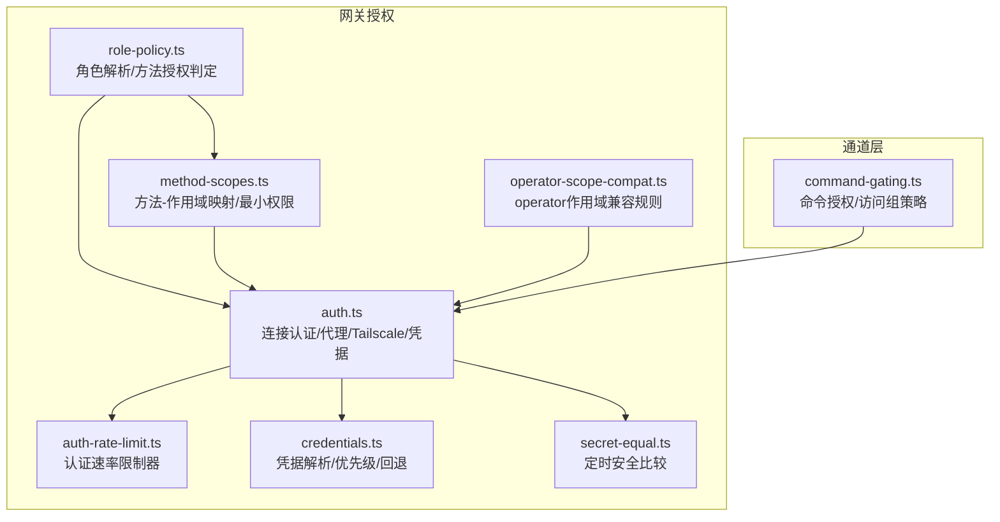
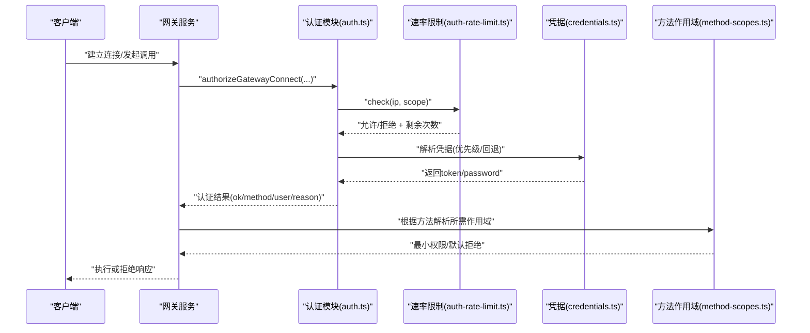
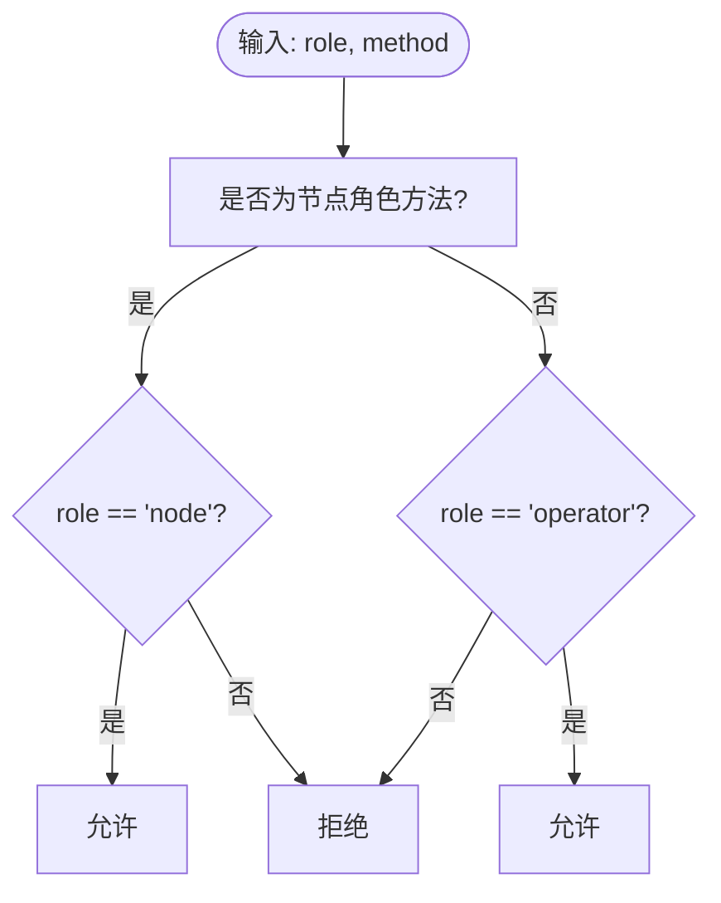
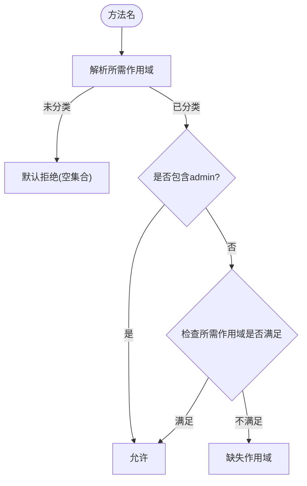
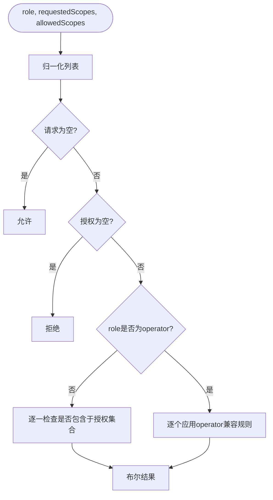
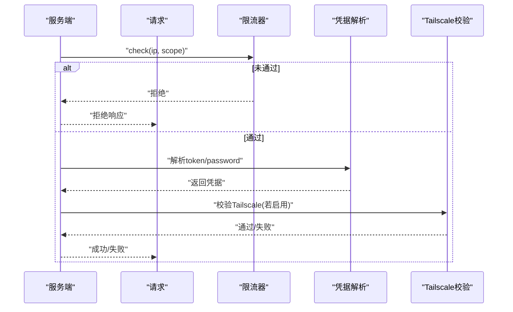
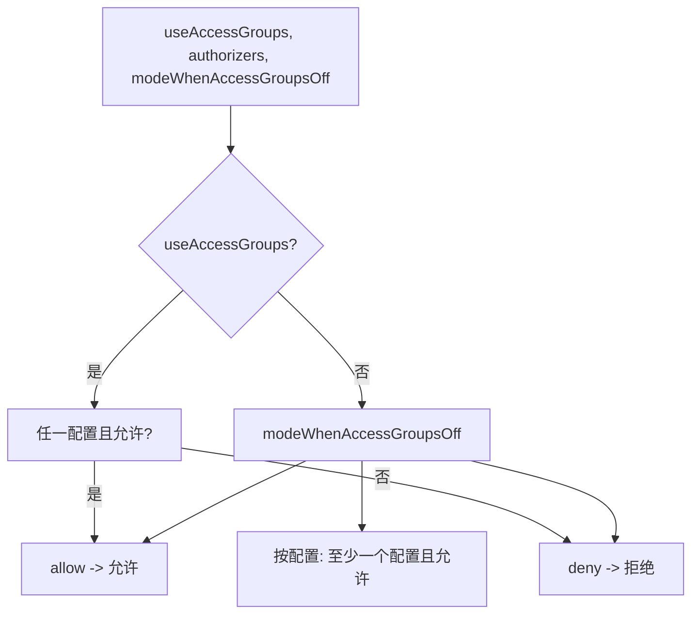
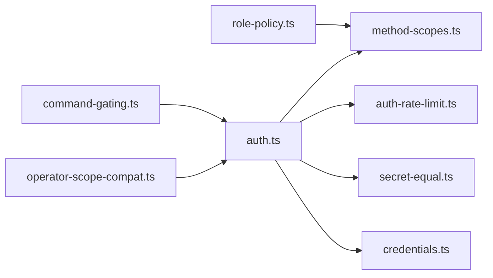
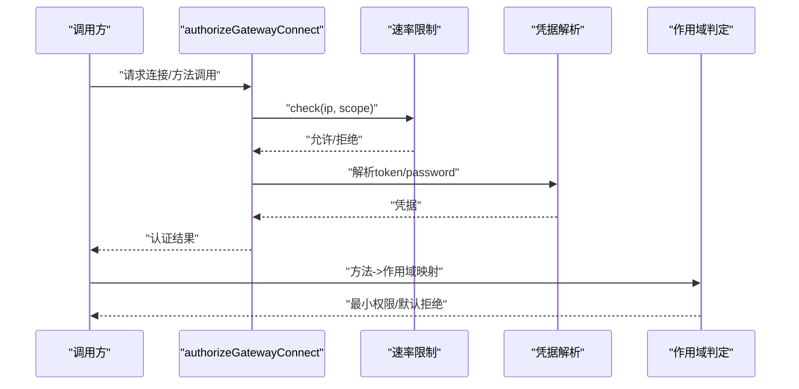

# 授权控制

<cite>
**本文引用的文件**
- [src/gateway/role-policy.ts](file://src/gateway/role-policy.ts)
- [src/gateway/method-scopes.ts](file://src/gateway/method-scopes.ts)
- [src/shared/operator-scope-compat.ts](file://src/shared/operator-scope-compat.ts)
- [src/gateway/auth.ts](file://src/gateway/auth.ts)
- [src/gateway/auth-rate-limit.ts](file://src/gateway/auth-rate-limit.ts)
- [src/gateway/credentials.ts](file://src/gateway/credentials.ts)
- [src/security/secret-equal.ts](file://src/security/secret-equal.ts)
- [src/channels/command-gating.ts](file://src/channels/command-gating.ts)
- [docs/gateway/authentication.md](file://docs/gateway/authentication.md)
- [docs/gateway/configuration-reference.md](file://docs/gateway/configuration-reference.md)
</cite>

## 目录
1. [简介](#简介)
2. [项目结构](#项目结构)
3. [核心组件](#核心组件)
4. [架构总览](#架构总览)
5. [详细组件分析](#详细组件分析)
6. [依赖关系分析](#依赖关系分析)
7. [性能考量](#性能考量)
8. [故障排查指南](#故障排查指南)
9. [结论](#结论)
10. [附录](#附录)

## 简介
本文件面向OpenClaw网关授权控制系统，系统性阐述基于角色的访问控制（RBAC）模型、方法作用域限制、权限继承与默认拒绝原则、授权决策流程、权限缓存策略与审计日志建议、权限配置示例、权限提升机制与安全边界保护，并提供策略配置与问题排查指南。目标是帮助开发者与运维人员在理解代码实现的基础上，正确配置与维护网关的安全边界。

## 项目结构
围绕授权控制的关键模块分布于以下位置：
- 网关角色与方法作用域：src/gateway/role-policy.ts、src/gateway/method-scopes.ts
- 操作者作用域兼容与校验：src/shared/operator-scope-compat.ts
- 网关连接认证与速率限制：src/gateway/auth.ts、src/gateway/auth-rate-limit.ts、src/gateway/credentials.ts、src/security/secret-equal.ts
- 命令级访问组与控制命令门禁：src/channels/command-gating.ts
- 文档参考：docs/gateway/authentication.md、docs/gateway/configuration-reference.md

**图表来源**
- [src/gateway/role-policy.ts](file://src/gateway/role-policy.ts#L1-L24)
- [src/gateway/method-scopes.ts](file://src/gateway/method-scopes.ts#L1-L213)
- [src/shared/operator-scope-compat.ts](file://src/shared/operator-scope-compat.ts#L1-L50)
- [src/gateway/auth.ts](file://src/gateway/auth.ts#L1-L491)
- [src/gateway/auth-rate-limit.ts](file://src/gateway/auth-rate-limit.ts#L1-L233)
- [src/gateway/credentials.ts](file://src/gateway/credentials.ts#L1-L279)
- [src/security/secret-equal.ts](file://src/security/secret-equal.ts#L1-L13)
- [src/channels/command-gating.ts](file://src/channels/command-gating.ts#L1-L46)

**章节来源**
- [src/gateway/role-policy.ts](file://src/gateway/role-policy.ts#L1-L24)
- [src/gateway/method-scopes.ts](file://src/gateway/method-scopes.ts#L1-L213)
- [src/shared/operator-scope-compat.ts](file://src/shared/operator-scope-compat.ts#L1-L50)
- [src/gateway/auth.ts](file://src/gateway/auth.ts#L1-L491)
- [src/gateway/auth-rate-limit.ts](file://src/gateway/auth-rate-limit.ts#L1-L233)
- [src/gateway/credentials.ts](file://src/gateway/credentials.ts#L1-L279)
- [src/security/secret-equal.ts](file://src/security/secret-equal.ts#L1-L13)
- [src/channels/command-gating.ts](file://src/channels/command-gating.ts#L1-L46)

## 核心组件
- 角色与方法授权
  - 角色集合与解析：支持“operator”“node”，并提供角色到方法的授权判定。
  - 方法分类：区分节点角色方法与操作者作用域方法，未分类方法默认拒绝。
- 操作者作用域与继承
  - 定义operator.admin、operator.read、operator.write、operator.approvals、operator.pairing等作用域。
  - 作用域继承：admin覆盖所有；read可被write提升；特定方法按最小权限匹配。
- 连接认证与凭据
  - 支持none/token/password/trusted-proxy模式，含Tailscale头认证（WS控制界面启用）。
  - 凭据解析优先级与回退策略，支持环境变量与配置文件。
- 速率限制
  - 内存滑动窗口限流，按IP+作用域计数，支持环回豁免与周期清理。
- 命令门禁
  - 基于访问组(useAccessGroups)与作者器(authorizers)的命令授权决策，支持“允许/拒绝/按配置”三种模式。

**章节来源**
- [src/gateway/role-policy.ts](file://src/gateway/role-policy.ts#L1-L24)
- [src/gateway/method-scopes.ts](file://src/gateway/method-scopes.ts#L1-L213)
- [src/shared/operator-scope-compat.ts](file://src/shared/operator-scope-compat.ts#L1-L50)
- [src/gateway/auth.ts](file://src/gateway/auth.ts#L1-L491)
- [src/gateway/auth-rate-limit.ts](file://src/gateway/auth-rate-limit.ts#L1-L233)
- [src/gateway/credentials.ts](file://src/gateway/credentials.ts#L1-L279)
- [src/channels/command-gating.ts](file://src/channels/command-gating.ts#L1-L46)

## 架构总览
下图展示从请求接入到授权决策与速率限制的整体流程，以及与凭据解析、作用域映射的关系。

**图表来源**
- [src/gateway/auth.ts](file://src/gateway/auth.ts#L367-L491)
- [src/gateway/auth-rate-limit.ts](file://src/gateway/auth-rate-limit.ts#L141-L172)
- [src/gateway/credentials.ts](file://src/gateway/credentials.ts#L100-L127)
- [src/gateway/method-scopes.ts](file://src/gateway/method-scopes.ts#L174-L213)

## 详细组件分析

### RBAC模型与角色权限
- 角色定义
  - 支持“operator”“node”两类角色，其他值解析为null。
- 方法授权
  - 节点角色方法仅“node”角色可调用；非节点方法仅“operator”角色可调用。
- 设备身份豁免
  - 当使用共享认证且角色为“operator”时，可跳过设备身份绑定（用于受信任环境的控制界面登录）。

**图表来源**
- [src/gateway/role-policy.ts](file://src/gateway/role-policy.ts#L18-L23)

**章节来源**
- [src/gateway/role-policy.ts](file://src/gateway/role-policy.ts#L1-L24)

### 方法作用域与最小权限
- 作用域枚举
  - operator.admin、operator.read、operator.write、operator.approvals、operator.pairing。
- 方法-作用域映射
  - 使用METHOD_SCOPE_GROUPS将具体方法归类至对应作用域。
  - 对以特定前缀开头的方法直接判定为admin。
- 最小权限与默认拒绝
  - resolveLeastPrivilegeOperatorScopesForMethod返回所需作用域集合；未分类方法默认为空（即默认拒绝）。
- 授权判定
  - 若授予admin，则全部允许；否则按read/write/admin逐级提升判断。

**图表来源**
- [src/gateway/method-scopes.ts](file://src/gateway/method-scopes.ts#L174-L205)

**章节来源**
- [src/gateway/method-scopes.ts](file://src/gateway/method-scopes.ts#L1-L213)

### 操作者作用域兼容与继承
- 兼容规则
  - admin作用域可满足所有以“operator.”前缀的请求。
  - read可由read或write满足；write只能由write满足。
- 列表归一化
  - 去重与空白裁剪，避免重复与空项影响判定。
- 统一授权入口
  - roleScopesAllow对请求作用域逐一验证，确保每个请求均被授予。

**图表来源**
- [src/shared/operator-scope-compat.ts](file://src/shared/operator-scope-compat.ts#L31-L49)

**章节来源**
- [src/shared/operator-scope-compat.ts](file://src/shared/operator-scope-compat.ts#L1-L50)

### 连接认证与凭据解析
- 认证模式
  - none/token/password/trusted-proxy；默认token；支持通过覆盖参数强制指定。
  - WS控制界面允许Tailscale头认证（仅该表面启用），HTTP禁用。
- Tailscale认证
  - 需要本地直连且具备特定转发头；通过WHOIS校验用户一致性。
- 速率限制
  - 失败尝试按{scope, clientIp}计数；环回地址默认豁免；周期清理内存占用。
- 凭据解析
  - 支持配置优先与环境变量优先两种策略；远程模式下token/password可回退到本地或环境。
- 安全比较
  - 使用定时安全比较函数防止时序攻击。

**图表来源**
- [src/gateway/auth.ts](file://src/gateway/auth.ts#L367-L472)
- [src/gateway/auth-rate-limit.ts](file://src/gateway/auth-rate-limit.ts#L141-L172)
- [src/gateway/credentials.ts](file://src/gateway/credentials.ts#L100-L127)
- [src/security/secret-equal.ts](file://src/security/secret-equal.ts#L1-L13)

**章节来源**
- [src/gateway/auth.ts](file://src/gateway/auth.ts#L1-L491)
- [src/gateway/auth-rate-limit.ts](file://src/gateway/auth-rate-limit.ts#L1-L233)
- [src/gateway/credentials.ts](file://src/gateway/credentials.ts#L1-L279)
- [src/security/secret-equal.ts](file://src/security/secret-equal.ts#L1-L13)

### 命令级访问组与控制命令门禁
- 访问组策略
  - useAccessGroups为true时，必须至少有一个作者器配置且允许，命令才被授权。
  - useAccessGroups为false时，modeWhenAccessGroupsOff决定行为：allow/deny/按配置。
- 控制命令门禁
  - allowTextCommands与hasControlCommand共同决定是否阻止；当允许文本命令但无授权时，应阻断。

**图表来源**
- [src/channels/command-gating.ts](file://src/channels/command-gating.ts#L8-L45)

**章节来源**
- [src/channels/command-gating.ts](file://src/channels/command-gating.ts#L1-L46)

## 依赖关系分析
- 组件耦合
  - role-policy依赖method-scopes进行方法分类与授权判定。
  - auth依赖credentials解析凭据、secret-equal进行安全比较、auth-rate-limit进行速率限制。
  - operator-scope-compat独立提供operator作用域兼容逻辑，供通用场景复用。
  - command-gating作为通道层策略，依赖上层认证结果与配置。
- 外部集成点
  - Tailscale WHOIS查询用于身份校验。
  - 受信代理头用于外部SSO或前置网关的身份透传。

**图表来源**
- [src/gateway/role-policy.ts](file://src/gateway/role-policy.ts#L1-L24)
- [src/gateway/method-scopes.ts](file://src/gateway/method-scopes.ts#L1-L213)
- [src/shared/operator-scope-compat.ts](file://src/shared/operator-scope-compat.ts#L1-L50)
- [src/gateway/auth.ts](file://src/gateway/auth.ts#L1-L491)
- [src/gateway/auth-rate-limit.ts](file://src/gateway/auth-rate-limit.ts#L1-L233)
- [src/gateway/credentials.ts](file://src/gateway/credentials.ts#L1-L279)
- [src/security/secret-equal.ts](file://src/security/secret-equal.ts#L1-L13)
- [src/channels/command-gating.ts](file://src/channels/command-gating.ts#L1-L46)

**章节来源**
- [src/gateway/role-policy.ts](file://src/gateway/role-policy.ts#L1-L24)
- [src/gateway/method-scopes.ts](file://src/gateway/method-scopes.ts#L1-L213)
- [src/shared/operator-scope-compat.ts](file://src/shared/operator-scope-compat.ts#L1-L50)
- [src/gateway/auth.ts](file://src/gateway/auth.ts#L1-L491)
- [src/gateway/auth-rate-limit.ts](file://src/gateway/auth-rate-limit.ts#L1-L233)
- [src/gateway/credentials.ts](file://src/gateway/credentials.ts#L1-L279)
- [src/security/secret-equal.ts](file://src/security/secret-equal.ts#L1-L13)
- [src/channels/command-gating.ts](file://src/channels/command-gating.ts#L1-L46)

## 性能考量
- 速率限制
  - 滑动窗口与周期清理避免Map无限增长；环回地址豁免减少本地调试干扰。
- 认证比较
  - 使用定时安全比较，避免时序侧信道泄露。
- 作用域判定
  - 采用预构建映射与集合查找，时间复杂度低；未分类方法快速默认拒绝。
- 建议
  - 在高并发场景下，结合受信代理与Tailscale头认证可减少凭据交互成本；合理设置速率限制阈值与窗口大小。

[本节为通用指导，无需列出章节来源]

## 故障排查指南
- 常见错误与定位
  - token_missing_config/password_missing_config：配置中未设置相应凭据。
  - token_mismatch/password_mismatch：提供的凭据与配置不一致。
  - unauthorized：未满足任何认证模式。
  - rate_limited：触发速率限制，需等待冷却或调整阈值。
  - tailscale_user_missing/tailscale_proxy_missing/tailscale_user_mismatch：Tailscale头认证失败。
  - trusted_proxy_config_missing/trusted_proxy_no_proxies_configured/trusted_proxy_user_missing/trusted_proxy_user_not_allowed：受信代理配置或用户不合法。
- 命令门禁
  - useAccessGroups开启但无配置作者器：命令将被拒绝。
  - modeWhenAccessGroupsOff=deny：关闭访问组时强制拒绝。
- 参考文档
  - 网关认证与凭据存储：参阅文档“Authentication”。
  - 命令与访问组策略：参阅文档“Configuration Reference”。

**章节来源**
- [src/gateway/auth.ts](file://src/gateway/auth.ts#L437-L472)
- [src/gateway/auth-rate-limit.ts](file://src/gateway/auth-rate-limit.ts#L141-L172)
- [docs/gateway/authentication.md](file://docs/gateway/authentication.md#L1-L180)
- [docs/gateway/configuration-reference.md](file://docs/gateway/configuration-reference.md#L720-L754)

## 结论
OpenClaw网关授权体系以清晰的角色与方法作用域为基础，结合最小权限与默认拒绝原则，辅以可信代理与Tailscale头认证、定时安全比较与内存滑动窗口限流，形成完整的安全边界。命令层通过访问组策略进一步细化控制面，适合在多渠道、多账户环境下提供细粒度的授权与审计基础。建议在生产环境中启用速率限制、严格凭据管理与最小权限授权，并结合文档中的配置示例与排障指引持续优化。

[本节为总结，无需列出章节来源]

## 附录

### 权限配置示例（概念性）
- 网关认证模式
  - token：设置gateway.auth.token或环境变量，适用于长期运行的网关主机。
  - password：适用于短期或受限场景，注意安全传输与轮换。
  - trusted-proxy：前置代理透传用户身份，需配置userHeader与可选allowUsers。
  - none：仅限本地或受控网络访问。
- 操作者作用域
  - 通过CLI或配置授予operator.read、operator.write、operator.admin、operator.approvals、operator.pairing等。
- 命令访问组
  - useAccessGroups=true时，需配置至少一个authorizer且允许；否则命令被拒绝。
  - modeWhenAccessGroupsOff=deny可强制关闭访问组时的放行。

**章节来源**
- [docs/gateway/authentication.md](file://docs/gateway/authentication.md#L1-L180)
- [docs/gateway/configuration-reference.md](file://docs/gateway/configuration-reference.md#L720-L754)
- [src/gateway/credentials.ts](file://src/gateway/credentials.ts#L100-L127)
- [src/gateway/auth.ts](file://src/gateway/auth.ts#L217-L292)

### 授权决策流程（代码级）

**图表来源**
- [src/gateway/auth.ts](file://src/gateway/auth.ts#L367-L472)
- [src/gateway/auth-rate-limit.ts](file://src/gateway/auth-rate-limit.ts#L141-L172)
- [src/gateway/credentials.ts](file://src/gateway/credentials.ts#L100-L127)
- [src/gateway/method-scopes.ts](file://src/gateway/method-scopes.ts#L174-L213)