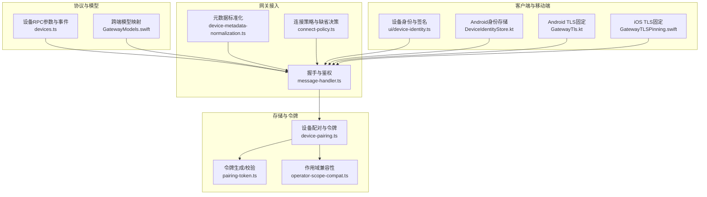
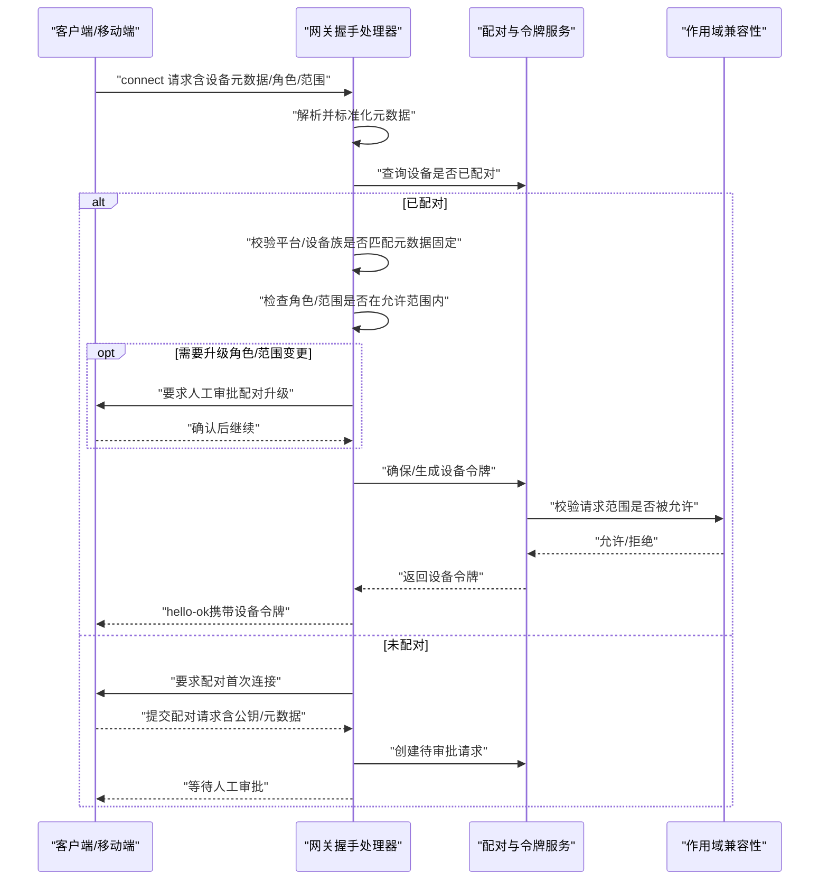
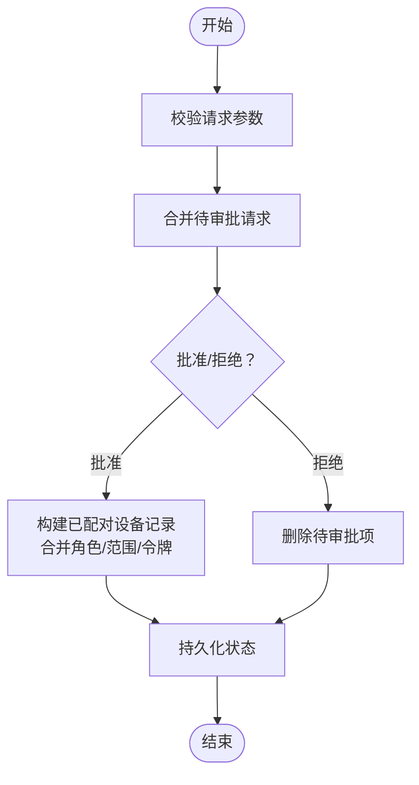
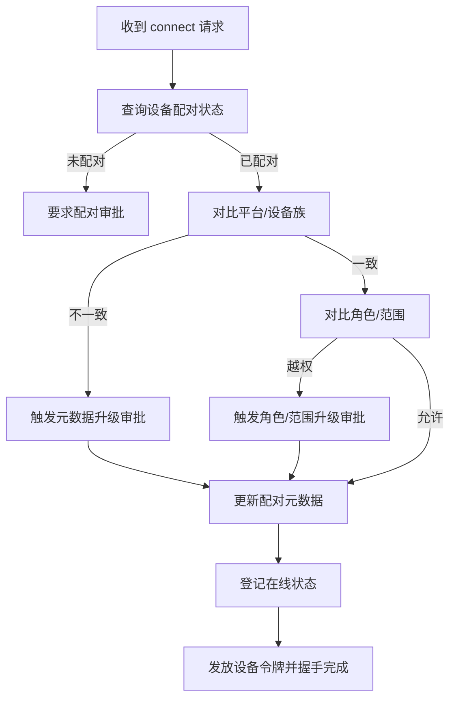
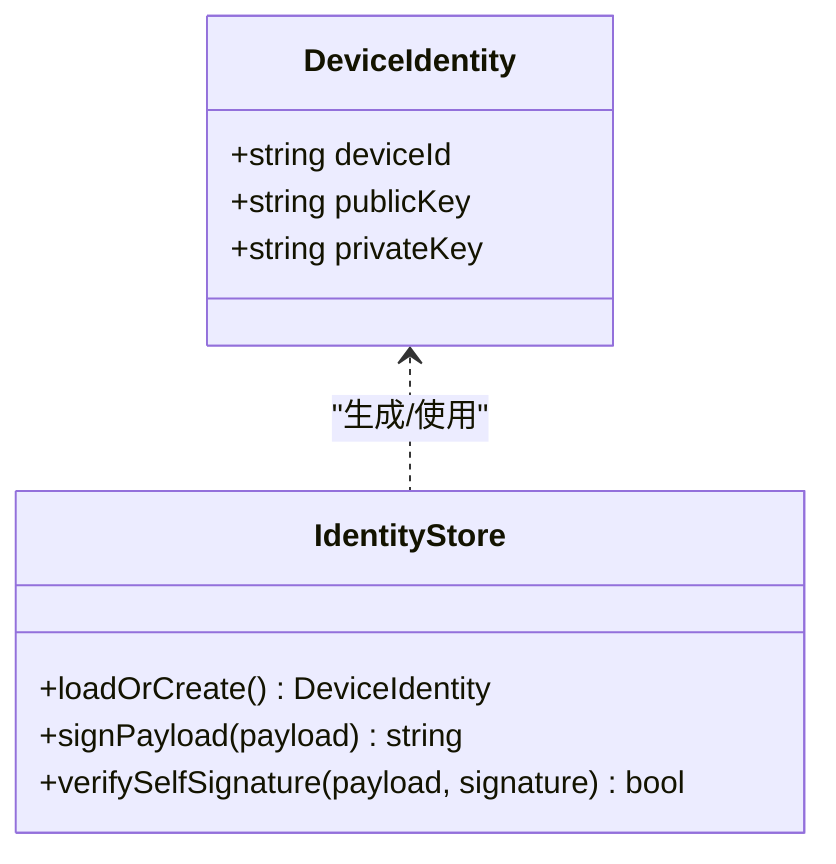
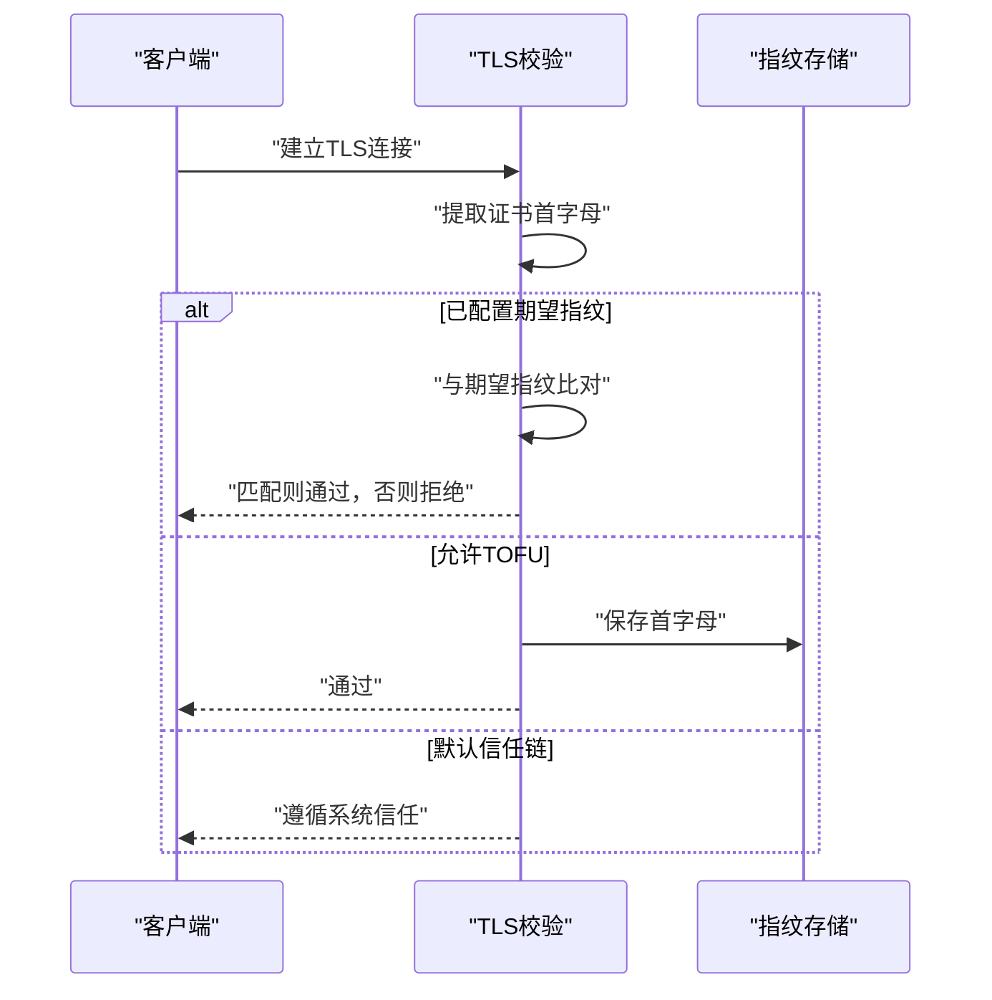
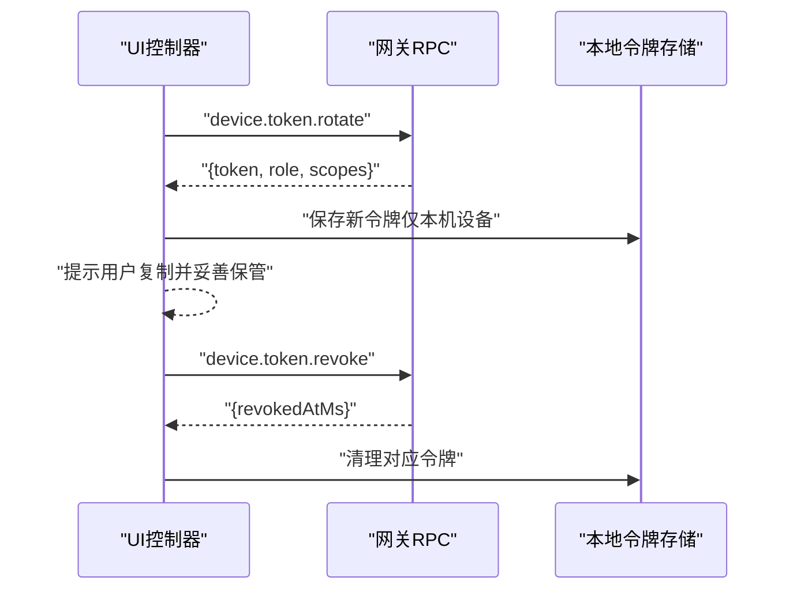
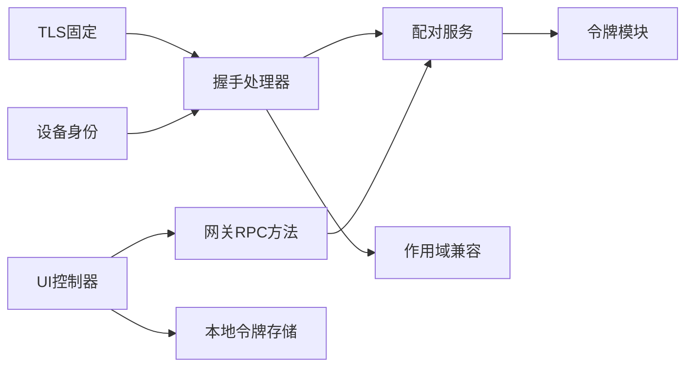

# 设备信任体系

<cite>
**本文引用的文件**
- [src/infra/device-pairing.ts](file://src/infra/device-pairing.ts)
- [src/gateway/protocol/schema/devices.ts](file://src/gateway/protocol/schema/devices.ts)
- [src/gateway/server/ws-connection/message-handler.ts](file://src/gateway/server/ws-connection/message-handler.ts)
- [src/gateway/device-metadata-normalization.ts](file://src/gateway/device-metadata-normalization.ts)
- [src/infra/pairing-token.ts](file://src/infra/pairing-token.ts)
- [src/shared/operator-scope-compat.ts](file://src/shared/operator-scope-compat.ts)
- [apps/android/app/src/main/java/ai/openclaw/android/gateway/GatewayTls.kt](file://apps/android/app/src/main/java/ai/openclaw/android/gateway/GatewayTls.kt)
- [apps/shared/OpenClawKit/Sources/OpenClawKit/GatewayTLSPinning.swift](file://apps/shared/OpenClawKit/Sources/OpenClawKit/GatewayTLSPinning.swift)
- [ui/src/ui/device-identity.ts](file://ui/src/ui/device-identity.ts)
- [apps/android/app/src/main/java/ai/openclaw/android/gateway/DeviceIdentityStore.kt](file://apps/android/app/src/main/java/ai/openclaw/android/gateway/DeviceIdentityStore.kt)
- [apps/shared/OpenClawKit/Sources/OpenClawKit/GatewayModels.swift](file://apps/shared/OpenClawKit/Sources/OpenClawKit/GatewayModels.swift)
- [src/gateway/server-methods/devices.ts](file://src/gateway/server-methods/devices.ts)
- [ui/src/ui/controllers/devices.ts](file://ui/src/ui/controllers/devices.ts)
- [src/gateway/server/ws-connection/connect-policy.ts](file://src/gateway/server/ws-connection/connect-policy.ts)
</cite>

## 目录
1. [简介](#简介)
2. [项目结构](#项目结构)
3. [核心组件](#核心组件)
4. [架构总览](#架构总览)
5. [详细组件分析](#详细组件分析)
6. [依赖关系分析](#依赖关系分析)
7. [性能考量](#性能考量)
8. [故障排查指南](#故障排查指南)
9. [结论](#结论)
10. [附录](#附录)

## 简介
本文件系统化梳理 OpenClaw 的设备信任体系，覆盖设备配对的信任建立流程、设备标识符与硬件指纹管理、信任锚点（TLS 指纹固定）设置、设备元数据标准化、白名单与策略控制、远程设备信任验证与在线状态监控、信任降级与异常处理机制。文档同时提供信任策略配置要点、信任链维护建议以及设备配对与信任问题的诊断步骤。

## 项目结构
OpenClaw 将“设备信任”相关能力分布在多层：
- 协议与模型层：定义设备配对与令牌操作的 RPC 参数与事件结构
- 网关接入层：负责握手、元数据校验、角色/范围授权、在线状态与访问控制
- 存储与令牌层：持久化配对状态、生成/校验设备令牌、轮换与吊销
- 客户端与移动端：设备身份生成与签名、TLS 指纹固定与 TOFU 支持
- UI 控制器：面向用户的令牌轮换与吊销操作入口

图表来源
- [src/gateway/protocol/schema/devices.ts](file://src/gateway/protocol/schema/devices.ts#L1-L68)
- [apps/shared/OpenClawKit/Sources/OpenClawKit/GatewayModels.swift](file://apps/shared/OpenClawKit/Sources/OpenClawKit/GatewayModels.swift#L3053-L3119)
- [src/gateway/server/ws-connection/message-handler.ts](file://src/gateway/server/ws-connection/message-handler.ts#L209-L408)
- [src/gateway/device-metadata-normalization.ts](file://src/gateway/device-metadata-normalization.ts#L1-L32)
- [src/gateway/server/ws-connection/connect-policy.ts](file://src/gateway/server/ws-connection/connect-policy.ts#L46-L66)
- [src/infra/device-pairing.ts](file://src/infra/device-pairing.ts#L1-L654)
- [src/infra/pairing-token.ts](file://src/infra/pairing-token.ts#L1-L13)
- [src/shared/operator-scope-compat.ts](file://src/shared/operator-scope-compat.ts#L1-L50)
- [ui/src/ui/device-identity.ts](file://ui/src/ui/device-identity.ts#L1-L113)
- [apps/android/app/src/main/java/ai/openclaw/android/gateway/DeviceIdentityStore.kt](file://apps/android/app/src/main/java/ai/openclaw/android/gateway/DeviceIdentityStore.kt#L63-L153)
- [apps/android/app/src/main/java/ai/openclaw/android/gateway/GatewayTls.kt](file://apps/android/app/src/main/java/ai/openclaw/android/gateway/GatewayTls.kt#L35-L102)
- [apps/shared/OpenClawKit/Sources/OpenClawKit/GatewayTLSPinning.swift](file://apps/shared/OpenClawKit/Sources/OpenClawKit/GatewayTLSPinning.swift#L89-L137)

章节来源
- [src/gateway/protocol/schema/devices.ts](file://src/gateway/protocol/schema/devices.ts#L1-L68)
- [src/gateway/server/ws-connection/message-handler.ts](file://src/gateway/server/ws-connection/message-handler.ts#L209-L408)
- [src/infra/device-pairing.ts](file://src/infra/device-pairing.ts#L1-L654)

## 核心组件
- 设备配对与令牌管理：负责待审批请求合并、批准/拒绝、设备信息更新、令牌生成/轮换/吊销与校验
- 握手与信任校验：在连接阶段进行设备配对状态检查、元数据匹配、角色/范围升级审批、在线状态登记
- 设备身份与硬件指纹：基于 Ed25519 生成设备密钥对，使用公钥派生设备 ID（SHA-256），用于唯一标识
- TLS 信任锚点：通过服务器证书首字母固定（TLS Pinning）或 TOFU（信任初始使用）建立信任锚点
- 元数据标准化：统一平台/设备族等字段的大小写与 Unicode 规范化，确保跨语言一致性
- 作用域与策略：支持 operator.* 语义与范围推导，结合白名单与策略实现最小权限

章节来源
- [src/infra/device-pairing.ts](file://src/infra/device-pairing.ts#L272-L420)
- [src/gateway/server/ws-connection/message-handler.ts](file://src/gateway/server/ws-connection/message-handler.ts#L870-L956)
- [ui/src/ui/device-identity.ts](file://ui/src/ui/device-identity.ts#L49-L105)
- [apps/android/app/src/main/java/ai/openclaw/android/gateway/GatewayTls.kt](file://apps/android/app/src/main/java/ai/openclaw/android/gateway/GatewayTls.kt#L35-L102)
- [apps/shared/OpenClawKit/Sources/OpenClawKit/GatewayTLSPinning.swift](file://apps/shared/OpenClawKit/Sources/OpenClawKit/GatewayTLSPinning.swift#L89-L137)
- [src/gateway/device-metadata-normalization.ts](file://src/gateway/device-metadata-normalization.ts#L13-L31)
- [src/shared/operator-scope-compat.ts](file://src/shared/operator-scope-compat.ts#L18-L49)

## 架构总览
下图展示从客户端发起连接到网关完成信任校验与令牌发放的关键交互。

图表来源
- [src/gateway/server/ws-connection/message-handler.ts](file://src/gateway/server/ws-connection/message-handler.ts#L870-L956)
- [src/infra/device-pairing.ts](file://src/infra/device-pairing.ts#L272-L384)
- [src/shared/operator-scope-compat.ts](file://src/shared/operator-scope-compat.ts#L31-L49)

## 详细组件分析

### 组件A：设备配对与令牌生命周期
- 待审批请求合并：当同一设备多次发起配对请求时，按字段合并并保留静默策略
- 批准流程：合并角色/范围，生成新令牌，记录批准时间，持久化
- 拒绝与移除：删除待审批项或从已配对列表移除
- 令牌管理：生成、轮换（受批准范围限制）、吊销、校验（含过期/撤销检查）

图表来源
- [src/infra/device-pairing.ts](file://src/infra/device-pairing.ts#L159-L182)
- [src/infra/device-pairing.ts](file://src/infra/device-pairing.ts#L320-L384)
- [src/infra/device-pairing.ts](file://src/infra/device-pairing.ts#L386-L403)

章节来源
- [src/infra/device-pairing.ts](file://src/infra/device-pairing.ts#L140-L220)
- [src/infra/device-pairing.ts](file://src/infra/device-pairing.ts#L320-L403)

### 组件B：握手与信任校验（元数据固定、角色/范围升级）
- 元数据固定：若设备已配对，连接时要求平台/设备族与配对记录一致；不一致则触发“元数据升级”审批
- 角色/范围升级：若请求的角色/范围不在已批准集合内，触发“角色/范围升级”审批
- 在线状态登记：连接成功后登记 presence，便于远程监控与信任可视化

图表来源
- [src/gateway/server/ws-connection/message-handler.ts](file://src/gateway/server/ws-connection/message-handler.ts#L870-L956)
- [src/gateway/server/ws-connection/message-handler.ts](file://src/gateway/server/ws-connection/message-handler.ts#L209-L234)
- [src/gateway/device-metadata-normalization.ts](file://src/gateway/device-metadata-normalization.ts#L13-L31)

章节来源
- [src/gateway/server/ws-connection/message-handler.ts](file://src/gateway/server/ws-connection/message-handler.ts#L870-L956)
- [src/gateway/device-metadata-normalization.ts](file://src/gateway/device-metadata-normalization.ts#L13-L31)

### 组件C：设备身份与硬件指纹
- 设备身份：生成 Ed25519 密钥对，派生设备 ID（公钥 SHA-256），在本地持久化
- 自签名与验证：设备对自身 payload 进行签名，供网关侧验证设备身份
- 跨端一致性：UI 与 Android/iOS 均采用相同算法生成/校验

图表来源
- [ui/src/ui/device-identity.ts](file://ui/src/ui/device-identity.ts#L11-L113)
- [apps/android/app/src/main/java/ai/openclaw/android/gateway/DeviceIdentityStore.kt](file://apps/android/app/src/main/java/ai/openclaw/android/gateway/DeviceIdentityStore.kt#L63-L153)

章节来源
- [ui/src/ui/device-identity.ts](file://ui/src/ui/device-identity.ts#L49-L105)
- [apps/android/app/src/main/java/ai/openclaw/android/gateway/DeviceIdentityStore.kt](file://apps/android/app/src/main/java/ai/openclaw/android/gateway/DeviceIdentityStore.kt#L126-L153)

### 组件D：TLS 信任锚点（固定与 TOFU）
- 固定模式：客户端校验证书首字母与预设值一致，否则拒绝
- TOFU 模式：首次连接接受并可选择保存服务器证书首字母，后续严格匹配
- 跨端实现：Android 与 iOS 均提供相应逻辑

图表来源
- [apps/android/app/src/main/java/ai/openclaw/android/gateway/GatewayTls.kt](file://apps/android/app/src/main/java/ai/openclaw/android/gateway/GatewayTls.kt#L35-L102)
- [apps/shared/OpenClawKit/Sources/OpenClawKit/GatewayTLSPinning.swift](file://apps/shared/OpenClawKit/Sources/OpenClawKit/GatewayTLSPinning.swift#L89-L137)

章节来源
- [apps/android/app/src/main/java/ai/openclaw/android/gateway/GatewayTls.kt](file://apps/android/app/src/main/java/ai/openclaw/android/gateway/GatewayTls.kt#L35-L102)
- [apps/shared/OpenClawKit/Sources/OpenClawKit/GatewayTLSPinning.swift](file://apps/shared/OpenClawKit/Sources/OpenClawKit/GatewayTLSPinning.swift#L89-L137)

### 组件E：令牌生成、轮换与吊销（RPC）
- RPC 参数模型：设备令牌轮换/吊销的参数结构在多端保持一致
- 网关方法：提供 device.token.rotate 与 device.token.revoke 方法
- UI 控制器：提供轮换/吊销入口，轮换成功后提示用户复制并安全保存新令牌

图表来源
- [apps/shared/OpenClawKit/Sources/OpenClawKit/GatewayModels.swift](file://apps/shared/OpenClawKit/Sources/OpenClawKit/GatewayModels.swift#L3081-L3119)
- [src/gateway/server-methods/devices.ts](file://src/gateway/server-methods/devices.ts#L157-L215)
- [ui/src/ui/controllers/devices.ts](file://ui/src/ui/controllers/devices.ts#L105-L159)

章节来源
- [apps/shared/OpenClawKit/Sources/OpenClawKit/GatewayModels.swift](file://apps/shared/OpenClawKit/Sources/OpenClawKit/GatewayModels.swift#L3081-L3119)
- [src/gateway/server-methods/devices.ts](file://src/gateway/server-methods/devices.ts#L157-L215)
- [ui/src/ui/controllers/devices.ts](file://ui/src/ui/controllers/devices.ts#L105-L159)

## 依赖关系分析
- 握手处理器依赖配对服务与作用域兼容模块，确保连接前完成设备身份、元数据、角色/范围三要素校验
- 配对服务依赖令牌生成/校验模块，保证令牌安全且可审计
- 客户端/移动端依赖设备身份模块与 TLS 固定模块，保障设备侧可信与网络侧可信
- UI 控制器依赖网关 RPC 与本地令牌存储，形成用户可操作的令牌生命周期闭环

图表来源
- [src/gateway/server/ws-connection/message-handler.ts](file://src/gateway/server/ws-connection/message-handler.ts#L870-L956)
- [src/infra/device-pairing.ts](file://src/infra/device-pairing.ts#L470-L508)
- [src/shared/operator-scope-compat.ts](file://src/shared/operator-scope-compat.ts#L31-L49)
- [src/infra/pairing-token.ts](file://src/infra/pairing-token.ts#L6-L12)
- [ui/src/ui/controllers/devices.ts](file://ui/src/ui/controllers/devices.ts#L105-L159)
- [src/gateway/server-methods/devices.ts](file://src/gateway/server-methods/devices.ts#L157-L215)

章节来源
- [src/gateway/server/ws-connection/message-handler.ts](file://src/gateway/server/ws-connection/message-handler.ts#L870-L956)
- [src/infra/device-pairing.ts](file://src/infra/device-pairing.ts#L470-L508)
- [src/shared/operator-scope-compat.ts](file://src/shared/operator-scope-compat.ts#L31-L49)

## 性能考量
- 并发与幂等：配对状态读写采用异步锁与原子写入，避免竞态与重复项
- TTL 与清理：待审批请求具备 TTL，定期清理过期项，降低内存占用
- 令牌校验：令牌比较使用常量时间比较，降低侧信道风险
- 在线状态：presence 登记与版本号管理，减少不必要的广播

章节来源
- [src/infra/device-pairing.ts](file://src/infra/device-pairing.ts#L81-L103)
- [src/infra/device-pairing.ts](file://src/infra/device-pairing.ts#L79)
- [src/infra/pairing-token.ts](file://src/infra/pairing-token.ts#L10-L12)

## 故障排查指南
- 无法连接（未配对）
  - 现象：首次连接被要求配对
  - 处理：在网关侧审批待审批请求，或在客户端发起配对请求
  - 参考：[src/gateway/server/ws-connection/message-handler.ts](file://src/gateway/server/ws-connection/message-handler.ts#L870-L877)
- 元数据升级被阻
  - 现象：平台/设备族与配对记录不一致，触发“元数据升级”审批
  - 处理：确认设备元数据是否应升级，必要时重新配对
  - 参考：[src/gateway/server/ws-connection/message-handler.ts](file://src/gateway/server/ws-connection/message-handler.ts#L889-L897)
- 角色/范围升级被阻
  - 现象：请求角色/范围超出已批准集合
  - 处理：在网关侧批准更高权限，或调整客户端请求
  - 参考：[src/gateway/server/ws-connection/message-handler.ts](file://src/gateway/server/ws-connection/message-handler.ts#L916-L951)
- 令牌校验失败
  - 现象：token-mismatch/token-revoked/device-not-paired/scope-mismatch
  - 处理：轮换令牌、确认吊销状态、核对角色与范围
  - 参考：[src/infra/device-pairing.ts](file://src/infra/device-pairing.ts#L470-L508)
- TLS 指纹不匹配
  - 现象：客户端拒绝连接或提示指纹不匹配
  - 处理：确认期望指纹、启用 TOFU 或修正信任链
  - 参考：[apps/android/app/src/main/java/ai/openclaw/android/gateway/GatewayTls.kt](file://apps/android/app/src/main/java/ai/openclaw/android/gateway/GatewayTls.kt#L50-L62), [apps/shared/OpenClawKit/Sources/OpenClawKit/GatewayTLSPinning.swift](file://apps/shared/OpenClawKit/Sources/OpenClawKit/GatewayTLSPinning.swift#L91-L98)
- 无设备身份
  - 现象：缺少设备身份导致无法完成某些自验证流程
  - 处理：生成/恢复设备身份，确保本地存储完整
  - 参考：[ui/src/ui/device-identity.ts](file://ui/src/ui/device-identity.ts#L60-L105), [apps/android/app/src/main/java/ai/openclaw/android/gateway/DeviceIdentityStore.kt](file://apps/android/app/src/main/java/ai/openclaw/android/gateway/DeviceIdentityStore.kt#L94-L153)

章节来源
- [src/gateway/server/ws-connection/message-handler.ts](file://src/gateway/server/ws-connection/message-handler.ts#L870-L951)
- [src/infra/device-pairing.ts](file://src/infra/device-pairing.ts#L470-L508)
- [apps/android/app/src/main/java/ai/openclaw/android/gateway/GatewayTls.kt](file://apps/android/app/src/main/java/ai/openclaw/android/gateway/GatewayTls.kt#L50-L62)
- [apps/shared/OpenClawKit/Sources/OpenClawKit/GatewayTLSPinning.swift](file://apps/shared/OpenClawKit/Sources/OpenClawKit/GatewayTLSPinning.swift#L91-L98)
- [ui/src/ui/device-identity.ts](file://ui/src/ui/device-identity.ts#L60-L105)
- [apps/android/app/src/main/java/ai/openclaw/android/gateway/DeviceIdentityStore.kt](file://apps/android/app/src/main/java/ai/openclaw/android/gateway/DeviceIdentityStore.kt#L94-L153)

## 结论
OpenClaw 的设备信任体系通过“设备身份—配对—令牌—握手校验—TLS锚点”的闭环设计，实现了跨端一致、可审计、可降级的设备信任机制。配合元数据标准化与作用域兼容策略，系统在功能扩展与安全边界之间取得平衡。建议在生产环境中启用 TLS 指纹固定、严格的配对审批与令牌轮换策略，并结合在线状态监控与白名单策略实现持续的安全运营。

## 附录

### 设备配对流程（端到端）
- 客户端生成设备身份并发起 connect
- 若未配对，网关要求配对；客户端提交公钥与元数据
- 网关创建待审批请求，等待人工审批
- 审批通过后，网关生成设备令牌并下发
- 后续连接时，网关校验元数据固定、角色/范围与令牌有效性

章节来源
- [src/gateway/server/ws-connection/message-handler.ts](file://src/gateway/server/ws-connection/message-handler.ts#L870-L956)
- [src/infra/device-pairing.ts](file://src/infra/device-pairing.ts#L272-L384)
- [ui/src/ui/device-identity.ts](file://ui/src/ui/device-identity.ts#L49-L105)

### 信任策略配置要点
- TLS 固定：在客户端配置期望指纹，或启用 TOFU 并安全存储首字母
- 元数据固定：确保平台/设备族与实际设备一致，避免跨设备误用
- 作用域与白名单：operator.* 范围需谨慎授予；结合白名单限制访问来源
- 令牌轮换：定期轮换令牌，吊销异常令牌，记录使用日志

章节来源
- [apps/android/app/src/main/java/ai/openclaw/android/gateway/GatewayTls.kt](file://apps/android/app/src/main/java/ai/openclaw/android/gateway/GatewayTls.kt#L35-L102)
- [apps/shared/OpenClawKit/Sources/OpenClawKit/GatewayTLSPinning.swift](file://apps/shared/OpenClawKit/Sources/OpenClawKit/GatewayTLSPinning.swift#L89-L137)
- [src/gateway/device-metadata-normalization.ts](file://src/gateway/device-metadata-normalization.ts#L13-L31)
- [src/shared/operator-scope-compat.ts](file://src/shared/operator-scope-compat.ts#L18-L49)
- [src/infra/device-pairing.ts](file://src/infra/device-pairing.ts#L572-L612)