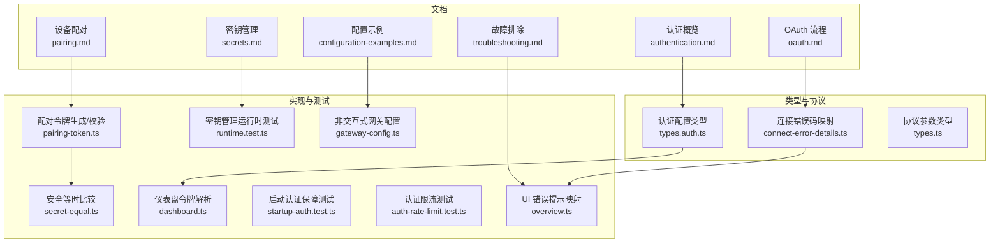
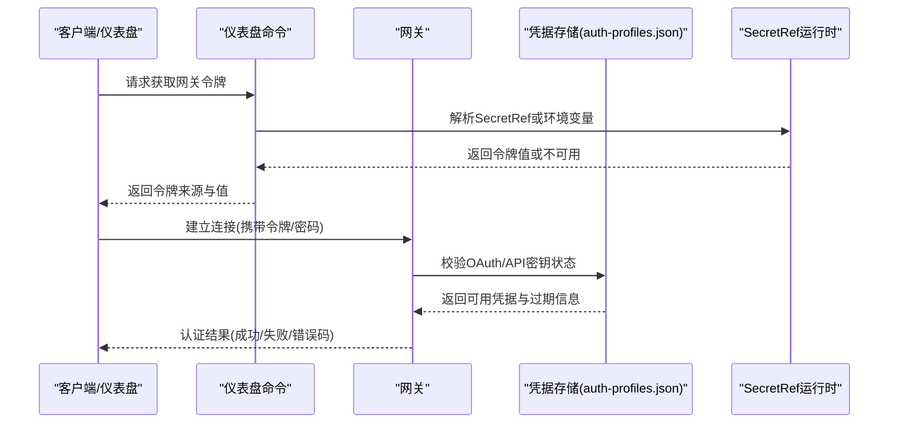
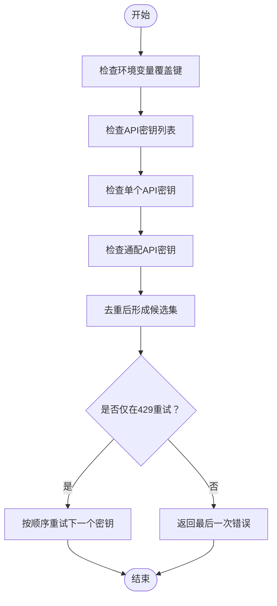
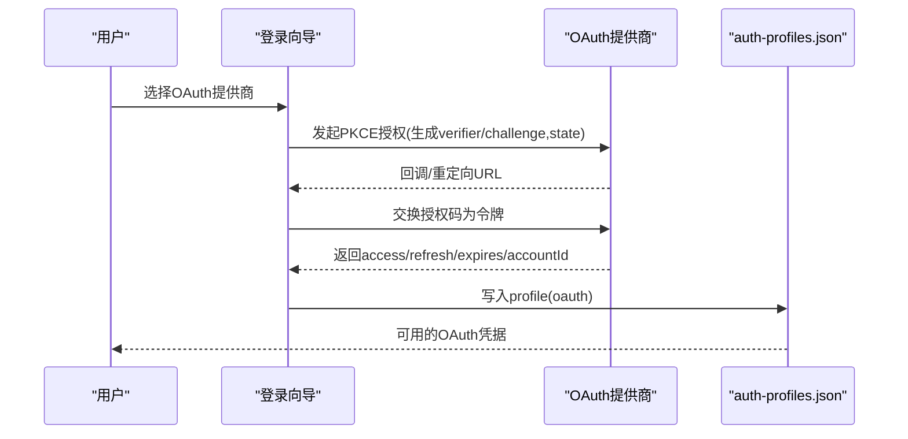
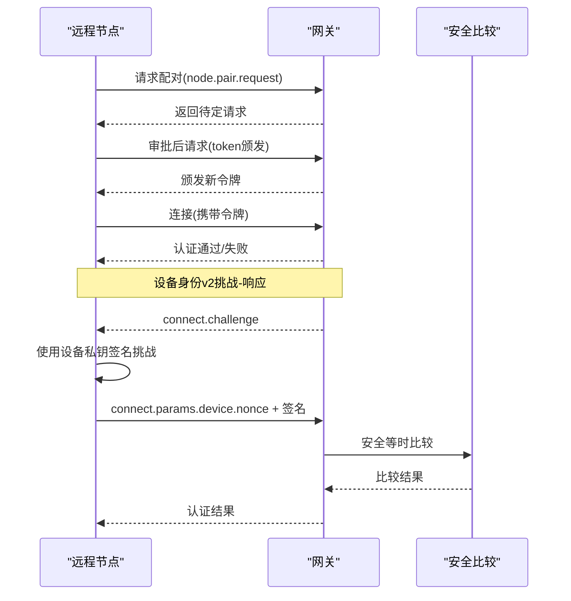
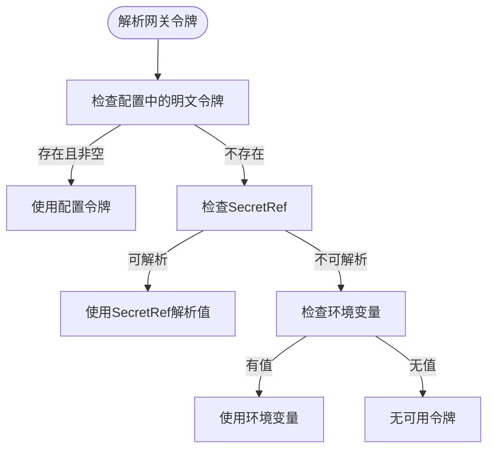
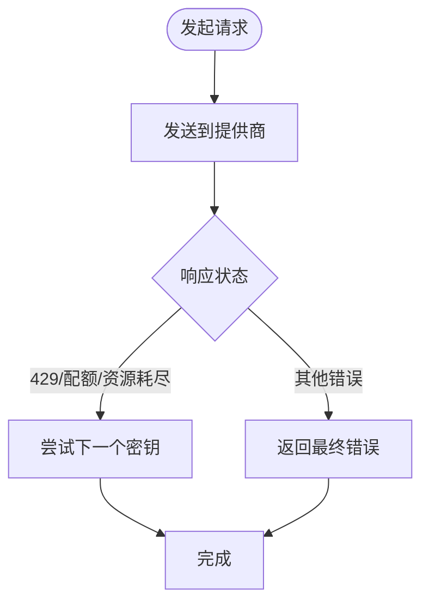
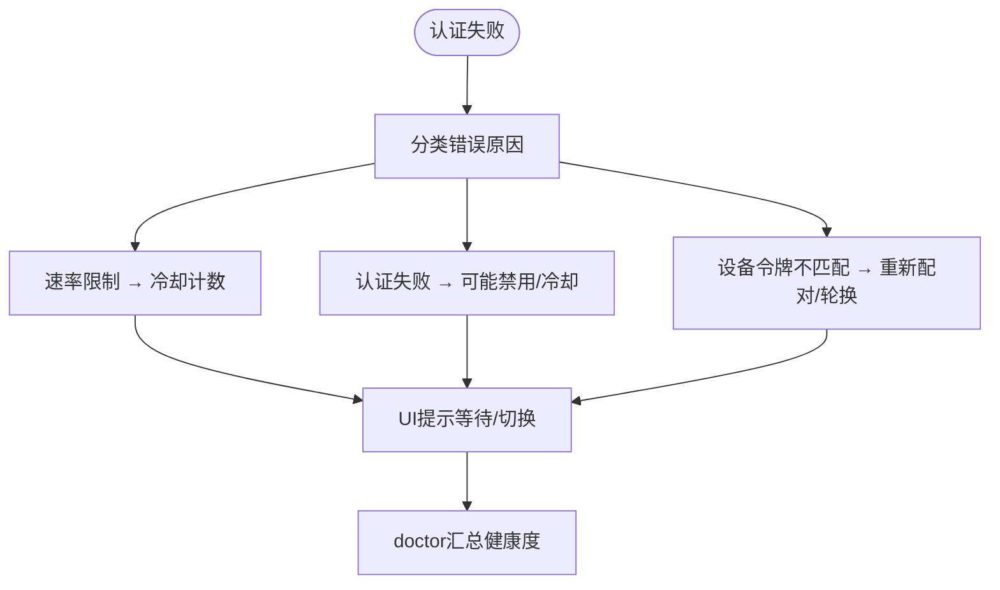
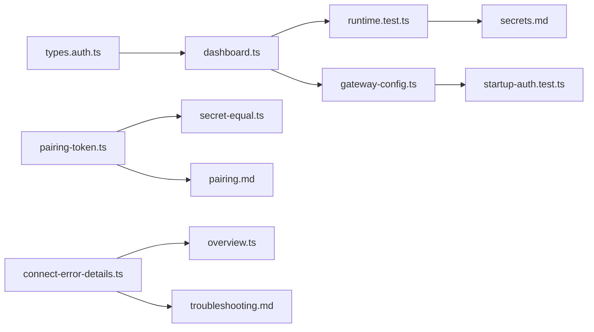

# 身份验证机制

<cite>
**本文引用的文件**
- [authentication.md](file://docs/gateway/authentication.md)
- [oauth.md](file://docs/concepts/oauth.md)
- [pairing.md](file://docs/gateway/pairing.md)
- [secrets.md](file://docs/gateway/secrets.md)
- [configuration-examples.md](file://docs/gateway/configuration-examples.md)
- [troubleshooting.md](file://docs/gateway/troubleshooting.md)
- [types.auth.ts](file://src/config/types.auth.ts)
- [pairing-token.ts](file://src/infra/pairing-token.ts)
- [secret-equal.ts](file://src/security/secret-equal.ts)
- [connect-error-details.ts](file://src/gateway/protocol/connect-error-details.ts)
- [dashboard.ts](file://src/commands/dashboard.ts)
- [startup-auth.test.ts](file://src/gateway/startup-auth.test.ts)
- [runtime.test.ts](file://src/secrets/runtime.test.ts)
- [gateway-config.ts](file://src/commands/onboard-non-interactive/local/gateway-config.ts)
- [auth-rate-limit.test.ts](file://src/gateway/auth-rate-limit.test.ts)
- [retry.md](file://docs/concepts/retry.md)
- [overview.ts](file://ui/src/ui/views/overview.ts)
- [list.status-command.ts](file://src/commands/models/list.status-command.ts)
- [list.probe.ts](file://src/commands/models/list.probe.ts)
- [setup-code.test.ts](file://src/pairing/setup-code.test.ts)
- [onboard-auth.config-core.ts](file://src/commands/onboard-auth.config-core.ts)
- [types.ts](file://src/gateway/protocol/schema/types.ts)
- [DebugHandler.kt](file://apps/android/app/src/main/java/ai/openclaw/android/node/DebugHandler.kt)
</cite>

## 目录
1. [简介](#简介)
2. [项目结构](#项目结构)
3. [核心组件](#核心组件)
4. [架构总览](#架构总览)
5. [详细组件分析](#详细组件分析)
6. [依赖关系分析](#依赖关系分析)
7. [性能考量](#性能考量)
8. [故障排除指南](#故障排除指南)
9. [结论](#结论)
10. [附录](#附录)

## 简介
本文件系统化梳理 OpenClaw 网关的身份验证机制，覆盖以下关键主题：
- 网关身份验证流程与凭据优先级策略
- 多种认证方式（API 密钥、OAuth、令牌、密码、信任代理、无认证）
- 设备配对与挑战-响应机制、签名算法与密钥交换要点
- 不同渠道的认证方法与 OAuth 流程
- API 密钥轮换与重试策略
- 认证失败处理、冷却与重试、安全令牌管理
- 配置示例与故障排除清单

## 项目结构
围绕“身份验证”的知识分布在三类位置：
- 文档层：认证与 OAuth 概念、配对、密钥管理、故障排除
- 类型与协议层：认证配置类型、连接错误码映射、协议参数类型
- 实现层：令牌生成与安全比较、仪表盘令牌解析、启动时认证保障、测试用例

图表来源
- [authentication.md](file://docs/gateway/authentication.md#L1-L180)
- [oauth.md](file://docs/concepts/oauth.md#L1-L159)
- [pairing.md](file://docs/gateway/pairing.md#L1-L100)
- [secrets.md](file://docs/gateway/secrets.md#L1-L446)
- [configuration-examples.md](file://docs/gateway/configuration-examples.md#L1-L638)
- [troubleshooting.md](file://docs/gateway/troubleshooting.md#L1-L367)
- [types.auth.ts](file://src/config/types.auth.ts#L1-L29)
- [connect-error-details.ts](file://src/gateway/protocol/connect-error-details.ts#L31-L64)
- [types.ts](file://src/gateway/protocol/schema/types.ts#L1-L30)
- [pairing-token.ts](file://src/infra/pairing-token.ts#L1-L12)
- [secret-equal.ts](file://src/security/secret-equal.ts#L1-L13)
- [dashboard.ts](file://src/commands/dashboard.ts#L29-L68)
- [startup-auth.test.ts](file://src/gateway/startup-auth.test.ts#L319-L377)
- [runtime.test.ts](file://src/secrets/runtime.test.ts#L672-L700)
- [gateway-config.ts](file://src/commands/onboard-non-interactive/local/gateway-config.ts#L59-L113)
- [auth-rate-limit.test.ts](file://src/gateway/auth-rate-limit.test.ts#L34-L146)
- [overview.ts](file://ui/src/ui/views/overview.ts#L73-L104)

章节来源
- [authentication.md](file://docs/gateway/authentication.md#L1-L180)
- [oauth.md](file://docs/concepts/oauth.md#L1-L159)
- [pairing.md](file://docs/gateway/pairing.md#L1-L100)
- [secrets.md](file://docs/gateway/secrets.md#L1-L446)
- [configuration-examples.md](file://docs/gateway/configuration-examples.md#L1-L638)
- [troubleshooting.md](file://docs/gateway/troubleshooting.md#L1-L367)

## 核心组件
- 认证配置模型：定义认证档案（provider、mode、email）与全局排序、冷却策略
- 运行时凭据解析：支持明文与 SecretRef（env/file/exec），并按活跃面过滤
- 网关认证模式：token、password、trusted-proxy、none；仪表盘与远程访问的令牌解析
- 设备配对与挑战-响应：基于随机令牌的安全握手与等时比较
- OAuth 流程：PKCE 授权码交换、存储与多账号路由
- API 密钥轮换与重试：按提供商与错误类型进行重试与冷却
- 连接错误诊断：统一错误码映射到具体认证问题

章节来源
- [types.auth.ts](file://src/config/types.auth.ts#L1-L29)
- [dashboard.ts](file://src/commands/dashboard.ts#L29-L68)
- [pairing-token.ts](file://src/infra/pairing-token.ts#L1-L12)
- [secret-equal.ts](file://src/security/secret-equal.ts#L1-L13)
- [oauth.md](file://docs/concepts/oauth.md#L83-L122)
- [authentication.md](file://docs/gateway/authentication.md#L123-L139)
- [connect-error-details.ts](file://src/gateway/protocol/connect-error-details.ts#L31-L64)

## 架构总览
下图展示从客户端到网关的认证交互路径，包括仪表盘令牌解析、OAuth 存储、配对令牌生成与校验、以及连接错误诊断。

图表来源
- [dashboard.ts](file://src/commands/dashboard.ts#L29-L68)
- [oauth.md](file://docs/concepts/oauth.md#L41-L56)
- [authentication.md](file://docs/gateway/authentication.md#L116-L122)

## 详细组件分析

### 组件A：认证配置与凭据优先级
- 支持的认证模式：api_key、oauth、token
- 全局排序与冷却：通过 auth.order 控制同一 provider 的优先顺序；冷却窗口与最大小时数限制
- 凭据来源优先级（以模型调用为例）：OPENCLAW_LIVE_<PROVIDER>_KEY > <PROVIDER>_API_KEYS > <PROVIDER>_API_KEY > <PROVIDER>_API_KEY_*，并去重
- SecretRef 行为：仅在“有效表面”激活时解析；启动失败快照；热重载原子替换

图表来源
- [authentication.md](file://docs/gateway/authentication.md#L123-L139)
- [types.auth.ts](file://src/config/types.auth.ts#L13-L29)

章节来源
- [types.auth.ts](file://src/config/types.auth.ts#L1-L29)
- [authentication.md](file://docs/gateway/authentication.md#L123-L139)
- [secrets.md](file://docs/gateway/secrets.md#L16-L33)

### 组件B：OAuth 流程与存储
- 存储位置：每个 agent 的 auth-profiles.json，兼容历史文件
- 刷新与过期：运行时根据 expires 字段决定使用旧令牌或自动刷新
- 多账号模式：推荐使用独立 agent；也可在同一 agent 内使用多个 profile 并通过 auth.order 或会话级 @profileId 选择
- OpenAI Codex OAuth 使用 PKCE；Anthropic 提供 setup-token（订阅授权）

图表来源
- [oauth.md](file://docs/concepts/oauth.md#L83-L122)
- [oauth.md](file://docs/concepts/oauth.md#L41-L56)

章节来源
- [oauth.md](file://docs/concepts/oauth.md#L1-L159)
- [authentication.md](file://docs/gateway/authentication.md#L1-L56)

### 组件C：设备配对与挑战-响应机制
- 配对流程：节点请求配对 → 网关记录待定请求 → 审批/拒绝 → 审批发放新令牌（重新配对时轮换）
- 挑战-响应：客户端等待 connect.challenge，使用设备签名算法对挑战绑定负载签名，并发送 device.nonce；网关使用安全等时比较校验
- 密钥与签名：Android 示例中使用 Ed25519 算法进行自签名验证与诊断

图表来源
- [pairing.md](file://docs/gateway/pairing.md#L27-L71)
- [pairing-token.ts](file://src/infra/pairing-token.ts#L1-L12)
- [secret-equal.ts](file://src/security/secret-equal.ts#L1-L13)
- [troubleshooting.md](file://docs/gateway/troubleshooting.md#L112-L116)
- [DebugHandler.kt](file://apps/android/app/src/main/java/ai/openclaw/android/node/DebugHandler.kt#L35-L70)

章节来源
- [pairing.md](file://docs/gateway/pairing.md#L1-L100)
- [pairing-token.ts](file://src/infra/pairing-token.ts#L1-L12)
- [secret-equal.ts](file://src/security/secret-equal.ts#L1-L13)
- [troubleshooting.md](file://docs/gateway/troubleshooting.md#L112-L116)
- [DebugHandler.kt](file://apps/android/app/src/main/java/ai/openclaw/android/node/DebugHandler.kt#L35-L70)

### 组件D：网关认证模式与仪表盘令牌解析
- 支持模式：token、password、trusted-proxy、none
- 仪表盘令牌解析：优先配置值，其次 SecretRef，最后环境变量；若 SecretRef 未解析则回退到环境变量
- 启动时认证保障：当配置与运行时覆盖冲突时的行为测试（如禁用生成、保持临时令牌等）

图表来源
- [dashboard.ts](file://src/commands/dashboard.ts#L29-L68)
- [startup-auth.test.ts](file://src/gateway/startup-auth.test.ts#L319-L377)

章节来源
- [dashboard.ts](file://src/commands/dashboard.ts#L29-L68)
- [startup-auth.test.ts](file://src/gateway/startup-auth.test.ts#L319-L377)
- [gateway-config.ts](file://src/commands/onboard-non-interactive/local/gateway-config.ts#L59-L113)

### 组件E：API 密钥轮换与重试策略
- 轮换行为：仅在 429/超限/配额耗尽等速率限制错误时，按顺序尝试备用密钥
- 重试策略：默认尝试次数、最大延迟、抖动；部分提供商使用服务端 retry_after
- 认证失败处理：根据错误原因分类为“认证失败/速率限制/设备令牌不匹配”等，并映射到统一错误码

图表来源
- [authentication.md](file://docs/gateway/authentication.md#L123-L139)
- [retry.md](file://docs/concepts/retry.md#L17-L37)
- [connect-error-details.ts](file://src/gateway/protocol/connect-error-details.ts#L31-L64)

章节来源
- [authentication.md](file://docs/gateway/authentication.md#L123-L139)
- [retry.md](file://docs/concepts/retry.md#L1-L70)
- [connect-error-details.ts](file://src/gateway/protocol/connect-error-details.ts#L31-L64)

### 组件F：认证失败处理与冷却
- 冷却与禁用：根据错误原因设置冷却时间或永久禁用；UI 层根据错误码显示“需要认证/速率受限/身份不匹配”等提示
- 健康检查：doctor 命令汇总认证档案健康度，标注过期、不可用、冷却剩余时间与建议

图表来源
- [connect-error-details.ts](file://src/gateway/protocol/connect-error-details.ts#L31-L64)
- [overview.ts](file://ui/src/ui/views/overview.ts#L73-L104)
- [troubleshooting.md](file://docs/gateway/troubleshooting.md#L1-L367)

章节来源
- [connect-error-details.ts](file://src/gateway/protocol/connect-error-details.ts#L31-L64)
- [overview.ts](file://ui/src/ui/views/overview.ts#L73-L104)
- [troubleshooting.md](file://docs/gateway/troubleshooting.md#L1-L367)

## 依赖关系分析
- 配置类型驱动凭据解析与重试策略
- SecretRef 运行时负责令牌解析与热重载
- 连接错误码映射为 UI 与诊断提供一致语义
- 配对令牌与安全比较保证设备握手安全

图表来源
- [types.auth.ts](file://src/config/types.auth.ts#L1-L29)
- [dashboard.ts](file://src/commands/dashboard.ts#L29-L68)
- [runtime.test.ts](file://src/secrets/runtime.test.ts#L672-L700)
- [secrets.md](file://docs/gateway/secrets.md#L1-L446)
- [gateway-config.ts](file://src/commands/onboard-non-interactive/local/gateway-config.ts#L59-L113)
- [startup-auth.test.ts](file://src/gateway/startup-auth.test.ts#L319-L377)
- [pairing-token.ts](file://src/infra/pairing-token.ts#L1-L12)
- [secret-equal.ts](file://src/security/secret-equal.ts#L1-L13)
- [pairing.md](file://docs/gateway/pairing.md#L1-L100)
- [connect-error-details.ts](file://src/gateway/protocol/connect-error-details.ts#L31-L64)
- [overview.ts](file://ui/src/ui/views/overview.ts#L73-L104)
- [troubleshooting.md](file://docs/gateway/troubleshooting.md#L1-L367)

章节来源
- [types.auth.ts](file://src/config/types.auth.ts#L1-L29)
- [dashboard.ts](file://src/commands/dashboard.ts#L29-L68)
- [pairing-token.ts](file://src/infra/pairing-token.ts#L1-L12)
- [secret-equal.ts](file://src/security/secret-equal.ts#L1-L13)
- [connect-error-details.ts](file://src/gateway/protocol/connect-error-details.ts#L31-L64)
- [overview.ts](file://ui/src/ui/views/overview.ts#L73-L104)

## 性能考量
- SecretRef 解析并发与批量大小限制，避免阻塞热重载
- 连接错误码快速分流，减少无效重试
- 配对令牌生成采用安全随机源，比较使用等时函数避免时序侧信道
- 速率限制与冷却策略降低提供商压力并提升整体稳定性

## 故障排除指南
- 仪表盘/控制 UI 连接失败：检查 URL、认证模式与安全上下文；关注“设备身份/nonce/签名”相关错误
- 无凭据或过期：使用 models status 检查 profile 状态；OAuth 自动刷新；必要时重新登录或粘贴 token
- 速率限制与配额耗尽：启用备用 API 密钥；利用重试策略与冷却窗口
- 设备配对：确认 pending 请求、审批与令牌轮换；客户端需正确完成挑战-响应签名
- 启动失败：检查 gateway.auth.mode 与 SecretRef 激活面；确保环境变量或 SecretRef 可用

章节来源
- [troubleshooting.md](file://docs/gateway/troubleshooting.md#L91-L138)
- [authentication.md](file://docs/gateway/authentication.md#L160-L180)
- [pairing.md](file://docs/gateway/pairing.md#L81-L100)
- [secrets.md](file://docs/gateway/secrets.md#L361-L415)

## 结论
OpenClaw 的身份验证体系以“可插拔的认证模式 + SecretRef 安全管理 + 统一错误码诊断”为核心，既满足长期稳定运行（API Key/Token），也支持订阅型 OAuth 与设备配对场景。通过明确的凭据优先级、冷却与重试策略，以及严格的等时比较与挑战-响应机制，系统在易用性与安全性之间取得平衡。

## 附录
- 配置示例参考：多提供商、OAuth 与 API Key 失败回退、工作机器人等
- 关键命令：models status、doctor、channels status、nodes status、secrets audit/configure
- 协议与类型：ConnectParams、NodePair* 方法、错误码映射

章节来源
- [configuration-examples.md](file://docs/gateway/configuration-examples.md#L500-L573)
- [list.status-command.ts](file://src/commands/models/list.status-command.ts#L258-L277)
- [list.probe.ts](file://src/commands/models/list.probe.ts#L157-L173)
- [types.ts](file://src/gateway/protocol/schema/types.ts#L1-L30)
- [setup-code.test.ts](file://src/pairing/setup-code.test.ts#L270-L296)
- [onboard-auth.config-core.ts](file://src/commands/onboard-auth.config-core.ts#L469-L491)