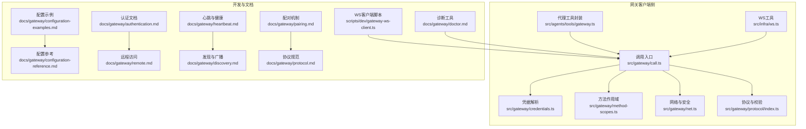
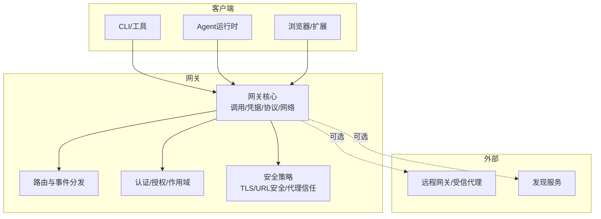
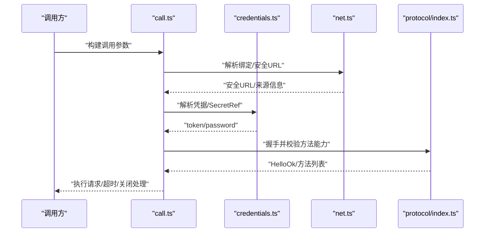
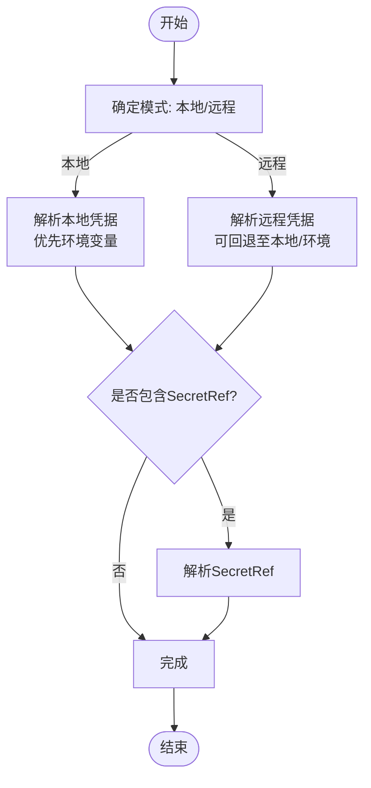
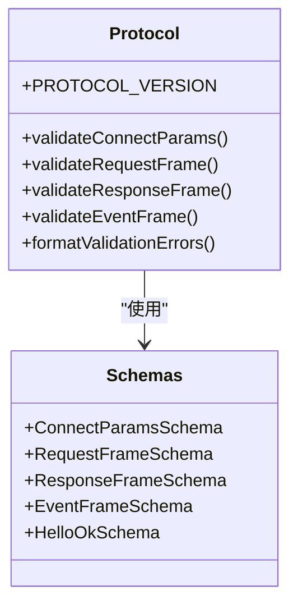
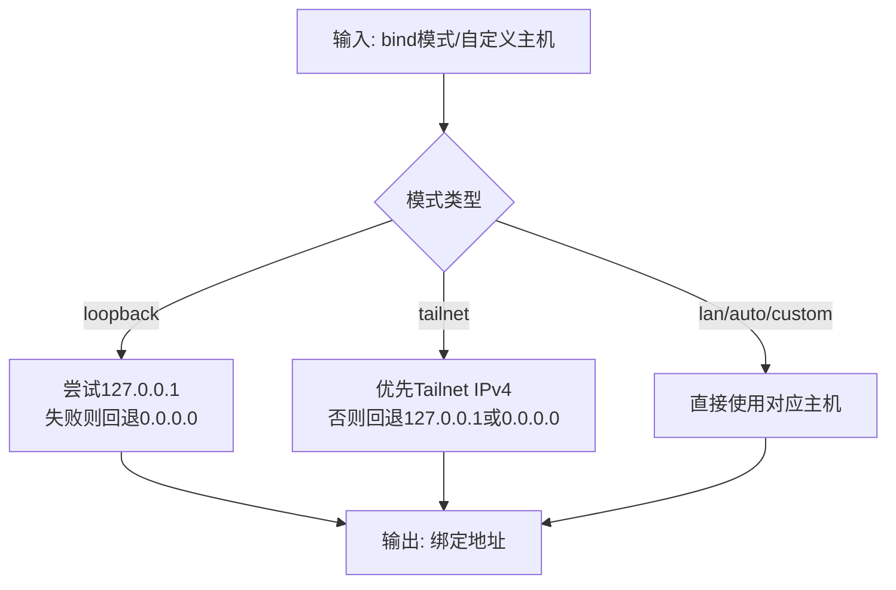
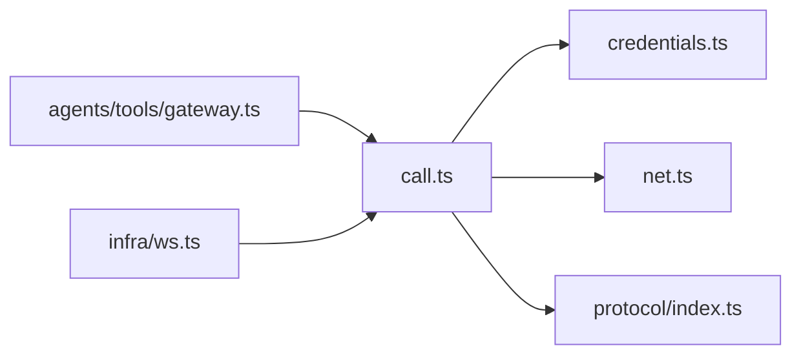

# 网关架构

<cite>
**本文引用的文件**
- [src/gateway/call.ts](file://src/gateway/call.ts)
- [src/gateway/credentials.ts](file://src/gateway/credentials.ts)
- [src/gateway/method-scopes.ts](file://src/gateway/method-scopes.ts)
- [src/gateway/net.ts](file://src/gateway/net.ts)
- [src/gateway/protocol/index.ts](file://src/gateway/protocol/index.ts)
- [src/infra/ws.ts](file://src/infra/ws.ts)
- [src/agents/tools/gateway.ts](file://src/agents/tools/gateway.ts)
- [scripts/dev/gateway-ws-client.ts](file://scripts/dev/gateway-ws-client.ts)
- [docs/gateway/configuration-examples.md](file://docs/gateway/configuration-examples.md)
- [docs/gateway/configuration-reference.md](file://docs/gateway/configuration-reference.md)
- [docs/gateway/authentication.md](file://docs/gateway/authentication.md)
- [docs/gateway/remote.md](file://docs/gateway/remote.md)
- [docs/gateway/heartbeat.md](file://docs/gateway/heartbeat.md)
- [docs/gateway/discovery.md](file://docs/gateway/discovery.md)
- [docs/gateway/pairing.md](file://docs/gateway/pairing.md)
- [docs/gateway/protocol.md](file://docs/gateway/protocol.md)
- [docs/gateway/doctor.md](file://docs/gateway/doctor.md)
- [docs/gateway/index.md](file://docs/gateway/index.md)
</cite>

## 目录
1. [引言](#引言)
2. [项目结构](#项目结构)
3. [核心组件](#核心组件)
4. [架构总览](#架构总览)
5. [详细组件分析](#详细组件分析)
6. [依赖关系分析](#依赖关系分析)
7. [性能考量](#性能考量)
8. [故障排查指南](#故障排查指南)
9. [结论](#结论)
10. [附录](#附录)

## 引言
本文件面向OpenClaw网关架构，系统化阐述“单网关多通道”设计理念与实现：网关作为中央控制平面，统一承载认证、授权、消息路由、事件分发、设备配对与远程访问等能力；通过WebSocket协议与客户端建立长连接，以“通道”抽象承载不同来源与用途的会话；并提供守护进程启动、健康检查与远程访问支持的实践路径。文档同时给出架构图、序列图与流程图，帮助开发者快速理解核心原理与实现细节。

## 项目结构
围绕网关的关键目录与文件：
- 网关调用与客户端：src/gateway/call.ts、src/gateway/credentials.ts、src/gateway/method-scopes.ts、src/gateway/net.ts、src/gateway/protocol/index.ts
- 协议与数据校验：src/gateway/protocol/index.ts（含Schema与验证器）
- WebSocket工具：src/infra/ws.ts
- 客户端封装（代理工具）：src/agents/tools/gateway.ts
- 开发与测试辅助：scripts/dev/gateway-ws-client.ts
- 文档参考：docs/gateway/*（配置、认证、远程、心跳、发现、配对、协议、诊断等）

**图表来源**
- [src/gateway/call.ts](file://src/gateway/call.ts#L1-L758)
- [src/gateway/credentials.ts](file://src/gateway/credentials.ts#L1-L279)
- [src/gateway/method-scopes.ts](file://src/gateway/method-scopes.ts#L1-L213)
- [src/gateway/net.ts](file://src/gateway/net.ts#L1-L451)
- [src/gateway/protocol/index.ts](file://src/gateway/protocol/index.ts#L1-L644)
- [src/infra/ws.ts](file://src/infra/ws.ts#L1-L22)
- [src/agents/tools/gateway.ts](file://src/agents/tools/gateway.ts#L1-L161)
- [scripts/dev/gateway-ws-client.ts](file://scripts/dev/gateway-ws-client.ts)
- [docs/gateway/configuration-examples.md](file://docs/gateway/configuration-examples.md)
- [docs/gateway/configuration-reference.md](file://docs/gateway/configuration-reference.md)
- [docs/gateway/authentication.md](file://docs/gateway/authentication.md)
- [docs/gateway/remote.md](file://docs/gateway/remote.md)
- [docs/gateway/heartbeat.md](file://docs/gateway/heartbeat.md)
- [docs/gateway/discovery.md](file://docs/gateway/discovery.md)
- [docs/gateway/pairing.md](file://docs/gateway/pairing.md)
- [docs/gateway/protocol.md](file://docs/gateway/protocol.md)
- [docs/gateway/doctor.md](file://docs/gateway/doctor.md)

**章节来源**
- [src/gateway/call.ts](file://src/gateway/call.ts#L1-L758)
- [src/gateway/credentials.ts](file://src/gateway/credentials.ts#L1-L279)
- [src/gateway/method-scopes.ts](file://src/gateway/method-scopes.ts#L1-L213)
- [src/gateway/net.ts](file://src/gateway/net.ts#L1-L451)
- [src/gateway/protocol/index.ts](file://src/gateway/protocol/index.ts#L1-L644)
- [src/infra/ws.ts](file://src/infra/ws.ts#L1-L22)
- [src/agents/tools/gateway.ts](file://src/agents/tools/gateway.ts#L1-L161)
- [scripts/dev/gateway-ws-client.ts](file://scripts/dev/gateway-ws-client.ts)
- [docs/gateway/configuration-examples.md](file://docs/gateway/configuration-examples.md)
- [docs/gateway/configuration-reference.md](file://docs/gateway/configuration-reference.md)
- [docs/gateway/authentication.md](file://docs/gateway/authentication.md)
- [docs/gateway/remote.md](file://docs/gateway/remote.md)
- [docs/gateway/heartbeat.md](file://docs/gateway/heartbeat.md)
- [docs/gateway/discovery.md](file://docs/gateway/discovery.md)
- [docs/gateway/pairing.md](file://docs/gateway/pairing.md)
- [docs/gateway/protocol.md](file://docs/gateway/protocol.md)
- [docs/gateway/doctor.md](file://docs/gateway/doctor.md)

## 核心组件
- 调用与连接管理：负责构建连接详情、解析凭据、选择TLS指纹、执行请求与超时处理，并在握手后进行方法能力校验。
- 凭据与权限：支持本地/远程模式、环境变量与配置优先级、SecretRef解析、显式凭据强制策略，以及最小权限作用域判定。
- 协议与校验：定义协议版本、帧结构与参数Schema，提供AJV校验器与错误格式化。
- 网络与安全：提供绑定主机解析、私有地址判断、反向代理信任、WebSocket URL安全策略等。
- 代理工具封装：为Agent/工具提供统一的网关调用入口，支持URL与令牌覆盖、超时与作用域设置。
- WebSocket工具：提供RawData到字符串的统一封装，便于协议层处理。

**章节来源**
- [src/gateway/call.ts](file://src/gateway/call.ts#L1-L758)
- [src/gateway/credentials.ts](file://src/gateway/credentials.ts#L1-L279)
- [src/gateway/method-scopes.ts](file://src/gateway/method-scopes.ts#L1-L213)
- [src/gateway/protocol/index.ts](file://src/gateway/protocol/index.ts#L1-L644)
- [src/gateway/net.ts](file://src/gateway/net.ts#L1-L451)
- [src/agents/tools/gateway.ts](file://src/agents/tools/gateway.ts#L1-L161)
- [src/infra/ws.ts](file://src/infra/ws.ts#L1-L22)

## 架构总览
下图展示“单网关多通道”的整体架构：网关作为中央控制平面，统一处理认证、授权、协议编解码与事件分发；客户端通过WebSocket接入，形成多条独立通道；远程模式支持通过受信代理或隧道访问；心跳与发现机制保障健康状态与可达性。

**图表来源**
- [src/gateway/call.ts](file://src/gateway/call.ts#L1-L758)
- [src/gateway/credentials.ts](file://src/gateway/credentials.ts#L1-L279)
- [src/gateway/method-scopes.ts](file://src/gateway/method-scopes.ts#L1-L213)
- [src/gateway/net.ts](file://src/gateway/net.ts#L1-L451)
- [docs/gateway/remote.md](file://docs/gateway/remote.md)
- [docs/gateway/discovery.md](file://docs/gateway/discovery.md)

## 详细组件分析

### 组件A：调用与连接管理（call.ts）
- 连接详情构建：根据配置、CLI/环境变量与远程模式，计算最终目标URL、来源与绑定信息，并进行安全检查（仅允许wss或loopback的ws）。
- 凭据解析：支持显式凭据、URL重定向限制、远程模式下的凭据回退策略与SecretRef解析。
- TLS指纹：在本地WSS场景加载运行时证书指纹，或从远程配置继承。
- 请求执行：握手后校验方法能力列表，发起请求并在超时或关闭时返回明确错误。
- 作用域与最小权限：根据方法自动推导所需作用域，CLI默认作用域集合可覆盖。

**图表来源**
- [src/gateway/call.ts](file://src/gateway/call.ts#L130-L219)
- [src/gateway/call.ts](file://src/gateway/call.ts#L334-L492)
- [src/gateway/call.ts](file://src/gateway/call.ts#L595-L715)
- [src/gateway/net.ts](file://src/gateway/net.ts#L411-L450)
- [src/gateway/protocol/index.ts](file://src/gateway/protocol/index.ts#L1-L644)

**章节来源**
- [src/gateway/call.ts](file://src/gateway/call.ts#L1-L758)
- [src/gateway/net.ts](file://src/gateway/net.ts#L1-L451)
- [src/gateway/credentials.ts](file://src/gateway/credentials.ts#L1-L279)
- [src/gateway/protocol/index.ts](file://src/gateway/protocol/index.ts#L1-L644)

### 组件B：凭据与权限（credentials.ts、method-scopes.ts）
- 凭据优先级：支持环境变量与配置的优先顺序、本地/远程模式切换、显式凭据强制、URL重定向限制。
- SecretRef解析：在无法解析SecretRef时抛出明确错误，避免隐式失败。
- 作用域模型：按方法分类为只读/写入/审批/配对/管理员等，支持最小权限原则与CLI默认作用域。

**图表来源**
- [src/gateway/credentials.ts](file://src/gateway/credentials.ts#L129-L278)
- [src/gateway/method-scopes.ts](file://src/gateway/method-scopes.ts#L1-L213)

**章节来源**
- [src/gateway/credentials.ts](file://src/gateway/credentials.ts#L1-L279)
- [src/gateway/method-scopes.ts](file://src/gateway/method-scopes.ts#L1-L213)

### 组件C：协议与校验（protocol/index.ts）
- 协议版本与帧结构：定义连接、请求、响应、事件帧及参数Schema。
- 参数校验：基于AJV生成各方法参数的校验器，提供统一错误格式化。
- 方法能力：握手返回的features.methods用于运行时能力校验。

**图表来源**
- [src/gateway/protocol/index.ts](file://src/gateway/protocol/index.ts#L1-L644)

**章节来源**
- [src/gateway/protocol/index.ts](file://src/gateway/protocol/index.ts#L1-L644)

### 组件D：网络与安全（net.ts）
- 绑定主机解析：支持loopback、LAN、tailnet、auto、custom等模式，并具备回退策略。
- 客户端IP解析：支持X-Forwarded-For、X-Real-IP与可信代理白名单。
- WebSocket URL安全：严格限制非loopback的ws明文传输，支持break-glass策略。

**图表来源**
- [src/gateway/net.ts](file://src/gateway/net.ts#L221-L271)

**章节来源**
- [src/gateway/net.ts](file://src/gateway/net.ts#L1-L451)

### 组件E：WebSocket工具（infra/ws.ts）
- RawData到字符串转换：兼容string、Buffer、Array、ArrayBuffer等输入，确保协议层统一处理。

**章节来源**
- [src/infra/ws.ts](file://src/infra/ws.ts#L1-L22)

### 组件F：代理工具封装（agents/tools/gateway.ts）
- URL与令牌覆盖：支持CLI/环境变量覆盖，限定允许的本地回环范围与远程配置。
- 超时与作用域：提供默认超时与最小权限作用域解析，统一客户端标识与模式。

**章节来源**
- [src/agents/tools/gateway.ts](file://src/agents/tools/gateway.ts#L1-L161)

## 依赖关系分析
- 调用入口依赖凭据解析、网络与协议模块；协议模块依赖Schema定义；代理工具封装依赖调用入口。
- 安全策略贯穿网络与调用流程，确保URL与凭据的安全性。
- 远程模式与可信代理、隧道配合，心跳与发现机制提升可用性。

**图表来源**
- [src/gateway/call.ts](file://src/gateway/call.ts#L1-L758)
- [src/gateway/credentials.ts](file://src/gateway/credentials.ts#L1-L279)
- [src/gateway/net.ts](file://src/gateway/net.ts#L1-L451)
- [src/gateway/protocol/index.ts](file://src/gateway/protocol/index.ts#L1-L644)
- [src/agents/tools/gateway.ts](file://src/agents/tools/gateway.ts#L1-L161)
- [src/infra/ws.ts](file://src/infra/ws.ts#L1-L22)

**章节来源**
- [src/gateway/call.ts](file://src/gateway/call.ts#L1-L758)
- [src/gateway/credentials.ts](file://src/gateway/credentials.ts#L1-L279)
- [src/gateway/net.ts](file://src/gateway/net.ts#L1-L451)
- [src/gateway/protocol/index.ts](file://src/gateway/protocol/index.ts#L1-L644)
- [src/agents/tools/gateway.ts](file://src/agents/tools/gateway.ts#L1-L161)
- [src/infra/ws.ts](file://src/infra/ws.ts#L1-L22)

## 性能考量
- 超时控制：调用入口对定时器进行安全范围约束，避免过长或过短导致资源浪费或误判。
- 最小权限：按方法精确分配作用域，减少不必要的鉴权开销。
- 绑定策略：优先loopback或Tailnet以降低网络栈压力与暴露面。
- 事件与路由：采用事件帧与能力校验，避免无效请求占用资源。

[本节为通用指导，无需特定文件引用]

## 故障排查指南
- 远程访问安全：若使用ws明文且非loopback，将触发安全错误；请改用wss或受信隧道。
- 凭据问题：显式URL重定向要求显式凭据；SecretRef不可用时需提供环境变量或显式参数。
- 心跳与健康：通过心跳与健康接口确认网关状态；远程模式缺失远程URL将提示修复建议。
- 诊断工具：使用doctor命令获取配置与连通性建议。

**章节来源**
- [src/gateway/call.ts](file://src/gateway/call.ts#L182-L200)
- [src/gateway/call.ts](file://src/gateway/call.ts#L686-L694)
- [docs/gateway/remote.md](file://docs/gateway/remote.md)
- [docs/gateway/heartbeat.md](file://docs/gateway/heartbeat.md)
- [docs/gateway/doctor.md](file://docs/gateway/doctor.md)

## 结论
OpenClaw网关通过“单网关多通道”设计，将认证、授权、协议编解码与事件分发集中于中央控制平面，结合严格的网络与安全策略、灵活的远程访问支持，为多来源客户端提供稳定一致的通信与控制能力。调用入口、凭据与权限、协议与校验、网络与安全四大模块协同工作，既满足易用性也兼顾安全性与可维护性。

[本节为总结，无需特定文件引用]

## 附录

### A. 守护进程与启动管理
- 使用守护进程模式运行网关，结合systemd或容器编排实现开机自启与崩溃重启。
- 建议开启TLS与严格URL安全策略，必要时通过SSH隧道或Tailscale Serve/Funnel提供远程访问。
- 配置示例与参考见配置文档。

**章节来源**
- [docs/gateway/configuration-examples.md](file://docs/gateway/configuration-examples.md)
- [docs/gateway/configuration-reference.md](file://docs/gateway/configuration-reference.md)
- [docs/gateway/remote.md](file://docs/gateway/remote.md)

### B. 客户端连接生命周期
- 握手阶段：校验协议版本与方法能力，建立通道。
- 请求阶段：按作用域与超时执行方法调用。
- 关闭阶段：异常或正常关闭均返回明确原因与连接详情。

**章节来源**
- [src/gateway/call.ts](file://src/gateway/call.ts#L595-L715)
- [src/gateway/protocol/index.ts](file://src/gateway/protocol/index.ts#L1-L644)

### C. 设备配对机制
- 支持节点与设备配对请求、列表、批准、拒绝与移除；配对过程受最小权限作用域保护。
- 提供令牌轮换与吊销能力，增强配对生命周期管理。

**章节来源**
- [src/gateway/method-scopes.ts](file://src/gateway/method-scopes.ts#L35-L48)
- [src/gateway/protocol/index.ts](file://src/gateway/protocol/index.ts#L98-L109)

### D. 消息路由与事件系统
- 事件帧用于推送系统事件、心跳与关闭通知；客户端据此更新状态与重连策略。
- 路由与事件分发由网关核心负责，协议层提供Schema与校验保障。

**章节来源**
- [src/gateway/protocol/index.ts](file://src/gateway/protocol/index.ts#L126-L132)
- [src/gateway/protocol/index.ts](file://src/gateway/protocol/index.ts#L215-L216)

### E. 实际代码与配置示例路径
- 网关调用入口：[src/gateway/call.ts](file://src/gateway/call.ts#L737-L753)
- 凭据解析：[src/gateway/credentials.ts](file://src/gateway/credentials.ts#L129-L278)
- 方法作用域：[src/gateway/method-scopes.ts](file://src/gateway/method-scopes.ts#L174-L212)
- 协议与校验：[src/gateway/protocol/index.ts](file://src/gateway/protocol/index.ts#L243-L438)
- 网络与安全：[src/gateway/net.ts](file://src/gateway/net.ts#L411-L450)
- WebSocket工具：[src/infra/ws.ts](file://src/infra/ws.ts#L4-L21)
- 代理工具封装：[src/agents/tools/gateway.ts](file://src/agents/tools/gateway.ts#L116-L161)
- 开发WS客户端：[scripts/dev/gateway-ws-client.ts](file://scripts/dev/gateway-ws-client.ts)
- 配置示例与参考：[docs/gateway/configuration-examples.md](file://docs/gateway/configuration-examples.md)、[docs/gateway/configuration-reference.md](file://docs/gateway/configuration-reference.md)
- 认证与远程访问：[docs/gateway/authentication.md](file://docs/gateway/authentication.md)、[docs/gateway/remote.md](file://docs/gateway/remote.md)
- 心跳与健康：[docs/gateway/heartbeat.md](file://docs/gateway/heartbeat.md)
- 发现与广播：[docs/gateway/discovery.md](file://docs/gateway/discovery.md)
- 配对机制：[docs/gateway/pairing.md](file://docs/gateway/pairing.md)
- 协议规范：[docs/gateway/protocol.md](file://docs/gateway/protocol.md)
- 诊断工具：[docs/gateway/doctor.md](file://docs/gateway/doctor.md)