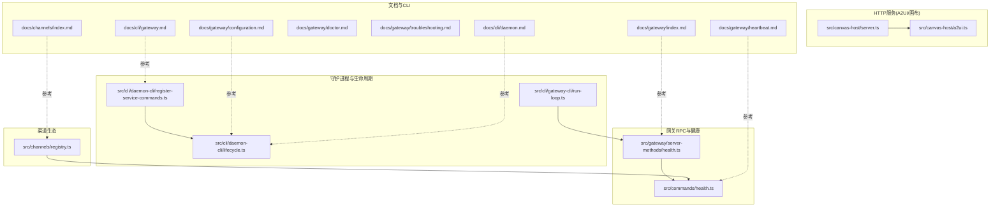
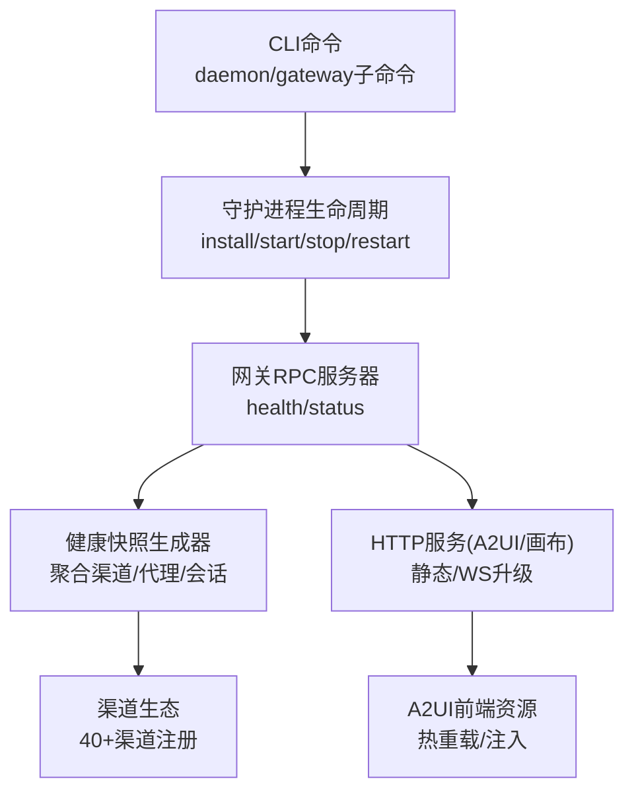
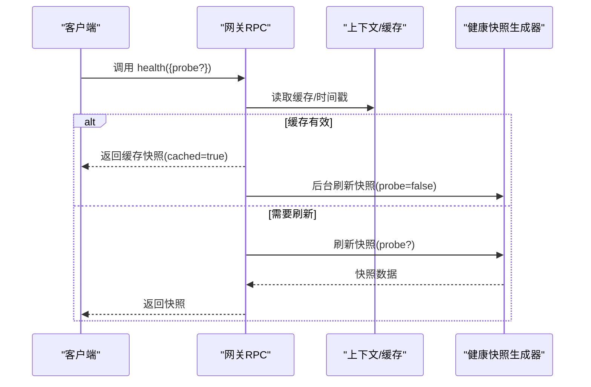
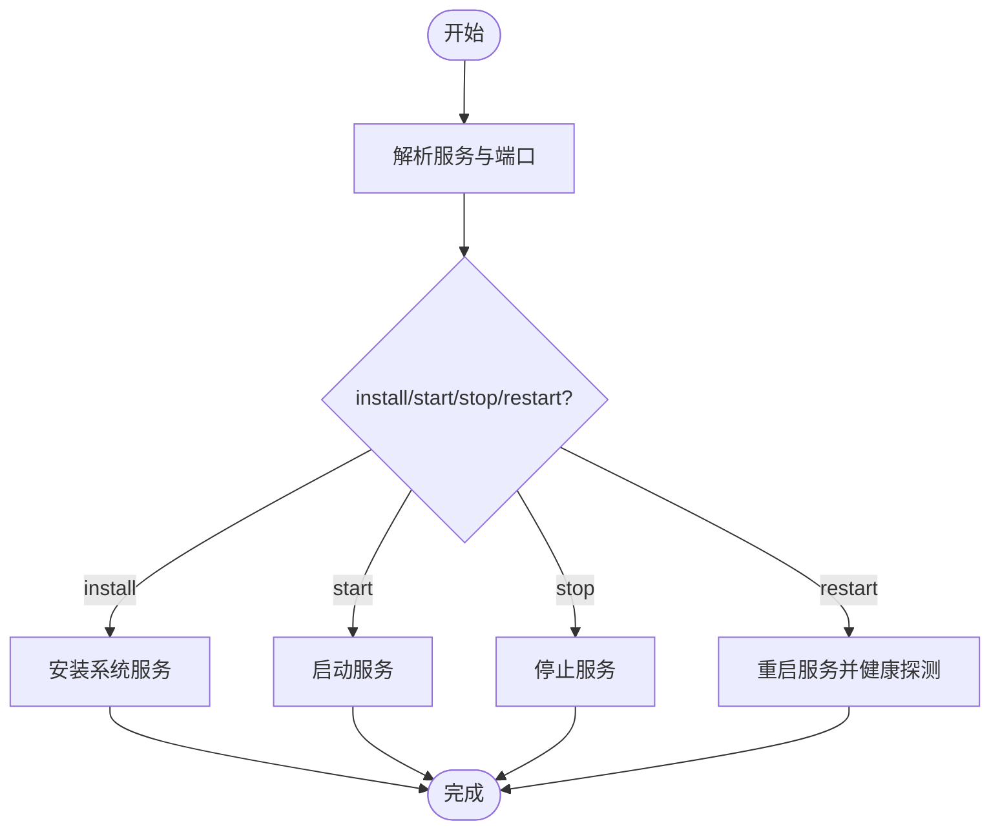
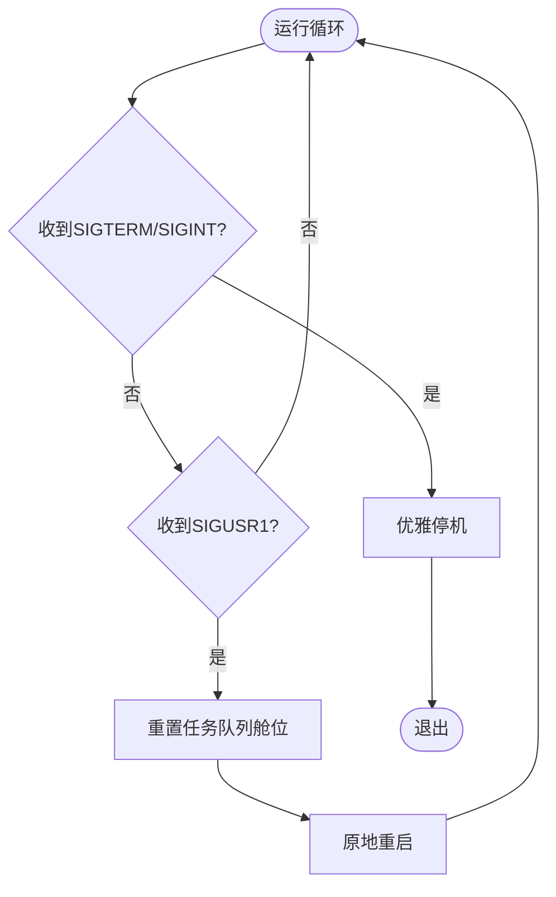
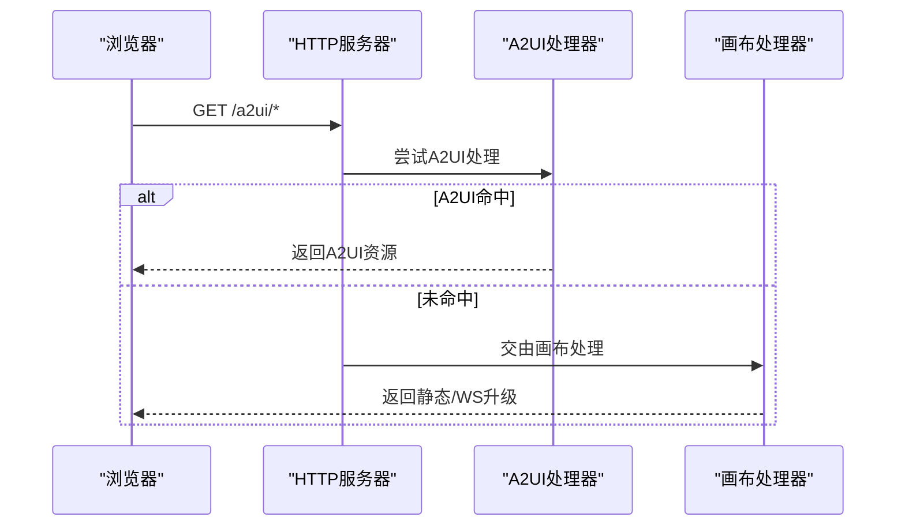
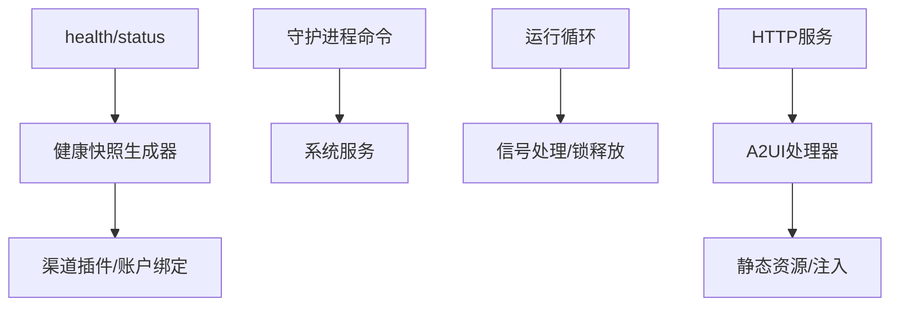

# 网关概览

<cite>
**本文引用的文件**
- [src/gateway/server-methods/health.ts](file://src/gateway/server-methods/health.ts)
- [src/commands/health.ts](file://src/commands/health.ts)
- [src/cli/daemon-cli/register-service-commands.ts](file://src/cli/daemon-cli/register-service-commands.ts)
- [src/cli/daemon-cli/lifecycle.ts](file://src/cli/daemon-cli/lifecycle.ts)
- [src/cli/gateway-cli/run-loop.ts](file://src/cli/gateway-cli/run-loop.ts)
- [src/canvas-host/server.ts](file://src/canvas-host/server.ts)
- [src/canvas-host/a2ui.ts](file://src/canvas-host/a2ui.ts)
- [src/channels/registry.ts](file://src/channels/registry.ts)
- [docs/gateway/index.md](file://docs/gateway/index.md)
- [docs/gateway/configuration.md](file://docs/gateway/configuration.md)
- [docs/gateway/heartbeat.md](file://docs/gateway/heartbeat.md)
- [docs/gateway/doctor.md](file://docs/gateway/doctor.md)
- [docs/gateway/troubleshooting.md](file://docs/gateway/troubleshooting.md)
- [docs/cli/gateway.md](file://docs/cli/gateway.md)
- [docs/cli/daemon.md](file://docs/cli/daemon.md)
- [docs/channels/index.md](file://docs/channels/index.md)
- [docs/channels/whatsapp.md](file://docs/channels/whatsapp.md)
- [docs/channels/telegram.md](file://docs/channels/telegram.md)
- [docs/channels/discord.md](file://docs/channels/discord.md)
- [docs/channels/slack.md](file://docs/channels/slack.md)
</cite>

## 目录
1. [引言](#引言)
2. [项目结构](#项目结构)
3. [核心组件](#核心组件)
4. [架构总览](#架构总览)
5. [详细组件分析](#详细组件分析)
6. [依赖关系分析](#依赖关系分析)
7. [性能考量](#性能考量)
8. [故障排查指南](#故障排查指南)
9. [结论](#结论)
10. [附录](#附录)

## 引言
本文件面向OpenClaw网关的使用者与维护者，系统性阐述网关作为“中央控制平面”的核心定位：统一管理40+消息渠道（如WhatsApp、Telegram、Discord、Slack等）的连接与状态；以守护进程模式运行，具备进程生命周期管理与自动重启能力；提供HTTP服务（画布主机与A2UI服务），支撑可视化与交互体验；并通过CLI命令实现启动、停止、健康检查等运维操作。本文在不直接展示源码的前提下，通过图示与路径指引帮助读者建立对网关工作原理与管理方式的清晰认知。

## 项目结构
围绕网关的关键目录与文件，可归纳为以下几类：
- 网关RPC与健康接口：位于src/gateway/server-methods/health.ts，以及src/commands/health.ts，负责对外暴露health/status方法与健康快照生成。
- 守护进程与生命周期：位于src/cli/daemon-cli/与src/cli/gateway-cli/run-loop.ts，覆盖安装、启动、停止、重启与信号处理。
- HTTP服务（画布主机/A2UI）：位于src/canvas-host/server.ts与src/canvas-host/a2ui.ts，提供静态资源、WebSocket升级与A2UI注入。
- 渠道注册与生态：位于src/channels/registry.ts，列举并标注支持的渠道类型与文档入口。
- 文档与CLI参考：docs/gateway/*与docs/cli/*，提供配置、心跳、诊断、故障排查与CLI使用说明。

**图表来源**
- [src/gateway/server-methods/health.ts](file://src/gateway/server-methods/health.ts#L1-L38)
- [src/commands/health.ts](file://src/commands/health.ts#L1-L752)
- [src/cli/daemon-cli/register-service-commands.ts](file://src/cli/daemon-cli/register-service-commands.ts#L38-L68)
- [src/cli/daemon-cli/lifecycle.ts](file://src/cli/daemon-cli/lifecycle.ts#L34-L77)
- [src/cli/gateway-cli/run-loop.ts](file://src/cli/gateway-cli/run-loop.ts#L150-L200)
- [src/canvas-host/server.ts](file://src/canvas-host/server.ts#L1-L442)
- [src/canvas-host/a2ui.ts](file://src/canvas-host/a2ui.ts#L122-L171)
- [src/channels/registry.ts](file://src/channels/registry.ts#L26-L71)
- [docs/gateway/index.md](file://docs/gateway/index.md)
- [docs/gateway/configuration.md](file://docs/gateway/configuration.md)
- [docs/gateway/heartbeat.md](file://docs/gateway/heartbeat.md)
- [docs/gateway/doctor.md](file://docs/gateway/doctor.md)
- [docs/gateway/troubleshooting.md](file://docs/gateway/troubleshooting.md)
- [docs/cli/gateway.md](file://docs/cli/gateway.md)
- [docs/cli/daemon.md](file://docs/cli/daemon.md)
- [docs/channels/index.md](file://docs/channels/index.md)

**章节来源**
- [src/gateway/server-methods/health.ts](file://src/gateway/server-methods/health.ts#L1-L38)
- [src/commands/health.ts](file://src/commands/health.ts#L1-L752)
- [src/cli/daemon-cli/register-service-commands.ts](file://src/cli/daemon-cli/register-service-commands.ts#L38-L68)
- [src/cli/daemon-cli/lifecycle.ts](file://src/cli/daemon-cli/lifecycle.ts#L34-L77)
- [src/cli/gateway-cli/run-loop.ts](file://src/cli/gateway-cli/run-loop.ts#L150-L200)
- [src/canvas-host/server.ts](file://src/canvas-host/server.ts#L1-L442)
- [src/canvas-host/a2ui.ts](file://src/canvas-host/a2ui.ts#L122-L171)
- [src/channels/registry.ts](file://src/channels/registry.ts#L26-L71)
- [docs/gateway/index.md](file://docs/gateway/index.md)
- [docs/gateway/configuration.md](file://docs/gateway/configuration.md)
- [docs/gateway/heartbeat.md](file://docs/gateway/heartbeat.md)
- [docs/gateway/doctor.md](file://docs/gateway/doctor.md)
- [docs/gateway/troubleshooting.md](file://docs/gateway/troubleshooting.md)
- [docs/cli/gateway.md](file://docs/cli/gateway.md)
- [docs/cli/daemon.md](file://docs/cli/daemon.md)
- [docs/channels/index.md](file://docs/channels/index.md)

## 核心组件
- 健康与状态RPC：提供health/status两个RPC方法，前者返回健康快照（含渠道、代理、会话等信息），后者返回简要状态摘要，并支持按权限范围返回敏感信息。
- 健康快照生成器：聚合各渠道账户的配置、链接、探测结果与会话统计，形成统一视图，支持缓存与后台刷新。
- 守护进程与生命周期：封装service安装、启动、停止、卸载与重启流程，支持跨平台（launchd/systemd/schtasks）。
- 运行循环与信号处理：内置SIGTERM/SIGINT/SIGUSR1处理，支持优雅停机与原地重启（无需外部监督者）。
- HTTP服务（画布主机/A2UI）：提供静态文件与WebSocket升级，注入A2UI前端资源，支持热重载与本地开发体验。
- 渠道生态：集中登记支持的渠道类型，便于统一配置与文档导航。

**章节来源**
- [src/gateway/server-methods/health.ts](file://src/gateway/server-methods/health.ts#L10-L37)
- [src/commands/health.ts](file://src/commands/health.ts#L47-L72)
- [src/commands/health.ts](file://src/commands/health.ts#L348-L523)
- [src/cli/daemon-cli/register-service-commands.ts](file://src/cli/daemon-cli/register-service-commands.ts#L38-L68)
- [src/cli/daemon-cli/lifecycle.ts](file://src/cli/daemon-cli/lifecycle.ts#L38-L77)
- [src/cli/gateway-cli/run-loop.ts](file://src/cli/gateway-cli/run-loop.ts#L150-L200)
- [src/canvas-host/server.ts](file://src/canvas-host/server.ts#L399-L442)
- [src/canvas-host/a2ui.ts](file://src/canvas-host/a2ui.ts#L142-L171)
- [src/channels/registry.ts](file://src/channels/registry.ts#L26-L71)

## 架构总览
下图展示了从CLI到网关RPC、再到HTTP服务与渠道生态的整体交互：

**图表来源**
- [src/cli/daemon-cli/register-service-commands.ts](file://src/cli/daemon-cli/register-service-commands.ts#L38-L68)
- [src/cli/daemon-cli/lifecycle.ts](file://src/cli/daemon-cli/lifecycle.ts#L38-L77)
- [src/gateway/server-methods/health.ts](file://src/gateway/server-methods/health.ts#L10-L37)
- [src/commands/health.ts](file://src/commands/health.ts#L348-L523)
- [src/canvas-host/server.ts](file://src/canvas-host/server.ts#L399-L442)
- [src/canvas-host/a2ui.ts](file://src/canvas-host/a2ui.ts#L142-L171)
- [src/channels/registry.ts](file://src/channels/registry.ts#L26-L71)

## 详细组件分析

### 组件A：健康与状态RPC
- 功能要点
  - health方法：支持缓存命中与后台刷新；可选择强制探测（probe），失败时返回UNAVAILABLE错误。
  - status方法：根据客户端权限范围返回状态摘要，包含默认代理心跳、会话统计等。
- 数据流
  - 客户端调用health/status → 网关上下文读取/刷新健康快照 → 返回结构化摘要。
- 错误处理
  - 探测异常会被格式化为错误响应，保证RPC层稳定性。

**图表来源**
- [src/gateway/server-methods/health.ts](file://src/gateway/server-methods/health.ts#L11-L29)
- [src/commands/health.ts](file://src/commands/health.ts#L348-L523)

**章节来源**
- [src/gateway/server-methods/health.ts](file://src/gateway/server-methods/health.ts#L10-L37)
- [src/commands/health.ts](file://src/commands/health.ts#L47-L72)
- [src/commands/health.ts](file://src/commands/health.ts#L348-L523)

### 组件B：守护进程与生命周期
- 功能要点
  - 安装/卸载：注册系统服务（launchd/systemd/schtasks），支持覆盖安装与卸载后断言。
  - 启动/停止：封装启动提示与停止逻辑，确保服务状态一致。
  - 重启：计算重启等待窗口，进行健康探测，避免过早判定成功。
- CLI集成
  - gateway子命令继承部分选项（如端口、令牌、密码），并在status/install等子命令中透传。

**图表来源**
- [src/cli/daemon-cli/register-service-commands.ts](file://src/cli/daemon-cli/register-service-commands.ts#L38-L68)
- [src/cli/daemon-cli/lifecycle.ts](file://src/cli/daemon-cli/lifecycle.ts#L38-L77)

**章节来源**
- [src/cli/daemon-cli/register-service-commands.ts](file://src/cli/daemon-cli/register-service-commands.ts#L38-L68)
- [src/cli/daemon-cli/lifecycle.ts](file://src/cli/daemon-cli/lifecycle.ts#L38-L77)

### 组件C：运行循环与信号处理
- 功能要点
  - 捕获SIGTERM/SIGINT执行优雅停机；捕获SIGUSR1触发原地重启（无需外部监督者）。
  - 在SIGUSR1重启后重置任务队列舱位状态，避免中断导致的“永久阻塞”。
- 实践意义
  - 降低运维复杂度，提升可用性与自愈能力。

**图表来源**
- [src/cli/gateway-cli/run-loop.ts](file://src/cli/gateway-cli/run-loop.ts#L150-L200)

**章节来源**
- [src/cli/gateway-cli/run-loop.ts](file://src/cli/gateway-cli/run-loop.ts#L150-L200)

### 组件D：HTTP服务（画布主机与A2UI）
- 功能要点
  - HTTP服务器：拦截非WebSocket请求，优先尝试A2UI处理，否则交由画布处理器。
  - WebSocket升级：将升级请求转交给画布处理器，未匹配则销毁socket。
  - A2UI：提供静态资源访问与注入，支持热重载。
- 使用场景
  - 本地开发与调试、可视化控制面板、前端资源托管。

**图表来源**
- [src/canvas-host/server.ts](file://src/canvas-host/server.ts#L416-L442)
- [src/canvas-host/a2ui.ts](file://src/canvas-host/a2ui.ts#L142-L171)

**章节来源**
- [src/canvas-host/server.ts](file://src/canvas-host/server.ts#L399-L442)
- [src/canvas-host/a2ui.ts](file://src/canvas-host/a2ui.ts#L122-L171)

### 组件E：渠道生态与统一管理
- 功能要点
  - 渠道注册表：集中列出支持的渠道（如Telegram、WhatsApp、Discord、IRC等），并提供文档链接与图标标识。
  - 健康快照：遍历渠道插件，收集账户配置、链接状态、探测结果与会话统计，形成统一视图。
- 设计价值
  - 单网关多渠道：通过插件化与绑定机制，统一管理40+渠道的连接与状态，简化配置与运维。

**图表来源**
- [src/channels/registry.ts](file://src/channels/registry.ts#L26-L71)
- [src/commands/health.ts](file://src/commands/health.ts#L384-L503)

**章节来源**
- [src/channels/registry.ts](file://src/channels/registry.ts#L26-L71)
- [src/commands/health.ts](file://src/commands/health.ts#L348-L523)

## 依赖关系分析
- 网关RPC依赖健康快照生成器；健康快照生成器依赖渠道插件列表与账户绑定。
- 守护进程命令依赖系统服务解析与安装脚本；运行循环依赖信号处理与锁释放。
- HTTP服务依赖A2UI与画布处理器；A2UI依赖A2UI根目录与注入逻辑。
- 文档与CLI参考为运维与开发提供实践指导。

**图表来源**
- [src/gateway/server-methods/health.ts](file://src/gateway/server-methods/health.ts#L10-L37)
- [src/commands/health.ts](file://src/commands/health.ts#L348-L523)
- [src/cli/daemon-cli/register-service-commands.ts](file://src/cli/daemon-cli/register-service-commands.ts#L38-L68)
- [src/cli/gateway-cli/run-loop.ts](file://src/cli/gateway-cli/run-loop.ts#L150-L200)
- [src/canvas-host/server.ts](file://src/canvas-host/server.ts#L399-L442)
- [src/canvas-host/a2ui.ts](file://src/canvas-host/a2ui.ts#L142-L171)

**章节来源**
- [src/gateway/server-methods/health.ts](file://src/gateway/server-methods/health.ts#L10-L37)
- [src/commands/health.ts](file://src/commands/health.ts#L348-L523)
- [src/cli/daemon-cli/register-service-commands.ts](file://src/cli/daemon-cli/register-service-commands.ts#L38-L68)
- [src/cli/gateway-cli/run-loop.ts](file://src/cli/gateway-cli/run-loop.ts#L150-L200)
- [src/canvas-host/server.ts](file://src/canvas-host/server.ts#L399-L442)
- [src/canvas-host/a2ui.ts](file://src/canvas-host/a2ui.ts#L142-L171)

## 性能考量
- 健康快照缓存：health接口在有效期内返回缓存，减少重复探测开销；后台异步刷新保持新鲜度。
- 探测超时与并发：健康快照生成器对每个渠道账户设置上限超时，避免阻塞整体响应。
- 会话与心跳：结合心跳间隔与会话存储统计，辅助判断系统负载与延迟。
- HTTP服务：静态资源与WebSocket分离处理，A2UI注入最小化额外渲染成本。

**章节来源**
- [src/gateway/server-methods/health.ts](file://src/gateway/server-methods/health.ts#L16-L22)
- [src/commands/health.ts](file://src/commands/health.ts#L74-L75)
- [src/commands/health.ts](file://src/commands/health.ts#L377-L379)
- [src/canvas-host/server.ts](file://src/canvas-host/server.ts#L416-L442)

## 故障排查指南
- 健康检查
  - 使用health/status查看网关可达性与渠道状态；必要时开启详细输出与调试日志。
- 诊断与排错
  - 参考诊断文档与故障排查指南，定位网络、认证、渠道连接等问题。
- 心跳与会话
  - 结合心跳间隔与会话存储统计，判断系统是否处于活跃状态或存在异常停滞。

**章节来源**
- [src/gateway/server-methods/health.ts](file://src/gateway/server-methods/health.ts#L30-L36)
- [src/commands/health.ts](file://src/commands/health.ts#L525-L751)
- [docs/gateway/doctor.md](file://docs/gateway/doctor.md)
- [docs/gateway/troubleshooting.md](file://docs/gateway/troubleshooting.md)
- [docs/gateway/heartbeat.md](file://docs/gateway/heartbeat.md)

## 结论
OpenClaw网关以“中央控制平面”为核心，通过统一RPC接口、插件化渠道生态、守护进程生命周期管理与HTTP服务，实现了对多渠道连接的集中治理与可观测性。其健康快照、信号驱动的原地重启、A2UI与画布主机等特性，共同构成了稳定、易运维、可扩展的运行体系。配合CLI与文档，用户可以高效完成启动、停止、健康检查等日常运维任务。

## 附录

### A. 网关基本操作示例（基于CLI）
- 启动/停止/重启
  - 安装服务：参考安装命令与选项，确保端口、令牌、运行时等参数正确。
  - 启动服务：启动后可通过健康检查确认网关就绪。
  - 停止服务：优雅停机，等待未完成任务处理完毕。
  - 重启服务：自动进行健康探测，避免过早判定成功。
- 健康检查
  - status子命令可探测服务状态与RPC连通性；支持深度扫描与JSON输出。
- 渠道管理
  - 参考渠道索引与各渠道文档，完成配置与配对（如WhatsApp、Telegram、Discord、Slack等）。

**章节来源**
- [docs/cli/daemon.md](file://docs/cli/daemon.md)
- [docs/cli/gateway.md](file://docs/cli/gateway.md)
- [docs/channels/index.md](file://docs/channels/index.md)
- [docs/channels/whatsapp.md](file://docs/channels/whatsapp.md)
- [docs/channels/telegram.md](file://docs/channels/telegram.md)
- [docs/channels/discord.md](file://docs/channels/discord.md)
- [docs/channels/slack.md](file://docs/channels/slack.md)