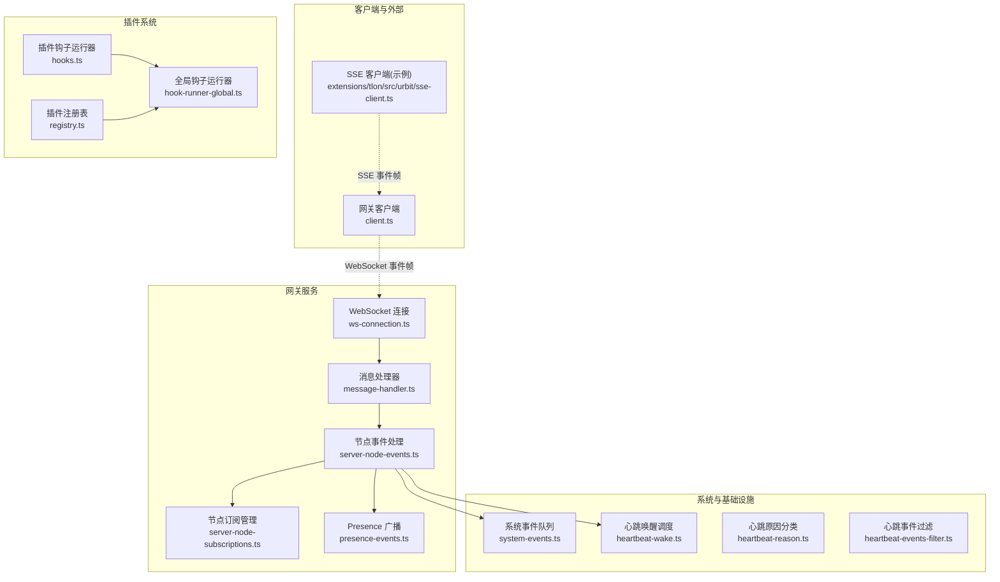
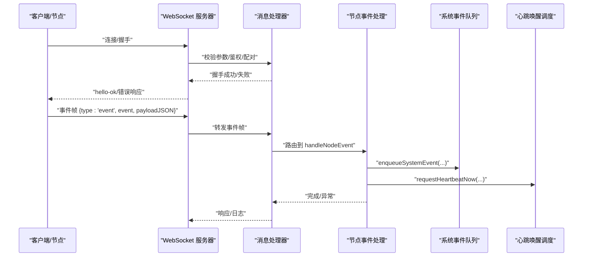
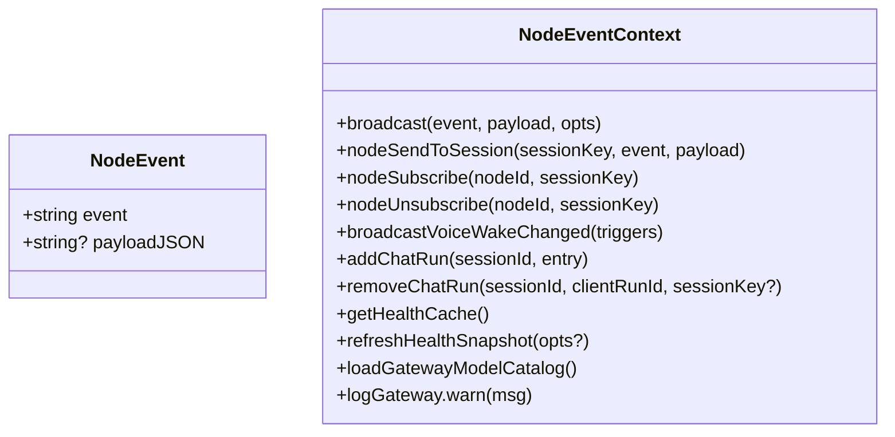
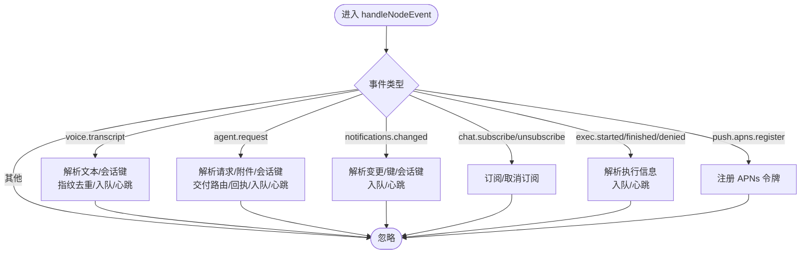
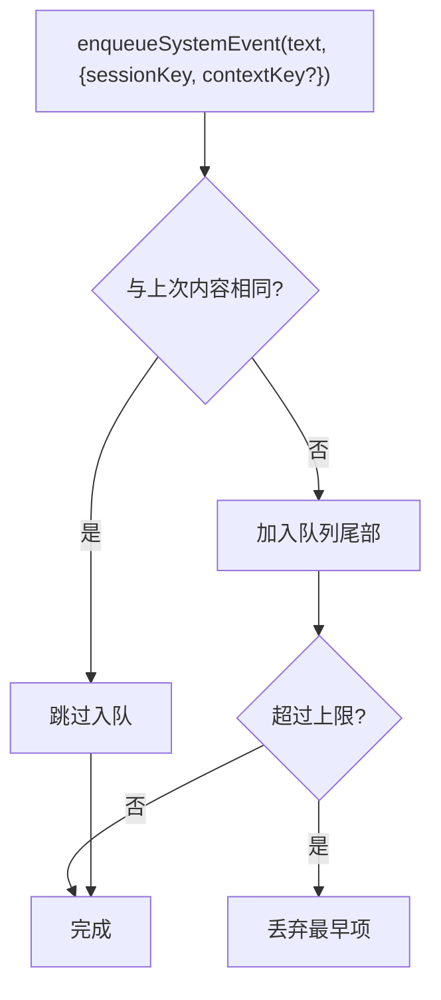
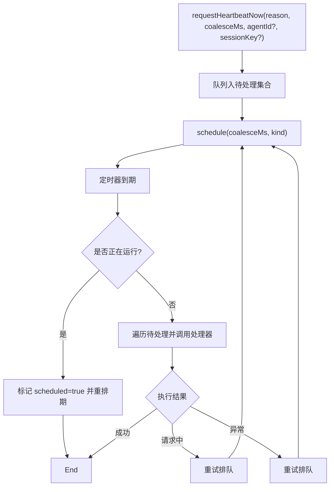
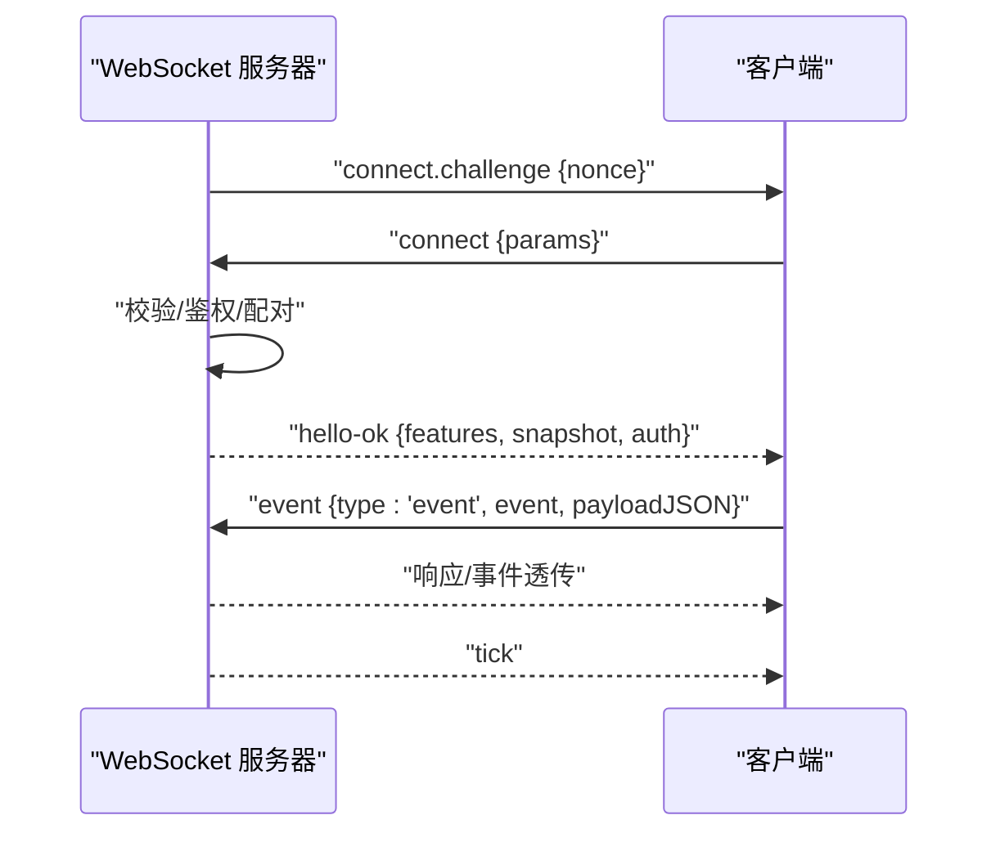
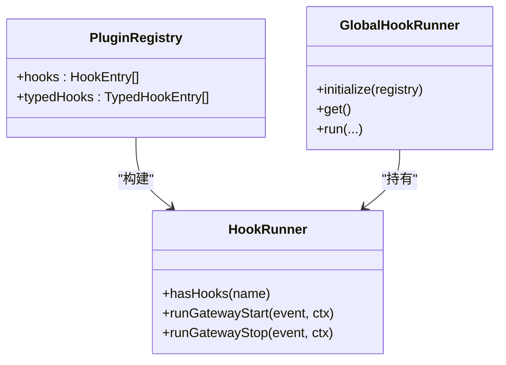
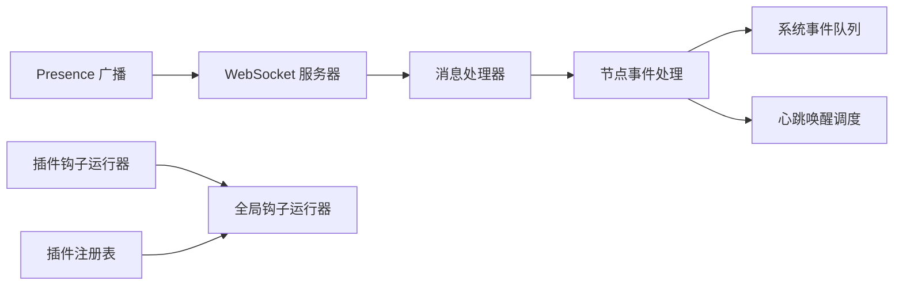

# 事件系统

<cite>
**本文引用的文件**
- [src/gateway/events.ts](file://src/gateway/events.ts)
- [src/gateway/server-node-events-types.ts](file://src/gateway/server-node-events-types.ts)
- [src/gateway/server-node-events.ts](file://src/gateway/server-node-events.ts)
- [src/gateway/server-node-subscriptions.ts](file://src/gateway/server-node-subscriptions.ts)
- [src/gateway/server/ws-connection.ts](file://src/gateway/server/ws-connection.ts)
- [src/gateway/server/ws-connection/message-handler.ts](file://src/gateway/server/ws-connection/message-handler.ts)
- [src/gateway/server/presence-events.ts](file://src/gateway/server/presence-events.ts)
- [src/gateway/client.ts](file://src/gateway/client.ts)
- [src/infra/system-events.ts](file://src/infra/system-events.ts)
- [src/infra/heartbeat-wake.ts](file://src/infra/heartbeat-wake.ts)
- [src/infra/heartbeat-reason.ts](file://src/infra/heartbeat-reason.ts)
- [src/infra/heartbeat-events-filter.ts](file://src/infra/heartbeat-events-filter.ts)
- [src/plugins/hooks.ts](file://src/plugins/hooks.ts)
- [src/plugins/hook-runner-global.ts](file://src/plugins/hook-runner-global.ts)
- [src/plugins/registry.ts](file://src/plugins/registry.ts)
- [extensions/tlon/src/urbit/sse-client.ts](file://extensions/tlon/src/urbit/sse-client.ts)
- [docs/zh-CN/gateway/index.md](file://docs/zh-CN/gateway/index.md)
</cite>

## 目录
1. [简介](#简介)
2. [项目结构](#项目结构)
3. [核心组件](#核心组件)
4. [架构总览](#架构总览)
5. [详细组件分析](#详细组件分析)
6. [依赖关系分析](#依赖关系分析)
7. [性能考量](#性能考量)
8. [故障排查指南](#故障排查指南)
9. [结论](#结论)
10. [附录](#附录)

## 简介
本文件系统性梳理 OpenClaw 网关的事件驱动架构，覆盖事件类型与分类、事件传播与广播策略、节点事件注册与监听器管理、序列化与传输协议、事件过滤与优先级处理、重试机制，以及与 WebSocket 连接、插件系统的集成方式。文档同时提供流程图与时序图帮助理解端到端事件处理链路，并给出面向开发者的参考路径。

## 项目结构
事件系统围绕“网关 WebSocket 服务”“节点事件处理”“系统事件队列”“心跳唤醒调度”“插件钩子系统”展开，形成从连接接入、事件解析、业务分发到系统通知与插件扩展的闭环。



图表来源
- [src/gateway/server/ws-connection.ts](file://src/gateway/server/ws-connection.ts#L93-L319)
- [src/gateway/server/ws-connection/message-handler.ts](file://src/gateway/server/ws-connection/message-handler.ts#L236-L1216)
- [src/gateway/server-node-events.ts](file://src/gateway/server-node-events.ts#L263-L607)
- [src/gateway/server-node-subscriptions.ts](file://src/gateway/server-node-subscriptions.ts#L33-L164)
- [src/gateway/server/presence-events.ts](file://src/gateway/server/presence-events.ts#L4-L22)
- [src/infra/system-events.ts](file://src/infra/system-events.ts#L51-L97)
- [src/infra/heartbeat-wake.ts](file://src/infra/heartbeat-wake.ts#L186-L248)
- [src/infra/heartbeat-reason.ts](file://src/infra/heartbeat-reason.ts#L1-L54)
- [src/infra/heartbeat-events-filter.ts](file://src/infra/heartbeat-events-filter.ts#L86-L96)
- [src/gateway/client.ts](file://src/gateway/client.ts#L357-L392)
- [extensions/tlon/src/urbit/sse-client.ts](file://extensions/tlon/src/urbit/sse-client.ts#L268-L315)
- [src/plugins/hooks.ts](file://src/plugins/hooks.ts#L184-L723)
- [src/plugins/hook-runner-global.ts](file://src/plugins/hook-runner-global.ts#L22-L88)
- [src/plugins/registry.ts](file://src/plugins/registry.ts#L240-L287)

章节来源
- [src/gateway/server/ws-connection.ts](file://src/gateway/server/ws-connection.ts#L93-L319)
- [src/gateway/server/ws-connection/message-handler.ts](file://src/gateway/server/ws-connection/message-handler.ts#L236-L1216)
- [src/gateway/server-node-events.ts](file://src/gateway/server-node-events.ts#L263-L607)
- [src/gateway/server-node-subscriptions.ts](file://src/gateway/server-node-subscriptions.ts#L33-L164)
- [src/gateway/server/presence-events.ts](file://src/gateway/server/presence-events.ts#L4-L22)
- [src/infra/system-events.ts](file://src/infra/system-events.ts#L51-L97)
- [src/infra/heartbeat-wake.ts](file://src/infra/heartbeat-wake.ts#L186-L248)
- [src/infra/heartbeat-reason.ts](file://src/infra/heartbeat-reason.ts#L1-L54)
- [src/infra/heartbeat-events-filter.ts](file://src/infra/heartbeat-events-filter.ts#L86-L96)
- [src/gateway/client.ts](file://src/gateway/client.ts#L357-L392)
- [extensions/tlon/src/urbit/sse-client.ts](file://extensions/tlon/src/urbit/sse-client.ts#L268-L315)
- [src/plugins/hooks.ts](file://src/plugins/hooks.ts#L184-L723)
- [src/plugins/hook-runner-global.ts](file://src/plugins/hook-runner-global.ts#L22-L88)
- [src/plugins/registry.ts](file://src/plugins/registry.ts#L240-L287)

## 核心组件
- 节点事件类型与上下文
  - NodeEvent 与 NodeEventContext 定义了事件载体与上下文能力（广播、会话发送、订阅管理、健康缓存等）。
- 节点事件处理管线
  - handleNodeEvent 解析并路由多种节点事件（如语音转写、代理请求、通知变更、执行结果、推送令牌注册等），并触发系统事件入队与心跳唤醒。
- 节点订阅管理
  - 提供按节点/会话维度的订阅注册、取消与广播能力，支持向特定会话或全部订阅者广播。
- 系统事件队列
  - 以会话为粒度的轻量内存队列，用于将人类可读系统事件前置到后续提示词中。
- 心跳唤醒调度
  - 统一的唤醒处理器与优先级合并机制，支持事件驱动、定时、手动、钩子等多种原因，具备重试与防抖。
- WebSocket 连接与消息处理
  - 负责握手、鉴权、设备配对、Presence 更新、事件帧解析与响应。
- 插件钩子系统
  - 全局钩子运行器与注册表，支持在网关启动/停止等生命周期事件中并行执行插件逻辑。

章节来源
- [src/gateway/server-node-events-types.ts](file://src/gateway/server-node-events-types.ts#L8-L37)
- [src/gateway/server-node-events.ts](file://src/gateway/server-node-events.ts#L263-L607)
- [src/gateway/server-node-subscriptions.ts](file://src/gateway/server-node-subscriptions.ts#L33-L164)
- [src/infra/system-events.ts](file://src/infra/system-events.ts#L51-L97)
- [src/infra/heartbeat-wake.ts](file://src/infra/heartbeat-wake.ts#L186-L248)
- [src/gateway/server/ws-connection.ts](file://src/gateway/server/ws-connection.ts#L93-L319)
- [src/gateway/server/ws-connection/message-handler.ts](file://src/gateway/server/ws-connection/message-handler.ts#L236-L1216)
- [src/plugins/hooks.ts](file://src/plugins/hooks.ts#L184-L723)
- [src/plugins/hook-runner-global.ts](file://src/plugins/hook-runner-global.ts#L22-L88)
- [src/plugins/registry.ts](file://src/plugins/registry.ts#L240-L287)

## 架构总览
下图展示了从 WebSocket 接入到节点事件处理、系统事件入队与心跳唤醒的整体流程。



图表来源
- [src/gateway/server/ws-connection.ts](file://src/gateway/server/ws-connection.ts#L115-L180)
- [src/gateway/server/ws-connection/message-handler.ts](file://src/gateway/server/ws-connection/message-handler.ts#L363-L434)
- [src/gateway/server-node-events.ts](file://src/gateway/server-node-events.ts#L263-L607)
- [src/infra/system-events.ts](file://src/infra/system-events.ts#L51-L83)
- [src/infra/heartbeat-wake.ts](file://src/infra/heartbeat-wake.ts#L228-L240)

## 详细组件分析

### 节点事件类型与上下文
- NodeEvent
  - 字段：event（字符串）、payloadJSON（可选）。
- NodeEventContext
  - 能力：广播事件、按会话发送、订阅/取消订阅、Presence 变更广播、聊天运行管理、健康快照获取与刷新、模型目录加载、日志记录等。



图表来源
- [src/gateway/server-node-events-types.ts](file://src/gateway/server-node-events-types.ts#L33-L37)
- [src/gateway/server-node-events-types.ts](file://src/gateway/server-node-events-types.ts#L8-L31)

章节来源
- [src/gateway/server-node-events-types.ts](file://src/gateway/server-node-events-types.ts#L8-L37)

### 节点事件处理管线（handleNodeEvent）
- 支持的事件类别
  - 语音转写、代理请求、通知变更、聊天订阅/取消、执行开始/结束/拒绝、APNs 推送令牌注册等。
- 处理要点
  - 对 payloadJSON 进行安全解析与字段归一化。
  - 将关键事件转换为系统事件入队，并根据原因触发心跳唤醒。
  - 对重复语音转写进行去重窗口控制。
  - 对代理请求进行交付路由与回执 ACK。



图表来源
- [src/gateway/server-node-events.ts](file://src/gateway/server-node-events.ts#L263-L607)

章节来源
- [src/gateway/server-node-events.ts](file://src/gateway/server-node-events.ts#L263-L607)

### 节点订阅管理（NodeSubscriptionManager）
- 功能
  - 按节点与会话维护双向映射，支持向指定会话或所有订阅者广播。
  - 提供清理与批量发送能力。
- 关键接口
  - subscribe/unsubscribe/unsubscribeAll/sendToSession/sendToAllSubscribed/sendToAllConnected/clear。

```mermaid
classDiagram
class NodeSubscriptionManager {
+subscribe(nodeId, sessionKey)
+unsubscribe(nodeId, sessionKey)
+unsubscribeAll(nodeId)
+sendToSession(sessionKey, event, payload, sendEventFn?)
+sendToAllSubscribed(event, payload, sendEventFn?)
+sendToAllConnected(event, payload, listFn?, sendEventFn?)
+clear()
}
class NodeSendEventFn {
+apply(opts : {nodeId,event,payloadJSON?})
}
class NodeListConnectedFn {
+apply() -> Array[{nodeId}]
}
NodeSubscriptionManager --> NodeSendEventFn : "使用"
NodeSubscriptionManager --> NodeListConnectedFn : "使用"
```

图表来源
- [src/gateway/server-node-subscriptions.ts](file://src/gateway/server-node-subscriptions.ts#L9-L31)
- [src/gateway/server-node-subscriptions.ts](file://src/gateway/server-node-subscriptions.ts#L33-L164)

章节来源
- [src/gateway/server-node-subscriptions.ts](file://src/gateway/server-node-subscriptions.ts#L33-L164)

### 系统事件队列（System Events）
- 特性
  - 以会话键为单位的内存队列，限制最大长度，去重相邻重复内容，支持窥视与清空。
- 使用场景
  - 将节点事件转换为人类可读摘要，前置到后续提示词中，配合心跳触发处理。



图表来源
- [src/infra/system-events.ts](file://src/infra/system-events.ts#L51-L83)

章节来源
- [src/infra/system-events.ts](file://src/infra/system-events.ts#L51-L97)

### 心跳唤醒调度（Heartbeat Wake）
- 设计
  - 统一的唤醒处理器，支持多源原因（重试、定时、手动、事件驱动、钩子等），按优先级合并与去抖。
  - 内置重试与防抖策略，避免在繁忙时抢占。
- 关键行为
  - requestHeartbeatNow 合并同类原因并调度执行。
  - setHeartbeatWakeHandler 注册处理器并清理旧状态。
  - 事件驱动原因（如 exec-event、cron、hook、wake）触发更高等级优先级。



图表来源
- [src/infra/heartbeat-wake.ts](file://src/infra/heartbeat-wake.ts#L186-L248)
- [src/infra/heartbeat-reason.ts](file://src/infra/heartbeat-reason.ts#L20-L49)

章节来源
- [src/infra/heartbeat-wake.ts](file://src/infra/heartbeat-wake.ts#L186-L248)
- [src/infra/heartbeat-reason.ts](file://src/infra/heartbeat-reason.ts#L1-L54)
- [src/infra/heartbeat-events-filter.ts](file://src/infra/heartbeat-events-filter.ts#L86-L96)

### WebSocket 连接与事件帧
- 连接阶段
  - 发送 connect.challenge，要求客户端提供 nonce 并完成握手。
  - 校验协议版本、角色与作用域、浏览器来源策略、设备身份与签名。
  - 成功后返回 hello-ok，包含方法与事件能力清单、健康快照、Canvas 主机 URL、鉴权令牌等。
- 事件帧
  - 客户端发送 {type:"event", event, payloadJSON}，服务器解析并路由至节点事件处理。
  - 客户端可接收 tick 保活事件，记录最近时间戳。



图表来源
- [src/gateway/server/ws-connection.ts](file://src/gateway/server/ws-connection.ts#L174-L179)
- [src/gateway/server/ws-connection/message-handler.ts](file://src/gateway/server/ws-connection/message-handler.ts#L396-L434)
- [src/gateway/server/ws-connection/message-handler.ts](file://src/gateway/server/ws-connection/message-handler.ts#L1031-L1054)
- [src/gateway/client.ts](file://src/gateway/client.ts#L357-L392)

章节来源
- [src/gateway/server/ws-connection.ts](file://src/gateway/server/ws-connection.ts#L115-L180)
- [src/gateway/server/ws-connection/message-handler.ts](file://src/gateway/server/ws-connection/message-handler.ts#L396-L434)
- [src/gateway/server/ws-connection/message-handler.ts](file://src/gateway/server/ws-connection/message-handler.ts#L1031-L1054)
- [src/gateway/client.ts](file://src/gateway/client.ts#L357-L392)

### 插件系统集成
- 全局钩子运行器
  - 初始化时绑定插件注册表，提供 hasHooks、runGatewayStart、runGatewayStop 等能力。
- 插件注册表
  - 记录插件钩子与事件元数据，支持内部钩子注册。
- 事件传播
  - 插件侧通过钩子并行执行，不阻塞主事件链路；可在网关启动/停止等时机参与系统行为。



图表来源
- [src/plugins/registry.ts](file://src/plugins/registry.ts#L240-L287)
- [src/plugins/hooks.ts](file://src/plugins/hooks.ts#L689-L705)
- [src/plugins/hook-runner-global.ts](file://src/plugins/hook-runner-global.ts#L22-L88)

章节来源
- [src/plugins/registry.ts](file://src/plugins/registry.ts#L240-L287)
- [src/plugins/hooks.ts](file://src/plugins/hooks.ts#L689-L705)
- [src/plugins/hook-runner-global.ts](file://src/plugins/hook-runner-global.ts#L22-L88)

### 事件类型分类与传播
- 文档中列出的网关事件
  - agent、presence、tick、shutdown 等。
- 节点侧事件
  - voice.transcript、agent.request、notifications.changed、chat.subscribe/unsubscribe、exec.*、push.apns.register 等。
- 传播机制
  - Presence 通过广播快照传播。
  - 节点事件经系统事件队列与心跳调度联动，必要时向会话或全部订阅者广播。

章节来源
- [docs/zh-CN/gateway/index.md](file://docs/zh-CN/gateway/index.md#L161-L166)
- [src/gateway/server-node-events.ts](file://src/gateway/server-node-events.ts#L263-L607)
- [src/gateway/server/presence-events.ts](file://src/gateway/server/presence-events.ts#L4-L22)

### 事件序列化、反序列化与传输协议
- 序列化
  - 事件与响应统一为 JSON 对象，事件负载以 payloadJSON 字符串传递。
- 反序列化
  - 服务器端对 payloadJSON 进行安全解析，提取必要字段并做归一化。
- 协议
  - WebSocket 事件帧格式：{type:"event", event, payloadJSON}。
  - 客户端需在握手后发送 connect 请求并通过鉴权。

章节来源
- [src/gateway/server-node-events-types.ts](file://src/gateway/server-node-events-types.ts#L33-L37)
- [src/gateway/server-node-events.ts](file://src/gateway/server-node-events.ts#L201-L229)
- [src/gateway/server/ws-connection.ts](file://src/gateway/server/ws-connection.ts#L174-L179)
- [src/gateway/server/ws-connection/message-handler.ts](file://src/gateway/server/ws-connection/message-handler.ts#L363-L434)

### 事件过滤、优先级与重试
- 事件过滤
  - 语音转写去重窗口与最大条目数控制。
  - 心跳事件过滤器区分噪音事件与真实 Cron/执行事件。
- 优先级
  - 原因优先级：RETRY < INTERVAL < DEFAULT < ACTION（手动/事件驱动/钩子）。
- 重试
  - 执行中遇忙或异常时，自动排队“retry”并以固定间隔重试。

章节来源
- [src/gateway/server-node-events.ts](file://src/gateway/server-node-events.ts#L74-L112)
- [src/infra/heartbeat-reason.ts](file://src/infra/heartbeat-reason.ts#L38-L57)
- [src/infra/heartbeat-wake.ts](file://src/infra/heartbeat-wake.ts#L149-L181)
- [src/infra/heartbeat-events-filter.ts](file://src/infra/heartbeat-events-filter.ts#L86-L96)

### 与 WebSocket 连接、插件系统的集成
- WebSocket
  - 事件帧由消息处理器解析并路由到节点事件处理；心跳与 Presence 通过统一广播通道下发。
- 插件系统
  - 通过全局钩子运行器在网关生命周期内并行执行插件逻辑，不影响事件主链路。

章节来源
- [src/gateway/server/ws-connection/message-handler.ts](file://src/gateway/server/ws-connection/message-handler.ts#L1194-L1206)
- [src/plugins/hook-runner-global.ts](file://src/plugins/hook-runner-global.ts#L62-L80)

## 依赖关系分析
- 耦合与内聚
  - 节点事件处理与系统事件队列、心跳调度紧密耦合，确保事件驱动的即时性与可追踪性。
  - WebSocket 层仅负责协议与鉴权，业务逻辑集中在事件处理模块。
- 外部依赖
  - 插件系统通过钩子运行器解耦，避免直接侵入事件主链。
- 潜在循环依赖
  - 未发现直接循环依赖；各模块职责清晰，通过接口与回调解耦。



图表来源
- [src/gateway/server/ws-connection/message-handler.ts](file://src/gateway/server/ws-connection/message-handler.ts#L1194-L1206)
- [src/gateway/server-node-events.ts](file://src/gateway/server-node-events.ts#L263-L607)
- [src/infra/system-events.ts](file://src/infra/system-events.ts#L51-L97)
- [src/infra/heartbeat-wake.ts](file://src/infra/heartbeat-wake.ts#L186-L248)
- [src/gateway/server/presence-events.ts](file://src/gateway/server/presence-events.ts#L4-L22)
- [src/plugins/hooks.ts](file://src/plugins/hooks.ts#L689-L705)
- [src/plugins/hook-runner-global.ts](file://src/plugins/hook-runner-global.ts#L22-L88)
- [src/plugins/registry.ts](file://src/plugins/registry.ts#L240-L287)

章节来源
- [src/gateway/server/ws-connection/message-handler.ts](file://src/gateway/server/ws-connection/message-handler.ts#L1194-L1206)
- [src/gateway/server-node-events.ts](file://src/gateway/server-node-events.ts#L263-L607)
- [src/infra/system-events.ts](file://src/infra/system-events.ts#L51-L97)
- [src/infra/heartbeat-wake.ts](file://src/infra/heartbeat-wake.ts#L186-L248)
- [src/gateway/server/presence-events.ts](file://src/gateway/server/presence-events.ts#L4-L22)
- [src/plugins/hooks.ts](file://src/plugins/hooks.ts#L689-L705)
- [src/plugins/hook-runner-global.ts](file://src/plugins/hook-runner-global.ts#L22-L88)
- [src/plugins/registry.ts](file://src/plugins/registry.ts#L240-L287)

## 性能考量
- 事件去重与限流
  - 语音转写去重窗口与最大条目数控制，避免重复事件占用资源。
- 广播优化
  - Presence 广播支持 dropIfSlow 与状态版本号，降低拥塞风险。
- 心跳合并与重试
  - 合并同类原因与去抖，重试采用固定间隔，避免风暴。
- 插件并行执行
  - 钩子并行执行，不阻塞主事件链路。

[本节为通用指导，无需特定文件引用]

## 故障排查指南
- WebSocket 握手失败
  - 检查 connect.challenge 是否正确返回 nonce，客户端是否提供有效 nonce。
  - 校验协议版本、角色与作用域、浏览器来源策略、设备身份与签名。
- 事件未到达
  - 确认事件帧格式与事件名正确，检查节点订阅状态与会话键。
  - 查看系统事件队列是否已入队，心跳是否被触发。
- 心跳未执行
  - 检查唤醒处理器是否注册，原因优先级是否足够高。
  - 观察“请求中”忙状态导致的重试。
- 插件未生效
  - 确认插件已注册且钩子名称匹配，查看全局钩子运行器状态。

章节来源
- [src/gateway/server/ws-connection.ts](file://src/gateway/server/ws-connection.ts#L174-L179)
- [src/gateway/server/ws-connection/message-handler.ts](file://src/gateway/server/ws-connection/message-handler.ts#L396-L434)
- [src/gateway/server-node-events.ts](file://src/gateway/server-node-events.ts#L263-L607)
- [src/infra/heartbeat-wake.ts](file://src/infra/heartbeat-wake.ts#L149-L181)
- [src/plugins/hook-runner-global.ts](file://src/plugins/hook-runner-global.ts#L22-L88)

## 结论
OpenClaw 网关事件系统以 WebSocket 为入口，通过严格的消息协议与鉴权机制保障安全；以节点事件处理为核心，结合系统事件队列与心跳唤醒调度，实现事件驱动的即时响应与可追踪性；通过插件钩子系统实现扩展与解耦。整体设计在保证性能与可靠性的同时，提供了清晰的事件分类、传播与处理路径。

[本节为总结，无需特定文件引用]

## 附录
- 事件订阅/发布/处理参考路径
  - 订阅/取消订阅：[src/gateway/server-node-subscriptions.ts](file://src/gateway/server-node-subscriptions.ts#L39-L82)
  - 广播到会话/全部订阅者/全部连接：[src/gateway/server-node-subscriptions.ts](file://src/gateway/server-node-subscriptions.ts#L100-L148)
  - 节点事件处理入口：[src/gateway/server-node-events.ts](file://src/gateway/server-node-events.ts#L263-L607)
  - 系统事件入队与清空：[src/infra/system-events.ts](file://src/infra/system-events.ts#L51-L97)
  - 心跳唤醒注册与请求：[src/infra/heartbeat-wake.ts](file://src/infra/heartbeat-wake.ts#L186-L240)
  - 插件钩子运行器初始化与调用：[src/plugins/hook-runner-global.ts](file://src/plugins/hook-runner-global.ts#L22-L88)