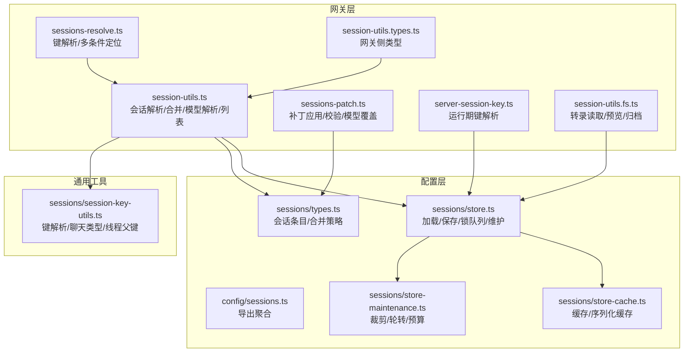
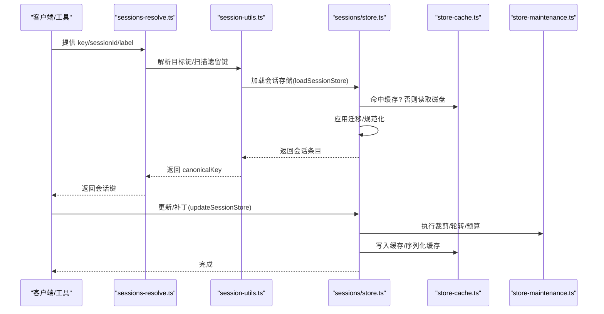
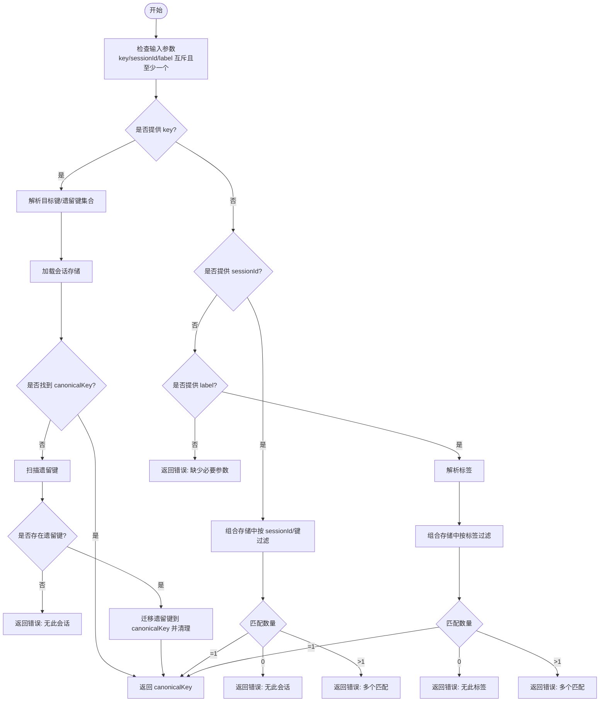
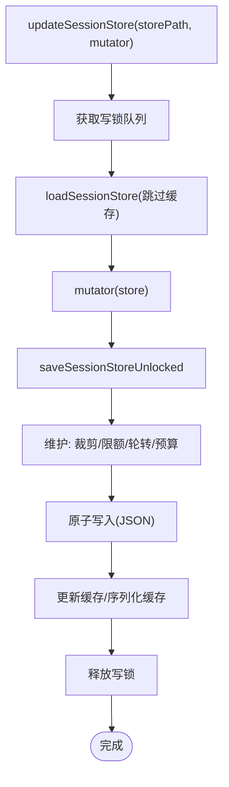
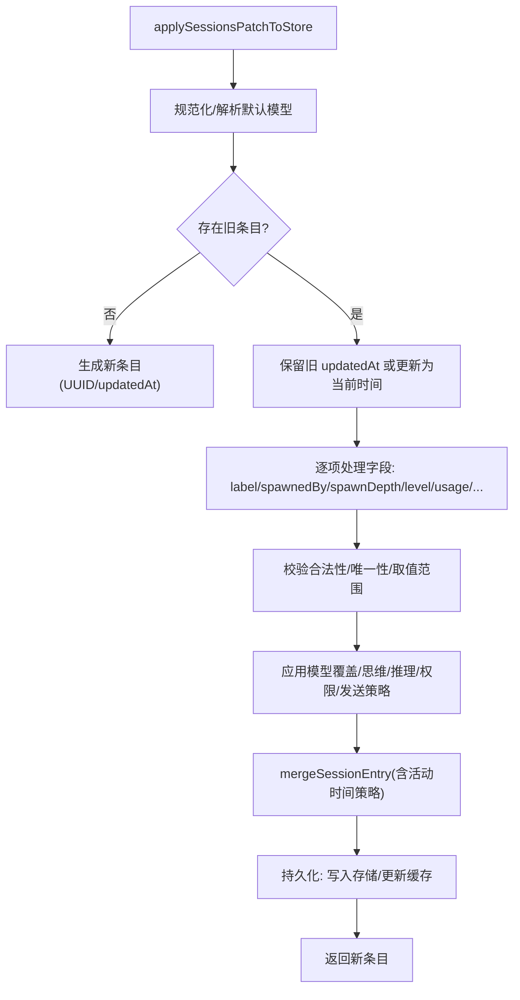
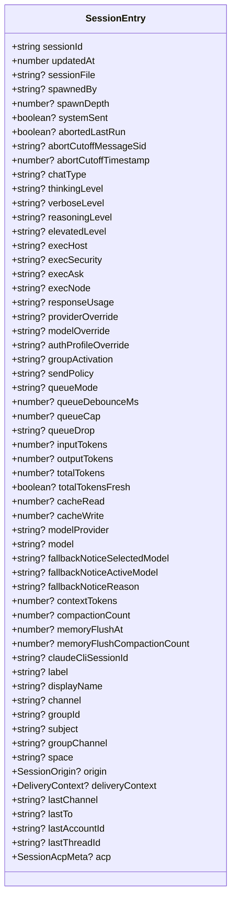
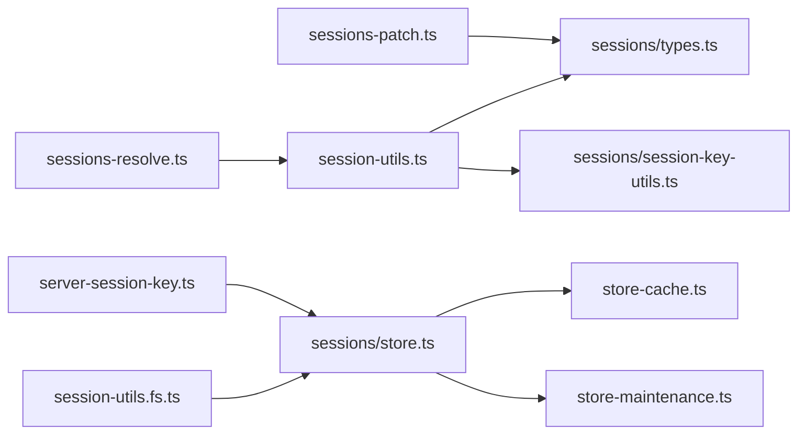

# 会话管理

<cite>
**本文引用的文件**
- [src/gateway/session-utils.ts](file://src/gateway/session-utils.ts)
- [src/gateway/sessions-resolve.ts](file://src/gateway/sessions-resolve.ts)
- [src/gateway/sessions-patch.ts](file://src/gateway/sessions-patch.ts)
- [src/gateway/server-session-key.ts](file://src/gateway/server-session-key.ts)
- [src/gateway/session-utils.fs.ts](file://src/gateway/session-utils.fs.ts)
- [src/gateway/session-utils.types.ts](file://src/gateway/session-utils.types.ts)
- [src/config/sessions.ts](file://src/config/sessions.ts)
- [src/config/sessions/store.ts](file://src/config/sessions/store.ts)
- [src/config/sessions/types.ts](file://src/config/sessions/types.ts)
- [src/config/sessions/store-cache.ts](file://src/config/sessions/store-cache.ts)
- [src/config/sessions/store-maintenance.ts](file://src/config/sessions/store-maintenance.ts)
- [src/sessions/session-key-utils.ts](file://src/sessions/session-key-utils.ts)
</cite>

## 目录
1. [简介](#简介)
2. [项目结构](#项目结构)
3. [核心组件](#核心组件)
4. [架构总览](#架构总览)
5. [详细组件分析](#详细组件分析)
6. [依赖分析](#依赖分析)
7. [性能考量](#性能考量)
8. [故障排查指南](#故障排查指南)
9. [结论](#结论)
10. [附录](#附录)

## 简介
本文件系统性梳理 OpenClaw 网关的会话管理系统，覆盖会话生命周期管理、状态跟踪、路由解析、数据结构与持久化、缓存与磁盘维护、并发写入控制、事务一致性保障，以及与渠道、代理、工具的交互关系。目标是帮助开发者与运维人员快速理解并高效使用会话管理能力。

## 项目结构
围绕“会话”主题，相关代码主要分布在以下模块：
- 网关层：会话解析、补丁应用、运行期键解析、文件读取与预览
- 配置层：会话存储、类型定义、缓存、维护策略（裁剪、归档、轮转）
- 通用工具：会话键解析与分类、聊天类型推断

图表来源
- [src/gateway/session-utils.ts](file://src/gateway/session-utils.ts#L1-L899)
- [src/gateway/sessions-resolve.ts](file://src/gateway/sessions-resolve.ts#L1-L153)
- [src/gateway/sessions-patch.ts](file://src/gateway/sessions-patch.ts#L1-L365)
- [src/gateway/server-session-key.ts](file://src/gateway/server-session-key.ts#L1-L23)
- [src/gateway/session-utils.fs.ts](file://src/gateway/session-utils.fs.ts#L1-L737)
- [src/gateway/session-utils.types.ts](file://src/gateway/session-utils.types.ts#L1-L79)
- [src/config/sessions.ts](file://src/config/sessions.ts#L1-L14)
- [src/config/sessions/store.ts](file://src/config/sessions/store.ts#L1-L863)
- [src/config/sessions/types.ts](file://src/config/sessions/types.ts#L1-L376)
- [src/config/sessions/store-cache.ts](file://src/config/sessions/store-cache.ts#L1-L82)
- [src/config/sessions/store-maintenance.ts](file://src/config/sessions/store-maintenance.ts#L1-L328)
- [src/sessions/session-key-utils.ts](file://src/sessions/session-key-utils.ts#L1-L133)

章节来源
- [src/gateway/session-utils.ts](file://src/gateway/session-utils.ts#L1-L899)
- [src/config/sessions/store.ts](file://src/config/sessions/store.ts#L1-L863)

## 核心组件
- 会话键解析与规范化：支持全局/未知、主键别名、代理作用域、大小写不敏感匹配与遗留键迁移。
- 会话存储与并发控制：基于文件锁的串行化写入，带队列与超时/过期保护；支持缓存与序列化缓存。
- 维护与磁盘预算：按时间裁剪、数量上限、文件轮转、归档清理、磁盘配额预警与执行。
- 补丁应用与一致性：对会话条目进行字段级校验与合并，确保数据一致性与默认回退。
- 路由与运行期键：从运行上下文反查会话键，支持跨通道/代理的会话识别。
- 文件与预览：转录读取、标题字段提取、消息预览、工具调用摘要、归档与清理。

章节来源
- [src/gateway/sessions-resolve.ts](file://src/gateway/sessions-resolve.ts#L1-L153)
- [src/gateway/sessions-patch.ts](file://src/gateway/sessions-patch.ts#L1-L365)
- [src/gateway/server-session-key.ts](file://src/gateway/server-session-key.ts#L1-L23)
- [src/config/sessions/store.ts](file://src/config/sessions/store.ts#L540-L706)
- [src/config/sessions/store-maintenance.ts](file://src/config/sessions/store-maintenance.ts#L1-L328)
- [src/gateway/session-utils.fs.ts](file://src/gateway/session-utils.fs.ts#L1-L737)

## 架构总览
下图展示了会话管理在网关中的关键交互路径：请求进入后通过解析器确定会话键，随后在存储层完成加载/更新/保存，并结合缓存与维护策略保障性能与稳定性。

图表来源
- [src/gateway/sessions-resolve.ts](file://src/gateway/sessions-resolve.ts#L19-L152)
- [src/gateway/session-utils.ts](file://src/gateway/session-utils.ts#L480-L533)
- [src/config/sessions/store.ts](file://src/config/sessions/store.ts#L195-L270)
- [src/config/sessions/store-cache.ts](file://src/config/sessions/store-cache.ts#L41-L81)
- [src/config/sessions/store-maintenance.ts](file://src/config/sessions/store-maintenance.ts#L38-L148)

## 详细组件分析

### 会话键解析与路由
- 支持三种输入：key、sessionId、label。三者互斥且至少一个必填。
- 当提供 key 时，先解析 canonicalKey，再加载存储，若未命中则扫描遗留键并迁移至 canonicalKey，最后返回 canonicalKey。
- 当提供 sessionId 时，在组合存储中按 sessionId 或 key 匹配，限制搜索范围并去重。
- 当提供 label 时，先解析标签，再在组合存储中按标签过滤，限制搜索范围并去重。

图表来源
- [src/gateway/sessions-resolve.ts](file://src/gateway/sessions-resolve.ts#L19-L152)

章节来源
- [src/gateway/sessions-resolve.ts](file://src/gateway/sessions-resolve.ts#L1-L153)
- [src/gateway/session-utils.ts](file://src/gateway/session-utils.ts#L480-L533)

### 会话存储与并发控制
- 加载：支持缓存命中与序列化缓存；Windows 上对空文件/锁定做重试；应用迁移与规范化。
- 保存：在写入前执行维护（裁剪、限额、轮转、磁盘预算），然后原子写入，失败重试；写后更新缓存。
- 并发：以会话文件为粒度的写锁队列，支持超时与过期检测；队列串行化执行，避免竞态。

图表来源
- [src/config/sessions/store.ts](file://src/config/sessions/store.ts#L526-L538)
- [src/config/sessions/store.ts](file://src/config/sessions/store.ts#L340-L514)
- [src/config/sessions/store.ts](file://src/config/sessions/store.ts#L674-L706)

章节来源
- [src/config/sessions/store.ts](file://src/config/sessions/store.ts#L195-L270)
- [src/config/sessions/store.ts](file://src/config/sessions/store.ts#L340-L514)
- [src/config/sessions/store.ts](file://src/config/sessions/store.ts#L526-L538)
- [src/config/sessions/store.ts](file://src/config/sessions/store.ts#L674-L706)

### 会话补丁与一致性
- 字段校验：spawnedBy/spawnDepth 仅允许子代理会话；label 全局唯一；execHost/execSecurity/execAsk 取值限定；model 依赖模型目录校验。
- 合并策略：保留活动时间策略可防止元数据更新误刷新活跃时间；runtime 模型字段规范化；provider 与 model 不一致时清理 provider。
- 思维等级与高级模式：根据模型能力约束 xhigh 等级别；支持显式关闭以避免默认启用。

图表来源
- [src/gateway/sessions-patch.ts](file://src/gateway/sessions-patch.ts#L65-L365)
- [src/config/sessions/types.ts](file://src/config/sessions/types.ts#L246-L284)

章节来源
- [src/gateway/sessions-patch.ts](file://src/gateway/sessions-patch.ts#L1-L365)
- [src/config/sessions/types.ts](file://src/config/sessions/types.ts#L1-L376)

### 会话数据结构与持久化
- 会话条目：包含运行时模型、令牌统计、发送策略、执行主机/安全策略、思维/推理/显式级别、来源/投递上下文、ACp 元信息等。
- 合并与规范化：提供两种合并策略（触活动/保活动）；运行时模型字段规范化；新鲜度标记用于上下文利用率显示。
- 存储路径：支持模板化路径（含 agentId），按代理维度隔离存储；支持全局/未知键的特殊处理。

图表来源
- [src/config/sessions/types.ts](file://src/config/sessions/types.ts#L68-L167)

章节来源
- [src/config/sessions/types.ts](file://src/config/sessions/types.ts#L1-L376)

### 会话超时处理与并发访问控制
- 超时与过期：写锁队列支持超时与过期检测；长时间占用会触发拒绝与日志告警。
- 并发写入：同一存储文件串行化写入，避免竞态；Windows 上对临时写入失败做重试。
- 活动时间策略：元数据更新不刷新 updatedAt，避免误判活跃；补丁更新遵循策略以保持一致性。

章节来源
- [src/config/sessions/store.ts](file://src/config/sessions/store.ts#L674-L706)
- [src/config/sessions/store.ts](file://src/config/sessions/store.ts#L340-L514)
- [src/config/sessions/types.ts](file://src/config/sessions/types.ts#L246-L284)

### 事务管理与一致性
- 原子写入：采用原子写入策略，失败重试；写后缓存同步，避免脏读。
- 维护事务：裁剪、限额、轮转、归档在单次写入内完成，保证状态一致。
- 合并事务：补丁应用在锁内完成，合并策略与规范化确保字段一致性。

章节来源
- [src/config/sessions/store.ts](file://src/config/sessions/store.ts#L577-L588)
- [src/config/sessions/store.ts](file://src/config/sessions/store.ts#L389-L460)
- [src/gateway/sessions-patch.ts](file://src/gateway/sessions-patch.ts#L362-L365)

### 会话与渠道、代理、工具的交互
- 渠道/代理：会话条目包含来源与投递上下文，支持跨渠道识别；运行期键解析支持从运行 ID 反查会话键。
- 工具：会话预览包含工具调用摘要；转录读取支持工具调用名称提取；会话条目包含技能快照与系统提示报告。
- 键分类：支持直聊/群聊/频道/未知类型识别，便于路由与界面展示。

章节来源
- [src/gateway/server-session-key.ts](file://src/gateway/server-session-key.ts#L1-L23)
- [src/gateway/session-utils.fs.ts](file://src/gateway/session-utils.fs.ts#L596-L602)
- [src/gateway/session-utils.fs.ts](file://src/gateway/session-utils.fs.ts#L618-L660)
- [src/sessions/session-key-utils.ts](file://src/sessions/session-key-utils.ts#L37-L59)

## 依赖分析
- 网关层依赖配置层的存储与类型定义；会话工具函数依赖通用键解析工具。
- 存储层内部依赖缓存与维护模块；维护模块依赖配置解析与字节/时长解析工具。
- 运行期键解析依赖配置加载与存储读取。

图表来源
- [src/gateway/sessions-resolve.ts](file://src/gateway/sessions-resolve.ts#L1-L153)
- [src/gateway/session-utils.ts](file://src/gateway/session-utils.ts#L1-L899)
- [src/gateway/sessions-patch.ts](file://src/gateway/sessions-patch.ts#L1-L365)
- [src/gateway/server-session-key.ts](file://src/gateway/server-session-key.ts#L1-L23)
- [src/gateway/session-utils.fs.ts](file://src/gateway/session-utils.fs.ts#L1-L737)
- [src/config/sessions/types.ts](file://src/config/sessions/types.ts#L1-L376)
- [src/config/sessions/store.ts](file://src/config/sessions/store.ts#L1-L863)
- [src/config/sessions/store-cache.ts](file://src/config/sessions/store-cache.ts#L1-L82)
- [src/config/sessions/store-maintenance.ts](file://src/config/sessions/store-maintenance.ts#L1-L328)
- [src/sessions/session-key-utils.ts](file://src/sessions/session-key-utils.ts#L1-L133)

章节来源
- [src/gateway/session-utils.ts](file://src/gateway/session-utils.ts#L1-L899)
- [src/config/sessions/store.ts](file://src/config/sessions/store.ts#L1-L863)

## 性能考量
- 缓存策略：会话存储支持 TTL 缓存与序列化缓存，减少重复解析与 IO；缓存失效基于 mtime/size 判断。
- 维护策略：按时间裁剪与数量上限控制存储规模；文件轮转避免单文件过大；磁盘预算高水位预警与执行。
- 并发优化：写锁队列串行化写入，避免竞争；Windows 上对空文件/锁定做短暂停顿重试。
- 预览与读取：转录读取采用分块与尾部扫描策略，限制最大读取字节数与行数，兼顾性能与准确性。

章节来源
- [src/config/sessions/store-cache.ts](file://src/config/sessions/store-cache.ts#L41-L81)
- [src/config/sessions/store-maintenance.ts](file://src/config/sessions/store-maintenance.ts#L130-L148)
- [src/config/sessions/store.ts](file://src/config/sessions/store.ts#L213-L270)
- [src/gateway/session-utils.fs.ts](file://src/gateway/session-utils.fs.ts#L473-L527)

## 故障排查指南
- 会话不存在：当 key/sessionId/label 无法匹配或多重匹配时，返回明确错误码与提示。
- 键迁移失败：遗留键迁移需确保 canonicalKey 未被占用；如冲突，需人工清理或等待后续维护。
- 写入失败：Windows 上可能因文件锁定导致写入失败，系统内置重试；若仍失败，检查磁盘空间与权限。
- 缓存异常：缓存与序列化缓存不一致可能导致读取旧数据；可通过禁用缓存或清理缓存解决。
- 维护影响：维护模式为“仅告警”时不会删除活跃会话；生产环境建议使用“执行”模式并设置合理阈值。

章节来源
- [src/gateway/sessions-resolve.ts](file://src/gateway/sessions-resolve.ts#L31-L106)
- [src/config/sessions/store.ts](file://src/config/sessions/store.ts#L470-L513)
- [src/config/sessions/store-cache.ts](file://src/config/sessions/store-cache.ts#L15-L23)
- [src/config/sessions/store-maintenance.ts](file://src/config/sessions/store-maintenance.ts#L353-L371)

## 结论
OpenClaw 的会话管理系统通过“键解析—存储—维护—并发控制”的完整链路，实现了高可用、高性能、强一致的会话生命周期管理。其设计兼顾了跨渠道/代理的路由需求与工具生态集成，同时提供了完善的缓存、磁盘预算与维护策略，适合在复杂场景下稳定运行。

## 附录
- 会话键解析与规范化：支持大小写不敏感、遗留键迁移、主键别名解析。
- 会话补丁应用：字段级校验、模型覆盖、级别约束、唯一性检查。
- 存储与维护：裁剪、限额、轮转、归档清理、磁盘预算。
- 运行期键解析：从运行 ID 反查会话键，支持跨通道识别。
- 文件与预览：转录读取、标题字段提取、消息预览、工具调用摘要、归档与清理。

章节来源
- [src/gateway/session-utils.ts](file://src/gateway/session-utils.ts#L407-L442)
- [src/gateway/sessions-patch.ts](file://src/gateway/sessions-patch.ts#L132-L151)
- [src/config/sessions/store-maintenance.ts](file://src/config/sessions/store-maintenance.ts#L155-L259)
- [src/gateway/server-session-key.ts](file://src/gateway/server-session-key.ts#L6-L22)
- [src/gateway/session-utils.fs.ts](file://src/gateway/session-utils.fs.ts#L295-L365)