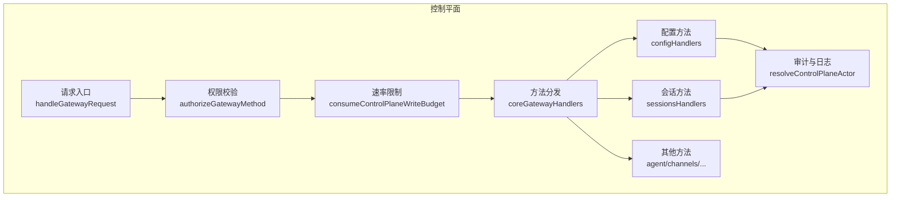
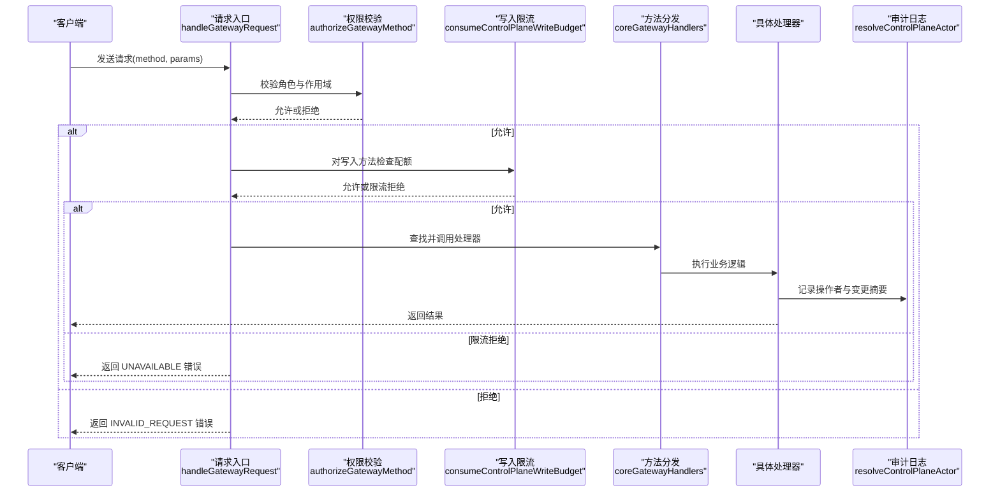
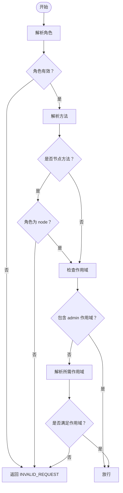
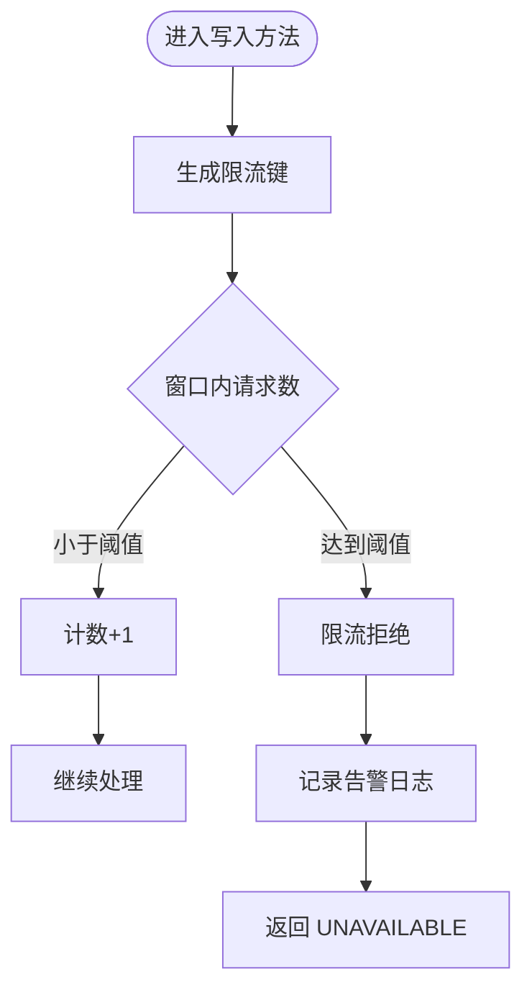
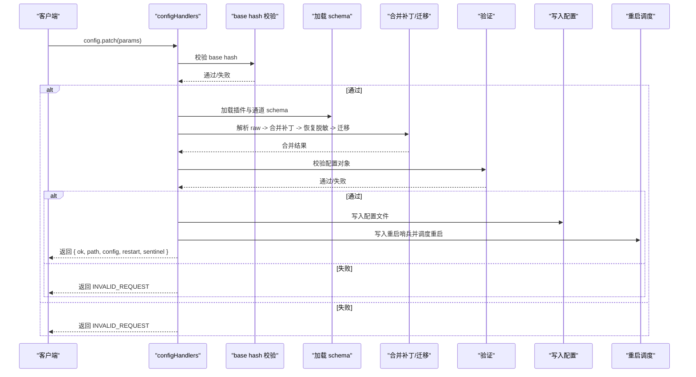
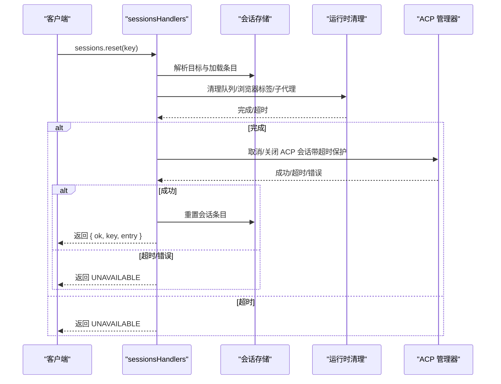
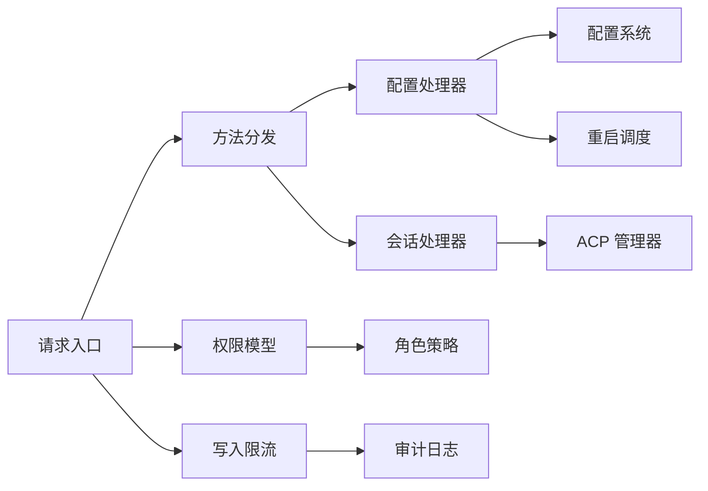

# 控制平面

<cite>
**本文引用的文件**
- [src/gateway/server-methods.ts](file://src/gateway/server-methods.ts)
- [src/gateway/method-scopes.ts](file://src/gateway/method-scopes.ts)
- [src/gateway/role-policy.ts](file://src/gateway/role-policy.ts)
- [src/gateway/control-plane-audit.ts](file://src/gateway/control-plane-audit.ts)
- [src/gateway/control-plane-rate-limit.ts](file://src/gateway/control-plane-rate-limit.ts)
- [src/gateway/server-methods.control-plane-rate-limit.test.ts](file://src/gateway/server-methods.control-plane-rate-limit.test.ts)
- [src/gateway/server-methods/config.ts](file://src/gateway/server-methods/config.ts)
- [src/gateway/server-methods/sessions.ts](file://src/gateway/server-methods/sessions.ts)
- [src/gateway/protocol/schema/error-codes.ts](file://src/gateway/protocol/schema/error-codes.ts)
- [src/gateway/server-methods/types.ts](file://src/gateway/server-methods/types.ts)
- [src/gateway/server-methods/validation.ts](file://src/gateway/server-methods/validation.ts)
- [src/gateway/server-methods/base-hash.ts](file://src/gateway/server-methods/base-hash.ts)
- [src/gateway/config-reload.ts](file://src/gateway/config-reload.ts)
- [src/gateway/sessions-resolve.ts](file://src/gateway/sessions-resolve.ts)
- [src/gateway/sessions-patch.ts](file://src/gateway/sessions-patch.ts)
- [src/gateway/session-utils.ts](file://src/gateway/session-utils.ts)
- [src/gateway/protocol/index.ts](file://src/gateway/protocol/index.ts)
- [src/gateway/protocol/client-info.ts](file://src/gateway/protocol/client-info.ts)
- [src/agents/acp/control-plane/manager.ts](file://src/agents/acp/control-plane/manager.ts)
- [src/config/config.ts](file://src/config/config.ts)
- [src/config/merge-patch.ts](file://src/config/merge-patch.ts)
- [src/config/redact-snapshot.ts](file://src/config/redact-snapshot.ts)
- [src/config/schema.ts](file://src/config/schema.ts)
- [src/infra/restart-sentinel.ts](file://src/infra/restart-sentinel.ts)
- [src/infra/restart.ts](file://src/infra/restart.ts)
- [src/logging.ts](file://src/logging.ts)
- [src/security/audit.ts](file://src/security/audit.ts)
</cite>

## 目录
1. [简介](#简介)
2. [项目结构](#项目结构)
3. [核心组件](#核心组件)
4. [架构总览](#架构总览)
5. [详细组件分析](#详细组件分析)
6. [依赖关系分析](#依赖关系分析)
7. [性能考量](#性能考量)
8. [故障排查指南](#故障排查指南)
9. [结论](#结论)
10. [附录](#附录)

## 简介
本文件系统化阐述 OpenClaw 网关“控制平面”的设计理念、方法路由机制、权限控制体系与安全审计，并对会话管理、代理控制、工具调用、配置更新等核心功能进行深入解析。文档同时给出 API 规范、错误码定义、版本兼容性处理建议、典型调用流程与响应格式说明，以及安全机制与审计日志记录策略。

## 项目结构
控制平面位于网关服务内部，围绕统一的请求入口进行方法分发与鉴权校验，核心模块包括：
- 请求入口与路由：统一授权、速率限制、方法分发与作用域判定
- 权限模型：角色与操作范围（读/写/审批/配对/管理员）的映射
- 审计与限流：控制平面操作的审计标识与写入限流
- 方法实现：配置、会话、代理、系统等子域处理器
- 协议与错误：统一的错误形状与错误码
- 配置与重启：配置变更的校验、合并、重载与重启调度

图表来源
- [src/gateway/server-methods.ts](file://src/gateway/server-methods.ts#L98-L156)
- [src/gateway/method-scopes.ts](file://src/gateway/method-scopes.ts#L1-L213)
- [src/gateway/control-plane-rate-limit.ts](file://src/gateway/control-plane-rate-limit.ts#L1-L87)
- [src/gateway/server-methods/config.ts](file://src/gateway/server-methods/config.ts#L261-L515)
- [src/gateway/server-methods/sessions.ts](file://src/gateway/server-methods/sessions.ts#L330-L754)
- [src/gateway/control-plane-audit.ts](file://src/gateway/control-plane-audit.ts#L1-L41)

章节来源
- [src/gateway/server-methods.ts](file://src/gateway/server-methods.ts#L1-L156)
- [src/gateway/method-scopes.ts](file://src/gateway/method-scopes.ts#L1-L213)
- [src/gateway/control-plane-rate-limit.ts](file://src/gateway/control-plane-rate-limit.ts#L1-L87)
- [src/gateway/control-plane-audit.ts](file://src/gateway/control-plane-audit.ts#L1-L41)

## 核心组件
- 请求入口与路由
  - 统一鉴权：基于角色与作用域判定是否允许访问
  - 写入限流：对特定控制平面写入方法施加速率限制
  - 方法分发：按方法名分派到具体处理器
- 权限控制
  - 角色：operator/node
  - 作用域：admin/read/write/approvals/pairing
  - 前缀规则：以 config./wizard./update. 开头的方法默认 admin-only
- 审计与日志
  - Actor 标识：actor、设备 ID、客户端 IP、连接 ID
  - 变更路径摘要：仅记录关键变更路径，避免敏感信息泄露
- 方法实现
  - 配置：获取、模式、查找、设置、补丁、应用；支持 base hash 校验、插件 schema、重载与重启调度
  - 会话：列出、预览、解析、补丁、重置、删除、获取、压缩；含 ACP 运行时清理与生命周期事件

章节来源
- [src/gateway/server-methods.ts](file://src/gateway/server-methods.ts#L37-L96)
- [src/gateway/method-scopes.ts](file://src/gateway/method-scopes.ts#L1-L213)
- [src/gateway/role-policy.ts](file://src/gateway/role-policy.ts#L1-L24)
- [src/gateway/control-plane-audit.ts](file://src/gateway/control-plane-audit.ts#L1-L41)
- [src/gateway/server-methods/config.ts](file://src/gateway/server-methods/config.ts#L261-L515)
- [src/gateway/server-methods/sessions.ts](file://src/gateway/server-methods/sessions.ts#L330-L754)

## 架构总览
控制平面采用“入口统一、分层鉴权、按域分发”的设计。请求进入后先做角色与作用域校验，再根据方法类型决定是否触发写入限流，随后由核心处理器集合分发到具体方法实现。配置与会话两类核心能力在审计与重启方面有额外保障。

图表来源
- [src/gateway/server-methods.ts](file://src/gateway/server-methods.ts#L98-L156)
- [src/gateway/control-plane-rate-limit.ts](file://src/gateway/control-plane-rate-limit.ts#L34-L80)
- [src/gateway/control-plane-audit.ts](file://src/gateway/control-plane-audit.ts#L18-L29)
- [src/gateway/server-methods/config.ts](file://src/gateway/server-methods/config.ts#L407-L411)
- [src/gateway/server-methods/sessions.ts](file://src/gateway/server-methods/sessions.ts#L491-L503)

## 详细组件分析

### 权限控制体系
- 角色与方法授权
  - operator 可执行大多数方法；node 仅能执行节点专用方法
  - 未分类方法默认拒绝
- 作用域与最小权限
  - admin/read/write/approvals/pairing 五类作用域
  - 读写方法需要对应作用域或更高权限
  - admin 前缀方法默认 admin-only
- 授权判定流程
  - 若携带 admin 作用域则直接放行
  - 否则根据方法解析所需作用域，检查是否满足
  - 节点方法仅 node 角色可执行

图表来源
- [src/gateway/role-policy.ts](file://src/gateway/role-policy.ts#L1-L24)
- [src/gateway/method-scopes.ts](file://src/gateway/method-scopes.ts#L174-L205)

章节来源
- [src/gateway/role-policy.ts](file://src/gateway/role-policy.ts#L1-L24)
- [src/gateway/method-scopes.ts](file://src/gateway/method-scopes.ts#L1-L213)

### 方法作用域定义与参数验证
- 作用域映射
  - approvals/pairing/read/write/admin 与具体方法的多对多映射
  - admin 前缀方法自动归类为 admin-only
- 参数验证
  - 每个方法在执行前通过对应的参数校验器进行校验
  - 校验失败返回 INVALID_REQUEST，包含详细错误信息
- 返回值处理
  - 成功返回 { ok: true, ... } 或具体数据结构
  - 失败返回统一错误形状，包含 code/message/details/retryable/retryAfterMs

章节来源
- [src/gateway/method-scopes.ts](file://src/gateway/method-scopes.ts#L29-L129)
- [src/gateway/server-methods/validation.ts](file://src/gateway/server-methods/validation.ts#L1-L200)
- [src/gateway/protocol/schema/error-codes.ts](file://src/gateway/protocol/schema/error-codes.ts#L1-L23)

### 写入限流与审计
- 写入限流
  - 针对 config.apply、config.patch、update.run 三类写入方法
  - 60 秒窗口内最多 3 次请求；超过触发 UNAVAILABLE 并提示 retryAfterMs
  - 限流键由设备 ID、客户端 IP 组合生成，必要时回退到连接 ID
- 审计日志
  - 解析 actor 信息，记录方法名、变更路径摘要、重试时间等
  - 配置写入时记录 restartReason 与审计元数据

图表来源
- [src/gateway/control-plane-rate-limit.ts](file://src/gateway/control-plane-rate-limit.ts#L21-L80)
- [src/gateway/server-methods.ts](file://src/gateway/server-methods.ts#L107-L132)
- [src/gateway/control-plane-audit.ts](file://src/gateway/control-plane-audit.ts#L18-L29)

章节来源
- [src/gateway/control-plane-rate-limit.ts](file://src/gateway/control-plane-rate-limit.ts#L1-L87)
- [src/gateway/server-methods.control-plane-rate-limit.test.ts](file://src/gateway/server-methods.control-plane-rate-limit.test.ts#L80-L132)
- [src/gateway/server-methods.ts](file://src/gateway/server-methods.ts#L98-L156)
- [src/gateway/control-plane-audit.ts](file://src/gateway/control-plane-audit.ts#L1-L41)

### 配置更新 API（config.*）
- 方法族
  - config.get：获取当前配置快照与脱敏后的配置对象
  - config.schema / config.schema.lookup：获取配置 schema 与定位 schema 片段
  - config.set / config.patch / config.apply：设置、补丁与应用配置
- 关键流程
  - base hash 校验：确保客户端持有最新配置快照
  - 插件 schema 注入：动态构建包含插件与通道的 schema
  - 合并补丁：使用 JSON5 与合并策略，恢复脱敏字段，迁移旧配置
  - 校验与写盘：验证通过后写入配置文件
  - 变更审计：记录变更路径摘要与操作者信息
  - 重启调度：写入后写入重启哨兵并调度 SIGUSR1 重启，支持延迟与合并
- 参数与返回
  - 所有方法均通过参数校验器校验
  - 返回值包含 ok/path/config 等字段；config.apply/patch 还包含 restart/sentinel 字段

图表来源
- [src/gateway/server-methods/config.ts](file://src/gateway/server-methods/config.ts#L332-L453)
- [src/gateway/server-methods/config.ts](file://src/gateway/server-methods/config.ts#L454-L513)
- [src/gateway/server-methods/base-hash.ts](file://src/gateway/server-methods/base-hash.ts#L1-L200)
- [src/gateway/config-reload.ts](file://src/gateway/config-reload.ts#L1-L200)
- [src/infra/restart-sentinel.ts](file://src/infra/restart-sentinel.ts#L1-L200)
- [src/infra/restart.ts](file://src/infra/restart.ts#L1-L200)

章节来源
- [src/gateway/server-methods/config.ts](file://src/gateway/server-methods/config.ts#L261-L515)
- [src/gateway/server-methods/base-hash.ts](file://src/gateway/server-methods/base-hash.ts#L1-L200)
- [src/config/merge-patch.ts](file://src/config/merge-patch.ts#L1-L200)
- [src/config/redact-snapshot.ts](file://src/config/redact-snapshot.ts#L1-L200)
- [src/config/schema.ts](file://src/config/schema.ts#L1-L200)
- [src/infra/restart-sentinel.ts](file://src/infra/restart-sentinel.ts#L1-L200)
- [src/infra/restart.ts](file://src/infra/restart.ts#L1-L200)

### 会话管理 API（sessions.*）
- 方法族
  - sessions.list / preview / resolve / get：查询、预览、解析与获取会话
  - sessions.patch / reset / delete / compact：补丁、重置、删除、压缩
- 关键流程
  - 会话键解析与存储目标定位
  - 补丁应用：迁移与裁剪旧键、应用补丁、解析模型引用
  - 重置：清理运行时、关闭 ACP 会话、归档旧转录
  - 删除：清理运行时、关闭 ACP 会话、可选归档转录
  - 压缩：保留最近 N 行，清理 token 统计
- 安全与审计
  - WebChat 客户端禁止直接修改会话（除控制 UI 外），需通过聊天发送
  - ACP 会话清理带超时保护，超时返回 UNAVAILABLE
  - 生命周期事件与线程绑定解绑

图表来源
- [src/gateway/server-methods/sessions.ts](file://src/gateway/server-methods/sessions.ts#L465-L557)
- [src/gateway/server-methods/sessions.ts](file://src/gateway/server-methods/sessions.ts#L558-L628)
- [src/gateway/server-methods/sessions.ts](file://src/gateway/server-methods/sessions.ts#L651-L752)
- [src/agents/acp/control-plane/manager.ts](file://src/agents/acp/control-plane/manager.ts#L1-L200)

章节来源
- [src/gateway/server-methods/sessions.ts](file://src/gateway/server-methods/sessions.ts#L330-L754)
- [src/gateway/sessions-resolve.ts](file://src/gateway/sessions-resolve.ts#L1-L200)
- [src/gateway/sessions-patch.ts](file://src/gateway/sessions-patch.ts#L1-L200)
- [src/gateway/session-utils.ts](file://src/gateway/session-utils.ts#L1-L200)

### 代理控制与工具调用
- 代理控制
  - 通过 sessions.* 与 agent.* 系列方法实现代理生命周期管理与消息交互
- 工具调用
  - 工具目录与调用接口由工具目录处理器提供
  - HTTP /tools/invoke 的危险性评估与审计建议参见安全审计模块

章节来源
- [src/gateway/server-methods.ts](file://src/gateway/server-methods.ts#L67-L96)
- [src/gateway/server-methods/tools-catalog.ts](file://src/gateway/server-methods/tools-catalog.ts#L1-L200)
- [src/security/audit.ts](file://src/security/audit.ts#L401-L424)

### API 规范与错误码
- 统一错误形状
  - 包含 code、message、details、retryable、retryAfterMs 等字段
- 常用错误码
  - NOT_LINKED、NOT_PAIRED、AGENT_TIMEOUT、INVALID_REQUEST、UNAVAILABLE
- 方法返回约定
  - 成功：{ ok: true, ... } 或具体数据
  - 失败：统一错误形状

章节来源
- [src/gateway/protocol/schema/error-codes.ts](file://src/gateway/protocol/schema/error-codes.ts#L1-L23)
- [src/gateway/protocol/index.ts](file://src/gateway/protocol/index.ts#L1-L200)

### 版本兼容性处理
- 协议版本
  - 连接阶段包含 min/maxProtocol，用于双向兼容性协商
- 方法前缀
  - config./wizard./update. 前缀方法默认 admin-only，便于未来扩展
- 配置迁移
  - 配置补丁后执行旧配置迁移，保证向后兼容

章节来源
- [src/gateway/role-policy.ts](file://src/gateway/role-policy.ts#L1-L24)
- [src/gateway/method-scopes.ts](file://src/gateway/method-scopes.ts#L131-L137)
- [src/gateway/server-methods/config.ts](file://src/gateway/server-methods/config.ts#L393-L395)

### 安全机制与审计日志
- 安全要点
  - 控制 UI 与日志暴露风险评估与修复建议
  - HTTP /tools/invoke 危险工具重新启用的告警与建议
- 审计日志
  - 记录 actor、设备 ID、客户端 IP、连接 ID
  - 记录变更路径摘要与重启原因
  - 写入限流时记录 retryAfterMs 与限流键

章节来源
- [src/security/audit.ts](file://src/security/audit.ts#L401-L424)
- [src/gateway/control-plane-audit.ts](file://src/gateway/control-plane-audit.ts#L18-L29)
- [src/gateway/server-methods/config.ts](file://src/gateway/server-methods/config.ts#L407-L411)
- [src/gateway/server-methods/sessions.ts](file://src/gateway/server-methods/sessions.ts#L491-L503)

## 依赖关系分析
- 组件耦合
  - 请求入口依赖权限模型、限流与审计模块
  - 方法处理器依赖配置、会话工具与协议校验
- 外部依赖
  - 插件注册与通道配置影响 schema 生成
  - 重启调度依赖系统信号与重启哨兵

图表来源
- [src/gateway/server-methods.ts](file://src/gateway/server-methods.ts#L1-L36)
- [src/gateway/server-methods/config.ts](file://src/gateway/server-methods/config.ts#L1-L55)
- [src/gateway/server-methods/sessions.ts](file://src/gateway/server-methods/sessions.ts#L1-L58)
- [src/agents/acp/control-plane/manager.ts](file://src/agents/acp/control-plane/manager.ts#L1-L200)
- [src/infra/restart.ts](file://src/infra/restart.ts#L1-L200)

章节来源
- [src/gateway/server-methods.ts](file://src/gateway/server-methods.ts#L1-L36)
- [src/gateway/server-methods/config.ts](file://src/gateway/server-methods/config.ts#L1-L55)
- [src/gateway/server-methods/sessions.ts](file://src/gateway/server-methods/sessions.ts#L1-L58)

## 性能考量
- 限流窗口与配额
  - 60 秒 3 次写入配额适合控制平面的高频小批量写入场景
- 存储与 I/O
  - 配置写入与会话压缩在 I/O 密集场景下应避免并发高峰
- 超时与重试
  - ACP 会话清理与重启调度设置超时，防止阻塞请求链路

## 故障排查指南
- 常见错误
  - INVALID_REQUEST：参数校验失败或角色/作用域不匹配
  - UNAVAILABLE：写入限流触发或会话仍在活跃状态
- 排查步骤
  - 检查请求头与连接信息中的角色与作用域
  - 确认 base hash 是否最新（配置写入）
  - 查看审计日志中的 actor 与变更摘要
  - 对于会话操作，确认是否为 WebChat 客户端且非控制 UI
- 相关测试
  - 写入限流行为可通过单元测试验证

章节来源
- [src/gateway/server-methods.control-plane-rate-limit.test.ts](file://src/gateway/server-methods.control-plane-rate-limit.test.ts#L80-L132)
- [src/gateway/server-methods/sessions.ts](file://src/gateway/server-methods/sessions.ts#L83-L104)

## 结论
控制平面通过统一的请求入口、严格的权限模型、细粒度的作用域划分与写入限流，确保了配置与会话等关键操作的安全与稳定。配合审计日志与重启调度，实现了可观测、可追溯、可恢复的运维闭环。建议在生产环境中启用严格的安全审计与访问控制，并合理规划配置变更节奏以避免不必要的重启。

## 附录
- 方法清单（节选）
  - 配置：config.get、config.schema、config.schema.lookup、config.set、config.patch、config.apply
  - 会话：sessions.list、sessions.preview、sessions.resolve、sessions.patch、sessions.reset、sessions.delete、sessions.get、sessions.compact
- 审计字段
  - actor、deviceId、clientIp、connId、changedPaths、restartReason
- 速率限制
  - 方法集合：["config.apply", "config.patch", "update.run"]
  - 配额：3 次/60 秒