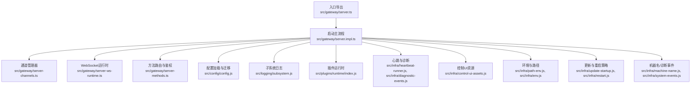
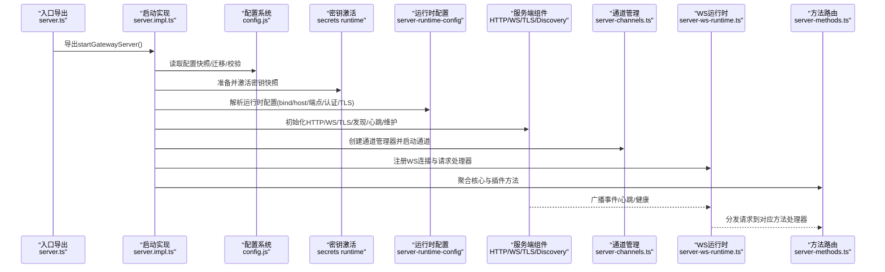
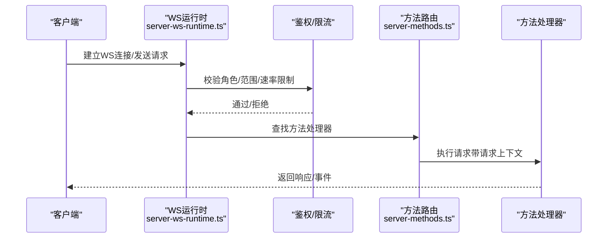
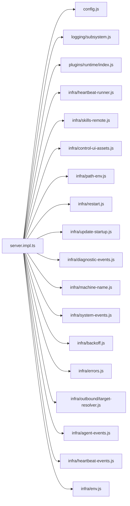

# 服务器实现

<cite>
**本文引用的文件**
- [src/gateway/server.ts](file://src/gateway/server.ts)
- [src/gateway/server.impl.ts](file://src/gateway/server.impl.ts)
- [src/gateway/server-channels.ts](file://src/gateway/server-channels.ts)
- [src/gateway/server-ws-runtime.ts](file://src/gateway/server-ws-runtime.ts)
- [src/gateway/server-methods.ts](file://src/gateway/server-methods.ts)
- [src/gateway/boot.ts](file://src/gateway/boot.ts)
- [src/config/config.js](file://src/config/config.js)
- [src/logging/subsystem.js](file://src/logging/subsystem.js)
- [src/plugins/runtime/index.js](file://src/plugins/runtime/index.js)
- [src/infra/heartbeat-runner.js](file://src/infra/heartbeat-runner.js)
- [src/infra/skills-remote.js](file://src/infra/skills-remote.js)
- [src/infra/control-ui-assets.js](file://src/infra/control-ui-assets.js)
- [src/infra/path-env.js](file://src/infra/path-env.js)
- [src/infra/restart.js](file://src/infra/restart.js)
- [src/infra/update-startup.js](file://src/infra/update-startup.js)
- [src/infra/diagnostic-events.js](file://src/infra/diagnostic-events.js)
- [src/infra/env.js](file://src/infra/env.js)
- [src/infra/machine-name.js](file://src/infra/machine-name.js)
- [src/infra/outbound/delivery-queue.js](file://src/infra/outbound/delivery-queue.js)
- [src/infra/outbound/deliver.js](file://src/infra/outbound/deliver.js)
- [src/infra/system-events.js](file://src/infra/system-events.js)
- [src/infra/backoff.js](file://src/infra/backoff.js)
- [src/infra/errors.js](file://src/infra/errors.js)
- [src/infra/outbound/target-resolver.js](file://src/infra/outbound/target-resolver.js)
- [src/infra/agent-events.js](file://src/infra/agent-events.js)
- [src/infra/heartbeat-events.js](file://src/infra/heartbeat-events.js)
- [src/infra/env.js](file://src/infra/env.js)
- [src/infra/restart.js](file://src/infra/restart.js)
- [src/infra/path-env.js](file://src/infra/path-env.js)
- [src/infra/control-ui-assets.js](file://src/infra/control-ui-assets.js)
- [src/infra/diagnostic-events.js](file://src/infra/diagnostic-events.js)
- [src/infra/update-startup.js](file://src/infra/update-startup.js)
- [src/infra/machine-name.js](file://src/infra/machine-name.js)
- [src/infra/skills-remote.js](file://src/infra/skills-remote.js)
- [src/infra/heartbeat-runner.js](file://src/infra/heartbeat-runner.js)
- [src/infra/system-events.js](file://src/infra/system-events.js)
- [src/infra/outbound/delivery-queue.js](file://src/infra/outbound/delivery-queue.js)
- [src/infra/outbound/deliver.js](file://src/infra/outbound/deliver.js)
- [src/infra/backoff.js](file://src/infra/backoff.js)
- [src/infra/errors.js](file://src/infra/errors.js)
- [src/infra/outbound/target-resolver.js](file://src/infra/outbound/target-resolver.js)
- [src/infra/agent-events.js](file://src/infra/agent-events.js)
- [src/infra/heartbeat-events.js](file://src/infra/heartbeat-events.js)
- [src/infra/env.js](file://src/infra/env.js)
- [src/infra/restart.js](file://src/infra/restart.js)
- [src/infra/path-env.js](file://src/infra/path-env.js)
- [src/infra/control-ui-assets.js](file://src/infra/control-ui-assets.js)
- [src/infra/diagnostic-events.js](file://src/infra/diagnostic-events.js)
- [src/infra/update-startup.js](file://src/infra/update-startup.js)
- [src/infra/machine-name.js](file://src/infra/machine-name.js)
- [src/infra/skills-remote.js](file://src/infra/skills-remote.js)
- [src/infra/heartbeat-runner.js](file://src/infra/heartbeat-runner.js)
- [src/infra/system-events.js](file://src/infra/system-events.js)
- [src/infra/outbound/delivery-queue.js](file://src/infra/outbound/delivery-queue.js)
- [src/infra/outbound/deliver.js](file://src/infra/outbound/deliver.js)
- [src/infra/backoff.js](file://src/infra/backoff.js)
- [src/infra/errors.js](file://src/infra/errors.js)
- [src/infra/outbound/target-resolver.js](file://src/infra/outbound/target-resolver.js)
- [src/infra/agent-events.js](file://src/infra/agent-events.js)
- [src/infra/heartbeat-events.js](file://src/infra/heartbeat-events.js)
- [src/infra/env.js](file://src/infra/env.js)
- [src/infra/restart.js](file://src/infra/restart.js)
- [src/infra/path-env.js](file://src/infra/path-env.js)
- [src/infra/control-ui-assets.js](file://src/infra/control-ui-assets.js)
- [src/infra/diagnostic-events.js](file://src/infra/diagnostic-events.js)
- [src/infra/update-startup.js](file://src/infra/update-startup.js)
- [src/infra/machine-name.js](file://src/infra/machine-name.js)
- [src/infra/skills-remote.js](file://src/infra/skills-remote.js)
- [src/infra/heartbeat-runner.js](file://src/infra/heartbeat-runner.js)
- [src/infra/system-events.js](file://src/infra/system-events.js)
- [src/infra/outbound/delivery-queue.js](file://src/infra/outbound/delivery-queue.js)
- [src/infra/outbound/deliver.js](file://src/infra/outbound/deliver.js)
- [src/infra/backoff.js](file://src/infra/backoff.js)
- [src/infra/errors.js](file://src/infra/errors.js)
- [src/infra/outbound/target-resolver.js](file://src/infra/outbound/target-resolver.js)
- [src/infra/agent-events.js](file://src/infra/agent-events.js)
- [src/infra/heartbeat-events.js](file://src/infra/heartbeat-events.js)
- [src/infra/env.js](file://src/infra/env.js)
- [src/infra/restart.js](file://src/infra/restart.js)
- [src/infra/path-env.js](file://src/infra/path-env.js)
- [src/infra/control-ui-assets.js](file://src/infra/control-ui-assets.js)
- [src/infra/diagnostic-events.js](file://src/infra/diagnostic-events.js)
- [src/infra/update-startup.js](file://src/infra/update-startup.js)
- [src/infra/machine-name.js](file://src/infra/machine-name.js)
- [src/infra/skills-remote.js](file://src/infra/skills-remote.js)
- [src/infra/heartbeat-runner.js](file://src/infra/heartbeat-runner.js)
- [src/infra/system-events.js](file://src/infra/system-events.js)
- [src/infra/outbound/delivery-queue.js](file://src/infra/outbound/delivery-queue.js)
- [src/infra/outbound/deliver.js](file://src/infra/outbound/deliver.js)
- [src/infra/backoff.js](file://src/infra/backoff.js)
- [src/infra/errors.js](file://src/infra/errors.js)
- [src/infra/outbound/target-resolver.js](file://src/infra/outbound/target-resolver.js)
- [src/infra/agent-events.js](file://src/infra/agent-events.js)
- [src/infra/heartbeat-events.js](file://src/infra/heartbeat-events.js)
- [src/infra/env.js](file://src/infra/env.js)
- [src/infra/restart.js](file://src/infra/restart.js)
- [src/infra/path-env.js](file://src/infra/path-env.js)
- [src/infra/control-ui-assets.js](file://src/infra/control-ui-assets.js)
- [src/infra/diagnostic-events.js](file://src/infra/diagnostic-events.js)
- [src/infra/update-startup.js](file://src/infra/update-startup.js)
- [src/infra/machine-name.js](file://src/infra/machine-name.js)
- [src/infra/skills-remote.js](file://src/infra/skills-remote.js)
- [src/infra/heartbeat-runner.js](file://src/infra/heartbeat-runner.js)
- [src/infra/system-events.js](file://src/infra/system-events.js)
- [src/infra/outbound/delivery-queue.js](file://src/infra/outbound/delivery-queue.js)
- [src/infra/outbound/deliver.js](file://src/infra/outbound/deliver.js)
- [src/infra/backoff.js](file://src/infra/backoff.js)
- [src/infra/errors.js](file://src/infra/errors.js)
- [src/infra/outbound/target-resolver.js](file://src/infra/outbound/target-resolver.js)
- [src/infra/agent-events.js](file://src/infra/agent-events.js)
- [src/infra/heartbeat-events.js](file://src/infra/heartbeat-events.js)
- [src/infra/env.js](file://src/infra/env.js)
- [src/infra/restart.js](file://src/infra/restart.js)
- [src/infra/path-env.js](file://src/infra/path-env.js)
- [src/infra/control-ui-assets.js](file://src/infra/control-ui-assets.js)
- [src/infra/diagnostic-events.js](file://src/infra/diagnostic-events.js)
- [src/infra/update-startup.js](file://src/infra/update-startup.js)
- [src/infra/machine-name.js](file://src/infra/machine-name.js)
- [src/infra/skills-remote.js](file://src/infra/skills-remote.js)
- [src/infra/heartbeat-runner.js](file://src/infra/heartbeat-runner.js)
- [src/infra/system-events.js](file://src/infra/system-events.js)
- [src/infra/outbound/delivery-queue.js](file://src/infra/outbound/delivery-queue.js)
- [src/infra/outbound/deliver.js](file://src/infra/outbound/deliver.js)
- [src/infra/backoff.js](file://src/infra/backoff.js)
- [src/infra/errors.js](file://src/infra/errors.js)
- [src/infra/outbound/target-resolver.js](file://src/infra/outbound/target-resolver.js......
</cite>

## 目录
1. [简介](#简介)
2. [项目结构](#项目结构)
3. [核心组件](#核心组件)
4. [架构总览](#架构总览)
5. [详细组件分析](#详细组件分析)
6. [依赖关系分析](#依赖关系分析)
7. [性能考虑](#性能考虑)
8. [故障排查指南](#故障排查指南)
9. [结论](#结论)
10. [附录](#附录)

## 简介
本文件面向OpenClaw网关服务器的实现，系统性梳理其启动流程、初始化过程、配置加载机制、HTTP与WebSocket请求处理、生命周期管理、错误处理与健康检查、性能调优与监控指标，并给出可直接定位到源码位置的示例路径，帮助开发者快速理解与扩展。

## 项目结构
OpenClaw网关位于src/gateway目录下，采用“按功能域分层”的组织方式：启动与运行时状态管理（server.*）、通道管理（server-channels.*）、WebSocket运行时（server-ws-runtime.*）、方法路由与鉴权（server-methods.*），以及与配置、插件、诊断、心跳等基础设施的协作模块。

图示来源
- [src/gateway/server.ts](file://src/gateway/server.ts#L1-L4)
- [src/gateway/server.impl.ts](file://src/gateway/server.impl.ts#L1-L120)
- [src/gateway/server-channels.ts](file://src/gateway/server-channels.ts#L1-L120)
- [src/gateway/server-ws-runtime.ts](file://src/gateway/server-ws-runtime.ts#L1-L45)
- [src/gateway/server-methods.ts](file://src/gateway/server-methods.ts#L1-L60)
- [src/config/config.js](file://src/config/config.js#L1-L60)
- [src/logging/subsystem.js](file://src/logging/subsystem.js#L1-L60)
- [src/plugins/runtime/index.js](file://src/plugins/runtime/index.js#L1-L60)
- [src/infra/heartbeat-runner.js](file://src/infra/heartbeat-runner.js#L1-L60)
- [src/infra/diagnostic-events.js](file://src/infra/diagnostic-events.js#L1-L60)
- [src/infra/control-ui-assets.js](file://src/infra/control-ui-assets.js#L1-L60)
- [src/infra/path-env.js](file://src/infra/path-env.js#L1-L60)
- [src/infra/restart.js](file://src/infra/restart.js#L1-L60)
- [src/infra/update-startup.js](file://src/infra/update-startup.js#L1-L60)
- [src/infra/machine-name.js](file://src/infra/machine-name.js#L1-L60)
- [src/infra/system-events.js](file://src/infra/system-events.js#L1-L60)

章节来源
- [src/gateway/server.ts](file://src/gateway/server.ts#L1-L4)
- [src/gateway/server.impl.ts](file://src/gateway/server.impl.ts#L1-L120)

## 核心组件
- 启动与运行时：负责读取配置、迁移旧配置、激活密钥快照、构建运行时配置、启动服务端组件（HTTP/WS/TLS/发现/心跳/维护任务）。
- 通道管理：统一管理各渠道（如Slack、Discord、Telegram等）的启停、重连、状态快照与错误恢复。
- WebSocket运行时：封装WS连接接入、鉴权、速率限制、事件广播与请求上下文注入。
- 方法路由与鉴权：集中注册核心与插件方法处理器，执行角色/范围授权与写预算限流。
- 配置系统：支持配置快照读取、校验、迁移、自动启用插件、热重载与重启策略。
- 基础设施：心跳与诊断、控制UI资源、环境变量与路径、更新检查、机器名与系统事件。

章节来源
- [src/gateway/server.impl.ts](file://src/gateway/server.impl.ts#L265-L420)
- [src/gateway/server-channels.ts](file://src/gateway/server-channels.ts#L110-L180)
- [src/gateway/server-ws-runtime.ts](file://src/gateway/server-ws-runtime.ts#L24-L44)
- [src/gateway/server-methods.ts](file://src/gateway/server-methods.ts#L67-L96)
- [src/config/config.js](file://src/config/config.js#L1-L60)

## 架构总览
下图展示从启动到运行的关键交互：配置加载与密钥激活 -> 运行时配置解析 -> 服务端组件初始化 -> 插件加载与方法聚合 -> WS连接接入与请求处理 -> 维护任务与健康检查 -> 关闭清理。

图示来源
- [src/gateway/server.ts](file://src/gateway/server.ts#L1-L4)
- [src/gateway/server.impl.ts](file://src/gateway/server.impl.ts#L265-L420)
- [src/config/config.js](file://src/config/config.js#L1-L60)
- [src/gateway/server-channels.ts](file://src/gateway/server-channels.ts#L110-L180)
- [src/gateway/server-ws-runtime.ts](file://src/gateway/server-ws-runtime.ts#L24-L44)
- [src/gateway/server-methods.ts](file://src/gateway/server-methods.ts#L67-L96)

## 详细组件分析

### 启动流程与初始化
- 入口导出：通过server.ts导出startGatewayServer与类型定义，供上层调用。
- 配置加载与迁移：读取配置快照，若存在旧配置则迁移；校验失败抛错提示使用doctor修复。
- 密钥激活：在启动前预检并激活密钥快照，确保鉴权与外部系统凭据可用；失败则根据阶段抛错或降级记录。
- 运行时配置：解析绑定地址、端口、HTTP端点开关、TLS、认证与Tailscale暴露策略。
- 服务端组件：创建HTTP/WS/TLS实例，初始化发现、心跳、维护定时器、技能缓存、浏览器控制侧车等。
- 插件与方法：加载插件注册表，合并核心与渠道方法，构建请求上下文，注入WS运行时。
- 启动完成：记录启动日志，触发gateway_start钩子（异步）。

章节来源
- [src/gateway/server.ts](file://src/gateway/server.ts#L1-L4)
- [src/gateway/server.impl.ts](file://src/gateway/server.impl.ts#L265-L420)
- [src/config/config.js](file://src/config/config.js#L1-L60)

### 配置加载机制
- 快照读取与校验：读取当前配置快照，若无效则格式化问题并提示使用doctor修复。
- 旧配置迁移：在非Nix模式下尝试迁移，成功后写回并输出变更摘要；Nix模式下检测到旧项直接报错。
- 自动启用插件：基于环境变量与配置规则自动启用插件，写回变更并记录。
- 密钥快照：准备并激活密钥快照，记录警告与恢复事件，必要时在重启检查阶段仅预检不激活。
- 热重载与重启：监听配置文件变化，支持热重载应用与重启检查，失败时回滚密钥快照。

章节来源
- [src/gateway/server.impl.ts](file://src/gateway/server.impl.ts#L283-L330)
- [src/gateway/server.impl.ts](file://src/gateway/server.impl.ts#L352-L396)
- [src/gateway/server.impl.ts](file://src/gateway/server.impl.ts#L939-L1003)

### HTTP请求与WebSocket连接
- HTTP端点：由运行时配置决定是否启用OpenAI兼容聊天补全与OpenResponses响应接口。
- WebSocket接入：WS运行时负责连接接入、鉴权（含浏览器来源的限流策略）、速率限制、事件广播与请求上下文注入。
- 请求路由：请求进入后进行角色/范围授权与写预算限流，随后在核心与插件方法映射中查找处理器，最终在请求作用域内执行。

图示来源
- [src/gateway/server-ws-runtime.ts](file://src/gateway/server-ws-runtime.ts#L24-L44)
- [src/gateway/server-methods.ts](file://src/gateway/server-methods.ts#L98-L156)

章节来源
- [src/gateway/server-ws-runtime.ts](file://src/gateway/server-ws-runtime.ts#L24-L44)
- [src/gateway/server-methods.ts](file://src/gateway/server-methods.ts#L98-L156)

### 生命周期管理与关闭
- 关闭流程：先安全执行gateway_stop钩子，停止诊断心跳、取消定时器、清理速率限制器、停止通道、注销订阅与健康监控、清理密钥快照，最后关闭网络服务。
- 重启策略：通过SIGUSR1信号与预重启检查（队列长度、待回复数、嵌入运行计数）协调平滑重启。
- 更新检查：启动后安排更新检查，有新版本时通过事件广播通知客户端。

章节来源
- [src/gateway/server.impl.ts](file://src/gateway/server.impl.ts#L1005-L1054)
- [src/infra/restart.js](file://src/infra/restart.js#L1-L60)
- [src/infra/update-startup.js](file://src/infra/update-startup.js#L1-L60)

### 错误处理机制
- 配置错误：读取/校验失败时格式化问题并提示修复；旧配置迁移失败时记录警告或抛错。
- 通道错误：捕获通道任务异常，记录错误消息与时间戳，按指数退避策略自动重试，超过最大次数后停止重试并记录最后一次错误。
- 请求错误：方法未知返回INVALID_REQUEST；鉴权失败返回INVALID_REQUEST；写操作超预算返回UNAVAILABLE并携带重试信息。
- 密钥快照：激活失败时记录降级/恢复事件，必要时阻止启动。

章节来源
- [src/gateway/server.impl.ts](file://src/gateway/server.impl.ts#L283-L330)
- [src/gateway/server-channels.ts](file://src/gateway/server-channels.ts#L238-L293)
- [src/gateway/server-methods.ts](file://src/gateway/server-methods.ts#L102-L132)
- [src/gateway/server.impl.ts](file://src/gateway/server.impl.ts#L374-L396)

### 健康检查与监控
- 健康状态：维护存在版本与健康快照，定时刷新并通过广播传播；提供就绪检查器。
- 诊断事件：可开启诊断心跳，用于采集运行时诊断数据。
- 通道健康监控：周期性检查各通道健康状态，间隔可配置。
- 事件系统：系统事件通过队列广播，便于前端或外部系统订阅。

章节来源
- [src/gateway/server.impl.ts](file://src/gateway/server.impl.ts#L103-L108)
- [src/gateway/server.impl.ts](file://src/gateway/server.impl.ts#L745-L752)
- [src/infra/diagnostic-events.js](file://src/infra/diagnostic-events.js#L1-L60)
- [src/infra/system-events.js](file://src/infra/system-events.js#L1-L60)

### 通道管理与扩展点
- 通道启停：按账户维度启动/停止，支持手动停止标记与自动重试（含抖动与上限）。
- 状态快照：聚合默认账户与多账户状态，描述启用/配置/运行/重连尝试/错误等。
- 外部插件：通过channelRuntime为外部渠道插件提供高级能力（AI调度、路由、文本处理等）。

章节来源
- [src/gateway/server-channels.ts](file://src/gateway/server-channels.ts#L149-L305)
- [src/gateway/server-channels.ts](file://src/gateway/server-channels.ts#L368-L372)
- [src/gateway/server-channels.ts](file://src/gateway/server-channels.ts#L399-L438)

### 与外部系统的集成
- 控制UI：内置或外置根目录解析与构建，支持跨域与安全头策略。
- 诊断与心跳：诊断事件与心跳运行器，便于远程可观测性。
- 技能远端注册：为已连接节点刷新远端二进制与缓存，避免频繁触发探针。
- 出站投递：崩溃/重启后恢复未完成的出站投递，保证消息可达性。

章节来源
- [src/infra/control-ui-assets.js](file://src/infra/control-ui-assets.js#L1-L60)
- [src/infra/diagnostic-events.js](file://src/infra/diagnostic-events.js#L1-L60)
- [src/infra/heartbeat-runner.js](file://src/infra/heartbeat-runner.js#L1-L60)
- [src/infra/skills-remote.js](file://src/infra/skills-remote.js#L1-L60)
- [src/infra/outbound/delivery-queue.js](file://src/infra/outbound/delivery-queue.js#L1-L60)
- [src/infra/outbound/deliver.js](file://src/infra/outbound/deliver.js#L1-L60)

## 依赖关系分析

图示来源
- [src/gateway/server.impl.ts](file://src/gateway/server.impl.ts#L1-L120)
- [src/config/config.js](file://src/config/config.js#L1-L60)
- [src/logging/subsystem.js](file://src/logging/subsystem.js#L1-L60)
- [src/plugins/runtime/index.js](file://src/plugins/runtime/index.js#L1-L60)
- [src/infra/heartbeat-runner.js](file://src/infra/heartbeat-runner.js#L1-L60)
- [src/infra/skills-remote.js](file://src/infra/skills-remote.js#L1-L60)
- [src/infra/control-ui-assets.js](file://src/infra/control-ui-assets.js#L1-L60)
- [src/infra/path-env.js](file://src/infra/path-env.js#L1-L60)
- [src/infra/restart.js](file://src/infra/restart.js#L1-L60)
- [src/infra/update-startup.js](file://src/infra/update-startup.js#L1-L60)
- [src/infra/diagnostic-events.js](file://src/infra/diagnostic-events.js#L1-L60)
- [src/infra/machine-name.js](file://src/infra/machine-name.js#L1-L60)
- [src/infra/system-events.js](file://src/infra/system-events.js#L1-L60)
- [src/infra/backoff.js](file://src/infra/backoff.js#L1-L60)
- [src/infra/errors.js](file://src/infra/errors.js#L1-L60)
- [src/infra/outbound/target-resolver.js](file://src/infra/outbound/target-resolver.js#L1-L60)
- [src/infra/agent-events.js](file://src/infra/agent-events.js#L1-L60)
- [src/infra/heartbeat-events.js](file://src/infra/heartbeat-events.js#L1-L60)
- [src/infra/env.js](file://src/infra/env.js#L1-L60)

章节来源
- [src/gateway/server.impl.ts](file://src/gateway/server.impl.ts#L1-L120)

## 性能考虑
- 速率限制：对浏览器来源的WS鉴权尝试采用环回豁免的限流策略，避免本地调试被误伤。
- 写预算限流：对特定控制面写方法进行限流，防止突发写入导致拥塞。
- 维护任务批处理：技能变更触发的节点探测加入去抖延迟，避免反馈回路与频繁探针。
- 媒体清理：可配置媒体TTL，定期清理过期资源，避免磁盘膨胀。
- 通道重试：指数退避+抖动+上限，降低瞬时失败对系统的影响。

章节来源
- [src/gateway/server.impl.ts](file://src/gateway/server.impl.ts#L151-L162)
- [src/gateway/server-methods.ts](file://src/gateway/server-methods.ts#L107-L132)
- [src/gateway/server.impl.ts](file://src/gateway/server.impl.ts#L672-L688)
- [src/gateway/server.impl.ts](file://src/gateway/server.impl.ts#L124-L131)
- [src/gateway/server-channels.ts](file://src/gateway/server-channels.ts#L13-L19)

## 故障排查指南
- 配置问题：使用doctor命令修复无效配置；关注迁移变更与自动启用插件的日志。
- 密钥问题：查看密钥重载降级/恢复事件，确认凭据可用性；必要时在重启检查阶段仅预检。
- 通道问题：查看通道错误消息与重试次数，确认账户配置与网络连通性；必要时手动停止再重启。
- 请求问题：核对角色/范围与方法授权，关注写预算限流返回的重试信息。
- 启动失败：检查启动前密钥激活与认证配置，确保生成令牌或持久化令牌符合预期。

章节来源
- [src/gateway/server.impl.ts](file://src/gateway/server.impl.ts#L283-L330)
- [src/gateway/server.impl.ts](file://src/gateway/server.impl.ts#L374-L396)
- [src/gateway/server-channels.ts](file://src/gateway/server-channels.ts#L238-L293)
- [src/gateway/server-methods.ts](file://src/gateway/server-methods.ts#L102-L132)

## 结论
OpenClaw网关以清晰的启动流程与模块化设计为核心，围绕配置、密钥、通道、WS与方法路由构建了高可用的服务框架。通过速率限制、健康检查、诊断事件与热重载等机制，既保障了运行稳定性，也为扩展与运维提供了良好基础。

## 附录

### 启动、请求处理与关闭的代码示例路径
- 启动服务器
  - [startGatewayServer函数](file://src/gateway/server.impl.ts#L265-L420)
  - [运行时配置解析](file://src/gateway/server.impl.ts#L487-L511)
  - [服务端组件初始化](file://src/gateway/server.impl.ts#L590-L616)
- 处理HTTP与WebSocket请求
  - [WS运行时接入](file://src/gateway/server-ws-runtime.ts#L24-L44)
  - [方法路由与鉴权](file://src/gateway/server-methods.ts#L98-L156)
- 关闭服务器
  - [关闭流程与钩子](file://src/gateway/server.impl.ts#L1005-L1054)

### 配置选项与性能调优要点
- 绑定与暴露
  - [bind/host覆盖](file://src/gateway/server.impl.ts#L221-L227)
  - [Tailscale暴露](file://src/gateway/server.impl.ts#L248-L250)
- HTTP端点
  - [OpenAI聊天补全开关](file://src/gateway/server.impl.ts#L234-L237)
  - [OpenResponses开关](file://src/gateway/server.impl.ts#L239-L242)
- 安全与速率限制
  - [鉴权与速率限制器](file://src/gateway/server.impl.ts#L515-L518)
  - [写预算限流](file://src/gateway/server-methods.ts#L107-L132)
- 媒体清理
  - [TTL配置与校验](file://src/gateway/server.impl.ts#L124-L131)
- 通道与重试
  - [通道重启策略](file://src/gateway/server-channels.ts#L13-L19)
  - [最大重试次数](file://src/gateway/server-channels.ts#L19)

### 监控指标与健康检查
- 健康与存在版本
  - [健康快照与版本](file://src/gateway/server.impl.ts#L103-L108)
- 诊断事件
  - [诊断心跳](file://src/gateway/server.impl.ts#L449-L451)
- 通道健康
  - [健康检查间隔](file://src/gateway/server.impl.ts#L745-L752)