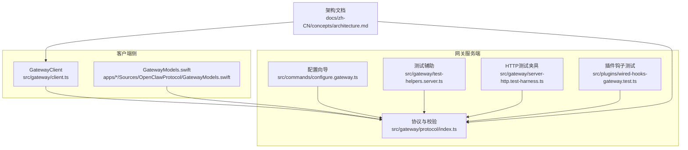
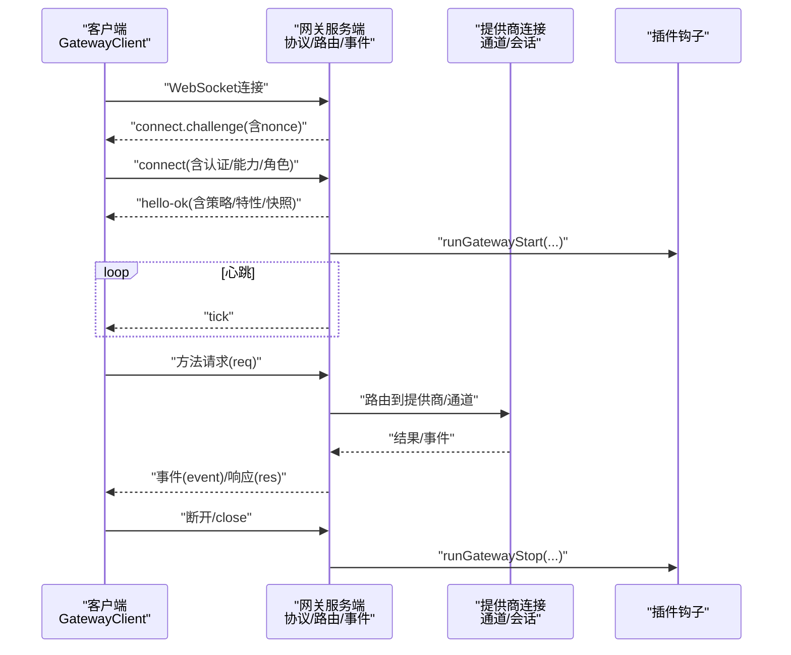
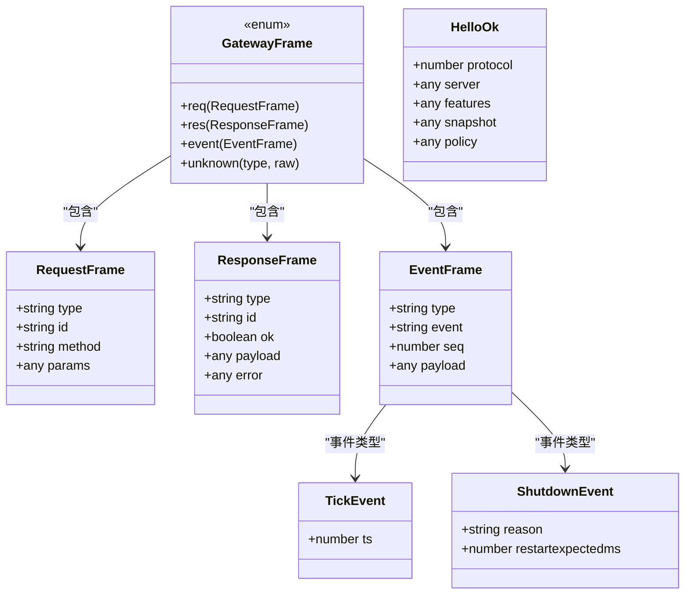
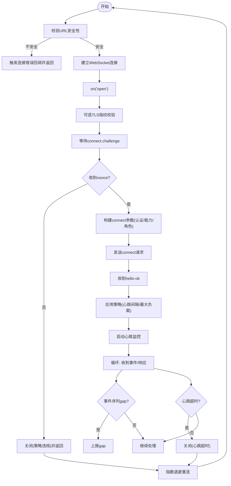
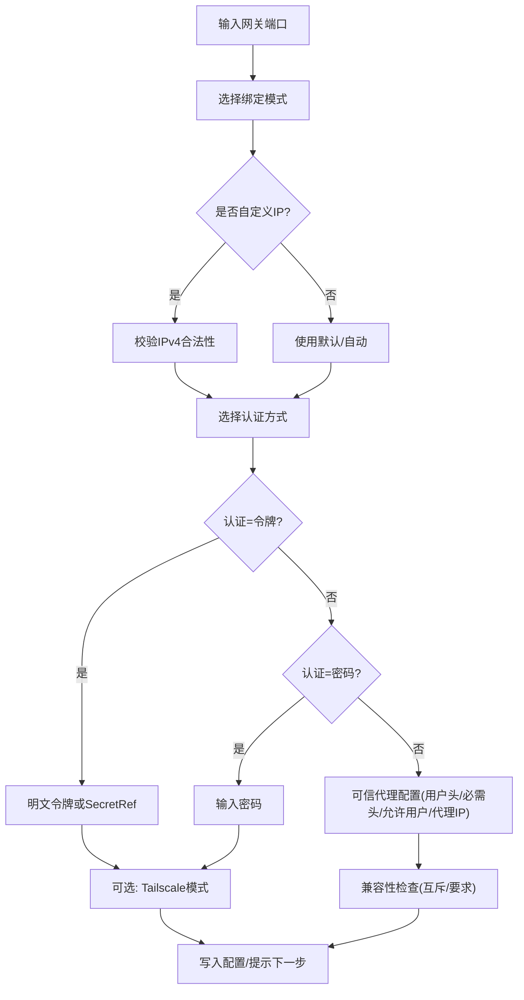
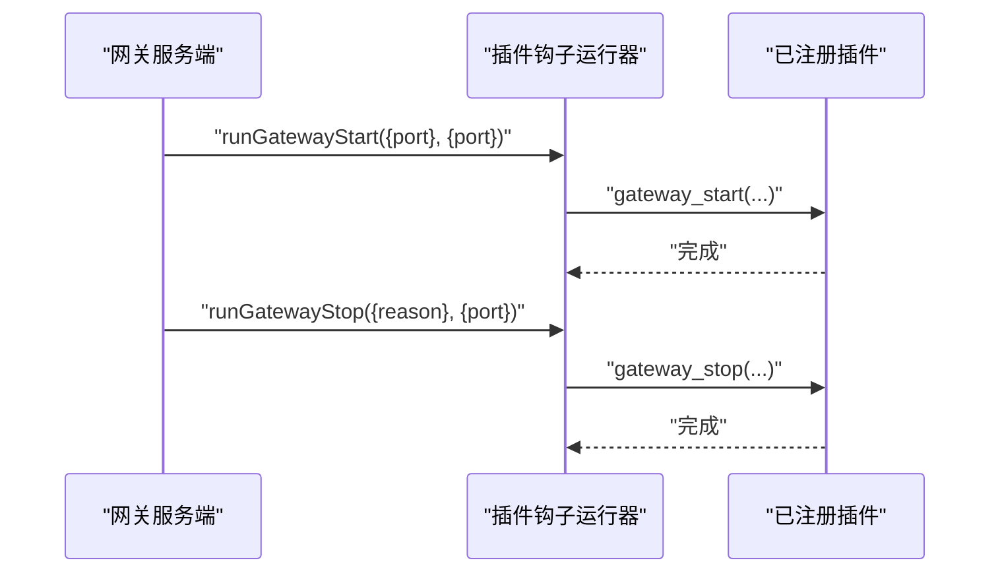
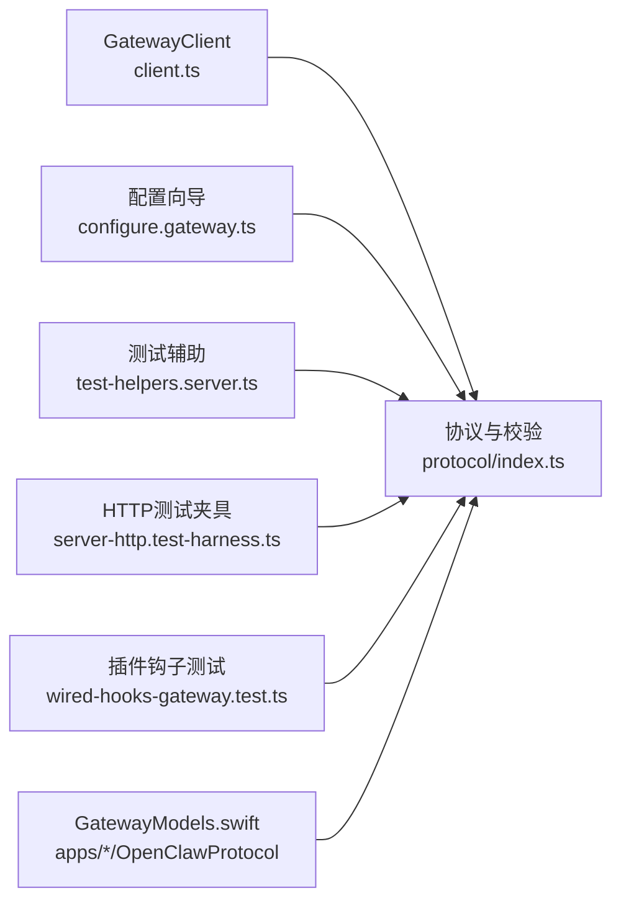

# 网关组件

<cite>
**本文引用的文件**
- [src/gateway/client.ts](file://src/gateway/client.ts)
- [src/gateway/protocol/index.ts](file://src/gateway/protocol/index.ts)
- [src/commands/configure.gateway.ts](file://src/commands/configure.gateway.ts)
- [src/gateway/test-helpers.server.ts](file://src/gateway/test-helpers.server.ts)
- [src/gateway/server-http.test-harness.ts](file://src/gateway/server-http.test-harness.ts)
- [src/plugins/wired-hooks-gateway.test.ts](file://src/plugins/wired-hooks-gateway.test.ts)
- [docs/zh-CN/concepts/architecture.md](file://docs/zh-CN/concepts/architecture.md)
- [apps/shared/OpenClawKit/Sources/OpenClawProtocol/GatewayModels.swift](file://apps/shared/OpenClawKit/Sources/OpenClawProtocol/GatewayModels.swift)
- [apps/macos/Sources/OpenClawProtocol/GatewayModels.swift](file://apps/macos/Sources/OpenClawProtocol/GatewayModels.swift)
</cite>

## 目录
1. [简介](#简介)
2. [项目结构](#项目结构)
3. [核心组件](#核心组件)
4. [架构总览](#架构总览)
5. [组件详解](#组件详解)
6. [依赖关系分析](#依赖关系分析)
7. [性能考量](#性能考量)
8. [故障排查指南](#故障排查指南)
9. [结论](#结论)
10. [附录](#附录)

## 简介
本文件面向OpenClaw网关组件，系统化阐述其控制平面、事件系统、会话管理与方法路由等关键子系统的设计与实现。重点覆盖：
- 网关服务器如何维护提供商连接、处理WebSocket请求、生成并分发事件
- 客户端如何握手、认证、订阅事件、发送请求
- 方法路由与协议校验（基于JSON Schema）
- 插件钩子与可扩展性设计
- 数据流、控制流与错误处理策略

## 项目结构
围绕“网关”主题，相关源码主要分布在以下位置：
- 客户端SDK与协议定义：src/gateway/client.ts、src/gateway/protocol/index.ts
- CLI配置与启动：src/commands/configure.gateway.ts
- 测试与集成辅助：src/gateway/test-helpers.server.ts、src/gateway/server-http.test-harness.ts
- 插件钩子测试：src/plugins/wired-hooks-gateway.test.ts
- 架构与概念文档：docs/zh-CN/concepts/architecture.md
- 跨语言协议模型（Swift）：apps/shared/OpenClawKit/Sources/OpenClawProtocol/GatewayModels.swift、apps/macos/Sources/OpenClawProtocol/GatewayModels.swift

图表来源
- [src/gateway/client.ts](file://src/gateway/client.ts#L1-L528)
- [src/gateway/protocol/index.ts](file://src/gateway/protocol/index.ts#L1-L644)
- [src/commands/configure.gateway.ts](file://src/commands/configure.gateway.ts#L1-L354)
- [src/gateway/test-helpers.server.ts](file://src/gateway/test-helpers.server.ts#L320-L355)
- [src/gateway/server-http.test-harness.ts](file://src/gateway/server-http.test-harness.ts#L43-L94)
- [src/plugins/wired-hooks-gateway.test.ts](file://src/plugins/wired-hooks-gateway.test.ts#L1-L40)
- [docs/zh-CN/concepts/architecture.md](file://docs/zh-CN/concepts/architecture.md#L1-L124)
- [apps/shared/OpenClawKit/Sources/OpenClawProtocol/GatewayModels.swift](file://apps/shared/OpenClawKit/Sources/OpenClawProtocol/GatewayModels.swift#L3361-L3421)
- [apps/macos/Sources/OpenClawProtocol/GatewayModels.swift](file://apps/macos/Sources/OpenClawProtocol/GatewayModels.swift#L3361-L3421)

章节来源
- [docs/zh-CN/concepts/architecture.md](file://docs/zh-CN/concepts/architecture.md#L1-L124)

## 核心组件
- 网关协议与校验：统一的请求/响应/事件帧结构、协议版本、JSON Schema校验器与错误格式化
- 网关客户端：WebSocket连接、握手挑战、认证、心跳检测、重连退避、事件与响应处理
- 配置与暴露：CLI向导式配置网关端口、绑定模式、认证方式（令牌/密码/可信代理）、Tailscale与尾线暴露
- 事件系统：心跳tick、健康状态、代理/聊天/存在性/计划任务等事件的生成与分发
- 插件钩子：启动/停止钩子的注册与执行，便于扩展生命周期行为

章节来源
- [src/gateway/protocol/index.ts](file://src/gateway/protocol/index.ts#L1-L644)
- [src/gateway/client.ts](file://src/gateway/client.ts#L1-L528)
- [src/commands/configure.gateway.ts](file://src/commands/configure.gateway.ts#L1-L354)
- [src/plugins/wired-hooks-gateway.test.ts](file://src/plugins/wired-hooks-gateway.test.ts#L1-L40)

## 架构总览
下图展示了客户端、网关服务端与外部生态的交互关系，以及事件与方法调用的流向。

图表来源
- [src/gateway/client.ts](file://src/gateway/client.ts#L108-L355)
- [src/gateway/protocol/index.ts](file://src/gateway/protocol/index.ts#L249-L438)
- [src/plugins/wired-hooks-gateway.test.ts](file://src/plugins/wired-hooks-gateway.test.ts#L12-L31)
- [docs/zh-CN/concepts/architecture.md](file://docs/zh-CN/concepts/architecture.md#L27-L40)

## 组件详解

### 网关协议与校验（协议层）
- 协议帧类型：请求(req)、响应(res)、事件(event)，以及未知类型兜底
- 核心结构：ConnectParams、RequestFrame、ResponseFrame、EventFrame、HelloOk、TickEvent、ShutdownEvent等
- 校验机制：基于Ajv的JSON Schema编译器，对入站帧进行强约束校验，并提供可读的错误格式化
- 版本与策略：PROTOCOL_VERSION贯穿客户端与服务端，服务端通过hello-ok下发策略（如心跳间隔）

图表来源
- [src/gateway/protocol/index.ts](file://src/gateway/protocol/index.ts#L126-L133)
- [src/gateway/protocol/index.ts](file://src/gateway/protocol/index.ts#L163-L174)
- [src/gateway/protocol/index.ts](file://src/gateway/protocol/index.ts#L215-L216)
- [src/gateway/protocol/index.ts](file://src/gateway/protocol/index.ts#L195-L196)
- [apps/shared/OpenClawKit/Sources/OpenClawProtocol/GatewayModels.swift](file://apps/shared/OpenClawKit/Sources/OpenClawProtocol/GatewayModels.swift#L3413-L3421)
- [apps/macos/Sources/OpenClawProtocol/GatewayModels.swift](file://apps/macos/Sources/OpenClawProtocol/GatewayModels.swift#L3413-L3421)

章节来源
- [src/gateway/protocol/index.ts](file://src/gateway/protocol/index.ts#L1-L644)
- [apps/shared/OpenClawKit/Sources/OpenClawProtocol/GatewayModels.swift](file://apps/shared/OpenClawKit/Sources/OpenClawProtocol/GatewayModels.swift#L3361-L3421)
- [apps/macos/Sources/OpenClawProtocol/GatewayModels.swift](file://apps/macos/Sources/OpenClawProtocol/GatewayModels.swift#L3361-L3421)

### 网关客户端（WebSocket客户端）
- 连接与安全：支持wss+证书指纹校验；对非回环ws://进行安全限制；支持断线重连与指数退避
- 握手与认证：接收connect.challenge后构造connect请求，支持共享令牌/密码/设备令牌；成功后持久化设备令牌
- 心跳与保活：根据服务端策略设置心跳周期，超时则主动关闭；检测事件序列gap并上报
- 请求/响应：UUID生成请求ID，等待最终响应（可选期望最终结果），解析并分发事件
- 错误与清理：连接错误回调、关闭原因描述、清理挂起请求、必要时清除过期设备令牌

图表来源
- [src/gateway/client.ts](file://src/gateway/client.ts#L108-L355)
- [src/gateway/client.ts](file://src/gateway/client.ts#L357-L472)

章节来源
- [src/gateway/client.ts](file://src/gateway/client.ts#L1-L528)

### 配置与暴露（CLI向导）
- 端口与绑定：支持loopback、tailnet、auto、lan、custom五种绑定模式；自动生成随机令牌或使用SecretRef
- 认证方式：令牌(token)/密码(password)/可信代理(trusted-proxy)三种模式；可信代理需配置用户头、必需头、允许用户列表与代理IP
- Tailscale：支持serve/funnel模式，自动注入尾网域名到控制界面允许来源；可选择退出时重置
- 互斥与兼容：trusted-proxy与Tailscale互斥；funnel需要password；loopback优先

图表来源
- [src/commands/configure.gateway.ts](file://src/commands/configure.gateway.ts#L27-L354)

章节来源
- [src/commands/configure.gateway.ts](file://src/commands/configure.gateway.ts#L1-L354)

### 事件系统与方法路由
- 事件类型：心跳tick、健康/存在/代理/聊天/计划任务/关闭等
- 事件分发：客户端按事件类型分发到订阅者；服务端根据方法路由到提供商/通道/工具/会话
- 方法路由：协议层定义了大量方法参数Schema（如Agents/Nodes/Configs/Crons/Secrets等），服务端据此校验并执行
- 快照与策略：hello-ok中包含features/events/snapshot/stateVersion/uptimeMs/policy等，用于客户端刷新与策略执行

章节来源
- [src/gateway/protocol/index.ts](file://src/gateway/protocol/index.ts#L1-L644)
- [src/gateway/client.ts](file://src/gateway/client.ts#L325-L354)

### 插件集成与生命周期钩子
- 钩子注册：插件可注册gateway_start与gateway_stop钩子
- 生命周期：服务端启动时执行runGatewayStart，停止时执行runGatewayStop
- 测试验证：通过单元测试验证钩子存在性与调用行为

图表来源
- [src/plugins/wired-hooks-gateway.test.ts](file://src/plugins/wired-hooks-gateway.test.ts#L12-L31)

章节来源
- [src/plugins/wired-hooks-gateway.test.ts](file://src/plugins/wired-hooks-gateway.test.ts#L1-L40)

## 依赖关系分析
- 客户端依赖协议层进行帧校验与序列化；依赖设备身份与设备令牌存储进行认证
- 服务端依赖协议层进行入站帧校验与方法Schema匹配；依赖配置模块决定绑定/认证/Tailscale策略
- 测试辅助模块提供HTTP与网关服务的快速搭建与清理，确保端到端测试稳定性

图表来源
- [src/gateway/client.ts](file://src/gateway/client.ts#L1-L528)
- [src/gateway/protocol/index.ts](file://src/gateway/protocol/index.ts#L1-L644)
- [src/commands/configure.gateway.ts](file://src/commands/configure.gateway.ts#L1-L354)
- [src/gateway/test-helpers.server.ts](file://src/gateway/test-helpers.server.ts#L320-L355)
- [src/gateway/server-http.test-harness.ts](file://src/gateway/server-http.test-harness.ts#L43-L94)
- [src/plugins/wired-hooks-gateway.test.ts](file://src/plugins/wired-hooks-gateway.test.ts#L1-L40)
- [apps/shared/OpenClawKit/Sources/OpenClawProtocol/GatewayModels.swift](file://apps/shared/OpenClawKit/Sources/OpenClawProtocol/GatewayModels.swift#L3361-L3421)
- [apps/macos/Sources/OpenClawProtocol/GatewayModels.swift](file://apps/macos/Sources/OpenClawProtocol/GatewayModels.swift#L3361-L3421)

章节来源
- [src/gateway/client.ts](file://src/gateway/client.ts#L1-L528)
- [src/gateway/protocol/index.ts](file://src/gateway/protocol/index.ts#L1-L644)
- [src/commands/configure.gateway.ts](file://src/commands/configure.gateway.ts#L1-L354)
- [src/gateway/test-helpers.server.ts](file://src/gateway/test-helpers.server.ts#L320-L355)
- [src/gateway/server-http.test-harness.ts](file://src/gateway/server-http.test-harness.ts#L43-L94)
- [src/plugins/wired-hooks-gateway.test.ts](file://src/plugins/wired-hooks-gateway.test.ts#L1-L40)
- [apps/shared/OpenClawKit/Sources/OpenClawProtocol/GatewayModels.swift](file://apps/shared/OpenClawKit/Sources/OpenClawProtocol/GatewayModels.swift#L3361-L3421)
- [apps/macos/Sources/OpenClawProtocol/GatewayModels.swift](file://apps/macos/Sources/OpenClawProtocol/GatewayModels.swift#L3361-L3421)

## 性能考量
- 心跳与保活：服务端以tick事件维持长连活性，客户端按策略阈值检测静默并主动关闭，避免僵尸连接
- 负载与缓冲：客户端允许较大消息负载（如屏幕快照）；服务端通过策略限制最大负载与缓冲字节
- 重连退避：客户端指数退避重连，降低风暴效应
- 校验成本：协议层采用编译后的Schema校验，减少重复校验开销

## 故障排查指南
- 连接失败
  - 安全性限制：非回环ws://被拒绝；使用wss://或通过SSH隧道/可信代理
  - TLS指纹：wss+指纹校验失败会导致连接被策略关闭
  - 握手超时：未在限定时间内收到connect.challenge或未在时限内发送connect
- 认证问题
  - 设备令牌不匹配：服务端可能清理过期设备令牌并关闭连接
  - 共享令牌/密码：确认令牌/密码正确且未过期
- 心跳异常
  - 客户端检测到心跳超时（超过两倍心跳间隔）会主动关闭
- 事件gap
  - 客户端检测到事件序列gap，建议刷新快照并重新同步

章节来源
- [src/gateway/client.ts](file://src/gateway/client.ts#L113-L142)
- [src/gateway/client.ts](file://src/gateway/client.ts#L174-L181)
- [src/gateway/client.ts](file://src/gateway/client.ts#L410-L428)
- [src/gateway/client.ts](file://src/gateway/client.ts#L191-L211)
- [src/gateway/client.ts](file://src/gateway/client.ts#L460-L471)
- [src/gateway/client.ts](file://src/gateway/client.ts#L376-L378)

## 结论
OpenClaw网关组件以协议层为核心，通过严格的帧校验与清晰的事件/方法模型，实现了跨平台提供商连接、稳定的WebSocket控制平面与可观测的事件系统。客户端具备完善的握手、认证、心跳与重连机制；服务端通过配置向导与插件钩子实现灵活部署与扩展。整体设计兼顾安全性、可维护性与可扩展性。

## 附录
- 初始化与运行示例路径
  - 客户端握手与认证流程：[src/gateway/client.ts](file://src/gateway/client.ts#L235-L355)
  - 协议校验与错误格式化：[src/gateway/protocol/index.ts](file://src/gateway/protocol/index.ts#L404-L438)
  - CLI配置向导：[src/commands/configure.gateway.ts](file://src/commands/configure.gateway.ts#L27-L354)
  - 网关服务端启动与测试辅助：[src/gateway/test-helpers.server.ts](file://src/gateway/test-helpers.server.ts#L320-L355)
  - HTTP请求分发测试夹具：[src/gateway/server-http.test-harness.ts](file://src/gateway/server-http.test-harness.ts#L76-L83)
  - 插件钩子生命周期测试：[src/plugins/wired-hooks-gateway.test.ts](file://src/plugins/wired-hooks-gateway.test.ts#L12-L31)
  - 架构概览参考：[docs/zh-CN/concepts/architecture.md](file://docs/zh-CN/concepts/architecture.md#L19-L40)