# 认证系统

<cite>
**本文引用的文件**
- [authentication.md](file://docs/gateway/authentication.md)
- [oauth.ts](file://src/agents/auth-profiles/oauth.ts)
- [store.ts](file://src/agents/auth-profiles/store.ts)
- [credential-state.ts](file://src/agents/auth-profiles/credential-state.ts)
- [auth-health.ts](file://src/agents/auth-health.ts)
- [device-pairing.ts](file://src/infra/device-pairing.ts)
- [security-path.ts](file://src/gateway/security-path.ts)
- [operator-scope-compat.ts](file://src/shared/operator-scope-compat.ts)
- [audit-extra.async.ts](file://src/security/audit-extra.async.ts)
- [audit.ts](file://src/security/audit.ts)
- [openclaw-auth-monitor.service](file://scripts/systemd/openclaw-auth-monitor.service)
- [openclaw-auth-monitor.timer](file://scripts/systemd/openclaw-auth-monitor.timer)
</cite>

## 目录
1. [简介](#简介)
2. [项目结构](#项目结构)
3. [核心组件](#核心组件)
4. [架构总览](#架构总览)
5. [详细组件分析](#详细组件分析)
6. [依赖关系分析](#依赖关系分析)
7. [性能考量](#性能考量)
8. [故障排查指南](#故障排查指南)
9. [结论](#结论)
10. [附录](#附录)

## 简介
本文件面向OpenClaw网关的认证系统，系统性梳理认证机制设计、凭证优先级策略、设备认证流程，并覆盖API密钥认证、OAuth认证、设备配对认证等模式。同时阐述认证缓存、令牌刷新、会话管理机制，以及认证策略配置、权限验证与访问控制（ACL）、与安全策略及审计日志的集成方式。文档以“可读性优先”为目标，既提供代码级路径定位，也给出可视化图示帮助理解。

## 项目结构
认证相关能力主要分布在以下模块：
- 文档层：认证模式与使用指引
- 凭证存储与解析：认证档案（auth-profiles.json）加载、合并、持久化与兼容迁移
- 凭证状态与健康度：过期评估、健康摘要、到期告警
- OAuth刷新与兼容：跨Provider刷新、兼容模式、降级回退
- 设备配对与令牌：设备侧配对请求、批准、令牌签发与校验、作用域与角色
- 安全路径与保护：路由前缀安全归一化、受保护路径判定
- 权限与作用域：操作员角色与作用域兼容规则
- 审计与监控：文件权限审计、系统服务定时任务监控

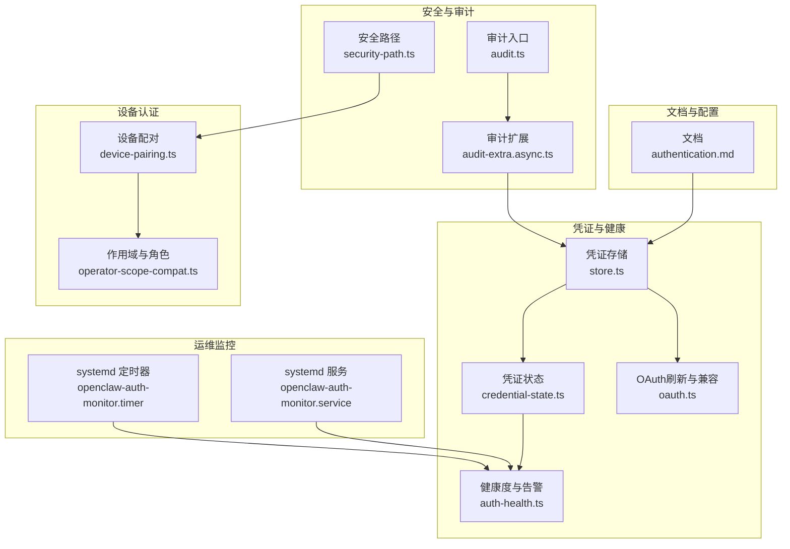

**图表来源**
- [authentication.md](file://docs/gateway/authentication.md#L1-L180)
- [store.ts](file://src/agents/auth-profiles/store.ts#L1-L510)
- [credential-state.ts](file://src/agents/auth-profiles/credential-state.ts#L1-L75)
- [auth-health.ts](file://src/agents/auth-health.ts#L1-L284)
- [oauth.ts](file://src/agents/auth-profiles/oauth.ts#L1-L492)
- [device-pairing.ts](file://src/infra/device-pairing.ts#L1-L654)
- [operator-scope-compat.ts](file://src/shared/operator-scope-compat.ts#L1-L50)
- [security-path.ts](file://src/gateway/security-path.ts#L1-L162)
- [audit-extra.async.ts](file://src/security/audit-extra.async.ts#L1028-L1127)
- [audit.ts](file://src/security/audit.ts#L1093-L1129)
- [openclaw-auth-monitor.service](file://scripts/systemd/openclaw-auth-monitor.service#L1-L15)
- [openclaw-auth-monitor.timer](file://scripts/systemd/openclaw-auth-monitor.timer#L1-L11)

**章节来源**
- [authentication.md](file://docs/gateway/authentication.md#L1-L180)
- [store.ts](file://src/agents/auth-profiles/store.ts#L1-L510)
- [credential-state.ts](file://src/agents/auth-profiles/credential-state.ts#L1-L75)
- [auth-health.ts](file://src/agents/auth-health.ts#L1-L284)
- [oauth.ts](file://src/agents/auth-profiles/oauth.ts#L1-L492)
- [device-pairing.ts](file://src/infra/device-pairing.ts#L1-L654)
- [operator-scope-compat.ts](file://src/shared/operator-scope-compat.ts#L1-L50)
- [security-path.ts](file://src/gateway/security-path.ts#L1-L162)
- [audit-extra.async.ts](file://src/security/audit-extra.async.ts#L1028-L1127)
- [audit.ts](file://src/security/audit.ts#L1093-L1129)
- [openclaw-auth-monitor.service](file://scripts/systemd/openclaw-auth-monitor.service#L1-L15)
- [openclaw-auth-monitor.timer](file://scripts/systemd/openclaw-auth-monitor.timer#L1-L11)

## 核心组件
- 凭证存储与解析：负责auth-profiles.json的加载、兼容迁移、合并主/子代理存储、外部CLI同步、只读运行时快照、保存时敏感字段脱敏等。
- 凭证状态与健康度：评估API Key/Token/OAuth凭证是否可用、过期状态、健康摘要与告警阈值。
- OAuth刷新与兼容：统一OAuth刷新流程、跨Provider刷新、兼容token/oauth互换、主代理凭证继承、特定Provider降级回退。
- 设备配对与令牌：设备配对请求、批准、令牌生成与轮换、撤销、校验、作用域与角色兼容。
- 安全路径与保护：路径归一化、解码候选集、受保护前缀匹配、插件路由保护。
- 权限与作用域：操作员角色与作用域兼容规则，operator.admin自动满足operator.read/write/approvals/pairing等语义。
- 审计与监控：文件权限审计（auth-profiles.json、日志文件等）、系统服务定时任务监控。

**章节来源**
- [store.ts](file://src/agents/auth-profiles/store.ts#L1-L510)
- [credential-state.ts](file://src/agents/auth-profiles/credential-state.ts#L1-L75)
- [auth-health.ts](file://src/agents/auth-health.ts#L1-L284)
- [oauth.ts](file://src/agents/auth-profiles/oauth.ts#L1-L492)
- [device-pairing.ts](file://src/infra/device-pairing.ts#L1-L654)
- [security-path.ts](file://src/gateway/security-path.ts#L1-L162)
- [operator-scope-compat.ts](file://src/shared/operator-scope-compat.ts#L1-L50)
- [audit-extra.async.ts](file://src/security/audit-extra.async.ts#L1028-L1127)
- [openclaw-auth-monitor.service](file://scripts/systemd/openclaw-auth-monitor.service#L1-L15)
- [openclaw-auth-monitor.timer](file://scripts/systemd/openclaw-auth-monitor.timer#L1-L11)

## 架构总览
下图展示了认证系统的关键交互：命令行或运行时通过凭证存储加载凭证；OAuth凭证在过期前直接使用，过期后进入刷新流程；设备配对提供设备侧认证；安全路径模块用于路由保护；审计与监控保障文件权限与到期提醒。

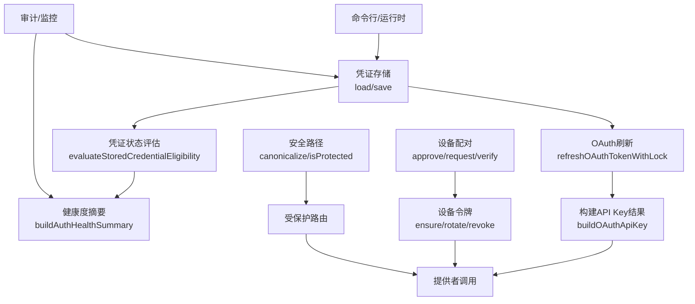

**图表来源**
- [store.ts](file://src/agents/auth-profiles/store.ts#L346-L460)
- [credential-state.ts](file://src/agents/auth-profiles/credential-state.ts#L34-L75)
- [auth-health.ts](file://src/agents/auth-health.ts#L187-L284)
- [oauth.ts](file://src/agents/auth-profiles/oauth.ts#L158-L215)
- [device-pairing.ts](file://src/infra/device-pairing.ts#L320-L403)
- [security-path.ts](file://src/gateway/security-path.ts#L106-L161)
- [audit-extra.async.ts](file://src/security/audit-extra.async.ts#L1028-L1127)

## 详细组件分析

### 凭证存储与解析（auth-profiles.json）
- 加载与兼容：支持新旧格式（auth-profiles.json vs legacy auth.json），自动迁移并合并主/子代理存储，必要时从外部CLI工具同步。
- 运行时快照：支持主/子代理合并视图，避免重复IO。
- 持久化与脱敏：保存时对内联明文API Key/Token进行脱敏，仅保留引用信息。
- 外部CLI同步：在加载时同步外部CLI凭据，确保运行时可见。

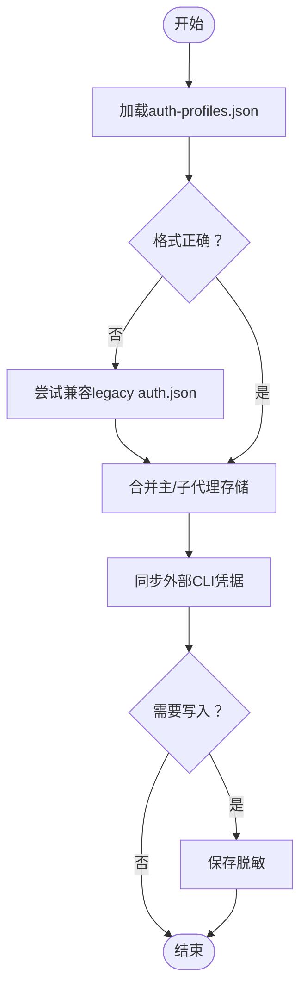

**图表来源**
- [store.ts](file://src/agents/auth-profiles/store.ts#L341-L460)

**章节来源**
- [store.ts](file://src/agents/auth-profiles/store.ts#L1-L510)

### 凭证状态与健康度
- 状态评估：区分API Key、Token、OAuth三类凭证，评估是否具备有效凭据、过期状态、无效expires等。
- 健康摘要：按Provider聚合，计算剩余时间、到期阈值、整体状态（ok/expiring/expired/missing/static）。
- 告警策略：默认OAuth到期告警阈值为24小时，支持自定义。

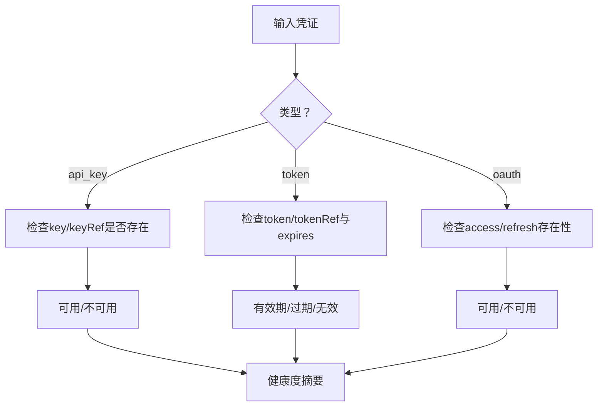

**图表来源**
- [credential-state.ts](file://src/agents/auth-profiles/credential-state.ts#L34-L75)
- [auth-health.ts](file://src/agents/auth-health.ts#L80-L185)

**章节来源**
- [credential-state.ts](file://src/agents/auth-profiles/credential-state.ts#L1-L75)
- [auth-health.ts](file://src/agents/auth-health.ts#L1-L284)

### OAuth刷新与兼容
- 刷新流程：带文件锁的并发安全刷新，支持chutes与qwen-portal等特殊Provider，其他Provider委托外部库获取Bearer Token。
- 兼容模式：token与oauth均视为Bearer路径，允许双向兼容。
- 主代理继承：若当前代理无新鲜凭证，尝试从主代理继承最新凭证。
- 降级回退：特定Provider在刷新失败时采用缓存access token作为回退。
- 错误提示：结合doctor提示，输出可诊断信息。

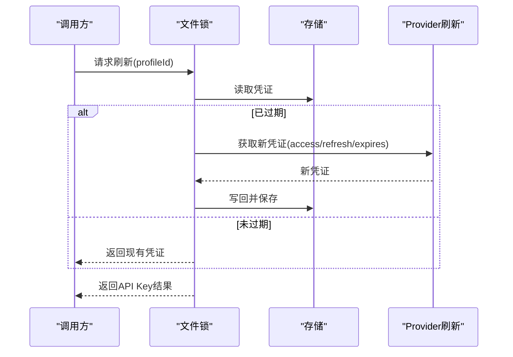

**图表来源**
- [oauth.ts](file://src/agents/auth-profiles/oauth.ts#L158-L215)
- [store.ts](file://src/agents/auth-profiles/store.ts#L484-L509)

**章节来源**
- [oauth.ts](file://src/agents/auth-profiles/oauth.ts#L1-L492)

### 设备配对与令牌
- 配对生命周期：request -> approve -> token生成/轮换/撤销 -> verify校验。
- 角色与作用域：支持多角色、多作用域，支持operator.admin自动满足operator.read/write/approvals/pairing等语义。
- 并发安全：所有变更均在文件锁内执行，防止竞态。
- 令牌统计：支持列出设备令牌摘要，便于运维审计。

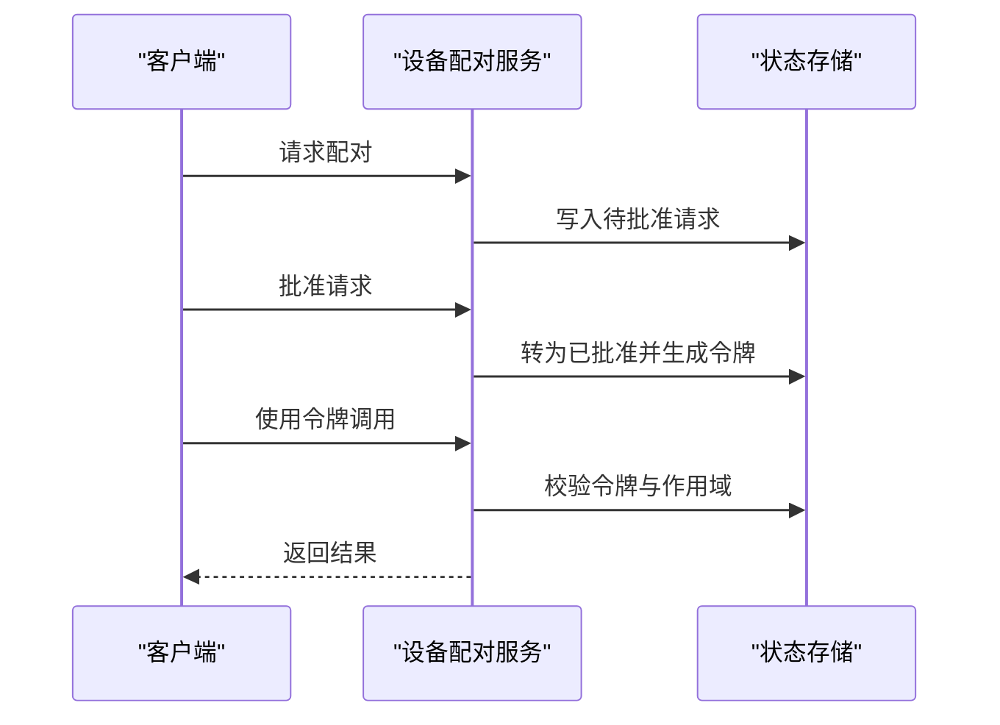

**图表来源**
- [device-pairing.ts](file://src/infra/device-pairing.ts#L272-L403)
- [operator-scope-compat.ts](file://src/shared/operator-scope-compat.ts#L18-L49)

**章节来源**
- [device-pairing.ts](file://src/infra/device-pairing.ts#L1-L654)
- [operator-scope-compat.ts](file://src/shared/operator-scope-compat.ts#L1-L50)

### 安全路径与保护
- 路径归一化：大小写、点段、分隔符规范化，支持多次解码，检测畸形编码与解码上限。
- 受保护前缀：对/plugin路由等进行保护判定，异常情况采取“严格关闭”。

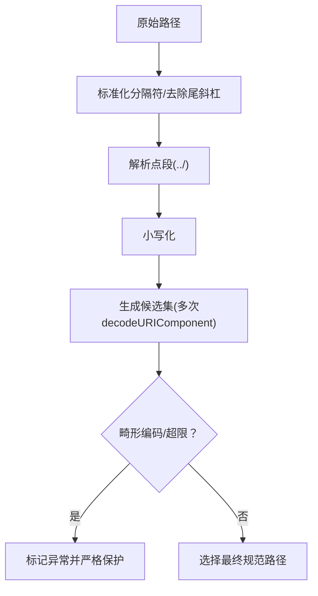

**图表来源**
- [security-path.ts](file://src/gateway/security-path.ts#L45-L118)

**章节来源**
- [security-path.ts](file://src/gateway/security-path.ts#L1-L162)

### 权限验证与访问控制（ACL）
- 角色与作用域：operator.admin自动满足operator.read/write/approvals/pairing；operator.read亦可由write/admin满足。
- 作用域兼容：支持请求作用域与授予作用域的兼容判断。

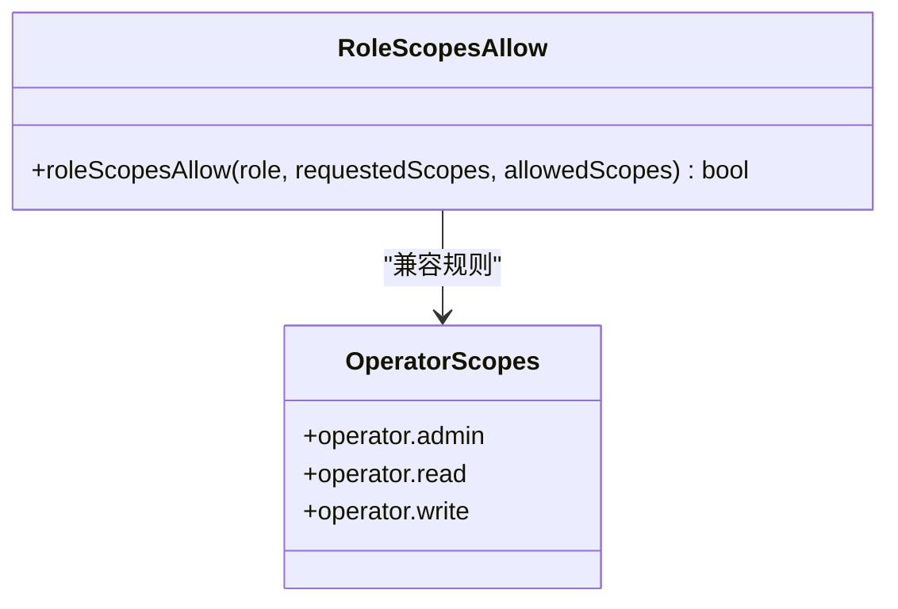

**图表来源**
- [operator-scope-compat.ts](file://src/shared/operator-scope-compat.ts#L18-L49)

**章节来源**
- [operator-scope-compat.ts](file://src/shared/operator-scope-compat.ts#L1-L50)

### 审计日志与安全策略集成
- 文件权限审计：针对auth-profiles.json、日志文件等进行可读/可写检查，输出修复建议。
- 审计入口：提供上下文构建、深检开关、插件与配置快照读取等。
- 安全策略：建议tighten权限、启用敏感信息脱敏、最小暴露网络面。

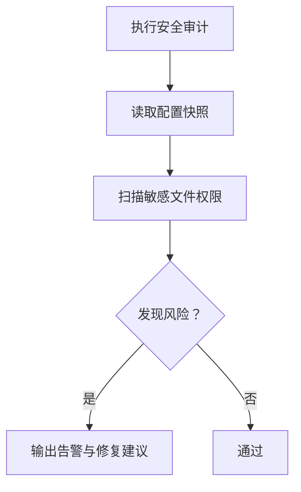

**图表来源**
- [audit.ts](file://src/security/audit.ts#L1093-L1129)
- [audit-extra.async.ts](file://src/security/audit-extra.async.ts#L1028-L1127)

**章节来源**
- [audit.ts](file://src/security/audit.ts#L1093-L1129)
- [audit-extra.async.ts](file://src/security/audit-extra.async.ts#L1028-L1127)

### 认证策略配置与凭证优先级
- 凭证优先级（API Key场景）：单次覆盖优先于多键列表，Google Provider额外回退项，且在使用前去重。
- 会话与代理级覆盖：支持会话级模型选择与代理级认证顺序覆盖。
- 文档指引：推荐长期运行网关使用API Key；Anthropic订阅场景支持setup-token。

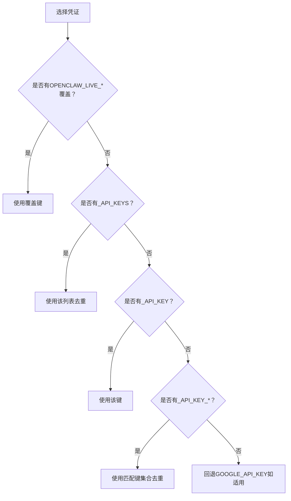

**图表来源**
- [authentication.md](file://docs/gateway/authentication.md#L123-L139)

**章节来源**
- [authentication.md](file://docs/gateway/authentication.md#L1-L180)

### 会话管理与令牌刷新
- 会话级模型选择：通过命令切换当前会话使用的profile。
- 代理级认证顺序：为代理设置认证profile顺序覆盖。
- OAuth刷新：首次调用触发自动刷新，带文件锁保证并发安全。

**章节来源**
- [authentication.md](file://docs/gateway/authentication.md#L140-L159)
- [oauth.ts](file://src/agents/auth-profiles/oauth.ts#L158-L215)

## 依赖关系分析
- 组件耦合：凭证存储为上游基础，健康度与OAuth刷新依赖其提供的凭证视图；设备配对独立但与作用域兼容配合；安全路径与审计分别服务于路由保护与合规。
- 外部依赖：OAuth刷新部分依赖外部Provider库；系统服务定时器依赖systemd；审计扩展依赖平台权限探测工具。

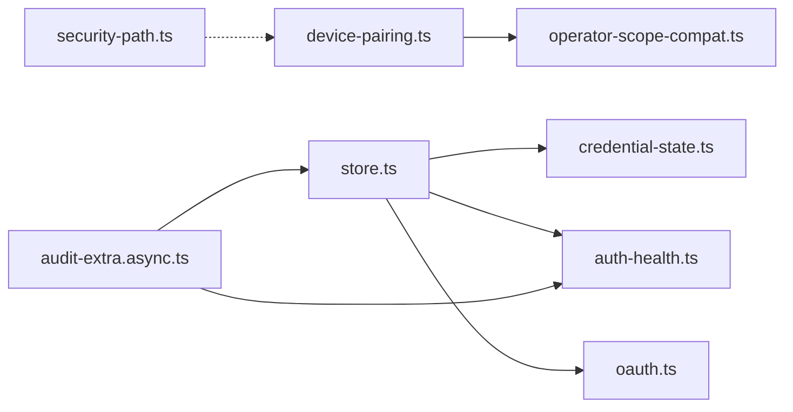

**图表来源**
- [store.ts](file://src/agents/auth-profiles/store.ts#L1-L510)
- [credential-state.ts](file://src/agents/auth-profiles/credential-state.ts#L1-L75)
- [auth-health.ts](file://src/agents/auth-health.ts#L1-L284)
- [oauth.ts](file://src/agents/auth-profiles/oauth.ts#L1-L492)
- [device-pairing.ts](file://src/infra/device-pairing.ts#L1-L654)
- [operator-scope-compat.ts](file://src/shared/operator-scope-compat.ts#L1-L50)
- [security-path.ts](file://src/gateway/security-path.ts#L1-L162)
- [audit-extra.async.ts](file://src/security/audit-extra.async.ts#L1028-L1127)

**章节来源**
- [store.ts](file://src/agents/auth-profiles/store.ts#L1-L510)
- [oauth.ts](file://src/agents/auth-profiles/oauth.ts#L1-L492)
- [device-pairing.ts](file://src/infra/device-pairing.ts#L1-L654)

## 性能考量
- IO与锁：凭证读写与OAuth刷新均采用文件锁，避免并发冲突；建议在高频调用场景减少不必要的刷新。
- 合并与快照：运行时合并主/子代理存储，降低重复IO；只读运行时快照避免持久化副作用。
- 健康度聚合：健康摘要按Provider聚合，避免逐条遍历带来的开销。

[本节为通用指导，无需具体文件分析]

## 故障排查指南
- “无可用凭证”：检查auth-profiles.json格式与内容，确认API Key/Token/OAuth字段完整；必要时重新paste-token或导入。
- “令牌即将/已过期”：使用健康检查命令查看到期状态；若OAuth刷新失败，参考doctor提示或尝试主代理继承。
- “设备未配对/令牌不匹配/作用域不符”：核对设备配对状态与令牌生成/轮换流程；确认角色与作用域范围。
- “文件权限问题”：审计报告会指出auth-profiles.json与日志文件的可读/可写风险，按建议调整权限。
- “系统服务未生效”：确认systemd定时器与服务单元配置，确保环境变量（如通知通道）正确。

**章节来源**
- [auth-health.ts](file://src/agents/auth-health.ts#L1-L284)
- [oauth.ts](file://src/agents/auth-profiles/oauth.ts#L459-L490)
- [device-pairing.ts](file://src/infra/device-pairing.ts#L470-L508)
- [audit-extra.async.ts](file://src/security/audit-extra.async.ts#L1028-L1127)
- [openclaw-auth-monitor.service](file://scripts/systemd/openclaw-auth-monitor.service#L1-L15)
- [openclaw-auth-monitor.timer](file://scripts/systemd/openclaw-auth-monitor.timer#L1-L11)

## 结论
OpenClaw认证系统以“安全、可观测、可维护”为核心目标：凭证存储与健康度提供清晰的可见性与告警；OAuth刷新与主代理继承保障可用性；设备配对与作用域兼容满足多端场景；安全路径与审计日志强化合规与风险控制。通过合理的凭证优先级策略与运维监控，系统在复杂环境中仍能保持稳定与可控。

[本节为总结，无需具体文件分析]

## 附录
- 相关命令与脚本
  - 认证健康检查与到期告警：参见“自动化/认证监控”脚本与systemd定时任务。
  - 审计与修复：使用安全审计命令输出JSON并结合--fix进行安全加固。

**章节来源**
- [openclaw-auth-monitor.service](file://scripts/systemd/openclaw-auth-monitor.service#L1-L15)
- [openclaw-auth-monitor.timer](file://scripts/systemd/openclaw-auth-monitor.timer#L1-L11)
- [audit.ts](file://src/security/audit.ts#L1093-L1129)