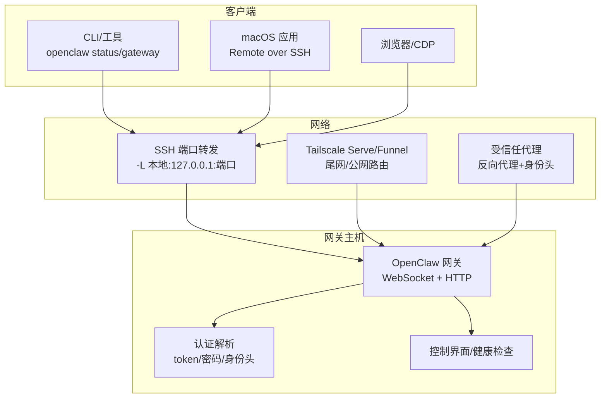
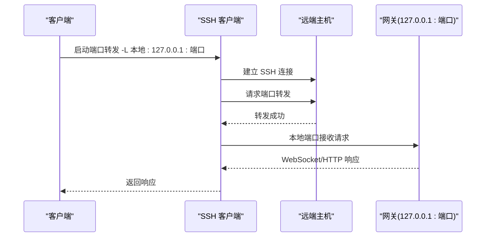
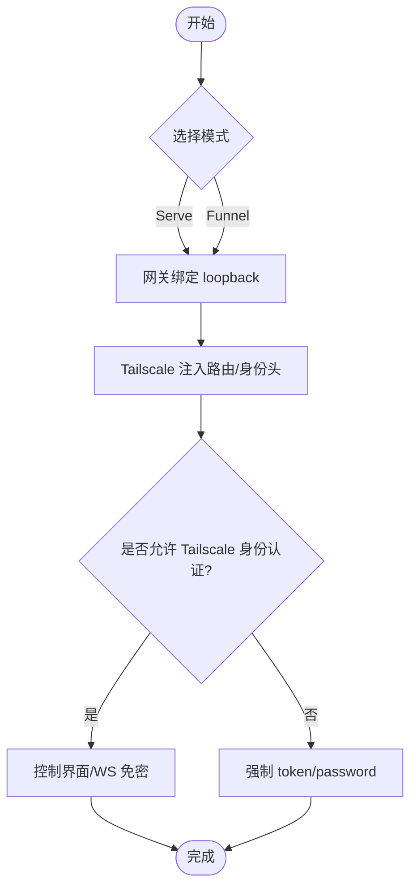
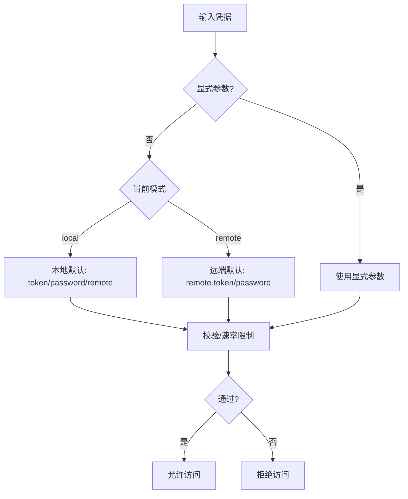
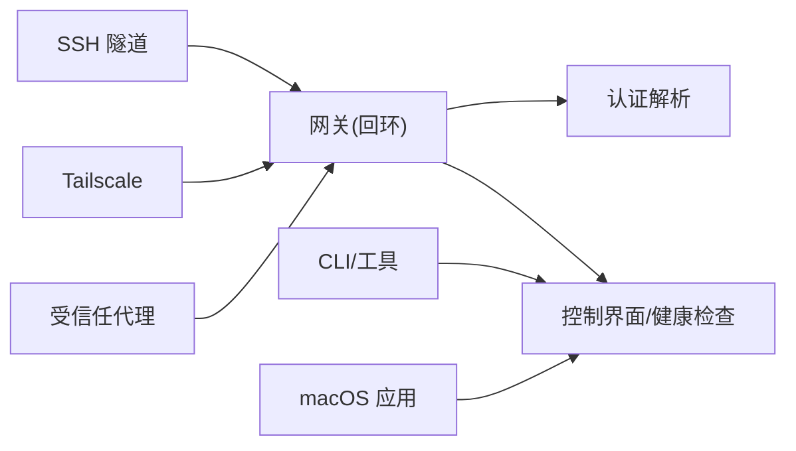

# 远程访问

<cite>
**本文引用的文件**
- [docs/gateway/remote.md](file://docs/gateway/remote.md)
- [docs/gateway/tailscale.md](file://docs/gateway/tailscale.md)
- [src/infra/ssh-tunnel.ts](file://src/infra/ssh-tunnel.ts)
- [apps/macos/Sources/OpenClaw/RemotePortTunnel.swift](file://apps/macos/Sources/OpenClaw/RemotePortTunnel.swift)
- [src/gateway/auth.ts](file://src/gateway/auth.ts)
- [docs/gateway/configuration-reference.md](file://docs/gateway/configuration-reference.md)
- [docs/gateway/configuration.md](file://docs/gateway/configuration.md)
- [docs/gateway/configuration-examples.md](file://docs/gateway/configuration-examples.md)
- [docs/gateway/security/index.md](file://docs/gateway/security/index.md)
- [docs/gateway/troubleshooting.md](file://docs/gateway/troubleshooting.md)
- [src/browser/cdp-timeouts.ts](file://src/browser/cdp-timeouts.ts)
- [src/commands/status-all.ts](file://src/commands/status-all.ts)
- [src/commands/status.command.ts](file://src/commands/status.command.ts)
- [apps/macos/Sources/OpenClaw/HealthStore.swift](file://apps/macos/Sources/OpenClaw/HealthStore.swift)
- [src/gateway/server.auth.modes.suite.ts](file://src/gateway/server.auth.modes.suite.ts)
</cite>

## 目录
1. [简介](#简介)
2. [项目结构](#项目结构)
3. [核心组件](#核心组件)
4. [架构总览](#架构总览)
5. [详细组件分析](#详细组件分析)
6. [依赖关系分析](#依赖关系分析)
7. [性能考量](#性能考量)
8. [故障排除指南](#故障排除指南)
9. [结论](#结论)
10. [附录](#附录)

## 简介
本章节面向在不同网络环境下运行 OpenClaw 的用户，系统性说明“远程访问”的实现与最佳实践。OpenClaw 的网关（Gateway）通过“回环绑定 + 隧道/尾网”策略，提供安全可控的远程访问能力，覆盖 SSH 端口转发、Tailscale Serve/Funnel、以及可选的受信任代理（反向代理）等方案。本文将从网络拓扑、认证与访问控制、性能优化、典型场景配置、故障排除与监控等方面展开，并给出安全加固建议。

## 项目结构
围绕远程访问的关键文档与实现分布在以下位置：
- 文档层：远程访问、Tailscale、配置参考、安全、故障排除
- 实现层：SSH 隧道建立、macOS 应用隧道封装、网关认证解析、浏览器可达性超时计算、状态与健康检查

```mermaid
graph TB
subgraph "文档"
RMD["docs/gateway/remote.md"]
TSD["docs/gateway/tailscale.md"]
CFG["docs/gateway/configuration.md"]
REF["docs/gateway/configuration-reference.md"]
EX["docs/gateway/configuration-examples.md"]
SEC["docs/gateway/security/index.md"]
TRB["docs/gateway/troubleshooting.md"]
end
subgraph "实现"
SSH["src/infra/ssh-tunnel.ts"]
MAC["apps/macos/Sources/OpenClaw/RemotePortTunnel.swift"]
AUTH["src/gateway/auth.ts"]
CDP["src/browser/cdp-timeouts.ts"]
STATALL["src/commands/status-all.ts"]
STATCMD["src/commands/status.command.ts"]
HEALTH["apps/macos/Sources/OpenClaw/HealthStore.swift"]
end
RMD --> AUTH
RMD --> SSH
RMD --> MAC
TSD --> AUTH
SEC --> AUTH
TRB --> STATALL
TRB --> STATCMD
TRB --> HEALTH
CFG --> REF
EX --> REF
```

图表来源
- [docs/gateway/remote.md](file://docs/gateway/remote.md#L1-L149)
- [docs/gateway/tailscale.md](file://docs/gateway/tailscale.md#L1-L133)
- [src/infra/ssh-tunnel.ts](file://src/infra/ssh-tunnel.ts#L92-L185)
- [apps/macos/Sources/OpenClaw/RemotePortTunnel.swift](file://apps/macos/Sources/OpenClaw/RemotePortTunnel.swift#L55-L88)
- [src/gateway/auth.ts](file://src/gateway/auth.ts#L1-L38)
- [src/browser/cdp-timeouts.ts](file://src/browser/cdp-timeouts.ts#L28-L54)
- [src/commands/status-all.ts](file://src/commands/status-all.ts#L238-L272)
- [src/commands/status.command.ts](file://src/commands/status.command.ts#L254-L284)
- [apps/macos/Sources/OpenClaw/HealthStore.swift](file://apps/macos/Sources/OpenClaw/HealthStore.swift#L153-L213)

章节来源
- [docs/gateway/remote.md](file://docs/gateway/remote.md#L1-L149)
- [docs/gateway/tailscale.md](file://docs/gateway/tailscale.md#L1-L133)

## 核心组件
- 网关远程访问模式
  - 回环绑定优先：默认仅监听 127.0.0.1，避免公网暴露
  - SSH 端口转发：在客户端侧将远端回环端口映射到本地，形成安全隧道
  - Tailscale Serve/Funnel：在不暴露网关的情况下，通过 Tailscale 提供尾网或公网路由与身份注入
  - 受信任代理（可选）：由反向代理负责身份鉴别与 TLS 终止，网关通过可信头部识别身份
- 认证与访问控制
  - 支持 token、密码、受信任代理三种模式；非回环绑定必须启用认证
  - Tailscale Serve 模式下可基于身份头进行免密访问（需谨慎配置 allowTailscale）
  - 控制界面与 WebSocket 的安全上下文要求（HTTPS 或 localhost）
- 性能与可用性
  - 隧道建立与存活探测、超时参数自适应
  - 健康检查与连接质量评估指标
  - 浏览器控制（CDP）在本地与远程场景下的超时策略

章节来源
- [src/gateway/auth.ts](file://src/gateway/auth.ts#L1-L38)
- [docs/gateway/security/index.md](file://docs/gateway/security/index.md#L776-L800)
- [src/browser/cdp-timeouts.ts](file://src/browser/cdp-timeouts.ts#L28-L54)

## 架构总览
下图展示远程访问的总体架构与数据流，涵盖 SSH 隧道、Tailscale、受信任代理、网关认证与客户端健康检查。

图表来源
- [docs/gateway/remote.md](file://docs/gateway/remote.md#L69-L124)
- [docs/gateway/tailscale.md](file://docs/gateway/tailscale.md#L11-L42)
- [src/gateway/auth.ts](file://src/gateway/auth.ts#L1-L38)

## 详细组件分析

### SSH 端口转发（通用隧道）
- 工作原理
  - 客户端通过 SSH 在本地监听一个端口，并将流量转发到远端主机的回环地址与端口
  - 默认使用 -N（不执行远端命令）、ExitOnForwardFailure、BatchMode、StrictHostKeyChecking 等选项提升安全性与稳定性
- 关键实现点
  - 端口占用检测与随机端口回退
  - 超时等待本地监听就绪
  - 子进程生命周期管理与优雅关闭
- 客户端封装（macOS 应用）
  - 自动选择本地端口、解析目标主机、拼装 SSH 参数
  - 支持 TCPKeepAlive、ServerAlive 等保活参数

图表来源
- [src/infra/ssh-tunnel.ts](file://src/infra/ssh-tunnel.ts#L92-L185)
- [apps/macos/Sources/OpenClaw/RemotePortTunnel.swift](file://apps/macos/Sources/OpenClaw/RemotePortTunnel.swift#L55-L88)

章节来源
- [src/infra/ssh-tunnel.ts](file://src/infra/ssh-tunnel.ts#L92-L185)
- [apps/macos/Sources/OpenClaw/RemotePortTunnel.swift](file://apps/macos/Sources/OpenClaw/RemotePortTunnel.swift#L55-L88)

### Tailscale 隧道（尾网/公网）
- 模式说明
  - Serve：尾网路由，保持网关回环绑定，Tailscale 注入身份头
  - Funnel：公网 HTTPS，需要共享密码，仅支持特定端口
- 身份与认证
  - 允许 Tailscale 身份头用于控制界面与 WebSocket 的免密访问
  - HTTP API 仍需 token/password
- 配置要点
  - Serve/Funnel 仅暴露网关控制界面与 WebSocket
  - Funnel 需要满足 Tailscale 版本、HTTPS、MagicDNS、节点属性等前置条件

图表来源
- [docs/gateway/tailscale.md](file://docs/gateway/tailscale.md#L15-L42)

章节来源
- [docs/gateway/tailscale.md](file://docs/gateway/tailscale.md#L1-L133)

### 受信任代理（反向代理）
- 适用场景
  - 企业内网通过反向代理统一鉴权与 TLS 终止
  - 代理需正确设置 X-Forwarded-* 头部，确保网关能正确识别客户端 IP
- 安全注意
  - 未在受信任代理列表中的上游地址，网关不会将其视为本地，防止代理绕过导致的认证降级
  - 如需回退到 X-Real-IP，需显式开启 allowRealIpFallback 并谨慎配置

章节来源
- [docs/gateway/security/index.md](file://docs/gateway/security/index.md#L312-L352)

### 网关认证与访问控制
- 认证模式
  - token/password：共享密钥，适用于大多数远程场景
  - 受信任代理：由代理负责身份鉴别，网关通过头部识别
  - 无认证：默认拒绝，除非明确配置允许（不推荐）
- 模式解析与优先级
  - 显式参数优先于本地/远程配置
  - 远端探测默认严格使用远程 token
- 安全规则
  - 非回环绑定必须启用认证
  - Tailscale Serve 的免密访问假设网关主机可信，若存在不受信本地代码，应禁用该特性
  - 控制界面需安全上下文（HTTPS 或 localhost）

图表来源
- [docs/gateway/remote.md](file://docs/gateway/remote.md#L104-L116)
- [src/gateway/auth.ts](file://src/gateway/auth.ts#L1-L38)

章节来源
- [docs/gateway/remote.md](file://docs/gateway/remote.md#L104-L146)
- [src/gateway/auth.ts](file://src/gateway/auth.ts#L1-L38)

### 浏览器控制与超时策略
- 本地与远程场景
  - 本地：HTTP/WS 超时按固定阈值
  - 远程：超时随远程探测参数动态调整，避免过早失败
- 健康检查
  - macOS 应用侧对通道健康度进行聚合判断，包含超时、错误码与耗时信息

章节来源
- [src/browser/cdp-timeouts.ts](file://src/browser/cdp-timeouts.ts#L28-L54)
- [apps/macos/Sources/OpenClaw/HealthStore.swift](file://apps/macos/Sources/OpenClaw/HealthStore.swift#L153-L213)

### 远程访问配置示例（场景化）
- 家庭网络（始终在线的网关主机）
  - 方案：回环绑定 + Tailscale Serve（控制界面），或回环 + SSH 隧道（CLI/工具）
  - 安全：Serve 下可利用身份头免密，但需确保主机可信；或强制 token/password
- 企业环境（受信任代理）
  - 方案：反向代理统一鉴权与 TLS 终止，网关通过受信任代理识别身份
  - 安全：严格配置 X-Forwarded-*，避免 Host 头回退与代理头拼接风险
- 云部署（VPS/容器）
  - 方案：回环绑定 + Tailscale Serve（尾网）或 Funnel（公网，需强密码）
  - 安全：最小暴露面，仅开放必要端口；结合防火墙与只读策略

章节来源
- [docs/gateway/remote.md](file://docs/gateway/remote.md#L25-L51)
- [docs/gateway/tailscale.md](file://docs/gateway/tailscale.md#L44-L98)
- [docs/gateway/security/index.md](file://docs/gateway/security/index.md#L605-L631)

## 依赖关系分析
- 组件耦合
  - SSH 隧道与 macOS 应用封装相互独立，均依赖标准 SSH 客户端
  - 网关认证模块与配置参考紧密耦合，认证模式与配置项一一对应
  - 健康检查与状态命令依赖网关暴露的端点与认证状态
- 外部依赖
  - Tailscale CLI 与守护进程（Serve/Funnel）
  - 反向代理（Nginx/Caddy/Traefik）的正确配置

图表来源
- [src/infra/ssh-tunnel.ts](file://src/infra/ssh-tunnel.ts#L92-L185)
- [docs/gateway/tailscale.md](file://docs/gateway/tailscale.md#L11-L42)
- [src/gateway/auth.ts](file://src/gateway/auth.ts#L1-L38)

章节来源
- [src/infra/ssh-tunnel.ts](file://src/infra/ssh-tunnel.ts#L92-L185)
- [docs/gateway/tailscale.md](file://docs/gateway/tailscale.md#L1-L133)
- [src/gateway/auth.ts](file://src/gateway/auth.ts#L1-L38)

## 性能考量
- 隧道保活与重连
  - 使用 ServerAlive、TCPKeepAlive 等参数降低空闲断开概率
  - 建立后等待本地监听就绪，避免早期失败
- 超时策略
  - 本地：固定阈值，快速反馈
  - 远程：根据探测参数动态放大，减少误判
- 连接质量评估
  - 通过状态命令与健康检查聚合通道状态、耗时与错误码
  - 对 WebSocket 探测返回延迟与错误原因进行分类

章节来源
- [src/infra/ssh-tunnel.ts](file://src/infra/ssh-tunnel.ts#L92-L185)
- [src/browser/cdp-timeouts.ts](file://src/browser/cdp-timeouts.ts#L28-L54)
- [src/commands/status-all.ts](file://src/commands/status-all.ts#L238-L272)
- [src/commands/status.command.ts](file://src/commands/status.command.ts#L254-L284)
- [apps/macos/Sources/OpenClaw/HealthStore.swift](file://apps/macos/Sources/OpenClaw/HealthStore.swift#L153-L213)

## 故障排除指南
- 常见症状与定位
  - 无法连接：确认 URL、端口、凭据；检查非回环绑定是否配置认证
  - 设备身份/签名问题：更新客户端，确保完成挑战-签名流程
  - 通道无消息：检查渠道策略、提及要求与配对状态
  - 服务不可达：查看端口冲突、服务状态与日志
- 诊断命令
  - openclaw status / gateway status / logs --follow / doctor
  - 针对控制界面：核对探针 URL、认证模式与安全上下文
- 审计与加固
  - 使用安全审计命令检查暴露面、权限与策略配置
  - 针对多用户/共享入口，启用 per-channel-peer DM 会话隔离

章节来源
- [docs/gateway/troubleshooting.md](file://docs/gateway/troubleshooting.md#L1-L367)
- [docs/gateway/security/index.md](file://docs/gateway/security/index.md#L212-L261)

## 结论
OpenClaw 的远程访问以“回环绑定 + 隧道/尾网”为核心，兼顾易用性与安全性。通过 SSH 端口转发与 Tailscale Serve/Funnel，可在不同网络环境下灵活暴露网关；配合严格的认证与访问控制策略，可有效降低暴露面与被滥用风险。建议在生产环境中优先采用回环绑定与 Tailscale Serve，并结合受信任代理与最小权限原则，持续进行安全审计与性能优化。

## 附录

### 远程访问配置参考（关键字段）
- 网关绑定与认证
  - gateway.bind：loopback/lan/tailnet/custom/auto
  - gateway.auth.mode：token/password/trusted-proxy
  - gateway.auth.allowTailscale：Serve 身份认证开关
- Tailscale 集成
  - gateway.tailscale.mode：serve/funnel/off
  - gateway.tailscale.resetOnExit：退出时撤销 Serve/Funnel
- 远端目标与凭据
  - gateway.remote.url：远程网关地址
  - gateway.remote.token/password：远程调用凭据
- 控制界面
  - gateway.controlUi.basePath/allowedOrigins
  - gateway.controlUi.allowInsecureAuth / dangerouslyDisableDeviceAuth

章节来源
- [docs/gateway/configuration-reference.md](file://docs/gateway/configuration-reference.md#L1-L200)
- [docs/gateway/configuration.md](file://docs/gateway/configuration.md#L449-L538)
- [docs/gateway/configuration-examples.md](file://docs/gateway/configuration-examples.md#L411-L425)