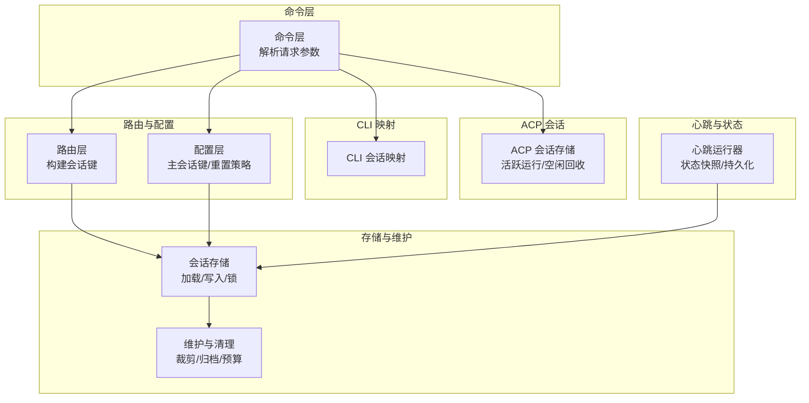
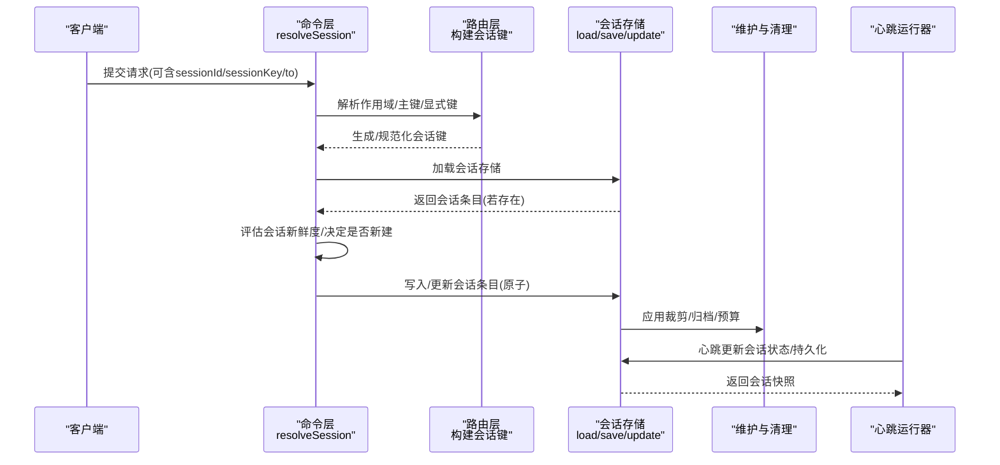
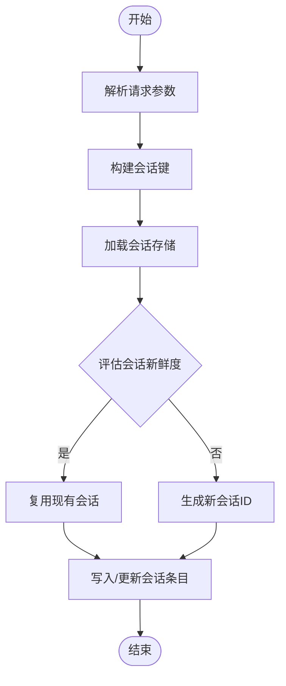
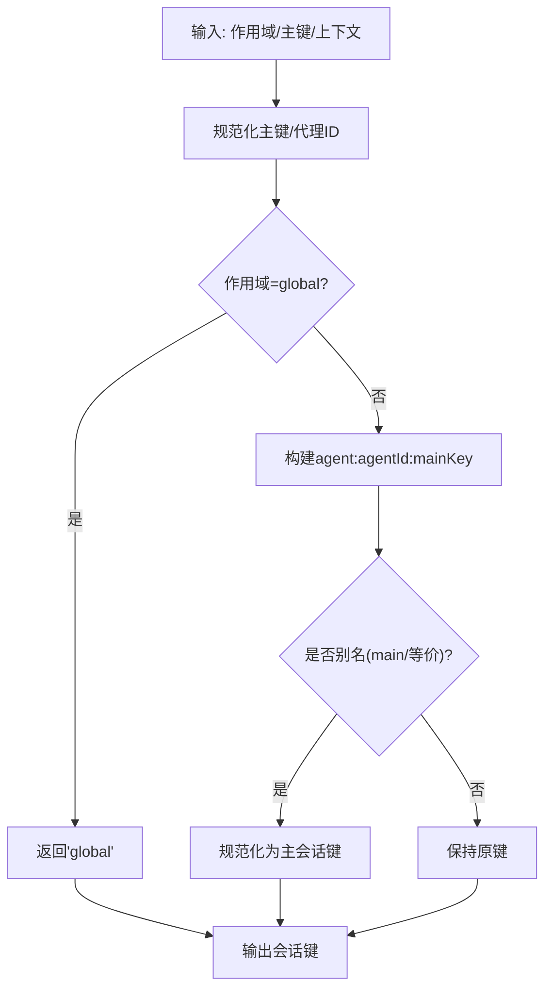
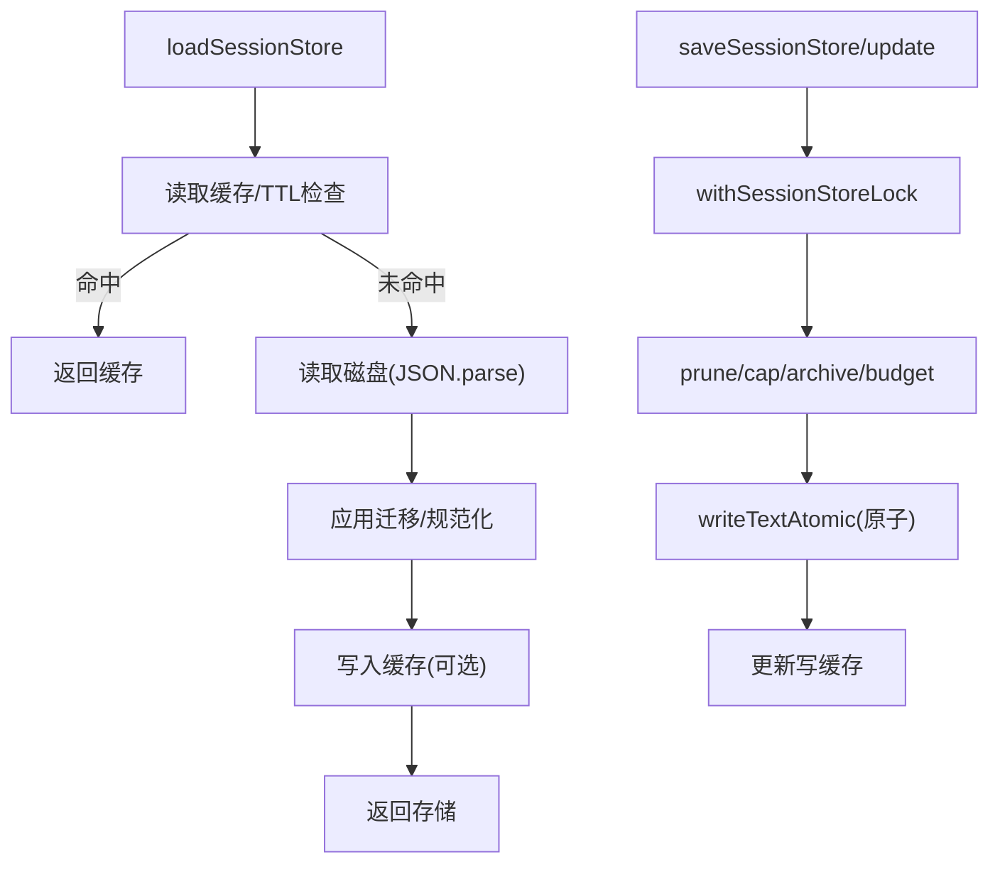
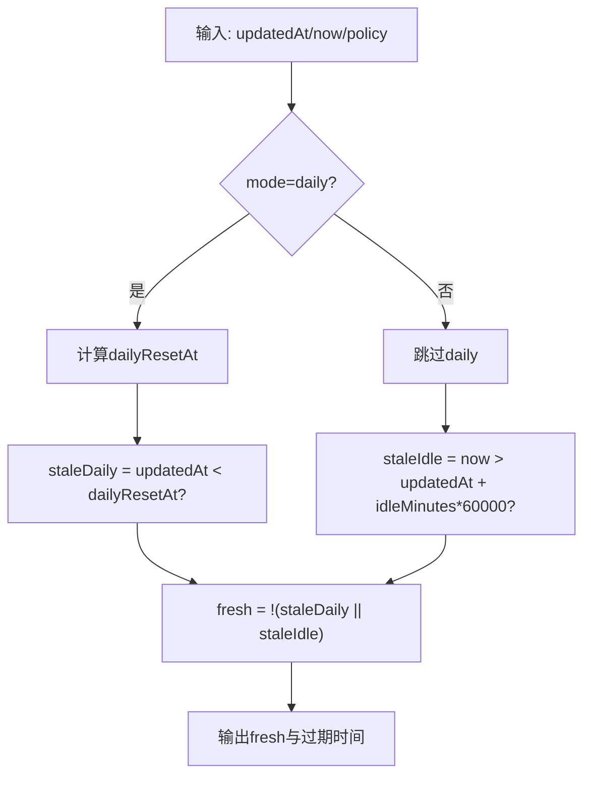
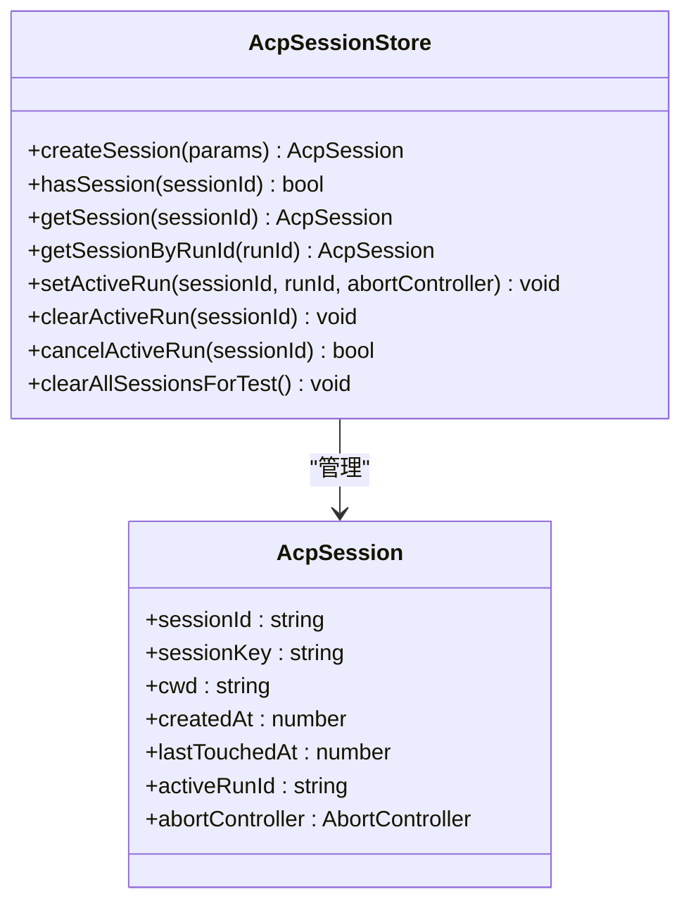
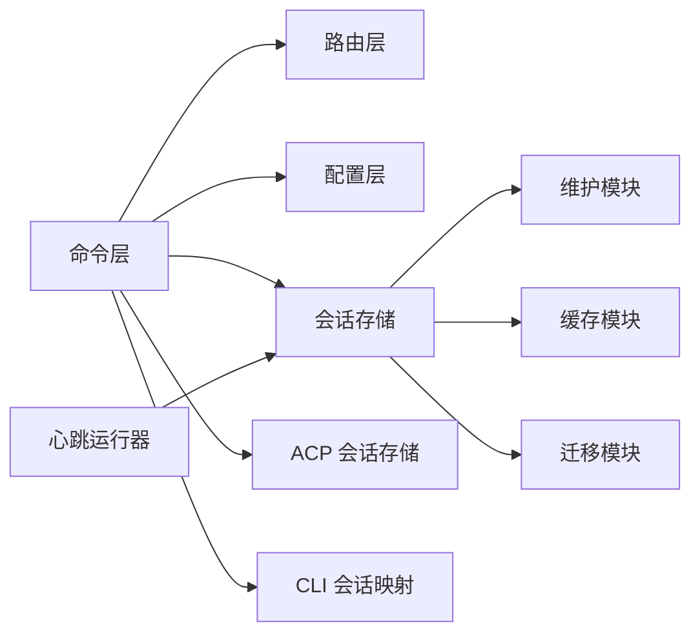

# 会话建立

<cite>
**本文引用的文件**
- [src/commands/agent/session.ts](file://src/commands/agent/session.ts)
- [src/config/sessions.ts](file://src/config/sessions.ts)
- [src/config/sessions/main-session.ts](file://src/config/sessions/main-session.ts)
- [src/config/sessions/reset.ts](file://src/config/sessions/reset.ts)
- [src/config/sessions/store.ts](file://src/config/sessions/store.ts)
- [src/routing/session-key.ts](file://src/routing/session-key.ts)
- [src/agents/cli-session.ts](file://src/agents/cli-session.ts)
- [src/web/auto-reply/heartbeat-runner.ts](file://src/web/auto-reply/heartbeat-runner.ts)
- [src/agents/pi-extensions/session-manager-runtime-registry.ts](file://src/agents/pi-extensions/session-manager-runtime-registry.ts)
- [src/acp/session.ts](file://src/acp/session.ts)
- [src/acp/runtime/session-identifiers.ts](file://src/acp/runtime/session-identifiers.ts)
- [src/acp/runtime/session-identity.ts](file://src/acp/runtime/session-identity.ts)
</cite>

## 目录
1. [简介](#简介)
2. [项目结构](#项目结构)
3. [核心组件](#核心组件)
4. [架构总览](#架构总览)
5. [详细组件分析](#详细组件分析)
6. [依赖关系分析](#依赖关系分析)
7. [性能考量](#性能考量)
8. [故障排查指南](#故障排查指南)
9. [结论](#结论)
10. [附录](#附录)

## 简介
本文件系统性梳理 OpenClaw 的“会话建立”流程与机制，覆盖从客户端注册、会话初始化、状态同步到会话标识符生成、会话超时与重置策略、事件与回调传播、以及不同类型会话（operator、node）的差异化配置与行为。文档同时提供关键流程的时序图与实际会话示例路径，帮助开发者与运维人员快速定位问题并进行修复。

## 项目结构
围绕“会话建立”的相关代码主要分布在以下模块：
- 会话解析与键空间：命令层解析请求参数，路由层构建会话键，配置层定义会话键规范与主会话键解析。
- 会话存储与维护：会话存储文件的加载、写入、并发锁、迁移、裁剪、归档与磁盘预算控制。
- 会话重置与超时：按日/空闲维度评估会话新鲜度，决定是否新建或复用会话。
- ACP 会话管理：内存会话存储、活跃运行跟踪、空闲回收与取消。
- CLI 会话映射：将不同后端提供商的会话 ID 映射到会话条目。
- 心跳与状态快照：在自动回复场景中，基于心跳更新会话状态与持久化。

**图表来源**
- [src/commands/agent/session.ts](file://src/commands/agent/session.ts#L111-L172)
- [src/routing/session-key.ts](file://src/routing/session-key.ts#L118-L174)
- [src/config/sessions/main-session.ts](file://src/config/sessions/main-session.ts#L11-L28)
- [src/config/sessions/reset.ts](file://src/config/sessions/reset.ts#L84-L120)
- [src/config/sessions/store.ts](file://src/config/sessions/store.ts#L195-L270)
- [src/acp/session.ts](file://src/acp/session.ts#L24-L107)
- [src/agents/cli-session.ts](file://src/agents/cli-session.ts#L4-L37)
- [src/web/auto-reply/heartbeat-runner.ts](file://src/web/auto-reply/heartbeat-runner.ts#L78-L116)

**章节来源**
- [src/commands/agent/session.ts](file://src/commands/agent/session.ts#L1-L173)
- [src/config/sessions.ts](file://src/config/sessions.ts#L1-L14)
- [src/config/sessions/main-session.ts](file://src/config/sessions/main-session.ts#L1-L80)
- [src/config/sessions/reset.ts](file://src/config/sessions/reset.ts#L1-L177)
- [src/config/sessions/store.ts](file://src/config/sessions/store.ts#L1-L863)
- [src/routing/session-key.ts](file://src/routing/session-key.ts#L1-L254)
- [src/agents/cli-session.ts](file://src/agents/cli-session.ts#L1-L38)
- [src/web/auto-reply/heartbeat-runner.ts](file://src/web/auto-reply/heartbeat-runner.ts#L1-L116)
- [src/acp/session.ts](file://src/acp/session.ts#L1-L191)
- [src/acp/runtime/session-identifiers.ts](file://src/acp/runtime/session-identifiers.ts#L1-L142)
- [src/acp/runtime/session-identity.ts](file://src/acp/runtime/session-identity.ts#L1-L211)

## 核心组件
- 会话解析与选择
  - 命令层根据请求参数解析会话键、会话 ID、代理 ID，决定是否复用现有会话或生成新会话。
  - 支持跨代理存储查找会话 ID，确保多代理场景下的会话一致性。
- 会话键与主会话键
  - 路由层支持多种会话键形态（全局、按代理、按主键、按群组/频道/线程），并提供规范化与校验。
  - 配置层支持“全局”作用域与“主键”别名解析，保证主会话键的一致性。
- 会话存储与并发
  - 存储层提供原子写入、缓存、迁移、裁剪、归档与磁盘预算控制；通过写锁队列保障并发安全。
- 会话重置与超时
  - 按日/空闲两种模式评估会话新鲜度；支持通道级与类型级重置策略覆盖。
- ACP 会话管理
  - 内存会话存储，跟踪活跃运行与取消；空闲超时回收；最大会话数限制。
- CLI 会话映射
  - 将不同提供商的会话 ID 统一映射到会话条目，兼容历史字段。
- 心跳与状态快照
  - 在自动回复场景中，心跳触发会话状态快照与持久化，记录会话键、会话 ID、重置策略与过期时间。

**章节来源**
- [src/commands/agent/session.ts](file://src/commands/agent/session.ts#L111-L172)
- [src/routing/session-key.ts](file://src/routing/session-key.ts#L118-L174)
- [src/config/sessions/main-session.ts](file://src/config/sessions/main-session.ts#L11-L28)
- [src/config/sessions/store.ts](file://src/config/sessions/store.ts#L195-L270)
- [src/config/sessions/reset.ts](file://src/config/sessions/reset.ts#L84-L120)
- [src/acp/session.ts](file://src/acp/session.ts#L24-L107)
- [src/agents/cli-session.ts](file://src/agents/cli-session.ts#L4-L37)
- [src/web/auto-reply/heartbeat-runner.ts](file://src/web/auto-reply/heartbeat-runner.ts#L78-L116)

## 架构总览
下图展示从请求进入、键解析、存储访问到会话状态更新的总体流程。

**图表来源**
- [src/commands/agent/session.ts](file://src/commands/agent/session.ts#L111-L172)
- [src/routing/session-key.ts](file://src/routing/session-key.ts#L118-L174)
- [src/config/sessions/store.ts](file://src/config/sessions/store.ts#L195-L270)
- [src/web/auto-reply/heartbeat-runner.ts](file://src/web/auto-reply/heartbeat-runner.ts#L78-L116)

## 详细组件分析

### 会话解析与选择（命令层）
- 关键职责
  - 解析请求参数：to、sessionId、sessionKey、agentId。
  - 计算会话键：结合作用域、主键与消息上下文。
  - 查找会话：优先使用显式键；若无则按 to 推导；若 sessionId 未命中，跨代理存储查找。
  - 评估新鲜度：结合重置策略判断是否复用现有会话。
  - 生成新会话：若不新鲜且未指定 sessionId，则生成新的随机会话 ID。
- 并发与一致性
  - 使用存储层提供的原子更新与写锁，避免并发写冲突。
- 典型调用链
  - resolveSessionKeyForRequest → resolveSession → evaluateSessionFreshness → 生成/复用 sessionId。

**图表来源**
- [src/commands/agent/session.ts](file://src/commands/agent/session.ts#L111-L172)
- [src/config/sessions/reset.ts](file://src/config/sessions/reset.ts#L139-L159)

**章节来源**
- [src/commands/agent/session.ts](file://src/commands/agent/session.ts#L111-L172)

### 会话键与主会话键（路由与配置）
- 会话键形态
  - 全局键、按代理主键、按代理-主键、按代理-主键-通道-账号-类型-对端等。
  - 支持线程/话题/群组/频道等标记位，用于区分会话范围。
- 主会话键解析
  - 支持“全局”作用域；否则基于默认代理与主键生成。
  - 别名解析：将“main”及等价别名规范化为主会话键。
- 键规范化与校验
  - 对代理 ID、主键进行小写与字符集规范化，确保键稳定一致。

**图表来源**
- [src/routing/session-key.ts](file://src/routing/session-key.ts#L118-L174)
- [src/config/sessions/main-session.ts](file://src/config/sessions/main-session.ts#L11-L28)

**章节来源**
- [src/routing/session-key.ts](file://src/routing/session-key.ts#L118-L174)
- [src/config/sessions/main-session.ts](file://src/config/sessions/main-session.ts#L11-L28)

### 会话存储与维护（并发、缓存、裁剪、归档）
- 加载与缓存
  - 支持 TTL 缓存与序列化缓存；Windows 下对空文件/锁定状态做重试。
  - 迁移与规范化：加载后应用迁移并规范化条目字段。
- 写入与锁
  - 原子写入；写锁队列串行化并发写；超时与过期检测。
- 维护策略
  - 裁剪：按最大条目数上限与过期阈值清理。
  - 归档：删除条目对应的转录文件归档；清理过期归档。
  - 磁盘预算：按配置强制清理以满足磁盘限额。
- 更新入口
  - recordSessionMetaFromInbound：仅合并元数据，不刷新活动时间。
  - updateLastRoute：合并路由信息并更新活动时间。

**图表来源**
- [src/config/sessions/store.ts](file://src/config/sessions/store.ts#L195-L270)
- [src/config/sessions/store.ts](file://src/config/sessions/store.ts#L340-L524)

**章节来源**
- [src/config/sessions/store.ts](file://src/config/sessions/store.ts#L195-L270)
- [src/config/sessions/store.ts](file://src/config/sessions/store.ts#L340-L524)

### 会话重置与超时（按日/空闲）
- 重置类型
  - 直接对话、群组、线程；支持从键名与上下文推断。
- 重置策略
  - 模式：按日(daily)或空闲(idle)；按小时重置点；空闲分钟数。
  - 通道级与类型级覆盖：允许针对特定通道或直接/群组/线程类型设置不同策略。
- 新鲜度评估
  - 按日：计算当日重置点；按空闲：比较 updatedAt 与当前时间。
  - 结果：fresh=false 时需新建会话。

**图表来源**
- [src/config/sessions/reset.ts](file://src/config/sessions/reset.ts#L139-L159)

**章节来源**
- [src/config/sessions/reset.ts](file://src/config/sessions/reset.ts#L84-L120)
- [src/config/sessions/reset.ts](file://src/config/sessions/reset.ts#L139-L159)

### ACP 会话管理（operator/node 场景）
- 内存会话存储
  - 创建/获取/查询/激活运行；空闲超时回收；最大会话数限制。
- 运行跟踪
  - activeRunId 与 AbortController 关联；取消运行时清理。
- 回收策略
  - 按 idleTtlMs 清理长时间未触碰的非活跃会话；必要时淘汰最久未使用会话。

**图表来源**
- [src/acp/session.ts](file://src/acp/session.ts#L4-L191)

**章节来源**
- [src/acp/session.ts](file://src/acp/session.ts#L24-L107)

### CLI 会话映射（不同提供商）
- 功能
  - 将不同提供商的会话 ID 写入会话条目；兼容历史字段“claude-cli”。
  - 读取时按标准化提供商 ID 查询，必要时回退历史字段。
- 用途
  - 在多后端场景下，统一管理会话 ID，便于后续恢复与追踪。

**章节来源**
- [src/agents/cli-session.ts](file://src/agents/cli-session.ts#L4-L37)

### 心跳与状态快照（自动回复场景）
- 触发时机
  - 心跳运行器在收到消息或定时触发时，解析会话键与会话 ID。
- 持久化
  - 更新会话存储中的会话条目，记录 updatedAt 等字段。
- 日志与可观测性
  - 输出会话键、会话 ID、重置策略与过期时间等快照信息，便于诊断。

**章节来源**
- [src/web/auto-reply/heartbeat-runner.ts](file://src/web/auto-reply/heartbeat-runner.ts#L78-L116)

### 会话标识符生成与渲染（ACP）
- 标识符来源
  - 来自会话元数据的 identity：可能包含后端会话 ID、记录 ID、代理会话 ID。
- 渲染模式
  - 状态模式：显示可用标识符列表。
  - 线程模式：附加“resume”提示（按代理键映射）。
- 合并与去重
  - 合并时尊重“已解析”优先级，避免覆盖已有稳定标识符。

**章节来源**
- [src/acp/runtime/session-identifiers.ts](file://src/acp/runtime/session-identifiers.ts#L66-L108)
- [src/acp/runtime/session-identity.ts](file://src/acp/runtime/session-identity.ts#L102-L147)

## 依赖关系分析
- 命令层依赖路由层与配置层来解析会话键与主会话键，再委托存储层进行持久化。
- 存储层内部依赖维护模块（裁剪/归档/预算）、缓存模块与迁移模块。
- ACP 会话存储独立于常规会话存储，但共享“会话”概念。
- CLI 会话映射与心跳运行器分别在不同场景下更新会话条目。

**图表来源**
- [src/commands/agent/session.ts](file://src/commands/agent/session.ts#L111-L172)
- [src/config/sessions/store.ts](file://src/config/sessions/store.ts#L195-L270)
- [src/acp/session.ts](file://src/acp/session.ts#L24-L107)
- [src/agents/cli-session.ts](file://src/agents/cli-session.ts#L4-L37)
- [src/web/auto-reply/heartbeat-runner.ts](file://src/web/auto-reply/heartbeat-runner.ts#L78-L116)

**章节来源**
- [src/commands/agent/session.ts](file://src/commands/agent/session.ts#L111-L172)
- [src/config/sessions/store.ts](file://src/config/sessions/store.ts#L195-L270)
- [src/acp/session.ts](file://src/acp/session.ts#L24-L107)
- [src/agents/cli-session.ts](file://src/agents/cli-session.ts#L4-L37)
- [src/web/auto-reply/heartbeat-runner.ts](file://src/web/auto-reply/heartbeat-runner.ts#L78-L116)

## 性能考量
- 缓存与 TTL
  - 会话存储支持 TTL 缓存与序列化缓存，减少频繁磁盘 IO；可通过环境变量调整 TTL。
- 并发写入
  - 写锁队列串行化写操作，避免竞争；Windows 下对临时空文件/锁定状态做短暂停顿重试。
- 维护成本
  - 裁剪、归档与磁盘预算在保存前执行，避免文件膨胀；warn-only 模式可避免误删活跃会话。
- ACP 会话
  - 最大会话数与空闲 TTL 可配置，防止内存泄漏；取消活跃运行时及时释放资源。

**章节来源**
- [src/config/sessions/store.ts](file://src/config/sessions/store.ts#L58-L67)
- [src/config/sessions/store.ts](file://src/config/sessions/store.ts#L213-L249)
- [src/acp/session.ts](file://src/acp/session.ts#L24-L59)

## 故障排查指南
- 会话未复用/频繁新建
  - 检查重置策略：是否处于每日重置点附近或空闲超时导致会话过期。
  - 检查 sessionId 是否与会话键不匹配；必要时启用跨代理存储查找。
  - 参考：[重置策略与新鲜度评估](file://src/config/sessions/reset.ts#L84-L120), [会话解析](file://src/commands/agent/session.ts#L111-L172)
- 会话键不一致/找不到
  - 确认主键与代理 ID 规范化；检查别名解析是否正确。
  - 参考：[主会话键解析](file://src/config/sessions/main-session.ts#L11-L28), [会话键构建](file://src/routing/session-key.ts#L118-L174)
- 写入失败/并发冲突
  - 检查写锁超时与过期；确认磁盘权限与空间；关注 Windows 下的临时文件写入。
  - 参考：[写锁与原子写入](file://src/config/sessions/store.ts#L674-L706), [原子写入](file://src/config/sessions/store.ts#L577-L588)
- ACP 会话过多/无法创建
  - 检查最大会话数与空闲 TTL；清理长时间未使用的会话。
  - 参考：[ACP 会话存储](file://src/acp/session.ts#L24-L107)
- CLI 会话 ID 未生效
  - 确认提供商 ID 标准化；检查历史字段回退逻辑。
  - 参考：[CLI 会话映射](file://src/agents/cli-session.ts#L4-L37)
- 心跳未更新会话
  - 检查心跳运行器是否正确解析会话键与会话 ID；确认存储写入成功。
  - 参考：[心跳运行器](file://src/web/auto-reply/heartbeat-runner.ts#L78-L116)

**章节来源**
- [src/config/sessions/reset.ts](file://src/config/sessions/reset.ts#L84-L120)
- [src/commands/agent/session.ts](file://src/commands/agent/session.ts#L111-L172)
- [src/config/sessions/main-session.ts](file://src/config/sessions/main-session.ts#L11-L28)
- [src/routing/session-key.ts](file://src/routing/session-key.ts#L118-L174)
- [src/config/sessions/store.ts](file://src/config/sessions/store.ts#L674-L706)
- [src/config/sessions/store.ts](file://src/config/sessions/store.ts#L577-L588)
- [src/acp/session.ts](file://src/acp/session.ts#L24-L107)
- [src/agents/cli-session.ts](file://src/agents/cli-session.ts#L4-L37)
- [src/web/auto-reply/heartbeat-runner.ts](file://src/web/auto-reply/heartbeat-runner.ts#L78-L116)

## 结论
OpenClaw 的会话建立流程以“键解析—存储访问—重置评估—并发保护”为核心，辅以维护与可观测性能力，覆盖 operator 与 node 等不同场景。通过明确的会话键规范、灵活的重置策略、可靠的存储与 ACP 会话管理，系统在复杂多变的渠道与代理环境中实现了高可用与可维护性。

## 附录
- 实际会话示例路径（不包含具体代码内容）
  - 会话解析与选择：[示例路径](file://src/commands/agent/session.ts#L111-L172)
  - 会话键构建与主会话键解析：[示例路径](file://src/routing/session-key.ts#L118-L174), [示例路径](file://src/config/sessions/main-session.ts#L11-L28)
  - 会话存储加载/写入/维护：[示例路径](file://src/config/sessions/store.ts#L195-L270), [示例路径](file://src/config/sessions/store.ts#L340-L524)
  - 会话重置策略与新鲜度评估：[示例路径](file://src/config/sessions/reset.ts#L84-L120), [示例路径](file://src/config/sessions/reset.ts#L139-L159)
  - ACP 会话存储与回收：[示例路径](file://src/acp/session.ts#L24-L107)
  - CLI 会话映射：[示例路径](file://src/agents/cli-session.ts#L4-L37)
  - 心跳运行器与状态快照：[示例路径](file://src/web/auto-reply/heartbeat-runner.ts#L78-L116)
  - 会话标识符渲染与合并：[示例路径](file://src/acp/runtime/session-identifiers.ts#L66-L108), [示例路径](file://src/acp/runtime/session-identity.ts#L102-L147)