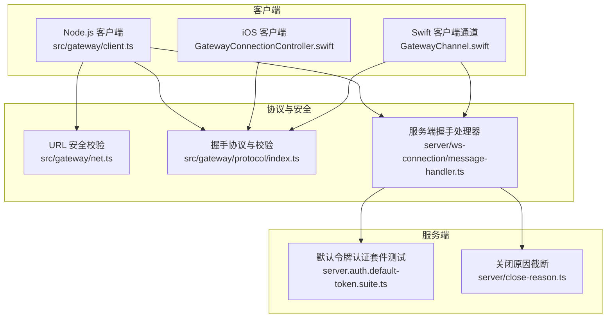
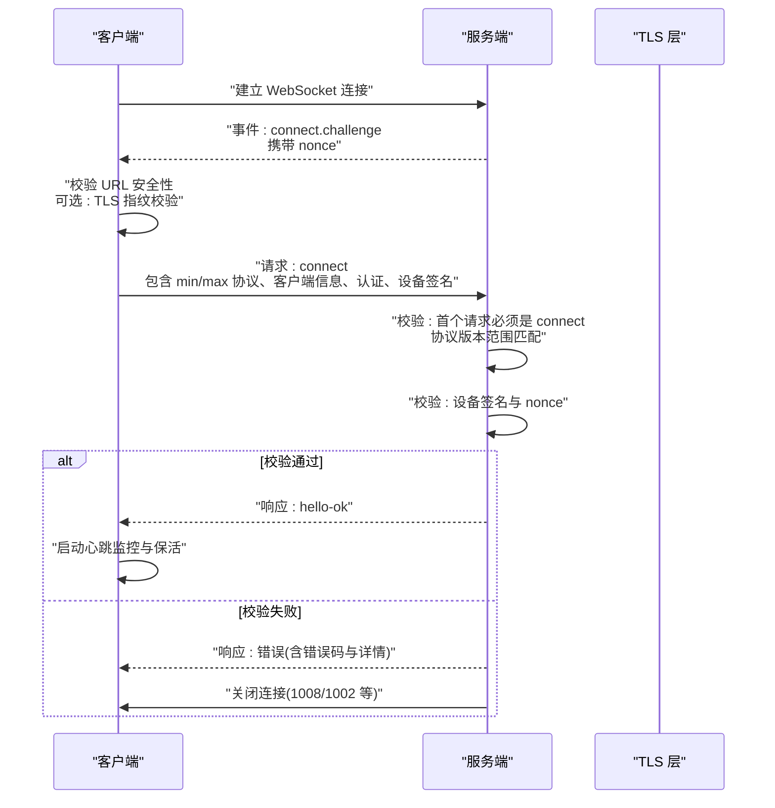
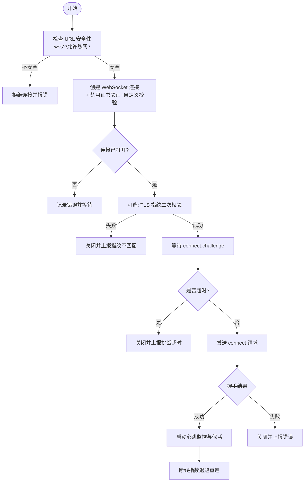
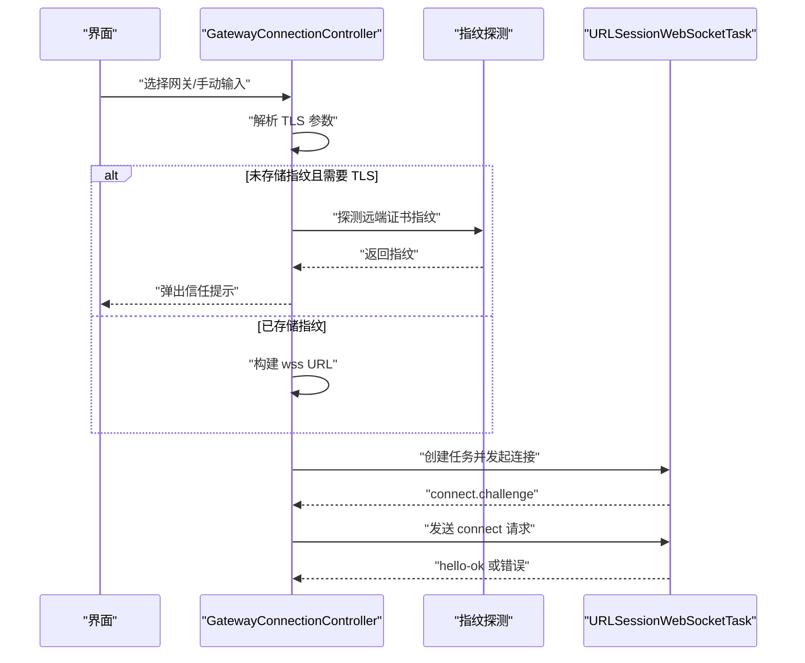
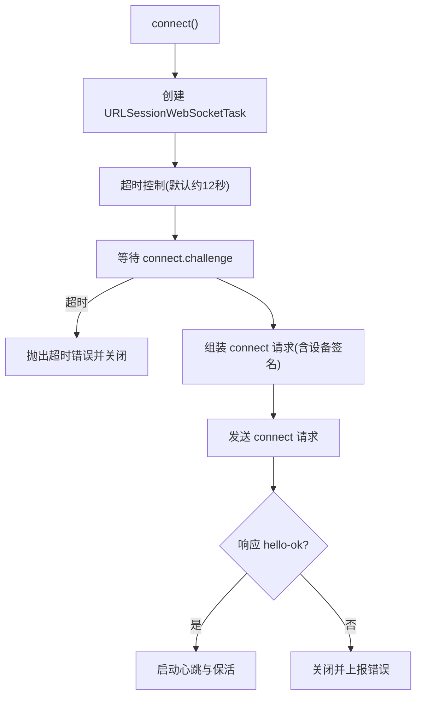
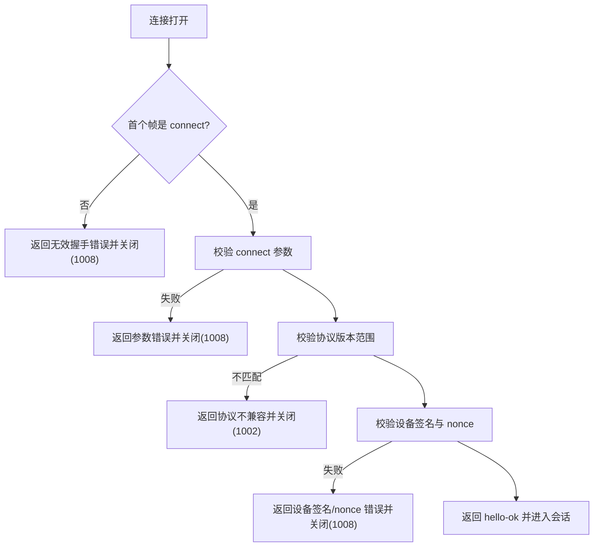
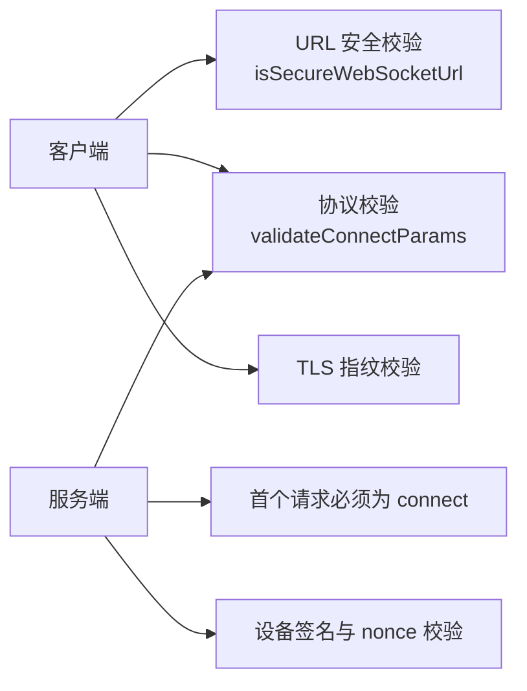

# 握手阶段

<cite>
**本文引用的文件**
- [src/gateway/client.ts](file://src/gateway/client.ts)
- [apps/shared/OpenClawKit/Sources/OpenClawKit/GatewayChannel.swift](file://apps/shared/OpenClawKit/Sources/OpenClawKit/GatewayChannel.swift)
- [apps/ios/Sources/Gateway/GatewayConnectionController.swift](file://apps/ios/Sources/Gateway/GatewayConnectionController.swift)
- [src/gateway/net.ts](file://src/gateway/net.ts)
- [src/gateway/protocol/index.ts](file://src/gateway/protocol/index.ts)
- [src/gateway/server.auth.default-token.suite.ts](file://src/gateway/server.auth.default-token.suite.ts)
- [src/gateway/server/ws-connection/message-handler.ts](file://src/gateway/server/ws-connection/message-handler.ts)
- [src/gateway/server/close-reason.ts](file://src/gateway/server/close-reason.ts)
- [src/gateway/client.watchdog.test.ts](file://src/gateway/client.watchdog.test.ts)
- [apps/shared/OpenClawKit/Sources/OpenClawKit/GatewayConnectChallengeSupport.swift](file://apps/shared/OpenClawKit/Sources/OpenClawKit/GatewayConnectChallengeSupport.swift)
</cite>

## 目录
1. [引言](#引言)
2. [项目结构](#项目结构)
3. [核心组件](#核心组件)
4. [架构总览](#架构总览)
5. [详细组件分析](#详细组件分析)
6. [依赖关系分析](#依赖关系分析)
7. [性能考量](#性能考量)
8. [故障排查指南](#故障排查指南)
9. [结论](#结论)
10. [附录](#附录)

## 引言
本文件聚焦于 OpenClaw 的 WebSocket 握手阶段，系统性阐述握手流程、URL 验证、TLS 指纹校验、连接参数协商、安全检查（含私有网络允许与 CWE-319 防护）、挑战响应机制（nonce 生成、超时与错误恢复）以及常见失败场景与修复建议。文档同时给出状态转换图与真实握手示例，帮助开发者与运维人员快速定位问题并正确配置。

## 项目结构
OpenClaw 在多端实现中均遵循统一的握手协议与安全策略：
- 客户端侧：Node.js 客户端负责 URL 安全性校验、TLS 指纹比对、挑战等待与超时控制，并在握手成功后进入心跳监控与重连机制。
- iOS 客户端：通过系统 URLSessionWebSocketTask 建立连接，支持自动探测与信任提示，确保 TLS 指纹可信。
- 协议层：定义握手帧类型、connect 参数校验、错误码与细节字段，保障握手一致性与可观测性。
- 服务端：严格要求首次请求必须为 connect，校验协议版本范围、设备签名与 nonce，超时静默连接会主动关闭。

图表来源
- [src/gateway/client.ts](file://src/gateway/client.ts#L108-L222)
- [apps/ios/Sources/Gateway/GatewayConnectionController.swift](file://apps/ios/Sources/Gateway/GatewayConnectionController.swift#L1028-L1071)
- [apps/shared/OpenClawKit/Sources/OpenClawKit/GatewayChannel.swift](file://apps/shared/OpenClawKit/Sources/OpenClawKit/GatewayChannel.swift#L245-L293)
- [src/gateway/net.ts](file://src/gateway/net.ts#L411-L450)
- [src/gateway/protocol/index.ts](file://src/gateway/protocol/index.ts#L249-L252)
- [src/gateway/server/ws-connection/message-handler.ts](file://src/gateway/server/ws-connection/message-handler.ts#L392-L478)
- [src/gateway/server.auth.default-token.suite.ts](file://src/gateway/server.auth.default-token.suite.ts#L287-L299)
- [src/gateway/server/close-reason.ts](file://src/gateway/server/close-reason.ts#L1-L14)

章节来源
- [src/gateway/client.ts](file://src/gateway/client.ts#L108-L222)
- [src/gateway/net.ts](file://src/gateway/net.ts#L411-L450)
- [src/gateway/protocol/index.ts](file://src/gateway/protocol/index.ts#L249-L252)
- [src/gateway/server/ws-connection/message-handler.ts](file://src/gateway/server/ws-connection/message-handler.ts#L392-L478)
- [src/gateway/server.auth.default-token.suite.ts](file://src/gateway/server.auth.default-token.suite.ts#L287-L299)
- [src/gateway/server/close-reason.ts](file://src/gateway/server/close-reason.ts#L1-L14)

## 核心组件
- Node.js 客户端（GatewayClient）
  - 负责 URL 安全性检查、可选 TLS 指纹校验、等待 connect.challenge、发送 connect 请求、心跳监控与指数退避重连。
- iOS 客户端（GatewayConnectionController）
  - 通过系统 URLSessionWebSocketTask 建立连接，支持自动探测与信任提示，必要时读取服务器证书指纹进行校验。
- Swift 客户端通道（GatewayChannel）
  - 封装连接生命周期、挑战等待、超时控制、心跳与保活、请求超时与错误包装。
- 协议与校验（protocol/index.ts）
  - 定义握手帧类型、connect 参数校验器与错误格式化工具。
- 服务端握手处理器（server/ws-connection/message-handler.ts）
  - 严格要求首个请求为 connect，校验协议版本范围、设备签名与 nonce，错误时返回明确错误码与细节，并按需关闭连接。
- URL 安全校验（net.ts）
  - 提供 isSecureWebSocketUrl，用于判断 ws/wss 是否安全传输，支持私有网络豁免策略。
- 关闭原因截断（server/close-reason.ts）
  - 对关闭原因进行字节长度截断，避免过长文本影响兼容性。

章节来源
- [src/gateway/client.ts](file://src/gateway/client.ts#L108-L222)
- [apps/ios/Sources/Gateway/GatewayConnectionController.swift](file://apps/ios/Sources/Gateway/GatewayConnectionController.swift#L1028-L1071)
- [apps/shared/OpenClawKit/Sources/OpenClawKit/GatewayChannel.swift](file://apps/shared/OpenClawKit/Sources/OpenClawKit/GatewayChannel.swift#L245-L293)
- [src/gateway/protocol/index.ts](file://src/gateway/protocol/index.ts#L249-L252)
- [src/gateway/server/ws-connection/message-handler.ts](file://src/gateway/server/ws-connection/message-handler.ts#L392-L478)
- [src/gateway/net.ts](file://src/gateway/net.ts#L411-L450)
- [src/gateway/server/close-reason.ts](file://src/gateway/server/close-reason.ts#L1-L14)

## 架构总览
握手阶段的关键交互如下：
- 客户端发起 WebSocket 连接，服务端立即下发 connect.challenge（包含 nonce）。
- 客户端收到挑战后，准备 connect 请求（含 min/max 协议、客户端信息、可选认证与设备签名），并以 nonce 完成设备签名。
- 服务端校验 connect 请求合法性、协议版本、设备签名与 nonce，通过后返回 hello-ok 并开始心跳与事件推送。
- 若任一步骤失败，服务端返回明确错误并关闭连接；客户端根据错误类型执行重试或清理。

图表来源
- [src/gateway/server.auth.default-token.suite.ts](file://src/gateway/server.auth.default-token.suite.ts#L287-L299)
- [src/gateway/server/ws-connection/message-handler.ts](file://src/gateway/server/ws-connection/message-handler.ts#L392-L478)
- [src/gateway/client.ts](file://src/gateway/client.ts#L357-L392)
- [apps/shared/OpenClawKit/Sources/OpenClawKit/GatewayChannel.swift](file://apps/shared/OpenClawKit/Sources/OpenClawKit/GatewayChannel.swift#L396-L437)

## 详细组件分析

### Node.js 客户端握手流程（GatewayClient）
- URL 安全性检查
  - 当提供 tlsFingerprint 时，要求使用 wss://；否则拒绝连接。
  - 支持环境变量允许受信私网内的 ws://，默认禁止非本地地址明文传输。
- TLS 指纹校验
  - 可选禁用证书验证，自定义 checkServerIdentity，比较远端证书指纹与期望值。
  - 连接建立后再次校验，若不一致则关闭并上报错误。
- 挑战等待与超时
  - 收到 connect.challenge 后提取 nonce，随后发送 connect。
  - 若超过 connectChallengeTimeoutMs 未收到挑战，触发超时并关闭连接。
- 连接参数协商
  - 发送 connect 请求时包含 min/max 协议、客户端元数据、可选认证与设备签名。
- 心跳与重连
  - 成功握手后启动心跳监控，若长时间无 tick 则主动关闭。
  - 断线采用指数退避重连，最大延迟限制。

图表来源
- [src/gateway/client.ts](file://src/gateway/client.ts#L108-L222)
- [src/gateway/client.ts](file://src/gateway/client.ts#L357-L392)
- [src/gateway/client.ts](file://src/gateway/client.ts#L410-L428)
- [src/gateway/client.ts](file://src/gateway/client.ts#L474-L499)

章节来源
- [src/gateway/client.ts](file://src/gateway/client.ts#L108-L222)
- [src/gateway/client.ts](file://src/gateway/client.ts#L357-L392)
- [src/gateway/client.ts](file://src/gateway/client.ts#L410-L428)
- [src/gateway/client.ts](file://src/gateway/client.ts#L474-L499)

### iOS 客户端握手流程（GatewayConnectionController）
- 自动探测与信任提示
  - 发现网关后，若未启用 TLS 或未存储指纹，则通过系统 API 探测远端证书指纹并提示用户确认。
- TLS 参数解析
  - 若已存储指纹，则强制使用 wss 并要求指纹匹配；否则拒绝连接。
- 连接建立与握手
  - 使用 URLSessionWebSocketTask 建立连接，随后按统一协议完成挑战与 connect 流程。

图表来源
- [apps/ios/Sources/Gateway/GatewayConnectionController.swift](file://apps/ios/Sources/Gateway/GatewayConnectionController.swift#L1028-L1071)
- [apps/ios/Sources/Gateway/GatewayConnectionController.swift](file://apps/ios/Sources/Gateway/GatewayConnectionController.swift#L158-L207)

章节来源
- [apps/ios/Sources/Gateway/GatewayConnectionController.swift](file://apps/ios/Sources/Gateway/GatewayConnectionController.swift#L1028-L1071)
- [apps/ios/Sources/Gateway/GatewayConnectionController.swift](file://apps/ios/Sources/Gateway/GatewayConnectionController.swift#L158-L207)

### Swift 客户端通道（GatewayChannel）
- 挑战等待与超时
  - 独立等待 connect.challenge，超时抛出错误并中断握手。
- 连接参数与设备签名
  - 组装 connect 请求，包含 min/max 协议、客户端信息、认证与设备签名（当允许时）。
- 心跳与保活
  - 启动 keepalive 与 tick 监控，维持连接活跃并检测异常断开。
- 请求超时与错误包装
  - 对请求设置超时，失败时包装底层错误并触发重连。

图表来源
- [apps/shared/OpenClawKit/Sources/OpenClawKit/GatewayChannel.swift](file://apps/shared/OpenClawKit/Sources/OpenClawKit/GatewayChannel.swift#L245-L293)
- [apps/shared/OpenClawKit/Sources/OpenClawKit/GatewayChannel.swift](file://apps/shared/OpenClawKit/Sources/OpenClawKit/GatewayChannel.swift#L396-L437)
- [apps/shared/OpenClawKit/Sources/OpenClawKit/GatewayChannel.swift](file://apps/shared/OpenClawKit/Sources/OpenClawKit/GatewayChannel.swift#L543-L562)

章节来源
- [apps/shared/OpenClawKit/Sources/OpenClawKit/GatewayChannel.swift](file://apps/shared/OpenClawKit/Sources/OpenClawKit/GatewayChannel.swift#L245-L293)
- [apps/shared/OpenClawKit/Sources/OpenClawKit/GatewayChannel.swift](file://apps/shared/OpenClawKit/Sources/OpenClawKit/GatewayChannel.swift#L396-L437)
- [apps/shared/OpenClawKit/Sources/OpenClawKit/GatewayChannel.swift](file://apps/shared/OpenClawKit/Sources/OpenClawKit/GatewayChannel.swift#L543-L562)

### 协议与校验（protocol/index.ts）
- 握手帧与参数校验
  - 定义 RequestFrame、EventFrame、HelloOk 等类型与校验器，确保握手消息结构正确。
- 错误格式化
  - 将 Ajv 校验错误转为人类可读字符串，便于服务端返回与客户端展示。

章节来源
- [src/gateway/protocol/index.ts](file://src/gateway/protocol/index.ts#L249-L252)
- [src/gateway/protocol/index.ts](file://src/gateway/protocol/index.ts#L404-L438)

### 服务端握手处理器（server/ws-connection/message-handler.ts）
- 首请求约束
  - 首个帧必须为 connect，且参数通过校验；否则直接关闭连接并返回错误。
- 协议版本协商
  - 校验 min/max 协议范围，不匹配则返回协议不兼容并关闭。
- 设备签名与 nonce 校验
  - 若使用设备签名，必须包含有效 nonce；否则返回相应错误码与原因。
- 错误与关闭
  - 返回明确错误码与细节，按需截断关闭原因，避免过长文本。

图表来源
- [src/gateway/server/ws-connection/message-handler.ts](file://src/gateway/server/ws-connection/message-handler.ts#L392-L478)
- [src/gateway/server.auth.default-token.suite.ts](file://src/gateway/server.auth.default-token.suite.ts#L287-L299)
- [src/gateway/server/close-reason.ts](file://src/gateway/server/close-reason.ts#L1-L14)

章节来源
- [src/gateway/server/ws-connection/message-handler.ts](file://src/gateway/server/ws-connection/message-handler.ts#L392-L478)
- [src/gateway/server.auth.default-token.suite.ts](file://src/gateway/server.auth.default-token.suite.ts#L287-L299)
- [src/gateway/server/close-reason.ts](file://src/gateway/server/close-reason.ts#L1-L14)

## 依赖关系分析
- 客户端依赖
  - URL 安全校验：isSecureWebSocketUrl 决定是否允许明文 ws://。
  - 协议校验：validateConnectParams 确保 connect 请求合法。
  - TLS 指纹：客户端与服务端分别进行指纹比对。
- 服务端依赖
  - 首请求校验：确保握手从 connect 开始。
  - 协议版本：严格匹配范围。
  - 设备签名与 nonce：保证设备身份与挑战完整性。

图表来源
- [src/gateway/net.ts](file://src/gateway/net.ts#L411-L450)
- [src/gateway/protocol/index.ts](file://src/gateway/protocol/index.ts#L249-L252)
- [src/gateway/server/ws-connection/message-handler.ts](file://src/gateway/server/ws-connection/message-handler.ts#L392-L478)

章节来源
- [src/gateway/net.ts](file://src/gateway/net.ts#L411-L450)
- [src/gateway/protocol/index.ts](file://src/gateway/protocol/index.ts#L249-L252)
- [src/gateway/server/ws-connection/message-handler.ts](file://src/gateway/server/ws-connection/message-handler.ts#L392-L478)

## 性能考量
- 连接超时与挑战超时
  - 客户端与 Swift 通道均设置握手与挑战超时，避免资源占用与阻塞。
- 心跳与保活
  - 通过 tick 与 ping 保持连接活性，减少 NAT/代理空闲断开风险。
- 指数退避重连
  - 断线后采用指数退避，上限保护，降低风暴效应。

## 故障排查指南
- 常见错误与修复
  - “connect challenge missing nonce”：服务端未下发 nonce 或客户端未正确提取。检查服务端是否发送 connect.challenge，客户端是否等待并解析。
  - “gateway tls fingerprint mismatch”：TLS 指纹不匹配。核对服务端证书指纹与客户端期望值，或移除指纹强制校验。
  - “invalid handshake: first request must be connect”：首个帧不是 connect。确保客户端按协议发送 connect 请求。
  - “protocol mismatch”：min/max 协议范围不兼容。调整客户端 min/max 至服务端支持范围。
  - “device nonce mismatch”：设备签名使用的 nonce 与挑战不一致。确保客户端正确提取并使用最新 nonce。
  - “connect challenge timeout”：超过阈值未收到挑战。检查网络连通性、服务端负载与日志。
- 实际测试参考
  - 客户端在指纹不匹配时会主动关闭并报告错误，便于快速定位。
  - 服务端对静默握手（长时间无响应）会主动关闭，避免资源泄漏。

章节来源
- [src/gateway/server.auth.default-token.suite.ts](file://src/gateway/server.auth.default-token.suite.ts#L36-L68)
- [src/gateway/server.auth.default-token.suite.ts](file://src/gateway/server.auth.default-token.suite.ts#L78-L94)
- [src/gateway/server/ws-connection/message-handler.ts](file://src/gateway/server/ws-connection/message-handler.ts#L392-L478)
- [src/gateway/client.watchdog.test.ts](file://src/gateway/client.watchdog.test.ts#L137-L185)

## 结论
OpenClaw 的握手阶段通过严格的 URL 安全性检查、TLS 指纹校验、挑战-响应与协议版本协商，确保连接的安全与稳定。客户端与服务端均提供了完善的错误反馈与超时控制，配合心跳与指数退避重连，能够有效应对复杂网络环境下的连接波动。遵循本文档的配置与排障建议，可显著提升握手成功率与系统可靠性。

## 附录
- 握手示例（文字描述）
  - 步骤一：客户端发起 wss 连接，服务端下发 connect.challenge（含 nonce）。
  - 步骤二：客户端提取 nonce，组装 connect 请求（含 min/max 协议、客户端信息、认证与设备签名）。
  - 步骤三：服务端校验 connect 请求、协议版本、设备签名与 nonce，通过后返回 hello-ok。
  - 步骤四：客户端启动心跳与保活，进入正常会话。
- 安全要点
  - 明文 ws:// 仅限本地回环或受信私网（需显式开启），防止 CWE-319 风险。
  - TLS 指纹校验可进一步降低中间人攻击风险。
  - 设备签名与 nonce 保证设备身份与挑战完整性。