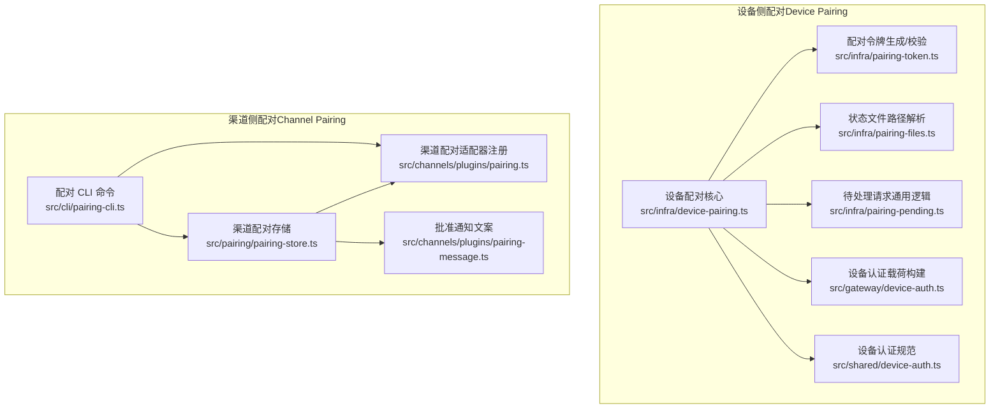
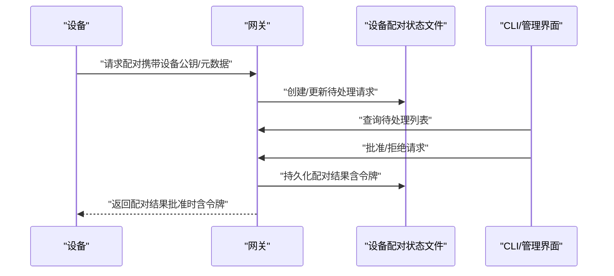
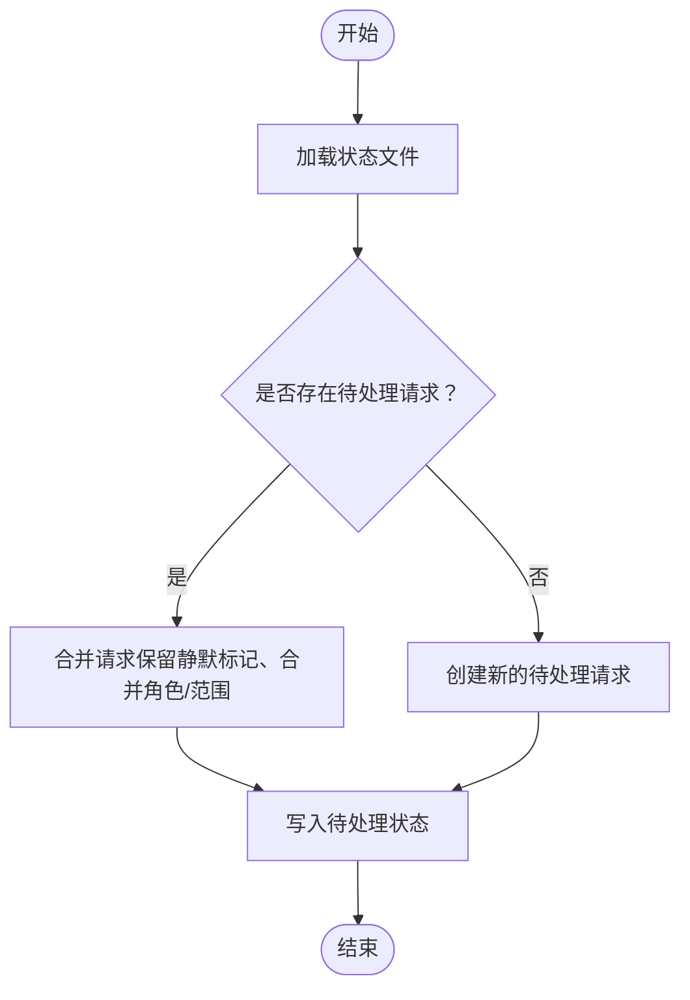
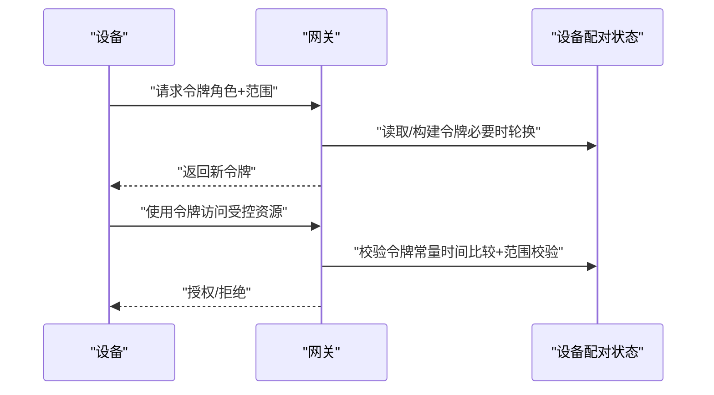
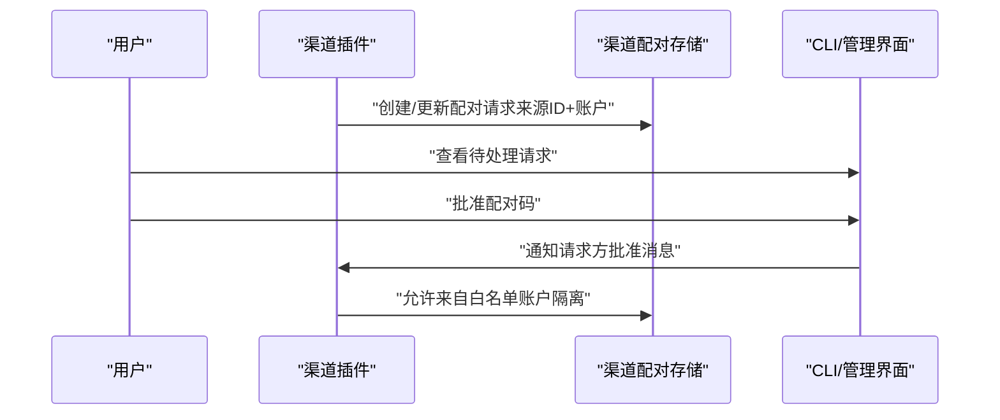
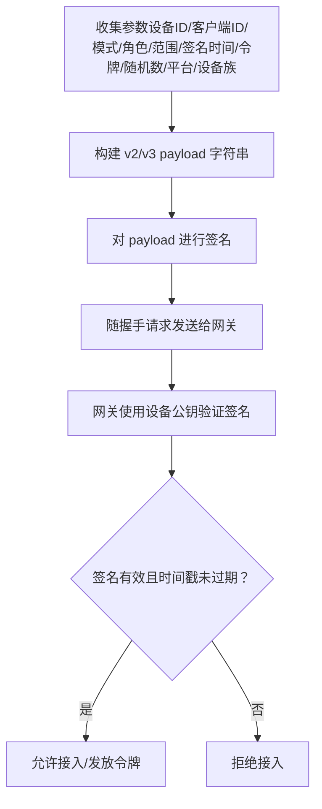
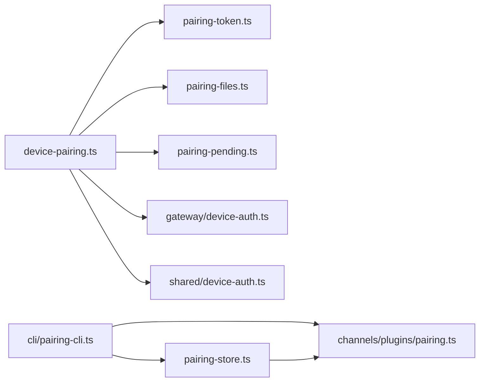
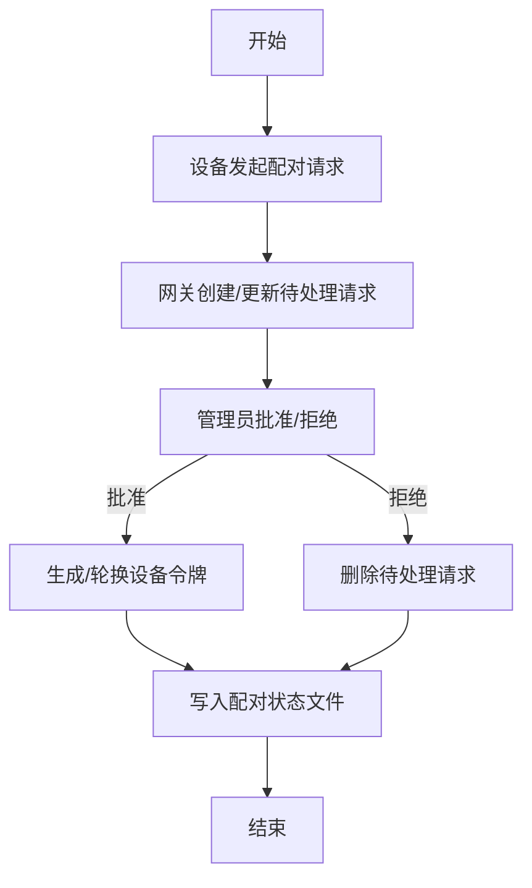

# 设备配对机制

<cite>
**本文档引用的文件**
- [src/infra/device-pairing.ts](file://src/infra/device-pairing.ts)
- [src/infra/pairing-files.ts](file://src/infra/pairing-files.ts)
- [src/infra/pairing-token.ts](file://src/infra/pairing-token.ts)
- [src/infra/pairing-pending.ts](file://src/infra/pairing-pending.ts)
- [src/pairing/pairing-store.ts](file://src/pairing/pairing-store.ts)
- [src/channels/plugins/pairing.ts](file://src/channels/plugins/pairing.ts)
- [src/channels/plugins/pairing-message.ts](file://src/channels/plugins/pairing-message.ts)
- [src/cli/pairing-cli.ts](file://src/cli/pairing-cli.ts)
- [src/gateway/device-auth.ts](file://src/gateway/device-auth.ts)
- [src/shared/device-auth.ts](file://src/shared/device-auth.ts)
- [docs/gateway/pairing.md](file://docs/gateway/pairing.md)
- [docs/cli/pairing.md](file://docs/cli/pairing.md)
</cite>

## 目录
1. [简介](#简介)
2. [项目结构](#项目结构)
3. [核心组件](#核心组件)
4. [架构总览](#架构总览)
5. [详细组件分析](#详细组件分析)
6. [依赖关系分析](#依赖关系分析)
7. [性能考量](#性能考量)
8. [故障排查指南](#故障排查指南)
9. [结论](#结论)
10. [附录](#附录)

## 简介
本文件系统性阐述 OpenClaw 的设备配对机制，覆盖从设备身份与密钥生成、配对请求处理、配对状态管理、配对信息持久化到配对失效与撤销的全流程。同时解释设备身份验证的签名构建与校验（payload 格式、签名算法、时间戳校验）、安全策略与防护措施，并提供配对流程图与实际示例及常见问题诊断。

## 项目结构
OpenClaw 将“设备配对”分为两类：
- 设备侧配对：面向设备（如移动端、桌面端）与网关之间的双向信任建立，涉及设备公钥、令牌轮换与权限范围控制。
- 渠道侧配对：面向消息渠道（Telegram、Discord 等）的“受信发送者”管理，通过一次性配对码完成审批。

**图表来源**
- [src/infra/device-pairing.ts](file://src/infra/device-pairing.ts#L1-L654)
- [src/infra/pairing-token.ts](file://src/infra/pairing-token.ts#L1-L13)
- [src/infra/pairing-files.ts](file://src/infra/pairing-files.ts#L1-L51)
- [src/infra/pairing-pending.ts](file://src/infra/pairing-pending.ts#L1-L28)
- [src/gateway/device-auth.ts](file://src/gateway/device-auth.ts#L1-L55)
- [src/shared/device-auth.ts](file://src/shared/device-auth.ts#L1-L31)
- [src/pairing/pairing-store.ts](file://src/pairing/pairing-store.ts#L1-L845)
- [src/channels/plugins/pairing.ts](file://src/channels/plugins/pairing.ts#L1-L70)
- [src/channels/plugins/pairing-message.ts](file://src/channels/plugins/pairing-message.ts#L1-L3)
- [src/cli/pairing-cli.ts](file://src/cli/pairing-cli.ts#L1-L174)

**章节来源**
- [src/infra/device-pairing.ts](file://src/infra/device-pairing.ts#L1-L654)
- [src/pairing/pairing-store.ts](file://src/pairing/pairing-store.ts#L1-L845)
- [src/channels/plugins/pairing.ts](file://src/channels/plugins/pairing.ts#L1-L70)
- [src/cli/pairing-cli.ts](file://src/cli/pairing-cli.ts#L1-L174)

## 核心组件
- 设备配对核心模块：负责设备身份、公钥、令牌生命周期管理、角色与权限范围合并、配对状态持久化与并发安全。
- 配对令牌模块：生成随机安全令牌并进行常量时间比较，避免时序攻击。
- 配对文件模块：解析状态目录、读写 JSON 文件、清理过期待处理请求。
- 渠道配对存储：管理渠道侧“待处理请求”与“允许来自”的白名单，支持账户隔离与兼容旧版存储。
- 渠道配对适配器：按通道类型（如 Telegram、Discord）提供配对能力与 ID 规范化。
- 设备认证载荷：构建 v2/v3 设备认证 payload，包含设备标识、客户端元数据、角色、权限范围、时间戳、可选令牌与随机数。
- CLI 命令：列出/批准渠道侧配对请求，并可通知请求方。

**章节来源**
- [src/infra/device-pairing.ts](file://src/infra/device-pairing.ts#L1-L654)
- [src/infra/pairing-token.ts](file://src/infra/pairing-token.ts#L1-L13)
- [src/infra/pairing-files.ts](file://src/infra/pairing-files.ts#L1-L51)
- [src/pairing/pairing-store.ts](file://src/pairing/pairing-store.ts#L1-L845)
- [src/channels/plugins/pairing.ts](file://src/channels/plugins/pairing.ts#L1-L70)
- [src/gateway/device-auth.ts](file://src/gateway/device-auth.ts#L1-L55)
- [src/shared/device-auth.ts](file://src/shared/device-auth.ts#L1-L31)
- [src/cli/pairing-cli.ts](file://src/cli/pairing-cli.ts#L1-L174)

## 架构总览
设备配对由“设备侧”和“渠道侧”两条主线构成，二者在不同场景下协同工作：
- 设备侧：设备向网关发起配对请求，网关生成待处理项；管理员通过 CLI 或 UI 审批后，网关签发设备令牌并记录配对状态。
- 渠道侧：渠道插件检测到新消息来源，生成一次性配对码并持久化；管理员批准后，渠道侧允许该来源的消息进入。

**图表来源**
- [src/infra/device-pairing.ts](file://src/infra/device-pairing.ts#L272-L403)
- [src/infra/pairing-files.ts](file://src/infra/pairing-files.ts#L83-L103)
- [src/cli/pairing-cli.ts](file://src/cli/pairing-cli.ts#L114-L172)

**章节来源**
- [src/infra/device-pairing.ts](file://src/infra/device-pairing.ts#L272-L403)
- [src/infra/pairing-files.ts](file://src/infra/pairing-files.ts#L83-L103)
- [src/cli/pairing-cli.ts](file://src/cli/pairing-cli.ts#L114-L172)

## 详细组件分析

### 设备配对核心（设备侧）
- 数据模型
  - 待处理请求：包含设备标识、公钥、显示名、平台、设备族、客户端标识/模式、角色/角色集、权限范围、远端 IP、静默标记、修复标记与时间戳。
  - 已配对设备：包含设备标识、公钥、元数据、已批准角色/范围、令牌集合、创建与批准时间。
  - 设备令牌：包含令牌值、角色、权限范围、创建/轮换/撤销/最近使用时间戳。
- 关键流程
  - 请求配对：去重/合并、生成待处理请求、写入状态文件。
  - 批准配对：合并角色与权限范围、为指定角色生成或轮换令牌、移除待处理项、写入配对状态。
  - 拒绝配对：删除待处理项。
  - 删除/更新配对设备：按设备 ID 删除或更新元数据。
  - 令牌校验：查找设备、校验角色存在、检查未撤销、常量时间令牌比对、校验角色权限范围、更新最近使用时间。
  - 令牌轮换/撤销：基于已批准范围进行范围校验，生成新令牌或标记撤销。
- 并发与持久化
  - 使用异步锁保护状态文件读写。
  - 过期待处理请求自动清理（默认 5 分钟）。
- 权限与作用域
  - 支持作用域蕴含（如 admin 隐含 read/write/approvals/pairing），合并请求与已批准范围，确保轮换时范围不越权。

**图表来源**
- [src/infra/device-pairing.ts](file://src/infra/device-pairing.ts#L159-L182)
- [src/infra/device-pairing.ts](file://src/infra/device-pairing.ts#L272-L318)
- [src/infra/pairing-files.ts](file://src/infra/pairing-files.ts#L83-L103)

**章节来源**
- [src/infra/device-pairing.ts](file://src/infra/device-pairing.ts#L14-L77)
- [src/infra/device-pairing.ts](file://src/infra/device-pairing.ts#L272-L403)
- [src/infra/pairing-files.ts](file://src/infra/pairing-files.ts#L16-L26)

### 配对令牌与安全
- 令牌生成：使用安全随机源生成固定长度字节，编码为 URL 安全 Base64。
- 令牌校验：采用常量时间比较，避免时序侧信道泄露。
- 令牌轮换：批准时或显式轮换时生成新令牌，原令牌仍可短暂生效，但后续应使用新令牌。
- 令牌撤销：标记撤销时间戳，拒绝后续使用。

**图表来源**
- [src/infra/pairing-token.ts](file://src/infra/pairing-token.ts#L6-L12)
- [src/infra/device-pairing.ts](file://src/infra/device-pairing.ts#L470-L508)
- [src/infra/device-pairing.ts](file://src/infra/device-pairing.ts#L572-L612)

**章节来源**
- [src/infra/pairing-token.ts](file://src/infra/pairing-token.ts#L1-L13)
- [src/infra/device-pairing.ts](file://src/infra/device-pairing.ts#L470-L612)

### 渠道侧配对（Channel Pairing）
- 存储结构
  - 渠道配对请求：包含来源 ID、一次性配对码、创建时间、最后出现时间、账户元数据。
  - 允许来自白名单：按通道与账户维度维护，支持兼容旧版通道级白名单。
- 生命周期
  - 生成配对码：8 字符字母数字（剔除易混淆字符），保证唯一性。
  - 列表与限额：最多保留 N 个待处理请求，超限时按最后出现时间淘汰最旧条目。
  - 过期清理：默认 1 小时过期。
- 审批流程
  - CLI/管理界面批准配对码，触发渠道适配器通知请求方“已批准”，随后渠道侧放行该来源消息。

**图表来源**
- [src/pairing/pairing-store.ts](file://src/pairing/pairing-store.ts#L689-L789)
- [src/pairing/pairing-store.ts](file://src/pairing/pairing-store.ts#L649-L687)
- [src/channels/plugins/pairing.ts](file://src/channels/plugins/pairing.ts#L51-L69)
- [src/channels/plugins/pairing-message.ts](file://src/channels/plugins/pairing-message.ts#L1-L3)

**章节来源**
- [src/pairing/pairing-store.ts](file://src/pairing/pairing-store.ts#L1-L845)
- [src/channels/plugins/pairing.ts](file://src/channels/plugins/pairing.ts#L1-L70)
- [src/channels/plugins/pairing-message.ts](file://src/channels/plugins/pairing-message.ts#L1-L3)
- [src/cli/pairing-cli.ts](file://src/cli/pairing-cli.ts#L1-L174)

### 设备认证载荷与签名验证
- 载荷版本
  - v2：包含版本号、设备 ID、客户端 ID、客户端模式、角色、权限范围、签名时间戳、可选令牌、随机数。
  - v3：在 v2 基础上增加平台与设备族字段，统一为空安全处理。
- 签名验证要点
  - payload 由固定字段拼接而成，顺序严格。
  - 时间戳用于防止重放攻击，需在网关侧进行窗口校验。
  - 令牌字段可为空，表示首次握手；若已有令牌，应在 payload 中携带以支持续签。
  - 使用设备公钥对 payload 进行签名，网关侧使用对应公钥验证签名。

**图表来源**
- [src/gateway/device-auth.ts](file://src/gateway/device-auth.ts#L20-L54)
- [src/shared/device-auth.ts](file://src/shared/device-auth.ts#L1-L31)

**章节来源**
- [src/gateway/device-auth.ts](file://src/gateway/device-auth.ts#L1-L55)
- [src/shared/device-auth.ts](file://src/shared/device-auth.ts#L1-L31)

## 依赖关系分析
- 设备配对核心依赖
  - 配对令牌模块：生成/校验令牌。
  - 配对文件模块：解析状态路径、读写 JSON、清理过期请求。
  - 待处理请求通用逻辑：复用拒绝流程。
- 渠道配对依赖
  - 渠道插件适配器：按通道类型规范化来源 ID。
  - CLI：提供批准与通知能力。
- 设备认证
  - 设备配对核心与网关设备认证模块协作，前者负责令牌生命周期，后者负责 payload 构建与校验。

**图表来源**
- [src/infra/device-pairing.ts](file://src/infra/device-pairing.ts#L1-L12)
- [src/infra/pairing-token.ts](file://src/infra/pairing-token.ts#L1-L13)
- [src/infra/pairing-files.ts](file://src/infra/pairing-files.ts#L1-L14)
- [src/infra/pairing-pending.ts](file://src/infra/pairing-pending.ts#L1-L28)
- [src/pairing/pairing-store.ts](file://src/pairing/pairing-store.ts#L1-L11)
- [src/channels/plugins/pairing.ts](file://src/channels/plugins/pairing.ts#L1-L9)
- [src/cli/pairing-cli.ts](file://src/cli/pairing-cli.ts#L1-L16)
- [src/gateway/device-auth.ts](file://src/gateway/device-auth.ts#L1-L13)
- [src/shared/device-auth.ts](file://src/shared/device-auth.ts#L1-L12)

**章节来源**
- [src/infra/device-pairing.ts](file://src/infra/device-pairing.ts#L1-L12)
- [src/pairing/pairing-store.ts](file://src/pairing/pairing-store.ts#L1-L11)
- [src/channels/plugins/pairing.ts](file://src/channels/plugins/pairing.ts#L1-L9)
- [src/cli/pairing-cli.ts](file://src/cli/pairing-cli.ts#L1-L16)
- [src/gateway/device-auth.ts](file://src/gateway/device-auth.ts#L1-L13)
- [src/shared/device-auth.ts](file://src/shared/device-auth.ts#L1-L12)

## 性能考量
- 并发控制：所有状态变更均通过异步锁保护，避免竞态条件。
- I/O 合并：批量读写待处理与已配对状态文件，减少磁盘操作次数。
- 过期清理：定时清理过期待处理请求，避免状态膨胀。
- 缓存优化：渠道侧允许来自白名单读取缓存，命中则跳过文件系统访问。
- 锁重试：文件锁具备指数退避与最大等待时间，提升高并发下的稳定性。

[本节为通用指导，无需具体文件分析]

## 故障排查指南
- 设备无法配对
  - 检查待处理请求是否过期（默认 5 分钟）。
  - 确认管理员是否已批准请求。
  - 核对设备公钥与平台信息是否正确。
- 令牌校验失败
  - 确认使用的角色存在且有相应权限范围。
  - 检查令牌是否被撤销。
  - 核对 payload 字段顺序与内容，确保签名使用相同版本。
- 渠道侧配对码无效
  - 确认配对码大小写与格式。
  - 检查账户隔离设置，确认批准时使用的账户与请求一致。
  - 查看配对请求是否因超限或过期被裁剪。
- CLI 命令错误
  - 使用 `pairing list` 检查可用通道与账户参数。
  - 使用 `--json` 输出便于调试。

**章节来源**
- [src/infra/device-pairing.ts](file://src/infra/device-pairing.ts#L470-L508)
- [src/pairing/pairing-store.ts](file://src/pairing/pairing-store.ts#L649-L687)
- [src/cli/pairing-cli.ts](file://src/cli/pairing-cli.ts#L114-L172)

## 结论
OpenClaw 的设备配对机制通过“设备侧令牌管理 + 渠道侧一次性配对码”的双轨设计，在保证安全性的同时兼顾易用性。设备侧强调细粒度的角色与权限范围控制、令牌轮换与撤销、以及严格的并发一致性；渠道侧强调来源白名单与账户隔离、简洁的 CLI 审批流程。配合清晰的 payload 规范与常量时间校验，整体方案具备良好的可审计性与抗攻击能力。

[本节为总结，无需具体文件分析]

## 附录

### 配对流程图（设备侧）

**图表来源**
- [src/infra/device-pairing.ts](file://src/infra/device-pairing.ts#L272-L403)
- [src/infra/pairing-files.ts](file://src/infra/pairing-files.ts#L97-L103)

### 实际配对示例（渠道侧）
- 场景：Telegram 用户发送私信请求接入。
- 步骤：
  1) 插件检测到新来源，生成一次性配对码并写入存储。
  2) 管理员通过 CLI 查看待处理请求并批准。
  3) 插件通知请求方“已批准”，渠道侧将来源加入允许来自白名单。
  4) 请求方再次发送消息，渠道侧放行。

**章节来源**
- [src/pairing/pairing-store.ts](file://src/pairing/pairing-store.ts#L689-L789)
- [src/channels/plugins/pairing.ts](file://src/channels/plugins/pairing.ts#L51-L69)
- [src/channels/plugins/pairing-message.ts](file://src/channels/plugins/pairing-message.ts#L1-L3)
- [src/cli/pairing-cli.ts](file://src/cli/pairing-cli.ts#L114-L172)