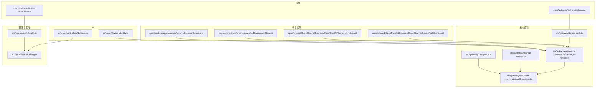
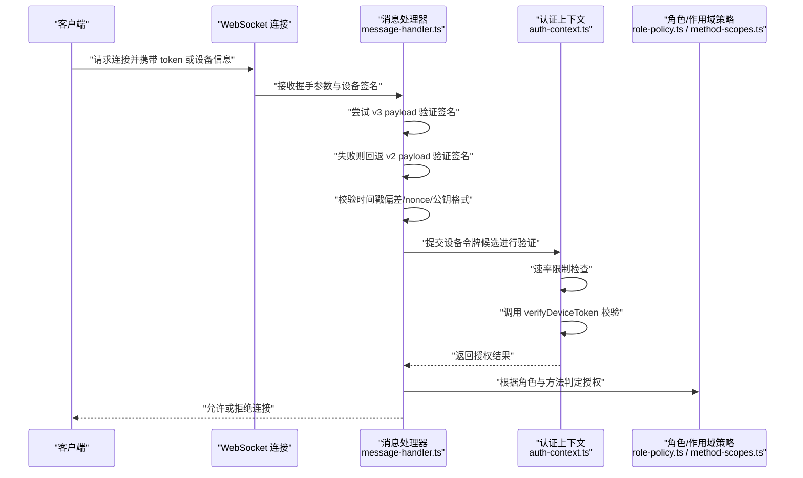
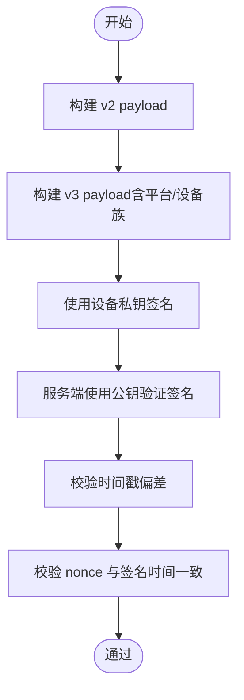
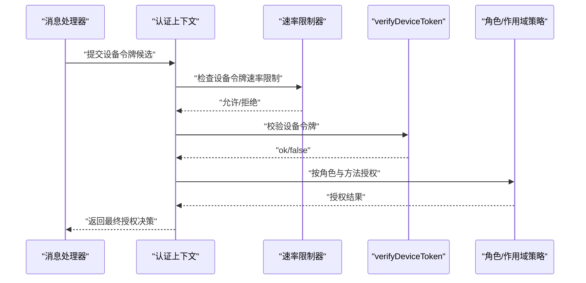
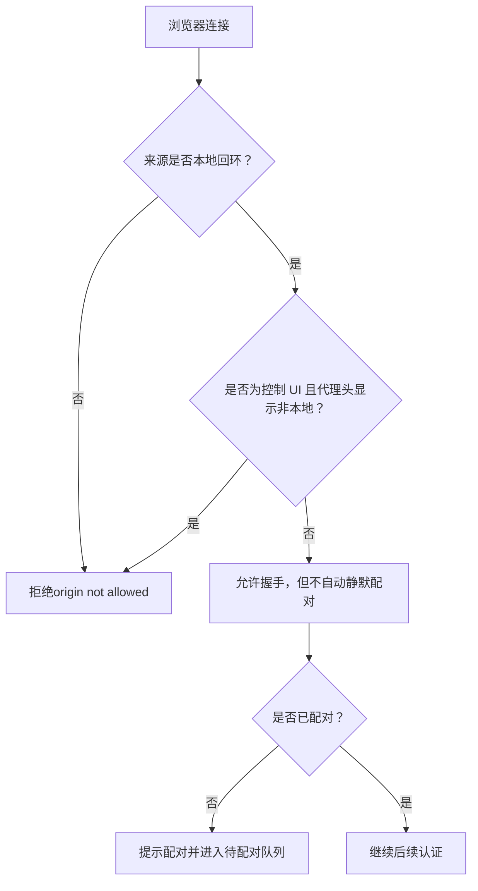
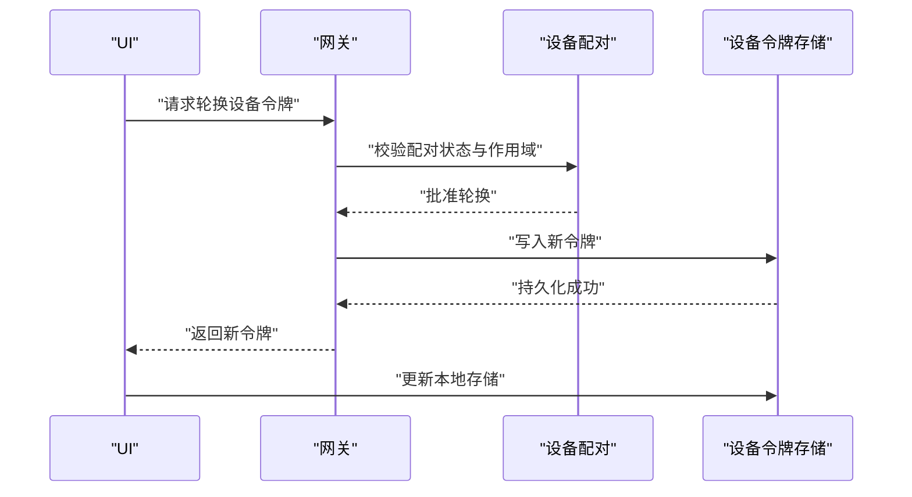
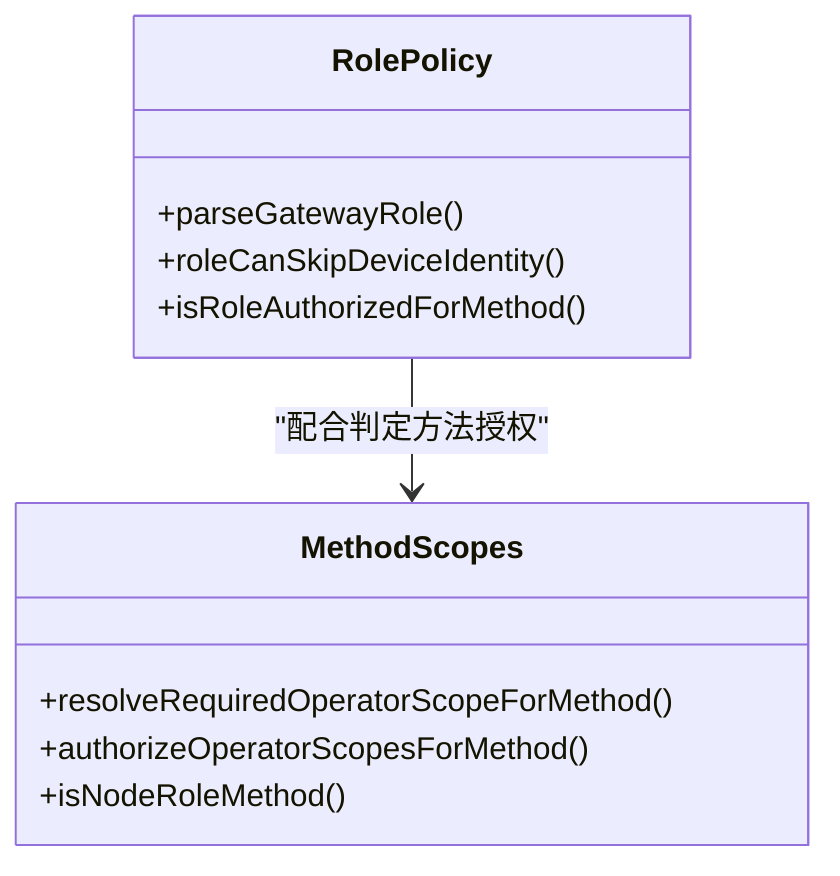
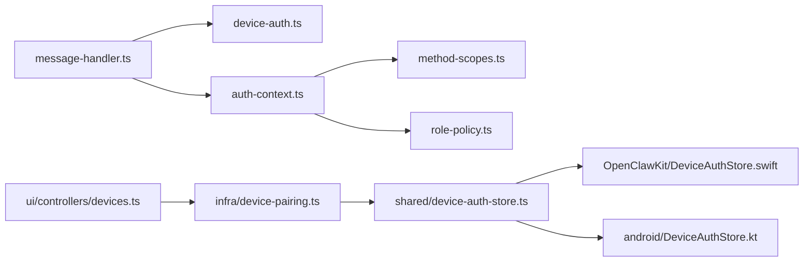

# 身份验证

<cite>
**本文引用的文件**
- [docs/gateway/authentication.md](file://docs/gateway/authentication.md)
- [docs/auth-credential-semantics.md](file://docs/auth-credential-semantics.md)
- [src/gateway/device-auth.ts](file://src/gateway/device-auth.ts)
- [src/gateway/server.ws-connection/message-handler.ts](file://src/gateway/server.ws-connection/message-handler.ts)
- [src/gateway/server.ws-connection/auth-context.ts](file://src/gateway/server.ws-connection/auth-context.ts)
- [src/gateway/method-scopes.ts](file://src/gateway/method-scopes.ts)
- [src/gateway/role-policy.ts](file://src/gateway/role-policy.ts)
- [src/gateway/server.auth.browser-hardening.test.ts](file://src/gateway/server.auth.browser-hardening.test.ts)
- [src/gateway/server.auth.control-ui.suite.ts](file://src/gateway/server.auth.control-ui.suite.ts)
- [src/gateway/server.node-invoke-approval-bypass.test.ts](file://src/gateway/server.node-invoke-approval-bypass.test.ts)
- [src/gateway/server.auth.control-ui.suite.ts](file://src/gateway/server.auth.control-ui.suite.ts)
- [src/shared/device-auth-store.ts](file://src/shared/device-auth-store.ts)
- [apps/shared/OpenClawKit/Sources/OpenClawKit/DeviceAuthStore.swift](file://apps/shared/OpenClawKit/Sources/OpenClawKit/DeviceAuthStore.swift)
- [apps/shared/OpenClawKit/Sources/OpenClawKit/DeviceIdentity.swift](file://apps/shared/OpenClawKit/Sources/OpenClawKit/DeviceIdentity.swift)
- [apps/android/app/src/main/java/ai/openclaw/android/gateway/DeviceAuthStore.kt](file://apps/android/app/src/main/java/ai/openclaw/android/gateway/DeviceAuthStore.kt)
- [apps/android/app/src/main/java/ai/openclaw/android/gateway/GatewaySession.kt](file://apps/android/app/src/main/java/ai/openclaw/android/gateway/GatewaySession.kt)
- [apps/android/app/src/test/java/ai/openclaw/android/gateway/DeviceAuthPayloadTest.kt](file://apps/android/app/src/test/java/ai/openclaw/android/gateway/DeviceAuthPayloadTest.kt)
- [ui/src/ui/device-identity.ts](file://ui/src/ui/device-identity.ts)
- [ui/src/ui/controllers/devices.ts](file://ui/src/ui/controllers/devices.ts)
- [src/agents/auth-health.ts](file://src/agents/auth-health.ts)
- [src/infra/device-identity.ts](file://src/infra/device-identity.ts)
- [src/infra/device-pairing.ts](file://src/infra/device-pairing.ts)
</cite>

## 目录
1. [简介](#简介)
2. [项目结构](#项目结构)
3. [核心组件](#核心组件)
4. [架构总览](#架构总览)
5. [详细组件分析](#详细组件分析)
6. [依赖关系分析](#依赖关系分析)
7. [性能考量](#性能考量)
8. [故障排除指南](#故障排除指南)
9. [结论](#结论)
10. [附录](#附录)

## 简介
本文件系统性梳理 OpenClaw 的身份验证机制，覆盖多类认证方式与设备身份验证流程，重点解释以下方面：
- 多种认证方式：共享令牌（共享密钥）、设备令牌、密码认证（如浏览器登录）、模型提供商凭据（API Key、OAuth、setup-token）。
- 设备身份验证：payload 构建、签名生成、存储管理、版本兼容与校验、配对与轮换。
- 认证状态管理：凭据有效性评估、过期与缺失处理、健康检查与告警。
- 权限与角色：operator 与 node 角色的差异、最小权限授权策略、方法级作用域控制。
- 实际流程图与示例：连接握手、设备签名验证、令牌轮换与撤销、失败场景与排查。

## 项目结构
围绕身份验证的关键目录与文件：
- 文档层：认证策略、凭据语义、网关认证说明
- 核心逻辑层：设备认证 payload 与签名、消息处理器、认证上下文、角色与作用域策略
- 平台实现层：跨平台设备凭据存储与签名、移动端与桌面端集成
- UI 层：设备身份生成与令牌轮换 UI 控制器
- 健康与配对：凭据健康检查、设备配对与令牌轮换

**图表来源**
- [docs/gateway/authentication.md](file://docs/gateway/authentication.md#L1-L180)
- [docs/auth-credential-semantics.md](file://docs/auth-credential-semantics.md#L1-L46)
- [src/gateway/device-auth.ts](file://src/gateway/device-auth.ts#L1-L55)
- [src/gateway/server.ws-connection/message-handler.ts](file://src/gateway/server.ws-connection/message-handler.ts#L165-L724)
- [src/gateway/server.ws-connection/auth-context.ts](file://src/gateway/server.ws-connection/auth-context.ts#L156-L218)
- [src/gateway/method-scopes.ts](file://src/gateway/method-scopes.ts#L1-L213)
- [src/gateway/role-policy.ts](file://src/gateway/role-policy.ts#L1-L24)
- [apps/shared/OpenClawKit/Sources/OpenClawKit/DeviceAuthStore.swift](file://apps/shared/OpenClawKit/Sources/OpenClawKit/DeviceAuthStore.swift#L1-L108)
- [apps/shared/OpenClawKit/Sources/OpenClawKit/DeviceIdentity.swift](file://apps/shared/OpenClawKit/Sources/OpenClawKit/DeviceIdentity.swift#L39-L65)
- [apps/android/app/src/main/java/ai/openclaw/android/gateway/DeviceAuthStore.kt](file://apps/android/app/src/main/java/ai/openclaw/android/gateway/DeviceAuthStore.kt#L1-L32)
- [apps/android/app/src/main/java/ai/openclaw/android/gateway/GatewaySession.kt](file://apps/android/app/src/main/java/ai/openclaw/android/gateway/GatewaySession.kt#L414-L441)
- [ui/src/ui/device-identity.ts](file://ui/src/ui/device-identity.ts#L95-L112)
- [ui/src/ui/controllers/devices.ts](file://ui/src/ui/controllers/devices.ts#L105-L159)
- [src/agents/auth-health.ts](file://src/agents/auth-health.ts#L98-L163)
- [src/infra/device-pairing.ts](file://src/infra/device-pairing.ts#L572-L612)

**章节来源**
- [docs/gateway/authentication.md](file://docs/gateway/authentication.md#L1-L180)
- [docs/auth-credential-semantics.md](file://docs/auth-credential-semantics.md#L1-L46)

## 核心组件
- 设备认证 payload 与签名
  - 负责构建 v2/v3 版本的设备认证字符串，并进行签名与校验。
  - 参考路径：[buildDeviceAuthPayload](file://src/gateway/device-auth.ts#L20-L34)、[buildDeviceAuthPayloadV3](file://src/gateway/device-auth.ts#L36-L54)
- 连接握手与设备签名验证
  - 在消息处理器中尝试使用 v3/v2 payload 验证签名，校验时间戳偏差、nonce、公钥格式等。
  - 参考路径：[resolveDeviceSignaturePayloadVersion](file://src/gateway/server.ws-connection/message-handler.ts#L165-L207)、[设备签名校验分支](file://src/gateway/server.ws-connection/message-handler.ts#L685-L724)
- 设备令牌认证决策
  - 在认证上下文中对设备令牌进行速率限制、校验与授权决策。
  - 参考路径：[resolveConnectAuthDecision](file://src/gateway/server.ws-connection/auth-context.ts#L156-L218)
- 角色与作用域策略
  - 定义 operator/node 角色、方法级作用域与授权判定。
  - 参考路径：[GATEWAY_ROLES 与授权函数](file://src/gateway/role-policy.ts#L1-L24)、[作用域与方法映射](file://src/gateway/method-scopes.ts#L1-L213)
- 凭据健康与状态
  - 对 token 类型凭据进行有效期评估、状态报告与健康检查。
  - 参考路径：[凭据健康评估](file://src/agents/auth-health.ts#L98-L163)、[凭据语义规则](file://docs/auth-credential-semantics.md#L20-L38)
- 设备凭据存储与轮换
  - 跨平台存储设备令牌；UI 提供轮换与撤销；服务端支持配对与轮换。
  - 参考路径：[TS 存储适配器](file://src/shared/device-auth-store.ts#L14-L79)、[Swift 存储](file://apps/shared/OpenClawKit/Sources/OpenClawKit/DeviceAuthStore.swift#L26-L65)、[Android 存储](file://apps/android/app/src/main/java/ai/openclaw/android/gateway/DeviceAuthStore.kt#L10-L31)、[UI 轮换/撤销](file://ui/src/ui/controllers/devices.ts#L105-L159)、[服务端轮换](file://src/infra/device-pairing.ts#L572-L612)

**章节来源**
- [src/gateway/device-auth.ts](file://src/gateway/device-auth.ts#L1-L55)
- [src/gateway/server.ws-connection/message-handler.ts](file://src/gateway/server.ws-connection/message-handler.ts#L165-L724)
- [src/gateway/server.ws-connection/auth-context.ts](file://src/gateway/server.ws-connection/auth-context.ts#L156-L218)
- [src/gateway/role-policy.ts](file://src/gateway/role-policy.ts#L1-L24)
- [src/gateway/method-scopes.ts](file://src/gateway/method-scopes.ts#L1-L213)
- [src/agents/auth-health.ts](file://src/agents/auth-health.ts#L98-L163)
- [docs/auth-credential-semantics.md](file://docs/auth-credential-semantics.md#L20-L38)
- [src/shared/device-auth-store.ts](file://src/shared/device-auth-store.ts#L14-L79)
- [apps/shared/OpenClawKit/Sources/OpenClawKit/DeviceAuthStore.swift](file://apps/shared/OpenClawKit/Sources/OpenClawKit/DeviceAuthStore.swift#L26-L65)
- [apps/android/app/src/main/java/ai/openclaw/android/gateway/DeviceAuthStore.kt](file://apps/android/app/src/main/java/ai/openclaw/android/gateway/DeviceAuthStore.kt#L10-L31)
- [ui/src/ui/controllers/devices.ts](file://ui/src/ui/controllers/devices.ts#L105-L159)
- [src/infra/device-pairing.ts](file://src/infra/device-pairing.ts#L572-L612)

## 架构总览
下图展示从客户端发起连接到服务端完成设备签名验证与授权的整体流程。

**图表来源**
- [src/gateway/server.ws-connection/message-handler.ts](file://src/gateway/server.ws-connection/message-handler.ts#L165-L724)
- [src/gateway/server.ws-connection/auth-context.ts](file://src/gateway/server.ws-connection/auth-context.ts#L156-L218)
- [src/gateway/role-policy.ts](file://src/gateway/role-policy.ts#L1-L24)
- [src/gateway/method-scopes.ts](file://src/gateway/method-scopes.ts#L174-L212)

## 详细组件分析

### 设备认证 payload 构建与签名
- payload 字段
  - 包含版本号、设备 ID、客户端 ID/模式、角色、作用域列表、签名时间戳、可选 token、随机 nonce，以及 v3 版本的平台与设备族信息。
  - 参考路径：[v2 构建](file://src/gateway/device-auth.ts#L20-L34)、[v3 构建](file://src/gateway/device-auth.ts#L36-L54)
- 签名与校验
  - 客户端使用设备私钥对 payload 进行签名；服务端使用设备公钥验证签名。
  - 参考路径：[签名生成（Web/移动端）](file://ui/src/ui/device-identity.ts#L107-L112)、[iOS 签名](file://apps/shared/OpenClawKit/Sources/OpenClawKit/DeviceIdentity.swift#L56-L65)、[Android 签名](file://apps/android/app/src/main/java/ai/openclaw/android/gateway/GatewaySession.kt#L428-L429)
- 兼容性与元数据归一化
  - v3 支持平台与设备族字段，且在构建时进行归一化处理，测试用例验证了字段规范化行为。
  - 参考路径：[元数据归一化](file://src/gateway/device-auth.ts#L39-L40)、[Android 归一化测试](file://apps/android/app/src/test/java/ai/openclaw/android/gateway/DeviceAuthPayloadTest.kt#L30-L35)

**图表来源**
- [src/gateway/device-auth.ts](file://src/gateway/device-auth.ts#L20-L54)
- [ui/src/ui/device-identity.ts](file://ui/src/ui/device-identity.ts#L107-L112)
- [apps/shared/OpenClawKit/Sources/OpenClawKit/DeviceIdentity.swift](file://apps/shared/OpenClawKit/Sources/OpenClawKit/DeviceIdentity.swift#L56-L65)
- [apps/android/app/src/main/java/ai/openclaw/android/gateway/GatewaySession.kt](file://apps/android/app/src/main/java/ai/openclaw/android/gateway/GatewaySession.kt#L428-L429)

**章节来源**
- [src/gateway/device-auth.ts](file://src/gateway/device-auth.ts#L1-L55)
- [ui/src/ui/device-identity.ts](file://ui/src/ui/device-identity.ts#L95-L112)
- [apps/shared/OpenClawKit/Sources/OpenClawKit/DeviceIdentity.swift](file://apps/shared/OpenClawKit/Sources/OpenClawKit/DeviceIdentity.swift#L39-L65)
- [apps/android/app/src/main/java/ai/openclaw/android/gateway/GatewaySession.kt](file://apps/android/app/src/main/java/ai/openclaw/android/gateway/GatewaySession.kt#L414-L441)
- [apps/android/app/src/test/java/ai/openclaw/android/gateway/DeviceAuthPayloadTest.kt](file://apps/android/app/src/test/java/ai/openclaw/android/gateway/DeviceAuthPayloadTest.kt#L1-L35)

### 设备令牌认证流程与授权
- 速率限制与失败记录
  - 对设备令牌认证进行独立速率限制，失败会记录并可能触发锁定。
  - 参考路径：[速率限制与记录](file://src/gateway/server.ws-connection/auth-context.ts#L180-L215)
- 设备令牌校验
  - 若显式提供设备令牌，服务端调用 verifyDeviceToken 进行校验；成功则标记为 device-token 方式。
  - 参考路径：[设备令牌决策](file://src/gateway/server.ws-connection/auth-context.ts#L194-L215)
- 方法级授权
  - 根据方法解析所需作用域，结合角色与管理员特权进行授权判定。
  - 参考路径：[作用域解析与授权](file://src/gateway/method-scopes.ts#L174-L205)、[角色授权](file://src/gateway/role-policy.ts#L18-L23)

**图表来源**
- [src/gateway/server.ws-connection/auth-context.ts](file://src/gateway/server.ws-connection/auth-context.ts#L156-L218)
- [src/gateway/method-scopes.ts](file://src/gateway/method-scopes.ts#L174-L205)
- [src/gateway/role-policy.ts](file://src/gateway/role-policy.ts#L18-L23)

**章节来源**
- [src/gateway/server.ws-connection/auth-context.ts](file://src/gateway/server.ws-connection/auth-context.ts#L156-L218)
- [src/gateway/method-scopes.ts](file://src/gateway/method-scopes.ts#L174-L205)
- [src/gateway/role-policy.ts](file://src/gateway/role-policy.ts#L18-L23)

### 浏览器安全加固与配对要求
- 浏览器来源限制
  - 非控制 UI 客户端若来源非本地回环，将被拒绝；控制 UI 在特定代理头情况下也会拒绝伪造回环来源。
  - 参考路径：[浏览器来源测试](file://src/gateway/server.auth.browser-hardening.test.ts#L76-L178)
- 自动配对与静默配对
  - 非控制 UI 浏览器客户端无法自动静默配对，需要人工确认；远程 operator 设备在未配对时需先配对。
  - 参考路径：[自动配对测试](file://src/gateway/server.auth.control-ui.suite.ts#L493-L522)、[静默配对测试](file://src/gateway/server.auth.browser-hardening.test.ts#L120-L154)

**图表来源**
- [src/gateway/server.auth.browser-hardening.test.ts](file://src/gateway/server.auth.browser-hardening.test.ts#L76-L178)
- [src/gateway/server.auth.control-ui.suite.ts](file://src/gateway/server.auth.control-ui.suite.ts#L493-L522)

**章节来源**
- [src/gateway/server.auth.browser-hardening.test.ts](file://src/gateway/server.auth.browser-hardening.test.ts#L76-L178)
- [src/gateway/server.auth.control-ui.suite.ts](file://src/gateway/server.auth.control-ui.suite.ts#L493-L522)

### 凭据健康与令牌轮换
- 凭据健康检查
  - 对 token 类型凭据评估有效期、缺失与非法状态，输出稳定原因码。
  - 参考路径：[健康检查逻辑](file://src/agents/auth-health.ts#L98-L163)、[凭据语义规则](file://docs/auth-credential-semantics.md#L24-L38)
- 令牌轮换与撤销
  - UI 提供轮换与撤销操作；服务端在配对状态下执行轮换并持久化新令牌。
  - 参考路径：[UI 轮换/撤销](file://ui/src/ui/controllers/devices.ts#L105-L159)、[服务端轮换](file://src/infra/device-pairing.ts#L572-L612)

**图表来源**
- [ui/src/ui/controllers/devices.ts](file://ui/src/ui/controllers/devices.ts#L105-L159)
- [src/infra/device-pairing.ts](file://src/infra/device-pairing.ts#L572-L612)
- [src/shared/device-auth-store.ts](file://src/shared/device-auth-store.ts#L31-L79)
- [apps/shared/OpenClawKit/Sources/OpenClawKit/DeviceAuthStore.swift](file://apps/shared/OpenClawKit/Sources/OpenClawKit/DeviceAuthStore.swift#L32-L65)
- [apps/android/app/src/main/java/ai/openclaw/android/gateway/DeviceAuthStore.kt](file://apps/android/app/src/main/java/ai/openclaw/android/gateway/DeviceAuthStore.kt#L10-L31)

**章节来源**
- [src/agents/auth-health.ts](file://src/agents/auth-health.ts#L98-L163)
- [docs/auth-credential-semantics.md](file://docs/auth-credential-semantics.md#L20-L38)
- [ui/src/ui/controllers/devices.ts](file://ui/src/ui/controllers/devices.ts#L105-L159)
- [src/infra/device-pairing.ts](file://src/infra/device-pairing.ts#L572-L612)
- [src/shared/device-auth-store.ts](file://src/shared/device-auth-store.ts#L31-L79)
- [apps/shared/OpenClawKit/Sources/OpenClawKit/DeviceAuthStore.swift](file://apps/shared/OpenClawKit/Sources/OpenClawKit/DeviceAuthStore.swift#L32-L65)
- [apps/android/app/src/main/java/ai/openclaw/android/gateway/DeviceAuthStore.kt](file://apps/android/app/src/main/java/ai/openclaw/android/gateway/DeviceAuthStore.kt#L10-L31)

### 不同角色（operator/node）的认证差异
- 角色与方法授权
  - operator 可访问管理与读写类方法；node 仅能访问节点专用方法。
  - 参考路径：[角色授权](file://src/gateway/role-policy.ts#L18-L23)、[节点方法集合](file://src/gateway/method-scopes.ts#L22-L27)
- 共享令牌与设备身份跳过规则
  - 当使用共享令牌时，operator 可跳过设备身份要求；node 通常需要设备身份。
  - 参考路径：[跳过规则](file://src/gateway/role-policy.ts#L14-L16)

**图表来源**
- [src/gateway/role-policy.ts](file://src/gateway/role-policy.ts#L1-L24)
- [src/gateway/method-scopes.ts](file://src/gateway/method-scopes.ts#L174-L212)

**章节来源**
- [src/gateway/role-policy.ts](file://src/gateway/role-policy.ts#L1-L24)
- [src/gateway/method-scopes.ts](file://src/gateway/method-scopes.ts#L22-L27)

## 依赖关系分析
- 组件耦合
  - 消息处理器依赖设备认证模块与角色/作用域策略；认证上下文依赖速率限制与令牌校验接口；UI 与服务端通过配对与存储协同。
- 外部依赖
  - 平台侧依赖加密库（Ed25519 签名）、安全存储（iOS/Android/浏览器本地存储），以及网关服务端的配对与存储模块。

**图表来源**
- [src/gateway/server.ws-connection/message-handler.ts](file://src/gateway/server.ws-connection/message-handler.ts#L165-L724)
- [src/gateway/device-auth.ts](file://src/gateway/device-auth.ts#L1-L55)
- [src/gateway/server.ws-connection/auth-context.ts](file://src/gateway/server.ws-connection/auth-context.ts#L156-L218)
- [src/gateway/method-scopes.ts](file://src/gateway/method-scopes.ts#L1-L213)
- [src/gateway/role-policy.ts](file://src/gateway/role-policy.ts#L1-L24)
- [ui/src/ui/controllers/devices.ts](file://ui/src/ui/controllers/devices.ts#L105-L159)
- [src/infra/device-pairing.ts](file://src/infra/device-pairing.ts#L572-L612)
- [src/shared/device-auth-store.ts](file://src/shared/device-auth-store.ts#L1-L80)
- [apps/shared/OpenClawKit/Sources/OpenClawKit/DeviceAuthStore.swift](file://apps/shared/OpenClawKit/Sources/OpenClawKit/DeviceAuthStore.swift#L1-L108)
- [apps/android/app/src/main/java/ai/openclaw/android/gateway/DeviceAuthStore.kt](file://apps/android/app/src/main/java/ai/openclaw/android/gateway/DeviceAuthStore.kt#L1-L32)

**章节来源**
- [src/gateway/server.ws-connection/message-handler.ts](file://src/gateway/server.ws-connection/message-handler.ts#L165-L724)
- [src/gateway/server.ws-connection/auth-context.ts](file://src/gateway/server.ws-connection/auth-context.ts#L156-L218)
- [src/gateway/method-scopes.ts](file://src/gateway/method-scopes.ts#L1-L213)
- [src/gateway/role-policy.ts](file://src/gateway/role-policy.ts#L1-L24)
- [ui/src/ui/controllers/devices.ts](file://ui/src/ui/controllers/devices.ts#L105-L159)
- [src/infra/device-pairing.ts](file://src/infra/device-pairing.ts#L572-L612)
- [src/shared/device-auth-store.ts](file://src/shared/device-auth-store.ts#L1-L80)
- [apps/shared/OpenClawKit/Sources/OpenClawKit/DeviceAuthStore.swift](file://apps/shared/OpenClawKit/Sources/OpenClawKit/DeviceAuthStore.swift#L1-L108)
- [apps/android/app/src/main/java/ai/openclaw/android/gateway/DeviceAuthStore.kt](file://apps/android/app/src/main/java/ai/openclaw/android/gateway/DeviceAuthStore.kt#L1-L32)

## 性能考量
- 速率限制
  - 设备令牌认证独立速率限制，避免暴力破解；共享令牌与设备令牌的锁屏相互隔离。
  - 参考路径：[速率限制与隔离](file://src/gateway/server.auth.control-ui.suite.ts#L459-L491)
- 签名与校验
  - 使用 Ed25519 快速签名与验证；payload 构建与归一化开销较小。
- 存储与缓存
  - 令牌存储采用原子写入与权限保护；移动端与桌面端分别使用安全存储与本地存储。

[本节为通用指导，无需列出具体文件来源]

## 故障排除指南
- 常见失败原因
  - 设备签名无效：payload 版本不匹配、公钥格式错误、时间戳偏差过大、nonce 缺失或不一致。
    - 参考路径：[签名验证与校验](file://src/gateway/server.ws-connection/message-handler.ts#L685-L724)
  - 设备令牌不匹配或过期：速率限制触发、令牌轮换后未更新、有效期评估为过期。
    - 参考路径：[设备令牌决策](file://src/gateway/server.ws-connection/auth-context.ts#L194-L215)、[健康检查](file://src/agents/auth-health.ts#L98-L163)
  - 浏览器来源限制：非本地回环或伪造回环来源被拒绝。
    - 参考路径：[浏览器来源测试](file://src/gateway/server.auth.browser-hardening.test.ts#L76-L178)
  - 未配对设备：远程 operator 设备在未配对时需先配对。
    - 参考路径：[配对要求测试](file://src/gateway/server.auth.control-ui.suite.ts#L493-L522)
- 排查步骤
  - 确认设备 payload 构建与签名正确；核对 nonce 与 signedAt 一致性。
  - 检查凭据有效期与存储完整性；必要时进行轮换或撤销。
  - 验证浏览器来源与代理头配置；确保控制 UI 的来源合法性。
  - 如涉及共享令牌与设备令牌混用，确认速率限制互不影响。

**章节来源**
- [src/gateway/server.ws-connection/message-handler.ts](file://src/gateway/server.ws-connection/message-handler.ts#L685-L724)
- [src/gateway/server.ws-connection/auth-context.ts](file://src/gateway/server.ws-connection/auth-context.ts#L194-L215)
- [src/agents/auth-health.ts](file://src/agents/auth-health.ts#L98-L163)
- [src/gateway/server.auth.browser-hardening.test.ts](file://src/gateway/server.auth.browser-hardening.test.ts#L76-L178)
- [src/gateway/server.auth.control-ui.suite.ts](file://src/gateway/server.auth.control-ui.suite.ts#L493-L522)

## 结论
OpenClaw 的身份验证体系以“设备身份+令牌”为核心，辅以共享令牌与模型提供商凭据，形成多层防护与灵活的授权模型。通过 v2/v3 payload 兼容、严格的签名验证、速率限制与配对机制，系统在安全性与可用性之间取得平衡。建议在生产环境中：
- 优先使用共享令牌进行长期运行场景；
- 为 operator 设备启用配对与令牌轮换；
- 严格管理浏览器来源与代理头，防止跨站攻击；
- 定期检查凭据健康状态，及时轮换过期或高风险令牌。

[本节为总结性内容，无需列出具体文件来源]

## 附录
- 模型提供商认证（API Key、OAuth、setup-token）
  - 参考路径：[网关认证文档](file://docs/gateway/authentication.md#L11-L180)、[凭据语义](file://docs/auth-credential-semantics.md#L1-L46)
- 设备身份生成与存储
  - 参考路径：[设备身份生成](file://src/infra/device-identity.ts#L57-L63)、[UI 生成](file://ui/src/ui/device-identity.ts#L95-L112)、[iOS 存储](file://apps/shared/OpenClawKit/Sources/OpenClawKit/DeviceIdentity.swift#L42-L54)

**章节来源**
- [docs/gateway/authentication.md](file://docs/gateway/authentication.md#L11-L180)
- [docs/auth-credential-semantics.md](file://docs/auth-credential-semantics.md#L1-L46)
- [src/infra/device-identity.ts](file://src/infra/device-identity.ts#L57-L63)
- [ui/src/ui/device-identity.ts](file://ui/src/ui/device-identity.ts#L95-L112)
- [apps/shared/OpenClawKit/Sources/OpenClawKit/DeviceIdentity.swift](file://apps/shared/OpenClawKit/Sources/OpenClawKit/DeviceIdentity.swift#L42-L54)