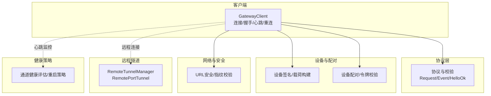
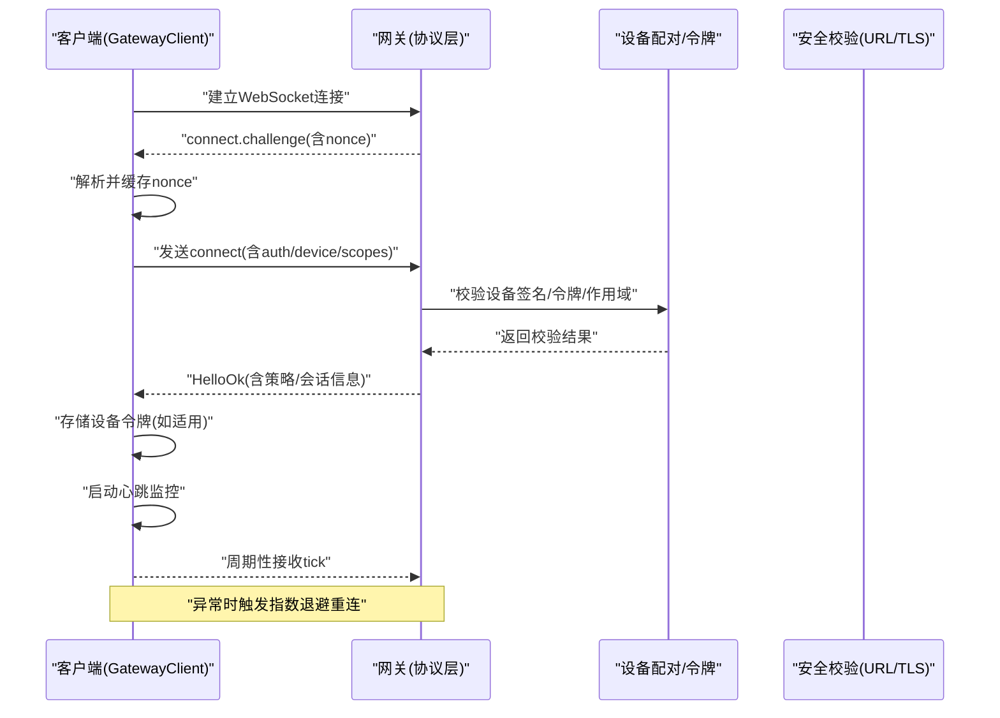
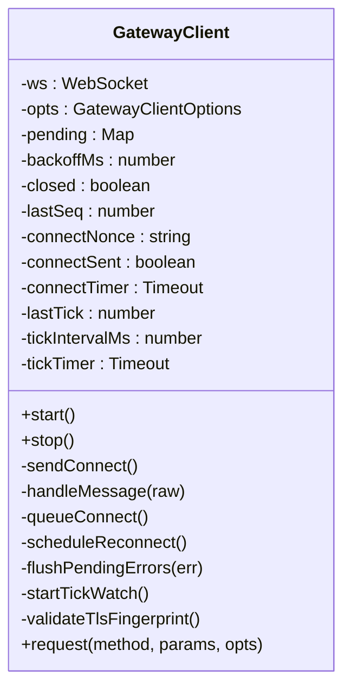
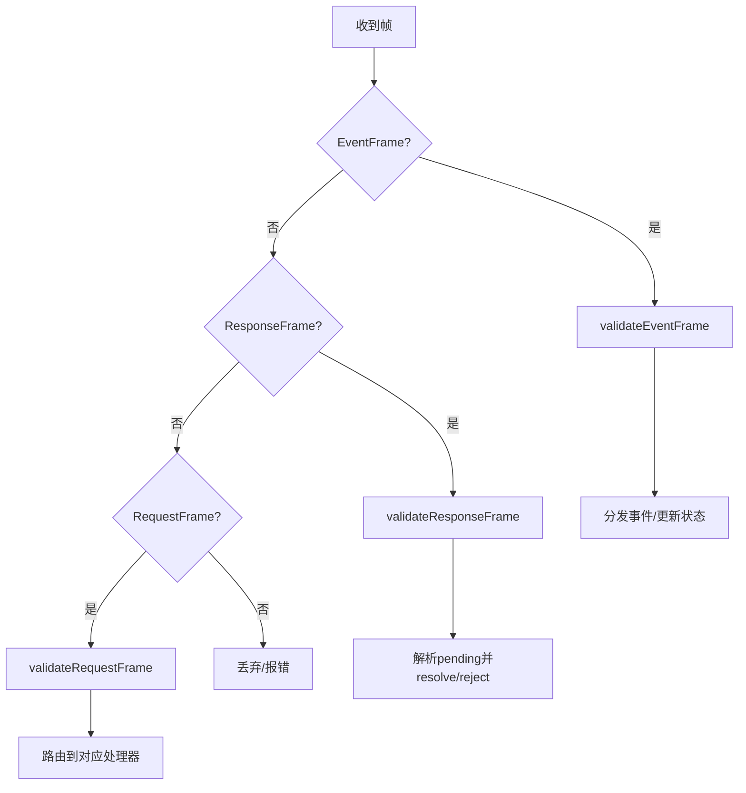
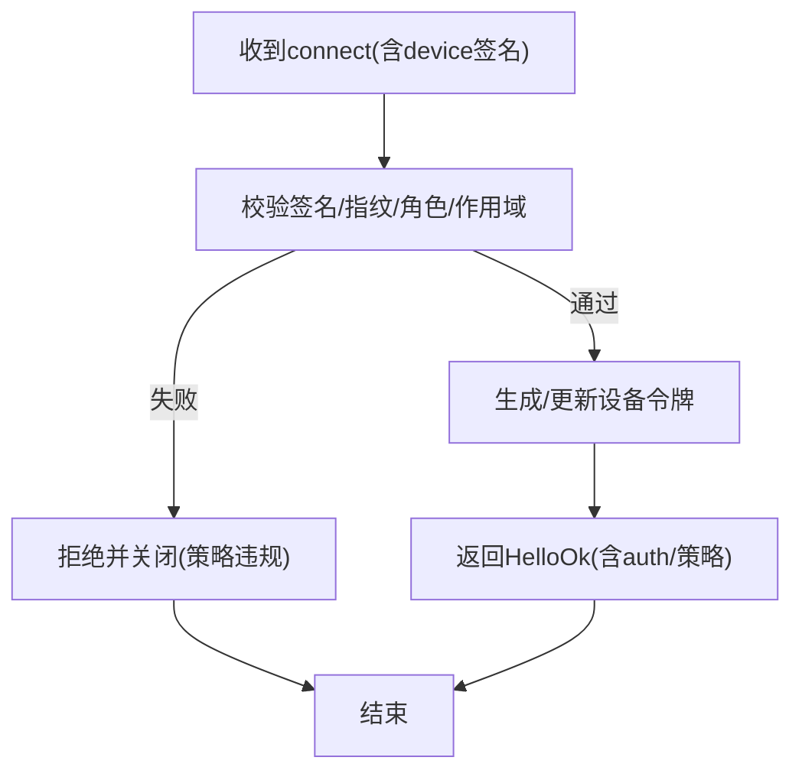
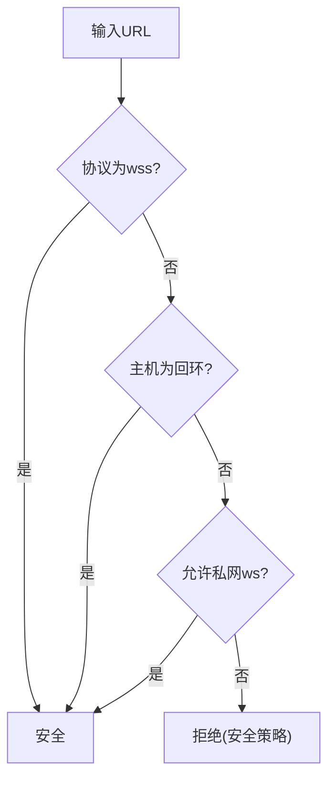
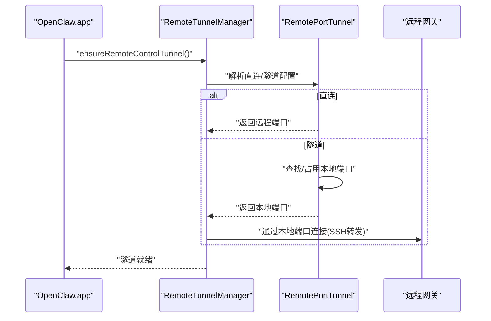
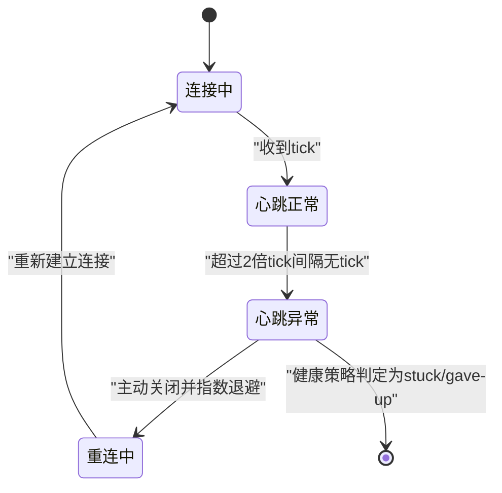
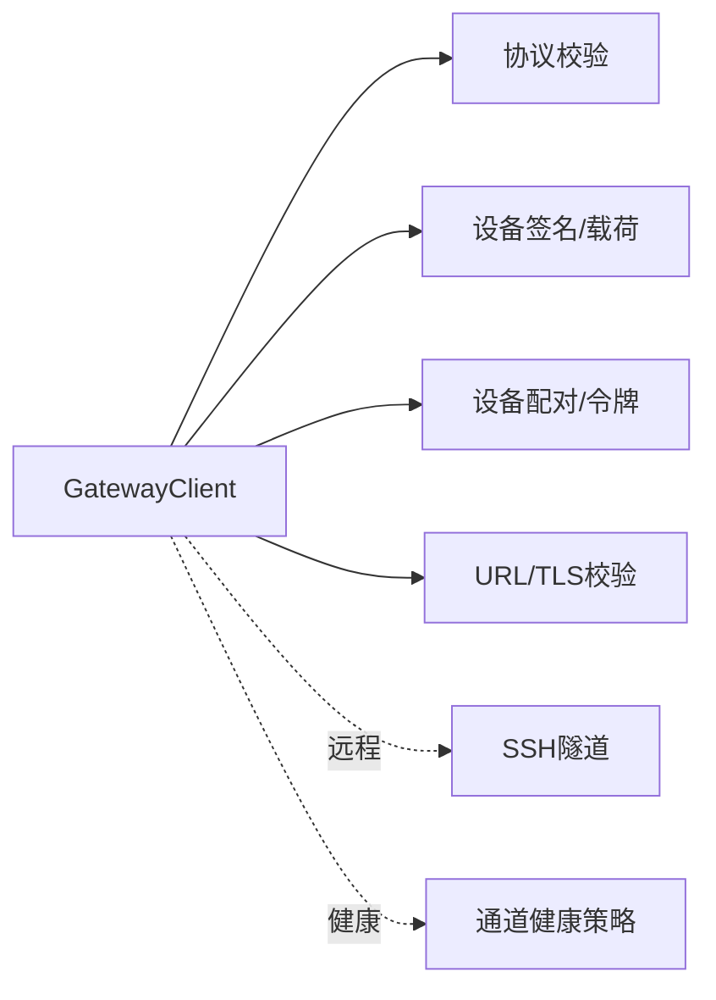

# 连接生命周期

<cite>
**本文引用的文件**
- [src/gateway/client.ts](file://src/gateway/client.ts)
- [src/gateway/protocol/index.ts](file://src/gateway/protocol/index.ts)
- [src/gateway/device-auth.ts](file://src/gateway/device-auth.ts)
- [src/infra/device-pairing.ts](file://src/infra/device-pairing.ts)
- [src/gateway/net.ts](file://src/gateway/net.ts)
- [apps/macos/Sources/OpenClawMacCLI/GatewayScopes.swift](file://apps/macos/Sources/OpenClawMacCLI/GatewayScopes.swift)
- [src/gateway/method-scopes.ts](file://src/gateway/method-scopes.ts)
- [docs/gateway/remote-gateway-readme.md](file://docs/gateway/remote-gateway-readme.md)
- [src/gateway/channel-health-policy.ts](file://src/gateway/channel-health-policy.ts)
- [apps/macos/Sources/OpenClaw/RemoteTunnelManager.swift](file://apps/macos/Sources/OpenClaw/RemoteTunnelManager.swift)
- [apps/macos/Sources/OpenClaw/RemotePortTunnel.swift](file://apps/macos/Sources/OpenClaw/RemotePortTunnel.swift)
- [apps/macos/Sources/OpenClaw/RemoteTunnelManager.swift](file://apps/macos/Sources/OpenClaw/RemoteTunnelManager.swift)
- [apps/shared/OpenClawKit/Tests/OpenClawKitTests/GatewayNodeSessionTests.swift](file://apps/shared/OpenClawKit/Tests/OpenClawKitTests/GatewayNodeSessionTests.swift)
</cite>

## 目录
1. [简介](#简介)
2. [项目结构](#项目结构)
3. [核心组件](#核心组件)
4. [架构总览](#架构总览)
5. [详细组件分析](#详细组件分析)
6. [依赖关系分析](#依赖关系分析)
7. [性能考量](#性能考量)
8. [故障排除指南](#故障排除指南)
9. [结论](#结论)
10. [附录](#附录)

## 简介
本文件系统性梳理 OpenClaw 的 WebSocket 连接生命周期，覆盖从握手、身份验证、设备配对、会话建立、状态管理、心跳检测与异常恢复，到远程连接隧道与安全策略。文档同时区分 operator 与 node 两类角色在连接上的差异与特殊要求，并给出序列图与状态转换图帮助理解端到端流程。

## 项目结构
围绕连接生命周期的关键代码分布在以下模块：
- 客户端：负责建立与维护 WebSocket 连接、处理握手与认证、心跳与重连、事件与请求响应。
- 协议层：定义帧格式、校验器与方法/事件契约。
- 设备与配对：设备身份、签名、令牌生成与校验、配对状态管理。
- 网络与安全：URL 安全性检查、TLS 指纹校验、本地/私网策略。
- 远程隧道：macOS 应用侧的 SSH 隧道管理与端口转发。
- 健康策略：通道健康度评估与重启决策。

图表来源
- [src/gateway/client.ts](file://src/gateway/client.ts#L86-L528)
- [src/gateway/protocol/index.ts](file://src/gateway/protocol/index.ts#L249-L438)
- [src/gateway/device-auth.ts](file://src/gateway/device-auth.ts#L20-L55)
- [src/infra/device-pairing.ts](file://src/infra/device-pairing.ts#L470-L508)
- [src/gateway/net.ts](file://src/gateway/net.ts#L411-L451)
- [apps/macos/Sources/OpenClaw/RemoteTunnelManager.swift](file://apps/macos/Sources/OpenClaw/RemoteTunnelManager.swift#L1-L12)
- [apps/macos/Sources/OpenClaw/RemotePortTunnel.swift](file://apps/macos/Sources/OpenClaw/RemotePortTunnel.swift#L135-L175)
- [src/gateway/channel-health-policy.ts](file://src/gateway/channel-health-policy.ts#L74-L125)

章节来源
- [src/gateway/client.ts](file://src/gateway/client.ts#L1-L528)
- [src/gateway/protocol/index.ts](file://src/gateway/protocol/index.ts#L1-L644)
- [src/gateway/device-auth.ts](file://src/gateway/device-auth.ts#L1-L55)
- [src/infra/device-pairing.ts](file://src/infra/device-pairing.ts#L1-L654)
- [src/gateway/net.ts](file://src/gateway/net.ts#L1-L451)
- [apps/macos/Sources/OpenClaw/RemoteTunnelManager.swift](file://apps/macos/Sources/OpenClaw/RemoteTunnelManager.swift#L1-L12)
- [apps/macos/Sources/OpenClaw/RemotePortTunnel.swift](file://apps/macos/Sources/OpenClaw/RemotePortTunnel.swift#L135-L175)
- [src/gateway/channel-health-policy.ts](file://src/gateway/channel-health-policy.ts#L74-L125)

## 核心组件
- GatewayClient：封装 WebSocket 连接、握手挑战、认证参数组装、设备签名、心跳监控、错误处理与指数退避重连。
- 协议与校验：统一的帧类型与 AJV 校验器，确保消息结构正确。
- 设备与配对：设备身份与签名、设备令牌生成与校验、配对状态持久化与作用域扩展。
- 网络与安全：URL 安全性判断、TLS 指纹校验、私网/回环策略。
- 远程隧道：macOS 应用侧 SSH 隧道管理与端口转发，支持直连与隧道两种模式。
- 健康策略：通道健康度评估、重启原因判定与节流控制。

章节来源
- [src/gateway/client.ts](file://src/gateway/client.ts#L86-L528)
- [src/gateway/protocol/index.ts](file://src/gateway/protocol/index.ts#L249-L438)
- [src/infra/device-pairing.ts](file://src/infra/device-pairing.ts#L470-L508)
- [src/gateway/net.ts](file://src/gateway/net.ts#L411-L451)
- [apps/macos/Sources/OpenClaw/RemoteTunnelManager.swift](file://apps/macos/Sources/OpenClaw/RemoteTunnelManager.swift#L1-L12)
- [apps/macos/Sources/OpenClaw/RemotePortTunnel.swift](file://apps/macos/Sources/OpenClaw/RemotePortTunnel.swift#L135-L175)
- [src/gateway/channel-health-policy.ts](file://src/gateway/channel-health-policy.ts#L74-L125)

## 架构总览
下图展示从客户端发起连接到握手完成、认证通过、心跳维持、异常恢复的整体流程。

图表来源
- [src/gateway/client.ts](file://src/gateway/client.ts#L173-L355)
- [src/gateway/protocol/index.ts](file://src/gateway/protocol/index.ts#L249-L438)
- [src/infra/device-pairing.ts](file://src/infra/device-pairing.ts#L470-L508)
- [src/gateway/net.ts](file://src/gateway/net.ts#L411-L451)

## 详细组件分析

### 组件A：GatewayClient（连接生命周期）
- 职责
  - 建立/关闭 WebSocket 连接，处理 open/message/close/error 事件。
  - 握手阶段：等待 connect.challenge，提取 nonce 并发送 connect。
  - 认证阶段：根据配置选择共享令牌或设备令牌；若启用设备身份，附加签名与公钥。
  - 会话建立：收到 HelloOk 后初始化心跳间隔、记录最后心跳时间、回调通知。
  - 心跳监控：定期检查 lastTick 与 tickIntervalMs，超时则主动关闭。
  - 异常恢复：flushPending 错误、指数退避重连、清理定时器。
  - TLS 校验：可选指纹校验，严格限制非 wss:// 的不安全 URL。
- 关键行为
  - connectDelayMs 控制握手挑战超时；tickWatchMinIntervalMs 保护极端卡顿。
  - 支持设备令牌持久化与自动清除（当 close 原因为 device token mismatch 且未显式共享令牌时）。
  - 支持路径环境、权限、命令集、能力集等扩展字段。
- 角色差异
  - operator 默认 scopes 由 CLI/平台默认值决定；node 使用专用 role 与方法集合。
- 远程连接
  - 通过本地端口转发（SSH 隧道）连接远端网关；macOS 应用侧负责隧道生命周期管理。

图表来源
- [src/gateway/client.ts](file://src/gateway/client.ts#L86-L528)

章节来源
- [src/gateway/client.ts](file://src/gateway/client.ts#L86-L528)
- [apps/macos/Sources/OpenClawMacCLI/GatewayScopes.swift](file://apps/macos/Sources/OpenClawMacCLI/GatewayScopes.swift#L1-L7)
- [src/gateway/method-scopes.ts](file://src/gateway/method-scopes.ts#L1-L27)

### 组件B：协议与校验（帧/方法/事件）
- 责任
  - 定义 RequestFrame/EventFrame/HelloOk 等帧类型与 Schema。
  - 提供 AJV 校验器，保证消息结构与字段合法。
  - 暴露方法/事件的参数与结果 Schema，用于服务端/客户端一致性。
- 影响
  - GatewayClient 在发送/接收时使用 validateXxx 校验，避免非法帧导致崩溃。
  - 服务端据此进行路由与处理。

图表来源
- [src/gateway/protocol/index.ts](file://src/gateway/protocol/index.ts#L249-L438)

章节来源
- [src/gateway/protocol/index.ts](file://src/gateway/protocol/index.ts#L249-L438)

### 组件C：设备与配对（签名/令牌/作用域）
- 设备签名与载荷
  - 构建 v3 设备认证载荷，包含 deviceId、clientId、clientMode、role、scopes、signedAtMs、token、nonce、platform、deviceFamily。
  - 使用设备私钥对载荷进行签名，随 connect 请求发送。
- 令牌管理
  - 生成/轮换/吊销设备令牌；校验令牌与作用域；记录最近使用时间。
  - 支持按角色聚合作用域与隐含作用域（如 admin 包含 read/write/approvals/pairing）。
- 配对状态
  - 待审批与已配对设备列表；过期清理；并发锁保护状态文件。

图表来源
- [src/gateway/device-auth.ts](file://src/gateway/device-auth.ts#L20-L55)
- [src/infra/device-pairing.ts](file://src/infra/device-pairing.ts#L470-L508)
- [src/infra/device-pairing.ts](file://src/infra/device-pairing.ts#L195-L220)

章节来源
- [src/gateway/device-auth.ts](file://src/gateway/device-auth.ts#L1-L55)
- [src/infra/device-pairing.ts](file://src/infra/device-pairing.ts#L195-L220)
- [src/infra/device-pairing.ts](file://src/infra/device-pairing.ts#L470-L508)

### 组件D：网络与安全（URL/TLS/私网策略）
- URL 安全性
  - 仅允许 wss:// 或回环地址的 ws://；可通过环境变量开启受信私网 ws://。
  - 对于非回环 ws:// 明确提示安全风险与修复建议。
- TLS 指纹校验
  - 可选指纹校验，防止中间人攻击；校验失败立即关闭连接。
- 私网/回环策略
  - 严格限制敏感数据明文传输；推荐通过 SSH 隧道或 Tailscale Serve/Funnel。

图表来源
- [src/gateway/net.ts](file://src/gateway/net.ts#L411-L451)

章节来源
- [src/gateway/net.ts](file://src/gateway/net.ts#L411-L451)

### 组件E：远程连接与隧道（macOS）
- 隧道管理
  - RemoteTunnelManager 管理 SSH 隧道生命周期，具备重启退避与状态跟踪。
  - RemotePortTunnel 解析远程端口覆盖、首选本地端口、随机端口回退与可用性检查。
- 运行模式
  - 支持直连与隧道两种模式；直连时跳过隧道，直接使用远程 URL。
- 故障恢复
  - 隧道崩溃自动重启；Launch Agent 自动加载与保持运行。

图表来源
- [apps/macos/Sources/OpenClaw/RemoteTunnelManager.swift](file://apps/macos/Sources/OpenClaw/RemoteTunnelManager.swift#L1-L12)
- [apps/macos/Sources/OpenClaw/RemotePortTunnel.swift](file://apps/macos/Sources/OpenClaw/RemotePortTunnel.swift#L135-L175)
- [docs/gateway/remote-gateway-readme.md](file://docs/gateway/remote-gateway-readme.md#L1-L159)

章节来源
- [apps/macos/Sources/OpenClaw/RemoteTunnelManager.swift](file://apps/macos/Sources/OpenClaw/RemoteTunnelManager.swift#L1-L12)
- [apps/macos/Sources/OpenClaw/RemotePortTunnel.swift](file://apps/macos/Sources/OpenClaw/RemotePortTunnel.swift#L135-L175)
- [docs/gateway/remote-gateway-readme.md](file://docs/gateway/remote-gateway-readme.md#L1-L159)

### 组件F：心跳检测与异常恢复
- 心跳监控
  - GatewayClient 在收到 event.tick 时更新 lastTick；按 tickIntervalMs*2 超时则主动关闭，避免静默卡死。
- 健康策略
  - 通道健康评估综合启动期宽限、最后事件时间、忙碌状态与重启尝试次数，决定是否重启或放弃。
- 会话恢复
  - 测试用例显示断连后会重建监听任务并广播 seqGap 事件，确保会话连续性。

图表来源
- [src/gateway/client.ts](file://src/gateway/client.ts#L450-L472)
- [src/gateway/channel-health-policy.ts](file://src/gateway/channel-health-policy.ts#L74-L125)
- [apps/shared/OpenClawKit/Tests/OpenClawKitTests/GatewayNodeSessionTests.swift](file://apps/shared/OpenClawKit/Tests/OpenClawKitTests/GatewayNodeSessionTests.swift#L260-L273)

章节来源
- [src/gateway/client.ts](file://src/gateway/client.ts#L450-L472)
- [src/gateway/channel-health-policy.ts](file://src/gateway/channel-health-policy.ts#L74-L125)
- [apps/shared/OpenClawKit/Tests/OpenClawKitTests/GatewayNodeSessionTests.swift](file://apps/shared/OpenClawKit/Tests/OpenClawKitTests/GatewayNodeSessionTests.swift#L260-L273)

## 依赖关系分析
- 客户端依赖协议层进行帧校验与方法路由；依赖设备与配对模块进行签名与令牌校验；依赖网络模块进行 URL 安全性与 TLS 校验。
- 远程隧道模块独立于核心连接逻辑，但为 macOS 客户端提供“本地端口直连远程网关”的能力。
- 健康策略模块与客户端心跳监控协同，保障长连接稳定性。

图表来源
- [src/gateway/client.ts](file://src/gateway/client.ts#L86-L528)
- [src/gateway/protocol/index.ts](file://src/gateway/protocol/index.ts#L249-L438)
- [src/gateway/device-auth.ts](file://src/gateway/device-auth.ts#L20-L55)
- [src/infra/device-pairing.ts](file://src/infra/device-pairing.ts#L470-L508)
- [src/gateway/net.ts](file://src/gateway/net.ts#L411-L451)
- [apps/macos/Sources/OpenClaw/RemoteTunnelManager.swift](file://apps/macos/Sources/OpenClaw/RemoteTunnelManager.swift#L1-L12)
- [src/gateway/channel-health-policy.ts](file://src/gateway/channel-health-policy.ts#L74-L125)

章节来源
- [src/gateway/client.ts](file://src/gateway/client.ts#L86-L528)
- [src/gateway/protocol/index.ts](file://src/gateway/protocol/index.ts#L249-L438)
- [src/infra/device-pairing.ts](file://src/infra/device-pairing.ts#L470-L508)
- [src/gateway/net.ts](file://src/gateway/net.ts#L411-L451)
- [apps/macos/Sources/OpenClaw/RemoteTunnelManager.swift](file://apps/macos/Sources/OpenClaw/RemoteTunnelManager.swift#L1-L12)
- [src/gateway/channel-health-policy.ts](file://src/gateway/channel-health-policy.ts#L74-L125)

## 性能考量
- 心跳频率与最小间隔：tickIntervalMs 与 tickWatchMinIntervalMs 共同决定心跳检测灵敏度与 CPU 开销。
- 超时阈值：超过 2 倍心跳间隔即判定异常，避免长时间静默卡死。
- 重连退避：指数退避上限 30 秒，降低风暴效应。
- 大消息支持：WebSocket 最大载荷提升以支持节点屏幕快照等大响应。
- 作用域扩展：隐含作用域减少重复授权，提高交互效率。

## 故障排除指南
- 握手挑战缺失或超时
  - 现象：connect.challenge 缺少 nonce 或超时。
  - 处理：检查网关策略与客户端 connectDelayMs；确认网络连通性。
- 设备令牌不匹配
  - 现象：close code 1008，reason 包含 device token mismatch。
  - 处理：客户端在未显式共享令牌时会清理设备令牌与配对；重新配对或更换令牌。
- URL 不安全
  - 现象：ws:// 非回环被拒绝。
  - 处理：改用 wss:// 或通过 SSH 隧道；必要时在受信私网启用 OPENCLAW_ALLOW_INSECURE_PRIVATE_WS。
- TLS 指纹不匹配
  - 现象：指纹校验失败。
  - 处理：核对网关证书指纹；确保客户端配置一致。
- 心跳超时
  - 现象：超过 2 倍 tickIntervalMs 无 tick。
  - 处理：检查网络质量与防火墙；适当增大 tickIntervalMs 或排查上游阻塞。
- 远程隧道问题
  - 现象：本地端口无法访问远程网关。
  - 处理：检查 SSH 隧道进程、端口占用与 Launch Agent 设置；参考文档快速排查。

章节来源
- [src/gateway/client.ts](file://src/gateway/client.ts#L173-L222)
- [src/gateway/client.ts](file://src/gateway/client.ts#L185-L221)
- [src/gateway/client.ts](file://src/gateway/client.ts#L450-L472)
- [src/gateway/net.ts](file://src/gateway/net.ts#L411-L451)
- [docs/gateway/remote-gateway-readme.md](file://docs/gateway/remote-gateway-readme.md#L126-L146)

## 结论
OpenClaw 的连接生命周期以 GatewayClient 为核心，结合协议校验、设备签名与令牌、配对状态、URL/TLS 安全校验、心跳监控与健康策略，形成一套安全、稳健、可恢复的 WebSocket 连接体系。远程场景通过 macOS 应用侧隧道实现本地端口直连远程网关，满足跨网络的安全访问需求。针对 operator 与 node 的角色差异，系统在作用域与方法集合上提供差异化支持，确保最小权限与明确边界。

## 附录
- 角色与作用域
  - operator 默认作用域集合由平台/CLI 默认值提供；node 使用专用方法集合。
- 远程连接示例
  - macOS 应用通过 SSH 隧道将本地端口转发至远程网关，随后以 ws://127.0.0.1:18789 连接。
- 故障排除清单
  - 检查握手挑战与超时、设备令牌与指纹、URL 安全性、心跳与健康策略、隧道进程与端口占用。

章节来源
- [apps/macos/Sources/OpenClawMacCLI/GatewayScopes.swift](file://apps/macos/Sources/OpenClawMacCLI/GatewayScopes.swift#L1-L7)
- [src/gateway/method-scopes.ts](file://src/gateway/method-scopes.ts#L1-L27)
- [docs/gateway/remote-gateway-readme.md](file://docs/gateway/remote-gateway-readme.md#L1-L159)