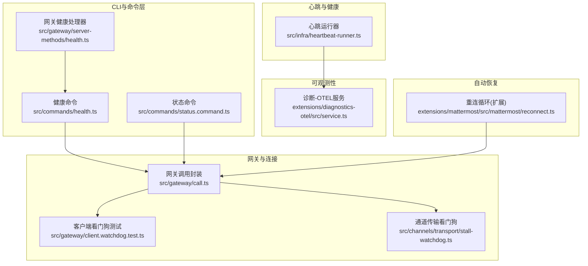
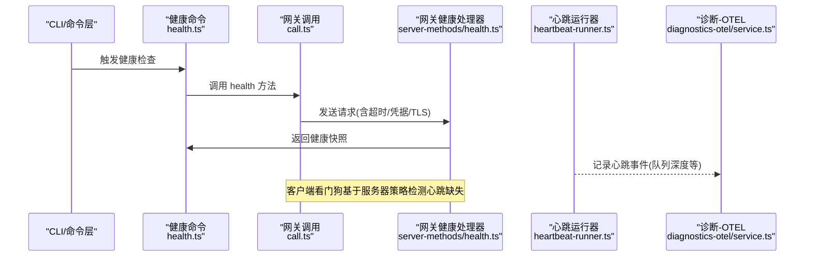
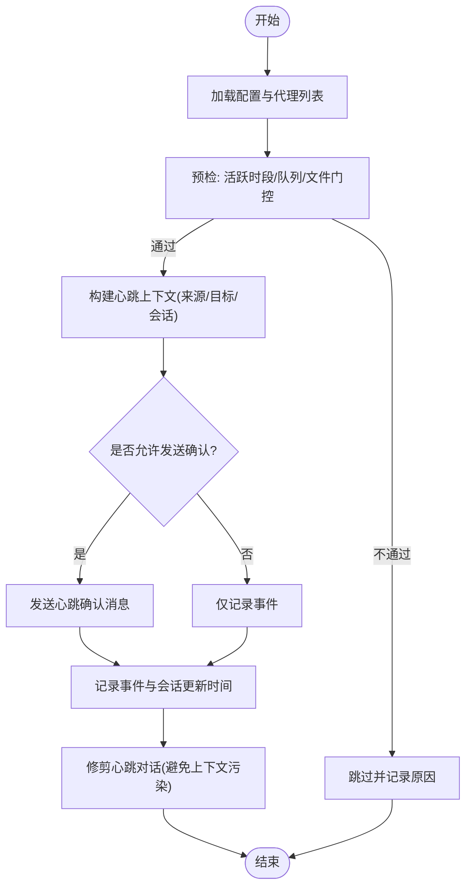
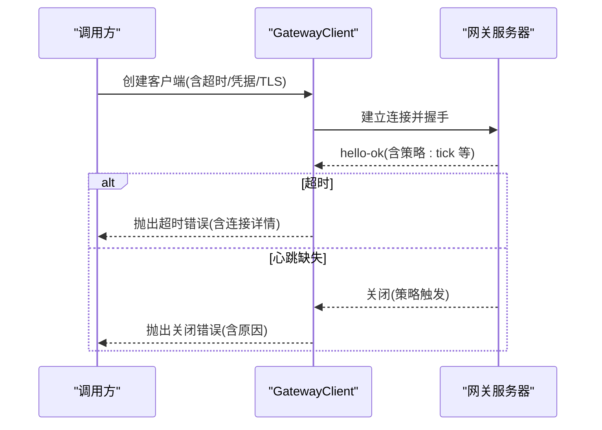
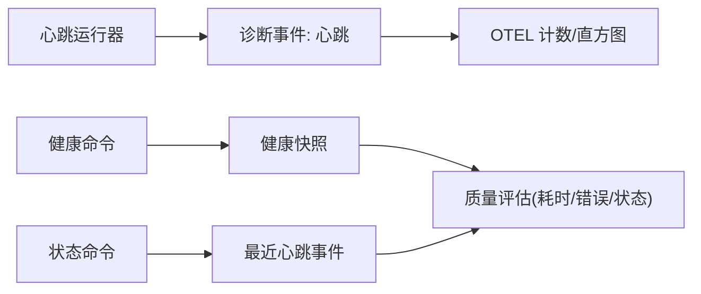
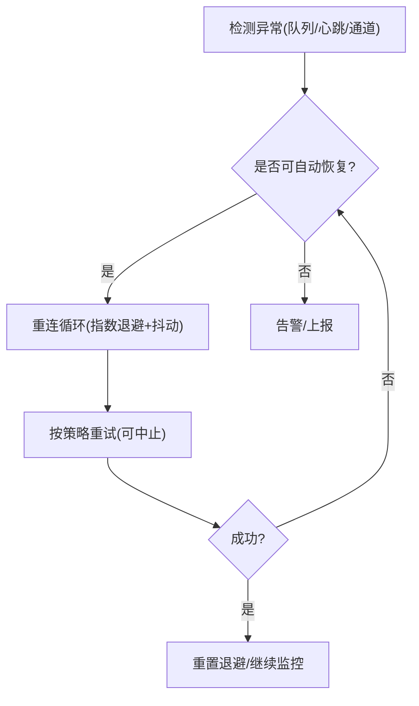
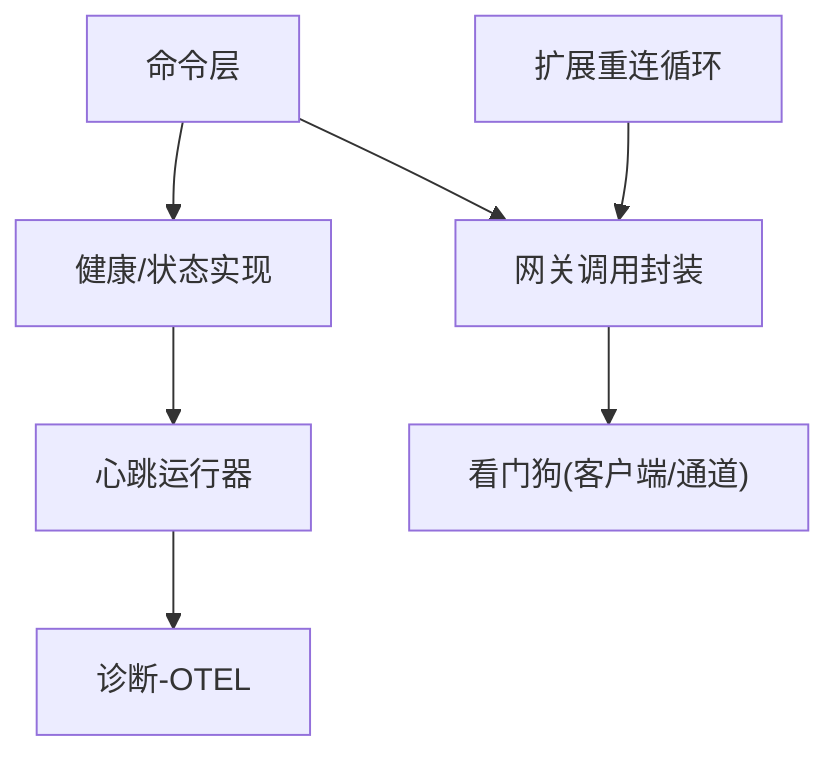

# 连接监控

<cite>
**本文引用的文件**
- [src/infra/heartbeat-runner.ts](file://src/infra/heartbeat-runner.ts)
- [src/commands/health.ts](file://src/commands/health.ts)
- [src/commands/status.command.ts](file://src/commands/status.command.ts)
- [src/gateway/server-methods/health.ts](file://src/gateway/server-methods/health.ts)
- [src/gateway/call.ts](file://src/gateway/call.ts)
- [extensions/diagnostics-otel/src/service.ts](file://extensions/diagnostics-otel/src/service.ts)
- [extensions/mattermost/src/mattermost/reconnect.ts](file://extensions/mattermost/src/mattermost/reconnect.ts)
- [extensions/mattermost/src/mattermost/reconnect.test.ts](file://extensions/mattermost/src/mattermost/reconnect.test.ts)
- [src/gateway/client.watchdog.test.ts](file://src/gateway/client.watchdog.test.ts)
- [src/channels/transport/stall-watchdog.ts](file://src/channels/transport/stall-watchdog.ts)
- [src/commands/health.snapshot.test.ts](file://src/commands/health.snapshot.test.ts)
- [src/commands/status.scan.ts](file://src/commands/status.scan.ts)
- [src/security/audit.ts](file://src/security/audit.ts)
</cite>

## 目录
1. [简介](#简介)
2. [项目结构](#项目结构)
3. [核心组件](#核心组件)
4. [架构总览](#架构总览)
5. [组件详解](#组件详解)
6. [依赖关系分析](#依赖关系分析)
7. [性能考量](#性能考量)
8. [故障排查指南](#故障排查指南)
9. [结论](#结论)
10. [附录](#附录)

## 简介
本文件系统化梳理 OpenClaw 的“连接监控”机制，覆盖心跳检测、超时管理、连接质量评估、监控指标采集与告警、性能统计、异常检测与自动恢复（重连策略、退避算法）、监控数据存储与可视化，以及常见连接问题的诊断与解决方案。内容以代码为依据，配合图示帮助不同技术背景的读者理解。

## 项目结构
围绕连接监控的关键模块分布如下：
- 心跳与健康：心跳运行器、健康命令、状态命令、网关健康接口
- 连接与超时：网关调用封装、客户端看门狗、通道传输看门狗
- 指标与可观测性：诊断插件（OTEL）对心跳事件的记录
- 自动恢复：扩展中的重连循环（指数退避、抖动、中止控制）
- 安全审计与探测：网关可达性探测、认证信息解析与错误聚合

**图示来源**
- [src/commands/health.ts](file://src/commands/health.ts#L1-L752)
- [src/commands/status.command.ts](file://src/commands/status.command.ts#L1-L684)
- [src/gateway/server-methods/health.ts](file://src/gateway/server-methods/health.ts#L1-L38)
- [src/gateway/call.ts](file://src/gateway/call.ts#L1-L758)
- [src/infra/heartbeat-runner.ts](file://src/infra/heartbeat-runner.ts#L1-L800)
- [extensions/diagnostics-otel/src/service.ts](file://extensions/diagnostics-otel/src/service.ts#L1-L686)
- [extensions/mattermost/src/mattermost/reconnect.ts](file://extensions/mattermost/src/mattermost/reconnect.ts#L1-L103)
- [src/gateway/client.watchdog.test.ts](file://src/gateway/client.watchdog.test.ts#L39-L86)
- [src/channels/transport/stall-watchdog.ts](file://src/channels/transport/stall-watchdog.ts#L57-L103)

**章节来源**
- [src/commands/health.ts](file://src/commands/health.ts#L1-L752)
- [src/commands/status.command.ts](file://src/commands/status.command.ts#L1-L684)
- [src/gateway/server-methods/health.ts](file://src/gateway/server-methods/health.ts#L1-L38)
- [src/gateway/call.ts](file://src/gateway/call.ts#L1-L758)
- [src/infra/heartbeat-runner.ts](file://src/infra/heartbeat-runner.ts#L1-L800)
- [extensions/diagnostics-otel/src/service.ts](file://extensions/diagnostics-otel/src/service.ts#L1-L686)
- [extensions/mattermost/src/mattermost/reconnect.ts](file://extensions/mattermost/src/mattermost/reconnect.ts#L1-L103)
- [src/gateway/client.watchdog.test.ts](file://src/gateway/client.watchdog.test.ts#L39-L86)
- [src/channels/transport/stall-watchdog.ts](file://src/channels/transport/stall-watchdog.ts#L57-L103)

## 核心组件
- 心跳运行器：负责按配置周期执行心跳，构建上下文、选择目标、发送“心跳确认”消息、记录事件与会话更新，并支持可见性与提示灯策略。
- 健康命令与状态命令：前者生成健康快照并格式化输出；后者在深度模式下拉取网关健康与最近心跳事件，汇总通道状态、会话与使用情况。
- 网关调用封装：统一解析配置、凭据、TLS指纹、URL来源与安全校验，封装请求生命周期（握手、超时、关闭），并提供最小权限作用域调用。
- 客户端看门狗：通过服务器返回的 tick 策略参数，检测心跳缺失导致的异常关闭，保障连接活性。
- 通道传输看门狗：监控通道收发活动，空闲超时触发回调，避免静默挂起。
- 诊断-OTEL 插件：订阅诊断事件，对心跳队列深度等进行直方图记录，便于观测与告警。
- 扩展重连循环：指数退避、抖动、最大延迟、中止信号、失败策略钩子，用于通道或下游连接的自动恢复。

**章节来源**
- [src/infra/heartbeat-runner.ts](file://src/infra/heartbeat-runner.ts#L1-L800)
- [src/commands/health.ts](file://src/commands/health.ts#L1-L752)
- [src/commands/status.command.ts](file://src/commands/status.command.ts#L1-L684)
- [src/gateway/call.ts](file://src/gateway/call.ts#L1-L758)
- [src/gateway/client.watchdog.test.ts](file://src/gateway/client.watchdog.test.ts#L39-L86)
- [src/channels/transport/stall-watchdog.ts](file://src/channels/transport/stall-watchdog.ts#L57-L103)
- [extensions/diagnostics-otel/src/service.ts](file://extensions/diagnostics-otel/src/service.ts#L612-L657)
- [extensions/mattermost/src/mattermost/reconnect.ts](file://extensions/mattermost/src/mattermost/reconnect.ts#L1-L103)

## 架构总览
下图展示从 CLI 到网关再到通道的心跳与监控链路，以及关键的超时与看门狗保护点。

**图示来源**
- [src/commands/health.ts](file://src/commands/health.ts#L525-L751)
- [src/gateway/call.ts](file://src/gateway/call.ts#L595-L758)
- [src/gateway/server-methods/health.ts](file://src/gateway/server-methods/health.ts#L10-L37)
- [src/infra/heartbeat-runner.ts](file://src/infra/heartbeat-runner.ts#L605-L800)
- [extensions/diagnostics-otel/src/service.ts](file://extensions/diagnostics-otel/src/service.ts#L612-L657)

## 组件详解

### 心跳检测与健康快照
- 心跳运行器
  - 解析心跳配置（间隔、提示词、目标、模型、ACK 最大长度），按代理维度调度。
  - 预检：检查活跃时段、队列是否繁忙、HEARTBEAT.md 是否为空、账户/通道可见性策略。
  - 发送“心跳确认”消息（可选），并记录事件（含原因、时长、指示灯类型）。
  - 对会话更新时间进行回滚与修剪，避免零信息对话污染上下文。
- 健康命令
  - 支持探针模式，逐通道探测账户可用性与耗时，汇总通道状态、会话数与最近条目。
  - 输出格式化行，区分 OK/WARN/OFF/UNLINKED 等状态。
- 状态命令
  - 在深度模式下拉取网关健康与最近心跳事件，结合安全审计与内存状态，形成综合视图。

**图示来源**
- [src/infra/heartbeat-runner.ts](file://src/infra/heartbeat-runner.ts#L605-L800)

**章节来源**
- [src/infra/heartbeat-runner.ts](file://src/infra/heartbeat-runner.ts#L148-L194)
- [src/commands/health.ts](file://src/commands/health.ts#L348-L523)
- [src/commands/status.command.ts](file://src/commands/status.command.ts#L144-L166)

### 超时管理与看门狗
- 网关调用封装
  - 解析超时与安全参数，构造客户端实例，注册握手成功回调后发起请求。
  - 超时触发清理并抛出带连接详情的错误；异常关闭时根据代码与原因生成可诊断信息。
- 客户端看门狗
  - 服务器返回的策略包含心跳间隔；若长时间无心跳则关闭连接，确保及时发现异常。
- 通道传输看门狗
  - 以定时器轮询空闲时长，超过阈值触发回调，便于上层采取措施（如重连）。

**图示来源**
- [src/gateway/call.ts](file://src/gateway/call.ts#L595-L758)
- [src/gateway/client.watchdog.test.ts](file://src/gateway/client.watchdog.test.ts#L39-L86)

**章节来源**
- [src/gateway/call.ts](file://src/gateway/call.ts#L559-L564)
- [src/gateway/call.ts](file://src/gateway/call.ts#L595-L758)
- [src/gateway/client.watchdog.test.ts](file://src/gateway/client.watchdog.test.ts#L39-L86)
- [src/channels/transport/stall-watchdog.ts](file://src/channels/transport/stall-watchdog.ts#L57-L103)

### 连接质量评估与指标采集
- 健康快照包含每个通道账户的探测结果（是否成功、耗时、错误码、错误信息、机器人用户名、Webhook 地址等），用于质量评估。
- 诊断-OTEL 插件订阅诊断事件，对心跳队列深度进行直方图记录，便于观测峰值与尾部延迟。
- 状态命令在深度模式下获取最近心跳事件，包含时间戳、通道、账户等，辅助定位异常来源。

**图示来源**
- [extensions/diagnostics-otel/src/service.ts](file://extensions/diagnostics-otel/src/service.ts#L612-L657)
- [src/commands/health.ts](file://src/commands/health.ts#L175-L220)
- [src/commands/status.command.ts](file://src/commands/status.command.ts#L159-L166)

**章节来源**
- [src/commands/health.ts](file://src/commands/health.ts#L175-L220)
- [extensions/diagnostics-otel/src/service.ts](file://extensions/diagnostics-otel/src/service.ts#L612-L657)
- [src/commands/status.command.ts](file://src/commands/status.command.ts#L159-L166)

### 异常检测与自动恢复
- 指标异常
  - 心跳队列深度异常升高、最近心跳事件缺失、通道状态持续警告等，作为异常信号。
- 自动恢复
  - 扩展中的重连循环提供指数退避、抖动、最大延迟、中止信号与失败策略钩子，适合在通道或下游连接中应用。
  - 看门狗在客户端与通道层面分别检测心跳缺失与空闲超时，触发上层重连或降级处理。

**图示来源**
- [extensions/mattermost/src/mattermost/reconnect.ts](file://extensions/mattermost/src/mattermost/reconnect.ts#L29-L76)
- [src/channels/transport/stall-watchdog.ts](file://src/channels/transport/stall-watchdog.ts#L57-L103)
- [src/gateway/client.watchdog.test.ts](file://src/gateway/client.watchdog.test.ts#L39-L86)

**章节来源**
- [extensions/mattermost/src/mattermost/reconnect.ts](file://extensions/mattermost/src/mattermost/reconnect.ts#L1-L103)
- [extensions/mattermost/src/mattermost/reconnect.test.ts](file://extensions/mattermost/src/mattermost/reconnect.test.ts#L50-L192)
- [src/channels/transport/stall-watchdog.ts](file://src/channels/transport/stall-watchdog.ts#L57-L103)
- [src/gateway/client.watchdog.test.ts](file://src/gateway/client.watchdog.test.ts#L39-L86)

### 监控数据存储、分析与可视化
- 存储与导出
  - 诊断-OTEL 插件将指标与日志通过 OTLP Protobuf 导出到远端接收端，支持批量导出与采样率配置。
- 分析与告警
  - 心跳队列深度直方图可用于识别异常峰值；错误计数与持续时间直方图可用于定位慢路径与失败热点。
- 可视化
  - 健康命令与状态命令提供终端表格化输出；结合外部监控面板（如 Grafana）可接入 OTEL 数据源进行可视化。

**章节来源**
- [extensions/diagnostics-otel/src/service.ts](file://extensions/diagnostics-otel/src/service.ts#L110-L134)
- [extensions/diagnostics-otel/src/service.ts](file://extensions/diagnostics-otel/src/service.ts#L167-L242)
- [src/commands/health.ts](file://src/commands/health.ts#L252-L346)
- [src/commands/status.command.ts](file://src/commands/status.command.ts#L407-L656)

### 常见连接问题与诊断
- 网关不可达/认证失败
  - 使用状态命令的深度模式拉取网关健康与最近心跳事件；必要时运行安全审计以获取认证警告与错误聚合。
- 心跳缺失/通道静默
  - 查看最近心跳事件的时间戳与通道/账户；结合通道传输看门狗的空闲超时判断是否需要重连。
- 超时与异常关闭
  - 根据网关调用封装提供的错误信息（含连接详情、关闭原因）定位网络或服务端策略问题。
- 心跳配置不当
  - 检查代理心跳间隔、提示词、目标与可见性设置；参考健康快照中各通道账户的探测结果。

**章节来源**
- [src/commands/status.command.ts](file://src/commands/status.command.ts#L144-L166)
- [src/security/audit.ts](file://src/security/audit.ts#L1057-L1091)
- [src/commands/status.scan.ts](file://src/commands/status.scan.ts#L74-L107)
- [src/commands/health.snapshot.test.ts](file://src/commands/health.snapshot.test.ts#L243-L253)
- [src/gateway/call.ts](file://src/gateway/call.ts#L547-L564)

## 依赖关系分析
- 命令层依赖网关调用封装与健康/状态实现，形成“查询—响应—展示”的闭环。
- 心跳运行器与诊断插件解耦，通过事件总线进行观测数据采集。
- 看门狗独立于业务逻辑，提供跨层的连接活性保障。
- 扩展重连循环可被具体通道实现复用，降低重复开发成本。

**图示来源**
- [src/commands/health.ts](file://src/commands/health.ts#L525-L751)
- [src/commands/status.command.ts](file://src/commands/status.command.ts#L67-L86)
- [src/gateway/call.ts](file://src/gateway/call.ts#L679-L758)
- [src/infra/heartbeat-runner.ts](file://src/infra/heartbeat-runner.ts#L605-L800)
- [extensions/diagnostics-otel/src/service.ts](file://extensions/diagnostics-otel/src/service.ts#L612-L657)
- [extensions/mattermost/src/mattermost/reconnect.ts](file://extensions/mattermost/src/mattermost/reconnect.ts#L29-L76)

**章节来源**
- [src/commands/health.ts](file://src/commands/health.ts#L1-L752)
- [src/commands/status.command.ts](file://src/commands/status.command.ts#L1-L684)
- [src/gateway/call.ts](file://src/gateway/call.ts#L1-L758)
- [src/infra/heartbeat-runner.ts](file://src/infra/heartbeat-runner.ts#L1-L800)
- [extensions/diagnostics-otel/src/service.ts](file://extensions/diagnostics-otel/src/service.ts#L1-L686)
- [extensions/mattermost/src/mattermost/reconnect.ts](file://extensions/mattermost/src/mattermost/reconnect.ts#L1-L103)

## 性能考量
- 心跳频率与可见性：合理设置心跳间隔与提示词，避免频繁触发与噪音；通过可见性策略减少不必要的通知。
- 队列与上下文：利用心跳运行器的会话更新时间回滚与对话修剪，降低无效上下文增长带来的性能损耗。
- 指标粒度：OTEL 指标按通道、模型、提供方等维度聚合，有助于快速定位热点与瓶颈。
- 超时与退避：适度缩短超时阈值与优化退避上限，平衡恢复速度与资源占用。

[本节为通用指导，无需特定文件引用]

## 故障排查指南
- 快速定位
  - 使用状态命令的深度模式查看网关健康、最近心跳事件与通道状态。
  - 结合健康命令输出的通道探测行，识别失败账户与耗时异常。
- 安全与认证
  - 若存在认证警告或错误，优先检查网关凭据解析与远程模式配置。
- 连接与超时
  - 若出现超时或异常关闭，核对连接详情与关闭原因；必要时调整超时阈值或网络策略。
- 自动恢复
  - 在通道层启用重连循环，配置指数退避与抖动，避免雪崩效应；通过中止信号与失败策略钩子精细控制。

**章节来源**
- [src/commands/status.command.ts](file://src/commands/status.command.ts#L144-L166)
- [src/commands/health.ts](file://src/commands/health.ts#L252-L346)
- [src/security/audit.ts](file://src/security/audit.ts#L1057-L1091)
- [src/gateway/call.ts](file://src/gateway/call.ts#L547-L564)
- [extensions/mattermost/src/mattermost/reconnect.ts](file://extensions/mattermost/src/mattermost/reconnect.ts#L29-L76)

## 结论
OpenClaw 的连接监控体系以“心跳+健康快照+看门狗+诊断指标”为核心，既保证了连接活性与质量，又提供了可观测与可恢复能力。通过合理的配置与策略（如退避、抖动、可见性），可在复杂网络环境中稳定维持连接，并借助 OTEL 实现持续监控与可视化。

[本节为总结性内容，无需特定文件引用]

## 附录
- 相关测试用例可参考：
  - 健康快照禁用心跳间隔的断言
  - 状态命令在深度模式下的心跳显示
  - 重连循环的指数退避、抖动与中止行为
  - 客户端看门狗在心跳缺失场景下的关闭行为
  - 通道传输看门狗的空闲超时与回调

**章节来源**
- [src/commands/health.snapshot.test.ts](file://src/commands/health.snapshot.test.ts#L243-L253)
- [src/commands/status.command.ts](file://src/commands/status.command.ts#L325-L351)
- [extensions/mattermost/src/mattermost/reconnect.test.ts](file://extensions/mattermost/src/mattermost/reconnect.test.ts#L50-L192)
- [src/gateway/client.watchdog.test.ts](file://src/gateway/client.watchdog.test.ts#L39-L86)
- [src/channels/transport/stall-watchdog.ts](file://src/channels/transport/stall-watchdog.ts#L57-L103)