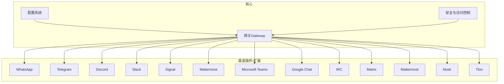
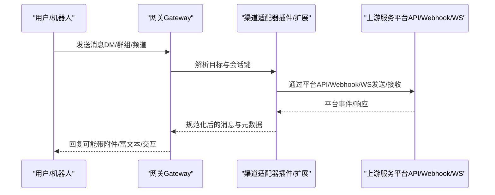
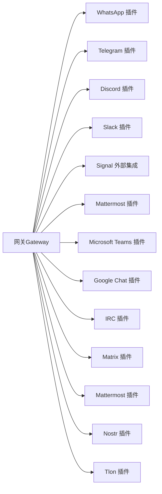

# 支持的渠道

<cite>
**本文引用的文件**
- [docs/channels/index.md](file://docs/channels/index.md)
- [docs/channels/whatsapp.md](file://docs/channels/whatsapp.md)
- [docs/channels/telegram.md](file://docs/channels/telegram.md)
- [docs/channels/discord.md](file://docs/channels/discord.md)
- [docs/channels/signal.md](file://docs/channels/signal.md)
- [docs/channels/msteams.md](file://docs/channels/msteams.md)
- [docs/channels/googlechat.md](file://docs/channels/googlechat.md)
- [docs/channels/slack.md](file://docs/channels/slack.md)
- [docs/channels/irc.md](file://docs/channels/irc.md)
- [docs/channels/matrix.md](file://docs/channels/matrix.md)
- [docs/channels/mattermost.md](file://docs/channels/mattermost.md)
- [docs/channels/nostr.md](file://docs/channels/nostr.md)
- [docs/channels/tlon.md](file://docs/channels/tlon.md)
</cite>

## 目录
1. [简介](#简介)
2. [项目结构](#项目结构)
3. [核心组件](#核心组件)
4. [架构总览](#架构总览)
5. [详细组件分析](#详细组件分析)
6. [依赖关系分析](#依赖关系分析)
7. [性能考量](#性能考量)
8. [故障排查指南](#故障排查指南)
9. [结论](#结论)
10. [附录](#附录)

## 简介
本文件面向希望在 OpenClaw 中接入多种消息渠道的用户与运维人员，系统性梳理了当前仓库中已支持或可扩展的 40+ 消息渠道。内容按类别组织，覆盖即时通讯、企业通信、社交媒体、传统协议与新兴协议五大类，并对每个渠道提供简要介绍、功能特性对比、安装与配置要点、推荐使用场景以及性能相关注意事项。所有说明均基于仓库内官方文档与配置参考，确保可操作性与一致性。

## 项目结构
OpenClaw 的“渠道”能力由“网关（Gateway）+ 插件/扩展”的架构实现：核心负责路由与会话管理，各渠道以插件或扩展形式接入，遵循统一的配置模型与安全策略。官方文档在 docs/channels 下提供了索引与各渠道的独立文档，便于按需查阅。

图表来源
- [docs/channels/index.md](file://docs/channels/index.md#L1-L48)

章节来源
- [docs/channels/index.md](file://docs/channels/index.md#L1-L48)

## 核心组件
- 渠道配置模型：各渠道在 channels.<name> 下集中配置，支持多账户、凭据注入、访问控制、会话行为等通用字段。
- 访问控制：DM 与群组分别支持 pairing、allowlist、open、disabled 等策略；部分渠道支持 per-channel/per-topic 细粒度控制。
- 会话与路由：默认 DM 聚合到主会话，群组/频道映射到隔离会话键，线程/话题支持独立上下文。
- 安全与审计：支持配对码、允许名单、提及触发、读回执、反应通知、工具权限等，降低误用风险。
- 多账户与凭据：多数渠道支持 accounts.<id> 结构，继承顶层默认值并可单独覆盖。

章节来源
- [docs/channels/whatsapp.md](file://docs/channels/whatsapp.md#L1-L120)
- [docs/channels/telegram.md](file://docs/channels/telegram.md#L105-L220)
- [docs/channels/discord.md](file://docs/channels/discord.md#L368-L460)
- [docs/channels/signal.md](file://docs/channels/signal.md#L182-L243)
- [docs/channels/msteams.md](file://docs/channels/msteams.md#L85-L141)
- [docs/channels/googlechat.md](file://docs/channels/googlechat.md#L154-L206)
- [docs/channels/slack.md](file://docs/channels/slack.md#L136-L205)
- [docs/channels/irc.md](file://docs/channels/irc.md#L46-L127)
- [docs/channels/matrix.md](file://docs/channels/matrix.md#L180-L225)
- [docs/channels/mattermost.md](file://docs/channels/mattermost.md#L132-L177)
- [docs/channels/nostr.md](file://docs/channels/nostr.md#L115-L137)
- [docs/channels/tlon.md](file://docs/channels/tlon.md#L111-L147)

## 架构总览
下图展示 OpenClaw 与各渠道的交互关系：Gateway 统一接收与分发消息，渠道通过各自 SDK/协议/插件连接到上游服务，同时遵循统一的安全与会话策略。

图表来源
- [docs/channels/whatsapp.md](file://docs/channels/whatsapp.md#L126-L133)
- [docs/channels/telegram.md](file://docs/channels/telegram.md#L222-L231)
- [docs/channels/discord.md](file://docs/channels/discord.md#L254-L262)
- [docs/channels/signal.md](file://docs/channels/signal.md#L200-L205)
- [docs/channels/msteams.md](file://docs/channels/msteams.md#L142-L150)
- [docs/channels/googlechat.md](file://docs/channels/googlechat.md#L139-L153)
- [docs/channels/slack.md](file://docs/channels/slack.md#L298-L310)
- [docs/channels/irc.md](file://docs/channels/irc.md#L13-L38)
- [docs/channels/matrix.md](file://docs/channels/matrix.md#L180-L184)
- [docs/channels/mattermost.md](file://docs/channels/mattermost.md#L36-L57)
- [docs/channels/nostr.md](file://docs/channels/nostr.md#L11-L42)
- [docs/channels/tlon.md](file://docs/channels/tlon.md#L35-L42)

## 详细组件分析

### 即时通讯类

#### WhatsApp（Web 通道，Baileys）
- 简介：通过 WhatsApp Web（Baileys）连接，支持 DM、群组、媒体、反应、读回执等。
- 安装与配置要点：
  - 配置 DM 策略与允许名单；群组策略与发送者白名单；提及触发与会话激活命令。
  - 支持多账户、凭据目录、登出清理。
- 推荐场景：需要高保真移动端体验与丰富媒体能力的企业/个人助理。
- 性能与限制：长轮询与重连由网关负责；注意 Bun 兼容性提示；媒体大小限制与自动优化；历史上下文缓冲与注入。

章节来源
- [docs/channels/whatsapp.md](file://docs/channels/whatsapp.md#L1-L120)
- [docs/channels/whatsapp.md](file://docs/channels/whatsapp.md#L126-L290)
- [docs/channels/whatsapp.md](file://docs/channels/whatsapp.md#L292-L365)
- [docs/channels/whatsapp.md](file://docs/channels/whatsapp.md#L374-L425)
- [docs/channels/whatsapp.md](file://docs/channels/whatsapp.md#L426-L446)

#### Telegram（Bot API，grammY）
- 简介：Bot API + 长轮询/可选 Webhook；支持 DM、群组、论坛主题、预览流式回复、内联按钮、贴纸、反应通知等。
- 安装与配置要点：
  - BotFather 创建令牌；隐私模式与群组可见性；分组策略与发送者白名单；提及行为与会话激活。
  - 支持命令菜单注册、内联按钮范围、投票（通过消息动作）、打字指示与链接预览。
- 推荐场景：需要强富文本、交互按钮、论坛主题的团队协作与自动化。
- 性能与限制：长轮询并发受全局并发限制；Telegram 无读回执；流式预览与块式流式可选。

章节来源
- [docs/channels/telegram.md](file://docs/channels/telegram.md#L1-L70)
- [docs/channels/telegram.md](file://docs/channels/telegram.md#L75-L140)
- [docs/channels/telegram.md](file://docs/channels/telegram.md#L105-L220)
- [docs/channels/telegram.md](file://docs/channels/telegram.md#L222-L328)
- [docs/channels/telegram.md](file://docs/channels/telegram.md#L329-L544)
- [docs/channels/telegram.md](file://docs/channels/telegram.md#L545-L765)
- [docs/channels/telegram.md](file://docs/channels/telegram.md#L767-L800)

#### Signal（signal-cli JSON-RPC + SSE）
- 简介：外部 CLI 集成；DM 与群组隔离会话；支持反应、媒体、读回执转发、外部队列模式。
- 安装与配置要点：
  - 使用独立号码或二维码链接现有账号；服务端/本地守护进程模式；多账户配置。
  - DM/群组访问控制、历史上下文、文本分片与媒体上限。
- 推荐场景：注重隐私与端到端加密的个人/小团队助理。
- 性能与限制：JVM 冷启动较慢时建议外部队列；信号服务器 API 变更可能导致旧版本不兼容。

章节来源
- [docs/channels/signal.md](file://docs/channels/signal.md#L1-L30)
- [docs/channels/signal.md](file://docs/channels/signal.md#L31-L103)
- [docs/channels/signal.md](file://docs/channels/signal.md#L104-L158)
- [docs/channels/signal.md](file://docs/channels/signal.md#L165-L181)
- [docs/channels/signal.md](file://docs/channels/signal.md#L182-L243)
- [docs/channels/signal.md](file://docs/channels/signal.md#L244-L286)
- [docs/channels/signal.md](file://docs/channels/signal.md#L287-L326)

#### Discord（Bot API，Socket Mode/HTTP Events API）
- 简介：DM 与公会频道；支持组件容器、模态表单、交互事件、线程绑定、反应通知、打字指示等。
- 安装与配置要点：
  - 开发者门户创建应用与 Bot；启用特权意图；订阅事件；Socket Mode 或 HTTP Events API。
  - 公会策略、成员/角色/用户名匹配、提及触发、线程绑定与持久化 ACP 绑定。
- 推荐场景：企业私有服务器、社区频道、复杂交互工作流。
- 性能与限制：Socket Mode 默认；HTTP 模式需唯一 webhook 路径；流式预览与块式流式可选。

章节来源
- [docs/channels/discord.md](file://docs/channels/discord.md#L1-L22)
- [docs/channels/discord.md](file://docs/channels/discord.md#L24-L167)
- [docs/channels/discord.md](file://docs/channels/discord.md#L173-L250)
- [docs/channels/discord.md](file://docs/channels/discord.md#L254-L301)
- [docs/channels/discord.md](file://docs/channels/discord.md#L368-L460)
- [docs/channels/discord.md](file://docs/channels/discord.md#L462-L537)
- [docs/channels/discord.md](file://docs/channels/discord.md#L539-L800)

#### Slack（Socket Mode + HTTP Events API）
- 简介：DM 与频道；支持 Socket Mode 与 HTTP Events API；流式预览、线程与回复标签、反应与打字指示。
- 安装与配置要点：
  - 应用与令牌（App Token + Bot Token）；事件订阅；Socket Mode 或 HTTP 模式。
  - DM/频道策略、提及触发、线程历史、回复标签、动作与工具门禁。
- 推荐场景：团队协作、命令驱动与复杂交互。
- 性能与限制：流式预览依赖 Slack 原生 API；HTTP 模式需签名密钥与唯一路径。

章节来源
- [docs/channels/slack.md](file://docs/channels/slack.md#L1-L22)
- [docs/channels/slack.md](file://docs/channels/slack.md#L24-L121)
- [docs/channels/slack.md](file://docs/channels/slack.md#L123-L135)
- [docs/channels/slack.md](file://docs/channels/slack.md#L136-L205)
- [docs/channels/slack.md](file://docs/channels/slack.md#L234-L282)
- [docs/channels/slack.md](file://docs/channels/slack.md#L284-L340)
- [docs/channels/slack.md](file://docs/channels/slack.md#L340-L431)
- [docs/channels/slack.md](file://docs/channels/slack.md#L433-L490)
- [docs/channels/slack.md](file://docs/channels/slack.md#L492-L555)

#### Google Chat（Chat API，Webhook）
- 简介：HTTP Webhook；DM 与空间；配对码、提及触发、反应工具、类型指示。
- 安装与配置要点：
  - 服务账号与应用配置；公开 HTTPS 网关；Audience 类型与值；DM/群组策略。
  - 目标标识符（users/spaces）、媒体上限、反应工具。
- 推荐场景：Google Workspace 私有应用、受限可见性与安全边界。
- 性能与限制：仅暴露 /googlechat 路径；需要公网可达；令牌验证与体预算。

章节来源
- [docs/channels/googlechat.md](file://docs/channels/googlechat.md#L1-L51)
- [docs/channels/googlechat.md](file://docs/channels/googlechat.md#L52-L118)
- [docs/channels/googlechat.md](file://docs/channels/googlechat.md#L119-L162)
- [docs/channels/googlechat.md](file://docs/channels/googlechat.md#L139-L206)
- [docs/channels/googlechat.md](file://docs/channels/googlechat.md#L209-L262)

### 企业通信类

#### Microsoft Teams（插件）
- 简介：插件化支持；DM、群组、频道；文件上传（SharePoint）、自适应卡片投票、回复样式（Threads/Posts）。
- 安装与配置要点：
  - 安装插件；Azure Bot（App ID/密码/租户）；Teams 应用包（RSC 权限）；Webhook 端点。
  - DM/群组策略、提及要求、回复样式、文件上传（SharePoint Site ID + Graph 权限）。
- 推荐场景：企业 Teams 生态、合规与历史访问需求。
- 性能与限制：Webhook 超时与重复；RSC vs Graph 权限权衡；私有频道支持有限。

章节来源
- [docs/channels/msteams.md](file://docs/channels/msteams.md#L1-L40)
- [docs/channels/msteams.md](file://docs/channels/msteams.md#L41-L84)
- [docs/channels/msteams.md](file://docs/channels/msteams.md#L85-L141)
- [docs/channels/msteams.md](file://docs/channels/msteams.md#L142-L286)
- [docs/channels/msteams.md](file://docs/channels/msteams.md#L287-L416)
- [docs/channels/msteams.md](file://docs/channels/msteams.md#L417-L597)
- [docs/channels/msteams.md](file://docs/channels/msteams.md#L598-L777)

#### Mattermost（插件）
- 简介：Bot Token + WebSocket；DM、频道、群组；内联按钮、反应、命令回调（需可达）。
- 安装与配置要点：
  - 安装插件；创建 Bot 账号与 Token；基础 URL；聊天模式（oncall/onmessage/onchar）。
  - DM 策略、群组策略、提及要求、按钮回调（HMAC 校验、可达性）。
- 推荐场景：自托管团队协作、内联交互与自动化。
- 性能与限制：按钮回调需 Mattermost 可达 OpenClaw；非字母数字 ID 会被拒绝；HMAC 严格校验。

章节来源
- [docs/channels/mattermost.md](file://docs/channels/mattermost.md#L1-L35)
- [docs/channels/mattermost.md](file://docs/channels/mattermost.md#L36-L57)
- [docs/channels/mattermost.md](file://docs/channels/mattermost.md#L58-L96)
- [docs/channels/mattermost.md](file://docs/channels/mattermost.md#L106-L131)
- [docs/channels/mattermost.md](file://docs/channels/mattermost.md#L132-L177)
- [docs/channels/mattermost.md](file://docs/channels/mattermost.md#L178-L235)
- [docs/channels/mattermost.md](file://docs/channels/mattermost.md#L236-L363)

### 社交媒体类

#### Twitter（未在索引中列出，但存在相关文档与技能）
- 简介：仓库包含 Twitter 相关文档与技能，表明具备接入能力与示例。
- 注意事项：具体实现细节请以对应文档为准。

章节来源
- [docs/channels/index.md](file://docs/channels/index.md#L1-L48)

#### Facebook Messenger（未在索引中列出，但存在相关文档与技能）
- 简介：仓库包含 Facebook Messenger 相关文档与技能，表明具备接入能力与示例。
- 注意事项：具体实现细节请以对应文档为准。

章节来源
- [docs/channels/index.md](file://docs/channels/index.md#L1-L48)

### 传统协议类

#### IRC（插件）
- 简介：经典 IRC；支持 DM、频道、提及触发、NickServ 登录、工具门禁。
- 安装与配置要点：
  - 启用 channels.irc；设置主机、端口、TLS、昵称、频道；DM/群组策略与提及要求。
  - 工具按发送者差异化控制（toolsBySender）。
- 推荐场景：开源社区、技术讨论、遗留生态迁移。
- 性能与限制：mention-gating 默认开启；公共频道建议限制工具集。

章节来源
- [docs/channels/irc.md](file://docs/channels/irc.md#L1-L38)
- [docs/channels/irc.md](file://docs/channels/irc.md#L39-L88)
- [docs/channels/irc.md](file://docs/channels/irc.md#L89-L127)
- [docs/channels/irc.md](file://docs/channels/irc.md#L128-L186)
- [docs/channels/irc.md](file://docs/channels/irc.md#L187-L242)

#### Matrix（插件）
- 简介：作为 Matrix 用户连接任意 Homeserver；支持 DM、房间、线程、媒体、E2EE、反应、投票、位置、原生命令。
- 安装与配置要点：
  - 安装插件；获取访问令牌或用户名+密码；启用 E2EE（需加密模块）；多账户配置。
  - DM/房间策略、提及要求、线程回复模式、自动加入与邀请白名单。
- 推荐场景：去中心化、隐私优先、跨客户端互通。
- 性能与限制：E2EE 需要设备验证；加密模块缺失时会降级；线程与回复标签支持良好。

章节来源
- [docs/channels/matrix.md](file://docs/channels/matrix.md#L1-L38)
- [docs/channels/matrix.md](file://docs/channels/matrix.md#L39-L94)
- [docs/channels/matrix.md](file://docs/channels/matrix.md#L95-L133)
- [docs/channels/matrix.md](file://docs/channels/matrix.md#L139-L180)
- [docs/channels/matrix.md](file://docs/channels/matrix.md#L181-L225)
- [docs/channels/matrix.md](file://docs/channels/matrix.md#L226-L304)

### 新兴协议类

#### Nostr（插件）
- 简介：NIP-04 加密 DM；插件化支持；可配置 relays、profile 元数据。
- 安装与配置要点：
  - 安装插件；生成/导入私钥；配置 relays；DM 策略与允许名单。
  - Profile 元数据发布与管理。
- 推荐场景：去中心化社交网络、隐私优先的 DM 通道。
- 性能与限制：仅 DM；无媒体；多 relay 可能导致重复；注意速率限制。

章节来源
- [docs/channels/nostr.md](file://docs/channels/nostr.md#L1-L42)
- [docs/channels/nostr.md](file://docs/channels/nostr.md#L43-L83)
- [docs/channels/nostr.md](file://docs/channels/nostr.md#L84-L114)
- [docs/channels/nostr.md](file://docs/channels/nostr.md#L115-L166)
- [docs/channels/nostr.md](file://docs/channels/nostr.md#L167-L234)

#### Tlon（插件）
- 简介：Urbit/Tlon；DM、群组、线程、富文本、图片上传；内置技能提供 CLI 能力。
- 安装与配置要点：
  - 安装插件；配置 ship、URL、登录码；所有者 Ship 自动授权；群组自动发现或手动固定。
  - DM/群组策略、自动接受邀请、富文本转换与图片上传。
- 推荐场景：去中心化社交、私有网络中的协作。
- 性能与限制：mention-gating 默认开启；线程回复友好；不支持反应/投票。

章节来源
- [docs/channels/tlon.md](file://docs/channels/tlon.md#L1-L34)
- [docs/channels/tlon.md](file://docs/channels/tlon.md#L35-L84)
- [docs/channels/tlon.md](file://docs/channels/tlon.md#L85-L110)
- [docs/channels/tlon.md](file://docs/channels/tlon.md#L111-L161)
- [docs/channels/tlon.md](file://docs/channels/tlon.md#L162-L218)
- [docs/channels/tlon.md](file://docs/channels/tlon.md#L219-L277)

## 依赖关系分析
- 渠道与网关：所有渠道均通过 Gateway 进行会话路由与安全控制，保持一致的访问策略与配置模型。
- 插件化：Teams、Mattermost、Matrix、Nostr、Tlon 等以插件形式提供，避免核心体积膨胀并便于独立演进。
- 凭据与安全：各渠道支持凭据注入（环境变量/SecretRef）、配对码、允许名单、提及触发、工具门禁等，形成纵深防御。
- 平台差异：不同渠道在富文本、交互能力、历史访问、媒体处理等方面存在差异，需结合业务场景选择。

图表来源
- [docs/channels/index.md](file://docs/channels/index.md#L1-L48)

章节来源
- [docs/channels/index.md](file://docs/channels/index.md#L1-L48)

## 性能考量
- 连接与重连：WhatsApp/Discord/Telegram/Matrix 等由网关维护连接与重连循环；注意运行时日志与 Doctor 检测。
- 流式输出：Telegram/Discord/Slack 支持流式预览或块式流式；根据平台能力与延迟需求选择。
- 媒体与大小：各渠道均有媒体上限与自动优化策略；发送失败时通常回退为文本警告。
- 网络与可达性：Google Chat/Teams/Mattermost 等需要公网可达的 Webhook/回调端点；确保防火墙与反向代理正确配置。
- 并发与限速：Telegram/Slack 的长轮询/HTTP 模式受全局并发与平台速率限制影响。

## 故障排查指南
- 通用步骤：状态检查、日志跟踪、Doctor 诊断、通道探测。
- 渠道特定：
  - WhatsApp：未链接/断开重连、无活动监听、群组被忽略、Bun 兼容性。
  - Telegram：隐私模式、命令不可用、轮询/网络不稳定。
  - Discord：未提及群组消息、未看到消息、命令工作异常、Socket/HTTP 模式问题。
  - Slack：无回复、DM 被忽略、Socket/HTTP 模式、原生命令未触发。
  - Signal：守护进程可达但无回复、DM 被忽略、群组被阻、配置校验错误。
  - Microsoft Teams：图片不显示、无响应、版本不匹配、401 未授权。
  - Mattermost：无回复、认证错误、多账户、按钮渲染/点击无效、HMAC 校验失败。
  - Matrix：房间被阻止、DM 被忽略、加密房间失败。
  - IRC：未提及被丢弃、登录失败、TLS 失败。
  - Nostr：未收到消息、发送响应、重复回复、私钥格式。
  - Tlon：DM 被忽略、群组消息被阻、连接错误、认证过期。

章节来源
- [docs/channels/whatsapp.md](file://docs/channels/whatsapp.md#L374-L425)
- [docs/channels/telegram.md](file://docs/channels/telegram.md#L767-L800)
- [docs/channels/discord.md](file://docs/channels/discord.md#L433-L537)
- [docs/channels/slack.md](file://docs/channels/slack.md#L433-L490)
- [docs/channels/signal.md](file://docs/channels/signal.md#L251-L286)
- [docs/channels/msteams.md](file://docs/channels/msteams.md#L745-L777)
- [docs/channels/mattermost.md](file://docs/channels/mattermost.md#L351-L363)
- [docs/channels/matrix.md](file://docs/channels/matrix.md#L248-L273)
- [docs/channels/irc.md](file://docs/channels/irc.md#L237-L242)
- [docs/channels/nostr.md](file://docs/channels/nostr.md#L203-L234)
- [docs/channels/tlon.md](file://docs/channels/tlon.md#L232-L277)

## 结论
OpenClaw 在多渠道支持上实现了“统一配置、插件化扩展、一致安全”的设计，既满足即时通讯与企业协作的高频场景，也覆盖传统协议与新兴协议的多样化需求。建议在生产环境中优先考虑：
- 明确业务边界与合规要求（Teams/Google Chat/Slack/Telegram/WhatsApp）；
- 注重隐私与安全（Signal/Matrix/Nostr/Tlon）；
- 依据平台能力选择合适的交互方式（Discord 组件/Slack 流式、Telegram 论坛主题）；
- 通过 Doctor 与日志持续监控渠道健康与性能瓶颈。

## 附录
- 快速选择建议（基于仓库文档）：
  - 最快起步：Telegram（Bot Token，无需 QR）。
  - 企业首选：Microsoft Teams（插件，RSC/Graph 权限组合）。
  - 富交互：Discord（组件/模态/流式预览）。
  - 隐私优先：Signal/Matrix/Nostr/Tlon。
  - 开源社区：IRC。
- 关键配置参考路径（各渠道文档内均有详细字段说明与示例）：
  - [WhatsApp 配置参考](file://docs/channels/whatsapp.md#L426-L446)
  - [Telegram 配置参考](file://docs/channels/telegram.md#L765-L800)
  - [Discord 配置参考](file://docs/channels/discord.md#L539-L555)
  - [Slack 配置参考](file://docs/channels/slack.md#L533-L555)
  - [Signal 配置参考](file://docs/channels/signal.md#L294-L326)
  - [Microsoft Teams 配置参考](file://docs/channels/msteams.md#L450-L478)
  - [Google Chat 配置参考](file://docs/channels/googlechat.md#L163-L207)
  - [Mattermost 配置参考](file://docs/channels/mattermost.md#L326-L363)
  - [IRC 配置参考](file://docs/channels/irc.md#L46-L127)
  - [Matrix 配置参考](file://docs/channels/matrix.md#L274-L304)
  - [Nostr 配置参考](file://docs/channels/nostr.md#L72-L114)
  - [Tlon 配置参考](file://docs/channels/tlon.md#L250-L277)