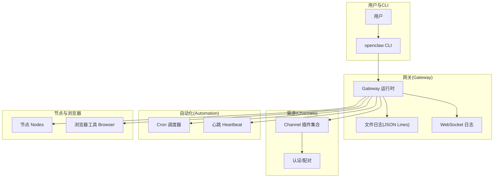
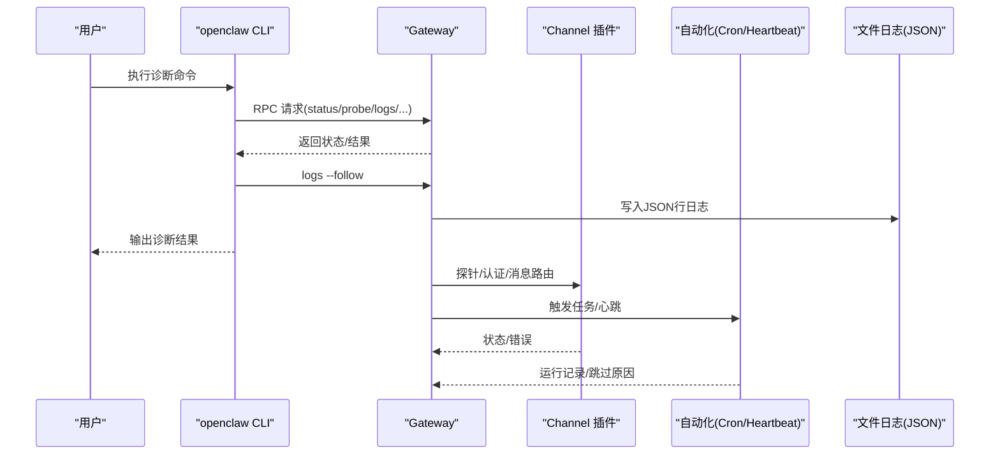
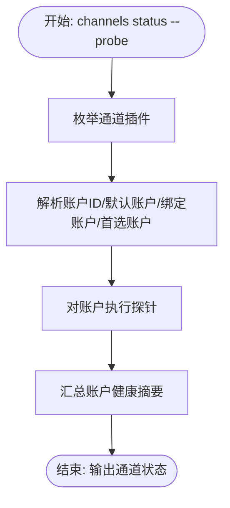
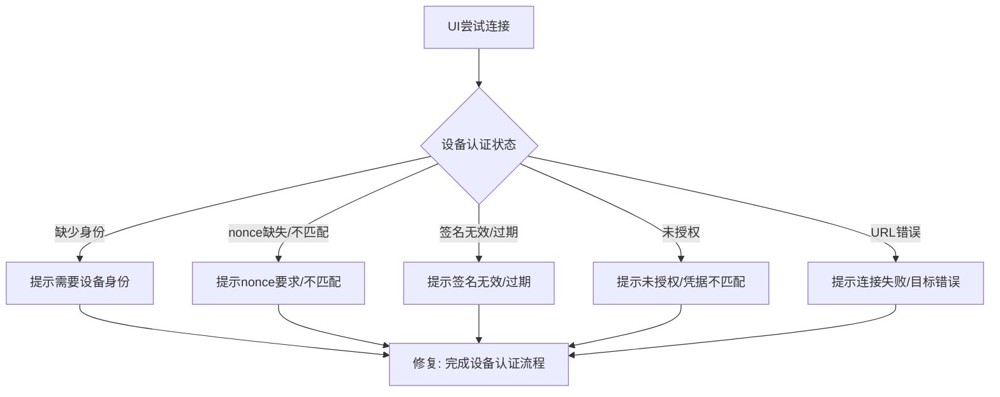
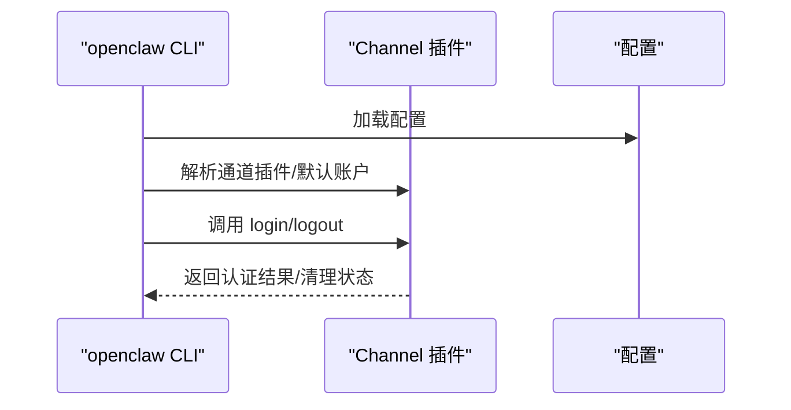
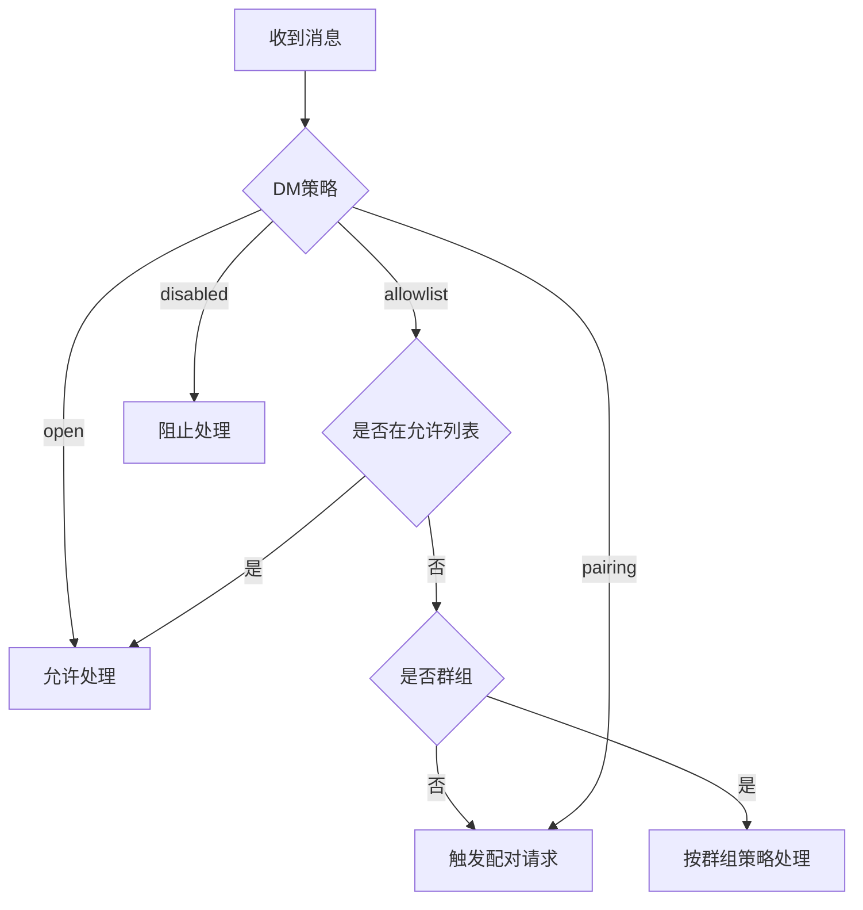
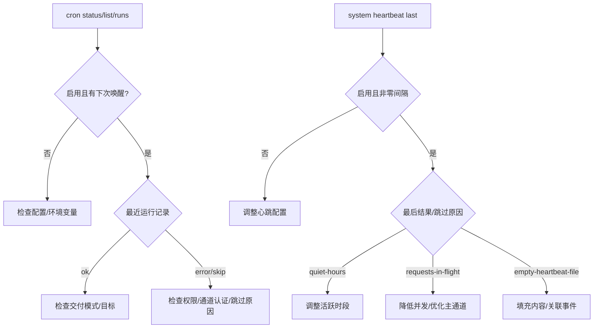
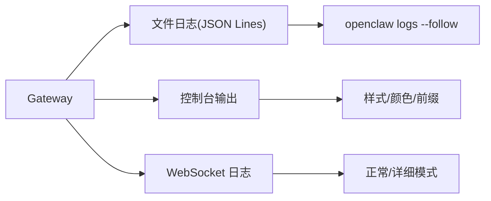
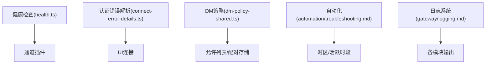

# 故障排除指南

<cite>
**本文引用的文件**
- [docs/help/troubleshooting.md](file://docs/help/troubleshooting.md)
- [docs/gateway/troubleshooting.md](file://docs/gateway/troubleshooting.md)
- [docs/channels/troubleshooting.md](file://docs/channels/troubleshooting.md)
- [docs/automation/troubleshooting.md](file://docs/automation/troubleshooting.md)
- [docs/cli/logs.md](file://docs/cli/logs.md)
- [docs/gateway/logging.md](file://docs/gateway/logging.md)
- [src/commands/health.ts](file://src/commands/health.ts)
- [src/gateway/protocol/connect-error-details.ts](file://src/gateway/protocol/connect-error-details.ts)
- [src/cli/channel-auth.ts](file://src/cli/channel-auth.ts)
- [src/security/dm-policy-shared.ts](file://src/security/dm-policy-shared.ts)
- [src/security/dm-policy-channel-smoke.test.ts](file://src/security/dm-policy-channel-smoke.test.ts)
- [src/shared/usage-aggregates.ts](file://src/shared/usage-aggregates.ts)
- [apps/shared/OpenClawKit/Sources/OpenClawProtocol/GatewayModels.swift](file://apps/shared/OpenClawKit/Sources/OpenClawProtocol/GatewayModels.swift)
- [apps/macos/Sources/OpenClawProtocol/GatewayModels.swift](file://apps/macos/Sources/OpenClawProtocol/GatewayModels.swift)
- [docs/channels/index.md](file://docs/channels/index.md)
- [docs/channels/pairing.md](file://docs/channels/pairing.md)
</cite>

## 目录
1. [简介](#简介)
2. [项目结构](#项目结构)
3. [核心组件](#核心组件)
4. [架构总览](#架构总览)
5. [详细组件分析](#详细组件分析)
6. [依赖关系分析](#依赖关系分析)
7. [性能考量](#性能考量)
8. [故障排除指南](#故障排除指南)
9. [结论](#结论)
10. [附录](#附录)

## 简介
本指南面向OpenClaw渠道集成的故障排除，聚焦于连接问题、认证失败、消息延迟与性能问题等常见场景。内容覆盖系统化排查流程、日志分析方法、工具使用与社区支持资源，并提供高级诊断技术建议，帮助快速定位与解决问题。

## 项目结构
OpenClaw通过“网关（Gateway）+ 渠道插件（Channels）+ 自动化（Cron/Heartbeat）+ 节点（Nodes）+ 浏览器工具（Browser）”的分层架构运行。故障排除围绕以下关键路径展开：
- 命令行诊断：status、gateway status、logs、doctor、channels status、cron status、browser status、nodes status
- 日志系统：文件日志（JSON Lines）、控制台输出、WebSocket日志样式
- 安全与配对：DM策略、允许列表、节点配对、设备身份验证
- 性能与延迟：使用聚合统计与探针超时控制

图示来源
- [docs/help/troubleshooting.md](file://docs/help/troubleshooting.md#L1-L297)
- [docs/gateway/logging.md](file://docs/gateway/logging.md#L1-L114)

章节来源
- [docs/help/troubleshooting.md](file://docs/help/troubleshooting.md#L1-L297)
- [docs/gateway/logging.md](file://docs/gateway/logging.md#L1-L114)

## 核心组件
- 健康检查命令：channels status --probe、gateway status、logs --follow、doctor
- 日志系统：文件日志（JSON Lines）、控制台格式、WS日志样式
- 安全与配对：DM策略（open/allowlist/pairing/disabled）、允许列表、节点配对
- 自动化：Cron调度、心跳触发与交付
- 性能监控：延迟聚合与统计

章节来源
- [docs/help/troubleshooting.md](file://docs/help/troubleshooting.md#L13-L36)
- [docs/gateway/logging.md](file://docs/gateway/logging.md#L13-L114)
- [docs/channels/troubleshooting.md](file://docs/channels/troubleshooting.md#L13-L31)
- [docs/automation/troubleshooting.md](file://docs/automation/troubleshooting.md#L14-L31)

## 架构总览
下图展示从CLI到网关、再到渠道与自动化组件的交互路径，以及日志与安全控制点：

图示来源
- [docs/help/troubleshooting.md](file://docs/help/troubleshooting.md#L15-L25)
- [docs/gateway/logging.md](file://docs/gateway/logging.md#L18-L34)

## 详细组件分析

### 健康检查与通道状态
- 命令链路：status、gateway status、logs --follow、doctor、channels status --probe
- 通道健康摘要：遍历已配置通道，解析默认账户、绑定账户、首选账户，生成账户健康摘要
- 通道状态模型：包含时间戳、顺序、标签、详情标签、系统图标、元数据、通道映射、账户映射、默认账户ID等字段

图示来源
- [src/commands/health.ts](file://src/commands/health.ts#L377-L416)
- [apps/shared/OpenClawKit/Sources/OpenClawProtocol/GatewayModels.swift](file://apps/shared/OpenClawKit/Sources/OpenClawProtocol/GatewayModels.swift#L1781-L1812)
- [apps/macos/Sources/OpenClawProtocol/GatewayModels.swift](file://apps/macos/Sources/OpenClawProtocol/GatewayModels.swift#L1781-L1812)

章节来源
- [src/commands/health.ts](file://src/commands/health.ts#L377-L416)
- [apps/shared/OpenClawKit/Sources/OpenClawProtocol/GatewayModels.swift](file://apps/shared/OpenClawKit/Sources/OpenClawProtocol/GatewayModels.swift#L1781-L1812)
- [apps/macos/Sources/OpenClawProtocol/GatewayModels.swift](file://apps/macos/Sources/OpenClawProtocol/GatewayModels.swift#L1781-L1812)

### 设备身份与认证错误
- 控制台UI连接失败常见原因：设备身份缺失、设备nonce不匹配、签名无效或过期、未授权、目标URL错误
- 设备认证错误细节码解析：根据错误原因字符串映射到具体错误码，便于诊断

图示来源
- [docs/gateway/troubleshooting.md](file://docs/gateway/troubleshooting.md#L91-L137)
- [src/gateway/protocol/connect-error-details.ts](file://src/gateway/protocol/connect-error-details.ts#L66-L93)

章节来源
- [docs/gateway/troubleshooting.md](file://docs/gateway/troubleshooting.md#L91-L137)
- [src/gateway/protocol/connect-error-details.ts](file://src/gateway/protocol/connect-error-details.ts#L66-L93)

### 渠道认证与登录/登出
- 登录流程：解析通道插件、解析账户上下文、调用插件登录函数（仅认证，不修改配置）
- 登出流程：解析账户、调用插件登出账户函数，清理会话状态

图示来源
- [src/cli/channel-auth.ts](file://src/cli/channel-auth.ts#L48-L89)

章节来源
- [src/cli/channel-auth.ts](file://src/cli/channel-auth.ts#L48-L89)

### DM策略与配对
- DM策略类型：open/allowlist/pairing/disabled；群组策略可独立配置
- 配对流程：当发送者不在允许列表且策略为pairing时，触发配对请求并等待批准
- 允许列表存储位置：按通道与账户作用域保存，敏感信息需妥善保护

图示来源
- [src/security/dm-policy-shared.ts](file://src/security/dm-policy-shared.ts#L60-L84)
- [src/security/dm-policy-channel-smoke.test.ts](file://src/security/dm-policy-channel-smoke.test.ts#L47-L66)
- [docs/channels/pairing.md](file://docs/channels/pairing.md#L20-L55)

章节来源
- [src/security/dm-policy-shared.ts](file://src/security/dm-policy-shared.ts#L60-L84)
- [src/security/dm-policy-channel-smoke.test.ts](file://src/security/dm-policy-channel-smoke.test.ts#L47-L66)
- [docs/channels/pairing.md](file://docs/channels/pairing.md#L20-L55)

### 自动化（Cron/Heartbeat）故障排除
- 命令链路：status、gateway status、logs --follow、doctor、channels status --probe、cron status/list/runs、system heartbeat last
- 常见症状：调度器禁用、定时器tick失败、静默时段跳过、请求在途延迟、未知账户ID、空心跳文件
- 时间区域与活跃时段：userTimezone、host时区、activeHours时区解析差异

图示来源
- [docs/automation/troubleshooting.md](file://docs/automation/troubleshooting.md#L14-L123)

章节来源
- [docs/automation/troubleshooting.md](file://docs/automation/troubleshooting.md#L14-L123)

### 日志系统与分析
- 文件日志：默认滚动文件位于/tmp/openclaw/，按天分割；可通过配置调整路径与级别
- 控制台输出：TTY感知、子系统前缀、颜色、样式（pretty/compact/json）
- WebSocket日志：正常模式仅打印异常/慢调用，verbose模式打印完整请求/响应
- 工具摘要脱敏：对工具摘要中的敏感令牌进行掩码处理

图示来源
- [docs/gateway/logging.md](file://docs/gateway/logging.md#L18-L114)
- [docs/cli/logs.md](file://docs/cli/logs.md#L17-L29)

章节来源
- [docs/gateway/logging.md](file://docs/gateway/logging.md#L18-L114)
- [docs/cli/logs.md](file://docs/cli/logs.md#L17-L29)

## 依赖关系分析
- 健康检查依赖通道插件注册与账户解析，输出通道状态与账户摘要
- 设备认证错误解析依赖错误详情码映射，用于UI连接问题定位
- DM策略与配对依赖允许列表与配对存储，影响消息准入与处理
- 自动化模块依赖配置与时区设置，影响调度与交付
- 日志系统为所有模块提供统一输出与分析入口

图示来源
- [src/commands/health.ts](file://src/commands/health.ts#L377-L416)
- [src/gateway/protocol/connect-error-details.ts](file://src/gateway/protocol/connect-error-details.ts#L66-L93)
- [src/security/dm-policy-shared.ts](file://src/security/dm-policy-shared.ts#L60-L84)
- [docs/automation/troubleshooting.md](file://docs/automation/troubleshooting.md#L74-L123)
- [docs/gateway/logging.md](file://docs/gateway/logging.md#L18-L114)

章节来源
- [src/commands/health.ts](file://src/commands/health.ts#L377-L416)
- [src/gateway/protocol/connect-error-details.ts](file://src/gateway/protocol/connect-error-details.ts#L66-L93)
- [src/security/dm-policy-shared.ts](file://src/security/dm-policy-shared.ts#L60-L84)
- [docs/automation/troubleshooting.md](file://docs/automation/troubleshooting.md#L74-L123)
- [docs/gateway/logging.md](file://docs/gateway/logging.md#L18-L114)

## 性能考量
- 延迟聚合：按日合并延迟统计，计算总数、求和、最小值、最大值、P95上限
- 探针超时：健康检查对超时进行上限控制，避免过长阻塞
- 并发与队列：心跳在请求在途时可能被推迟，应优化主通道负载

章节来源
- [src/shared/usage-aggregates.ts](file://src/shared/usage-aggregates.ts#L32-L66)
- [src/commands/health.ts](file://src/commands/health.ts#L377-L379)

## 故障排除指南

### 通用排查流程
- 快速三分钟流程：status、gateway probe/status、doctor、channels status --probe、logs --follow
- 健康基线：Runtime运行中、RPC探针成功、通道显示connected/ready
- 升级后问题：检查gateway.mode、gateway.remote.url、gateway.auth.mode与bind/auth配置变更

章节来源
- [docs/help/troubleshooting.md](file://docs/help/troubleshooting.md#L13-L36)
- [docs/gateway/troubleshooting.md](file://docs/gateway/troubleshooting.md#L294-L361)

### 连接问题
- 控制台UI无法连接：检查设备身份、nonce、签名有效性、token/密码匹配、目标URL
- 网关服务未运行：检查Runtime状态、端口冲突、非loopback绑定与认证配置
- 升级后连接异常：确认gateway.mode与远程URL、bind与auth一致性

章节来源
- [docs/gateway/troubleshooting.md](file://docs/gateway/troubleshooting.md#L91-L137)
- [docs/gateway/troubleshooting.md](file://docs/gateway/troubleshooting.md#L139-L168)
- [docs/gateway/troubleshooting.md](file://docs/gateway/troubleshooting.md#L294-L335)

### 认证失败
- 渠道登录/登出：确保插件支持对应操作，登录仅认证不改配置，登出清理会话
- 设备认证：完成challenge流程、正确签名payload、使用当前nonce
- 配对与允许列表：检查pending配对、允许列表、账户作用域文件

章节来源
- [src/cli/channel-auth.ts](file://src/cli/channel-auth.ts#L48-L89)
- [docs/gateway/troubleshooting.md](file://docs/gateway/troubleshooting.md#L119-L137)
- [docs/channels/pairing.md](file://docs/channels/pairing.md#L20-L55)

### 消息延迟与交付问题
- 无回复：检查routing/policy、配对状态、允许列表、提及要求
- Cron未触发/未交付：检查调度器启用、下次唤醒、运行记录、交付目标与通道权限
- 心跳被抑制：检查静默时段、请求在途、空心跳文件、可见性设置

章节来源
- [docs/gateway/troubleshooting.md](file://docs/gateway/troubleshooting.md#L61-L90)
- [docs/automation/troubleshooting.md](file://docs/automation/troubleshooting.md#L32-L94)

### 渠道特定问题
- WhatsApp：检查QR配对、DM策略/白名单、断连重登
- Telegram：检查/start可用性、隐私模式、DNS/IPv6/代理到api.telegram.org
- Discord/Slack：检查app/bot token与scope、提及要求、DM配对
- iMessage/BlueBubbles：检查webhook/服务器可达性、macOS隐私权限
- Signal/Mattermost/Matrix/Telegram/WhatsApp等：参考对应渠道故障排除页

章节来源
- [docs/channels/troubleshooting.md](file://docs/channels/troubleshooting.md#L31-L118)
- [docs/channels/index.md](file://docs/channels/index.md#L14-L48)

### 日志分析方法
- 使用openclaw logs --follow实时跟踪；必要时开启--json以供工具处理
- 调整logging.level至debug/trace以捕获详细文件日志
- 控制台样式与脱敏：consoleLevel/consoleStyle、logging.redactSensitive
- WebSocket日志：正常/详细模式、紧凑/完整样式

章节来源
- [docs/cli/logs.md](file://docs/cli/logs.md#L17-L29)
- [docs/gateway/logging.md](file://docs/gateway/logging.md#L18-L114)

### 工具使用指南
- 健康检查：openclaw channels status --probe
- 网关状态：openclaw gateway status
- 诊断报告：openclaw doctor
- 日志追踪：openclaw logs --follow
- 自动化：openclaw cron status/list/runs、openclaw system heartbeat last
- 节点与浏览器：openclaw nodes status、openclaw browser status

章节来源
- [docs/help/troubleshooting.md](file://docs/help/troubleshooting.md#L13-L36)
- [docs/gateway/troubleshooting.md](file://docs/gateway/troubleshooting.md#L14-L31)
- [docs/automation/troubleshooting.md](file://docs/automation/troubleshooting.md#L14-L31)

### 社区支持与资源
- 故障排除枢纽：/help/troubleshooting（症状导向决策树）
- 渠道故障排除：/channels/troubleshooting（按渠道失败特征与修复）
- 网关深度排障：/gateway/troubleshooting（网关、通道、自动化、节点、浏览器）
- 自动化排障：/automation/troubleshooting（Cron/Heartbeat）
- 日志与CLI参考：/logging、/cli/logs

章节来源
- [docs/help/troubleshooting.md](file://docs/help/troubleshooting.md#L68-L89)
- [docs/channels/troubleshooting.md](file://docs/channels/troubleshooting.md#L1-L118)
- [docs/gateway/troubleshooting.md](file://docs/gateway/troubleshooting.md#L1-L367)
- [docs/automation/troubleshooting.md](file://docs/automation/troubleshooting.md#L1-L123)
- [docs/gateway/logging.md](file://docs/gateway/logging.md#L1-L114)
- [docs/cli/logs.md](file://docs/cli/logs.md#L1-L29)

### 高级诊断技术
- 错误码提取与错误图谱候选收集：辅助定位嵌套错误与根因
- WS日志样式切换：在详细模式下对比紧凑/完整输出，识别异常帧
- 延迟聚合与P95分析：结合usage-aggregates统计，评估性能瓶颈
- 通道状态模型字段解读：利用通道状态返回的标签、元数据、账户映射定位异常

章节来源
- [src/infra/errors.ts](file://src/infra/errors.ts#L1-L52)
- [docs/gateway/logging.md](file://docs/gateway/logging.md#L64-L94)
- [src/shared/usage-aggregates.ts](file://src/shared/usage-aggregates.ts#L32-L66)
- [apps/shared/OpenClawKit/Sources/OpenClawProtocol/GatewayModels.swift](file://apps/shared/OpenClawKit/Sources/OpenClawProtocol/GatewayModels.swift#L1781-L1812)
- [apps/macos/Sources/OpenClawProtocol/GatewayModels.swift](file://apps/macos/Sources/OpenClawProtocol/GatewayModels.swift#L1781-L1812)

## 结论
通过遵循“命令链路—日志分析—安全与配对—自动化—性能”的系统化流程，可高效定位OpenClaw渠道集成中的连接、认证、消息与性能问题。升级后问题、UI连接异常、Cron/心跳异常与渠道特定问题均有明确的诊断步骤与修复方向。建议在排障过程中结合日志系统与错误码提取工具，辅以延迟统计与WS日志样式切换，提升诊断精度与效率。

## 附录
- 支持资源索引
  - 故障排除枢纽：/help/troubleshooting
  - 渠道故障排除：/channels/troubleshooting
  - 网关排障：/gateway/troubleshooting
  - 自动化排障：/automation/troubleshooting
  - 日志与CLI：/logging、/cli/logs
- 关键命令清单
  - openclaw status、openclaw gateway status、openclaw logs --follow、openclaw doctor
  - openclaw channels status --probe、openclaw cron status/list/runs、openclaw system heartbeat last
  - openclaw nodes status、openclaw browser status、openclaw pairing list