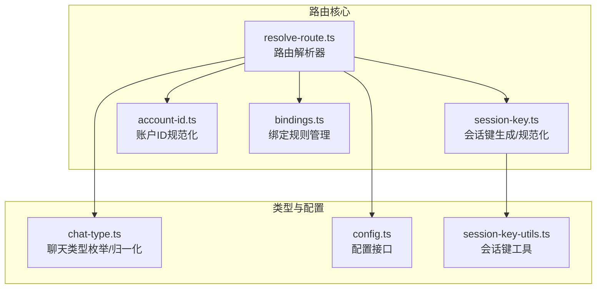
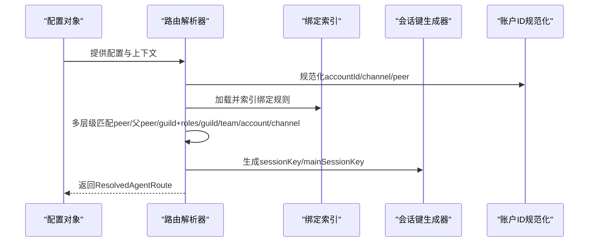
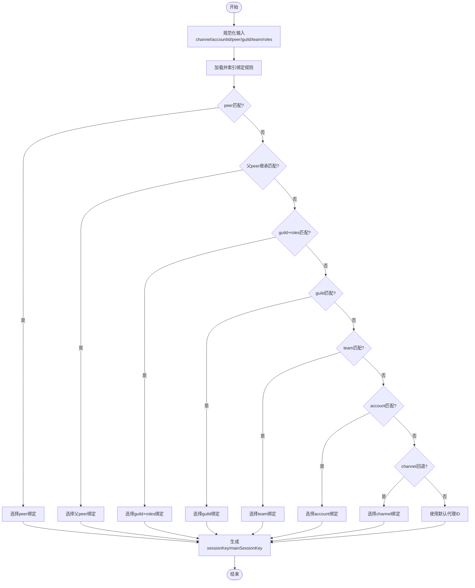
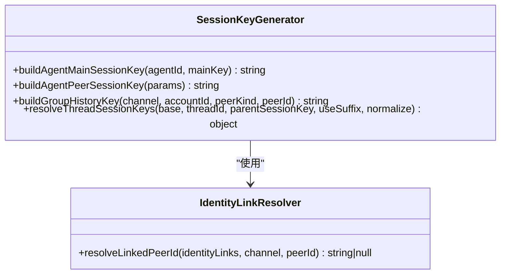
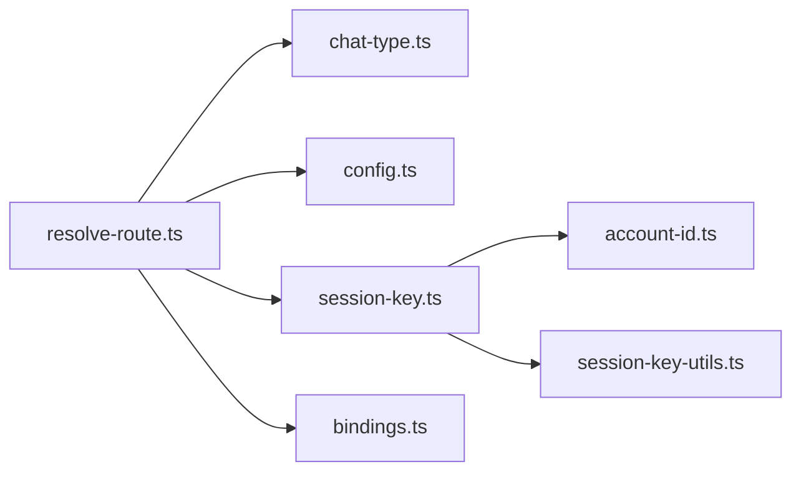

# 消息路由策略

<cite>
**本文档引用的文件**
- [resolve-route.ts](file://src/routing/resolve-route.ts)
- [session-key.ts](file://src/routing/session-key.ts)
- [account-id.ts](file://src/routing/account-id.ts)
- [bindings.ts](file://src/routing/bindings.ts)
- [resolve-route.test.ts](file://src/routing/resolve-route.test.ts)
- [session-key.test.ts](file://src/routing/session-key.test.ts)
- [account-id.test.ts](file://src/routing/account-id.test.ts)
- [chat-type.ts](file://src/channels/chat-type.ts)
- [config.ts](file://src/config/config.ts)
- [session-key-utils.ts](file://src/sessions/session-key-utils.ts)
</cite>

## 目录
1. [简介](#简介)
2. [项目结构](#项目结构)
3. [核心组件](#核心组件)
4. [架构总览](#架构总览)
5. [详细组件分析](#详细组件分析)
6. [依赖关系分析](#依赖关系分析)
7. [性能考量](#性能考量)
8. [故障排查指南](#故障排查指南)
9. [结论](#结论)
10. [附录](#附录)

## 简介
本文件面向OpenClaw的消息路由系统，系统性阐述消息路由算法、会话标识符生成、账户绑定策略、消息优先级处理、路由规则配置、多渠道并发处理与消息去重机制，并提供性能优化、负载均衡与故障转移建议及配置示例与调试方法。

## 项目结构
OpenClaw的路由系统位于src/routing目录，围绕以下关键模块组织：
- 路由解析：resolve-route.ts
- 会话键生成与规范化：session-key.ts
- 账户ID规范化：account-id.ts
- 绑定规则管理：bindings.ts
- 类型与配置支撑：chat-type.ts、config.ts、session-key-utils.ts
- 测试用例：resolve-route.test.ts、session-key.test.ts、account-id.test.ts

**图表来源**
- [resolve-route.ts](file://src/routing/resolve-route.ts#L1-L788)
- [session-key.ts](file://src/routing/session-key.ts#L1-L254)
- [account-id.ts](file://src/routing/account-id.ts#L1-L71)
- [bindings.ts](file://src/routing/bindings.ts#L1-L115)
- [chat-type.ts](file://src/channels/chat-type.ts)
- [config.ts](file://src/config/config.ts#L1-L24)
- [session-key-utils.ts](file://src/sessions/session-key-utils.ts)

**章节来源**
- [resolve-route.ts](file://src/routing/resolve-route.ts#L1-L788)
- [session-key.ts](file://src/routing/session-key.ts#L1-L254)
- [account-id.ts](file://src/routing/account-id.ts#L1-L71)
- [bindings.ts](file://src/routing/bindings.ts#L1-L115)
- [chat-type.ts](file://src/channels/chat-type.ts)
- [config.ts](file://src/config/config.ts#L1-L24)
- [session-key-utils.ts](file://src/sessions/session-key-utils.ts)

## 核心组件
- 路由解析器（resolveAgentRoute）：根据通道、账户、用户身份、群组/频道/直接消息等上下文，按层级匹配绑定规则并生成会话键与目标代理。
- 会话键生成器（buildAgentSessionKey/buildAgentPeerSessionKey）：依据代理ID、通道、账户、对端类型与ID、DM隔离策略与身份映射生成稳定且可持久化的会话键。
- 账户ID规范化器（normalizeAccountId）：统一账户ID格式，避免注入与冲突，支持默认账户回退。
- 绑定规则管理（listBindings/buildChannelAccountBindings）：列举并索引绑定规则，支持账户作用域、任意账户通配、通道级回退等。

**章节来源**
- [resolve-route.ts](file://src/routing/resolve-route.ts#L598-L787)
- [session-key.ts](file://src/routing/session-key.ts#L118-L174)
- [account-id.ts](file://src/routing/account-id.ts#L34-L46)
- [bindings.ts](file://src/routing/bindings.ts#L17-L103)

## 架构总览
路由系统采用“规则分层匹配 + 缓存加速 + 会话键隔离”的设计，确保在多渠道、多账户、多角色场景下具备高可扩展性与稳定性。

**图表来源**
- [resolve-route.ts](file://src/routing/resolve-route.ts#L598-L787)
- [bindings.ts](file://src/routing/bindings.ts#L17-L103)
- [session-key.ts](file://src/routing/session-key.ts#L118-L174)
- [account-id.ts](file://src/routing/account-id.ts#L34-L46)

## 详细组件分析

### 路由解析器（resolveAgentRoute）
- 输入参数：通道名、账户ID、对端信息（kind/id）、线程父对端、群组/团队ID、成员角色ID列表。
- 匹配层级（优先级从高到低）：
  1) 对端绑定（peer）：精确匹配对端kind/id。
  2) 线程父对端继承（parentPeer）：当线程对端不匹配时，尝试父频道/群组绑定。
  3) 群组+角色绑定（guild+roles）：要求同时满足群组ID与至少一个匹配角色。
  4) 群组绑定（guild）：仅群组约束。
  5) 团队绑定（team）：团队约束。
  6) 账户绑定（account）：账户作用域绑定。
  7) 通道回退（channel）：任意账户的通道级回退。
- 默认策略：若无匹配，使用默认代理ID与主会话键。
- 会话键生成：基于代理ID、通道、账户、对端类型与ID、DM隔离策略与身份映射。
- 缓存策略：按配置快照缓存已评估绑定与路由结果，避免重复扫描与计算。

**图表来源**
- [resolve-route.ts](file://src/routing/resolve-route.ts#L598-L787)

**章节来源**
- [resolve-route.ts](file://src/routing/resolve-route.ts#L598-L787)

### 会话键生成与规范化（session-key.ts）
- 主会话键：agent:{agentId}:{mainKey}
- 直接消息（DM）隔离策略：
  - main：共享主会话
  - per-peer：按对端ID隔离
  - per-channel-peer：按通道+对端隔离
  - per-account-channel-peer：按账户+通道+对端隔离
- 身份映射：通过identityLinks将不同平台/通道的对端ID映射到同一规范ID，提升跨渠道一致性。
- 线程会话键：支持在基础会话键后追加thread标识，或复用父会话键。
- 兼容性：识别并兼容历史DM标记与子代理深度解析。

**图表来源**
- [session-key.ts](file://src/routing/session-key.ts#L118-L254)

**章节来源**
- [session-key.ts](file://src/routing/session-key.ts#L118-L174)
- [session-key.ts](file://src/routing/session-key.ts#L176-L220)
- [session-key.ts](file://src/routing/session-key.ts#L234-L254)

### 账户绑定策略（bindings.ts 与 account-id.ts）
- 账户ID规范化：去除空白、转小写、替换非法字符、屏蔽原型污染关键字；支持可选账户ID返回undefined。
- 绑定规则：
  - 账户作用域：明确指定accountId
  - 任意账户：accountId="*"
  - 通道回退：无accountId约束
- 绑定索引：按通道/账户构建索引，支持快速查找与合并源顺序保持。

**图表来源**
- [bindings.ts](file://src/routing/bindings.ts#L17-L103)
- [account-id.ts](file://src/routing/account-id.ts#L34-L46)

**章节来源**
- [bindings.ts](file://src/routing/bindings.ts#L17-L103)
- [account-id.ts](file://src/routing/account-id.ts#L34-L46)

### 消息优先级与去重机制
- 优先级：路由解析器按层级顺序匹配，先精确后宽松，确保最贴合的绑定被选择。
- 去重：会话键唯一标识一次对话状态，相同会话键对应相同代理与上下文，天然避免重复处理同一条消息。
- 线程去重：通过线程会话键与父会话键关联，保证线程内消息有序且不重复。

**章节来源**
- [resolve-route.ts](file://src/routing/resolve-route.ts#L706-L784)
- [session-key.ts](file://src/routing/session-key.ts#L234-L254)

### 多渠道并发处理
- 并发模型：路由解析器对每个请求独立计算，绑定与路由结果缓存按配置快照维度存储，避免重复扫描。
- 缓存维度：通道×账户组合的绑定集合与索引，以及最终路由结果的键值缓存，均设置最大容量阈值，超过则清空重建，保障内存占用可控。

**章节来源**
- [resolve-route.ts](file://src/routing/resolve-route.ts#L185-L196)
- [resolve-route.ts](file://src/routing/resolve-route.ts#L492-L510)

## 依赖关系分析
- resolve-route.ts依赖：
  - chat-type.ts：对端类型归一化
  - config.ts：配置对象与agents默认代理解析
  - session-key.ts：会话键生成与规范化
  - bindings.ts：绑定规则列举与索引
  - session-key-utils.ts：会话键解析与类型推断
- session-key.ts依赖：
  - account-id.ts：账户ID规范化
  - session-key-utils.ts：会话键解析与类型推断

**图表来源**
- [resolve-route.ts](file://src/routing/resolve-route.ts#L1-L16)
- [session-key.ts](file://src/routing/session-key.ts#L1-L17)

**章节来源**
- [resolve-route.ts](file://src/routing/resolve-route.ts#L1-L16)
- [session-key.ts](file://src/routing/session-key.ts#L1-L17)

## 性能考量
- 缓存策略
  - 已评估绑定缓存：按通道×账户维度缓存绑定集合与索引，超过阈值自动清理。
  - 路由结果缓存：按输入参数构建键，命中即返回，避免重复计算。
- 计算复杂度
  - 绑定索引构建：O(B)，B为绑定数量
  - 单次路由匹配：O(T+C)，T为层级数（常量级），C为候选绑定数量（通常很小）
- 内存控制
  - 设置最大缓存键数上限，超限清空并重建，防止内存泄漏
- I/O与配置快照
  - 仅在配置变更时重建缓存，运行期读取成本极低

**章节来源**
- [resolve-route.ts](file://src/routing/resolve-route.ts#L185-L196)
- [resolve-route.ts](file://src/routing/resolve-route.ts#L492-L510)

## 故障排查指南
- 常见问题定位
  - 未匹配到任何绑定：检查通道名是否正确、是否存在accountId="*"的通道回退绑定。
  - 线程继承未生效：确认parentPeer是否为空或无效，以及父peer绑定是否存在。
  - 角色路由不生效：确认memberRoleIds是否传入、角色ID大小写与配置一致。
  - DM隔离异常：核对dmScope配置与期望的隔离粒度一致。
- 调试方法
  - 启用详细日志：路由解析器在开启详细日志时会输出绑定列表与匹配过程，便于定位。
  - 使用测试用例：参考resolve-route.test.ts中的大量场景用例，逐项比对期望行为。
  - 验证会话键：使用session-key.test.ts中的用例验证会话键生成与兼容性。
  - 账户ID校验：使用account-id.test.ts验证规范化与安全过滤逻辑。

**章节来源**
- [resolve-route.ts](file://src/routing/resolve-route.ts#L613-L698)
- [resolve-route.test.ts](file://src/routing/resolve-route.test.ts#L1-L812)
- [session-key.test.ts](file://src/routing/session-key.test.ts#L1-L133)
- [account-id.test.ts](file://src/routing/account-id.test.ts#L1-L39)

## 结论
OpenClaw的消息路由系统通过“层级化匹配 + 缓存加速 + 会话键隔离”实现了高可用、高性能与强一致性的消息分发。其配置灵活、扩展性强，适用于多渠道、多账户、多角色的复杂场景，并提供了完善的测试与调试手段以保障稳定性。

## 附录

### 路由配置示例（说明性）
- 基础绑定
  - 通道：discord
  - 账户：biz
  - 对端：direct(+1000)
  - 代理：a
- 群组+角色绑定
  - 通道：discord
  - 群组：g1
  - 角色：["r1"]
  - 代理：opus
- 通道回退
  - 通道：whatsapp
  - 账户：*
  - 代理：any

说明：以上为配置语义示例，具体字段请参考配置类型定义与绑定规则实现。

**章节来源**
- [resolve-route.ts](file://src/routing/resolve-route.ts#L26-L57)
- [bindings.ts](file://src/routing/bindings.ts#L17-L46)