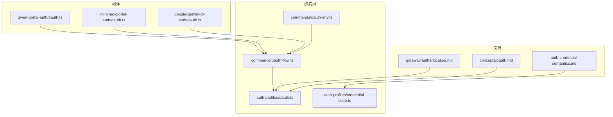
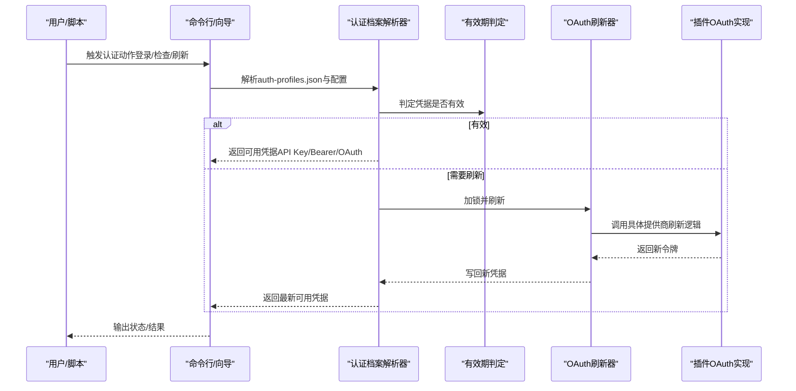
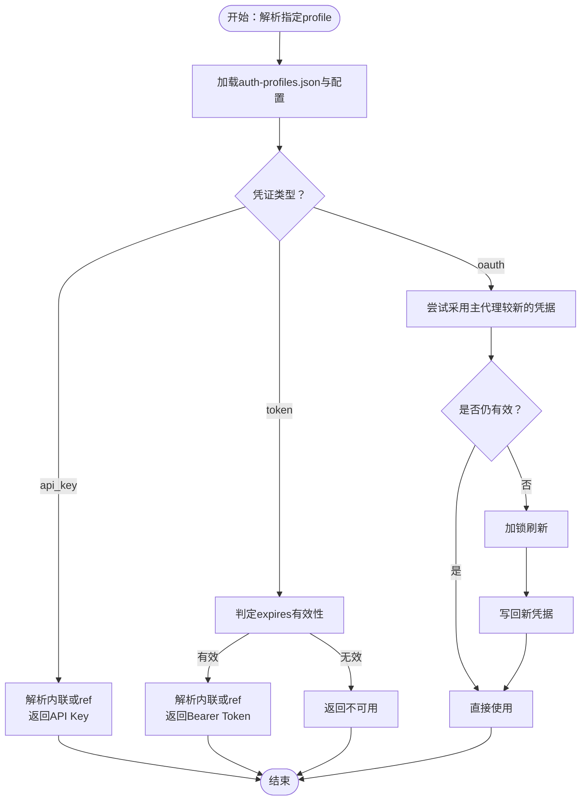
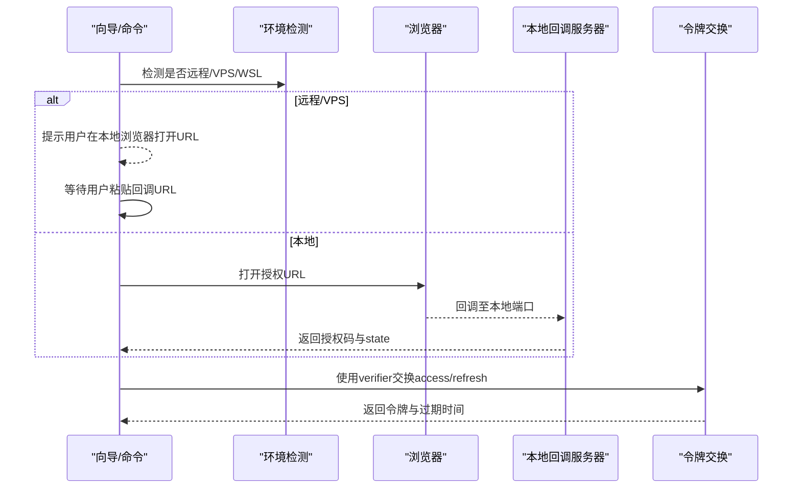
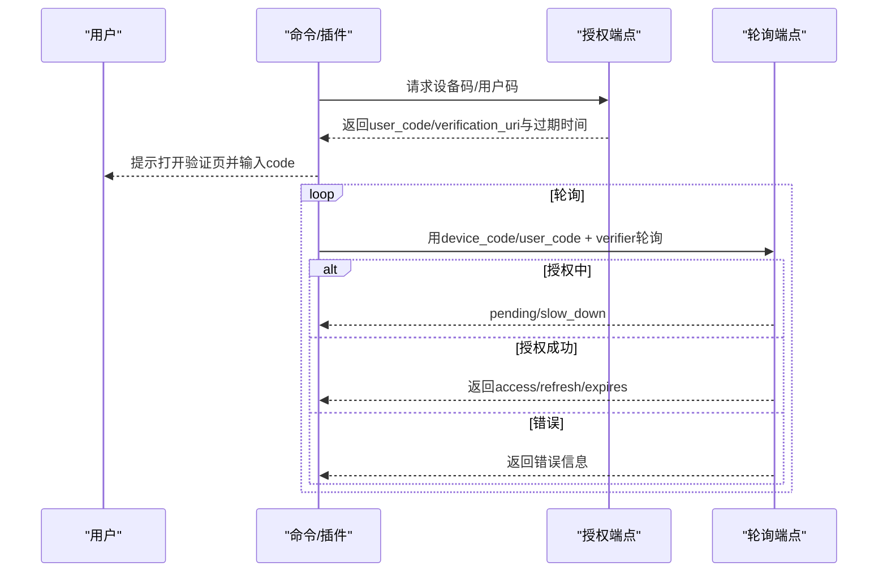
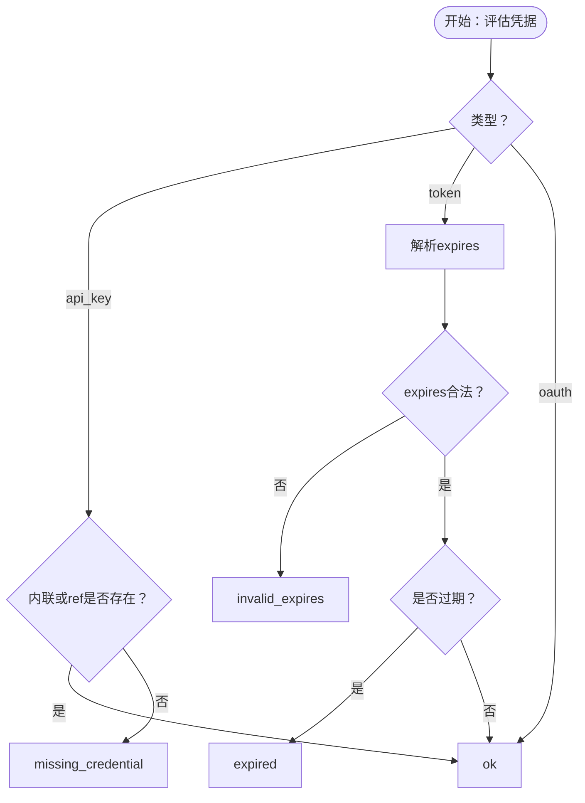
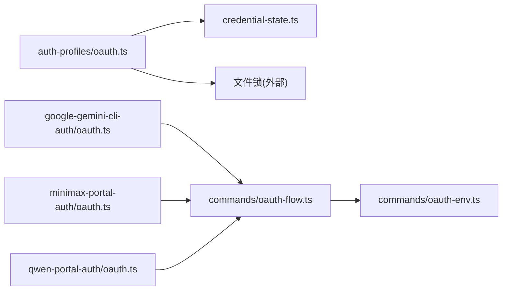

# 渠道认证机制

<cite>
**本文引用的文件**
- [docs/auth-credential-semantics.md](file://docs/auth-credential-semantics.md)
- [docs/concepts/oauth.md](file://docs/concepts/oauth.md)
- [docs/gateway/authentication.md](file://docs/gateway/authentication.md)
- [src/agents/auth-profiles/oauth.ts](file://src/agents/auth-profiles/oauth.ts)
- [src/agents/auth-profiles/credential-state.ts](file://src/agents/auth-profiles/credential-state.ts)
- [src/commands/oauth-flow.ts](file://src/commands/oauth-flow.ts)
- [src/commands/oauth-env.ts](file://src/commands/oauth-env.ts)
- [extensions/google-gemini-cli-auth/oauth.ts](file://extensions/google-gemini-cli-auth/oauth.ts)
- [extensions/minimax-portal-auth/oauth.ts](file://extensions/minimax-portal-auth/oauth.ts)
- [extensions/qwen-portal-auth/oauth.ts](file://extensions/qwen-portal-auth/oauth.ts)
</cite>

## 目录
1. [简介](#简介)
2. [项目结构](#项目结构)
3. [核心组件](#核心组件)
4. [架构总览](#架构总览)
5. [详细组件分析](#详细组件分析)
6. [依赖关系分析](#依赖关系分析)
7. [性能考量](#性能考量)
8. [故障排除指南](#故障排除指南)
9. [结论](#结论)
10. [附录](#附录)

## 简介
本文件面向OpenClaw渠道认证体系，系统化阐述以下能力与实现：
- OAuth认证流程（含PKCE、回调捕获、自动刷新）
- API密钥与静态凭据管理
- 设备码/用户码配对登录（QR类流程）
- 令牌刷新策略与多账户路由
- 认证状态监控、权限与访问控制机制

目标是帮助开发者与运维人员理解认证存储、解析、刷新与故障处理的全链路行为，并提供可操作的配置示例、安全建议与排障指引。

## 项目结构
围绕认证的关键目录与文件：
- 文档层：认证语义、OAuth概念、网关认证与自动化监控
- 运行时层：认证档案解析、OAuth刷新、凭据有效期判定
- 插件层：各平台OAuth实现（Google Gemini CLI、MiniMax门户、Qwen门户）

**图表来源**
- [docs/auth-credential-semantics.md](file://docs/auth-credential-semantics.md#L1-L46)
- [docs/concepts/oauth.md](file://docs/concepts/oauth.md#L1-L159)
- [docs/gateway/authentication.md](file://docs/gateway/authentication.md#L1-L180)
- [src/agents/auth-profiles/oauth.ts](file://src/agents/auth-profiles/oauth.ts#L1-L492)
- [src/agents/auth-profiles/credential-state.ts](file://src/agents/auth-profiles/credential-state.ts#L1-L75)
- [src/commands/oauth-flow.ts](file://src/commands/oauth-flow.ts#L1-L54)
- [src/commands/oauth-env.ts](file://src/commands/oauth-env.ts#L1-L23)
- [extensions/google-gemini-cli-auth/oauth.ts](file://extensions/google-gemini-cli-auth/oauth.ts#L1-L735)
- [extensions/minimax-portal-auth/oauth.ts](file://extensions/minimax-portal-auth/oauth.ts#L1-L245)
- [extensions/qwen-portal-auth/oauth.ts](file://extensions/qwen-portal-auth/oauth.ts#L1-L183)

**章节来源**
- [docs/auth-credential-semantics.md](file://docs/auth-credential-semantics.md#L1-L46)
- [docs/concepts/oauth.md](file://docs/concepts/oauth.md#L1-L159)
- [docs/gateway/authentication.md](file://docs/gateway/authentication.md#L1-L180)

## 核心组件
- 认证档案解析与选择：负责从auth-profiles.json中解析API Key、Bearer Token与OAuth凭证，并按配置顺序与有效期进行选择。
- 凭据有效期判定：统一的过期/无效规则，支持“缺失凭据”“无效expires”“已过期”等稳定原因码。
- OAuth刷新与锁：在文件锁保护下执行刷新，避免并发冲突；支持多提供商差异化刷新逻辑。
- OAuth交互流程：根据环境（本地/远程/VPS）自动切换浏览器打开或手动粘贴回调模式。
- 设备码/用户码配对登录：面向无浏览器或受限环境的设备码/用户码授权流程（如Qwen、MiniMax门户）。

**章节来源**
- [src/agents/auth-profiles/oauth.ts](file://src/agents/auth-profiles/oauth.ts#L1-L492)
- [src/agents/auth-profiles/credential-state.ts](file://src/agents/auth-profiles/credential-state.ts#L1-L75)
- [src/commands/oauth-flow.ts](file://src/commands/oauth-flow.ts#L1-L54)
- [src/commands/oauth-env.ts](file://src/commands/oauth-env.ts#L1-L23)
- [extensions/qwen-portal-auth/oauth.ts](file://extensions/qwen-portal-auth/oauth.ts#L1-L183)
- [extensions/minimax-portal-auth/oauth.ts](file://extensions/minimax-portal-auth/oauth.ts#L1-L245)

## 架构总览
OpenClaw认证体系以“认证档案”为中心，结合“凭据解析器”“有效期判定”“OAuth刷新器”“插件OAuth实现”和“环境感知的交互流程”，形成端到端的认证闭环。

**图表来源**
- [src/agents/auth-profiles/oauth.ts](file://src/agents/auth-profiles/oauth.ts#L158-L215)
- [src/agents/auth-profiles/credential-state.ts](file://src/agents/auth-profiles/credential-state.ts#L13-L24)
- [src/commands/oauth-flow.ts](file://src/commands/oauth-flow.ts#L8-L53)
- [extensions/google-gemini-cli-auth/oauth.ts](file://extensions/google-gemini-cli-auth/oauth.ts#L659-L734)

## 详细组件分析

### 组件A：认证档案解析与OAuth刷新
职责与要点：
- 支持api_key、token、oauth三种类型凭证的解析与兼容性判断。
- 在有效期之内直接使用；过期则在文件锁保护下刷新。
- 对特定提供商（如chutes、qwen-portal）采用专用刷新逻辑。
- 兼容“oauth”与“token”两种Bearer路径，提升互换性。
- 提供主代理凭据继承与回退策略（如OpenAI Codex刷新失败时的缓存回退）。

**图表来源**
- [src/agents/auth-profiles/oauth.ts](file://src/agents/auth-profiles/oauth.ts#L309-L491)
- [src/agents/auth-profiles/credential-state.ts](file://src/agents/auth-profiles/credential-state.ts#L13-L24)

**章节来源**
- [src/agents/auth-profiles/oauth.ts](file://src/agents/auth-profiles/oauth.ts#L1-L492)
- [src/agents/auth-profiles/credential-state.ts](file://src/agents/auth-profiles/credential-state.ts#L1-L75)

### 组件B：OAuth交互流程（浏览器/手动）
职责与要点：
- 自动识别远程/VPS/WSL等环境，切换“手动粘贴回调URL”模式。
- 本地环境优先尝试自动打开浏览器；失败时回退到手动输入。
- 通过回调服务器捕获授权码，校验state一致性后交换令牌。

**图表来源**
- [src/commands/oauth-env.ts](file://src/commands/oauth-env.ts#L3-L22)
- [src/commands/oauth-flow.ts](file://src/commands/oauth-flow.ts#L8-L53)
- [extensions/google-gemini-cli-auth/oauth.ts](file://extensions/google-gemini-cli-auth/oauth.ts#L305-L396)
- [extensions/google-gemini-cli-auth/oauth.ts](file://extensions/google-gemini-cli-auth/oauth.ts#L398-L450)

**章节来源**
- [src/commands/oauth-env.ts](file://src/commands/oauth-env.ts#L1-L23)
- [src/commands/oauth-flow.ts](file://src/commands/oauth-flow.ts#L1-L54)
- [extensions/google-gemini-cli-auth/oauth.ts](file://extensions/google-gemini-cli-auth/oauth.ts#L1-L735)

### 组件C：设备码/用户码配对登录（QR类流程）
职责与要点：
- Qwen门户：设备码授权，轮询换取令牌，支持慢速降级与超时控制。
- MiniMax门户：用户码授权，轮询换取令牌，带状态校验与超时控制。
- 两类流程均通过浏览器打开验证页，用户在另一端完成授权后轮询成功。

**图表来源**
- [extensions/qwen-portal-auth/oauth.ts](file://extensions/qwen-portal-auth/oauth.ts#L37-L66)
- [extensions/qwen-portal-auth/oauth.ts](file://extensions/qwen-portal-auth/oauth.ts#L68-L130)
- [extensions/qwen-portal-auth/oauth.ts](file://extensions/qwen-portal-auth/oauth.ts#L132-L182)
- [extensions/minimax-portal-auth/oauth.ts](file://extensions/minimax-portal-auth/oauth.ts#L62-L101)
- [extensions/minimax-portal-auth/oauth.ts](file://extensions/minimax-portal-auth/oauth.ts#L103-L182)

**章节来源**
- [extensions/qwen-portal-auth/oauth.ts](file://extensions/qwen-portal-auth/oauth.ts#L1-L183)
- [extensions/minimax-portal-auth/oauth.ts](file://extensions/minimax-portal-auth/oauth.ts#L1-L245)

### 组件D：凭据语义与有效期判定
职责与要点：
- 定义稳定的原因码：ok、missing_credential、invalid_expires、expired、unresolved_ref。
- 对api_key：只要内联值或ref任一存在即视为有效。
- 对token：需同时满足“有值”和“expires合法且未过期”。
- 对oauth：由解析器决定是否有效并触发刷新。

**图表来源**
- [docs/auth-credential-semantics.md](file://docs/auth-credential-semantics.md#L12-L46)
- [src/agents/auth-profiles/credential-state.ts](file://src/agents/auth-profiles/credential-state.ts#L13-L24)

**章节来源**
- [docs/auth-credential-semantics.md](file://docs/auth-credential-semantics.md#L1-L46)
- [src/agents/auth-profiles/credential-state.ts](file://src/agents/auth-profiles/credential-state.ts#L1-L75)

## 依赖关系分析
- 运行时依赖
  - 认证档案解析器依赖凭据有效期判定模块与配置加载。
  - OAuth刷新器依赖提供商SDK与文件锁，确保并发安全。
- 插件依赖
  - 各平台OAuth插件依赖通用的PKCE生成与表单编码工具。
  - 设备码/用户码插件依赖HTTP轮询与超时控制。
- 环境感知
  - 远程/VPS/WSL环境通过环境变量与显示系统检测，自动切换交互模式。

**图表来源**
- [src/agents/auth-profiles/oauth.ts](file://src/agents/auth-profiles/oauth.ts#L1-L492)
- [src/agents/auth-profiles/credential-state.ts](file://src/agents/auth-profiles/credential-state.ts#L1-L75)
- [src/commands/oauth-flow.ts](file://src/commands/oauth-flow.ts#L1-L54)
- [src/commands/oauth-env.ts](file://src/commands/oauth-env.ts#L1-L23)
- [extensions/google-gemini-cli-auth/oauth.ts](file://extensions/google-gemini-cli-auth/oauth.ts#L1-L735)
- [extensions/minimax-portal-auth/oauth.ts](file://extensions/minimax-portal-auth/oauth.ts#L1-L245)
- [extensions/qwen-portal-auth/oauth.ts](file://extensions/qwen-portal-auth/oauth.ts#L1-L183)

**章节来源**
- [src/agents/auth-profiles/oauth.ts](file://src/agents/auth-profiles/oauth.ts#L1-L492)
- [src/commands/oauth-flow.ts](file://src/commands/oauth-flow.ts#L1-L54)
- [src/commands/oauth-env.ts](file://src/commands/oauth-env.ts#L1-L23)
- [extensions/google-gemini-cli-auth/oauth.ts](file://extensions/google-gemini-cli-auth/oauth.ts#L1-L735)
- [extensions/minimax-portal-auth/oauth.ts](file://extensions/minimax-portal-auth/oauth.ts#L1-L245)
- [extensions/qwen-portal-auth/oauth.ts](file://extensions/qwen-portal-auth/oauth.ts#L1-L183)

## 性能考量
- 刷新并发控制：通过文件锁串行化刷新，避免竞态与重复刷新。
- 轮询节流：设备码/用户码轮询在等待期间动态增加间隔上限，降低请求压力。
- 本地回调降级：当本地端口占用或无法绑定时，自动切换为手动粘贴回调模式，减少重试成本。
- 主代理凭据继承：在次级代理无新鲜凭据时，优先复用主代理凭据，减少额外网络往返。

[本节为通用指导，不直接分析具体文件]

## 故障排除指南
常见问题与定位思路：
- “无可用凭据/凭据缺失”
  - 检查auth-profiles.json与配置顺序；确认API Key或Token存在且未过期。
  - 参考凭据语义中的原因码定位根因。
- “令牌过期/即将过期”
  - 使用状态检查命令查看当前profile状态；必要时重新登录。
  - 若为OAuth，确认刷新流程是否成功；若失败，查看日志提示并重试。
- “远程/VPS无法自动打开浏览器”
  - 确认环境检测逻辑；改为手动粘贴回调URL。
  - 如本地回调端口被占用，改用手动模式。
- “设备码/用户码轮询超时”
  - 检查验证页是否正确打开；确认用户已在另一端完成授权。
  - 增大超时容忍或缩短轮询间隔上限。
- “主代理凭据未继承”
  - 确认主代理存在较新且未过期的凭据；检查保存与读取权限。

**章节来源**
- [docs/gateway/authentication.md](file://docs/gateway/authentication.md#L160-L179)
- [docs/auth-credential-semantics.md](file://docs/auth-credential-semantics.md#L12-L46)
- [src/agents/auth-profiles/oauth.ts](file://src/agents/auth-profiles/oauth.ts#L434-L475)
- [src/commands/oauth-env.ts](file://src/commands/oauth-env.ts#L3-L22)
- [extensions/qwen-portal-auth/oauth.ts](file://extensions/qwen-portal-auth/oauth.ts#L155-L182)
- [extensions/minimax-portal-auth/oauth.ts](file://extensions/minimax-portal-auth/oauth.ts#L211-L244)

## 结论
OpenClaw的渠道认证体系以“认证档案”为核心，结合“凭据解析/有效期判定/自动刷新/插件化OAuth实现”，覆盖了API Key、Bearer Token与OAuth三大主流认证方式，并针对远程/VPS与无浏览器场景提供了设备码/用户码配对登录。通过稳定的语义与原因码、严格的过期判定与并发控制，以及完善的回退与继承策略，整体方案具备良好的可靠性与可维护性。

[本节为总结，不直接分析具体文件]

## 附录

### 配置示例与最佳实践
- API Key认证（推荐用于长期网关）
  - 将Provider API Key注入环境变量或通过向导写入；重启服务后验证状态。
  - 参考：[网关认证文档](file://docs/gateway/authentication.md#L21-L56)
- OAuth认证（支持多账户与多提供商）
  - 使用向导触发OAuth登录；支持远程/VPS自动降级为手动模式。
  - 参考：[OAuth概念](file://docs/concepts/oauth.md#L83-L111)
- 设备码/用户码配对登录
  - Qwen门户与MiniMax门户均支持；注意轮询超时与慢速降级。
  - 参考：[Qwen门户OAuth](file://extensions/qwen-portal-auth/oauth.ts#L132-L182)、[MiniMax门户OAuth](file://extensions/minimax-portal-auth/oauth.ts#L184-L244)

### 安全考虑
- 凭据存储位置与权限
  - 凭据按代理隔离存储于状态目录；避免在共享主机上泄露。
  - 参考：[OAuth存储布局](file://docs/concepts/oauth.md#L41-L53)
- 令牌刷新与失效
  - 刷新失败时保留现有凭据并提示重试；避免无保护的凭据覆盖。
  - 参考：[OAuth刷新与回退](file://src/agents/auth-profiles/oauth.ts#L459-L475)
- 环境适配
  - 远程/VPS场景禁用自动浏览器打开，强制手动模式，降低中间人风险。
  - 参考：[环境检测](file://src/commands/oauth-env.ts#L3-L22)

### 认证状态监控与自动化
- 状态检查与退出码
  - 使用状态检查命令进行自动化巡检；支持“缺失/即将过期”退出码。
  - 参考：[网关认证文档](file://docs/gateway/authentication.md#L105-L112)
- 自动化脚本与守护进程
  - systemd/Termux等环境下可配合认证监控脚本实现自动重试与告警。
  - 参考：[自动化监控](file://docs/automation/auth-monitoring.md)

**章节来源**
- [docs/gateway/authentication.md](file://docs/gateway/authentication.md#L105-L112)
- [docs/concepts/oauth.md](file://docs/concepts/oauth.md#L41-L53)
- [src/commands/oauth-env.ts](file://src/commands/oauth-env.ts#L3-L22)
- [src/agents/auth-profiles/oauth.ts](file://src/agents/auth-profiles/oauth.ts#L459-L475)
- [extensions/qwen-portal-auth/oauth.ts](file://extensions/qwen-portal-auth/oauth.ts#L132-L182)
- [extensions/minimax-portal-auth/oauth.ts](file://extensions/minimax-portal-auth/oauth.ts#L184-L244)