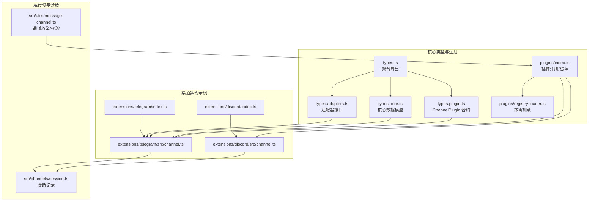
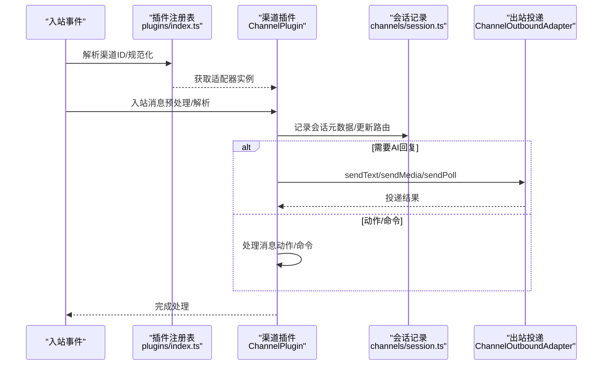
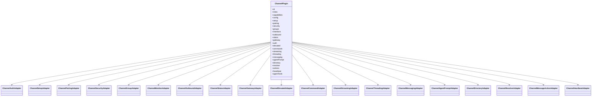
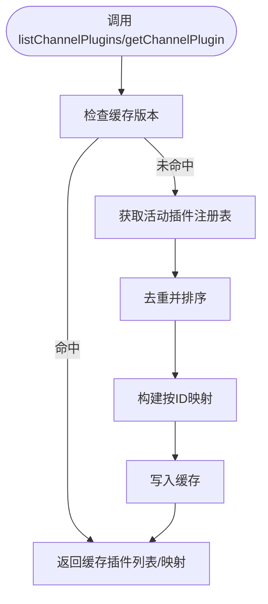
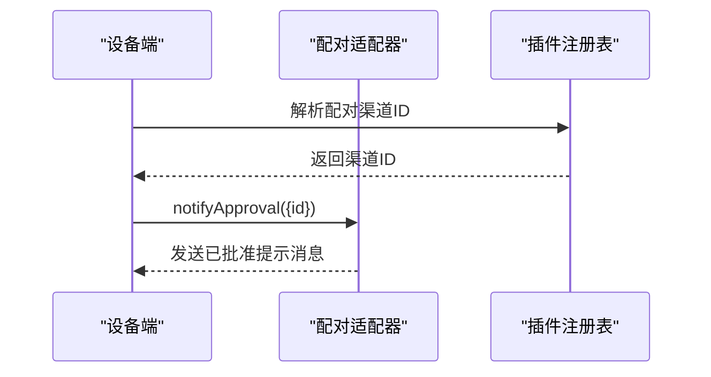
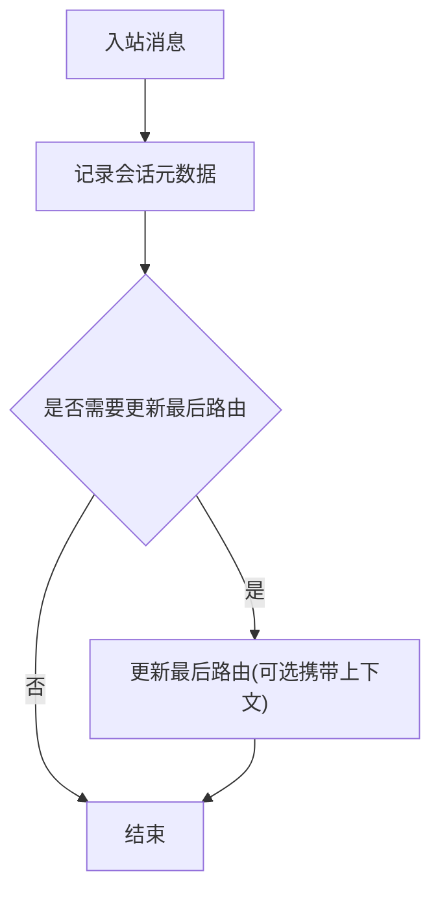
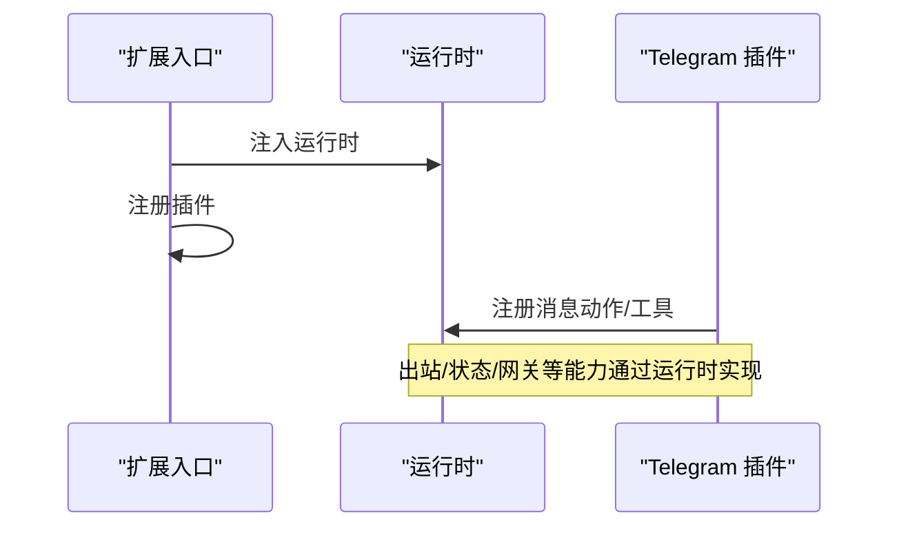
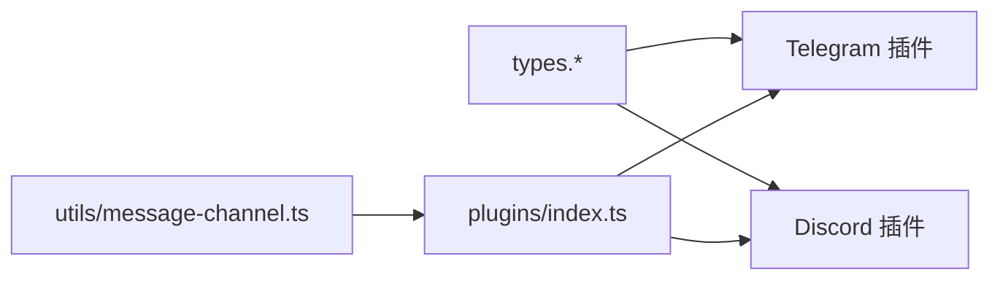

# 渠道适配器开发

<cite>
**本文引用的文件**
- [src/channels/plugins/types.ts](file://src/channels/plugins/types.ts)
- [src/channels/plugins/types.adapters.ts](file://src/channels/plugins/types.adapters.ts)
- [src/channels/plugins/types.core.ts](file://src/channels/plugins/types.core.ts)
- [src/channels/plugins/types.plugin.ts](file://src/channels/plugins/types.plugin.ts)
- [src/channels/plugins/index.ts](file://src/channels/plugins/index.ts)
- [src/channels/plugins/pairing.ts](file://src/channels/plugins/pairing.ts)
- [src/channels/plugins/registry-loader.ts](file://src/channels/plugins/registry-loader.ts)
- [src/channels/session.ts](file://src/channels/session.ts)
- [src/utils/message-channel.ts](file://src/utils/message-channel.ts)
- [extensions/telegram/index.ts](file://extensions/telegram/index.ts)
- [extensions/telegram/src/channel.ts](file://extensions/telegram/src/channel.ts)
- [extensions/discord/index.ts](file://extensions/discord/index.ts)
- [extensions/discord/src/channel.ts](file://extensions/discord/src/channel.ts)
- [docs/gateway/bridge-protocol.md](file://docs/gateway/bridge-protocol.md)
- [test/setup.ts](file://test/setup.ts)
- [scripts/dev/test-device-pair-telegram.ts](file://scripts/dev/test-device-pair-telegram.ts)
</cite>

## 目录
1. [简介](#简介)
2. [项目结构](#项目结构)
3. [核心组件](#核心组件)
4. [架构总览](#架构总览)
5. [详细组件分析](#详细组件分析)
6. [依赖关系分析](#依赖关系分析)
7. [性能考虑](#性能考虑)
8. [故障排查指南](#故障排查指南)
9. [结论](#结论)
10. [附录](#附录)

## 简介
本指南面向希望在 OpenClaw 中开发“渠道适配器”的工程师，系统讲解适配器的架构模式、接口规范与实现要求，并提供开发模板、测试框架与调试工具使用方法。文档以现有 Telegram、Discord 等渠道插件为蓝本，结合通用类型定义与运行时注册机制，帮助你快速构建可扩展、可维护且高性能的渠道适配器。

## 项目结构
OpenClaw 的渠道适配器采用“插件化 + 运行时注册”的架构：核心类型与适配器接口集中在 channels/plugins 下，具体渠道（如 Telegram、Discord）以独立扩展的形式实现并注册到运行时。

**图表来源**
- [src/channels/plugins/types.ts](file://src/channels/plugins/types.ts#L1-L66)
- [src/channels/plugins/types.adapters.ts](file://src/channels/plugins/types.adapters.ts#L1-L384)
- [src/channels/plugins/types.core.ts](file://src/channels/plugins/types.core.ts#L1-L391)
- [src/channels/plugins/types.plugin.ts](file://src/channels/plugins/types.plugin.ts#L1-L86)
- [src/channels/plugins/index.ts](file://src/channels/plugins/index.ts#L1-L118)
- [src/channels/plugins/registry-loader.ts](file://src/channels/plugins/registry-loader.ts#L1-L35)
- [extensions/telegram/index.ts](file://extensions/telegram/index.ts#L1-L18)
- [extensions/telegram/src/channel.ts](file://extensions/telegram/src/channel.ts#L1-L580)
- [extensions/discord/index.ts](file://extensions/discord/index.ts#L1-L20)
- [extensions/discord/src/channel.ts](file://extensions/discord/src/channel.ts#L1-L472)
- [src/channels/session.ts](file://src/channels/session.ts#L1-L82)
- [src/utils/message-channel.ts](file://src/utils/message-channel.ts#L95-L133)

**章节来源**
- [src/channels/plugins/types.ts](file://src/channels/plugins/types.ts#L1-L66)
- [src/channels/plugins/index.ts](file://src/channels/plugins/index.ts#L1-L118)
- [src/channels/plugins/registry-loader.ts](file://src/channels/plugins/registry-loader.ts#L1-L35)
- [extensions/telegram/index.ts](file://extensions/telegram/index.ts#L1-L18)
- [extensions/discord/index.ts](file://extensions/discord/index.ts#L1-L20)
- [src/channels/session.ts](file://src/channels/session.ts#L1-L82)
- [src/utils/message-channel.ts](file://src/utils/message-channel.ts#L95-L133)

## 核心组件
- 适配器接口族：负责认证、配置、网关、出站、状态、安全、分组、提及、流式、线程、目录、解析、动作、心跳等能力。
- 核心数据模型：账户快照、日志句柄、线程上下文、消息动作上下文、轮询上下文等。
- 插件合约：ChannelPlugin 定义了渠道插件的完整能力清单与可选扩展点。
- 注册与缓存：运行时通过插件注册表统一管理渠道插件，支持去重、排序与按 ID 查询。
- 配对适配器：用于“设备配对”场景，提供允许列表条目归一化与审批通知能力。
- 会话与通道：会话记录与通道枚举/校验贯穿入站消息处理与出站投递。

**章节来源**
- [src/channels/plugins/types.adapters.ts](file://src/channels/plugins/types.adapters.ts#L24-L384)
- [src/channels/plugins/types.core.ts](file://src/channels/plugins/types.core.ts#L11-L391)
- [src/channels/plugins/types.plugin.ts](file://src/channels/plugins/types.plugin.ts#L49-L86)
- [src/channels/plugins/index.ts](file://src/channels/plugins/index.ts#L14-L84)
- [src/channels/plugins/pairing.ts](file://src/channels/plugins/pairing.ts#L1-L49)
- [src/channels/session.ts](file://src/channels/session.ts#L41-L82)

## 架构总览
下图展示了从“入站事件”到“AI 回复/动作执行”的典型流程，以及适配器在其中的角色分工。

**图表来源**
- [src/channels/plugins/index.ts](file://src/channels/plugins/index.ts#L74-L84)
- [src/channels/plugins/types.adapters.ts](file://src/channels/plugins/types.adapters.ts#L108-L125)
- [src/channels/session.ts](file://src/channels/session.ts#L41-L82)

## 详细组件分析

### 适配器接口规范与职责边界
- 认证与登录：支持常规登录与二维码登录流程。
- 配置与设置：账户列表、默认账户、启用/禁用、删除账户、描述快照、允许来源解析与格式化、默认目标解析。
- 出站投递：统一上下文，支持文本、媒体、轮询；可自定义目标解析与分块策略。
- 状态与健康：探针、审计、快照构建、运行态汇总、问题收集。
- 安全与分组：私聊策略、允许来源归一化、警告收集。
- 网关生命周期：启动/停止账户、登出。
- 消息动作与线程：动作发现/执行、线程上下文构建、回复模式解析。
- 目录与解析：自/成员/群组列表、在线列表、目标解析。
- 提及与流式：提及剥离、流式合并策略。

**图表来源**
- [src/channels/plugins/types.plugin.ts](file://src/channels/plugins/types.plugin.ts#L49-L86)
- [src/channels/plugins/types.adapters.ts](file://src/channels/plugins/types.adapters.ts#L24-L384)

**章节来源**
- [src/channels/plugins/types.adapters.ts](file://src/channels/plugins/types.adapters.ts#L24-L384)
- [src/channels/plugins/types.plugin.ts](file://src/channels/plugins/types.plugin.ts#L49-L86)

### 插件注册与按需加载
- 插件注册表：集中管理渠道插件，去重、排序、按 ID 快速查询。
- 缓存策略：基于注册表版本号缓存，避免重复解析。
- 按需加载器：针对特定值的解析器，带缓存与注册表变更失效逻辑。

**图表来源**
- [src/channels/plugins/index.ts](file://src/channels/plugins/index.ts#L42-L84)
- [src/channels/plugins/registry-loader.ts](file://src/channels/plugins/registry-loader.ts#L9-L35)

**章节来源**
- [src/channels/plugins/index.ts](file://src/channels/plugins/index.ts#L42-L84)
- [src/channels/plugins/registry-loader.ts](file://src/channels/plugins/registry-loader.ts#L9-L35)

### 设备配对适配器
- 能力：ID 标签、允许来源条目归一化、审批通知。
- 使用：列出支持配对的渠道、解析配对渠道、获取配对适配器并进行审批通知。

**图表来源**
- [src/channels/plugins/pairing.ts](file://src/channels/plugins/pairing.ts#L11-L49)
- [src/channels/plugins/index.ts](file://src/channels/plugins/index.ts#L78-L84)

**章节来源**
- [src/channels/plugins/pairing.ts](file://src/channels/plugins/pairing.ts#L1-L49)

### 会话与消息处理
- 会话记录：入站消息触发会话元数据记录，必要时更新最后路由。
- 通道校验：提供“可投递通道”“网关通道”“别名集合”等枚举与校验函数。

**图表来源**
- [src/channels/session.ts](file://src/channels/session.ts#L41-L82)
- [src/utils/message-channel.ts](file://src/utils/message-channel.ts#L95-L133)

**章节来源**
- [src/channels/session.ts](file://src/channels/session.ts#L41-L82)
- [src/utils/message-channel.ts](file://src/utils/message-channel.ts#L95-L133)

### 渠道实现示例：Telegram
- 插件注册：在入口中注册插件并注入运行时。
- 配对：ID 标签为用户ID，允许来源条目归一化，审批后发送提示消息。
- 出站：支持文本、媒体、轮询，分块策略与限制由运行时提供。
- 状态：探针、审计、快照构建，含重复 Token 校验与告警。
- 网关：启动时探测 Bot 并监控提供商，登出时清理配置。

**图表来源**
- [extensions/telegram/index.ts](file://extensions/telegram/index.ts#L1-L18)
- [extensions/telegram/src/channel.ts](file://extensions/telegram/src/channel.ts#L90-L580)

**章节来源**
- [extensions/telegram/index.ts](file://extensions/telegram/index.ts#L1-L18)
- [extensions/telegram/src/channel.ts](file://extensions/telegram/src/channel.ts#L90-L580)

### 渠道实现示例：Discord
- 插件注册：在入口中注册插件并注入运行时。
- 配对：ID 标签为用户ID，允许来源条目归一化，审批后发送提示消息。
- 出站：支持文本、媒体、轮询，目标解析与限制由运行时提供。
- 目录与解析：支持在线成员/群组列表、目标解析。
- 状态：探针、审计、快照构建，含应用/Bot 信息与意图告警。
- 网关：启动时探测 Bot 并监控提供商。

**章节来源**
- [extensions/discord/index.ts](file://extensions/discord/index.ts#L1-L20)
- [extensions/discord/src/channel.ts](file://extensions/discord/src/channel.ts#L54-L472)

## 依赖关系分析
- 低耦合高内聚：各适配器仅依赖核心类型与运行时提供的能力，不直接依赖其他渠道实现。
- 可插拔注册：通过插件注册表集中管理，支持动态增删与缓存。
- 通道一致性：通过通道枚举与校验函数保证跨渠道行为一致。

**图表来源**
- [src/channels/plugins/types.ts](file://src/channels/plugins/types.ts#L1-L66)
- [src/channels/plugins/index.ts](file://src/channels/plugins/index.ts#L1-L118)
- [src/utils/message-channel.ts](file://src/utils/message-channel.ts#L95-L133)
- [extensions/telegram/src/channel.ts](file://extensions/telegram/src/channel.ts#L90-L580)
- [extensions/discord/src/channel.ts](file://extensions/discord/src/channel.ts#L54-L472)

**章节来源**
- [src/channels/plugins/types.ts](file://src/channels/plugins/types.ts#L1-L66)
- [src/channels/plugins/index.ts](file://src/channels/plugins/index.ts#L1-L118)
- [src/utils/message-channel.ts](file://src/utils/message-channel.ts#L95-L133)

## 性能考虑
- 分块与限流：根据渠道限制设置文本分块与轮询选项，避免超限。
- 入站去抖：对同会话/同发件人的快速消息进行去抖合并，降低重复处理成本。
- 缓存与懒加载：利用注册表缓存与按需加载器减少初始化开销。
- 并发控制：在网关启动/监控中合理并发，避免资源争用。
- 探针与审计：定期探针与审计有助于提前发现连接/权限问题，减少失败重试成本。

[本节为通用指导，无需特定文件引用]

## 故障排查指南
- 配置问题：检查账户是否已配置、启用状态、Token 来源与重复 Token 场景。
- 权限问题：关注安全策略与允许来源，确保私聊/群组策略符合预期。
- 连接问题：通过探针与审计确认连接状态与权限范围。
- 日志与告警：利用日志句柄输出关键路径日志，关注意图告警与警告收集。
- 测试与验证：使用测试辅助工具与脚本验证配对流程与消息处理。

**章节来源**
- [src/channels/plugins/types.core.ts](file://src/channels/plugins/types.core.ts#L161-L166)
- [src/channels/plugins/types.adapters.ts](file://src/channels/plugins/types.adapters.ts#L135-L165)
- [extensions/telegram/src/channel.ts](file://extensions/telegram/src/channel.ts#L377-L461)
- [extensions/discord/src/channel.ts](file://extensions/discord/src/channel.ts#L350-L423)
- [scripts/dev/test-device-pair-telegram.ts](file://scripts/dev/test-device-pair-telegram.ts)

## 结论
通过统一的适配器接口、清晰的插件注册与缓存机制，以及完善的类型定义与运行时能力，OpenClaw 为渠道适配器提供了高扩展性与强一致性。遵循本文档的架构模式与实现要求，你可以快速开发高质量的渠道适配器，并在 Telegram、Discord 等现有实现基础上进行迁移与扩展。

[本节为总结，无需特定文件引用]

## 附录

### 开发模板与步骤
- 创建插件入口：注册插件并注入运行时。
- 实现 ChannelPlugin：按需填充配置、出站、状态、网关、安全、目录、解析、动作、心跳等适配器。
- 注册与导出：通过插件注册表暴露渠道能力。
- 测试与调试：使用测试辅助工具与脚本验证配对与消息处理。

**章节来源**
- [extensions/telegram/index.ts](file://extensions/telegram/index.ts#L1-L18)
- [extensions/discord/index.ts](file://extensions/discord/index.ts#L1-L20)
- [test/setup.ts](file://test/setup.ts#L84-L118)

### 版本与协议参考
- 网桥协议版本：当前为隐式 v1，后续变更前请添加显式版本字段以保持向后兼容。

**章节来源**
- [docs/gateway/bridge-protocol.md](file://docs/gateway/bridge-protocol.md#L88-L92)