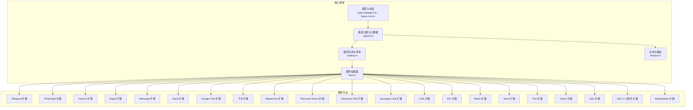
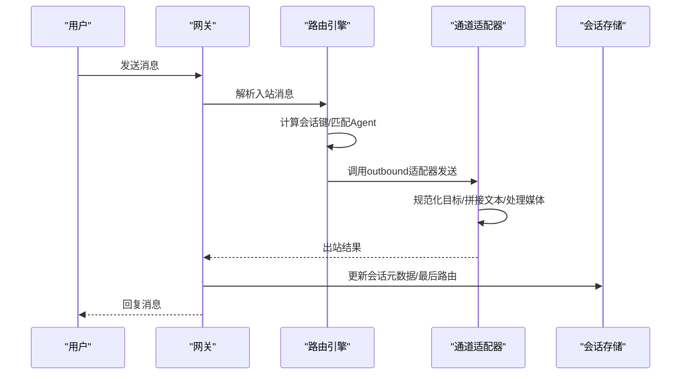
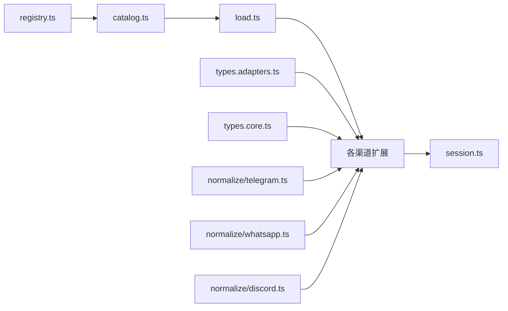

# 渠道集成

<cite>
**本文引用的文件**
- [docs/channels/index.md](file://docs/channels/index.md)
- [docs/channels/channel-routing.md](file://docs/channels/channel-routing.md)
- [src/channels/registry.ts](file://src/channels/registry.ts)
- [src/channels/plugins/types.adapters.ts](file://src/channels/plugins/types.adapters.ts)
- [src/channels/plugins/types.core.ts](file://src/channels/plugins/types.core.ts)
- [src/channels/plugins/catalog.ts](file://src/channels/plugins/catalog.ts)
- [src/channels/plugins/load.ts](file://src/channels/plugins/load.ts)
- [src/channels/plugins/normalize/telegram.ts](file://src/channels/plugins/normalize/telegram.ts)
- [src/channels/plugins/normalize/whatsapp.ts](file://src/channels/plugins/normalize/whatsapp.ts)
- [src/channels/plugins/normalize/discord.ts](file://src/channels/plugins/normalize/discord.ts)
- [src/channels/session.ts](file://src/channels/session.ts)
- [extensions/telegram/index.ts](file://extensions/telegram/index.ts)
- [extensions/whatsapp/index.ts](file://extensions/whatsapp/index.ts)
- [extensions/discord/index.ts](file://extensions/discord/index.ts)
- [extensions/signal/index.ts](file://extensions/signal/index.ts)
- [extensions/imessage/index.ts](file://extensions/imessage/index.ts)
- [extensions/slack/index.ts](file://extensions/slack/index.ts)
- [extensions/googlechat/index.ts](file://extensions/googlechat/index.ts)
- [extensions/feishu/index.ts](file://extensions/feishu/index.ts)
- [extensions/mattermost/index.ts](file://extensions/mattermost/index.ts)
- [extensions/msteams/index.ts](file://extensions/msteams/index.ts)
- [extensions/nextcloud-talk/index.ts](file://extensions/nextcloud-talk/index.ts)
- [extensions/synology-chat/index.ts](file://extensions/synology-chat/index.ts)
- [extensions/line/index.ts](file://extensions/line/index.ts)
- [extensions/irc/index.ts](file://extensions/irc/index.ts)
- [extensions/matrix/index.ts](file://extensions/matrix/index.ts)
- [extensions/nostr/index.ts](file://extensions/nostr/index.ts)
- [extensions/tlon/index.ts](file://extensions/tlon/index.ts)
- [extensions/twitch/index.ts](file://extensions/twitch/index.ts)
- [extensions/zalo/index.ts](file://extensions/zalo/index.ts)
- [extensions/zalouser/index.ts](file://extensions/zalouser/index.ts)
- [extensions/bluebubbles/README.md](file://extensions/bluebubbles/README.md)
- [extensions/voice-call/README.md](file://extensions/voice-call/README.md)
- [extensions/lobster/README.md](file://extensions/lobster/README.md)
- [extensions/device-pair/notify.ts](file://extensions/device-pair/notify.ts)
- [extensions/thread-ownership/index.ts](file://extensions/thread-ownership/index.ts)
- [extensions/memory-core/index.ts](file://extensions/memory-core/index.ts)
- [extensions/memory-lancedb/index.ts](file://extensions/memory-lancedb/index.ts)
- [extensions/llm-task/README.md](file://extensions/llm-task/README.md)
- [extensions/copilot-proxy/README.md](file://extensions/copilot-proxy/README.md)
- [extensions/minimax-portal-auth/oauth.ts](file://extensions/minimax-portal-auth/oauth.ts)
- [extensions/qwen-portal-auth/oauth.ts](file://extensions/qwen-portal-auth/oauth.ts)
- [extensions/google-gemini-cli-auth/oauth.ts](file://extensions/google-gemini-cli-auth/oauth.ts)
- [extensions/diagnostics-otel/index.ts](file://extensions/diagnostics-otel/index.ts)
- [extensions/phone-control/index.test.ts](file://extensions/phone-control/index.test.ts)
- [extensions/test-utils/plugin-runtime-mock.ts](file://extensions/test-utils/plugin-runtime-mock.ts)
- [extensions/shared/resolve-target-test-helpers.ts](file://extensions/shared/resolve-target-test-helpers.ts)
</cite>

## 目录
1. [简介](#简介)
2. [项目结构](#项目结构)
3. [核心组件](#核心组件)
4. [架构总览](#架构总览)
5. [详细组件分析](#详细组件分析)
6. [依赖关系分析](#依赖关系分析)
7. [性能考量](#性能考量)
8. [故障排除指南](#故障排除指南)
9. [结论](#结论)
10. [附录](#附录)

## 简介
本文件面向OpenClaw多渠道消息集成系统，系统性梳理40+消息渠道的适配器实现与运行机制，覆盖认证流程、消息路由策略、会话隔离与群组管理、权限控制与安全考虑，并提供各渠道配置要点、最佳实践与故障排除建议。同时给出渠道适配器的开发指南与扩展机制说明，帮助开发者快速接入新渠道或定制已有适配。

## 项目结构
OpenClaw采用“核心通道框架 + 外部插件生态”的分层设计：
- 核心通道框架：定义统一的适配器接口、会话与路由模型、目录与解析工具等。
- 插件生态：以扩展（extensions）形式提供各渠道的具体实现（如Telegram、WhatsApp、Discord等），通过插件目录与清单进行注册与发现。
- 文档与指引：在docs目录中提供渠道使用说明、路由规则、故障排除等。

图表来源
- [src/channels/registry.ts](file://src/channels/registry.ts#L1-L190)
- [src/channels/plugins/types.adapters.ts](file://src/channels/plugins/types.adapters.ts#L1-L384)
- [src/channels/plugins/types.core.ts](file://src/channels/plugins/types.core.ts#L1-L391)
- [src/channels/plugins/catalog.ts](file://src/channels/plugins/catalog.ts#L1-L308)
- [src/channels/plugins/load.ts](file://src/channels/plugins/load.ts#L1-L9)

章节来源
- [src/channels/registry.ts](file://src/channels/registry.ts#L1-L190)
- [src/channels/plugins/types.adapters.ts](file://src/channels/plugins/types.adapters.ts#L1-L384)
- [src/channels/plugins/types.core.ts](file://src/channels/plugins/types.core.ts#L1-L391)
- [src/channels/plugins/catalog.ts](file://src/channels/plugins/catalog.ts#L1-L308)
- [src/channels/plugins/load.ts](file://src/channels/plugins/load.ts#L1-L9)

## 核心组件
- 通道适配器接口族：定义setup、config、outbound、status、gateway、pairing、resolver、directory、security、streaming、threading、messaging、command、elevated等适配器契约，确保不同渠道在统一抽象下实现一致能力。
- 通道核心类型：包括AccountSnapshot、ChannelMeta、Capabilities、SecurityDmPolicy、DirectoryEntry、PollContext/PollResult等，用于描述账户状态、渠道元信息、能力矩阵、安全策略、目录项与投票消息等。
- 通道注册与目录：内置核心通道列表与别名映射；外部插件通过清单与目录文件注册，系统按优先级合并内外部目录。
- 会话与路由：基于agentId与会话键（DM主会话、群组、频道、线程、话题）进行确定性路由；支持主DM路由固定、广播组并行执行等高级特性。
- 目标规范化与解析：针对Telegram、WhatsApp、Discord等渠道提供目标ID规范化与解析逻辑，保证跨渠道一致性。

章节来源
- [src/channels/plugins/types.adapters.ts](file://src/channels/plugins/types.adapters.ts#L24-L384)
- [src/channels/plugins/types.core.ts](file://src/channels/plugins/types.core.ts#L76-L391)
- [src/channels/registry.ts](file://src/channels/registry.ts#L5-L110)
- [src/channels/session.ts](file://src/channels/session.ts#L1-L82)

## 架构总览
OpenClaw的渠道集成遵循“核心适配器 + 插件扩展 + 统一会话路由”的架构模式。核心框架负责：
- 定义统一的适配器接口与类型系统；
- 提供通道注册、目录构建与插件加载；
- 实现会话键生成、路由匹配与回复上下文处理。

各渠道通过扩展实现具体适配器，完成认证、消息收发、目录查询、群组管理等功能，并由核心框架统一调度。

图表来源
- [src/channels/plugins/types.adapters.ts](file://src/channels/plugins/types.adapters.ts#L108-L125)
- [src/channels/session.ts](file://src/channels/session.ts#L41-L81)

章节来源
- [src/channels/plugins/types.adapters.ts](file://src/channels/plugins/types.adapters.ts#L108-L125)
- [src/channels/session.ts](file://src/channels/session.ts#L41-L81)

## 详细组件分析

### 通道注册与元数据
- 内置核心通道顺序与元信息：包含Telegram、WhatsApp、Discord、IRC、Google Chat、Slack、Signal、iMessage等，提供标签、文档路径、图标、简述等。
- 别名映射：如imsg→imessage、internet-relay-chat→irc、google-chat/gchat→googlechat。
- 任意通道ID归一化：通过插件注册表查找已安装的通道插件，支持别名匹配。

章节来源
- [src/channels/registry.ts](file://src/channels/registry.ts#L5-L190)

### 通道适配器接口族
- Setup适配器：账户ID解析、绑定账户ID、应用账户名称与配置、输入校验。
- Config适配器：列出账户ID、解析账户、默认账户、启用/删除账户、检查配置状态、允许来源解析与格式化、默认投递目标解析。
- Outbound适配器：出站投递模式（direct/gateway/hybrid）、文本分片、目标解析、发送文本/媒体/投票、轮询选项限制。
- Status适配器：账户摘要构建、探针/审计、快照生成、日志输出、账户状态解析、问题收集。
- Gateway适配器：启动/停止账户、二维码登录开始/等待、登出账户。
- Pairing适配器：ID标签、允许来源条目标准化、审批通知。
- Resolver适配器：目标解析（用户/群组）。
- Directory适配器：自描述、列出用户/群组/成员。
- Security适配器：DM策略解析、警告收集。
- Streaming/Threading/Messaging/Command/Elevated适配器：分别处理流式输出、线程策略、消息格式化、命令授权、提升权限等。

章节来源
- [src/channels/plugins/types.adapters.ts](file://src/channels/plugins/types.adapters.ts#L24-L384)

### 通道核心类型
- ChannelMeta：通道元信息（ID、标签、文档路径、别名、排序、系统图标等）。
- ChannelAccountSnapshot：账户快照（启用/配置/连接状态、令牌来源、最后事件时间、错误信息等）。
- ChannelCapabilities：能力矩阵（聊天类型、投票/反应/编辑/撤回/回复/特效/群组管理/线程/媒体/原生命令/阻塞流式）。
- ChannelSecurityDmPolicy：DM策略（策略、允许来源、路径、提示、条目标准化）。
- ChannelDirectoryEntry：目录条目（类型、ID、名称、头像、等级、原始数据）。
- ChannelPollContext/ChannelPollResult：投票上下文与结果。
- ChannelThreadingContext/ToolContext：线程上下文与工具上下文。
- ChannelMessagingAdapter：消息目标规范化与显示格式化。
- ChannelMessageActionAdapter：消息动作发现与处理。

章节来源
- [src/channels/plugins/types.core.ts](file://src/channels/plugins/types.core.ts#L76-L391)

### 插件目录与加载
- 目录构建：从配置目录、工作区、全局与捆绑位置读取外部目录文件，合并内外部插件清单，按来源优先级与顺序排序。
- UI目录：生成用于选择界面的通道元信息集合。
- 加载器：通过插件注册表按ID加载指定通道插件。

章节来源
- [src/channels/plugins/catalog.ts](file://src/channels/plugins/catalog.ts#L1-L308)
- [src/channels/plugins/load.ts](file://src/channels/plugins/load.ts#L1-L9)

### 会话与路由
- 会话键形状：
  - DM：agent:<agentId>:<mainKey>
  - 群组：agent:<agentId>:<channel>:group:<id>
  - 频道/房间：agent:<agentId>:<channel>:channel:<id>
  - 线程/话题：在基础键上追加:thread:<threadId>或:topic:<topicId>
- 主DM路由固定：当dmScope=main时，若存在唯一非通配允许来源且与入站发送者不匹配，则跳过更新主会话lastRoute，防止非拥有者覆盖。
- 路由规则：精确对等匹配、父级对等继承、服务器+角色匹配（Discord）、服务器匹配（Slack）、账户匹配、通道匹配、默认Agent。
- 广播组：同一对等可并行运行多个Agent（如群内提及后触发多个Agent）。

章节来源
- [docs/channels/channel-routing.md](file://docs/channels/channel-routing.md#L24-L135)
- [src/channels/session.ts](file://src/channels/session.ts#L13-L81)

### 目标规范化与解析
- Telegram：支持前缀telegram:/tg:，解析chatId与messageThreadId，保留或转换group前缀与topic后缀。
- WhatsApp：规范化手机号/账号，支持通配符允许来源条目规范化。
- Discord：默认裸ID作为频道，避免歧义；支持用户/频道/带前缀ID识别。

章节来源
- [src/channels/plugins/normalize/telegram.ts](file://src/channels/plugins/normalize/telegram.ts#L1-L45)
- [src/channels/plugins/normalize/whatsapp.ts](file://src/channels/plugins/normalize/whatsapp.ts#L1-L26)
- [src/channels/plugins/normalize/discord.ts](file://src/channels/plugins/normalize/discord.ts#L1-L48)

### 典型渠道适配器实现概览
以下为部分渠道扩展入口与README，展示其适配器职责与配置要点（以路径引用代替代码内容）：

- Telegram
  - 适配器职责：Bot API接入、消息收发、目标解析、目录查询、群组管理、投票支持。
  - 配置要点：botToken、webhook配置、允许来源、默认投递目标。
  - 参考路径：[extensions/telegram/index.ts](file://extensions/telegram/index.ts)

- WhatsApp
  - 适配器职责：Baileys接入、二维码登录、消息收发、群组管理、心跳检测。
  - 配置要点：设备信息、数据库路径、允许来源、群组通道。
  - 参考路径：[extensions/whatsapp/index.ts](file://extensions/whatsapp/index.ts)

- Discord
  - 适配器职责：Bot API + Socket Mode、服务器/频道/DM、线程、反应、投票。
  - 配置要点：botToken、applicationId、公钥、允许来源、线程策略。
  - 参考路径：[extensions/discord/index.ts](file://extensions/discord/index.ts)

- Signal
  - 适配器职责：signal-cli接入、端到端隐私、消息收发。
  - 配置要点：号码、CLI路径、数据库路径。
  - 参考路径：[extensions/signal/index.ts](file://extensions/signal/index.ts)

- iMessage
  - 适配器职责：imsg CLI（macOS）、消息收发、目录查询。
  - 配置要点：服务类型、区域、允许来源。
  - 参考路径：[extensions/imessage/index.ts](file://extensions/imessage/index.ts)

- Slack
  - 适配器职责：Socket Mode、工作区、频道/群组/DM、线程、反应、投票。
  - 配置要点：appToken、botToken、团队ID、角色匹配。
  - 参考路径：[extensions/slack/index.ts](file://extensions/slack/index.ts)

- Google Chat
  - 适配器职责：HTTP Webhook、Google Workspace Chat。
  - 配置要点：webhookUrl、签名密钥、audience。
  - 参考路径：[extensions/googlechat/index.ts](file://extensions/googlechat/index.ts)

- 其他渠道（节选）
  - Feishu：WebSocket Bot（独立插件）
  - Mattermost：Bot API + WebSocket
  - Microsoft Teams：Bot Framework
  - Nextcloud Talk：自托管聊天
  - Synology Chat：出入站Webhook
  - LINE：Messaging API Bot
  - IRC：经典IRC网络
  - Matrix：Matrix协议
  - Nostr：去中心化私信
  - Tlon：Urbit消息
  - Twitch：IRC聊天
  - Zalo/Zalo个人：Bot API/二维码登录
  - BlueBubbles：macOS服务器REST API（推荐iMessage）

章节来源
- [docs/channels/index.md](file://docs/channels/index.md#L14-L37)
- [extensions/telegram/index.ts](file://extensions/telegram/index.ts)
- [extensions/whatsapp/index.ts](file://extensions/whatsapp/index.ts)
- [extensions/discord/index.ts](file://extensions/discord/index.ts)
- [extensions/signal/index.ts](file://extensions/signal/index.ts)
- [extensions/imessage/index.ts](file://extensions/imessage/index.ts)
- [extensions/slack/index.ts](file://extensions/slack/index.ts)
- [extensions/googlechat/index.ts](file://extensions/googlechat/index.ts)
- [extensions/feishu/index.ts](file://extensions/feishu/index.ts)
- [extensions/mattermost/index.ts](file://extensions/mattermost/index.ts)
- [extensions/msteams/index.ts](file://extensions/msteams/index.ts)
- [extensions/nextcloud-talk/index.ts](file://extensions/nextcloud-talk/index.ts)
- [extensions/synology-chat/index.ts](file://extensions/synology-chat/index.ts)
- [extensions/line/index.ts](file://extensions/line/index.ts)
- [extensions/irc/index.ts](file://extensions/irc/index.ts)
- [extensions/matrix/index.ts](file://extensions/matrix/index.ts)
- [extensions/nostr/index.ts](file://extensions/nostr/index.ts)
- [extensions/tlon/index.ts](file://extensions/tlon/index.ts)
- [extensions/twitch/index.ts](file://extensions/twitch/index.ts)
- [extensions/zalo/index.ts](file://extensions/zalo/index.ts)
- [extensions/zalouser/index.ts](file://extensions/zalouser/index.ts)
- [extensions/bluebubbles/README.md](file://extensions/bluebubbles/README.md)

## 依赖关系分析
- 通道注册与目录：核心通道顺序与元数据定义于registry.ts；外部插件通过catalog.ts构建目录并合并优先级；load.ts按ID加载插件。
- 适配器接口：types.adapters.ts定义所有适配器契约；types.core.ts定义核心类型与上下文。
- 会话与路由：session.ts依赖核心会话存储与键生成逻辑，配合路由规则实现确定性转发。
- 目标规范化：各渠道normalize模块依赖各自平台的目标解析库，统一输出标准化字符串。

图表来源
- [src/channels/registry.ts](file://src/channels/registry.ts#L1-L190)
- [src/channels/plugins/catalog.ts](file://src/channels/plugins/catalog.ts#L1-L308)
- [src/channels/plugins/load.ts](file://src/channels/plugins/load.ts#L1-L9)
- [src/channels/plugins/types.adapters.ts](file://src/channels/plugins/types.adapters.ts#L1-L384)
- [src/channels/plugins/types.core.ts](file://src/channels/plugins/types.core.ts#L1-L391)
- [src/channels/session.ts](file://src/channels/session.ts#L1-L82)
- [src/channels/plugins/normalize/telegram.ts](file://src/channels/plugins/normalize/telegram.ts#L1-L45)
- [src/channels/plugins/normalize/whatsapp.ts](file://src/channels/plugins/normalize/whatsapp.ts#L1-L26)
- [src/channels/plugins/normalize/discord.ts](file://src/channels/plugins/normalize/discord.ts#L1-L48)

章节来源
- [src/channels/registry.ts](file://src/channels/registry.ts#L1-L190)
- [src/channels/plugins/catalog.ts](file://src/channels/plugins/catalog.ts#L1-L308)
- [src/channels/plugins/load.ts](file://src/channels/plugins/load.ts#L1-L9)
- [src/channels/plugins/types.adapters.ts](file://src/channels/plugins/types.adapters.ts#L1-L384)
- [src/channels/plugins/types.core.ts](file://src/channels/plugins/types.core.ts#L1-L391)
- [src/channels/session.ts](file://src/channels/session.ts#L1-L82)
- [src/channels/plugins/normalize/telegram.ts](file://src/channels/plugins/normalize/telegram.ts#L1-L45)
- [src/channels/plugins/normalize/whatsapp.ts](file://src/channels/plugins/normalize/whatsapp.ts#L1-L26)
- [src/channels/plugins/normalize/discord.ts](file://src/channels/plugins/normalize/discord.ts#L1-L48)

## 性能考量
- 文本分片与Markdown处理：Outbound适配器支持textChunkLimit与chunkerMode，避免超长消息被平台拒绝。
- 流式输出与合并：Streaming适配器提供字符数与空闲时间阈值，减少频繁小包传输。
- 轮询与心跳：Heartbeat适配器提供就绪检查与收件人解析，结合Web监听状态优化资源占用。
- 目录查询与解析：Directory适配器区分静态与实时列表，按需调用以降低开销。
- 会话存储：会话JSONL与会话键隔离，避免跨渠道竞争写入。

章节来源
- [src/channels/plugins/types.adapters.ts](file://src/channels/plugins/types.adapters.ts#L109-L125)
- [src/channels/plugins/types.core.ts](file://src/channels/plugins/types.core.ts#L225-L230)
- [src/channels/plugins/types.core.ts](file://src/channels/plugins/types.core.ts#L71-L74)

## 故障排除指南
- 渠道配置问题
  - 检查令牌来源与状态字段（tokenStatus/botTokenStatus/appTokenStatus/signingSecretStatus/userTokenStatus），确认凭证是否有效。
  - 使用Status适配器的probe/audit与collectStatusIssues定位意图、权限、配置、认证与运行时问题。
- 连接与认证
  - 二维码登录：使用Gateway适配器loginWithQrStart/loginWithQrWait，设置合理超时；失败时查看lastError与断连记录。
  - 登出清理：logoutAccount返回cleared标志，确保本地状态清理。
- 路由与会话
  - 若主DM路由异常，检查dmScope与allowFrom唯一性；必要时固定主DM拥有者以避免非拥有者覆盖。
  - 广播组并行：确认broadcast策略与目标Agent列表正确配置。
- 目标解析
  - Telegram：确保前缀与topic后缀正确；必要时保留group:兼容旧格式。
  - WhatsApp：允许来源条目需规范化；通配符“*”保持不变。
  - Discord：裸数字ID自动转为channel:以避免歧义。
- 权限与安全
  - DM策略：通过Security适配器resolveDmPolicy与allowFrom条目标准化，确保仅允许白名单来源。
  - 命令授权：Command适配器可强制所有者权限与空配置跳过策略。

章节来源
- [src/channels/plugins/types.core.ts](file://src/channels/plugins/types.core.ts#L97-L159)
- [src/channels/plugins/types.adapters.ts](file://src/channels/plugins/types.adapters.ts#L127-L166)
- [src/channels/plugins/types.adapters.ts](file://src/channels/plugins/types.adapters.ts#L275-L289)
- [src/channels/plugins/types.adapters.ts](file://src/channels/plugins/types.adapters.ts#L378-L383)
- [src/channels/session.ts](file://src/channels/session.ts#L26-L66)
- [docs/channels/channel-routing.md](file://docs/channels/channel-routing.md#L45-L71)
- [src/channels/plugins/normalize/telegram.ts](file://src/channels/plugins/normalize/telegram.ts#L34-L44)
- [src/channels/plugins/normalize/whatsapp.ts](file://src/channels/plugins/normalize/whatsapp.ts#L12-L18)
- [src/channels/plugins/normalize/discord.ts](file://src/channels/plugins/normalize/discord.ts#L14-L30)

## 结论
OpenClaw通过统一的适配器接口与核心框架，实现了对40+消息渠道的一致化接入与管理。借助明确的路由与会话隔离策略、完善的权限与安全控制、以及可扩展的插件生态，系统既能满足快速上手（如Telegram），也能支持复杂场景（如WhatsApp QR登录、Discord多服务器/角色匹配）。开发者可依据本文档的接口规范与扩展机制，高效地为新渠道编写适配器或定制既有实现。

## 附录

### 渠道认证机制
- 令牌与凭证：支持botToken、appToken、signingSecret、accessToken、密码等多种凭证来源；状态字段记录来源与有效性。
- OAuth与CLI：部分渠道提供OAuth流程（如minimax/qwen/google-gemini）与CLI工具（如signal-cli）。
- 二维码登录：WhatsApp等渠道支持二维码登录流程，提供开始与等待阶段的异步交互。

章节来源
- [src/channels/plugins/types.core.ts](file://src/channels/plugins/types.core.ts#L21-L53)
- [src/channels/plugins/types.adapters.ts](file://src/channels/plugins/types.adapters.ts#L127-L166)
- [src/channels/plugins/types.adapters.ts](file://src/channels/plugins/types.adapters.ts#L275-L289)
- [extensions/minimax-portal-auth/oauth.ts](file://extensions/minimax-portal-auth/oauth.ts)
- [extensions/qwen-portal-auth/oauth.ts](file://extensions/qwen-portal-auth/oauth.ts)
- [extensions/google-gemini-cli-auth/oauth.ts](file://extensions/google-gemini-cli-auth/oauth.ts)

### 消息路由策略
- 会话键生成与线程/话题嵌入：确保群组/频道/线程上下文不混淆。
- 主DM路由固定：在特定条件下保护主会话不被非拥有者覆盖。
- 广播组：同一对等可并行运行多个Agent，适合群内提及后多Agent联动。

章节来源
- [docs/channels/channel-routing.md](file://docs/channels/channel-routing.md#L24-L91)
- [src/channels/session.ts](file://src/channels/session.ts#L13-L66)

### 会话隔离与群组管理
- 会话键隔离：不同渠道、群组、线程形成独立会话桶，避免并发冲突。
- 群组策略：Group适配器支持要求提及、介绍提示与工具策略解析。
- 目录与成员：Directory适配器支持列出群组与成员，便于动态管理。

章节来源
- [src/channels/plugins/types.adapters.ts](file://src/channels/plugins/types.adapters.ts#L83-L87)
- [src/channels/plugins/types.core.ts](file://src/channels/plugins/types.core.ts#L168-L179)
- [src/channels/plugins/types.core.ts](file://src/channels/plugins/types.core.ts#L335-L344)

### 渠道特定功能与权限控制
- 功能矩阵：Capabilities定义各渠道支持的聊天类型、投票、反应、编辑、撤回、回复、特效、群组管理、线程、媒体、原生命令与流式阻塞。
- 安全策略：Security适配器解析DM策略与警告，结合allowFrom条目标准化与通知审批。
- 命令授权：Command适配器可强制所有者权限与空配置跳过策略。

章节来源
- [src/channels/plugins/types.core.ts](file://src/channels/plugins/types.core.ts#L181-L194)
- [src/channels/plugins/types.adapters.ts](file://src/channels/plugins/types.adapters.ts#L378-L383)
- [src/channels/plugins/types.adapters.ts](file://src/channels/plugins/types.adapters.ts#L373-L376)

### 配置示例与最佳实践
- 快速上手：Telegram通常最简单（botToken），WhatsApp需要QR登录且状态较多。
- 多账户：为多账户设置默认账户（defaultAccount或accounts.default），避免回退路由不确定。
- 安全：严格配置allowFrom与DM策略，启用审批通知；定期probe/audit账户状态。
- 路由：根据业务需求选择dmScope与绑定策略，必要时使用广播组并行处理。

章节来源
- [docs/channels/index.md](file://docs/channels/index.md#L42-L46)
- [docs/channels/channel-routing.md](file://docs/channels/channel-routing.md#L18-L21)
- [src/channels/plugins/types.adapters.ts](file://src/channels/plugins/types.adapters.ts#L378-L383)

### 故障排除清单
- 令牌无效：检查tokenStatus/botTokenStatus/appTokenStatus/signingSecretStatus/userTokenStatus。
- 目标解析失败：核对normalize逻辑（Telegram/WhatsApp/Discord）。
- 路由异常：检查dmScope、allowFrom唯一性与广播组配置。
- 连接问题：使用loginWithQrStart/wait与logoutAccount清理状态。

章节来源
- [src/channels/plugins/types.core.ts](file://src/channels/plugins/types.core.ts#L97-L159)
- [src/channels/plugins/normalize/telegram.ts](file://src/channels/plugins/normalize/telegram.ts#L34-L44)
- [src/channels/plugins/normalize/whatsapp.ts](file://src/channels/plugins/normalize/whatsapp.ts#L12-L18)
- [src/channels/plugins/normalize/discord.ts](file://src/channels/plugins/normalize/discord.ts#L14-L30)
- [src/channels/plugins/types.adapters.ts](file://src/channels/plugins/types.adapters.ts#L275-L289)

### 开发指南与扩展机制
- 插件清单与目录：在插件根目录提供openclaw.plugin.json与manifest，声明channel元信息与安装信息；系统通过catalog.ts合并内外部目录。
- 适配器实现：按types.adapters.ts定义的适配器接口实现对应能力；在index.ts导出插件入口。
- 目标规范化：在src/channels/plugins/normalize下新增渠道的normalize模块，提供normalizeXxxMessagingTarget与looksLikeXxxTargetId。
- 加载与注册：通过load.ts按ID加载插件；核心registry.normalizeAnyChannelId支持任意通道ID归一化。
- 最佳实践：提供完整的setup/config/status/gateway/pairing/resolver/directory/security/streaming/threading/messaging/command/elevated适配器；完善单元测试与文档。

章节来源
- [src/channels/plugins/catalog.ts](file://src/channels/plugins/catalog.ts#L121-L229)
- [src/channels/plugins/load.ts](file://src/channels/plugins/load.ts#L1-L9)
- [src/channels/registry.ts](file://src/channels/registry.ts#L151-L172)
- [src/channels/plugins/normalize/telegram.ts](file://src/channels/plugins/normalize/telegram.ts#L1-L45)
- [src/channels/plugins/normalize/whatsapp.ts](file://src/channels/plugins/normalize/whatsapp.ts#L1-L26)
- [src/channels/plugins/normalize/discord.ts](file://src/channels/plugins/normalize/discord.ts#L1-L48)