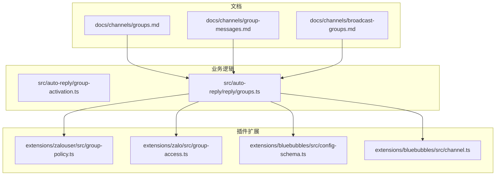
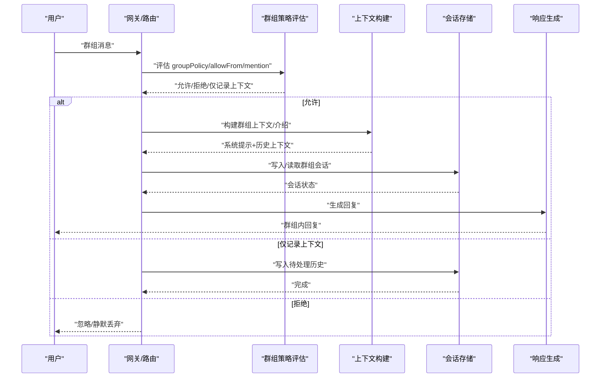
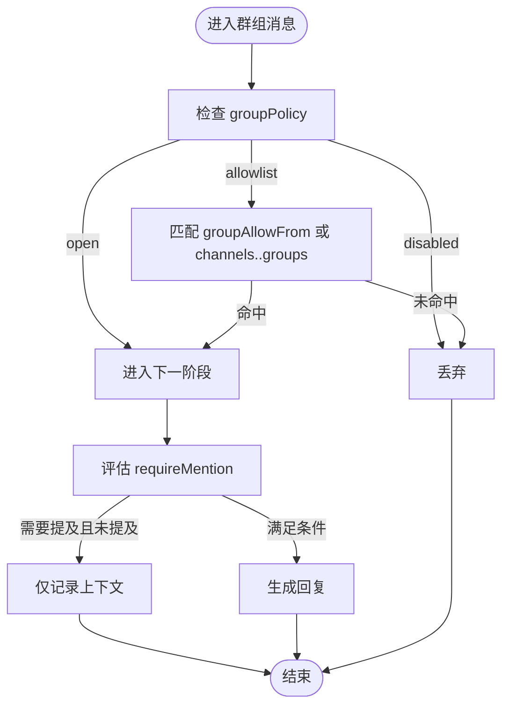
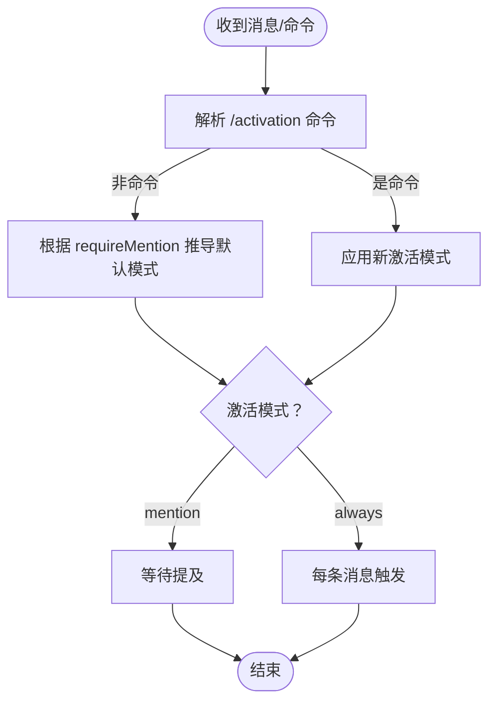
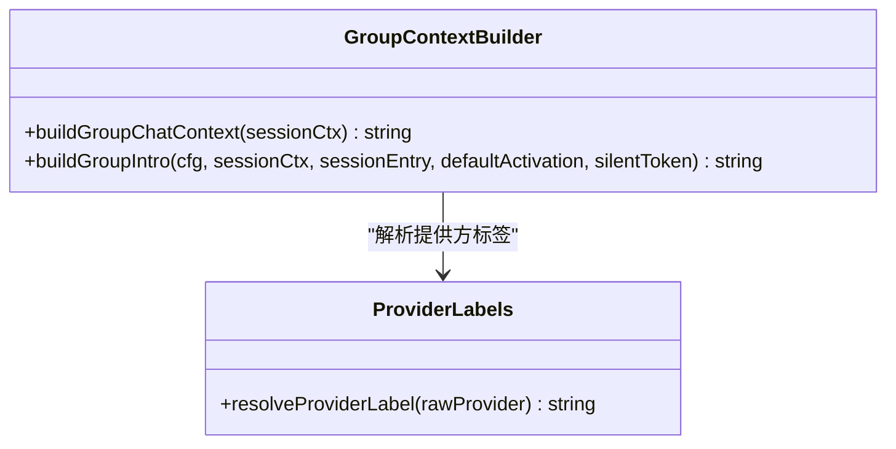
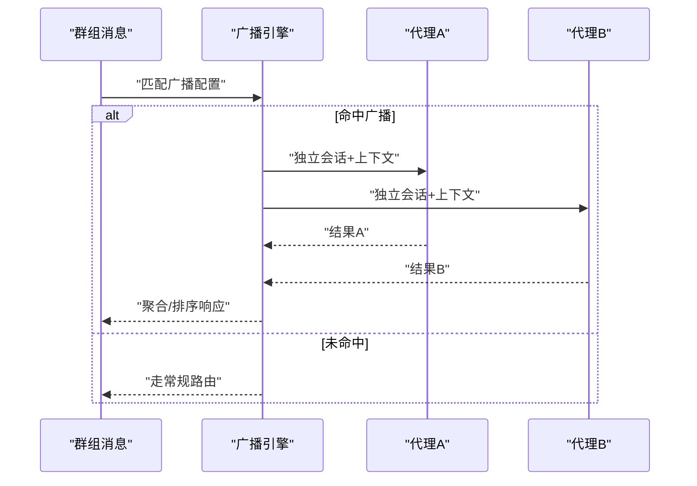
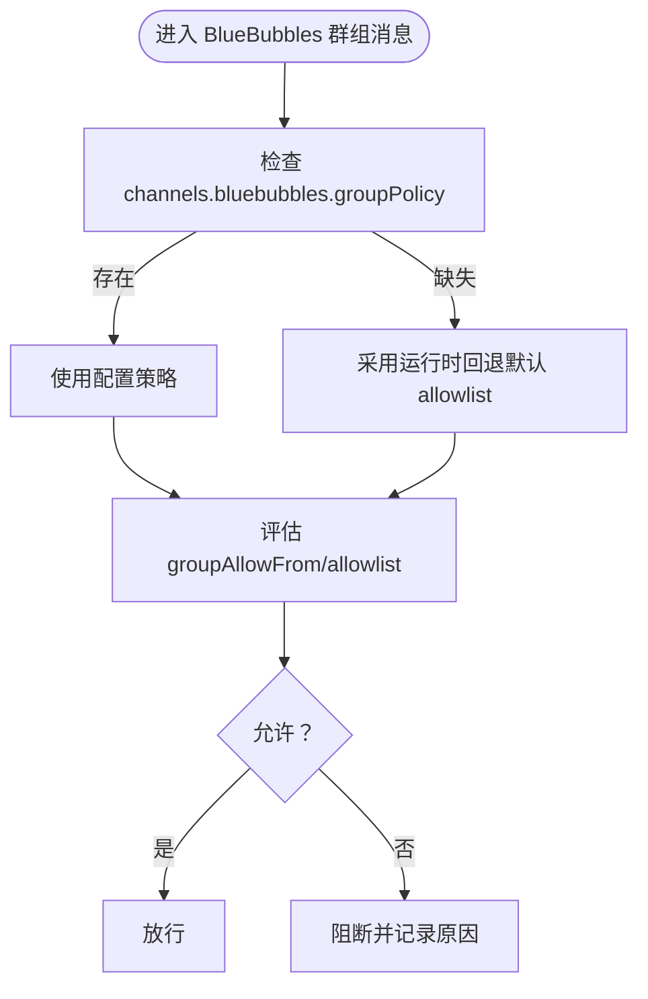
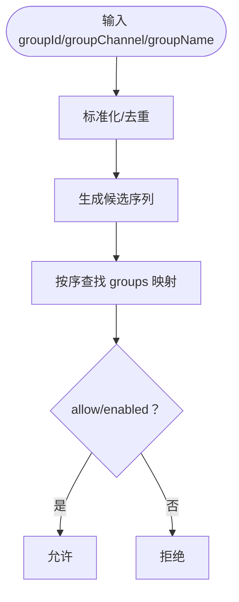
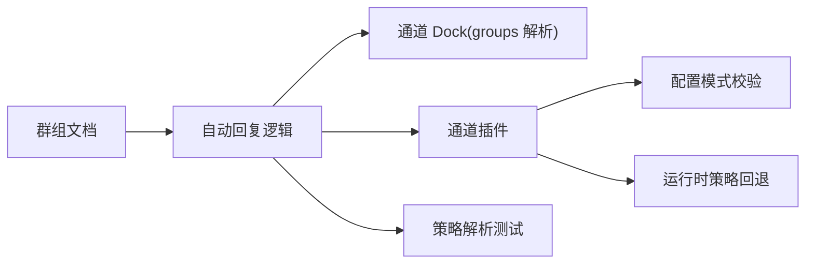

# 群组管理

<cite>
**本文引用的文件**
- [docs/channels/groups.md](file://docs/channels/groups.md)
- [docs/channels/group-messages.md](file://docs/channels/group-messages.md)
- [docs/channels/broadcast-groups.md](file://docs/channels/broadcast-groups.md)
- [src/auto-reply/group-activation.ts](file://src/auto-reply/group-activation.ts)
- [src/auto-reply/reply/groups.ts](file://src/auto-reply/reply/groups.ts)
- [extensions/zalouser/src/group-policy.ts](file://extensions/zalouser/src/group-policy.ts)
- [extensions/zalouser/src/group-policy.test.ts](file://extensions/zalouser/src/group-policy.test.ts)
- [extensions/zalo/src/group-access.ts](file://extensions/zalo/src/group-access.ts)
- [extensions/bluebubbles/src/config-schema.ts](file://extensions/bluebubbles/src/config-schema.ts)
- [extensions/bluebubbles/src/channel.ts](file://extensions/bluebubbles/src/channel.ts)
</cite>

## 目录
1. [简介](#简介)
2. [项目结构](#项目结构)
3. [核心组件](#核心组件)
4. [架构总览](#架构总览)
5. [详细组件分析](#详细组件分析)
6. [依赖关系分析](#依赖关系分析)
7. [性能考量](#性能考量)
8. [故障排查指南](#故障排查指南)
9. [结论](#结论)
10. [附录](#附录)

## 简介
本文件系统化阐述 OpenClaw 的群组管理能力，覆盖跨渠道（如 WhatsApp、Telegram、Discord、Slack、Signal、iMessage、Microsoft Teams、Zalo 等）的一致行为模型，包括：
- 群组创建与识别
- 成员与权限控制（群策略、发送者白名单、提及门控）
- 消息分发与会话隔离
- 多代理广播（实验性）
- 安全策略、消息过滤与隐私保护

目标是帮助不同技术背景的读者理解并正确配置群组策略，以满足公共群组、私人聊天、企业团队与混合场景下的差异化需求。

## 项目结构
围绕群组管理的关键文档与实现分布如下：
- 文档层：channels 目录下提供跨渠道群组行为、提及门控、会话键规范、工具限制等通用说明；broadcast-groups 提供多代理广播的实验性能力。
- 业务逻辑层：auto-reply 子模块负责激活模式解析、群组上下文构建与介绍注入。
- 插件扩展层：各通道插件（如 BlueBubbles、Zalo、Zalouser 等）提供具体策略解析、运行时策略回退、访问决策与配置校验。

**图表来源**
- [docs/channels/groups.md](file://docs/channels/groups.md#L1-L380)
- [docs/channels/group-messages.md](file://docs/channels/group-messages.md#L1-L85)
- [docs/channels/broadcast-groups.md](file://docs/channels/broadcast-groups.md#L1-L443)
- [src/auto-reply/group-activation.ts](file://src/auto-reply/group-activation.ts#L1-L35)
- [src/auto-reply/reply/groups.ts](file://src/auto-reply/reply/groups.ts#L1-L152)
- [extensions/zalouser/src/group-policy.ts](file://extensions/zalouser/src/group-policy.ts#L1-L79)
- [extensions/zalo/src/group-access.ts](file://extensions/zalo/src/group-access.ts#L1-L49)
- [extensions/bluebubbles/src/config-schema.ts](file://extensions/bluebubbles/src/config-schema.ts#L1-L68)
- [extensions/bluebubbles/src/channel.ts](file://extensions/bluebubbles/src/channel.ts#L130-L329)

**章节来源**
- [docs/channels/groups.md](file://docs/channels/groups.md#L1-L380)
- [docs/channels/group-messages.md](file://docs/channels/group-messages.md#L1-L85)
- [docs/channels/broadcast-groups.md](file://docs/channels/broadcast-groups.md#L1-L443)

## 核心组件
- 群组策略与门控
  - 群策略：open/disabled/allowlist，分别表示“放行所有”“完全屏蔽”“仅允许白名单”。
  - 提及门控：requireMention 控制是否必须被提及才触发回复；支持正则模式与显式提及。
  - 会话隔离：群组使用独立会话键，避免与个人 DM 混淆；心跳在群组会话中被跳过。
- 多代理广播（实验）
  - 在满足通道白名单与激活规则的前提下，同一消息可由多个代理并行或串行处理，各自维护独立上下文与工具集。
- 访问控制与运行时回退
  - 各通道插件提供运行时策略回退（当配置缺失时采用安全默认），并支持按发送者与群组维度进行访问决策。
- 上下文与提示注入
  - 首次进入群组会话时注入群介绍与激活模式提示；每轮对话包含群主题、成员列表与明确的回复指令，避免误用消息工具。

**章节来源**
- [docs/channels/groups.md](file://docs/channels/groups.md#L128-L201)
- [docs/channels/group-messages.md](file://docs/channels/group-messages.md#L14-L23)
- [docs/channels/broadcast-groups.md](file://docs/channels/broadcast-groups.md#L153-L185)
- [src/auto-reply/reply/groups.ts](file://src/auto-reply/reply/groups.ts#L87-L151)

## 架构总览
OpenClaw 的群组处理遵循“策略判定—上下文注入—会话隔离—消息分发”的统一流程，并通过插件扩展适配不同渠道的差异。

**图表来源**
- [docs/channels/groups.md](file://docs/channels/groups.md#L30-L37)
- [docs/channels/group-messages.md](file://docs/channels/group-messages.md#L14-L23)
- [src/auto-reply/reply/groups.ts](file://src/auto-reply/reply/groups.ts#L31-L56)

## 详细组件分析

### 组件A：群组策略与门控（跨渠道一致行为）
- 策略判定顺序
  - groupPolicy（open/disabled/allowlist）
  - 群组白名单（channels.<provider>.groups 或 channels.<provider>.groupAllowFrom）
  - 提及门控（requireMention 与 /activation）
- 会话键规范
  - 群组会话键格式为 agent:<agentId>:<channel>:group:<id>，Telegram 论坛主题附加 :topic:<threadId>。
  - 心跳在群组会话中被跳过，降低广播噪音。
- 上下文字段
  - ChatType=group、GroupSubject、GroupMembers、WasMentioned 等，便于下游处理与日志追踪。

**图表来源**
- [docs/channels/groups.md](file://docs/channels/groups.md#L196-L201)
- [docs/channels/groups.md](file://docs/channels/groups.md#L30-L37)

**章节来源**
- [docs/channels/groups.md](file://docs/channels/groups.md#L128-L201)
- [docs/channels/groups.md](file://docs/channels/groups.md#L50-L56)

### 组件B：激活模式与命令解析
- 激活模式
  - mention：仅被提及触发
  - always：每条消息均触发，但建议在无价值时返回静默令牌
- 命令解析
  - 支持 /activation mention 与 /activation always，仅群主（或默认账号）可更改。
- 默认激活
  - 当 requireMention 为 false 时，默认激活模式为 always；否则为 mention。

**图表来源**
- [src/auto-reply/group-activation.ts](file://src/auto-reply/group-activation.ts#L16-L34)
- [src/auto-reply/reply/groups.ts](file://src/auto-reply/reply/groups.ts#L58-L60)

**章节来源**
- [src/auto-reply/group-activation.ts](file://src/auto-reply/group-activation.ts#L1-L35)
- [src/auto-reply/reply/groups.ts](file://src/auto-reply/reply/groups.ts#L58-L60)

### 组件C：上下文构建与系统提示注入
- 群组上下文块
  - 包含群主题、成员列表与明确的“不要使用消息工具向同群回复”的提示。
- 系统提示
  - 首次进入群组会话或切换激活模式时注入，包含激活方式、提供方标识与风格约束。
- 提供方标签
  - 内部 WebChat 使用“WebChat”，外部渠道通过插件元数据获取标签。

**图表来源**
- [src/auto-reply/reply/groups.ts](file://src/auto-reply/reply/groups.ts#L87-L151)

**章节来源**
- [src/auto-reply/reply/groups.ts](file://src/auto-reply/reply/groups.ts#L87-L151)

### 组件D：多代理广播（实验）
- 触发条件
  - 在通道白名单与群组激活规则满足后，同一消息可由多个代理同时或依次处理。
- 会话隔离
  - 每个代理拥有独立会话键、历史、工作区、工具集与内存。
- 广播优先级
  - broadcast 配置优先于传统 bindings 路由。
- 性能与失败处理
  - 并行提升速度，但需关注速率限制；单个代理失败不影响其他代理。

**图表来源**
- [docs/channels/broadcast-groups.md](file://docs/channels/broadcast-groups.md#L153-L167)
- [docs/channels/broadcast-groups.md](file://docs/channels/broadcast-groups.md#L284-L306)

**章节来源**
- [docs/channels/broadcast-groups.md](file://docs/channels/broadcast-groups.md#L1-L443)

### 组件E：访问控制与运行时回退（以 Zalo/BlueBubbles 为例）
- Zalo
  - 提供运行时策略回退函数，当 provider 配置缺失时采用安全默认（通常为 allowlist）。
  - 支持按发送者前缀剥离与允许列表判断。
- BlueBubbles
  - 配置模式定义 groupPolicy、groupAllowFrom、groups 等字段，并在缺少配置时给出警告提示。
  - 运行时收集策略信息并输出阻断原因（如 disabled、allowlist 为空、不在 allowFrom 中）。

**图表来源**
- [extensions/bluebubbles/src/channel.ts](file://extensions/bluebubbles/src/channel.ts#L139-L147)
- [extensions/bluebubbles/src/config-schema.ts](file://extensions/bluebubbles/src/config-schema.ts#L23-L50)
- [extensions/zalo/src/group-access.ts](file://extensions/zalo/src/group-access.ts#L18-L31)

**章节来源**
- [extensions/zalo/src/group-access.ts](file://extensions/zalo/src/group-access.ts#L1-L49)
- [extensions/bluebubbles/src/config-schema.ts](file://extensions/bluebubbles/src/config-schema.ts#L1-L68)
- [extensions/bluebubbles/src/channel.ts](file://extensions/bluebubbles/src/channel.ts#L139-L147)

### 组件F：群组策略辅助（Zalouser）
- 组名标准化与候选匹配
  - 支持将群名转换为 slug，生成 groupId、group:groupId、channel、name、通配符等候选键。
- 条目查找与允许性判断
  - 按候选顺序查找第一个匹配项，并判断 allow/enabled 标志。

**图表来源**
- [extensions/zalouser/src/group-policy.ts](file://extensions/zalouser/src/group-policy.ts#L9-L79)

**章节来源**
- [extensions/zalouser/src/group-policy.ts](file://extensions/zalouser/src/group-policy.ts#L1-L79)
- [extensions/zalouser/src/group-policy.test.ts](file://extensions/zalouser/src/group-policy.test.ts#L1-L50)

## 依赖关系分析
- 文档驱动的策略与行为约定
  - groups.md 与 group-messages.md 为跨渠道群组行为的权威参考，定义了策略判定顺序、会话键规范与上下文字段。
- 业务逻辑对策略的依赖
  - reply/groups.ts 依赖各通道 dock 的 groups 解析器（如 resolveRequireMention、resolveGroupIntroHint）来动态决定门控与提示。
- 插件扩展的策略回退与校验
  - BlueBubbles 的配置模式与运行时警告，确保在缺失配置时采用安全默认；Zalo 的运行时策略回退保障一致性。
- 测试验证
  - Zalouser 的单元测试覆盖 slug 规范化、候选构建、条目查找与允许性判断，保证策略解析的正确性。

**图表来源**
- [docs/channels/groups.md](file://docs/channels/groups.md#L128-L201)
- [src/auto-reply/reply/groups.ts](file://src/auto-reply/reply/groups.ts#L45-L51)
- [extensions/bluebubbles/src/config-schema.ts](file://extensions/bluebubbles/src/config-schema.ts#L23-L50)
- [extensions/zalouser/src/group-policy.test.ts](file://extensions/zalouser/src/group-policy.test.ts#L9-L49)

**章节来源**
- [docs/channels/groups.md](file://docs/channels/groups.md#L128-L201)
- [src/auto-reply/reply/groups.ts](file://src/auto-reply/reply/groups.ts#L45-L51)
- [extensions/bluebubbles/src/config-schema.ts](file://extensions/bluebubbles/src/config-schema.ts#L1-L68)
- [extensions/zalouser/src/group-policy.test.ts](file://extensions/zalouser/src/group-policy.test.ts#L1-L50)

## 性能考量
- 广播策略
  - 并行模式提升吞吐，但需关注速率限制与容器启动开销；建议限制每组广播代理数量并在必要时采用串行模式。
- 会话隔离
  - 群组会话独立存储与上下文注入，避免跨群污染；但会增加 IO 与内存占用，应结合历史窗口与工具限制优化。
- 心跳与广播抑制
  - 群组会话跳过心跳，减少广播噪音；提及门控与激活模式有助于降低无效调用频率。

[本节为通用指导，无需列出章节来源]

## 故障排查指南
- 群组消息被静默丢弃
  - 检查 groupPolicy 是否为 disabled；确认 groupAllowFrom 或 channels.<provider>.groups 是否包含当前群组；核对 requireMention 与 /activation 设置。
- 提及门控不生效
  - 确认 mentionPatterns 配置正确且大小写不敏感；部分渠道依赖显式提及，regex 仅为后备。
- 广播未触发或多代理未响应
  - 确认广播配置中的 peerId 格式正确；检查 agentId 是否存在于 agents.list；查看 gateway 日志中 broadcast 相关条目。
- 运行时策略回退导致安全风险
  - BlueBubbles 在缺少配置时采用 allowlist 回退；若希望开放，请显式设置 groupPolicy=open 并配置 groupAllowFrom。

**章节来源**
- [docs/channels/groups.md](file://docs/channels/groups.md#L183-L201)
- [docs/channels/broadcast-groups.md](file://docs/channels/broadcast-groups.md#L307-L336)
- [extensions/bluebubbles/src/channel.ts](file://extensions/bluebubbles/src/channel.ts#L139-L147)

## 结论
OpenClaw 通过“策略—门控—上下文—会话隔离—分发”的统一框架，在多渠道上实现了可预测、可审计、可扩展的群组管理能力。配合多代理广播与严格的运行时回退机制，既能满足公共群组的广泛接入，也能满足企业团队的精细化权限控制与隐私保护需求。建议在生产环境中：
- 明确 groupPolicy 与 groupAllowFrom，避免默认 allowlist 导致的潜在风险；
- 合理配置 requireMention 与 /activation，平衡自动化与噪音控制；
- 对工具访问与工作区进行最小授权与沙箱隔离；
- 在大规模广播场景中，采用并行模式并监控速率限制与资源消耗。

[本节为总结性内容，无需列出章节来源]

## 附录
- 不同类型群组的特性与建议
  - 公共群组：groupPolicy=open 或 allowlist + 精确 groupAllowFrom；启用 requireMention 以降低噪音。
  - 私人聊天：使用 DM 策略（如 pairing/allowlist/open/disabled）与 allowFrom 控制来源。
  - 企业团队：结合 groups 工具限制与 per-sender 重载，实现“只读/读写”等差异化权限。
  - 混合环境：通过 bindings 与 broadcast 协同，既保证路由确定性，又支持多代理协作。

[本节为概念性内容，无需列出章节来源]