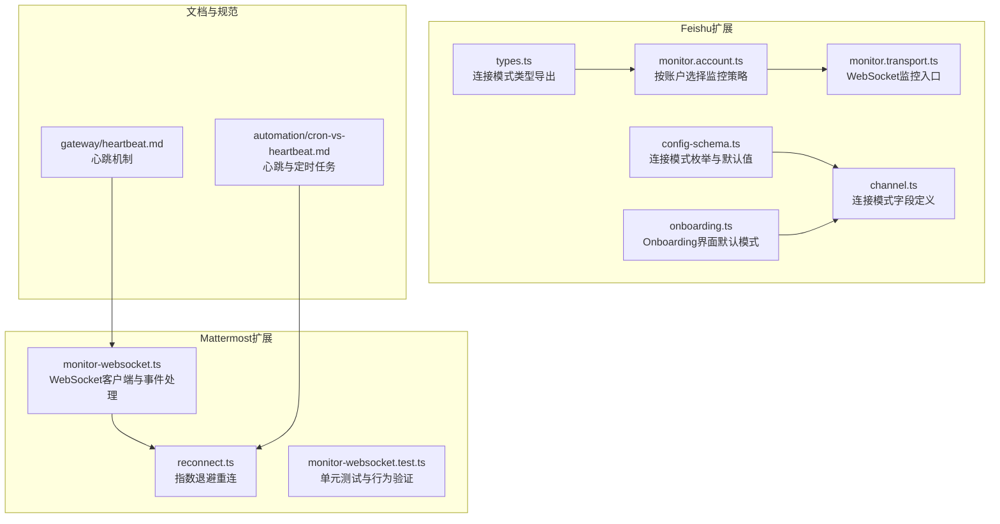
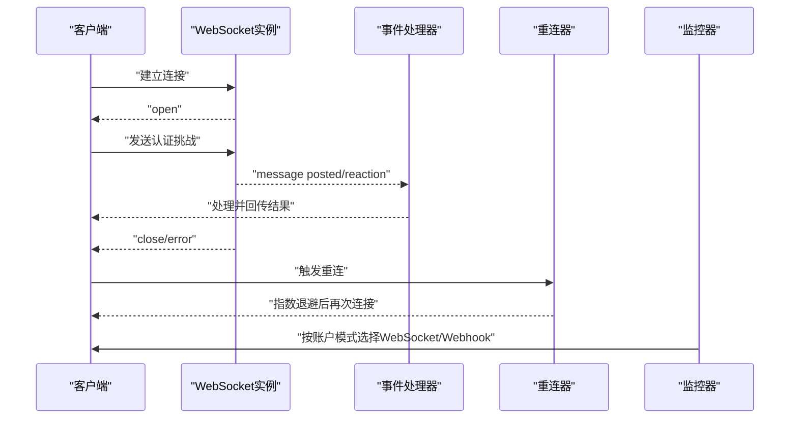
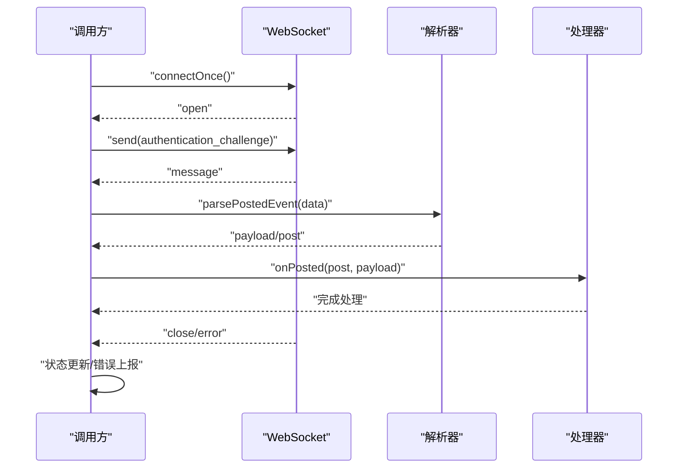
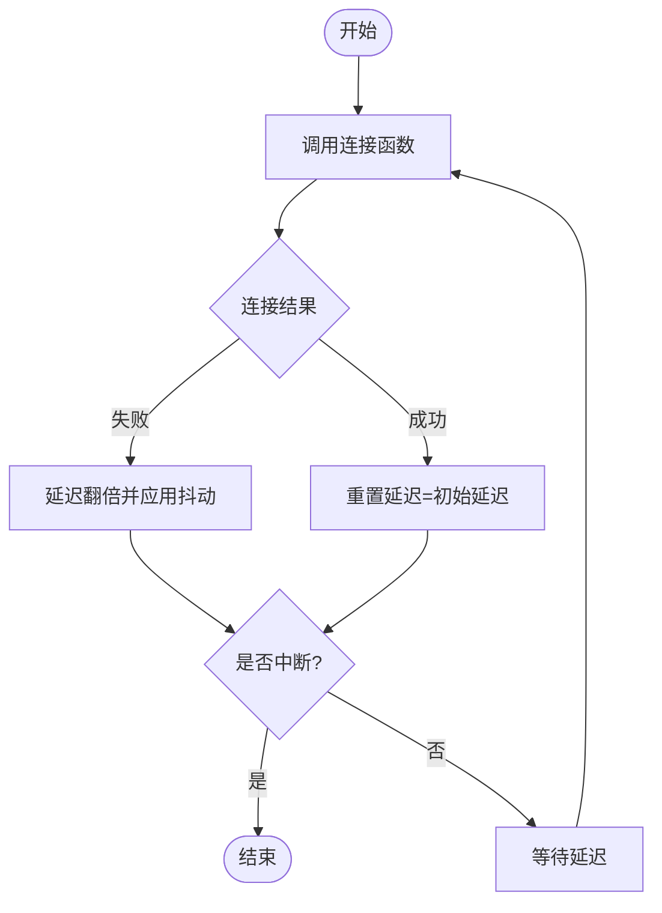
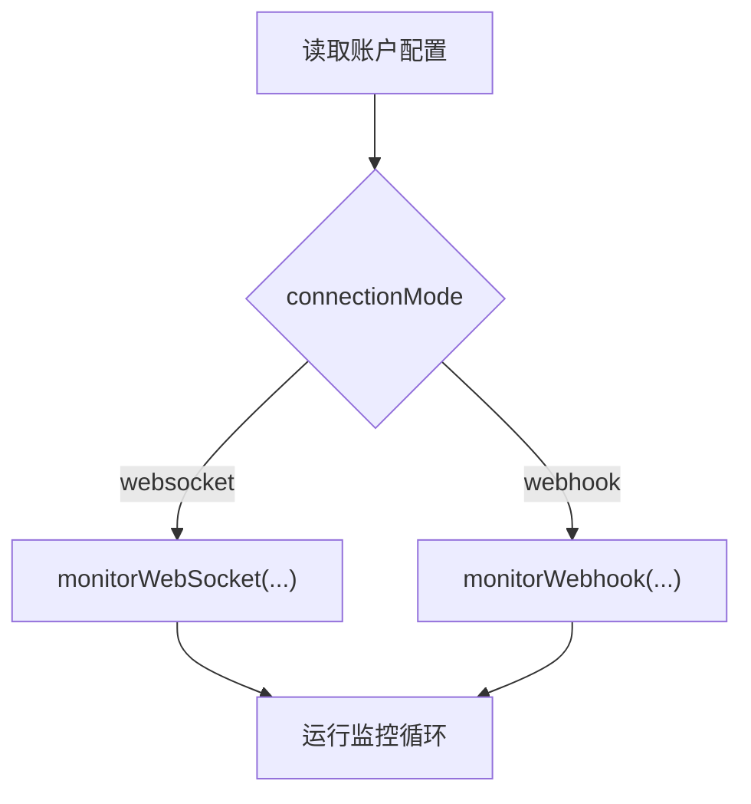
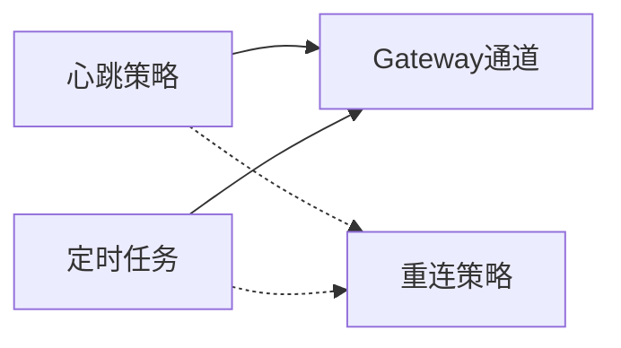
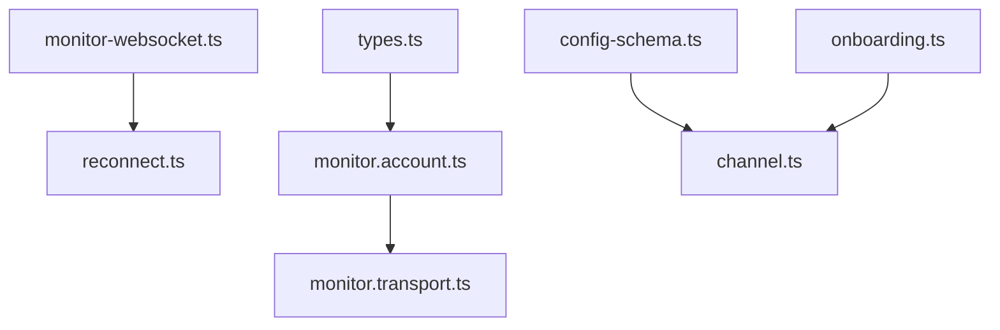

# WebSocket协议

<cite>
**本文引用的文件**
- [spec.md](file://Swabble/docs/spec.md)
- [monitor-websocket.ts](file://extensions/mattermost/src/mattermost/monitor-websocket.ts)
- [monitor-websocket.test.ts](file://extensions/mattermost/src/mattermost/monitor-websocket.test.ts)
- [reconnect.ts](file://extensions/mattermost/src/mattermost/reconnect.ts)
- [channel.ts](file://extensions/feishu/src/channel.ts)
- [config-schema.ts](file://extensions/feishu/src/config-schema.ts)
- [monitor.transport.ts](file://extensions/feishu/src/monitor.transport.ts)
- [monitor.account.ts](file://extensions/feishu/src/monitor.account.ts)
- [onboarding.ts](file://extensions/feishu/src/onboarding.ts)
- [types.ts](file://extensions/feishu/src/types.ts)
- [heartbeat.md](file://docs/gateway/heartbeat.md)
- [cron-vs-heartbeat.md](file://docs/automation/cron-vs-heartbeat.md)
</cite>

## 目录
1. [引言](#引言)
2. [项目结构](#项目结构)
3. [核心组件](#核心组件)
4. [架构总览](#架构总览)
5. [详细组件分析](#详细组件分析)
6. [依赖关系分析](#依赖关系分析)
7. [性能考量](#性能考量)
8. [故障排查指南](#故障排查指南)
9. [结论](#结论)
10. [附录](#附录)

## 引言
本文件面向OpenClaw生态中基于WebSocket的实时通信场景，系统性梳理连接建立、维护与断开流程，消息格式与事件类型、序列化与反序列化机制，以及心跳检测、重连策略与连接池管理等关键主题。同时给出协议版本控制、向后兼容与升级建议，并提供协议规范、消息示例与客户端实现要点，最后覆盖安全机制、认证方式与加密传输要求。

## 项目结构
OpenClaw在多个扩展中实现了WebSocket客户端与监控逻辑，典型包括：
- Mattermost扩展：提供WebSocket连接封装、事件解析、认证挑战与重连策略
- Feishu扩展：支持WebSocket与Webhook两种连接模式，具备连接模式配置与监控切换
- 文档与规范：Gateway心跳机制文档与自动化心跳/定时任务对比文档

**图表来源**
- [monitor-websocket.ts](file://extensions/mattermost/src/mattermost/monitor-websocket.ts#L1-L222)
- [reconnect.ts](file://extensions/mattermost/src/mattermost/reconnect.ts#L1-L104)
- [config-schema.ts](file://extensions/feishu/src/config-schema.ts#L1-L260)
- [channel.ts](file://extensions/feishu/src/channel.ts#L100-L400)
- [monitor.transport.ts](file://extensions/feishu/src/monitor.transport.ts#L1-L120)
- [monitor.account.ts](file://extensions/feishu/src/monitor.account.ts#L1-L600)
- [onboarding.ts](file://extensions/feishu/src/onboarding.ts#L320-L380)
- [types.ts](file://extensions/feishu/src/types.ts#L1-L40)
- [heartbeat.md](file://docs/gateway/heartbeat.md#L1-L200)
- [cron-vs-heartbeat.md](file://docs/automation/cron-vs-heartbeat.md#L1-L200)

**章节来源**
- [monitor-websocket.ts](file://extensions/mattermost/src/mattermost/monitor-websocket.ts#L1-L222)
- [reconnect.ts](file://extensions/mattermost/src/mattermost/reconnect.ts#L1-L104)
- [config-schema.ts](file://extensions/feishu/src/config-schema.ts#L1-L260)
- [channel.ts](file://extensions/feishu/src/channel.ts#L100-L400)
- [monitor.transport.ts](file://extensions/feishu/src/monitor.transport.ts#L1-L120)
- [monitor.account.ts](file://extensions/feishu/src/monitor.account.ts#L1-L600)
- [onboarding.ts](file://extensions/feishu/src/onboarding.ts#L320-L380)
- [types.ts](file://extensions/feishu/src/types.ts#L1-L40)
- [heartbeat.md](file://docs/gateway/heartbeat.md#L1-L200)
- [cron-vs-heartbeat.md](file://docs/automation/cron-vs-heartbeat.md#L1-L200)

## 核心组件
- WebSocket客户端与事件处理（Mattermost）
  - 连接生命周期：open、message、close、error
  - 认证挑战：发送“authentication_challenge”动作与令牌
  - 事件解析：posted/reaction等事件的payload解析与分发
  - 状态上报：连接状态、错误、断开原因等
- 指数退避重连（Mattermost）
  - 初始延迟、最大延迟、抖动、可中断睡眠
  - 失败时翻倍延迟，成功时重置
- 连接模式与监控（Feishu）
  - 连接模式：websocket、webhook（枚举与默认值）
  - 账户级监控：根据配置选择WebSocket或Webhook
  - Onboarding界面：默认WebSocket模式
- 心跳机制（Gateway与自动化）
  - Gateway心跳：服务端/通道的心跳策略
  - 定时任务与心跳：两者的边界与适用场景

**章节来源**
- [monitor-websocket.ts](file://extensions/mattermost/src/mattermost/monitor-websocket.ts#L101-L211)
- [reconnect.ts](file://extensions/mattermost/src/mattermost/reconnect.ts#L29-L76)
- [config-schema.ts](file://extensions/feishu/src/config-schema.ts#L1-L260)
- [monitor.account.ts](file://extensions/feishu/src/monitor.account.ts#L500-L560)
- [heartbeat.md](file://docs/gateway/heartbeat.md#L1-L200)
- [cron-vs-heartbeat.md](file://docs/automation/cron-vs-heartbeat.md#L1-L200)

## 架构总览
下图展示了OpenClaw中WebSocket相关模块的交互关系，涵盖连接建立、事件处理、重连与监控切换。

**图表来源**
- [monitor-websocket.ts](file://extensions/mattermost/src/mattermost/monitor-websocket.ts#L101-L211)
- [reconnect.ts](file://extensions/mattermost/src/mattermost/reconnect.ts#L29-L76)
- [monitor.account.ts](file://extensions/feishu/src/monitor.account.ts#L500-L560)

## 详细组件分析

### Mattermost WebSocket客户端与事件处理
- 连接建立
  - 创建WebSocket实例，注册open/message/close/error回调
  - 在open回调中发送认证挑战，携带序列号与令牌
- 事件解析
  - 解析message为JSON，识别posted/reaction等事件
  - posted事件解析post对象；reaction事件调用反应处理器
- 断开与错误
  - close事件记录断开时间、状态码与原因
  - error事件记录错误并尝试关闭连接
- 状态上报
  - 连接成功时更新connected、lastConnectedAt、lastError
  - 断开时更新connected与lastDisconnect

**图表来源**
- [monitor-websocket.ts](file://extensions/mattermost/src/mattermost/monitor-websocket.ts#L101-L211)

**章节来源**
- [monitor-websocket.ts](file://extensions/mattermost/src/mattermost/monitor-websocket.ts#L1-L222)
- [monitor-websocket.test.ts](file://extensions/mattermost/src/mattermost/monitor-websocket.test.ts#L1-L233)

### 指数退避重连策略
- 参数
  - initialDelayMs：初始延迟
  - maxDelayMs：最大延迟
  - jitterRatio：抖动比例
  - random：随机数生成器
  - shouldReconnect：自定义重连条件
- 行为
  - 成功连接后重置延迟
  - 失败时翻倍延迟，上限为maxDelayMs
  - 延迟加入抖动，避免雪崩效应
  - 支持AbortSignal中断

**图表来源**
- [reconnect.ts](file://extensions/mattermost/src/mattermost/reconnect.ts#L29-L76)

**章节来源**
- [reconnect.ts](file://extensions/mattermost/src/mattermost/reconnect.ts#L1-L104)

### Feishu连接模式与监控切换
- 连接模式定义
  - 枚举：websocket、webhook
  - 默认值：websocket
- 配置与界面
  - channel配置中暴露connectionMode字段
  - Onboarding界面默认选择websocket
- 监控策略
  - monitor.account按账户配置选择monitorWebSocket或monitorWebhook
  - monitor.transport根据账户模式启动对应监控

**图表来源**
- [config-schema.ts](file://extensions/feishu/src/config-schema.ts#L1-L260)
- [channel.ts](file://extensions/feishu/src/channel.ts#L100-L400)
- [monitor.account.ts](file://extensions/feishu/src/monitor.account.ts#L500-L560)
- [monitor.transport.ts](file://extensions/feishu/src/monitor.transport.ts#L1-L120)
- [onboarding.ts](file://extensions/feishu/src/onboarding.ts#L320-L380)
- [types.ts](file://extensions/feishu/src/types.ts#L1-L40)

**章节来源**
- [config-schema.ts](file://extensions/feishu/src/config-schema.ts#L1-L260)
- [channel.ts](file://extensions/feishu/src/channel.ts#L100-L400)
- [monitor.account.ts](file://extensions/feishu/src/monitor.account.ts#L500-L560)
- [monitor.transport.ts](file://extensions/feishu/src/monitor.transport.ts#L1-L120)
- [onboarding.ts](file://extensions/feishu/src/onboarding.ts#L320-L380)
- [types.ts](file://extensions/feishu/src/types.ts#L1-L40)

### 心跳检测与自动化
- Gateway心跳
  - 用于检测通道健康度与存活状态
  - 可结合重连策略进行联动
- 定时任务 vs 心跳
  - 心跳更偏向实时性与低延迟探测
  - 定时任务适合周期性检查与批处理

**图表来源**
- [heartbeat.md](file://docs/gateway/heartbeat.md#L1-L200)
- [cron-vs-heartbeat.md](file://docs/automation/cron-vs-heartbeat.md#L1-L200)

**章节来源**
- [heartbeat.md](file://docs/gateway/heartbeat.md#L1-L200)
- [cron-vs-heartbeat.md](file://docs/automation/cron-vs-heartbeat.md#L1-L200)

## 依赖关系分析
- 组件耦合
  - Mattermost WebSocket客户端与重连器松耦合，通过回调与参数传递
  - Feishu监控器通过账户配置决定具体监控实现
- 外部依赖
  - ws库用于WebSocket客户端
  - 浏览器/Node环境下的AbortSignal用于可中断等待
- 潜在环路
  - 当前模块间无直接循环依赖

**图表来源**
- [monitor-websocket.ts](file://extensions/mattermost/src/mattermost/monitor-websocket.ts#L1-L222)
- [reconnect.ts](file://extensions/mattermost/src/mattermost/reconnect.ts#L1-L104)
- [monitor.account.ts](file://extensions/feishu/src/monitor.account.ts#L1-L600)
- [monitor.transport.ts](file://extensions/feishu/src/monitor.transport.ts#L1-L120)
- [config-schema.ts](file://extensions/feishu/src/config-schema.ts#L1-L260)
- [channel.ts](file://extensions/feishu/src/channel.ts#L100-L400)
- [onboarding.ts](file://extensions/feishu/src/onboarding.ts#L320-L380)
- [types.ts](file://extensions/feishu/src/types.ts#L1-L40)

**章节来源**
- [monitor-websocket.ts](file://extensions/mattermost/src/mattermost/monitor-websocket.ts#L1-L222)
- [reconnect.ts](file://extensions/mattermost/src/mattermost/reconnect.ts#L1-L104)
- [monitor.account.ts](file://extensions/feishu/src/monitor.account.ts#L1-L600)
- [monitor.transport.ts](file://extensions/feishu/src/monitor.transport.ts#L1-L120)
- [config-schema.ts](file://extensions/feishu/src/config-schema.ts#L1-L260)
- [channel.ts](file://extensions/feishu/src/channel.ts#L100-L400)
- [onboarding.ts](file://extensions/feishu/src/onboarding.ts#L320-L380)
- [types.ts](file://extensions/feishu/src/types.ts#L1-L40)

## 性能考量
- 指数退避抖动
  - 降低网络拥塞与服务器压力峰值
  - 建议合理设置初始与最大延迟，避免过长恢复时间
- 连接池管理
  - 单连接模型适用于大多数通道
  - 多账户场景建议按账户独立连接，避免共享连接导致的阻塞
- 序列化与解析
  - 使用最小必要字段，避免大对象频繁序列化
  - 对异常数据进行快速失败与日志记录，减少无效处理

## 故障排查指南
- 常见问题
  - 连接在open之前关闭：抛出特定错误类型，需检查网络与凭证
  - 认证失败：确认令牌有效性与序列号递增
  - 事件解析失败：检查payload格式与字段完整性
- 诊断步骤
  - 启用详细日志，记录open/close/error事件
  - 观察重连次数与延迟曲线，判断网络波动
  - 对比不同连接模式（WebSocket/Webhook）的稳定性

**章节来源**
- [monitor-websocket.ts](file://extensions/mattermost/src/mattermost/monitor-websocket.ts#L1-L222)
- [monitor-websocket.test.ts](file://extensions/mattermost/src/mattermost/monitor-websocket.test.ts#L1-L233)
- [reconnect.ts](file://extensions/mattermost/src/mattermost/reconnect.ts#L1-L104)

## 结论
OpenClaw在Mattermost与Feishu等扩展中提供了稳健的WebSocket客户端实现与监控体系。通过明确的事件解析、可配置的连接模式与指数退避重连策略，系统能够在复杂网络环境中保持高可用。配合Gateway心跳与自动化策略，可进一步提升整体稳定性与可观测性。

## 附录

### 协议规范与消息示例（基于现有实现）
- 连接建立
  - 客户端在open回调中发送认证挑战，包含序列号与令牌
  - 服务端返回相应事件以确认连接状态
- 事件类型
  - posted：消息发布事件，包含post对象
  - reaction_added/reaction_removed：反应事件，包含reaction对象
- 消息序列化与反序列化
  - 使用JSON进行消息编解码
  - 对异常payload进行容错处理与日志记录

**章节来源**
- [monitor-websocket.ts](file://extensions/mattermost/src/mattermost/monitor-websocket.ts#L101-L211)

### 安全机制与认证
- 认证方式
  - 令牌认证：在认证挑战中携带令牌
  - 建议使用TLS加密传输，防止明文泄露
- 加密传输
  - 使用wss://协议
  - 服务端证书校验与中间人攻击防护

**章节来源**
- [monitor-websocket.ts](file://extensions/mattermost/src/mattermost/monitor-websocket.ts#L101-L211)

### 版本控制、向后兼容与升级
- 版本控制
  - 通过序列号与动作字段区分协议版本
  - 服务端与客户端应保持兼容性
- 向后兼容
  - 新增字段采用可选策略，避免破坏旧客户端
- 升级机制
  - 逐步迁移至新版本，保留过渡期的双栈支持

**章节来源**
- [monitor-websocket.ts](file://extensions/mattermost/src/mattermost/monitor-websocket.ts#L101-L211)