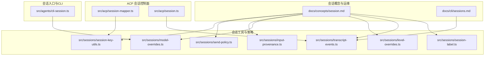
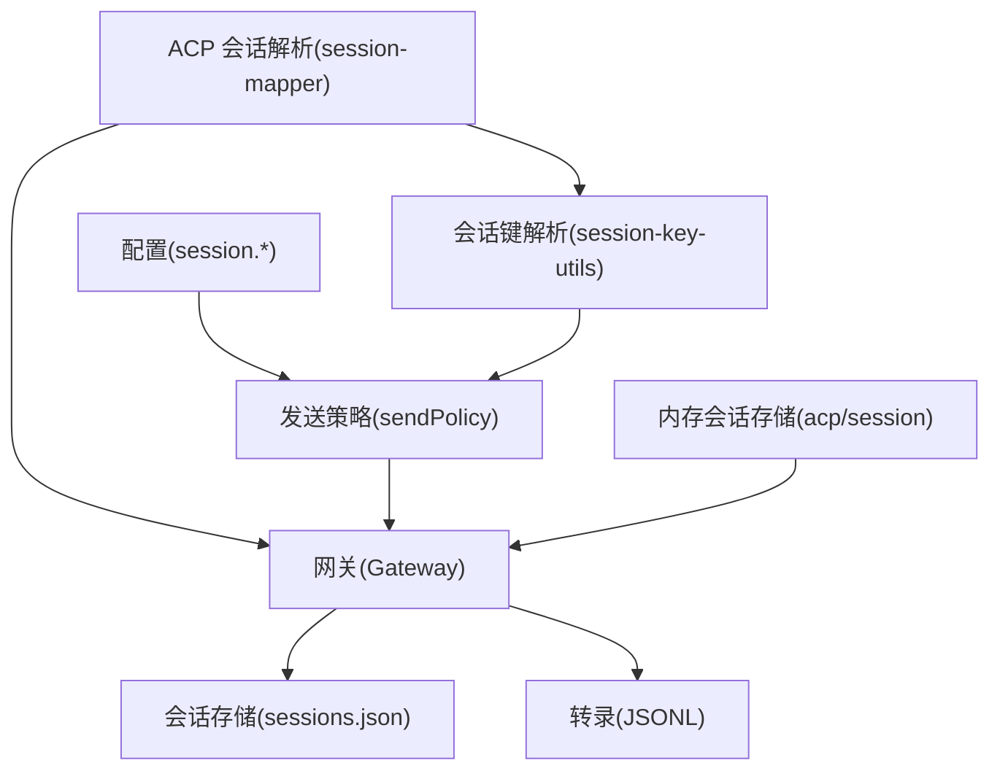
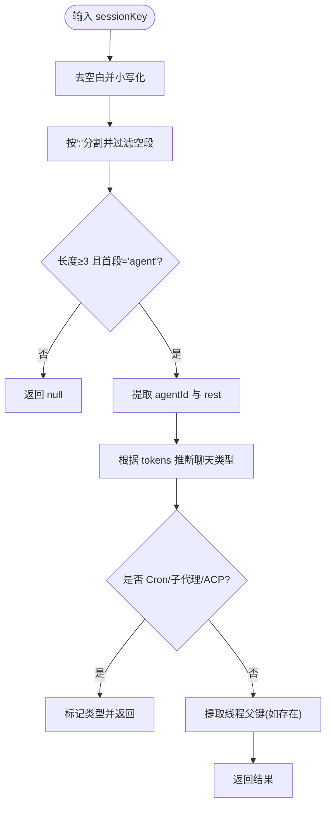
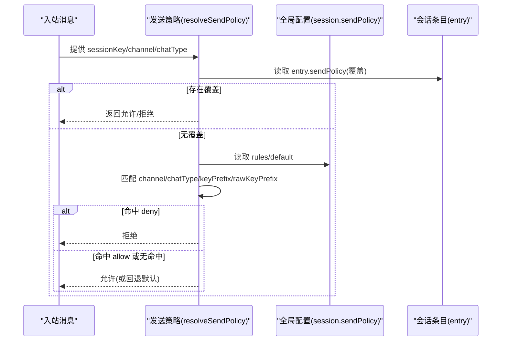
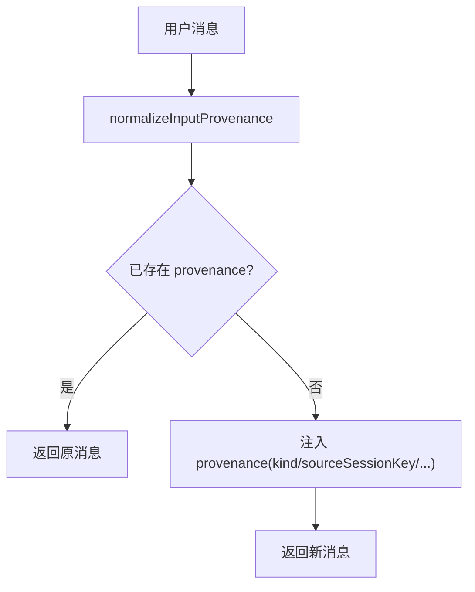
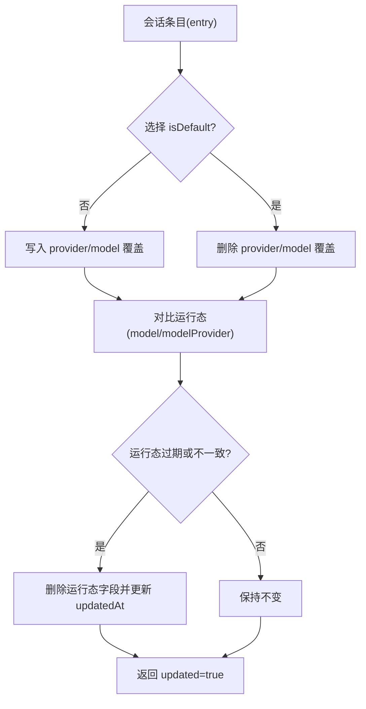
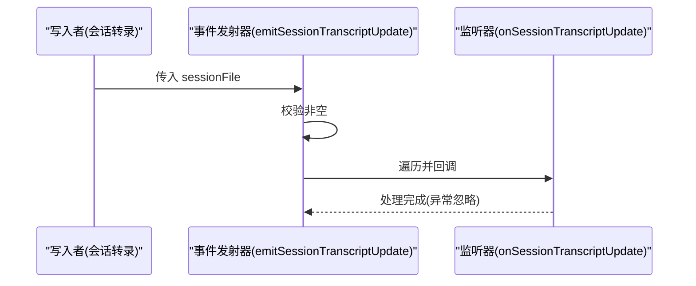
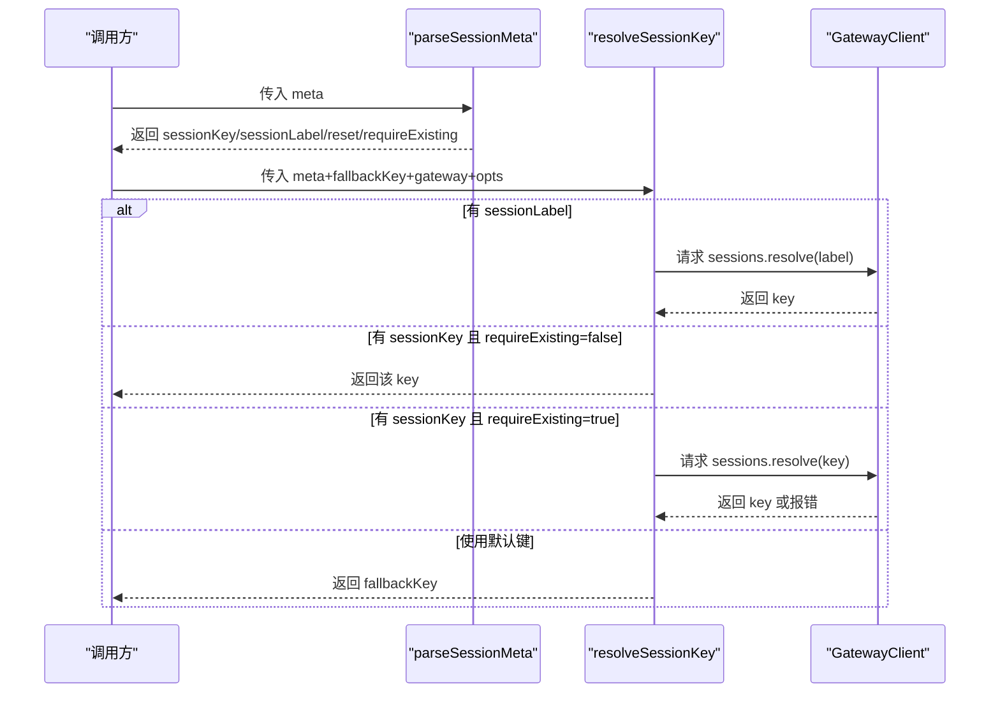
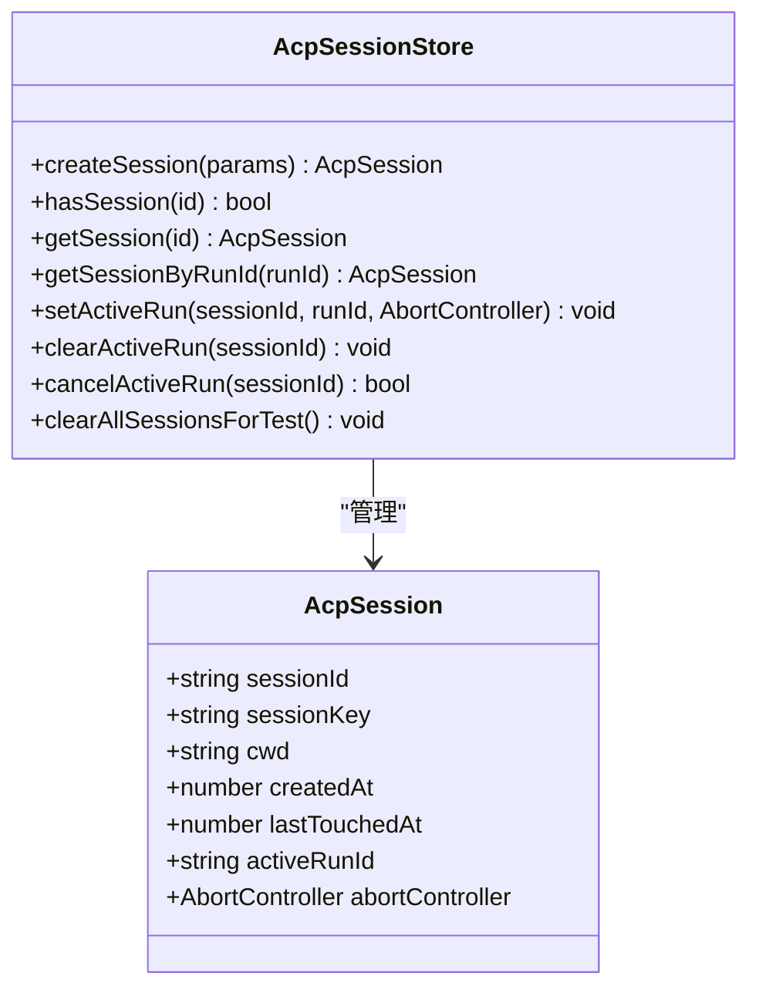
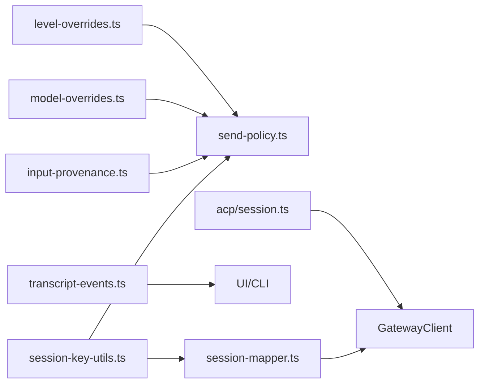

# 会话管理

<cite>
**本文引用的文件**
- [docs/concepts/session.md](file://docs/concepts/session.md)
- [docs/cli/sessions.md](file://docs/cli/sessions.md)
- [src/sessions/session-key-utils.ts](file://src/sessions/session-key-utils.ts)
- [src/sessions/session-label.ts](file://src/sessions/session-label.ts)
- [src/sessions/input-provenance.ts](file://src/sessions/input-provenance.ts)
- [src/sessions/level-overrides.ts](file://src/sessions/level-overrides.ts)
- [src/sessions/send-policy.ts](file://src/sessions/send-policy.ts)
- [src/sessions/transcript-events.ts](file://src/sessions/transcript-events.ts)
- [src/sessions/model-overrides.ts](file://src/sessions/model-overrides.ts)
- [src/acp/session-mapper.ts](file://src/acp/session-mapper.ts)
- [src/acp/session.ts](file://src/acp/session.ts)
- [src/agents/cli-session.ts](file://src/agents/cli-session.ts)
</cite>

## 目录
1. [简介](#简介)
2. [项目结构](#项目结构)
3. [核心组件](#核心组件)
4. [架构总览](#架构总览)
5. [详细组件分析](#详细组件分析)
6. [依赖关系分析](#依赖关系分析)
7. [性能考量](#性能考量)
8. [故障排查指南](#故障排查指南)
9. [结论](#结论)
10. [附录](#附录)

## 简介
本技术文档围绕 OpenClaw 的会话管理系统，系统性阐述会话生命周期管理、状态跟踪与持久化机制；详解会话键解析算法、路由规则与转发策略；说明会话补丁机制（增量更新与冲突解决）；给出会话存储格式、索引策略与查询优化建议；并提供会话配置项、性能调优参数与监控指标，以及会话安全机制、访问控制与数据隔离策略。

## 项目结构
OpenClaw 将“会话”能力拆分为概念文档、会话工具函数、发送策略、输入来源标注、模型与级别覆盖、以及 ACP 控制面的会话解析与内存会话存储等模块。核心会话相关代码位于 src/sessions 与 src/acp 下，概念与运维参考位于 docs。

图表来源
- [docs/concepts/session.md](file://docs/concepts/session.md#L1-L311)
- [docs/cli/sessions.md](file://docs/cli/sessions.md#L1-L105)
- [src/sessions/session-key-utils.ts](file://src/sessions/session-key-utils.ts#L1-L133)
- [src/sessions/send-policy.ts](file://src/sessions/send-policy.ts#L1-L124)
- [src/sessions/input-provenance.ts](file://src/sessions/input-provenance.ts#L1-L80)
- [src/sessions/model-overrides.ts](file://src/sessions/model-overrides.ts#L1-L102)
- [src/sessions/level-overrides.ts](file://src/sessions/level-overrides.ts#L1-L33)
- [src/sessions/transcript-events.ts](file://src/sessions/transcript-events.ts#L1-L30)
- [src/sessions/session-label.ts](file://src/sessions/session-label.ts#L1-L21)
- [src/acp/session-mapper.ts](file://src/acp/session-mapper.ts#L1-L99)
- [src/acp/session.ts](file://src/acp/session.ts#L1-L191)
- [src/agents/cli-session.ts](file://src/agents/cli-session.ts#L1-L38)

章节来源
- [docs/concepts/session.md](file://docs/concepts/session.md#L1-L311)
- [docs/cli/sessions.md](file://docs/cli/sessions.md#L1-L105)

## 核心组件
- 会话键解析与类型推断：负责将字符串键标准化、识别聊天类型（直接/群组/频道）、判定 Cron/子代理/Acp 等特殊键，并支持线程父键提取。
- 发送策略：基于通道、聊天类型、键前缀等规则进行允许/拒绝决策，支持运行时覆盖。
- 输入来源标注：为用户消息注入“来源”元信息，支持跨会话来源标记与校验。
- 模型与级别覆盖：对会话条目应用模型选择与认证配置覆盖，清理过期运行态字段以保持状态一致。
- 会话事件监听：对会话转录文件变更发出事件通知，便于外部订阅与刷新。
- ACP 会话解析与内存会话存储：在控制面解析会话标签/键，必要时请求网关解析或重置；提供内存会话存储以管理活跃运行与空闲回收。
- CLI 会话 ID 映射：为不同 Provider 维护 CLI 侧会话 ID，兼容旧版字段。

章节来源
- [src/sessions/session-key-utils.ts](file://src/sessions/session-key-utils.ts#L1-L133)
- [src/sessions/send-policy.ts](file://src/sessions/send-policy.ts#L1-L124)
- [src/sessions/input-provenance.ts](file://src/sessions/input-provenance.ts#L1-L80)
- [src/sessions/model-overrides.ts](file://src/sessions/model-overrides.ts#L1-L102)
- [src/sessions/level-overrides.ts](file://src/sessions/level-overrides.ts#L1-L33)
- [src/sessions/transcript-events.ts](file://src/sessions/transcript-events.ts#L1-L30)
- [src/acp/session-mapper.ts](file://src/acp/session-mapper.ts#L1-L99)
- [src/acp/session.ts](file://src/acp/session.ts#L1-L191)
- [src/agents/cli-session.ts](file://src/agents/cli-session.ts#L1-L38)

## 架构总览
OpenClaw 的会话由“网关作为权威源”的设计主导：UI 客户端通过网关查询会话列表与用量；会话键解析与路由规则在各通道/扩展中统一；发送策略在入站/出站路径上生效；维护策略保障会话存储与转录文件的体积与寿命；ACP 控制面负责会话解析与内存会话生命周期管理。

图表来源
- [docs/concepts/session.md](file://docs/concepts/session.md#L57-L72)
- [src/sessions/session-key-utils.ts](file://src/sessions/session-key-utils.ts#L1-L133)
- [src/sessions/send-policy.ts](file://src/sessions/send-policy.ts#L1-L124)
- [src/acp/session-mapper.ts](file://src/acp/session-mapper.ts#L1-L99)
- [src/acp/session.ts](file://src/acp/session.ts#L1-L191)

## 详细组件分析

### 会话键解析与类型推断
- 解析规范：大小写不敏感、去除空白、要求至少三段且首段为“agent”，返回 agentId 与剩余部分。
- 类型推断：依据包含的关键词集合判断聊天类型（group/channel/direct/dm），并兼容部分历史格式。
- 特殊键识别：支持 Cron 运行键、Cron 总控键、子代理键、ACP 键等。
- 线程父键：从带 thread/topic 标记的键中提取父键，用于线程/话题场景的上下文关联。

图表来源
- [src/sessions/session-key-utils.ts](file://src/sessions/session-key-utils.ts#L12-L59)
- [src/sessions/session-key-utils.ts](file://src/sessions/session-key-utils.ts#L61-L87)
- [src/sessions/session-key-utils.ts](file://src/sessions/session-key-utils.ts#L112-L132)

章节来源
- [src/sessions/session-key-utils.ts](file://src/sessions/session-key-utils.ts#L1-L133)

### 发送策略与路由规则
- 决策优先级：会话级覆盖 > 全局配置 > 默认允许。
- 匹配维度：通道(channel)、聊天类型(chatType)、键前缀(keyPrefix/rawKeyPrefix)。
- 行为：遇到首个匹配的 deny 规则即拒绝；否则允许；若无匹配再回退到默认值。
- 运行时覆盖：Owner 可通过指令临时允许/禁止/继承。

图表来源
- [src/sessions/send-policy.ts](file://src/sessions/send-policy.ts#L53-L123)

章节来源
- [src/sessions/send-policy.ts](file://src/sessions/send-policy.ts#L1-L124)

### 输入来源标注与跨会话来源
- 支持三种来源类型：external_user、inter_session、internal_system。
- 对用户消息注入 provenance 字段，避免重复注入。
- 提供工具函数判断 inter_session 来源，便于跨会话引用与溯源。

图表来源
- [src/sessions/input-provenance.ts](file://src/sessions/input-provenance.ts#L32-L66)

章节来源
- [src/sessions/input-provenance.ts](file://src/sessions/input-provenance.ts#L1-L80)

### 模型与认证配置覆盖
- 覆盖范围：provider/model、认证配置(profileOverride)。
- 冲突解决：当覆盖变更或与运行态不一致时，清除过期运行态字段，确保状态一致。
- 默认覆盖：当选择 isDefault 时，移除之前记录的覆盖项。

图表来源
- [src/sessions/model-overrides.ts](file://src/sessions/model-overrides.ts#L9-L101)

章节来源
- [src/sessions/model-overrides.ts](file://src/sessions/model-overrides.ts#L1-L102)

### 会话事件监听与转录更新
- 提供注册监听器与发射事件的能力，监听者在收到更新后可刷新 UI 或触发后续处理。
- 事件仅在文件名非空时触发，异常被吞掉以保证稳定性。

图表来源
- [src/sessions/transcript-events.ts](file://src/sessions/transcript-events.ts#L9-L29)

章节来源
- [src/sessions/transcript-events.ts](file://src/sessions/transcript-events.ts#L1-L30)

### ACP 会话解析与内存会话存储
- 会话解析：支持通过标签/键解析，必要时要求已存在；支持强制重置。
- 内存会话存储：维护 Map 与 runId 到 sessionId 的映射；支持设置/清除活跃运行、取消运行、空闲回收与容量上限回收。

图表来源
- [src/acp/session-mapper.ts](file://src/acp/session-mapper.ts#L13-L84)

图表来源
- [src/acp/session.ts](file://src/acp/session.ts#L4-L13)

章节来源
- [src/acp/session-mapper.ts](file://src/acp/session-mapper.ts#L1-L99)
- [src/acp/session.ts](file://src/acp/session.ts#L1-L191)

### CLI 会话 ID 映射
- 为不同 Provider 维护 CLI 会话 ID 映射表，兼容旧版字段；写入时去空白并合并映射。

章节来源
- [src/agents/cli-session.ts](file://src/agents/cli-session.ts#L1-L38)

## 依赖关系分析
- 会话键解析被发送策略与 ACP 解析共同依赖，形成“键→类型→策略”的基础链路。
- 输入来源标注在消息进入系统时注入，影响后续跨会话引用与溯源。
- 模型/级别覆盖在会话条目层面生效，与发送策略共同决定会话行为。
- 会话事件监听独立于上述链路，但常被 UI 与维护流程订阅。
- ACP 会话存储与网关交互，承担控制面的会话生命周期管理职责。

图表来源
- [src/sessions/session-key-utils.ts](file://src/sessions/session-key-utils.ts#L1-L133)
- [src/sessions/send-policy.ts](file://src/sessions/send-policy.ts#L1-L124)
- [src/sessions/input-provenance.ts](file://src/sessions/input-provenance.ts#L1-L80)
- [src/sessions/model-overrides.ts](file://src/sessions/model-overrides.ts#L1-L102)
- [src/sessions/level-overrides.ts](file://src/sessions/level-overrides.ts#L1-L33)
- [src/sessions/transcript-events.ts](file://src/sessions/transcript-events.ts#L1-L30)
- [src/acp/session-mapper.ts](file://src/acp/session-mapper.ts#L1-L99)
- [src/acp/session.ts](file://src/acp/session.ts#L1-L191)

章节来源
- [src/sessions/session-key-utils.ts](file://src/sessions/session-key-utils.ts#L1-L133)
- [src/sessions/send-policy.ts](file://src/sessions/send-policy.ts#L1-L124)
- [src/sessions/input-provenance.ts](file://src/sessions/input-provenance.ts#L1-L80)
- [src/sessions/model-overrides.ts](file://src/sessions/model-overrides.ts#L1-L102)
- [src/sessions/level-overrides.ts](file://src/sessions/level-overrides.ts#L1-L33)
- [src/sessions/transcript-events.ts](file://src/sessions/transcript-events.ts#L1-L30)
- [src/acp/session-mapper.ts](file://src/acp/session-mapper.ts#L1-L99)
- [src/acp/session.ts](file://src/acp/session.ts#L1-L191)

## 性能考量
- 维护策略成本主要来自：
  - 高 entry 数量上限
  - 较长保留窗口导致陈旧条目滞留
  - 大量转录/归档文件
  - 启用磁盘预算而缺乏合理修剪/上限
- 建议：
  - 生产环境使用“强制执行”模式，自动限制增长
  - 同时设置时间与数量阈值，避免单一维度失效
  - 在启用磁盘预算时，合理设置高水位线与硬上限
  - 使用干跑评估影响后再强制执行
  - 频繁活跃会话场景下，清理时保护活跃键

章节来源
- [docs/concepts/session.md](file://docs/concepts/session.md#L101-L120)

## 故障排查指南
- 会话键无法解析或类型错误
  - 检查键格式是否符合“agent:<agentId>:...”规范，注意大小写与分隔符
  - 使用类型推断辅助定位 direct/group/channel
- 发送策略误判
  - 核对通道/聊天类型/键前缀匹配是否正确
  - 查看会话级覆盖与全局默认值
- 跨会话来源未生效
  - 确认用户消息已注入 provenance
  - 检查 inter_session 标记是否正确
- 模型/认证覆盖未生效
  - 确认覆盖是否为默认覆盖或具体 provider/model
  - 检查运行态字段是否被清理并重新对齐
- 会话事件未触发
  - 确认 sessionFile 非空
  - 检查监听器注册与异常捕获
- ACP 会话解析失败
  - 标签/键解析失败时检查网关响应
  - 必要时开启 requireExisting 并确认键存在
- CLI 会话 ID 不生效
  - 检查映射表与旧版字段是否一致

章节来源
- [src/sessions/session-key-utils.ts](file://src/sessions/session-key-utils.ts#L1-L133)
- [src/sessions/send-policy.ts](file://src/sessions/send-policy.ts#L1-L124)
- [src/sessions/input-provenance.ts](file://src/sessions/input-provenance.ts#L1-L80)
- [src/sessions/model-overrides.ts](file://src/sessions/model-overrides.ts#L1-L102)
- [src/sessions/transcript-events.ts](file://src/sessions/transcript-events.ts#L1-L30)
- [src/acp/session-mapper.ts](file://src/acp/session-mapper.ts#L1-L99)
- [src/agents/cli-session.ts](file://src/agents/cli-session.ts#L1-L38)

## 结论
OpenClaw 的会话管理以“网关权威源”为核心，结合统一的会话键解析、发送策略、输入来源标注与覆盖机制，形成可配置、可观测、可维护的会话体系。通过合理的维护策略与性能调优参数，可在高并发与多账户场景下保持稳定与高效。ACP 控制面提供了会话生命周期的内存管理与解析能力，配合 CLI 与 UI 实现全链路的会话治理。

## 附录

### 会话存储格式与索引策略
- 存储位置与结构
  - 会话存储：每个 Agent 的 sessions.json 为“键→条目”的映射
  - 转录文件：每个会话对应一个 JSONL 文件，群组/频道/话题可能有额外后缀
  - 条目包含：sessionId、updatedAt、模型/用量等字段；群组条目可包含显示名与来源元数据
- 索引与查询
  - 以 sessionKey 为主键索引
  - 通过 deriveSessionChatType 与键前缀快速分类
  - 维护 origin 元数据以便 UI 展示来源与路由提示

章节来源
- [docs/concepts/session.md](file://docs/concepts/session.md#L64-L72)
- [src/sessions/session-key-utils.ts](file://src/sessions/session-key-utils.ts#L37-L59)

### 会话生命周期与重置策略
- 重置策略
  - 默认按日重置，本地时间为网关主机时间
  - 支持空闲重置（idleMinutes）
  - 支持按类型/按通道覆盖
  - 手动触发：/new 或 /reset（可携带模型参数）
- 清理与维护
  - 维护模式：warn/enforce
  - 步骤：按时间裁剪→按数量裁剪→归档→清理归档→轮转存储→按磁盘预算清理
  - CLI：sessions 与 sessions cleanup

章节来源
- [docs/concepts/session.md](file://docs/concepts/session.md#L177-L218)
- [docs/cli/sessions.md](file://docs/cli/sessions.md#L48-L73)

### 会话补丁机制与冲突解决
- 补丁与增量更新
  - 通过覆盖层（模型/级别/发送策略）实现增量更新
  - 覆盖层优先于运行态字段，变更时清理过期运行态字段
- 冲突解决
  - 发送策略：首个命中 deny 即拒绝；否则允许；无命中回退默认
  - 模型覆盖：默认覆盖清空 provider/model 覆盖；具体覆盖写入并同步运行态
  - 标签/键解析：以网关解析为准，requireExisting 严格校验

章节来源
- [src/sessions/send-policy.ts](file://src/sessions/send-policy.ts#L53-L123)
- [src/sessions/model-overrides.ts](file://src/sessions/model-overrides.ts#L9-L101)
- [src/acp/session-mapper.ts](file://src/acp/session-mapper.ts#L38-L84)

### 会话安全机制与访问控制
- 安全 DM 模式
  - 多人 DM 场景推荐隔离策略（per-channel-peer/per-account-channel-peer）
  - 使用 identityLinks 将不同通道的同一联系人映射到统一身份
- 访问控制
  - 发送策略可按通道/类型/键前缀阻断特定会话类型的投递
  - 运行时可通过指令临时覆盖当前会话的发送策略
- 数据隔离
  - 会话键包含 agentId、通道、账号等维度，确保跨通道/跨账号隔离
  - 群组/频道/话题键具备唯一性，避免上下文串扰

章节来源
- [docs/concepts/session.md](file://docs/concepts/session.md#L20-L56)
- [src/sessions/send-policy.ts](file://src/sessions/send-policy.ts#L53-L123)
- [src/sessions/session-key-utils.ts](file://src/sessions/session-key-utils.ts#L194-L198)

### 会话配置选项与运维建议
- 关键配置
  - session.dmScope、session.reset、session.resetByType、session.resetByChannel、session.resetTriggers
  - session.sendPolicy、session.store、session.mainKey、session.identityLinks
  - session.maintenance.*（mode、pruneAfter、maxEntries、rotateBytes、maxDiskBytes、highWaterBytes、resetArchiveRetention）
- 运维建议
  - 使用 sessions 与 sessions cleanup CLI 查看与清理
  - 在大规模部署中启用 enforce 模式并设置磁盘预算
  - 使用干跑评估影响后再强制执行

章节来源
- [docs/concepts/session.md](file://docs/concepts/session.md#L246-L277)
- [docs/concepts/session.md](file://docs/concepts/session.md#L78-L120)
- [docs/cli/sessions.md](file://docs/cli/sessions.md#L12-L73)