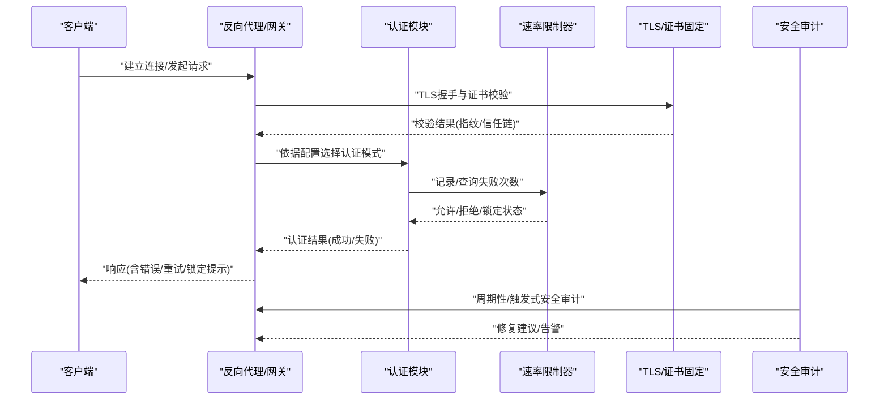
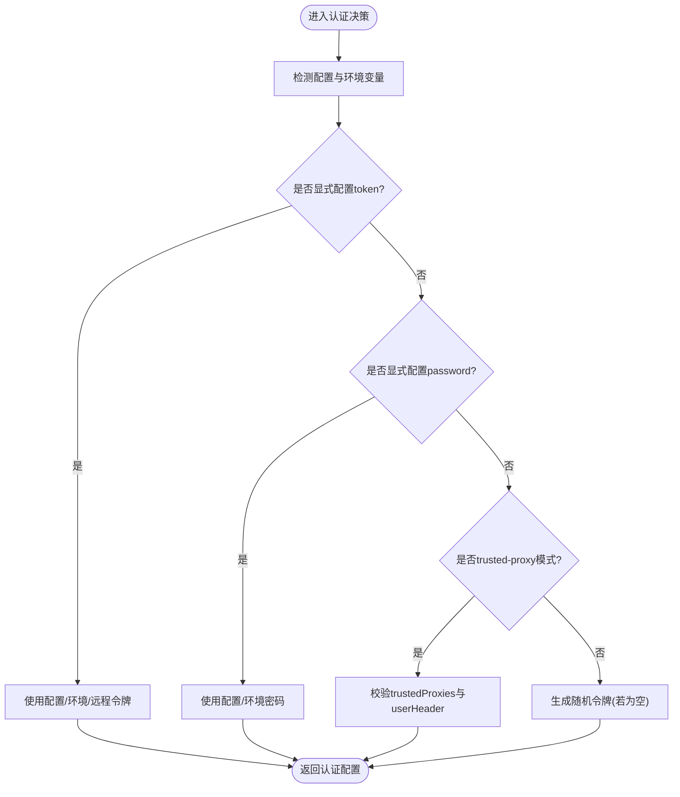
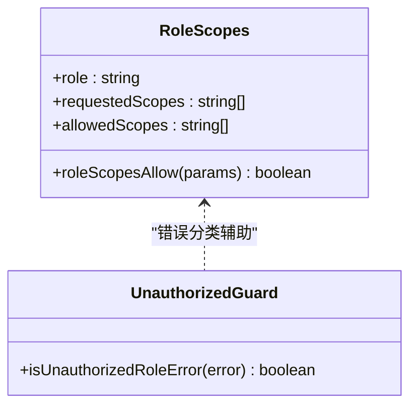
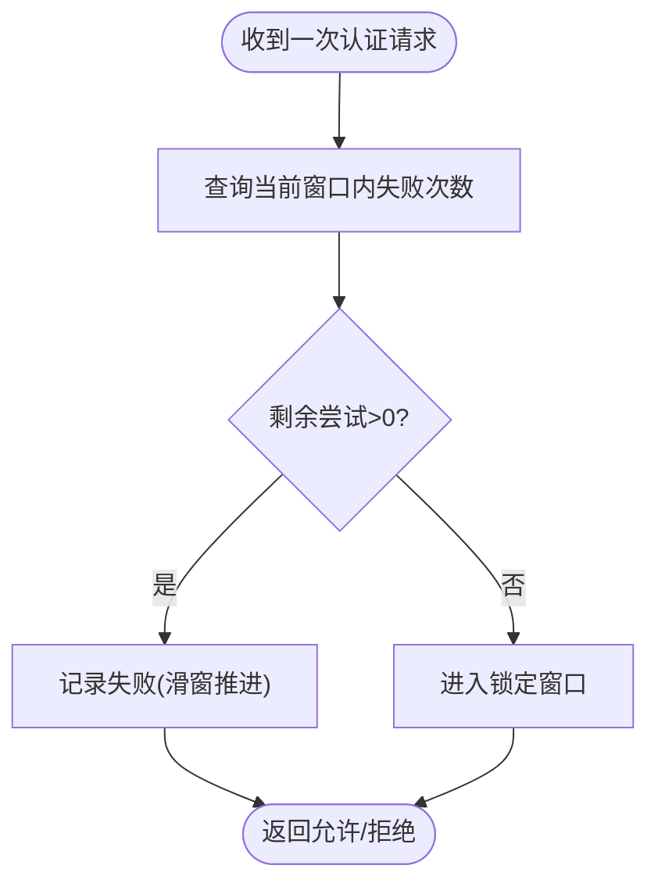
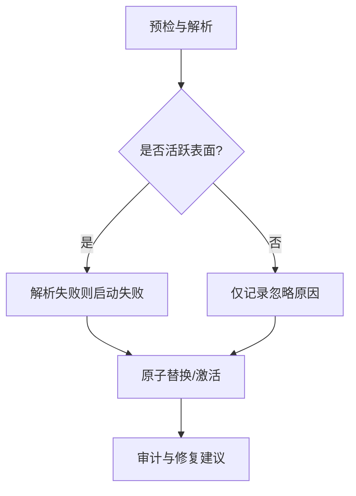
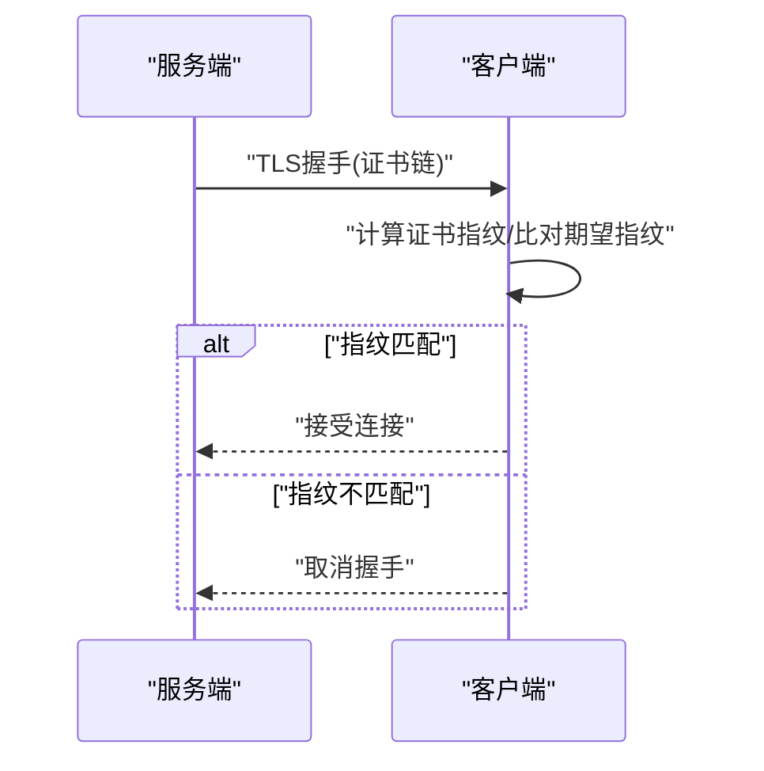
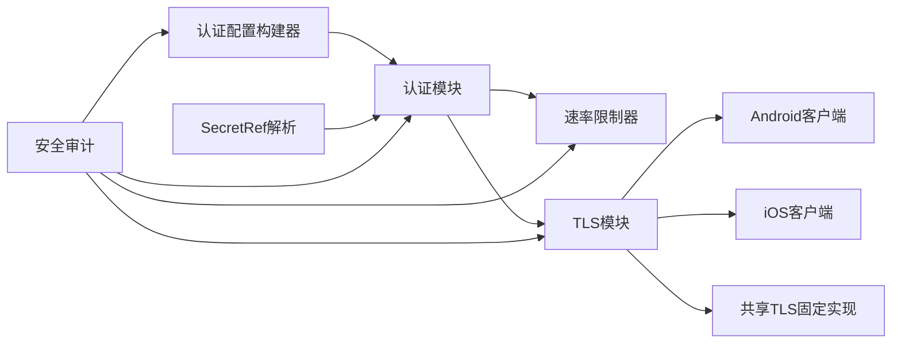

# 安全与认证

<cite>
**本文档引用的文件**
- [authentication.md](file://docs/gateway/authentication.md)
- [configuration-reference.md](file://docs/gateway/configuration-reference.md)
- [configuration-examples.md](file://docs/gateway/configuration-examples.md)
- [trusted-proxy-auth.md](file://docs/gateway/trusted-proxy-auth.md)
- [secrets.md](file://docs/gateway/secrets.md)
- [security/README.md](file://docs/security/README.md)
- [security/THREAT-MODEL-ATLAS.md](file://docs/security/THREAT-MODEL-ATLAS.md)
- [security/formal-verification.md](file://docs/security/formal-verification.md)
- [gateway/security/index.md](file://docs/gateway/security/index.md)
- [cli/security.md](file://docs/cli/security.md)
- [src/commands/configure.gateway-auth.ts](file://src/commands/configure.gateway-auth.ts)
- [src/gateway/server/ws-connection/connect-policy.ts](file://src/gateway/server/ws-connection/connect-policy.ts)
- [src/gateway/auth-rate-limit.ts](file://src/gateway/auth-rate-limit.ts)
- [src/security/audit.ts](file://src/security/audit.ts)
- [src/security/audit.test.ts](file://src/security/audit.test.ts)
- [src/security/audit-extra.async.ts](file://src/security/audit-extra.async.ts)
- [src/shared/operator-scope-compat.ts](file://src/shared/operator-scope-compat.ts)
- [src/gateway/server/ws-connection/unauthorized-flood-guard.test.ts](file://src/gateway/server/ws-connection/unauthorized-flood-guard.test.ts)
- [src/secrets/runtime-gateway-auth-surfaces.ts](file://src/secrets/runtime-gateway-auth-surfaces.ts)
- [src/infra/tls/gateway.ts](file://src/infra/tls/gateway.ts)
- [apps/android/app/src/main/java/ai/openclaw/android/gateway/GatewayTls.kt](file://apps/android/app/src/main/java/ai/openclaw/android/gateway/GatewayTls.kt)
- [apps/ios/Sources/Gateway/GatewayConnectionController.swift](file://apps/ios/Sources/Gateway/GatewayConnectionController.swift)
- [apps/shared/OpenClawKit/Sources/OpenClawKit/GatewayTLSPinning.swift](file://apps/shared/OpenClawKit/Sources/OpenClawKit/GatewayTLSPinning.swift)
- [extensions/synology-chat/src/security.ts](file://extensions/synology-chat/src/security.ts)
- [SECURITY.md](file://SECURITY.md)
</cite>

## 目录
1. [简介](#简介)
2. [项目结构](#项目结构)
3. [核心组件](#核心组件)
4. [架构总览](#架构总览)
5. [详细组件分析](#详细组件分析)
6. [依赖关系分析](#依赖关系分析)
7. [性能考量](#性能考量)
8. [故障排查指南](#故障排查指南)
9. [结论](#结论)
10. [附录](#附录)

## 简介
本文件面向OpenClaw网关的安全与认证体系，系统化阐述认证机制设计、多种认证模式及切换策略、访问控制与权限校验、角色管理、速率限制与防滥用、安全策略配置、威胁检测与入侵防护，并覆盖密钥管理、证书验证与TLS配置等关键主题。文档同时提供配置示例、安全最佳实践与合规指引，帮助读者在不同部署形态（本地回环、内网LAN、反向代理、Tailscale、远程模式）下构建稳健的边界。

## 项目结构
围绕“安全与认证”的知识域，OpenClaw在文档与源码层面形成如下分层：
- 文档层：认证与凭据、网关安全、信任模型、威胁模型、形式化验证、CLI安全审计等
- 配置层：网关认证模式、可信代理、令牌/密码、速率限制、TLS与指纹固定
- 运行时层：认证解析与激活面过滤、鉴权策略、速率限制器、TLS握手与指纹校验
- 平台适配层：Android/iOS客户端TLS实现与存储、扩展插件中的速率限制实践

```mermaid
graph TB
subgraph "文档"
A1["认证与凭据<br/>authentication.md"]
A2["配置参考<br/>configuration-reference.md"]
A3["配置示例<br/>configuration-examples.md"]
A4["可信代理认证<br/>trusted-proxy-auth.md"]
A5["密钥与凭据管理<br/>secrets.md"]
A6["安全与信任<br/>security/README.md"]
A7["威胁模型<br/>security/THREAT-MODEL-ATLAS.md"]
A8["形式化验证<br/>security/formal-verification.md"]
A9["网关安全概览<br/>gateway/security/index.md"]
A10["CLI安全审计<br/>cli/security.md"]
end
subgraph "配置与策略"
B1["构建网关认证配置<br/>src/commands/configure.gateway-auth.ts"]
B2["可信代理接入判定<br/>src/gateway/server/ws-connection/connect-policy.ts"]
B3["认证速率限制<br/>src/gateway/auth-rate-limit.ts"]
B4["TLS证书加载与指纹<br/>src/infra/tls/gateway.ts"]
end
subgraph "运行时与平台"
C1["安全审计主流程<br/>src/security/audit.ts"]
C2["审计用例与断言<br/>src/security/audit.test.ts"]
C3["审计文件权限检查<br/>src/security/audit-extra.async.ts"]
C4["角色与作用域兼容<br/>src/shared/operator-scope-compat.ts"]
C5["Android TLS实现<br/>apps/android/app/src/main/java/.../GatewayTls.kt"]
C6["iOS TLS实现<br/>apps/ios/.../GatewayConnectionController.swift"]
C7["共享TLS固定实现<br/>apps/shared/OpenClawKit/.../GatewayTLSPinning.swift"]
C8["扩展插件速率限制<br/>extensions/synology-chat/src/security.ts"]
end
A1 --> B1
A2 --> B1
A3 --> B1
A4 --> B2
A5 --> B1
A6 --> C1
A7 --> C1
A8 --> C1
A9 --> C1
A10 --> C1
B1 --> C1
B2 --> C1
B3 --> C1
B4 --> C5
B4 --> C6
B4 --> C7
```

图表来源
- [authentication.md](file://docs/gateway/authentication.md#L1-L180)
- [configuration-reference.md](file://docs/gateway/configuration-reference.md#L1-L800)
- [configuration-examples.md](file://docs/gateway/configuration-examples.md#L1-L638)
- [trusted-proxy-auth.md](file://docs/gateway/trusted-proxy-auth.md#L192-L264)
- [secrets.md](file://docs/gateway/secrets.md#L1-L446)
- [security/README.md](file://docs/security/README.md#L1-L18)
- [security/THREAT-MODEL-ATLAS.md](file://docs/security/THREAT-MODEL-ATLAS.md#L168-L435)
- [security/formal-verification.md](file://docs/security/formal-verification.md#L1-L35)
- [gateway/security/index.md](file://docs/gateway/security/index.md#L1-L45)
- [cli/security.md](file://docs/cli/security.md#L43-L72)
- [src/commands/configure.gateway-auth.ts](file://src/commands/configure.gateway-auth.ts#L40-L76)
- [src/gateway/server/ws-connection/connect-policy.ts](file://src/gateway/server/ws-connection/connect-policy.ts#L46-L66)
- [src/gateway/auth-rate-limit.ts](file://src/gateway/auth-rate-limit.ts#L169-L232)
- [src/infra/tls/gateway.ts](file://src/infra/tls/gateway.ts#L81-L150)
- [apps/android/app/src/main/java/ai/openclaw/android/gateway/GatewayTls.kt](file://apps/android/app/src/main/java/ai/openclaw/android/gateway/GatewayTls.kt#L35-L66)
- [apps/ios/Sources/Gateway/GatewayConnectionController.swift](file://apps/ios/Sources/Gateway/GatewayConnectionController.swift#L496-L523)
- [apps/shared/OpenClawKit/Sources/OpenClawKit/GatewayTLSPinning.swift](file://apps/shared/OpenClawKit/Sources/OpenClawKit/GatewayTLSPinning.swift#L89-L137)
- [extensions/synology-chat/src/security.ts](file://extensions/synology-chat/src/security.ts#L86-L124)

章节来源
- [configuration-reference.md](file://docs/gateway/configuration-reference.md#L1-L800)
- [configuration-examples.md](file://docs/gateway/configuration-examples.md#L1-L638)
- [trusted-proxy-auth.md](file://docs/gateway/trusted-proxy-auth.md#L192-L264)
- [secrets.md](file://docs/gateway/secrets.md#L1-L446)
- [security/README.md](file://docs/security/README.md#L1-L18)
- [security/THREAT-MODEL-ATLAS.md](file://docs/security/THREAT-MODEL-ATLAS.md#L168-L435)
- [security/formal-verification.md](file://docs/security/formal-verification.md#L1-L35)
- [gateway/security/index.md](file://docs/gateway/security/index.md#L1-L45)
- [cli/security.md](file://docs/cli/security.md#L43-L72)

## 核心组件
- 认证模式与配置
  - 支持令牌(token)、密码(password)、可信代理(trusted-proxy)、无认证(no)等模式，可通过配置与环境变量组合生效
  - 构建认证配置时对空值进行归一化处理，确保生成有效令牌或保留密码
- 可信代理接入
  - 通过trustedProxies限定代理IP，使用用户头(userHeader)传递身份，支持allowUsers白名单
  - 控制UI侧的设备身份校验开关与Origin策略
- 速率限制与防滥用
  - 网关级滑动窗口速率限制，支持按IP与作用域统计失败次数，超限锁定
  - 扩展插件示例采用固定窗口限流器，按用户ID滑动计数
- 密钥与凭据管理
  - SecretRef契约：env/file/exec三类来源，支持默认提供者与批量解析
  - 启动即决断：活跃面才强制解析，不活跃面仅诊断提示
- TLS与证书固定
  - 自签名证书自动生成与加载，计算SHA-256指纹，客户端支持指纹比对与TOFU存储
  - 多端实现：Android/iOS共享库均支持指纹固定与信任链校验

章节来源
- [src/commands/configure.gateway-auth.ts](file://src/commands/configure.gateway-auth.ts#L40-L76)
- [src/gateway/server/ws-connection/connect-policy.ts](file://src/gateway/server/ws-connection/connect-policy.ts#L46-L66)
- [src/gateway/auth-rate-limit.ts](file://src/gateway/auth-rate-limit.ts#L169-L232)
- [src/secrets/runtime-gateway-auth-surfaces.ts](file://src/secrets/runtime-gateway-auth-surfaces.ts#L119-L140)
- [src/infra/tls/gateway.ts](file://src/infra/tls/gateway.ts#L81-L150)
- [apps/android/app/src/main/java/ai/openclaw/android/gateway/GatewayTls.kt](file://apps/android/app/src/main/java/ai/openclaw/android/gateway/GatewayTls.kt#L35-L66)
- [apps/ios/Sources/Gateway/GatewayConnectionController.swift](file://apps/ios/Sources/Gateway/GatewayConnectionController.swift#L496-L523)
- [apps/shared/OpenClawKit/Sources/OpenClawKit/GatewayTLSPinning.swift](file://apps/shared/OpenClawKit/Sources/OpenClawKit/GatewayTLSPinning.swift#L89-L137)
- [extensions/synology-chat/src/security.ts](file://extensions/synology-chat/src/security.ts#L86-L124)

## 架构总览
下图展示从“请求接入—认证—鉴权—速率限制—TLS校验—审计与修复”的整体流程：

图表来源
- [src/infra/tls/gateway.ts](file://src/infra/tls/gateway.ts#L81-L150)
- [src/gateway/auth-rate-limit.ts](file://src/gateway/auth-rate-limit.ts#L169-L232)
- [src/commands/configure.gateway-auth.ts](file://src/commands/configure.gateway-auth.ts#L40-L76)
- [src/security/audit.ts](file://src/security/audit.ts#L339-L687)

## 详细组件分析

### 组件A：认证模式与切换策略
- 模式选择
  - token/password/no/trusted-proxy四种模式，结合环境变量与配置决定最终生效面
  - 当未显式配置且存在SecretRef时，优先走SecretRef；否则生成随机令牌或保留密码
- 切换策略
  - 通过配置项与环境变量共同决定当前生效的认证面，避免“多重认证面”导致的歧义
  - 对于可信代理模式，必须严格限定trustedProxies与userHeader，防止头部伪造
- 典型场景
  - 本地回环+控制UI：推荐token或密码，配合严格的allowedOrigins
  - 反向代理+HTTPS：trusted-proxy模式，由代理负责认证与身份注入
  - 远程/隧道：Tailscale Serve/Funnel，结合令牌或可信代理

图表来源
- [src/commands/configure.gateway-auth.ts](file://src/commands/configure.gateway-auth.ts#L40-L76)
- [src/secrets/runtime-gateway-auth-surfaces.ts](file://src/secrets/runtime-gateway-auth-surfaces.ts#L119-L140)

章节来源
- [src/commands/configure.gateway-auth.ts](file://src/commands/configure.gateway-auth.ts#L40-L76)
- [src/secrets/runtime-gateway-auth-surfaces.ts](file://src/secrets/runtime-gateway-auth-surfaces.ts#L119-L140)
- [trusted-proxy-auth.md](file://docs/gateway/trusted-proxy-auth.md#L192-L264)

### 组件B：访问控制、权限验证与角色管理
- 角色与作用域
  - operator角色对operator.*作用域具备继承满足能力；非operator需严格匹配
  - 作用域兼容性在运行时进行归一化与集合化判断
- 授权判定
  - 未授权角色错误会被识别并区分于其他授权错误
  - 控制UI侧可禁用设备身份校验（危险开关），仅在短时场景启用
- 通道与会话
  - 通道侧的DM/群组策略（allowlist/open/disabled）与提及门控（mention gating）构成第一道边界
  - 会话维度支持按发送者/通道隔离，敏感场景建议开启“每通道-peer”作用域

图表来源
- [src/shared/operator-scope-compat.ts](file://src/shared/operator-scope-compat.ts#L1-L49)
- [src/gateway/server/ws-connection/unauthorized-flood-guard.test.ts](file://src/gateway/server/ws-connection/unauthorized-flood-guard.test.ts#L50-L67)

章节来源
- [src/shared/operator-scope-compat.ts](file://src/shared/operator-scope-compat.ts#L1-L49)
- [src/gateway/server/ws-connection/unauthorized-flood-guard.test.ts](file://src/gateway/server/ws-connection/unauthorized-flood-guard.test.ts#L50-L67)
- [configuration-reference.md](file://docs/gateway/configuration-reference.md#L22-L43)

### 组件C：速率限制与防滥用
- 网关级滑动窗口
  - 按IP与作用域统计失败次数，超过阈值进入锁定窗口；定时清理过期条目
  - 支持重置与诊断接口，便于运维排障
- 插件级固定窗口
  - 按用户ID滑动计数，限制单位时间内的调用频次，适合外部通道的入站保护

图表来源
- [src/gateway/auth-rate-limit.ts](file://src/gateway/auth-rate-limit.ts#L169-L232)
- [extensions/synology-chat/src/security.ts](file://extensions/synology-chat/src/security.ts#L86-L124)

章节来源
- [src/gateway/auth-rate-limit.ts](file://src/gateway/auth-rate-limit.ts#L169-L232)
- [extensions/synology-chat/src/security.ts](file://extensions/synology-chat/src/security.ts#L86-L124)

### 组件D：密钥管理与凭据安全
- SecretRef契约
  - env/file/exec三种来源，统一字段语义与校验规则
  - 默认提供者与批量解析并发度、字节数限制可控
- 活跃面过滤
  - 仅对“有效表面”强制解析；不活跃表面仅发出非致命诊断
  - 环境变量优先于配置中的明文与SecretRef
- 运行时与审计
  - 启动失败快返；热重载原子替换；命令行支持审计与配置
  - 审计发现包括明文残留、前置权重冲突、遗留静态凭据等

图表来源
- [secrets.md](file://docs/gateway/secrets.md#L16-L34)
- [secrets.md](file://docs/gateway/secrets.md#L41-L62)
- [src/security/audit.ts](file://src/security/audit.ts#L339-L687)

章节来源
- [secrets.md](file://docs/gateway/secrets.md#L1-L446)
- [src/security/audit.ts](file://src/security/audit.ts#L339-L687)

### 组件E：TLS配置与证书验证
- 服务端
  - 自动检测证书/私钥存在性，缺失时可自动生成；加载后计算SHA-256指纹，限制最低TLS版本
- 客户端
  - Android/iOS共享库均支持期望指纹比对；支持首次信任(TOFU)存储；回退至系统信任链
  - 控制UI侧可探测指纹并持久化，后续连接以指纹为准

图表来源
- [src/infra/tls/gateway.ts](file://src/infra/tls/gateway.ts#L81-L150)
- [apps/android/app/src/main/java/ai/openclaw/android/gateway/GatewayTls.kt](file://apps/android/app/src/main/java/ai/openclaw/android/gateway/GatewayTls.kt#L35-L66)
- [apps/ios/Sources/Gateway/GatewayConnectionController.swift](file://apps/ios/Sources/Gateway/GatewayConnectionController.swift#L496-L523)
- [apps/shared/OpenClawKit/Sources/OpenClawKit/GatewayTLSPinning.swift](file://apps/shared/OpenClawKit/Sources/OpenClawKit/GatewayTLSPinning.swift#L89-L137)

章节来源
- [src/infra/tls/gateway.ts](file://src/infra/tls/gateway.ts#L81-L150)
- [apps/android/app/src/main/java/ai/openclaw/android/gateway/GatewayTls.kt](file://apps/android/app/src/main/java/ai/openclaw/android/gateway/GatewayTls.kt#L35-L66)
- [apps/ios/Sources/Gateway/GatewayConnectionController.swift](file://apps/ios/Sources/Gateway/GatewayConnectionController.swift#L496-L523)
- [apps/shared/OpenClawKit/Sources/OpenClawKit/GatewayTLSPinning.swift](file://apps/shared/OpenClawKit/Sources/OpenClawKit/GatewayTLSPinning.swift#L89-L137)

## 依赖关系分析
- 组件耦合
  - 认证配置构建器与SecretRef解析器协同，决定最终生效的认证面
  - 速率限制器与认证模块解耦，既可用于HTTP/WS，也可用于扩展插件
  - TLS模块独立于业务逻辑，客户端实现遵循统一的指纹固定协议
- 外部依赖
  - 反向代理（Caddy/nginx/Traefik）在trusted-proxy模式下的正确配置至关重要
  - 审计工具依赖文件系统权限、网络可达性与插件清单

图表来源
- [src/commands/configure.gateway-auth.ts](file://src/commands/configure.gateway-auth.ts#L40-L76)
- [src/secrets/runtime-gateway-auth-surfaces.ts](file://src/secrets/runtime-gateway-auth-surfaces.ts#L119-L140)
- [src/gateway/auth-rate-limit.ts](file://src/gateway/auth-rate-limit.ts#L169-L232)
- [src/infra/tls/gateway.ts](file://src/infra/tls/gateway.ts#L81-L150)
- [apps/android/app/src/main/java/ai/openclaw/android/gateway/GatewayTls.kt](file://apps/android/app/src/main/java/ai/openclaw/android/gateway/GatewayTls.kt#L35-L66)
- [apps/ios/Sources/Gateway/GatewayConnectionController.swift](file://apps/ios/Sources/Gateway/GatewayConnectionController.swift#L496-L523)
- [apps/shared/OpenClawKit/Sources/OpenClawKit/GatewayTLSPinning.swift](file://apps/shared/OpenClawKit/Sources/OpenClawKit/GatewayTLSPinning.swift#L89-L137)
- [src/security/audit.ts](file://src/security/audit.ts#L339-L687)

章节来源
- [src/commands/configure.gateway-auth.ts](file://src/commands/configure.gateway-auth.ts#L40-L76)
- [src/gateway/auth-rate-limit.ts](file://src/gateway/auth-rate-limit.ts#L169-L232)
- [src/infra/tls/gateway.ts](file://src/infra/tls/gateway.ts#L81-L150)
- [src/security/audit.ts](file://src/security/audit.ts#L339-L687)

## 性能考量
- 速率限制
  - 滑动窗口与固定窗口均采用内存计数，注意峰值并发下的内存占用与清理频率
  - 合理设置窗口大小与最大跟踪键数，避免内存膨胀
- TLS
  - 证书指纹计算与系统信任链评估开销较小，建议在客户端缓存指纹以减少重复计算
- 审计
  - 文件系统权限扫描与网络探测为IO密集，建议在CI/离线场景运行深度审计

## 故障排查指南
- 常见问题定位
  - 网关绑定非回环但无认证：检查gateway.bind与gateway.auth配置，必要时启用速率限制
  - 反向代理模式下设备身份校验异常：确认trustedProxies与userHeader配置，避免通配Origin
  - 控制UI跨域/设备校验问题：设置allowedOrigins或禁用危险开关
  - 审计报告中的文件权限问题：收紧~/.openclaw与配置文件权限
- 修复建议
  - 使用openclaw security audit --fix进行可自动修复的加固
  - 对于不可自动修复的问题，参考findings对应的primary fix路径逐项修正

章节来源
- [src/security/audit.ts](file://src/security/audit.ts#L339-L687)
- [gateway/security/index.md](file://docs/gateway/security/index.md#L223-L260)
- [cli/security.md](file://docs/cli/security.md#L43-L72)

## 结论
OpenClaw在“认证—鉴权—速率限制—TLS—审计”的全链路提供了可配置、可审计、可修复的安全基线。通过SecretRef与活跃面过滤实现凭据安全，通过可信代理与速率限制抵御暴力破解，通过TLS指纹固定与审计工具强化边界完整性。建议在生产环境中优先采用令牌认证、严格的Origin策略、可信代理与速率限制，并定期运行安全审计以持续改进。

## 附录

### 认证配置示例要点
- 令牌认证（推荐）
  - 在gateway.auth.mode设为token，配置gateway.auth.token或SecretRef
  - 若gateway.bind非loopback，务必配置速率限制
- 密码认证
  - 在gateway.auth.mode设为password，配置gateway.auth.password
- 可信代理认证
  - 设置gateway.auth.mode为trusted-proxy，配置gateway.auth.trustedProxy.userHeader与gateway.trustedProxies
  - 仅在代理负责认证且严格限制代理IP时启用
- 示例参考
  - [配置示例](file://docs/gateway/configuration-examples.md#L411-L425)
  - [可信代理示例](file://docs/gateway/trusted-proxy-auth.md#L192-L264)

章节来源
- [configuration-examples.md](file://docs/gateway/configuration-examples.md#L411-L425)
- [trusted-proxy-auth.md](file://docs/gateway/trusted-proxy-auth.md#L192-L264)

### 安全最佳实践
- 最小暴露原则：优先使用loopback或Tailscale Serve，避免直接暴露公网
- 强认证：令牌长度≥24字符；密码复杂度；启用速率限制
- 严格Origin：非loopback部署必须设置gateway.controlUi.allowedOrigins
- 机密安全：使用SecretRef；避免明文存储；定期轮换
- 审计与修复：定期运行openclaw security audit；使用--fix自动加固

章节来源
- [gateway/security/index.md](file://docs/gateway/security/index.md#L17-L45)
- [cli/security.md](file://docs/cli/security.md#L43-L72)
- [secrets.md](file://docs/gateway/secrets.md#L1-L446)

### 合规性与威胁模型
- 威胁模型
  - 包含初始访问、凭证泄露、资源耗尽、声誉损害等威胁类别与缓解建议
- 形式化验证
  - 以TLA+/TLC为载体的安全回归测试，提供可复现的模型检查
- 报告与范围
  - 明确漏洞报告流程与“不在范围”的情形，避免误报与过度解读

章节来源
- [security/THREAT-MODEL-ATLAS.md](file://docs/security/THREAT-MODEL-ATLAS.md#L168-L435)
- [security/formal-verification.md](file://docs/security/formal-verification.md#L1-L35)
- [SECURITY.md](file://SECURITY.md#L48-L128)