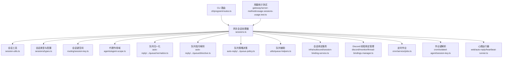
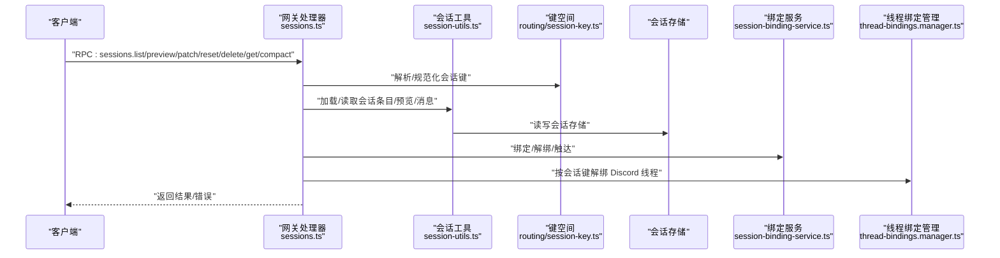
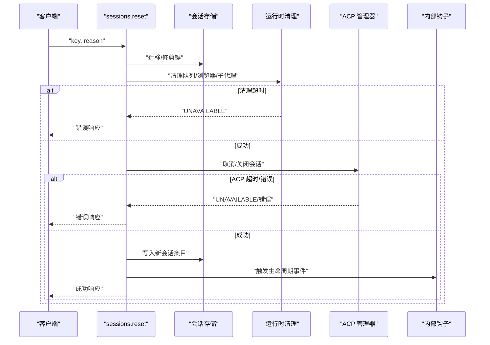
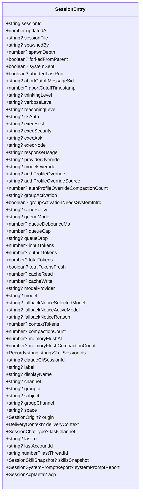
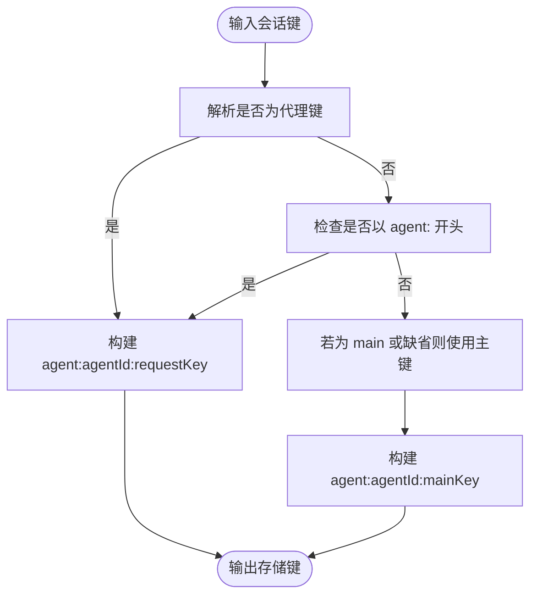
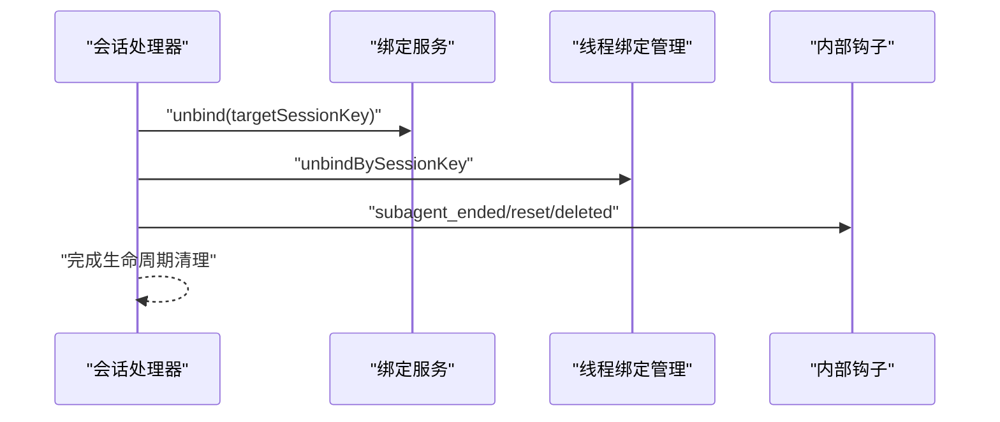
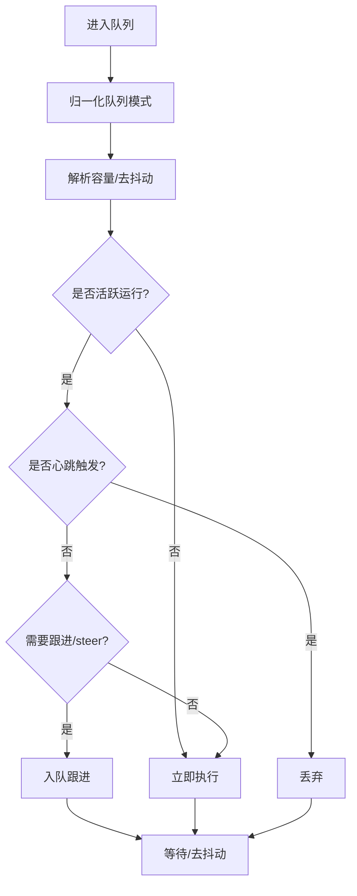
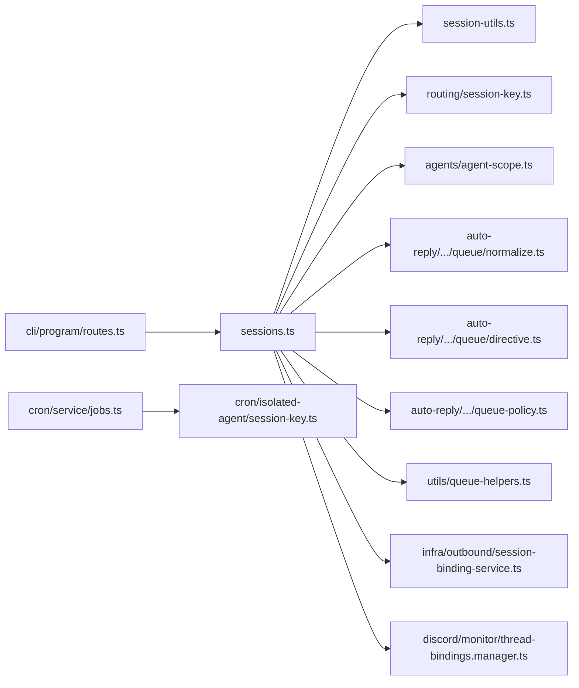

# 会话管理

<cite>
**本文引用的文件**
- [src/gateway/server-methods/sessions.ts](file://src/gateway/server-methods/sessions.ts)
- [src/gateway/session-utils.ts](file://src/gateway/session-utils.ts)
- [src/config/sessions/types.ts](file://src/config/sessions/types.ts)
- [src/config/sessions/disk-budget.ts](file://src/config/sessions/disk-budget.ts)
- [src/routing/session-key.ts](file://src/routing/session-key.ts)
- [src/agents/agent-scope.ts](file://src/agents/agent-scope.ts)
- [src/auto-reply/reply/queue/normalize.ts](file://src/auto-reply/reply/queue/normalize.ts)
- [src/auto-reply/reply/queue/directive.ts](file://src/auto-reply/reply/queue/directive.ts)
- [src/auto-reply/reply/queue-policy.ts](file://src/auto-reply/reply/queue-policy.ts)
- [src/utils/queue-helpers.ts](file://src/utils/queue-helpers.ts)
- [src/infra/outbound/session-binding-service.ts](file://src/infra/outbound/session-binding-service.ts)
- [src/discord/monitor/thread-bindings.manager.ts](file://src/discord/monitor/thread-bindings.manager.ts)
- [src/cron/service/jobs.ts](file://src/cron/service/jobs.ts)
- [src/cron/isolated-agent/session-key.ts](file://src/cron/isolated-agent/session-key.ts)
- [src/web/auto-reply/heartbeat-runner.ts](file://src/web/auto-reply/heartbeat-runner.ts)
- [src/cli/program/routes.ts](file://src/cli/program/routes.ts)
- [src/gateway/server-methods/usage.sessions-usage.test.ts](file://src/gateway/server-methods/usage.sessions-usage.test.ts)
</cite>

## 目录
1. [简介](#简介)
2. [项目结构](#项目结构)
3. [核心组件](#核心组件)
4. [架构总览](#架构总览)
5. [详细组件分析](#详细组件分析)
6. [依赖关系分析](#依赖关系分析)
7. [性能考量](#性能考量)
8. [故障排查指南](#故障排查指南)
9. [结论](#结论)
10. [附录](#附录)

## 简介
本文件为 OpenClaw 会话管理系统提供系统化、可操作的 API 文档与技术解析，覆盖会话创建、状态管理、代理绑定、作业调度与作业处理、任务队列与并发控制、状态同步与生命周期管理等关键能力。文档以代码为依据，配合图示帮助读者快速理解并正确使用会话管理 API。

## 项目结构
围绕“会话”主题的关键模块分布如下：
- 网关层：会话 RPC 处理器（列出、预览、解析、补丁更新、重置、删除、获取消息、压缩）、会话工具函数（加载、预览项读取、模型解析）。
- 配置与类型：会话条目结构、ACPI 身份与运行时元数据、磁盘配额与存储度量。
- 路由与键空间：会话键规范化、主键与代理键构建、线程会话键派生。
- 代理与工作区：默认代理解析、代理配置解析、工作区与目录定位。
- 队列与并发：队列模式与丢弃策略归一化、指令解析、活动运行队列动作决策、去抖动等待。
- 绑定与生命周期：会话绑定服务（适配器能力、绑定/解绑、触达）、Discord 线程绑定管理器（按会话键/线程 ID 查询与解绑）。
- 作业调度：定时任务创建与锚点、隔离代理作业键解析。
- CLI 路由：sessions 子命令路由入口。
- 使用统计：会话用量、时间序列、日志查询处理器测试样例。

**图表来源**
- [src/gateway/server-methods/sessions.ts](file://src/gateway/server-methods/sessions.ts#L330-L754)
- [src/gateway/session-utils.ts](file://src/gateway/session-utils.ts#L171-L188)
- [src/config/sessions/types.ts](file://src/config/sessions/types.ts#L68-L167)
- [src/routing/session-key.ts](file://src/routing/session-key.ts#L53-L174)
- [src/agents/agent-scope.ts](file://src/agents/agent-scope.ts#L71-L110)
- [src/auto-reply/reply/queue/normalize.ts](file://src/auto-reply/reply/queue/normalize.ts#L3-L27)
- [src/auto-reply/reply/queue/directive.ts](file://src/auto-reply/reply/queue/directive.ts#L6-L34)
- [src/auto-reply/reply/queue-policy.ts](file://src/auto-reply/reply/queue-policy.ts#L5-L21)
- [src/utils/queue-helpers.ts](file://src/utils/queue-helpers.ts#L84-L133)
- [src/infra/outbound/session-binding-service.ts](file://src/infra/outbound/session-binding-service.ts#L70-L77)
- [src/discord/monitor/thread-bindings.manager.ts](file://src/discord/monitor/thread-bindings.manager.ts#L176-L666)
- [src/cron/service/jobs.ts](file://src/cron/service/jobs.ts#L502-L537)
- [src/cron/isolated-agent/session-key.ts](file://src/cron/isolated-agent/session-key.ts#L3-L13)
- [src/web/auto-reply/heartbeat-runner.ts](file://src/web/auto-reply/heartbeat-runner.ts#L78-L116)
- [src/cli/program/routes.ts](file://src/cli/program/routes.ts#L56-L79)
- [src/gateway/server-methods/usage.sessions-usage.test.ts](file://src/gateway/server-methods/usage.sessions-usage.test.ts#L76-L116)

**章节来源**
- [src/gateway/server-methods/sessions.ts](file://src/gateway/server-methods/sessions.ts#L330-L754)
- [src/cli/program/routes.ts](file://src/cli/program/routes.ts#L56-L79)

## 核心组件
- 会话 RPC 处理器：提供 sessions.list、sessions.preview、sessions.resolve、sessions.patch、sessions.reset、sessions.delete、sessions.get、sessions.compact 等方法，统一参数校验、存储迁移与清理、生命周期事件触发与归档。
- 会话工具：从配置解析会话目标、加载会话条目、读取预览项、解析模型引用、读取消息列表。
- 会话类型与配置：定义 SessionEntry 结构、ACP 元数据、运行时模型字段、合并策略、技能快照与系统提示报告等。
- 键空间与路由：标准化代理 ID、主键、构建 agent: 主键、线程会话键派生、解析会话键形状。
- 代理作用域：解析默认代理、会话所属代理、代理配置与工作区路径。
- 队列与并发：队列模式/丢弃策略归一化、指令解析、活动运行队列动作、去抖动等待。
- 绑定与生命周期：会话绑定服务（适配器能力、绑定/解绑、触达）、Discord 线程绑定管理器（按会话键/线程 ID 查询与解绑）。
- 作业调度：定时作业创建、锚点与错峰、隔离代理作业键解析。
- CLI 路由：sessions 子命令路由入口。
- 使用统计：会话用量、时间序列、日志查询处理器测试样例。

**章节来源**
- [src/gateway/server-methods/sessions.ts](file://src/gateway/server-methods/sessions.ts#L330-L754)
- [src/gateway/session-utils.ts](file://src/gateway/session-utils.ts#L171-L188)
- [src/config/sessions/types.ts](file://src/config/sessions/types.ts#L68-L167)
- [src/routing/session-key.ts](file://src/routing/session-key.ts#L53-L174)
- [src/agents/agent-scope.ts](file://src/agents/agent-scope.ts#L71-L110)
- [src/auto-reply/reply/queue/normalize.ts](file://src/auto-reply/reply/queue/normalize.ts#L3-L27)
- [src/auto-reply/reply/queue/directive.ts](file://src/auto-reply/reply/queue/directive.ts#L6-L34)
- [src/auto-reply/reply/queue-policy.ts](file://src/auto-reply/reply/queue-policy.ts#L5-L21)
- [src/utils/queue-helpers.ts](file://src/utils/queue-helpers.ts#L84-L133)
- [src/infra/outbound/session-binding-service.ts](file://src/infra/outbound/session-binding-service.ts#L70-L77)
- [src/discord/monitor/thread-bindings.manager.ts](file://src/discord/monitor/thread-bindings.manager.ts#L176-L666)
- [src/cron/service/jobs.ts](file://src/cron/service/jobs.ts#L502-L537)
- [src/cron/isolated-agent/session-key.ts](file://src/cron/isolated-agent/session-key.ts#L3-L13)
- [src/web/auto-reply/heartbeat-runner.ts](file://src/web/auto-reply/heartbeat-runner.ts#L78-L116)
- [src/cli/program/routes.ts](file://src/cli/program/routes.ts#L56-L79)
- [src/gateway/server-methods/usage.sessions-usage.test.ts](file://src/gateway/server-methods/usage.sessions-usage.test.ts#L76-L116)

## 架构总览
下图展示会话管理在网关层的请求处理流程与关键协作模块：

**图表来源**
- [src/gateway/server-methods/sessions.ts](file://src/gateway/server-methods/sessions.ts#L330-L754)
- [src/gateway/session-utils.ts](file://src/gateway/session-utils.ts#L171-L188)
- [src/routing/session-key.ts](file://src/routing/session-key.ts#L53-L174)
- [src/infra/outbound/session-binding-service.ts](file://src/infra/outbound/session-binding-service.ts#L70-L77)
- [src/discord/monitor/thread-bindings.manager.ts](file://src/discord/monitor/thread-bindings.manager.ts#L176-L666)

## 详细组件分析

### 会话 RPC 处理器（sessions.*）
- 方法清单与职责
  - sessions.list：列出会话，支持过滤与分页。
  - sessions.preview：批量预览会话最近消息摘要。
  - sessions.resolve：解析会话键，确保唯一性与规范化。
  - sessions.patch：对会话条目进行补丁式更新，含模型解析与存储迁移。
  - sessions.reset：重置会话（保留部分上下文字段），归档旧转录，触发生命周期事件。
  - sessions.delete：删除会话，可选删除转录，归档并触发生命周期事件。
  - sessions.get：按会话键读取最近消息列表。
  - sessions.compact：压缩会话转录行数，保留最新若干行并清理计费统计字段。
- 关键流程
  - 参数校验与错误响应。
  - 解析会话目标（主键/别名/代理键），迁移与修剪历史键。
  - 运行时清理（浏览器标签关闭、队列清空、子代理停止、ACP 运行时关闭）。
  - 生命周期事件（解绑线程绑定、钩子回调）。
  - 存储更新与归档。

**图表来源**
- [src/gateway/server-methods/sessions.ts](file://src/gateway/server-methods/sessions.ts#L465-L557)
- [src/gateway/server-methods/sessions.ts](file://src/gateway/server-methods/sessions.ts#L304-L328)

**章节来源**
- [src/gateway/server-methods/sessions.ts](file://src/gateway/server-methods/sessions.ts#L330-L754)

### 会话数据结构与配置
- SessionEntry 字段族
  - 基础标识：sessionId、updatedAt、sessionFile、spawnedBy、spawnDepth、forkedFromParent。
  - 行为控制：systemSent、abortedLastRun、abortCutoffMessageSid、abortCutoffTimestamp、queueMode、queueDebounceMs、queueCap、queueDrop。
  - 模型与计费：modelProvider、model、inputTokens、outputTokens、totalTokens、totalTokensFresh、responseUsage。
  - 上下文与记忆：contextTokens、compactionCount、memoryFlushAt、memoryFlushCompactionCount。
  - 通道与最后交互：channel、groupId、subject、groupChannel、space、origin、deliveryContext、lastChannel、lastTo、lastAccountId、lastThreadId。
  - 技能与系统提示报告：skillsSnapshot、systemPromptReport。
  - ACP 元数据：acp（后端、代理、运行时会话名、身份、模式、运行时选项、状态、活动时间、错误）。
- 合并与运行时模型设置
  - 合并策略：保留活动或触摸活动。
  - 运行时模型设置：规范化与安全删除 provider/model 不一致字段。
- 磁盘配额与存储度量
  - 计算存储大小、条目块大小、updatedAt 排序、会话 ID 引用计数，用于清理与压缩。

**图表来源**
- [src/config/sessions/types.ts](file://src/config/sessions/types.ts#L68-L167)

**章节来源**
- [src/config/sessions/types.ts](file://src/config/sessions/types.ts#L68-L167)
- [src/config/sessions/disk-budget.ts](file://src/config/sessions/disk-budget.ts#L50-L89)

### 会话键空间与路由
- 规范化与构建
  - 代理 ID 规范化与校验。
  - 主键构建（agent:agentId:mainKey）。
  - 请求键到存储键映射（toAgentStoreSessionKey）。
  - 线程会话键派生（支持前缀或后缀两种形式）。
- 形状分类
  - 缺失、代理键、遗留/别名、畸形代理键。

**图表来源**
- [src/routing/session-key.ts](file://src/routing/session-key.ts#L53-L125)

**章节来源**
- [src/routing/session-key.ts](file://src/routing/session-key.ts#L53-L174)

### 代理绑定机制与生命周期
- 会话绑定服务
  - bind/getCapabilities/listBySession/resolveByConversation/touch/unbind。
  - 适配器能力声明（placement、bind/unbind 支持）。
- Discord 线程绑定管理
  - 按线程 ID/会话键查询绑定记录，触达与解绑，支持按会话键批量解绑。
- 生命周期事件
  - 重置/删除会话时触发线程解绑与内部钩子回调。

**图表来源**
- [src/gateway/server-methods/sessions.ts](file://src/gateway/server-methods/sessions.ts#L150-L183)
- [src/infra/outbound/session-binding-service.ts](file://src/infra/outbound/session-binding-service.ts#L70-L77)
- [src/discord/monitor/thread-bindings.manager.ts](file://src/discord/monitor/thread-bindings.manager.ts#L626-L646)

**章节来源**
- [src/infra/outbound/session-binding-service.ts](file://src/infra/outbound/session-binding-service.ts#L70-L77)
- [src/discord/monitor/thread-bindings.manager.ts](file://src/discord/monitor/thread-bindings.manager.ts#L176-L666)
- [src/gateway/server-methods/sessions.ts](file://src/gateway/server-methods/sessions.ts#L150-L183)

### 任务队列与并发控制
- 队列模式与丢弃策略归一化
  - steer/followup/collect/steer-backlog/queue/interrupt。
  - old/new/summarize。
- 指令解析
  - 解析去抖动时长与容量阈值。
- 活动运行队列动作
  - isActive、isHeartbeat、shouldFollowup、queueMode 决策。
- 去抖动等待
  - 基于 lastEnqueuedAt 的等待逻辑，支持测试环境快速路径。

**图表来源**
- [src/auto-reply/reply/queue/normalize.ts](file://src/auto-reply/reply/queue/normalize.ts#L3-L27)
- [src/auto-reply/reply/queue/directive.ts](file://src/auto-reply/reply/queue/directive.ts#L6-L34)
- [src/auto-reply/reply/queue-policy.ts](file://src/auto-reply/reply/queue-policy.ts#L5-L21)
- [src/utils/queue-helpers.ts](file://src/utils/queue-helpers.ts#L111-L133)

**章节来源**
- [src/auto-reply/reply/queue/normalize.ts](file://src/auto-reply/reply/queue/normalize.ts#L3-L27)
- [src/auto-reply/reply/queue/directive.ts](file://src/auto-reply/reply/queue/directive.ts#L6-L34)
- [src/auto-reply/reply/queue-policy.ts](file://src/auto-reply/reply/queue-policy.ts#L5-L21)
- [src/utils/queue-helpers.ts](file://src/utils/queue-helpers.ts#L84-L133)

### 代理配置与作用域
- 默认代理解析：优先首个 default=true，否则第一个条目；多默认警告。
- 会话代理解析：显式 agentId > 会话键中 agentId > 默认代理。
- 代理配置：名称、工作区、模型、技能、心跳、身份、群聊、子代理、沙箱、工具等。
- 工作区与目录：优先配置，其次默认，再回退到状态目录下的 workspace-<id>。

**章节来源**
- [src/agents/agent-scope.ts](file://src/agents/agent-scope.ts#L71-L110)
- [src/agents/agent-scope.ts](file://src/agents/agent-scope.ts#L117-L144)
- [src/agents/agent-scope.ts](file://src/agents/agent-scope.ts#L255-L282)

### 作业调度与作业处理
- 定时作业创建
  - schedule.kind 支持 every/cron/at；自动锚点与错峰计算；deleteAfterRun 默认策略；enabled 默认 true。
- 隔离代理作业键解析
  - 将 cron 作业的 sessionKey 映射到 agent:agentId:requestKey，并可带 mainKey。

**章节来源**
- [src/cron/service/jobs.ts](file://src/cron/service/jobs.ts#L502-L537)
- [src/cron/isolated-agent/session-key.ts](file://src/cron/isolated-agent/session-key.ts#L3-L13)

### 会话状态同步与心跳
- 心跳运行器
  - 基于会话作用域与主键解析会话键，更新 sessionId 与 updatedAt。
  - 输出会话快照（键、会话 ID、fresh、重置策略、空闲到期等）。

**章节来源**
- [src/web/auto-reply/heartbeat-runner.ts](file://src/web/auto-reply/heartbeat-runner.ts#L78-L116)

### CLI 会话子命令路由
- sessions 子命令路由入口，支持 --json、--all-agents、--agent、--store、--active 等参数。

**章节来源**
- [src/cli/program/routes.ts](file://src/cli/program/routes.ts#L56-L79)

### 使用统计与查询
- 会话用量、时间序列、日志查询处理器测试样例，验证参数传递与响应格式。

**章节来源**
- [src/gateway/server-methods/usage.sessions-usage.test.ts](file://src/gateway/server-methods/usage.sessions-usage.test.ts#L76-L116)

## 依赖关系分析
- 网关处理器依赖会话工具、键空间、代理作用域、队列与绑定模块。
- 会话工具依赖配置与存储路径解析。
- 绑定服务与线程绑定管理器相互独立但共同参与生命周期解绑。
- 作业调度与会话键空间耦合，确保作业在正确的会话上下文中运行。

**图表来源**
- [src/gateway/server-methods/sessions.ts](file://src/gateway/server-methods/sessions.ts#L330-L754)
- [src/gateway/session-utils.ts](file://src/gateway/session-utils.ts#L171-L188)
- [src/routing/session-key.ts](file://src/routing/session-key.ts#L53-L174)
- [src/agents/agent-scope.ts](file://src/agents/agent-scope.ts#L71-L110)
- [src/auto-reply/reply/queue/normalize.ts](file://src/auto-reply/reply/queue/normalize.ts#L3-L27)
- [src/auto-reply/reply/queue/directive.ts](file://src/auto-reply/reply/queue/directive.ts#L6-L34)
- [src/auto-reply/reply/queue-policy.ts](file://src/auto-reply/reply/queue-policy.ts#L5-L21)
- [src/utils/queue-helpers.ts](file://src/utils/queue-helpers.ts#L84-L133)
- [src/infra/outbound/session-binding-service.ts](file://src/infra/outbound/session-binding-service.ts#L70-L77)
- [src/discord/monitor/thread-bindings.manager.ts](file://src/discord/monitor/thread-bindings.manager.ts#L176-L666)
- [src/cron/service/jobs.ts](file://src/cron/service/jobs.ts#L502-L537)
- [src/cron/isolated-agent/session-key.ts](file://src/cron/isolated-agent/session-key.ts#L3-L13)
- [src/cli/program/routes.ts](file://src/cli/program/routes.ts#L56-L79)

**章节来源**
- [src/gateway/server-methods/sessions.ts](file://src/gateway/server-methods/sessions.ts#L330-L754)
- [src/cli/program/routes.ts](file://src/cli/program/routes.ts#L56-L79)

## 性能考量
- 存储压缩
  - sessions.compact 在满足阈值时仅保留最新行并归档旧文件，同时清理计费统计字段，降低磁盘占用与 IO 压力。
- 队列去抖动与容量控制
  - 通过 queueDebounceMs 与 queueCap 控制突发流量，避免过载；summarize 策略可在丢弃时生成摘要，减少信息丢失。
- 运行时清理
  - 重置/删除前先清理浏览器标签、队列、子代理与嵌入式运行，防止资源泄漏与僵尸进程。
- 键空间与存储迁移
  - 自动迁移与修剪历史键，减少存储膨胀与查找开销。

**章节来源**
- [src/gateway/server-methods/sessions.ts](file://src/gateway/server-methods/sessions.ts#L651-L752)
- [src/utils/queue-helpers.ts](file://src/utils/queue-helpers.ts#L111-L133)
- [src/gateway/server-methods/sessions.ts](file://src/gateway/server-methods/sessions.ts#L304-L328)

## 故障排查指南
- 会话仍处于活动状态
  - 重置/删除可能因运行时未结束而返回 UNAVAILABLE；稍后再试或确认浏览器标签、子代理、ACP 运行已结束。
- Webchat 客户端限制
  - Webchat 客户端不可直接修改会话；应使用 chat.send 进行会话范围更新。
- 主会话保护
  - 不允许删除主会话（main），请使用 reset 替代。
- 绑定异常
  - 若解绑失败或无匹配记录，检查 targetSessionKey 与绑定记录是否存在；必要时通过适配器能力查询支持情况。
- 队列积压
  - 检查 queueMode、queueCap、queueDebounceMs 设置；必要时启用 summarize 丢弃策略生成摘要。

**章节来源**
- [src/gateway/server-methods/sessions.ts](file://src/gateway/server-methods/sessions.ts#L83-L104)
- [src/gateway/server-methods/sessions.ts](file://src/gateway/server-methods/sessions.ts#L573-L580)
- [src/infra/outbound/session-binding-service.ts](file://src/infra/outbound/session-binding-service.ts#L70-L77)

## 结论
OpenClaw 的会话管理以“键空间规范化 + 存储抽象 + 生命周期钩子 + 绑定服务 + 队列与并发控制”为核心，形成高可用、可扩展且可观测的会话体系。通过 RPC 处理器统一入口、严格的参数校验与清理流程，以及完善的统计与测试样例，确保在复杂场景下仍能保持稳定与一致的行为。

## 附录
- API 调用示例（路径指引）
  - 列出会话：POST /gateway sessions.list
  - 预览会话：POST /gateway sessions.preview
  - 解析会话键：POST /gateway sessions.resolve
  - 补丁更新：POST /gateway sessions.patch
  - 重置会话：POST /gateway sessions.reset
  - 删除会话：POST /gateway sessions.delete
  - 获取消息：POST /gateway sessions.get
  - 压缩会话：POST /gateway sessions.compact
- 最佳实践
  - 使用 sessions.resolve 确保键一致性。
  - 对于 Webchat 更新，使用 chat.send。
  - 合理设置 queueMode/queueCap/queueDebounceMs。
  - 定期执行 sessions.compact 以控制磁盘占用。
  - 删除会话前确认不再需要转录，或设置 deleteTranscript=false 以便归档。
- 性能优化建议
  - 合理配置主键与 DM 作用域，减少键冲突与查找成本。
  - 使用 summarize 丢弃策略在高吞吐场景下平衡信息与性能。
  - 在重置/删除前确保运行时清理完成，避免阻塞。