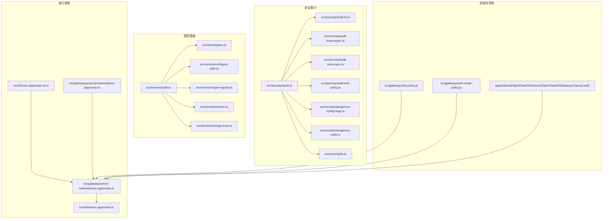
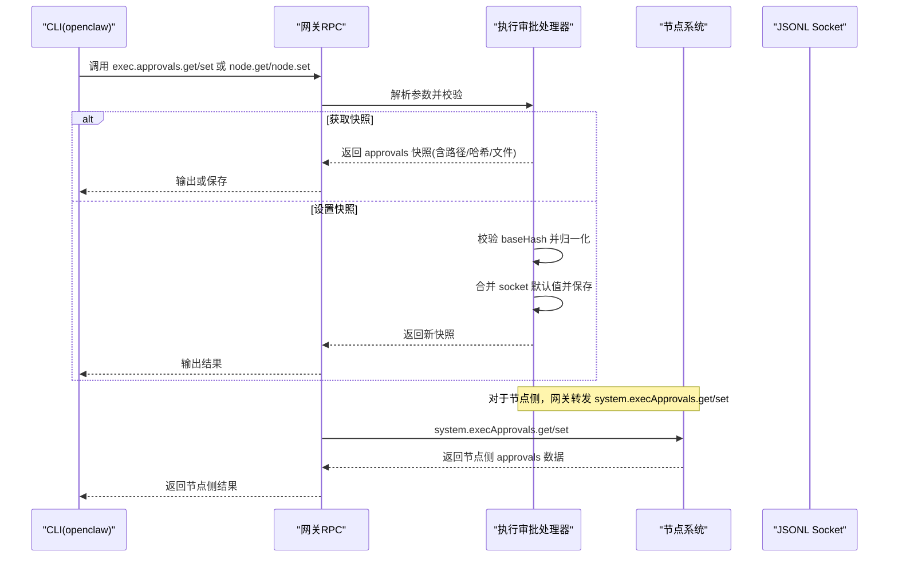
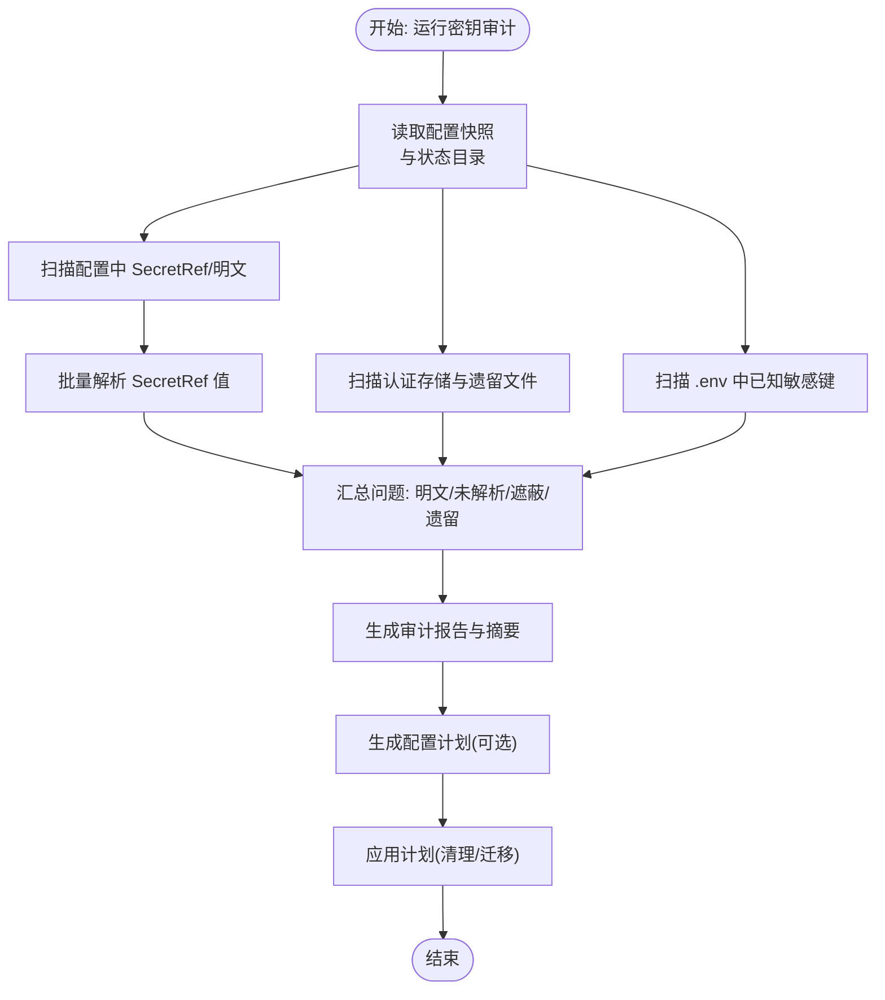
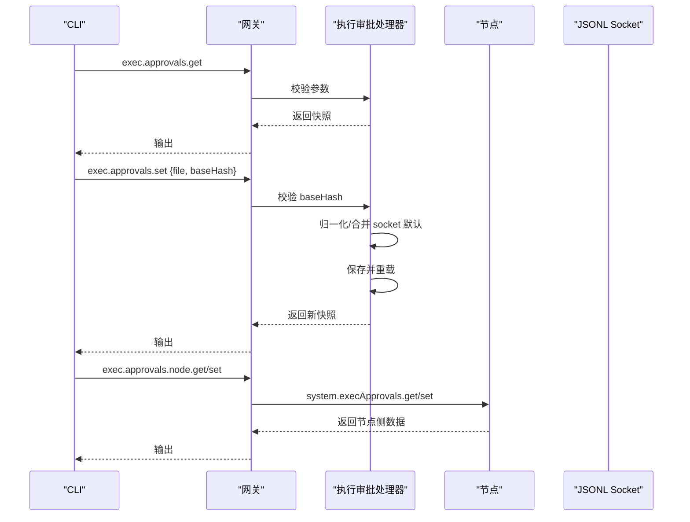
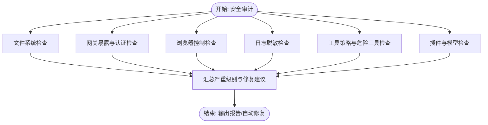
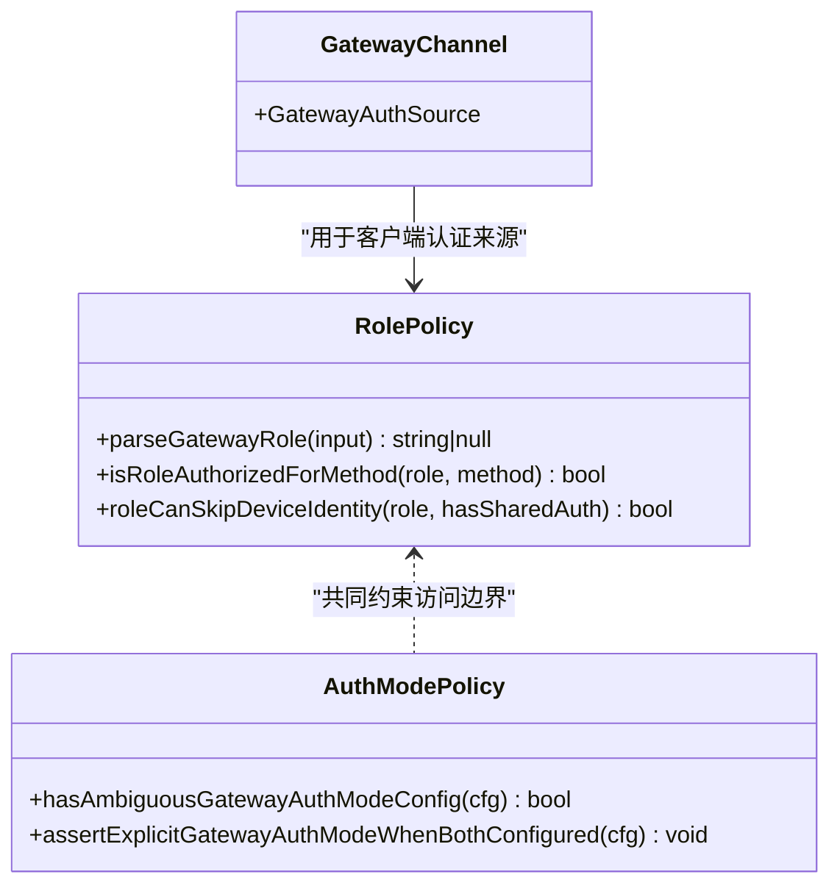
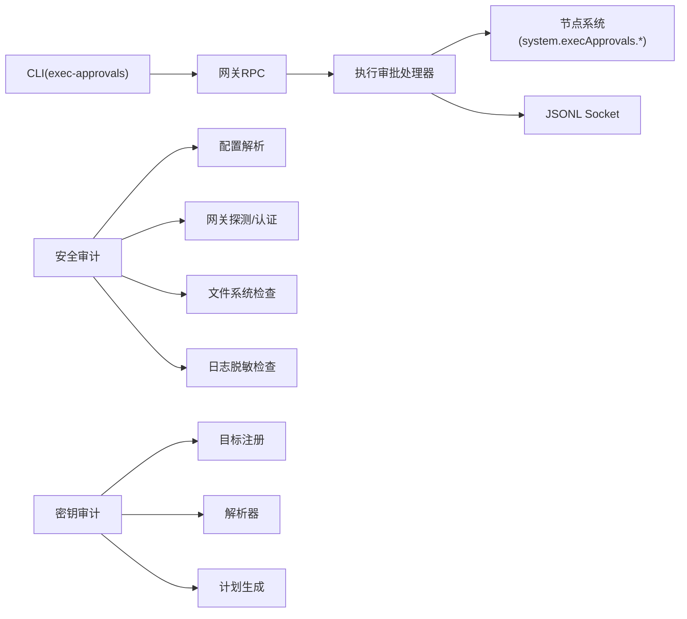

# 安全管理

<cite>
**本文引用的文件**
- [src/security/audit.ts](file://src/security/audit.ts)
- [src/security/audit.test.ts](file://src/security/audit.test.ts)
- [src/security/audit-extra.async.ts](file://src/security/audit-extra.async.ts)
- [src/security/audit-extra.sync.ts](file://src/security/audit-extra.sync.ts)
- [src/security/audit-channel.ts](file://src/security/audit-channel.ts)
- [src/security/audit-fs.ts](file://src/security/audit-fs.ts)
- [src/security/audit-tool-policy.ts](file://src/security/audit-tool-policy.ts)
- [src/security/dangerous-config-flags.ts](file://src/security/dangerous-config-flags.ts)
- [src/security/dangerous-tools.ts](file://src/security/dangerous-tools.ts)
- [src/security/fix.ts](file://src/security/fix.ts)
- [src/security/skill-scanner.ts](file://src/security/skill-scanner.ts)
- [src/security/temp-path-guard.test.ts](file://src/security/temp-path-guard.test.ts)
- [src/security/windows-acl.ts](file://src/security/windows-acl.ts)
- [src/secrets/audit.ts](file://src/secrets/audit.ts)
- [src/secrets/configure-plan.ts](file://src/secrets/configure-plan.ts)
- [src/secrets/plan.ts](file://src/secrets/plan.ts)
- [src/secrets/ref-contract.ts](file://src/secrets/ref-contract.ts)
- [src/secrets/resolve.ts](file://src/secrets/resolve.ts)
- [src/secrets/storage-scan.ts](file://src/secrets/storage-scan.ts)
- [src/secrets/target-registry.ts](file://src/secrets/target-registry.ts)
- [src/secrets/secret-value.ts](file://src/secrets/secret-value.ts)
- [src/secrets/shared.ts](file://src/secrets/shared.ts)
- [src/gateway/server-methods/exec-approvals.ts](file://src/gateway/server-methods/exec-approvals.ts)
- [src/gateway/protocol/schema/exec-approvals.ts](file://src/gateway/protocol/schema/exec-approvals.ts)
- [src/cli/exec-approvals-cli.ts](file://src/cli/exec-approvals-cli.ts)
- [src/infra/exec-approvals.ts](file://src/infra/exec-approvals.ts)
- [src/infra/exec-approvals-allowlist.ts](file://src/infra/exec-approvals-allowlist.ts)
- [src/infra/exec-approvals-analysis.ts](file://src/infra/exec-approvals-analysis.ts)
- [src/discord/monitor/exec-approvals.ts](file://src/discord/monitor/exec-approvals.ts)
- [src/discord/monitor/exec-approvals.test.ts](file://src/discord/monitor/exec-approvals.test.ts)
- [ui/src/ui/views/nodes-exec-approvals.ts](file://ui/src/ui/views/nodes-exec-approvals.ts)
- [apps/shared/OpenClawKit/Sources/OpenClawKit/GatewayChannel.swift](file://apps/shared/OpenClawKit/Sources/OpenClawKit/GatewayChannel.swift)
- [src/gateway/role-policy.js](file://src/gateway/role-policy.js)
- [src/gateway/role-policy.test.js](file://src/gateway/role-policy.test.js)
- [src/gateway/auth-mode-policy.js](file://src/gateway/auth-mode-policy.js)
- [src/gateway/auth-mode-policy.test.js](file://src/gateway/auth-mode-policy.test.js)
- [docs/cli/security.md](file://docs/cli/security.md)
- [docs/gateway/security/index.md](file://docs/gateway/security/index.md)
</cite>

## 目录
1. [简介](#简介)
2. [项目结构](#项目结构)
3. [核心组件](#核心组件)
4. [架构总览](#架构总览)
5. [详细组件分析](#详细组件分析)
6. [依赖关系分析](#依赖关系分析)
7. [性能考量](#性能考量)
8. [故障排查指南](#故障排查指南)
9. [结论](#结论)
10. [附录](#附录)

## 简介
本文件为 OpenClaw 安全管理系统提供系统化 API 文档，覆盖密钥管理、执行审批、日志审计与权限控制四大核心能力。内容基于仓库中的安全审计、密钥与计划生成、执行审批协议与服务端实现、角色与认证策略等模块，结合 CLI 与 UI 的使用场景，给出接口定义、数据流、错误处理与安全配置建议，并提供合规性最佳实践。

## 项目结构
围绕安全管理的关键目录与文件：
- 安全审计：src/security 下的审计主流程、文件系统检查、工具策略检查、危险配置标志、修复器等
- 密钥管理：src/secrets 下的密钥审计、计划生成、目标注册、解析与存储扫描
- 执行审批：src/gateway/server-methods/exec-approvals.ts、CLI 与 UI 集成、协议 schema、节点侧交互
- 权限与角色：src/gateway 下的角色策略、认证模式策略；应用层通道枚举
- 文档与指引：docs/cli/security.md、docs/gateway/security/index.md

**图表来源**
- [src/security/audit.ts](file://src/security/audit.ts#L1-L1254)
- [src/security/audit-fs.ts](file://src/security/audit-fs.ts)
- [src/security/audit-extra.async.ts](file://src/security/audit-extra.async.ts#L1095-L1137)
- [src/security/audit-extra.sync.ts](file://src/security/audit-extra.sync.ts#L1070-L1105)
- [src/security/audit-tool-policy.ts](file://src/security/audit-tool-policy.ts)
- [src/security/dangerous-config-flags.ts](file://src/security/dangerous-config-flags.ts)
- [src/security/dangerous-tools.ts](file://src/security/dangerous-tools.ts)
- [src/security/fix.ts](file://src/security/fix.ts)
- [src/secrets/audit.ts](file://src/secrets/audit.ts#L1-L551)
- [src/secrets/plan.ts](file://src/secrets/plan.ts#L1-L196)
- [src/secrets/configure-plan.ts](file://src/secrets/configure-plan.ts#L227-L259)
- [src/secrets/target-registry.ts](file://src/secrets/target-registry.ts)
- [src/secrets/resolve.ts](file://src/secrets/resolve.ts)
- [src/secrets/storage-scan.ts](file://src/secrets/storage-scan.ts)
- [src/gateway/server-methods/exec-approvals.ts](file://src/gateway/server-methods/exec-approvals.ts#L1-L194)
- [src/gateway/protocol/schema/exec-approvals.ts](file://src/gateway/protocol/schema/exec-approvals.ts#L124-L130)
- [src/cli/exec-approvals-cli.ts](file://src/cli/exec-approvals-cli.ts#L1-L483)
- [src/infra/exec-approvals.ts](file://src/infra/exec-approvals.ts#L1-L557)
- [src/gateway/role-policy.js](file://src/gateway/role-policy.js)
- [src/gateway/auth-mode-policy.js](file://src/gateway/auth-mode-policy.js)
- [apps/shared/OpenClawKit/Sources/OpenClawKit/GatewayChannel.swift](file://apps/shared/OpenClawKit/Sources/OpenClawKit/GatewayChannel.swift#L112-L132)

**章节来源**
- [src/security/audit.ts](file://src/security/audit.ts#L1-L1254)
- [src/secrets/audit.ts](file://src/secrets/audit.ts#L1-L551)
- [src/gateway/server-methods/exec-approvals.ts](file://src/gateway/server-methods/exec-approvals.ts#L1-L194)
- [src/cli/exec-approvals-cli.ts](file://src/cli/exec-approvals-cli.ts#L1-L483)
- [src/infra/exec-approvals.ts](file://src/infra/exec-approvals.ts#L1-L557)
- [src/gateway/role-policy.js](file://src/gateway/role-policy.js)
- [src/gateway/auth-mode-policy.js](file://src/gateway/auth-mode-policy.js)
- [apps/shared/OpenClawKit/Sources/OpenClawKit/GatewayChannel.swift](file://apps/shared/OpenClawKit/Sources/OpenClawKit/GatewayChannel.swift#L112-L132)
- [docs/cli/security.md](file://docs/cli/security.md#L1-L72)
- [docs/gateway/security/index.md](file://docs/gateway/security/index.md#L1-L800)

## 核心组件
- 安全审计引擎：对配置、文件系统、网关暴露面、浏览器控制、日志脱敏、插件与模型等进行综合扫描，输出严重级别与修复建议
- 密钥审计与迁移：扫描明文、未解析引用、配置与认证存储中的残留、提供计划（Plan）以安全地迁移至 SecretRef
- 执行审批：通过 JSONL Socket 与网关/节点交互，支持默认策略、代理 ask、允许清单与持久化
- 权限与角色：基于角色授权方法、设备身份豁免规则与认证模式策略，确保最小权限与明确边界

**章节来源**
- [src/security/audit.ts](file://src/security/audit.ts#L1-L1254)
- [src/secrets/audit.ts](file://src/secrets/audit.ts#L1-L551)
- [src/gateway/server-methods/exec-approvals.ts](file://src/gateway/server-methods/exec-approvals.ts#L1-L194)
- [src/infra/exec-approvals.ts](file://src/infra/exec-approvals.ts#L1-L557)
- [src/gateway/role-policy.js](file://src/gateway/role-policy.js)
- [src/gateway/auth-mode-policy.js](file://src/gateway/auth-mode-policy.js)

## 架构总览
下图展示从 CLI 到网关再到节点的执行审批调用链路，以及安全审计与密钥管理在系统中的位置。

**图表来源**
- [src/cli/exec-approvals-cli.ts](file://src/cli/exec-approvals-cli.ts#L54-L90)
- [src/gateway/server-methods/exec-approvals.ts](file://src/gateway/server-methods/exec-approvals.ts#L98-L194)
- [src/infra/exec-approvals.ts](file://src/infra/exec-approvals.ts#L526-L557)

## 详细组件分析

### 密钥管理与审计 API
- 密钥审计运行流程
  - 读取配置快照与状态目录，扫描 openclaw.json、auth-profiles.json、legacy auth.json、.env 等
  - 发现明文、未解析引用、提供者遮蔽（配置被认证存储覆盖）、遗留残留
  - 支持按提供者聚合引用路径，统计各类问题数量，输出报告
- 计划生成与应用
  - 通过 configure-plan 生成包含 targets、provider upserts/deletes 与 scrub 选项的 Apply Plan
  - plan 校验确保类型正确、路径段合法、提供者别名有效
  - 应用时可选择清理环境变量、认证存储与遗留文件

**图表来源**
- [src/secrets/audit.ts](file://src/secrets/audit.ts#L464-L551)
- [src/secrets/configure-plan.ts](file://src/secrets/configure-plan.ts#L227-L259)
- [src/secrets/plan.ts](file://src/secrets/plan.ts#L108-L196)

**章节来源**
- [src/secrets/audit.ts](file://src/secrets/audit.ts#L1-L551)
- [src/secrets/configure-plan.ts](file://src/secrets/configure-plan.ts#L227-L259)
- [src/secrets/plan.ts](file://src/secrets/plan.ts#L1-L196)
- [src/secrets/target-registry.ts](file://src/secrets/target-registry.ts)
- [src/secrets/resolve.ts](file://src/secrets/resolve.ts)
- [src/secrets/storage-scan.ts](file://src/secrets/storage-scan.ts)

### 执行审批 API
- 网关 RPC 方法
  - exec.approvals.get：获取 approvals 快照（含路径、存在性、哈希、文件）
  - exec.approvals.set：设置 approvals 文件，需携带 baseHash 校验并发一致性
  - exec.approvals.node.get/set：针对节点侧的 approvals 读写，通过节点注册表转发
- CLI 行为
  - 支持本地/网关/节点三种目标，自动加载快照、渲染摘要与允许清单、保存变更
  - 支持 allowlist 添加/移除、按 agent 与通配符作用域编辑
- 协议与数据模型
  - ExecApprovalsFile 包含版本、socket、defaults、agents
  - 允许清单条目包含 pattern、lastUsedAt 等字段
  - 决策类型包括 allow-once、allow-always、deny
- 节点侧交互
  - 通过 JSONL Socket 与网关通信，令牌校验，超时控制
  - 支持 ask 与 security 策略组合决定是否需要审批

**图表来源**
- [src/gateway/server-methods/exec-approvals.ts](file://src/gateway/server-methods/exec-approvals.ts#L98-L194)
- [src/cli/exec-approvals-cli.ts](file://src/cli/exec-approvals-cli.ts#L54-L90)
- [src/infra/exec-approvals.ts](file://src/infra/exec-approvals.ts#L526-L557)

**章节来源**
- [src/gateway/server-methods/exec-approvals.ts](file://src/gateway/server-methods/exec-approvals.ts#L1-L194)
- [src/gateway/protocol/schema/exec-approvals.ts](file://src/gateway/protocol/schema/exec-approvals.ts#L124-L130)
- [src/cli/exec-approvals-cli.ts](file://src/cli/exec-approvals-cli.ts#L1-L483)
- [src/infra/exec-approvals.ts](file://src/infra/exec-approvals.ts#L1-L557)
- [src/discord/monitor/exec-approvals.ts](file://src/discord/monitor/exec-approvals.ts)
- [src/discord/monitor/exec-approvals.test.ts](file://src/discord/monitor/exec-approvals.test.ts#L157-L187)
- [ui/src/ui/views/nodes-exec-approvals.ts](file://ui/src/ui/views/nodes-exec-approvals.ts#L337-L351)

### 日志审计与安全策略
- 安全审计范围
  - 文件系统权限（state/config/auth 等）
  - 网关绑定与认证（bind/no_auth、loopback_no_auth、trusted_proxy）
  - 浏览器控制暴露（remote CDP、无认证）
  - 日志脱敏（logging.redactSensitive）
  - 工具策略与危险工具（tools.allow 重启用、node 命令允许）
  - 插件与模型风险
- CLI 与文档指引
  - openclaw security audit 提供 --deep、--fix、--json 等选项
  - 文档列出常见 checkId 及修复建议，强调“个人助理信任模型”

**图表来源**
- [src/security/audit.ts](file://src/security/audit.ts#L208-L800)
- [src/security/audit-extra.async.ts](file://src/security/audit-extra.async.ts#L1095-L1137)
- [src/security/audit-extra.sync.ts](file://src/security/audit-extra.sync.ts#L1070-L1105)
- [docs/cli/security.md](file://docs/cli/security.md#L1-L72)
- [docs/gateway/security/index.md](file://docs/gateway/security/index.md#L223-L261)

**章节来源**
- [src/security/audit.ts](file://src/security/audit.ts#L1-L1254)
- [src/security/audit-extra.async.ts](file://src/security/audit-extra.async.ts#L1095-L1137)
- [src/security/audit-extra.sync.ts](file://src/security/audit-extra.sync.ts#L1070-L1105)
- [src/security/audit-channel.ts](file://src/security/audit-channel.ts)
- [src/security/audit-fs.ts](file://src/security/audit-fs.ts)
- [src/security/audit-tool-policy.ts](file://src/security/audit-tool-policy.ts)
- [src/security/dangerous-config-flags.ts](file://src/security/dangerous-config-flags.ts)
- [src/security/dangerous-tools.ts](file://src/security/dangerous-tools.ts)
- [src/security/fix.ts](file://src/security/fix.ts)
- [docs/cli/security.md](file://docs/cli/security.md#L1-L72)
- [docs/gateway/security/index.md](file://docs/gateway/security/index.md#L1-L800)

### 权限控制与角色策略
- 角色授权
  - 支持 operator 与 node 角色，不同角色对方法有不同授权
  - 设备身份豁免仅在 operator 且共享认证时允许
- 认证模式策略
  - 当同时配置 token 与 password 且未显式指定 mode 时视为歧义，需明确 mode
- 应用层通道
  - GatewayChannel 定义了 device-token/shared-token/password/none 等认证来源

**图表来源**
- [src/gateway/role-policy.js](file://src/gateway/role-policy.js)
- [src/gateway/role-policy.test.js](file://src/gateway/role-policy.test.js#L1-L28)
- [src/gateway/auth-mode-policy.js](file://src/gateway/auth-mode-policy.js)
- [src/gateway/auth-mode-policy.test.js](file://src/gateway/auth-mode-policy.test.js#L1-L44)
- [apps/shared/OpenClawKit/Sources/OpenClawKit/GatewayChannel.swift](file://apps/shared/OpenClawKit/Sources/OpenClawKit/GatewayChannel.swift#L112-L132)

**章节来源**
- [src/gateway/role-policy.js](file://src/gateway/role-policy.js)
- [src/gateway/role-policy.test.js](file://src/gateway/role-policy.test.js#L1-L28)
- [src/gateway/auth-mode-policy.js](file://src/gateway/auth-mode-policy.js)
- [src/gateway/auth-mode-policy.test.js](file://src/gateway/auth-mode-policy.test.js#L1-L44)
- [apps/shared/OpenClawKit/Sources/OpenClawKit/GatewayChannel.swift](file://apps/shared/OpenClawKit/Sources/OpenClawKit/GatewayChannel.swift#L112-L132)

## 依赖关系分析
- 组件耦合
  - 安全审计依赖配置解析、网关探测、通道插件、Docker 与 Windows ACL 检查
  - 密钥审计依赖目标注册、解析器、存储扫描与计划生成
  - 执行审批依赖 CLI、协议 schema、节点注册表与 JSONL Socket
- 外部集成
  - CLI 与网关 RPC 交互，节点侧通过 system.execApprovals.* 方法对接
  - 应用层（Swift）定义认证来源，影响客户端行为与信任边界

**图表来源**
- [src/cli/exec-approvals-cli.ts](file://src/cli/exec-approvals-cli.ts#L1-L483)
- [src/gateway/server-methods/exec-approvals.ts](file://src/gateway/server-methods/exec-approvals.ts#L1-L194)
- [src/infra/exec-approvals.ts](file://src/infra/exec-approvals.ts#L526-L557)
- [src/security/audit.ts](file://src/security/audit.ts#L1-L1254)
- [src/secrets/audit.ts](file://src/secrets/audit.ts#L1-L551)

**章节来源**
- [src/cli/exec-approvals-cli.ts](file://src/cli/exec-approvals-cli.ts#L1-L483)
- [src/gateway/server-methods/exec-approvals.ts](file://src/gateway/server-methods/exec-approvals.ts#L1-L194)
- [src/infra/exec-approvals.ts](file://src/infra/exec-approvals.ts#L1-L557)
- [src/security/audit.ts](file://src/security/audit.ts#L1-L1254)
- [src/secrets/audit.ts](file://src/secrets/audit.ts#L1-L551)

## 性能考量
- 审计扫描
  - 文件系统与配置快照读取为 IO 密集；可通过缓存与并发任务优化
  - 深度探测（live probe）受网络与外部服务影响，建议限制超时
- 密钥解析
  - 批量解析 SecretRef 采用并发限制，避免阻塞
- 执行审批
  - JSONL Socket 请求带超时，避免长时间阻塞
- 建议
  - 在 CI 中使用 --json 与 --check，结合自动化修复脚本
  - 将高成本扫描（如 deep）按需触发

[本节为通用指导，无需特定文件引用]

## 故障排查指南
- 安全审计
  - 关注 critical/warn 级别发现，优先处理暴露面与权限问题
  - 使用 --fix 自动收紧权限与默认策略，注意不旋转密钥
- 密钥审计
  - 若出现 REF_UNRESOLVED，检查提供者配置与环境变量
  - LEGACY_RESIDUE 提示遗留文件仍存在，按计划清理
- 执行审批
  - set 失败多因 baseHash 不匹配，先 get 再 set
  - 节点侧无响应时检查 system.execApprovals.* 是否启用与 socket 权限
- 权限与角色
  - 认证模式歧义报错时明确 gateway.auth.mode
  - 设备身份豁免仅适用于 operator 且共享认证

**章节来源**
- [src/security/audit.ts](file://src/security/audit.ts#L1-L1254)
- [src/security/audit.test.ts](file://src/security/audit.test.ts#L593-L643)
- [src/secrets/audit.ts](file://src/secrets/audit.ts#L1-L551)
- [src/gateway/server-methods/exec-approvals.ts](file://src/gateway/server-methods/exec-approvals.ts#L27-L70)
- [src/gateway/auth-mode-policy.js](file://src/gateway/auth-mode-policy.js)
- [src/gateway/role-policy.js](file://src/gateway/role-policy.js)

## 结论
OpenClaw 的安全管理以“访问控制优先于智能”为核心理念，通过安全审计、密钥审计与迁移、执行审批与权限策略，形成闭环的安全治理。建议在生产环境中：
- 定期运行 openclaw security audit，结合 --fix 与 --json 实施自动化加固
- 使用 SecretRef 替代明文，配合 configure-plan 安全迁移
- 严格控制执行审批策略，最小化 ask 与 security 级别
- 明确角色与认证模式，避免歧义与过度暴露

[本节为总结，无需特定文件引用]

## 附录
- API 调用示例（路径参考）
  - 获取执行审批快照：openclaw approvals get [--node <id>|--gateway]
  - 设置执行审批快照：openclaw approvals set --file <path> 或 --stdin
  - 编辑允许清单：openclaw approvals allowlist add/remove <pattern> [--agent <id>]
- 安全配置指南
  - 网络暴露：优先 loopback，必要时使用 Tailscale Serve 并严格 allowlist
  - 认证：使用长随机 token，避免明文密码；明确 auth.mode
  - 日志：开启 logging.redactSensitive，限制日志文件权限
  - 工具：默认 deny 控制平面与高危工具，按需放开
- 合规性最佳实践
  - 个人助理信任模型：单用户/单边界，避免多租户共享
  - 共享 Inbox：使用 per-channel-peer DM 隔离，避免 broad 工具访问
  - 插件与模型：仅信任来源，定期审查与更新

**章节来源**
- [src/cli/exec-approvals-cli.ts](file://src/cli/exec-approvals-cli.ts#L359-L483)
- [docs/cli/security.md](file://docs/cli/security.md#L1-L72)
- [docs/gateway/security/index.md](file://docs/gateway/security/index.md#L145-L800)